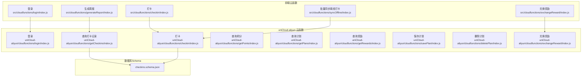
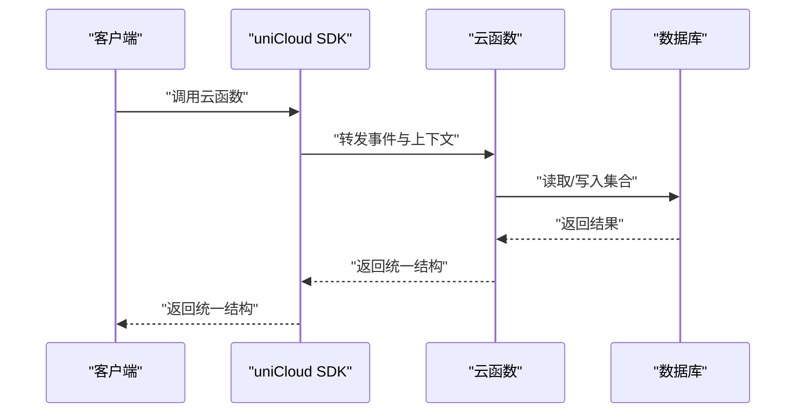
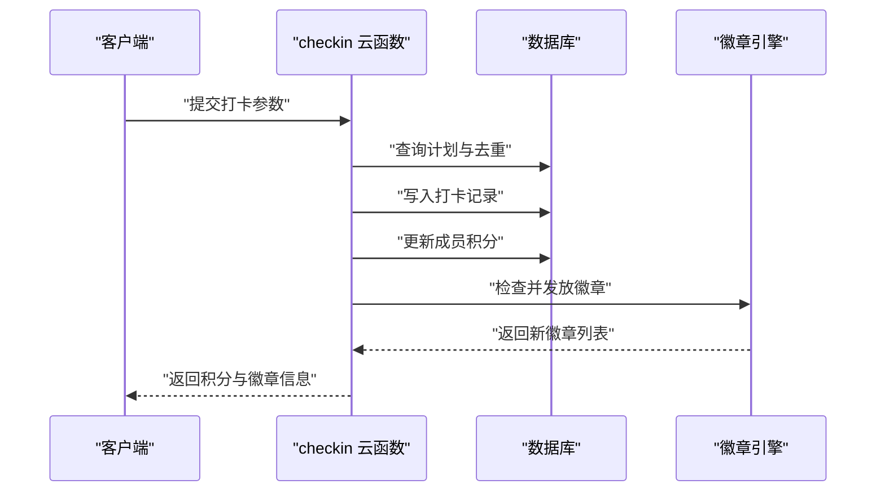
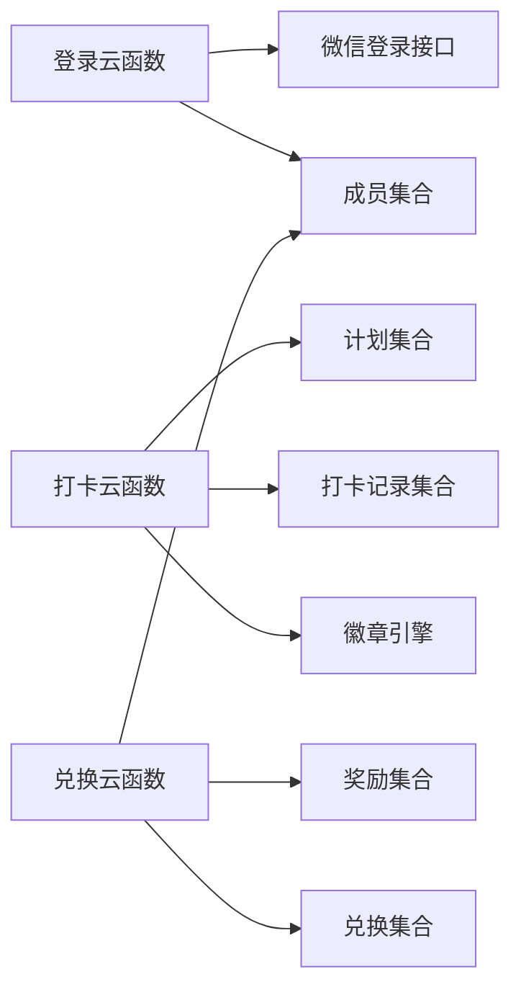

# API接口文档

<cite>
**本文档引用的文件**
- [src/cloudfunctions/login/index.js](file://src/cloudfunctions/login/index.js)
- [src/cloudfunctions/checkin/index.js](file://src/cloudfunctions/checkin/index.js)
- [src/cloudfunctions/exchangeReward/index.js](file://src/cloudfunctions/exchangeReward/index.js)
- [src/cloudfunctions/generateReport/index.js](file://src/cloudfunctions/generateReport/index.js)
- [src/cloudfunctions/syncOffline/index.js](file://src/cloudfunctions/syncOffline/index.js)
- [uniCloud-aliyun/cloudfunctions/checkin/index.js](file://uniCloud-aliyun/cloudfunctions/checkin/index.js)
- [uniCloud-aliyun/cloudfunctions/login/index.js](file://uniCloud-aliyun/cloudfunctions/login/index.js)
- [uniCloud-aliyun/cloudfunctions/getCheckins/index.js](file://uniCloud-aliyun/cloudfunctions/getCheckins/index.js)
- [uniCloud-aliyun/cloudfunctions/getPoints/index.js](file://uniCloud-aliyun/cloudfunctions/getPoints/index.js)
- [uniCloud-aliyun/cloudfunctions/getPlans/index.js](file://uniCloud-aliyun/cloudfunctions/getPlans/index.js)
- [uniCloud-aliyun/cloudfunctions/getRewards/index.js](file://uniCloud-aliyun/cloudfunctions/getRewards/index.js)
- [uniCloud-aliyun/cloudfunctions/savePlan/index.js](file://uniCloud-aliyun/cloudfunctions/savePlan/index.js)
- [uniCloud-aliyun/cloudfunctions/deletePlan/index.js](file://uniCloud-aliyun/cloudfunctions/deletePlan/index.js)
- [uniCloud-aliyun/cloudfunctions/exchangeReward/index.js](file://uniCloud-aliyun/cloudfunctions/exchangeReward/index.js)
- [uniCloud-aliyun/database/checkins.schema.json](file://uniCloud-aliyun/database/checkins.schema.json)
</cite>

## 目录
1. [简介](#简介)
2. [项目结构](#项目结构)
3. [核心组件](#核心组件)
4. [架构总览](#架构总览)
5. [详细组件分析](#详细组件分析)
6. [依赖关系分析](#依赖关系分析)
7. [性能考量](#性能考量)
8. [故障排查指南](#故障排查指南)
9. [结论](#结论)
10. [附录](#附录)

## 简介
本文件为 Star Grow 项目的完整 API 接口文档，覆盖云函数 API 的 HTTP 方法、URL 模式、请求参数、响应格式与错误处理机制。文档同时提供参数说明、数据类型、验证规则、请求与响应示例、错误码语义、版本管理与兼容策略、最佳实践与性能优化建议，以及安全与权限控制说明，帮助开发者准确理解与使用所有 API。

## 项目结构
- 前端云函数（src/cloudfunctions）：用于演示与轻量逻辑，当前多数为占位实现，便于快速迭代。
- uniCloud-aliyun 云函数：生产级实现，包含登录、打卡、计划、积分、奖励、报表等完整业务流程。
- 数据库 Schema：定义集合字段约束与权限，如打卡记录集合的必填项与字段类型。

图表来源
- [src/cloudfunctions/login/index.js:1-13](file://src/cloudfunctions/login/index.js#L1-L13)
- [src/cloudfunctions/checkin/index.js:1-142](file://src/cloudfunctions/checkin/index.js#L1-L142)
- [src/cloudfunctions/exchangeReward/index.js:1-28](file://src/cloudfunctions/exchangeReward/index.js#L1-L28)
- [src/cloudfunctions/generateReport/index.js:1-33](file://src/cloudfunctions/generateReport/index.js#L1-L33)
- [src/cloudfunctions/syncOffline/index.js:1-20](file://src/cloudfunctions/syncOffline/index.js#L1-L20)
- [uniCloud-aliyun/cloudfunctions/login/index.js:1-103](file://uniCloud-aliyun/cloudfunctions/login/index.js#L1-L103)
- [uniCloud-aliyun/cloudfunctions/checkin/index.js:1-83](file://uniCloud-aliyun/cloudfunctions/checkin/index.js#L1-L83)
- [uniCloud-aliyun/cloudfunctions/getCheckins/index.js:1-19](file://uniCloud-aliyun/cloudfunctions/getCheckins/index.js#L1-L19)
- [uniCloud-aliyun/cloudfunctions/getPoints/index.js:1-18](file://uniCloud-aliyun/cloudfunctions/getPoints/index.js#L1-L18)
- [uniCloud-aliyun/cloudfunctions/getPlans/index.js:1-15](file://uniCloud-aliyun/cloudfunctions/getPlans/index.js#L1-L15)
- [uniCloud-aliyun/cloudfunctions/getRewards/index.js:1-18](file://uniCloud-aliyun/cloudfunctions/getRewards/index.js#L1-L18)
- [uniCloud-aliyun/cloudfunctions/savePlan/index.js:1-31](file://uniCloud-aliyun/cloudfunctions/savePlan/index.js#L1-L31)
- [uniCloud-aliyun/cloudfunctions/deletePlan/index.js:1-25](file://uniCloud-aliyun/cloudfunctions/deletePlan/index.js#L1-L25)
- [uniCloud-aliyun/cloudfunctions/exchangeReward/index.js:1-53](file://uniCloud-aliyun/cloudfunctions/exchangeReward/index.js#L1-L53)
- [uniCloud-aliyun/database/checkins.schema.json:1-52](file://uniCloud-aliyun/database/checkins.schema.json#L1-L52)

章节来源
- [src/cloudfunctions/login/index.js:1-13](file://src/cloudfunctions/login/index.js#L1-L13)
- [uniCloud-aliyun/cloudfunctions/login/index.js:1-103](file://uniCloud-aliyun/cloudfunctions/login/index.js#L1-L103)

## 核心组件
- 登录认证：支持微信登录与白名单校验，返回成员信息；提供前端与生产级两套实现。
- 计划管理：创建/更新/删除计划，按家庭维度隔离。
- 打卡记录：单次打卡与批量离线同步，含连续打卡加成与勋章发放。
- 积分查询：查询成员当前与累计积分。
- 奖励兑换：校验积分、扣减积分、库存检查、创建兑换记录。
- 报表生成：按周统计与家长指导建议。

章节来源
- [uniCloud-aliyun/cloudfunctions/checkin/index.js:1-83](file://uniCloud-aliyun/cloudfunctions/checkin/index.js#L1-L83)
- [uniCloud-aliyun/cloudfunctions/getPoints/index.js:1-18](file://uniCloud-aliyun/cloudfunctions/getPoints/index.js#L1-L18)
- [uniCloud-aliyun/cloudfunctions/exchangeReward/index.js:1-53](file://uniCloud-aliyun/cloudfunctions/exchangeReward/index.js#L1-L53)
- [uniCloud-aliyun/cloudfunctions/getCheckins/index.js:1-19](file://uniCloud-aliyun/cloudfunctions/getCheckins/index.js#L1-L19)
- [uniCloud-aliyun/cloudfunctions/getPlans/index.js:1-15](file://uniCloud-aliyun/cloudfunctions/getPlans/index.js#L1-L15)
- [uniCloud-aliyun/cloudfunctions/savePlan/index.js:1-31](file://uniCloud-aliyun/cloudfunctions/savePlan/index.js#L1-L31)
- [uniCloud-aliyun/cloudfunctions/deletePlan/index.js:1-25](file://uniCloud-aliyun/cloudfunctions/deletePlan/index.js#L1-L25)

## 架构总览
- 前端通过 uniCloud SDK 调用云函数，云函数访问 uniCloud 数据库与第三方服务（如微信登录）。
- 生产级 API 在 uniCloud-aliyun 下实现，具备更完善的业务逻辑与数据校验。
- 数据库 Schema 对关键集合进行字段约束与权限声明，保障数据一致性与安全性。

图表来源
- [uniCloud-aliyun/cloudfunctions/login/index.js:1-103](file://uniCloud-aliyun/cloudfunctions/login/index.js#L1-L103)
- [uniCloud-aliyun/cloudfunctions/checkin/index.js:1-83](file://uniCloud-aliyun/cloudfunctions/checkin/index.js#L1-L83)
- [uniCloud-aliyun/cloudfunctions/exchangeReward/index.js:1-53](file://uniCloud-aliyun/cloudfunctions/exchangeReward/index.js#L1-L53)

## 详细组件分析

### 用户认证接口
- 功能：支持微信登录与白名单校验，返回成员信息。
- URL 模式：通过 uniCloud SDK 调用云函数名 login。
- HTTP 方法：POST（通过 uniCloud SDK 调用）。
- 请求参数
  - code: 字符串，必填，微信登录临时凭证。
  - nickname: 字符串，可选，用户昵称。
  - role: 字符串，可选，角色（child/parent/admin）。
  - memberId: 字符串，可选，成员ID（若传入则优先更新）。
  - avatarUrl: 字符串，可选，头像地址。
- 响应格式
  - success: 布尔值，成功标志。
  - data: 成员对象，包含 openId、family_id、current_points、total_points 等。
  - error: 字符串，错误信息（可选）。
- 错误处理
  - 微信登录失败：返回错误信息。
  - 白名单拒绝：返回特定错误码与消息。
- 请求示例
  - POST /login
  - Body: { "code": "临时登录凭证", "nickname": "张三", "role": "child" }
- 响应示例
  - { "success": true, "data": { "openId": "...", "family_id": "family_...", "current_points": 0, "total_points": 0 } }

章节来源
- [uniCloud-aliyun/cloudfunctions/login/index.js:1-103](file://uniCloud-aliyun/cloudfunctions/login/index.js#L1-L103)

### 计划管理接口
- 保存计划
  - URL 模式：通过 uniCloud SDK 调用云函数名 savePlan。
  - HTTP 方法：POST。
  - 请求参数
    - _id: 字符串，可选，更新时使用。
    - title: 字符串，必填，计划标题。
    - description: 字符串，可选，描述。
    - family_id: 字符串，必填，家庭标识。
    - points_per_check: 整数，可选，默认10。
    - category: 字符串，可选，默认other。
    - icon: 字符串，可选，图标。
  - 响应格式：返回保存后的计划对象。
- 删除计划
  - URL 模式：通过 uniCloud SDK 调用云函数名 deletePlan。
  - HTTP 方法：POST。
  - 请求参数
    - plan_id: 字符串，必填，计划ID。
    - family_id: 字符串，可选，用于越权校验。
  - 响应格式：返回操作结果。
- 查询计划
  - URL 模式：通过 uniCloud SDK 调用云函数名 getPlans。
  - HTTP 方法：GET。
  - 请求参数
    - family_id: 字符串，必填，家庭标识。
  - 响应格式：返回计划数组。

章节来源
- [uniCloud-aliyun/cloudfunctions/savePlan/index.js:1-31](file://uniCloud-aliyun/cloudfunctions/savePlan/index.js#L1-L31)
- [uniCloud-aliyun/cloudfunctions/deletePlan/index.js:1-25](file://uniCloud-aliyun/cloudfunctions/deletePlan/index.js#L1-L25)
- [uniCloud-aliyun/cloudfunctions/getPlans/index.js:1-15](file://uniCloud-aliyun/cloudfunctions/getPlans/index.js#L1-L15)

### 打卡记录接口
- 单次打卡
  - URL 模式：通过 uniCloud SDK 调用云函数名 checkin。
  - HTTP 方法：POST。
  - 请求参数
    - plan_id: 字符串，必填，计划ID。
    - child_id: 字符串，必填，孩子成员ID。
    - date: 字符串，必填，日期 YYYY-MM-DD。
    - feeling: 字符串，可选，感受。
    - checked_by: 字符串，可选，self/parent，默认parent。
  - 响应格式
    - success: 布尔值。
    - data: 打卡结果对象，包含 points_earned、bonus_points、bonus_type、total_today、new_badges、current_streak 等。
    - error: 字符串，错误信息（可选）。
  - 错误处理：重复打卡、系统异常等。
- 查询打卡记录
  - URL 模式：通过 uniCloud SDK 调用云函数名 getCheckins。
  - HTTP 方法：GET。
  - 请求参数
    - child_id: 字符串，必填。
    - date: 字符串，可选，精确日期。
    - week_start: 字符串，可选，周起始日期。
  - 响应格式：返回打卡记录数组。
- 批量同步离线打卡
  - URL 模式：通过 uniCloud SDK 调用云函数名 syncOffline。
  - HTTP 方法：POST。
  - 请求参数
    - child_id: 字符串，必填。
    - checkins: 数组，必填，每项包含 plan_id、date、feeling、checked_by。
  - 响应格式：返回同步统计与新增徽章。

图表来源
- [uniCloud-aliyun/cloudfunctions/checkin/index.js:1-83](file://uniCloud-aliyun/cloudfunctions/checkin/index.js#L1-L83)

章节来源
- [uniCloud-aliyun/cloudfunctions/checkin/index.js:1-83](file://uniCloud-aliyun/cloudfunctions/checkin/index.js#L1-L83)
- [uniCloud-aliyun/cloudfunctions/getCheckins/index.js:1-19](file://uniCloud-aliyun/cloudfunctions/getCheckins/index.js#L1-L19)
- [src/cloudfunctions/syncOffline/index.js:1-20](file://src/cloudfunctions/syncOffline/index.js#L1-L20)

### 积分查询接口
- URL 模式：通过 uniCloud SDK 调用云函数名 getPoints。
- HTTP 方法：GET。
- 请求参数
  - member_id: 字符串，必填，成员ID。
- 响应格式
  - success: 布尔值。
  - data: { current_points: 整数, total_points: 整数 }。

章节来源
- [uniCloud-aliyun/cloudfunctions/getPoints/index.js:1-18](file://uniCloud-aliyun/cloudfunctions/getPoints/index.js#L1-L18)

### 奖励兑换接口
- URL 模式：通过 uniCloud SDK 调用云函数名 exchangeReward。
- HTTP 方法：POST。
- 请求参数
  - reward_id: 字符串，必填，奖励ID。
  - child_id: 字符串，必填，孩子成员ID。
  - family_id: 字符串，可选，家庭ID。
- 响应格式
  - success: 布尔值。
  - data: 兑换记录对象，包含 reward_id、child_id、points_spent、status 等。
  - error: 字符串，错误信息（可选）。
- 错误处理：奖励不存在、积分不足、库存不足等。

章节来源
- [uniCloud-aliyun/cloudfunctions/exchangeReward/index.js:1-53](file://uniCloud-aliyun/cloudfunctions/exchangeReward/index.js#L1-L53)

### 报表生成接口
- URL 模式：通过 uniCloud SDK 调用云函数名 generateReport。
- HTTP 方法：POST。
- 请求参数
  - child_id: 字符串，必填。
  - week_start: 字符串，必填，周起始日期。
- 响应格式
  - success: 布尔值。
  - data: 报表对象，包含 week_start、stats、category_breakdown、badges_unlocked、parent_tip 等。

章节来源
- [src/cloudfunctions/generateReport/index.js:1-33](file://src/cloudfunctions/generateReport/index.js#L1-L33)

## 依赖关系分析
- 云函数间依赖
  - 登录云函数依赖 uniID 与微信登录接口。
  - 打卡云函数依赖徽章引擎与数据库集合。
  - 兑换云函数依赖成员与奖励集合。
- 数据库依赖
  - 打卡记录集合具有必填字段与类型约束，确保数据一致性。
  - 计划、成员、奖励、兑换等集合通过外键关联（逻辑上）。

图表来源
- [uniCloud-aliyun/cloudfunctions/login/index.js:1-103](file://uniCloud-aliyun/cloudfunctions/login/index.js#L1-L103)
- [uniCloud-aliyun/cloudfunctions/checkin/index.js:1-83](file://uniCloud-aliyun/cloudfunctions/checkin/index.js#L1-L83)
- [uniCloud-aliyun/cloudfunctions/exchangeReward/index.js:1-53](file://uniCloud-aliyun/cloudfunctions/exchangeReward/index.js#L1-L53)
- [uniCloud-aliyun/database/checkins.schema.json:1-52](file://uniCloud-aliyun/database/checkins.schema.json#L1-L52)

## 性能考量
- 批量操作：批量同步离线打卡时应逐条处理并去重，避免重复写入。
- 查询优化：按日期范围与 child_id 建立索引，减少全表扫描。
- 幂等性：同步接口需保证重复调用不产生副作用。
- 缓存策略：对常用查询结果进行短期缓存，降低数据库压力。
- 异步处理：复杂报表生成可在后台异步执行，避免阻塞请求。

## 故障排查指南
- 常见错误与处理
  - 重复打卡：检查当日是否已有记录，避免重复写入。
  - 积分不足：在兑换前校验成员当前积分。
  - 奖励不存在：确认奖励ID与状态。
  - 白名单拒绝：检查 openId 是否在白名单中。
- 日志与追踪
  - 记录关键路径日志，定位异常点。
  - 统一错误响应结构，便于前端处理。
- 状态码与语义
  - 2xx：成功。
  - 4xx：参数错误、权限不足、资源不存在等。
  - 5xx：服务器内部错误。

章节来源
- [uniCloud-aliyun/cloudfunctions/checkin/index.js:1-83](file://uniCloud-aliyun/cloudfunctions/checkin/index.js#L1-L83)
- [uniCloud-aliyun/cloudfunctions/exchangeReward/index.js:1-53](file://uniCloud-aliyun/cloudfunctions/exchangeReward/index.js#L1-L53)
- [uniCloud-aliyun/cloudfunctions/login/index.js:1-103](file://uniCloud-aliyun/cloudfunctions/login/index.js#L1-L103)

## 结论
本接口文档梳理了 Star Grow 的核心云函数 API，明确了请求与响应规范、参数类型与验证规则、错误处理与状态码语义，并提供了性能优化与安全控制建议。生产环境推荐使用 uniCloud-aliyun 下的云函数实现，以获得更完善的功能与数据一致性保障。

## 附录

### API 版本管理与兼容策略
- 版本号：建议在云函数名中加入版本后缀（如 login/v1），或通过请求头指定版本。
- 向后兼容：新增字段采用默认值，变更字段保持可选，避免破坏现有调用方。
- 迁移策略：提供过渡期与迁移指引，逐步替换旧版本调用。

### 安全与权限控制
- 白名单校验：登录时对 openId 进行白名单检查。
- 资源隔离：通过 family_id 隔离不同家庭数据。
- 越权保护：删除计划时校验 family_id，防止跨家庭操作。
- 最小权限：数据库集合权限按需配置，仅开放必要字段读写。

### 参数与数据模型参考
- 打卡记录集合字段约束
  - 必填字段：plan_id、child_id、date
  - 关键字段：checked_by、feeling、points_earned、bonus_points、bonus_type、created_at
  - 类型与描述详见数据库 Schema 文件。

章节来源
- [uniCloud-aliyun/database/checkins.schema.json:1-52](file://uniCloud-aliyun/database/checkins.schema.json#L1-L52)