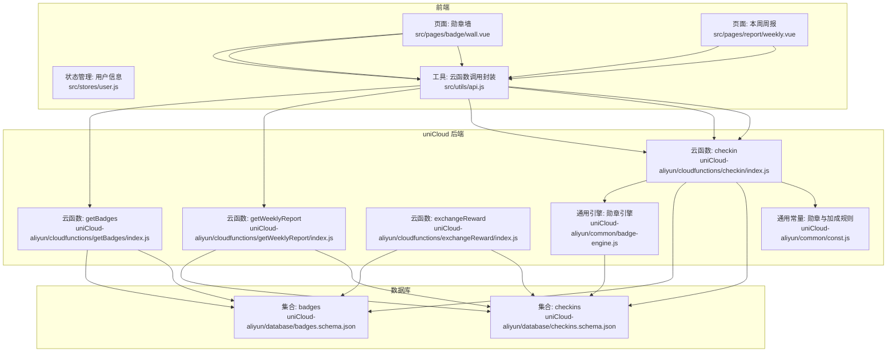
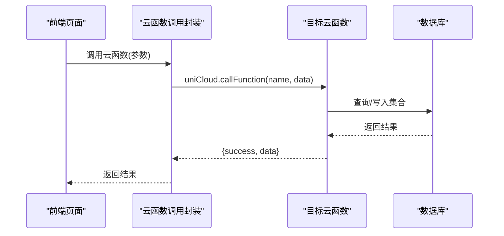
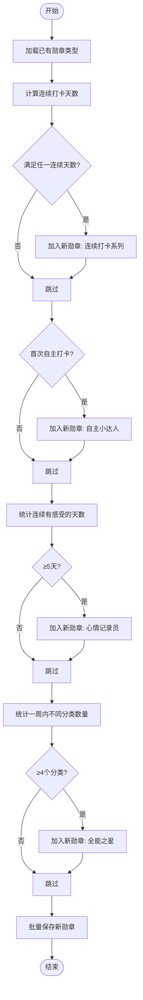
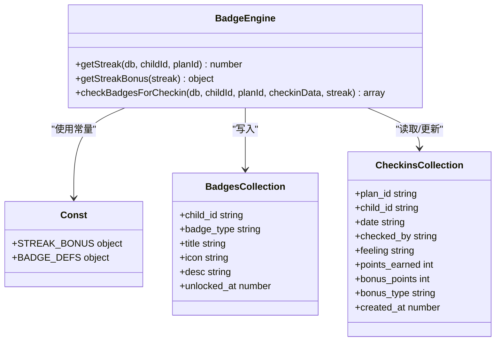
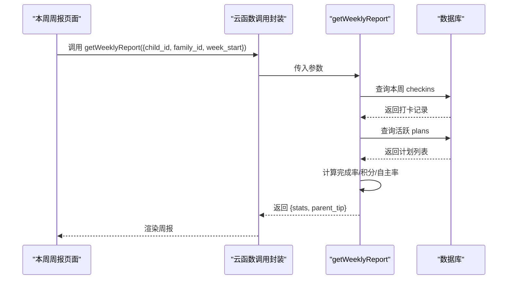
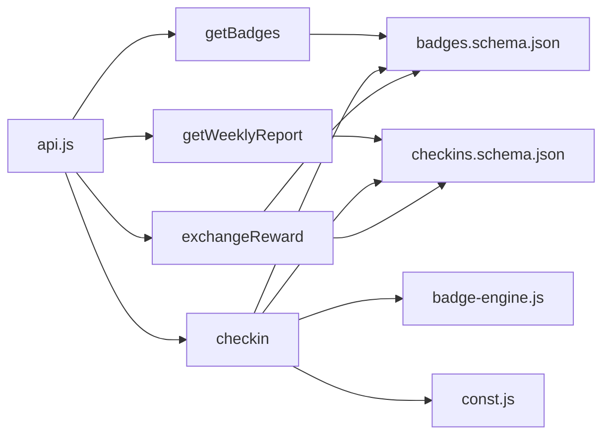

# 勋章报告接口

<cite>
**本文档引用的文件**
- [badge-engine.js](file://uniCloud-aliyun/common/badge-engine.js)
- [const.js](file://uniCloud-aliyun/common/const.js)
- [badges.schema.json](file://uniCloud-aliyun/database/badges.schema.json)
- [checkins.schema.json](file://uniCloud-aliyun/database/checkins.schema.json)
- [getBadges/index.js](file://uniCloud-aliyun/cloudfunctions/getBadges/index.js)
- [getWeeklyReport/index.js](file://uniCloud-aliyun/cloudfunctions/getWeeklyReport/index.js)
- [checkin/index.js](file://uniCloud-aliyun/cloudfunctions/checkin/index.js)
- [exchangeReward/index.js](file://uniCloud-aliyun/cloudfunctions/exchangeReward/index.js)
- [wall.vue](file://src/pages/badge/wall.vue)
- [weekly.vue](file://src/pages/report/weekly.vue)
- [api.js](file://src/utils/api.js)
- [user.js](file://src/stores/user.js)
</cite>

## 目录
1. [简介](#简介)
2. [项目结构](#项目结构)
3. [核心组件](#核心组件)
4. [架构总览](#架构总览)
5. [详细组件分析](#详细组件分析)
6. [依赖关系分析](#依赖关系分析)
7. [性能考量](#性能考量)
8. [故障排查指南](#故障排查指南)
9. [结论](#结论)
10. [附录](#附录)

## 简介
本文件面向勋章与报告相关API的使用者与维护者，系统性梳理以下能力与规范：
- 勋章查询接口：按儿童成员查询已解锁勋章列表
- 成就统计接口：按周统计打卡完成率、积分、打卡次数、自主完成率等指标
- 周报生成接口：汇总本周数据并返回家长指导建议
- 勋章类型定义、解锁条件与进度计算逻辑
- 报告数据格式、统计维度与时序范围
- 请求与响应示例路径、流程图与类图
- 勋章引擎工作原理与成就系统技术实现
- 数据聚合与性能优化建议

## 项目结构
该系统采用“前端页面 + uniCloud 云函数 + 数据库 Schema”的分层架构。前端通过云函数调用封装统一访问后端能力；勋章与报告逻辑集中在云函数中，配合通用常量与引擎模块实现。

图表来源
- [wall.vue:58-65](file://src/pages/badge/wall.vue#L58-L65)
- [weekly.vue:73-90](file://src/pages/report/weekly.vue#L73-L90)
- [getBadges/index.js:4-14](file://uniCloud-aliyun/cloudfunctions/getBadges/index.js#L4-L14)
- [getWeeklyReport/index.js:4-45](file://uniCloud-aliyun/cloudfunctions/getWeeklyReport/index.js#L4-L45)
- [checkin/index.js:5-82](file://uniCloud-aliyun/cloudfunctions/checkin/index.js#L5-L82)
- [exchangeReward/index.js:4-52](file://uniCloud-aliyun/cloudfunctions/exchangeReward/index.js#L4-L52)
- [badge-engine.js:1-125](file://uniCloud-aliyun/common/badge-engine.js#L1-L125)
- [const.js:1-27](file://uniCloud-aliyun/common/const.js#L1-L27)
- [badges.schema.json:1-40](file://uniCloud-aliyun/database/badges.schema.json#L1-L40)
- [checkins.schema.json:1-52](file://uniCloud-aliyun/database/checkins.schema.json#L1-L52)

章节来源
- [wall.vue:1-82](file://src/pages/badge/wall.vue#L1-L82)
- [weekly.vue:1-130](file://src/pages/report/weekly.vue#L1-L130)
- [getBadges/index.js:1-15](file://uniCloud-aliyun/cloudfunctions/getBadges/index.js#L1-L15)
- [getWeeklyReport/index.js:1-46](file://uniCloud-aliyun/cloudfunctions/getWeeklyReport/index.js#L1-L46)
- [checkin/index.js:1-83](file://uniCloud-aliyun/cloudfunctions/checkin/index.js#L1-L83)
- [exchangeReward/index.js:1-53](file://uniCloud-aliyun/cloudfunctions/exchangeReward/index.js#L1-L53)
- [badge-engine.js:1-125](file://uniCloud-aliyun/common/badge-engine.js#L1-L125)
- [const.js:1-27](file://uniCloud-aliyun/common/const.js#L1-L27)
- [badges.schema.json:1-40](file://uniCloud-aliyun/database/badges.schema.json#L1-L40)
- [checkins.schema.json:1-52](file://uniCloud-aliyun/database/checkins.schema.json#L1-L52)

## 核心组件
- 勋章引擎：负责连续打卡天数计算、加成计算与勋章检查颁发
- 勋章常量：定义各类勋章的标题、图标、描述及连续打卡加成点数
- 勋章集合与打卡集合：存储已解锁勋章与每日打卡记录
- 云函数接口：
  - getBadges：查询某儿童已解锁的勋章列表
  - getWeeklyReport：按周统计并生成周报
  - checkin：执行打卡、计算加成、更新积分与检查勋章
  - exchangeReward：积分兑换奖励
- 前端页面：
  - 勋章墙：展示所有勋章、解锁进度与徽章卡片
  - 本周周报：展示完成率、积分、打卡次数、自主率与家长建议

章节来源
- [badge-engine.js:1-125](file://uniCloud-aliyun/common/badge-engine.js#L1-L125)
- [const.js:1-27](file://uniCloud-aliyun/common/const.js#L1-L27)
- [badges.schema.json:1-40](file://uniCloud-aliyun/database/badges.schema.json#L1-L40)
- [checkins.schema.json:1-52](file://uniCloud-aliyun/database/checkins.schema.json#L1-L52)
- [getBadges/index.js:1-15](file://uniCloud-aliyun/cloudfunctions/getBadges/index.js#L1-L15)
- [getWeeklyReport/index.js:1-46](file://uniCloud-aliyun/cloudfunctions/getWeeklyReport/index.js#L1-L46)
- [checkin/index.js:1-83](file://uniCloud-aliyun/cloudfunctions/checkin/index.js#L1-L83)
- [exchangeReward/index.js:1-53](file://uniCloud-aliyun/cloudfunctions/exchangeReward/index.js#L1-L53)
- [wall.vue:1-82](file://src/pages/badge/wall.vue#L1-L82)
- [weekly.vue:1-130](file://src/pages/report/weekly.vue#L1-L130)

## 架构总览
下图展示了从页面到云函数再到数据库的数据流与控制流：

图表来源
- [api.js:9-17](file://src/utils/api.js#L9-L17)
- [getBadges/index.js:4-14](file://uniCloud-aliyun/cloudfunctions/getBadges/index.js#L4-L14)
- [getWeeklyReport/index.js:4-45](file://uniCloud-aliyun/cloudfunctions/getWeeklyReport/index.js#L4-L45)
- [checkin/index.js:5-82](file://uniCloud-aliyun/cloudfunctions/checkin/index.js#L5-L82)
- [exchangeReward/index.js:4-52](file://uniCloud-aliyun/cloudfunctions/exchangeReward/index.js#L4-L52)

## 详细组件分析

### 勋章查询接口
- 接口名称：getBadges
- 功能：按 child_id 查询该儿童已解锁的所有勋章，并按解锁时间倒序排列
- 请求参数
  - child_id: 儿童成员ID（字符串）
- 响应字段
  - success: 布尔值，请求是否成功
  - data: 数组，每个元素为一个勋章对象
- 勋章对象字段
  - child_id: 儿童成员ID
  - badge_type: 勋章类型标识
  - title: 勋章标题
  - icon: 勋章图标
  - desc: 勋章描述
  - unlocked_at: 解锁时间戳
- 示例路径
  - 请求示例：[wall.vue](file://src/pages/badge/wall.vue#L60)
  - 响应示例：[getBadges/index.js](file://uniCloud-aliyun/cloudfunctions/getBadges/index.js#L13)

章节来源
- [getBadges/index.js:1-15](file://uniCloud-aliyun/cloudfunctions/getBadges/index.js#L1-L15)
- [wall.vue:58-65](file://src/pages/badge/wall.vue#L58-L65)
- [badges.schema.json:14-37](file://uniCloud-aliyun/database/badges.schema.json#L14-L37)

### 成就统计接口
- 接口名称：getWeeklyReport
- 功能：按周统计儿童的打卡完成率、积分、打卡次数、自主完成率等，并返回家长建议
- 请求参数
  - child_id: 儿童成员ID（字符串）
  - family_id: 家庭ID（字符串）
  - week_start: 本周起始日期（YYYY-MM-DD，通常为周一）
- 响应字段
  - success: 布尔值
  - data: 对象
    - stats: 统计对象
      - total_checks: 本周打卡次数
      - completion_rate: 完成率（百分比，上限100）
      - points_earned: 本周获得积分
      - self_check_rate: 自主完成率（百分比）
    - parent_tip: 家长建议文本
- 示例路径
  - 请求示例：[weekly.vue:75-79](file://src/pages/report/weekly.vue#L75-L79)
  - 响应示例：[getWeeklyReport/index.js:33-44](file://uniCloud-aliyun/cloudfunctions/getWeeklyReport/index.js#L33-L44)

章节来源
- [getWeeklyReport/index.js:1-46](file://uniCloud-aliyun/cloudfunctions/getWeeklyReport/index.js#L1-L46)
- [weekly.vue:73-90](file://src/pages/report/weekly.vue#L73-L90)

### 周报生成接口
- 接口名称：getWeeklyReport（同上）
- 时间范围：以传入的 week_start 作为本周起始日（周一），统计过去7天的数据
- 统计维度
  - 总打卡次数：本周打卡记录总数
  - 完成率：min(100, floor(打卡数/(活跃计划数*7)*100))
  - 获得积分：本周所有打卡记录的积分之和
  - 自主完成率：自主打卡次数 / 总打卡次数（若总打卡为0则为0）

章节来源
- [getWeeklyReport/index.js:8-31](file://uniCloud-aliyun/cloudfunctions/getWeeklyReport/index.js#L8-L31)

### 勋章类型定义与解锁条件
- 勋章类型与描述
  - 初出茅庐：首次完成打卡
  - 三连击：连续打卡3天
  - 一周坚持：连续打卡7天
  - 两周达人：连续打卡14天
  - 月度冠军：连续打卡30天
  - 自主小达人：首次自主打卡
  - 全能之星：一周内所有分类都打卡
  - 心情记录员：连续5天写了感受
  - 自律之星：一周内全自主打卡（此条未在引擎中实现，仅作参考）
  - 阅读百分钟：累计阅读100分钟（此条未在引擎中实现，仅作参考）
- 解锁条件与进度计算
  - 连续打卡：基于 checkins 集合中的日期序列，判断最近一次打卡是否为今日或昨日，然后向前回溯计算连续天数
  - 自主打卡：当打卡记录的 checked_by 为 self 且满足条件时解锁
  - 心情记录员：统计连续有感受记录的天数达到5天
  - 全能之星：统计一周内不同计划分类的数量达到4个及以上
- 勋章进度计算流程

图表来源
- [badge-engine.js:52-122](file://uniCloud-aliyun/common/badge-engine.js#L52-L122)
- [const.js:6-17](file://uniCloud-aliyun/common/const.js#L6-L17)

章节来源
- [badge-engine.js:1-125](file://uniCloud-aliyun/common/badge-engine.js#L1-L125)
- [const.js:1-27](file://uniCloud-aliyun/common/const.js#L1-L27)

### 勋章引擎工作原理与技术实现
- 连续打卡天数计算
  - 从 checkins 集合按日期升序取出该儿童在当前计划下的打卡日期
  - 若最近一次打卡不是今日或昨日，则连续天数为0
  - 否则从末尾向前遍历，按自然日差为1累加连续天数
- 连续打卡加成
  - 基于连续天数映射到加成点数与加成类型
  - 支持阈值：3天、7天、14天
- 勋章检查与颁发
  - 先查询已有勋章类型，避免重复颁发
  - 按条件逐一检查并生成新勋章记录
  - 批量写入 badges 集合，包含 child_id、unlocked_at 等字段

图表来源
- [badge-engine.js:1-125](file://uniCloud-aliyun/common/badge-engine.js#L1-L125)
- [const.js:1-27](file://uniCloud-aliyun/common/const.js#L1-L27)
- [badges.schema.json:14-37](file://uniCloud-aliyun/database/badges.schema.json#L14-L37)
- [checkins.schema.json:14-49](file://uniCloud-aliyun/database/checkins.schema.json#L14-L49)

章节来源
- [badge-engine.js:1-125](file://uniCloud-aliyun/common/badge-engine.js#L1-L125)
- [const.js:1-27](file://uniCloud-aliyun/common/const.js#L1-L27)
- [badges.schema.json:1-40](file://uniCloud-aliyun/database/badges.schema.json#L1-L40)
- [checkins.schema.json:1-52](file://uniCloud-aliyun/database/checkins.schema.json#L1-L52)

### 周报生成流程
- 输入：child_id、family_id、week_start（周一）
- 步骤：
  1) 计算 week_start（周一）与当前时间的7天区间
  2) 查询该儿童在该区间内的所有打卡记录
  3) 统计总打卡次数、自主打卡次数、总积分
  4) 查询家庭下活跃计划总数，计算完成率
  5) 返回统计对象与家长建议

图表来源
- [weekly.vue:73-90](file://src/pages/report/weekly.vue#L73-L90)
- [getWeeklyReport/index.js:4-45](file://uniCloud-aliyun/cloudfunctions/getWeeklyReport/index.js#L4-L45)

章节来源
- [weekly.vue:1-130](file://src/pages/report/weekly.vue#L1-L130)
- [getWeeklyReport/index.js:1-46](file://uniCloud-aliyun/cloudfunctions/getWeeklyReport/index.js#L1-L46)

### 勋章墙页面与进度展示
- 页面职责：展示所有可解锁勋章、当前已解锁数量与进度百分比
- 数据来源：调用 getBadges 获取已解锁列表，结合常量 BADGE_DEFS 生成全部勋章清单
- 进度计算：已解锁数量 / 全部勋章数量 × 100%

章节来源
- [wall.vue:1-82](file://src/pages/badge/wall.vue#L1-L82)
- [getBadges/index.js:1-15](file://uniCloud-aliyun/cloudfunctions/getBadges/index.js#L1-L15)
- [const.js:6-17](file://uniCloud-aliyun/common/const.js#L6-L17)

## 依赖关系分析
- 前端依赖
  - 页面通过 api.js 封装的 callFunction 统一调用云函数
  - 用户状态由 user.js 提供，包含 memberId、familyId 等关键参数
- 云函数依赖
  - getBadges：依赖 badges 集合
  - getWeeklyReport：依赖 checkins 集合
  - checkin：依赖 plans、checkins、members 集合，以及 badge-engine 与 const
  - exchangeReward：依赖 members、rewards、exchanges 集合
- 引擎与常量
  - badge-engine 使用 const 中的加成与勋章定义
  - 勋章集合与打卡集合的字段定义来自各自 schema

图表来源
- [api.js:9-17](file://src/utils/api.js#L9-L17)
- [getBadges/index.js:4-14](file://uniCloud-aliyun/cloudfunctions/getBadges/index.js#L4-L14)
- [getWeeklyReport/index.js:4-45](file://uniCloud-aliyun/cloudfunctions/getWeeklyReport/index.js#L4-L45)
- [checkin/index.js:3-82](file://uniCloud-aliyun/cloudfunctions/checkin/index.js#L3-L82)
- [exchangeReward/index.js:4-52](file://uniCloud-aliyun/cloudfunctions/exchangeReward/index.js#L4-L52)
- [badge-engine.js:1-125](file://uniCloud-aliyun/common/badge-engine.js#L1-L125)
- [const.js:1-27](file://uniCloud-aliyun/common/const.js#L1-L27)
- [badges.schema.json:1-40](file://uniCloud-aliyun/database/badges.schema.json#L1-L40)
- [checkins.schema.json:1-52](file://uniCloud-aliyun/database/checkins.schema.json#L1-L52)

章节来源
- [api.js:1-18](file://src/utils/api.js#L1-L18)
- [getBadges/index.js:1-15](file://uniCloud-aliyun/cloudfunctions/getBadges/index.js#L1-L15)
- [getWeeklyReport/index.js:1-46](file://uniCloud-aliyun/cloudfunctions/getWeeklyReport/index.js#L1-L46)
- [checkin/index.js:1-83](file://uniCloud-aliyun/cloudfunctions/checkin/index.js#L1-L83)
- [exchangeReward/index.js:1-53](file://uniCloud-aliyun/cloudfunctions/exchangeReward/index.js#L1-L53)
- [badge-engine.js:1-125](file://uniCloud-aliyun/common/badge-engine.js#L1-L125)
- [const.js:1-27](file://uniCloud-aliyun/common/const.js#L1-L27)
- [badges.schema.json:1-40](file://uniCloud-aliyun/database/badges.schema.json#L1-L40)
- [checkins.schema.json:1-52](file://uniCloud-aliyun/database/checkins.schema.json#L1-L52)

## 性能考量
- 查询优化
  - badges 与 checkins 的查询均使用 where 条件过滤，建议在 child_id、date、plan_id 等高频查询字段建立索引
  - getWeeklyReport 在查询 checkins 时使用日期范围过滤，确保 date 字段有索引
- 写入优化
  - checkBadgesForCheckin 批量新增勋章，减少多次写入开销
- 计算优化
  - 连续天数计算在内存中进行，避免复杂聚合查询
  - 完成率与自主率直接在云函数中计算，减少前端二次处理
- 缓存与本地存储
  - 周报页面对本周感受使用本地存储，降低网络请求频率

[本节为通用性能建议，不直接分析具体文件]

## 故障排查指南
- 云函数调用失败
  - 检查 api.js 的错误捕获与返回结构，确认前端是否正确处理 {success, error} 结果
  - 参考路径：[api.js:9-17](file://src/utils/api.js#L9-L17)
- 勋章查询为空
  - 确认 child_id 是否正确传递
  - 检查 badges 集合中是否存在对应记录
  - 参考路径：[getBadges/index.js:4-14](file://uniCloud-aliyun/cloudfunctions/getBadges/index.js#L4-L14)
- 周报统计异常
  - 确认 week_start 是否为周一日期格式
  - 检查 checkins 集合中本周数据是否完整
  - 参考路径：[getWeeklyReport/index.js:8-31](file://uniCloud-aliyun/cloudfunctions/getWeeklyReport/index.js#L8-L31)
- 打卡未触发勋章
  - 检查连续天数计算逻辑与已解锁勋章去重
  - 参考路径：[badge-engine.js:52-122](file://uniCloud-aliyun/common/badge-engine.js#L52-L122)

章节来源
- [api.js:1-18](file://src/utils/api.js#L1-L18)
- [getBadges/index.js:1-15](file://uniCloud-aliyun/cloudfunctions/getBadges/index.js#L1-L15)
- [getWeeklyReport/index.js:1-46](file://uniCloud-aliyun/cloudfunctions/getWeeklyReport/index.js#L1-L46)
- [badge-engine.js:1-125](file://uniCloud-aliyun/common/badge-engine.js#L1-L125)

## 结论
本系统通过清晰的前后端分层与云函数封装，实现了从打卡到勋章颁发、从周报统计到家长建议的完整闭环。勋章引擎以简单高效的算法实现多种解锁条件，周报接口提供直观的可视化指标。建议在生产环境中完善数据库索引与缓存策略，持续优化查询与聚合性能。

[本节为总结性内容，不直接分析具体文件]

## 附录

### API 规范速查
- getBadges
  - 方法：GET/云函数调用
  - 参数：child_id
  - 返回：{ success, data: 勋章数组 }
- getWeeklyReport
  - 方法：GET/云函数调用
  - 参数：child_id, family_id, week_start
  - 返回：{ success, data: { stats, parent_tip } }
- checkin
  - 方法：POST/云函数调用
  - 参数：plan_id, child_id, date, checked_by, feeling
  - 返回：{ success, data: { points_earned, bonus_points, bonus_type, total_today, new_badges, current_streak } }
- exchangeReward
  - 方法：POST/云函数调用
  - 参数：reward_id, child_id, family_id
  - 返回：{ success, data: 兑换记录 }

章节来源
- [getBadges/index.js:1-15](file://uniCloud-aliyun/cloudfunctions/getBadges/index.js#L1-L15)
- [getWeeklyReport/index.js:1-46](file://uniCloud-aliyun/cloudfunctions/getWeeklyReport/index.js#L1-L46)
- [checkin/index.js:1-83](file://uniCloud-aliyun/cloudfunctions/checkin/index.js#L1-L83)
- [exchangeReward/index.js:1-53](file://uniCloud-aliyun/cloudfunctions/exchangeReward/index.js#L1-L53)