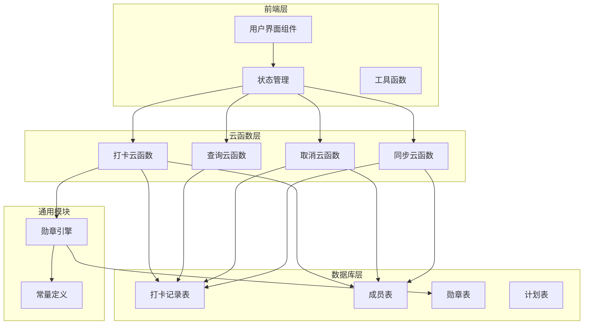
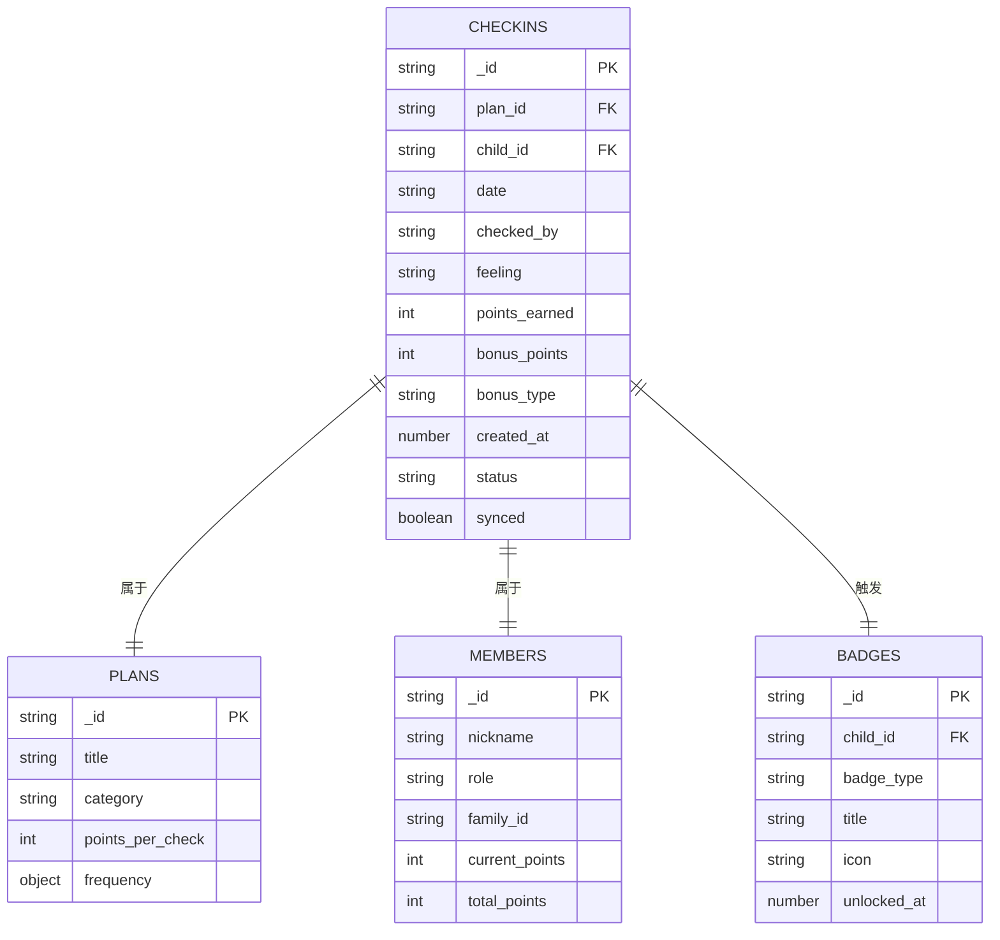
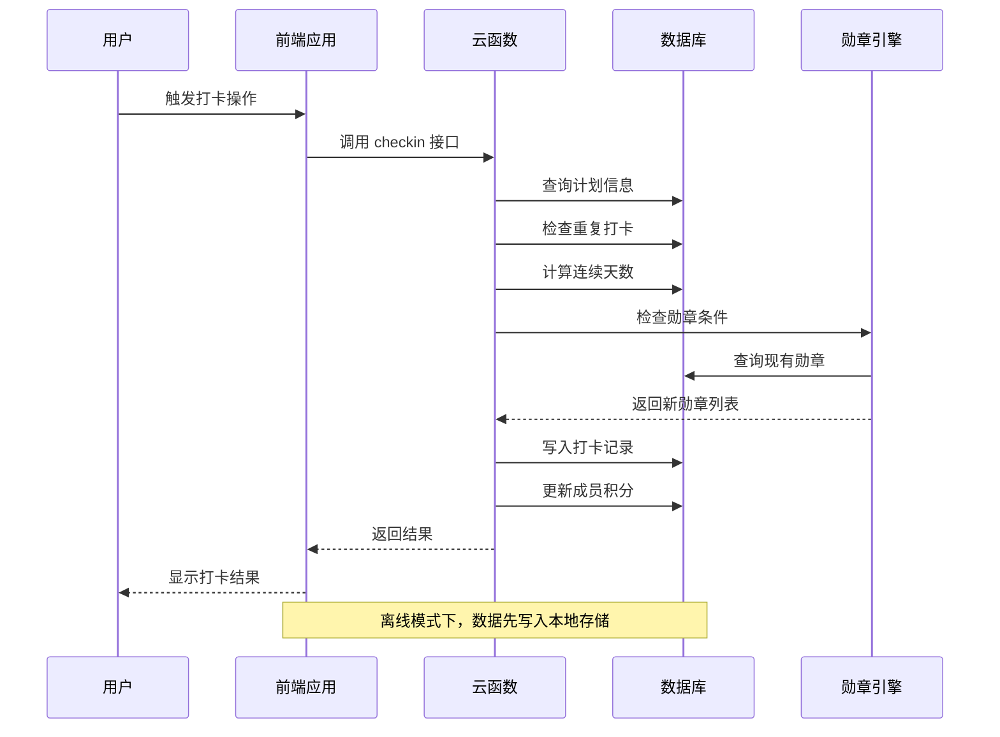
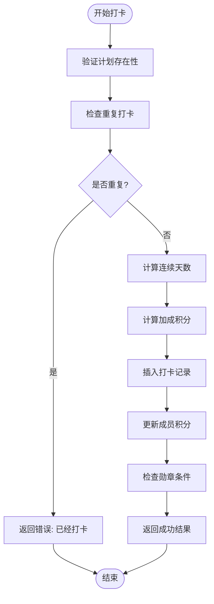
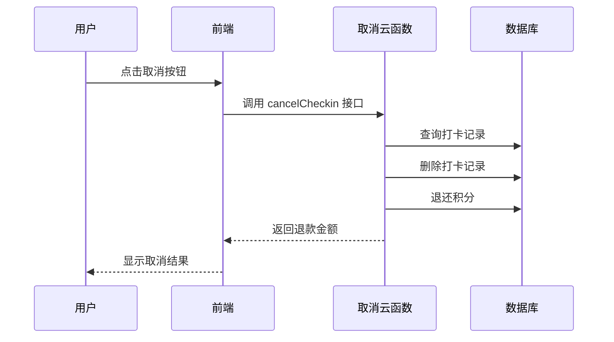
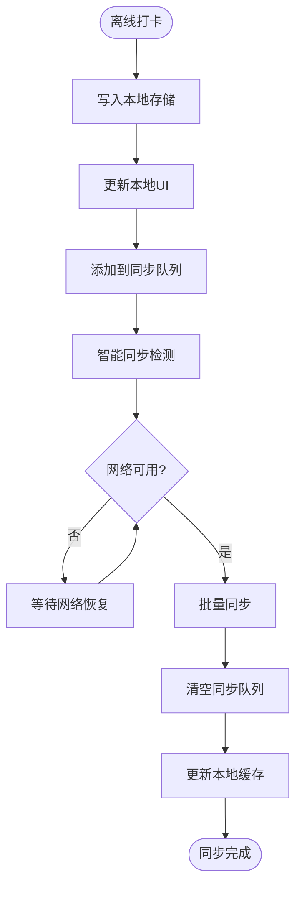
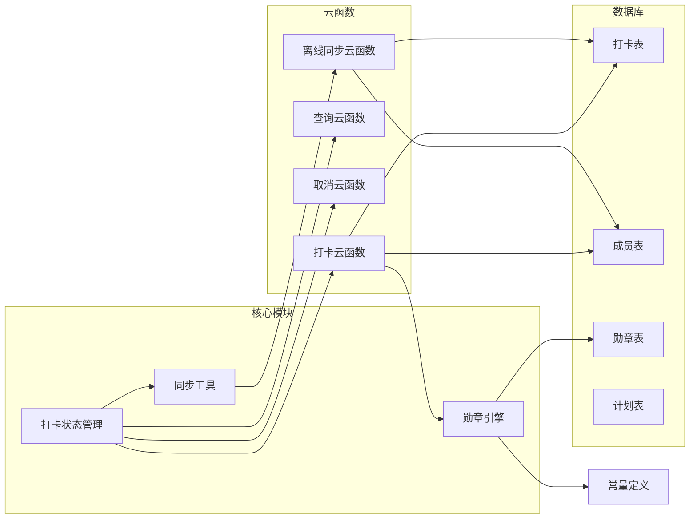

# 打卡记录接口

<cite>
**本文档引用的文件**
- [checkin/index.js](file://src/cloudfunctions/checkin/index.js)
- [checkin/index.js](file://uniCloud-aliyun/cloudfunctions/checkin/index.js)
- [getCheckins/index.js](file://uniCloud-aliyun/cloudfunctions/getCheckins/index.js)
- [cancelCheckin/index.js](file://uniCloud-aliyun/cloudfunctions/cancelCheckin/index.js)
- [syncOffline/index.js](file://src/cloudfunctions/syncOffline/index.js)
- [syncOffline/index.js](file://uniCloud-aliyun/cloudfunctions/syncOffline/index.js)
- [checkins.schema.json](file://uniCloud-aliyun/database/checkins.schema.json)
- [checkins.js](file://src/stores/checkins.js)
- [sync.js](file://src/utils/sync.js)
- [badge-engine.js](file://uniCloud-aliyun/common/badge-engine.js)
- [const.js](file://uniCloud-aliyun/common/const.js)
- [CheckInCard.vue](file://src/components/CheckInCard.vue)
- [history.vue](file://src/pages/points/history.vue)
</cite>

## 目录
1. [简介](#简介)
2. [项目结构](#项目结构)
3. [核心组件](#核心组件)
4. [架构概览](#架构概览)
5. [详细组件分析](#详细组件分析)
6. [依赖关系分析](#依赖关系分析)
7. [性能考虑](#性能考虑)
8. [故障排除指南](#故障排除指南)
9. [结论](#结论)

## 简介

本文件详细描述了星成长应用中的打卡记录相关API接口，包括打卡提交、取消和查询接口的完整规范。系统支持实时打卡、离线打卡和数据同步功能，具备完整的验证规则、重复打卡处理和撤销操作机制。文档涵盖了打卡数据格式、时间戳处理、状态更新机制、验证规则、重复打卡处理、撤销操作的API调用方式，以及离线打卡和数据同步的技术实现细节。

## 项目结构

星成长应用采用前后端分离架构，打卡功能分布在多个层次中：



**图表来源**
- [checkins.js:1-163](file://src/stores/checkins.js#L1-L163)
- [checkin/index.js:1-83](file://uniCloud-aliyun/cloudfunctions/checkin/index.js#L1-L83)
- [getCheckins/index.js:1-19](file://uniCloud-aliyun/cloudfunctions/getCheckins/index.js#L1-L19)

**章节来源**
- [checkins.js:1-163](file://src/stores/checkins.js#L1-L163)
- [checkin/index.js:1-83](file://uniCloud-aliyun/cloudfunctions/checkin/index.js#L1-L83)

## 核心组件

### 数据模型

打卡记录采用统一的数据模型，确保跨平台一致性：



**图表来源**
- [checkins.schema.json:1-52](file://uniCloud-aliyun/database/checkins.schema.json#L1-L52)
- [const.js:1-27](file://uniCloud-aliyun/common/const.js#L1-L27)

### 连续打卡加成规则

系统实现了多层次的连续打卡加成机制：

| 连续天数 | 加成积分 | 奖励类型 |
|---------|---------|---------|
| 3天 | +5积分 | streak_3 |
| 7天 | +15积分 | streak_7 |
| 14天 | +30积分 | streak_14 |

**章节来源**
- [checkins.schema.json:34-49](file://uniCloud-aliyun/database/checkins.schema.json#L34-L49)
- [const.js:2-3](file://uniCloud-aliyun/common/const.js#L2-L3)

## 架构概览

系统采用事件驱动的异步架构，支持实时和离线两种模式：



**图表来源**
- [checkins.js:26-89](file://src/stores/checkins.js#L26-L89)
- [checkin/index.js:5-82](file://uniCloud-aliyun/cloudfunctions/checkin/index.js#L5-L82)

## 详细组件分析

### 打卡提交接口

#### 接口规范

**请求参数**
- `plan_id`: 计划ID (必填)
- `child_id`: 孩子成员ID (必填)
- `date`: 打卡日期 (YYYY-MM-DD格式，必填)
- `feeling`: 感受 (可选)
- `checked_by`: 打卡人类型 (self/parent，默认self)

**响应格式**
```javascript
{
  success: boolean,
  data: {
    checkin_id: string,
    points_earned: number,
    bonus_points: number,
    bonus_type: string,
    total_today: number,
    new_badges: array,
    current_streak: number
  }
}
```

#### 处理流程



**图表来源**
- [checkin/index.js:12-83](file://src/cloudfunctions/checkin/index.js#L12-L83)
- [checkin/index.js:5-82](file://uniCloud-aliyun/cloudfunctions/checkin/index.js#L5-L82)

#### 验证规则

1. **计划验证**: 确保指定的计划存在且有效
2. **重复检查**: 同一计划、同一天只能打卡一次
3. **日期验证**: 支持当天和昨天的打卡，其他日期无效
4. **权限验证**: 需要有效的用户会话

**章节来源**
- [checkin/index.js:15-24](file://src/cloudfunctions/checkin/index.js#L15-L24)
- [checkin/index.js:9-20](file://uniCloud-aliyun/cloudfunctions/checkin/index.js#L9-L20)

### 打卡取消接口

#### 接口规范

**请求参数**
- `plan_id`: 计划ID (必填)
- `child_id`: 孩子成员ID (必填)
- `date`: 打卡日期 (YYYY-MM-DD格式，必填)

**响应格式**
```javascript
{
  success: boolean,
  data: {
    refunded: number
  }
}
```

#### 处理流程



**图表来源**
- [cancelCheckin/index.js:4-32](file://uniCloud-aliyun/cloudfunctions/cancelCheckin/index.js#L4-L32)

#### 退款机制

- **全额退款**: 删除记录时按获得的积分进行退款
- **幂等性**: 同一记录多次取消不会产生重复退款
- **状态同步**: 本地缓存与云端数据保持一致

**章节来源**
- [cancelCheckin/index.js:13-29](file://uniCloud-aliyun/cloudfunctions/cancelCheckin/index.js#L13-L29)

### 打卡查询接口

#### 接口规范

**请求参数**
- `child_id`: 孩子成员ID (必填)
- `date`: 指定日期 (可选)
- `week_start`: 周起始日期 (可选)

**响应格式**
```javascript
{
  success: boolean,
  data: array
}
```

#### 查询策略

1. **单日查询**: 按具体日期查询
2. **周查询**: 按周起始日期范围查询
3. **排序**: 按创建时间降序排列

**章节来源**
- [getCheckins/index.js:4-18](file://uniCloud-aliyun/cloudfunctions/getCheckins/index.js#L4-L18)

### 离线打卡与同步

#### 离线模式

系统支持完全离线的打卡体验：



**图表来源**
- [sync.js:25-53](file://src/utils/sync.js#L25-L53)
- [checkins.js:78-89](file://src/stores/checkins.js#L78-L89)

#### 同步机制

1. **队列管理**: 使用本地存储管理待同步队列
2. **冲突检测**: 同步前检查云端是否已存在相同记录
3. **批量处理**: 按日期排序后批量同步
4. **幂等保证**: 已存在的记录自动跳过

**章节来源**
- [sync.js:1-96](file://src/utils/sync.js#L1-L96)
- [syncOffline/index.js:19-57](file://uniCloud-aliyun/cloudfunctions/syncOffline/index.js#L19-L57)

## 依赖关系分析

### 组件耦合度



**图表来源**
- [checkins.js:1-163](file://src/stores/checkins.js#L1-L163)
- [badge-engine.js:1-125](file://uniCloud-aliyun/common/badge-engine.js#L1-L125)

### 错误处理策略

系统实现了多层次的错误处理机制：

1. **前端错误处理**: 用户友好的错误提示
2. **云端错误处理**: 详细的错误信息返回
3. **离线容错**: 网络异常时的本地缓存机制
4. **幂等性保证**: 防止重复操作导致的数据不一致

**章节来源**
- [checkins.js:77-88](file://src/stores/checkins.js#L77-L88)
- [checkin/index.js:79-82](file://uniCloud-aliyun/cloudfunctions/checkin/index.js#L79-L82)

## 性能考虑

### 数据库优化

1. **索引策略**: 在 `checkins` 表上建立复合索引 `(plan_id, child_id, date)`
2. **查询优化**: 使用分页查询避免大量数据传输
3. **缓存策略**: 前端对查询结果进行缓存

### 并发控制

1. **重复打卡检查**: 使用数据库查询防止并发重复
2. **事务处理**: 关键操作使用事务保证数据一致性
3. **乐观锁**: 对积分更新使用原子操作

### 网络优化

1. **批量同步**: 减少网络请求次数
2. **增量更新**: 只同步变化的数据
3. **智能重试**: 失败时自动重试机制

## 故障排除指南

### 常见问题及解决方案

#### 打卡失败
**症状**: 打卡后没有积分增加
**可能原因**:
- 网络连接异常
- 重复打卡被拒绝
- 计划不存在

**解决步骤**:
1. 检查网络连接状态
2. 确认该计划当天是否已打卡
3. 验证计划ID的有效性

#### 离线数据不同步
**症状**: 离线打卡后重新联网仍显示未同步
**可能原因**:
- 同步队列为空
- 网络类型检测失败
- 云端冲突检测

**解决步骤**:
1. 检查本地存储中的待同步队列
2. 手动触发智能同步
3. 清理冲突记录

#### 勋章未解锁
**症状**: 达成条件但未获得勋章
**可能原因**:
- 勋章检查逻辑异常
- 重复解锁检测
- 数据库写入失败

**解决步骤**:
1. 检查连续天数计算
2. 验证现有勋章列表
3. 重新触发勋章检查

**章节来源**
- [checkins.js:156-158](file://src/stores/checkins.js#L156-L158)
- [sync.js:49-52](file://src/utils/sync.js#L49-L52)

## 结论

星成长应用的打卡记录系统通过精心设计的架构实现了完整的离线支持、实时同步和丰富的激励机制。系统的核心优势包括：

1. **完整的离线支持**: 用户可以在任何网络环境下进行打卡操作
2. **智能同步机制**: 自动检测网络状态并批量同步数据
3. **丰富的激励系统**: 通过连续打卡加成和勋章系统提升用户参与度
4. **强大的扩展性**: 模块化设计便于功能扩展和维护

该系统为家长和孩子提供了便捷、有趣且可持续的打卡体验，通过技术手段确保了数据的一致性和用户体验的流畅性。