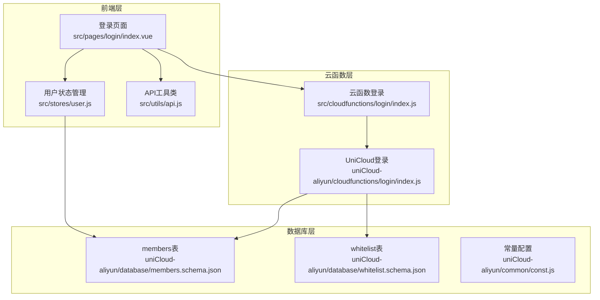
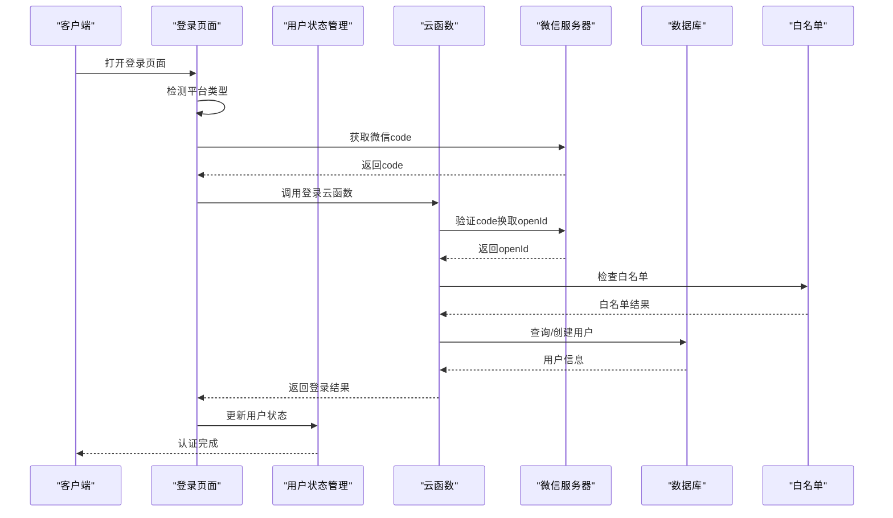
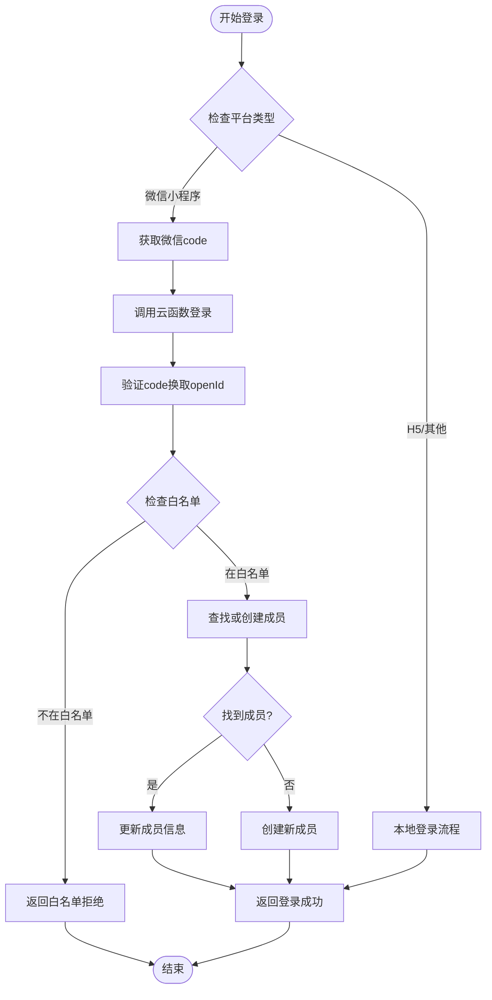
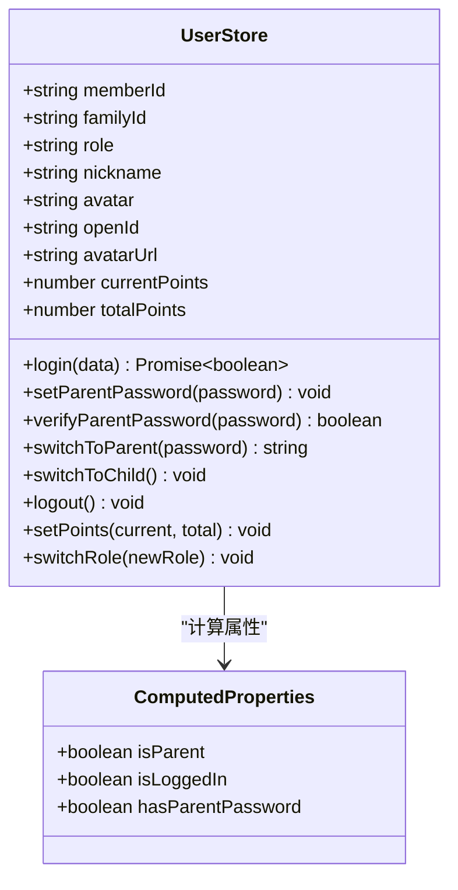
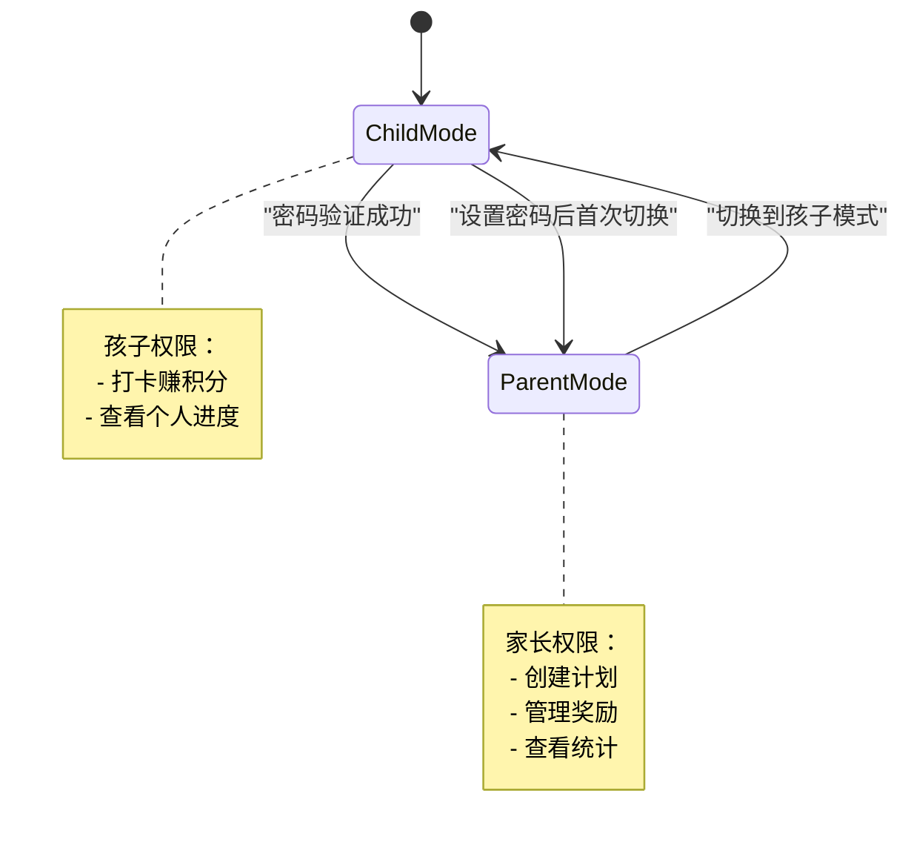
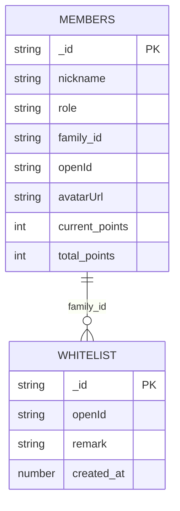
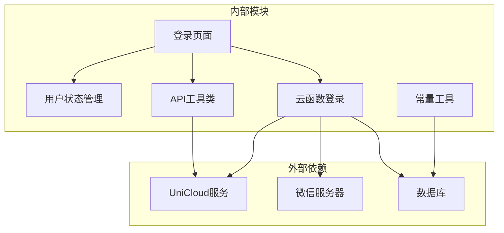

# 用户认证接口

<cite>
**本文档引用的文件**
- [src/pages/login/index.vue](file://src/pages/login/index.vue)
- [src/stores/user.js](file://src/stores/user.js)
- [src/utils/api.js](file://src/utils/api.js)
- [src/cloudfunctions/login/index.js](file://src/cloudfunctions/login/index.js)
- [uniCloud-aliyun/cloudfunctions/login/index.js](file://uniCloud-aliyun/cloudfunctions/login/index.js)
- [uniCloud-aliyun/common/const.js](file://uniCloud-aliyun/common/const.js)
- [uniCloud-aliyun/database/members.schema.json](file://uniCloud-aliyun/database/members.schema.json)
- [uniCloud-aliyun/database/whitelist.schema.json](file://uniCloud-aliyun/database/whitelist.schema.json)
- [src/pages/index/index.vue](file://src/pages/index/index.vue)
- [src/pages/settings/index.vue](file://src/pages/settings/index.vue)
</cite>

## 目录
1. [简介](#简介)
2. [项目结构](#项目结构)
3. [核心组件](#核心组件)
4. [架构概览](#架构概览)
5. [详细组件分析](#详细组件分析)
6. [依赖关系分析](#依赖关系分析)
7. [性能考虑](#性能考虑)
8. [故障排除指南](#故障排除指南)
9. [结论](#结论)

## 简介

本项目是一个基于UniApp开发的儿童成长打卡应用，用户认证系统是整个应用的核心功能模块。系统支持微信小程序一键登录和传统昵称+角色登录两种认证方式，实现了完整的用户身份验证、会话管理和权限控制机制。

用户认证系统主要包含以下核心功能：
- 微信小程序一键登录（通过code换取openId）
- 用户身份验证与会话管理
- 角色切换机制（家长/孩子模式）
- 权限验证与访问控制
- 白名单访问控制
- 积分和家庭数据隔离

## 项目结构

用户认证相关的文件组织遵循功能模块化设计，主要分布在以下几个目录：



**图表来源**
- [src/pages/login/index.vue:1-289](file://src/pages/login/index.vue#L1-L289)
- [src/stores/user.js:1-119](file://src/stores/user.js#L1-L119)
- [src/utils/api.js:1-18](file://src/utils/api.js#L1-L18)
- [uniCloud-aliyun/cloudfunctions/login/index.js:1-103](file://uniCloud-aliyun/cloudfunctions/login/index.js#L1-L103)

**章节来源**
- [src/pages/login/index.vue:1-289](file://src/pages/login/index.vue#L1-L289)
- [src/stores/user.js:1-119](file://src/stores/user.js#L1-L119)
- [src/utils/api.js:1-18](file://src/utils/api.js#L1-L18)

## 核心组件

### 登录页面组件

登录页面采用Vue 3 Composition API实现，支持微信小程序一键登录和传统登录两种模式：

- **微信登录流程**：通过`uni.login`获取code，然后调用云函数进行登录验证
- **角色选择**：支持家长和孩子两种身份选择
- **头像获取**：使用微信原生组件获取用户头像
- **昵称输入**：支持微信昵称自动填充和手动输入

### 用户状态管理

Pinia状态管理提供了完整的用户认证状态管理：

- **认证状态**：memberId、familyId、role、nickname等核心状态
- **角色切换**：支持家长密码验证和孩子模式切换
- **会话持久化**：使用localStorage进行状态持久化
- **权限计算**：基于角色的权限判断

### 云函数登录

提供了两套登录实现：
- **前端云函数**：用于本地开发环境的简化版本
- **UniCloud登录**：生产环境的完整实现，包含微信登录、白名单验证、用户创建等功能

**章节来源**
- [src/pages/login/index.vue:102-231](file://src/pages/login/index.vue#L102-L231)
- [src/stores/user.js:7-118](file://src/stores/user.js#L7-L118)
- [uniCloud-aliyun/cloudfunctions/login/index.js:6-102](file://uniCloud-aliyun/cloudfunctions/login/index.js#L6-L102)

## 架构概览

用户认证系统的整体架构采用前后端分离设计，结合了前端状态管理和云端数据库的优势：



**图表来源**
- [src/pages/login/index.vue:136-230](file://src/pages/login/index.vue#L136-L230)
- [uniCloud-aliyun/cloudfunctions/login/index.js:12-102](file://uniCloud-aliyun/cloudfunctions/login/index.js#L12-L102)

系统的关键特性包括：

1. **双环境支持**：同时支持微信小程序和H5等非微信环境
2. **白名单控制**：通过whitelist表实现访问控制
3. **家庭隔离**：通过family_id实现多用户数据隔离
4. **角色权限**：基于角色的权限控制机制

## 详细组件分析

### 登录API详细分析

#### 请求参数规范

**微信登录参数**：
| 参数名 | 类型 | 必填 | 描述 | 示例 |
|--------|------|------|------|------|
| code | string | 是 | 微信登录code | "011AaB1234567890" |
| nickname | string | 否 | 用户昵称 | "小明" |
| role | string | 否 | 用户角色 | "child" |
| memberId | string | 否 | 成员ID | "member_123456789" |
| avatarUrl | string | 否 | 头像URL | "https://..." |

**非微信登录参数**：
| 参数名 | 类型 | 必填 | 描述 | 示例 |
|--------|------|------|------|------|
| memberId | string | 否 | 成员ID | "member_123456789" |
| nickname | string | 是 | 用户昵称 | "小明" |
| role | string | 是 | 用户角色 | "child" |

#### 响应格式规范

**成功响应**：
```json
{
  "success": true,
  "data": {
    "_id": "member_123456789",
    "memberId": "member_123456789",
    "nickname": "小明",
    "role": "child",
    "family_id": "family_default",
    "openId": "o1l2m3n4p5q6r7s8t9u0v1w2x3y4z5a6b7c8",
    "avatarUrl": "https://...",
    "current_points": 0,
    "total_points": 0
  }
}
```

**失败响应**：
```json
{
  "success": false,
  "error": "whitelist_rejected",
  "message": "该小程序暂未对你开放"
}
```

#### 登录流程详细步骤



**图表来源**
- [uniCloud-aliyun/cloudfunctions/login/index.js:12-102](file://uniCloud-aliyun/cloudfunctions/login/index.js#L12-L102)
- [src/pages/login/index.vue:164-230](file://src/pages/login/index.vue#L164-L230)

**章节来源**
- [uniCloud-aliyun/cloudfunctions/login/index.js:8-102](file://uniCloud-aliyun/cloudfunctions/login/index.js#L8-L102)
- [src/pages/login/index.vue:172-203](file://src/pages/login/index.vue#L172-L203)

### 用户状态管理分析

#### 状态存储结构

用户状态管理采用Pinia实现，核心状态包括：



**图表来源**
- [src/stores/user.js:7-118](file://src/stores/user.js#L7-L118)

#### 角色切换机制

系统实现了灵活的角色切换机制：

1. **家长模式**：需要密码验证，提供完整的管理功能
2. **孩子模式**：无需密码，限制管理操作
3. **密码管理**：支持设置和修改家长密码



**图表来源**
- [src/stores/user.js:65-95](file://src/stores/user.js#L65-L95)
- [src/pages/settings/index.vue:203-216](file://src/pages/settings/index.vue#L203-L216)

**章节来源**
- [src/stores/user.js:22-95](file://src/stores/user.js#L22-L95)
- [src/pages/settings/index.vue:64-235](file://src/pages/settings/index.vue#L64-L235)

### 数据模型分析

#### 用户表结构

用户数据采用MongoDB Schema定义，确保数据完整性：



**图表来源**
- [uniCloud-aliyun/database/members.schema.json:1-46](file://uniCloud-aliyun/database/members.schema.json#L1-L46)
- [uniCloud-aliyun/database/whitelist.schema.json:1-28](file://uniCloud-aliyun/database/whitelist.schema.json#L1-L28)

#### 白名单机制

白名单系统提供访问控制功能：

- **白名单表**：存储允许登录的openId
- **实时验证**：每次登录时检查openId是否在白名单中
- **访问拒绝**：不在白名单的用户无法登录

**章节来源**
- [uniCloud-aliyun/database/members.schema.json:10-46](file://uniCloud-aliyun/database/members.schema.json#L10-L46)
- [uniCloud-aliyun/database/whitelist.schema.json:10-28](file://uniCloud-aliyun/database/whitelist.schema.json#L10-L28)
- [uniCloud-aliyun/common/const.js:19-24](file://uniCloud-aliyun/common/const.js#L19-L24)

## 依赖关系分析

用户认证系统的依赖关系清晰，层次分明：



**图表来源**
- [src/pages/login/index.vue:104-105](file://src/pages/login/index.vue#L104-L105)
- [src/utils/api.js:9-17](file://src/utils/api.js#L9-L17)
- [uniCloud-aliyun/cloudfunctions/login/index.js:3-4](file://uniCloud-aliyun/cloudfunctions/login/index.js#L3-L4)

### 错误处理策略

系统实现了多层次的错误处理机制：

1. **网络错误**：云函数调用失败时的异常捕获
2. **微信登录错误**：code获取失败和验证失败的处理
3. **白名单拒绝**：明确的访问控制错误提示
4. **用户输入验证**：前端表单验证和后端参数验证

**章节来源**
- [src/utils/api.js:9-17](file://src/utils/api.js#L9-L17)
- [src/pages/login/index.vue:136-161](file://src/pages/login/index.vue#L136-L161)
- [uniCloud-aliyun/cloudfunctions/login/index.js:25-47](file://uniCloud-aliyun/cloudfunctions/login/index.js#L25-L47)

## 性能考虑

### 缓存策略

- **状态缓存**：用户状态存储在localStorage中，避免重复登录
- **会话持久化**：应用重启后自动恢复登录状态
- **数据库查询优化**：使用索引和限制查询结果集大小

### 并发处理

- **防重复提交**：登录过程中设置loading状态防止重复点击
- **异步操作**：合理使用async/await避免阻塞UI线程
- **错误重试**：对网络请求实现合理的重试机制

## 故障排除指南

### 常见问题及解决方案

#### 微信登录失败

**问题现象**：登录按钮无响应或显示"登录失败"

**可能原因**：
1. 微信code获取失败
2. 网络连接异常
3. 微信服务器不可达

**解决方法**：
1. 检查网络连接状态
2. 重新获取微信code
3. 确认微信开发者配置正确

#### 白名单拒绝登录

**问题现象**：显示"该小程序暂未对你开放"

**解决方法**：
1. 确认用户的openId是否在whitelist表中
2. 联系管理员添加用户到白名单
3. 检查数据库连接配置

#### 角色切换失败

**问题现象**：家长密码验证失败

**解决方法**：
1. 确认已设置家长密码
2. 检查密码长度和格式要求
3. 确认密码输入正确

**章节来源**
- [src/pages/login/index.vue:181-193](file://src/pages/login/index.vue#L181-L193)
- [src/pages/settings/index.vue:203-216](file://src/pages/settings/index.vue#L203-L216)

## 结论

本用户认证系统设计合理，功能完整，具有以下特点：

1. **安全性**：实现了白名单控制、家长密码验证等多重安全机制
2. **易用性**：支持微信一键登录和传统登录两种方式
3. **扩展性**：模块化设计便于功能扩展和维护
4. **可靠性**：完善的错误处理和异常恢复机制

系统通过前后端协作，实现了高效的用户认证流程，为整个应用提供了稳定的基础支撑。建议在生产环境中重点关注数据库性能优化和安全配置，确保系统的稳定运行。