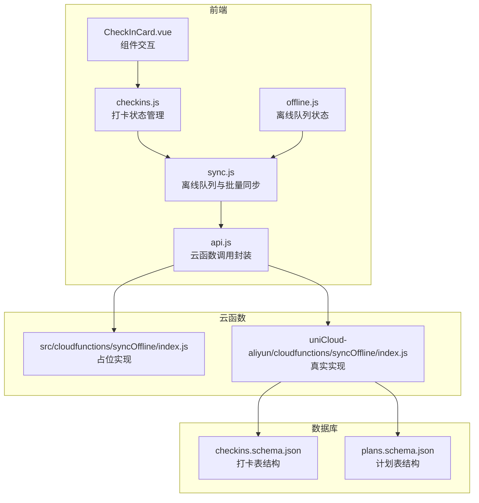
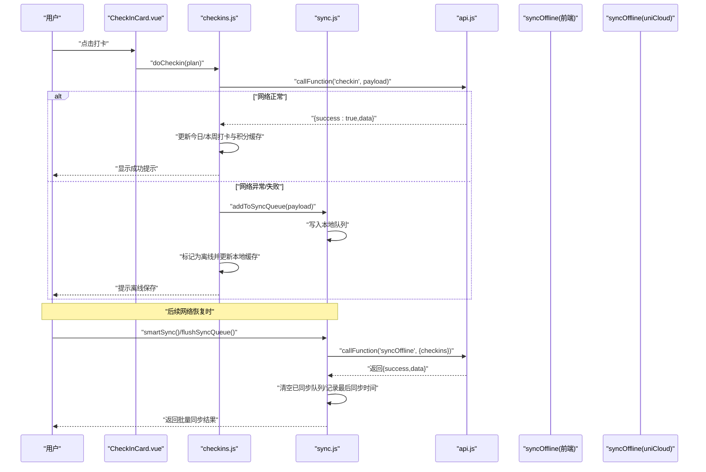
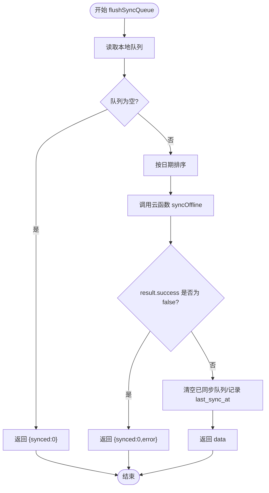
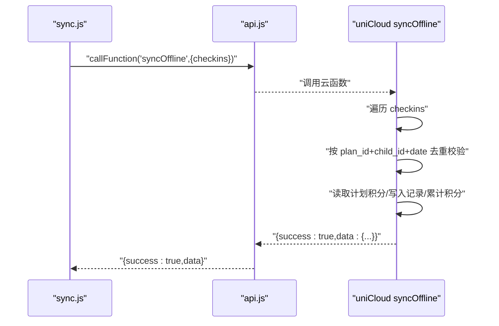
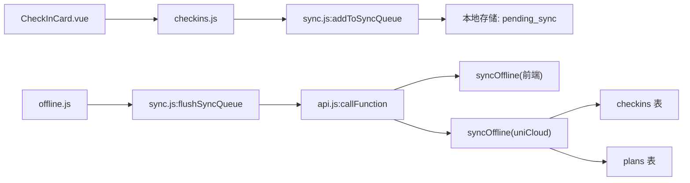

# 离线同步接口

<cite>
**本文引用的文件**
- [src/utils/sync.js](file://src/utils/sync.js)
- [src/stores/offline.js](file://src/stores/offline.js)
- [src/stores/checkins.js](file://src/stores/checkins.js)
- [src/utils/api.js](file://src/utils/api.js)
- [src/cloudfunctions/syncOffline/index.js](file://src/cloudfunctions/syncOffline/index.js)
- [uniCloud-aliyun/cloudfunctions/syncOffline/index.js](file://uniCloud-aliyun/cloudfunctions/syncOffline/index.js)
- [uniCloud-aliyun/database/checkins.schema.json](file://uniCloud-aliyun/database/checkins.schema.json)
- [uniCloud-aliyun/database/plans.schema.json](file://uniCloud-aliyun/database/plans.schema.json)
- [src/components/CheckInCard.vue](file://src/components/CheckInCard.vue)
- [src/pages/plan/list.vue](file://src/pages/plan/list.vue)
</cite>

## 目录
1. [简介](#简介)
2. [项目结构](#项目结构)
3. [核心组件](#核心组件)
4. [架构总览](#架构总览)
5. [详细组件分析](#详细组件分析)
6. [依赖关系分析](#依赖关系分析)
7. [性能考虑](#性能考虑)
8. [故障排除指南](#故障排除指南)
9. [结论](#结论)
10. [附录](#附录)

## 简介
本文件面向“离线同步相关API”的技术文档，覆盖以下内容：
- 离线数据同步、批量上传与冲突处理接口规范
- 离线队列管理、数据缓存策略与同步状态跟踪机制
- 离线操作的数据格式、同步触发条件与错误恢复流程
- 完整的请求与响应示例路径，展示离线数据提交、批量同步与冲突解决流程
- 离线数据存储结构与网络恢复后的同步策略
- 数据一致性保障与性能优化技术实现

## 项目结构
围绕离线同步的关键模块包括：
- 前端工具层：离线队列与智能同步逻辑
- 前端状态层：离线队列状态管理与打卡状态
- 云函数层：批量同步离线打卡记录
- 数据库层：校验与约束定义

图表来源
- [src/components/CheckInCard.vue:1-67](file://src/components/CheckInCard.vue#L1-L67)
- [src/stores/checkins.js:1-163](file://src/stores/checkins.js#L1-L163)
- [src/stores/offline.js:1-30](file://src/stores/offline.js#L1-L30)
- [src/utils/sync.js:1-96](file://src/utils/sync.js#L1-L96)
- [src/utils/api.js:1-18](file://src/utils/api.js#L1-L18)
- [src/cloudfunctions/syncOffline/index.js:1-20](file://src/cloudfunctions/syncOffline/index.js#L1-L20)
- [uniCloud-aliyun/cloudfunctions/syncOffline/index.js:1-90](file://uniCloud-aliyun/cloudfunctions/syncOffline/index.js#L1-L90)
- [uniCloud-aliyun/database/checkins.schema.json:1-52](file://uniCloud-aliyun/database/checkins.schema.json#L1-L52)
- [uniCloud-aliyun/database/plans.schema.json:1-50](file://uniCloud-aliyun/database/plans.schema.json#L1-L50)

章节来源
- [src/utils/sync.js:1-96](file://src/utils/sync.js#L1-L96)
- [src/stores/offline.js:1-30](file://src/stores/offline.js#L1-L30)
- [src/stores/checkins.js:1-163](file://src/stores/checkins.js#L1-L163)
- [src/utils/api.js:1-18](file://src/utils/api.js#L1-L18)
- [src/cloudfunctions/syncOffline/index.js:1-20](file://src/cloudfunctions/syncOffline/index.js#L1-L20)
- [uniCloud-aliyun/cloudfunctions/syncOffline/index.js:1-90](file://uniCloud-aliyun/cloudfunctions/syncOffline/index.js#L1-L90)
- [uniCloud-aliyun/database/checkins.schema.json:1-52](file://uniCloud-aliyun/database/checkins.schema.json#L1-L52)
- [uniCloud-aliyun/database/plans.schema.json:1-50](file://uniCloud-aliyun/database/plans.schema.json#L1-L50)

## 核心组件
- 离线队列工具（sync.js）
  - 提供添加到队列、批量同步、获取待同步数量、上次同步时间、网络状态检测与智能同步等能力
  - 关键导出：addToSyncQueue、flushSyncQueue、getPendingCount、getLastSyncTime、getNetworkType、smartSync
- 离线状态管理（offline.js）
  - Pinia Store，维护 pendingCount 与 syncing 状态，并提供 sync 方法触发批量同步
- 打卡状态管理（checkins.js）
  - 统一管理今日/本周打卡、执行打卡、取消打卡、离线回退与本地缓存
- 云函数调用封装（api.js）
  - 统一封装 uniCloud.callFunction，返回 { success, data|error }
- 云函数实现（syncOffline）
  - 前端占位实现（src）与真实实现（uniCloud-aliyun）

章节来源
- [src/utils/sync.js:1-96](file://src/utils/sync.js#L1-L96)
- [src/stores/offline.js:1-30](file://src/stores/offline.js#L1-L30)
- [src/stores/checkins.js:1-163](file://src/stores/checkins.js#L1-L163)
- [src/utils/api.js:1-18](file://src/utils/api.js#L1-L18)
- [src/cloudfunctions/syncOffline/index.js:1-20](file://src/cloudfunctions/syncOffline/index.js#L1-L20)
- [uniCloud-aliyun/cloudfunctions/syncOffline/index.js:1-90](file://uniCloud-aliyun/cloudfunctions/syncOffline/index.js#L1-L90)

## 架构总览
离线同步整体流程分为“离线记录”和“批量同步”两个阶段：
- 离线记录：用户在无网络或云端异常时，将打卡数据写入本地队列，同时更新本地缓存与UI状态
- 批量同步：在网络可用时，按日期排序后一次性调用云函数批量上传，云端去重并返回统计结果

图表来源
- [src/components/CheckInCard.vue:1-67](file://src/components/CheckInCard.vue#L1-L67)
- [src/stores/checkins.js:26-89](file://src/stores/checkins.js#L26-L89)
- [src/utils/sync.js:13-53](file://src/utils/sync.js#L13-L53)
- [src/utils/api.js:9-17](file://src/utils/api.js#L9-L17)
- [src/cloudfunctions/syncOffline/index.js:4-19](file://src/cloudfunctions/syncOffline/index.js#L4-L19)
- [uniCloud-aliyun/cloudfunctions/syncOffline/index.js:5-89](file://uniCloud-aliyun/cloudfunctions/syncOffline/index.js#L5-L89)

## 详细组件分析

### 离线队列工具（sync.js）
- 存储键
  - pending_sync：本地队列
  - last_sync_at：上次成功同步的时间戳
- 关键方法
  - addToSyncQueue：去重（同 plan_id + 同 date），插入 timestamp
  - flushSyncQueue：按日期排序，调用云函数批量同步；成功则清空队列并更新 last_sync_at
  - getPendingCount/getLastSyncTime：读取待同步数量与上次同步时间
  - getNetworkType：查询网络状态
  - smartSync：仅在网络可用且有待同步数据时执行 flushSyncQueue
- 错误处理
  - 云函数调用失败或返回非成功时，返回 { synced: 0, error }

图表来源
- [src/utils/sync.js:25-53](file://src/utils/sync.js#L25-L53)

章节来源
- [src/utils/sync.js:1-96](file://src/utils/sync.js#L1-L96)

### 离线状态管理（offline.js）
- 维护 pendingCount 与 syncing 状态
- 提供 sync 方法：防并发、无待同步时不执行、捕获异常并复位 syncing

章节来源
- [src/stores/offline.js:1-30](file://src/stores/offline.js#L1-L30)

### 打卡状态管理（checkins.js）
- doCheckin 流程
  - 正常路径：调用云函数 'checkin'，成功则更新今日/本周打卡与积分缓存，可能弹出新勋章提示
  - 离线回退：调用云函数失败时，将数据加入离线队列，UI 标记为未同步，更新本地缓存
- 本地缓存
  - 以日期为键缓存当日打卡，便于网络异常时回退显示
- 取消打卡：调用 'cancelCheckin'，成功则从本地缓存对应日期列表移除

章节来源
- [src/stores/checkins.js:26-89](file://src/stores/checkins.js#L26-L89)
- [src/stores/checkins.js:125-159](file://src/stores/checkins.js#L125-L159)

### 云函数调用封装（api.js）
- 统一封装 uniCloud.callFunction，返回 { success, data|error }
- 用于统一处理前端调用与错误

章节来源
- [src/utils/api.js:1-18](file://src/utils/api.js#L1-L18)

### 云函数实现（syncOffline）
- 前端占位实现（src）
  - 接收 { child_id, checkins: [...] }，逐条处理，返回 { success, data }
- 真实实现（uniCloud-aliyun）
  - 去重校验：按 plan_id + child_id + date 查询是否存在
  - 积分规则：读取计划 points_per_check 或默认值，累加到 totalPoints
  - 写入：向 checkins 表新增记录，更新 members 表积分（upsert）
  - 返回：{ success, data: { synced, failed, conflicts, total_points_added, new_badges } }

图表来源
- [src/utils/sync.js:35-35](file://src/utils/sync.js#L35-L35)
- [src/utils/api.js:9-17](file://src/utils/api.js#L9-L17)
- [uniCloud-aliyun/cloudfunctions/syncOffline/index.js:19-77](file://uniCloud-aliyun/cloudfunctions/syncOffline/index.js#L19-L77)

章节来源
- [src/cloudfunctions/syncOffline/index.js:1-20](file://src/cloudfunctions/syncOffline/index.js#L1-L20)
- [uniCloud-aliyun/cloudfunctions/syncOffline/index.js:1-90](file://uniCloud-aliyun/cloudfunctions/syncOffline/index.js#L1-L90)

### 数据模型与约束
- 打卡表（checkins）
  - 必填字段：plan_id、child_id、date
  - 常用字段：checked_by、feeling、points_earned、created_at
- 计划表（plans）
  - 必填字段：title、family_id、points_per_check、category
  - 默认值：points_per_check 默认 10

章节来源
- [uniCloud-aliyun/database/checkins.schema.json:1-52](file://uniCloud-aliyun/database/checkins.schema.json#L1-L52)
- [uniCloud-aliyun/database/plans.schema.json:1-50](file://uniCloud-aliyun/database/plans.schema.json#L1-L50)

## 依赖关系分析
- 组件耦合
  - CheckInCard.vue -> checkins.js：组件通过事件驱动触发 doCheckin
  - checkins.js -> sync.js：离线回退时调用 addToSyncQueue
  - offline.js -> sync.js：触发 flushSyncQueue
  - sync.js -> api.js -> 云函数
- 外部依赖
  - uniCloud.callFunction：云函数调用
  - 本地存储：pending_sync、last_sync_at、local_checkins

图表来源
- [src/components/CheckInCard.vue:1-67](file://src/components/CheckInCard.vue#L1-L67)
- [src/stores/checkins.js:26-89](file://src/stores/checkins.js#L26-L89)
- [src/stores/offline.js:14-26](file://src/stores/offline.js#L14-L26)
- [src/utils/sync.js:13-53](file://src/utils/sync.js#L13-L53)
- [src/utils/api.js:9-17](file://src/utils/api.js#L9-L17)
- [src/cloudfunctions/syncOffline/index.js:4-19](file://src/cloudfunctions/syncOffline/index.js#L4-L19)
- [uniCloud-aliyun/cloudfunctions/syncOffline/index.js:5-89](file://uniCloud-aliyun/cloudfunctions/syncOffline/index.js#L5-L89)

## 性能考虑
- 批量上传：将多条离线记录按日期排序后一次性上传，减少云函数调用次数
- 去重策略：云端按 plan_id + child_id + date 去重，避免重复积分与记录
- 本地缓存：以日期为键缓存当日打卡，降低网络异常时的回退成本
- 幂等设计：前端去重（同 plan_id + 同 date 不重复入队），云端去重（已存在则跳过）
- 智能同步：仅在网络可用且有待同步数据时执行，避免无效调用

## 故障排除指南
- 症状：离线保存后未同步
  - 检查 pending_sync 队列是否为空
  - 检查网络状态是否为 none
  - 手动调用 flushSyncQueue 或使用 smartSync
- 症状：批量同步返回错误
  - 查看返回的 error 字段
  - 检查云函数日志与数据库权限
- 症状：积分未增加
  - 确认云端去重逻辑是否命中已存在记录
  - 检查计划 points_per_check 是否正确

章节来源
- [src/utils/sync.js:84-95](file://src/utils/sync.js#L84-L95)
- [src/utils/sync.js:49-52](file://src/utils/sync.js#L49-L52)
- [uniCloud-aliyun/cloudfunctions/syncOffline/index.js:20-28](file://uniCloud-aliyun/cloudfunctions/syncOffline/index.js#L20-L28)

## 结论
本系统通过“优先离线 + 静默同步 + 幂等去重”的设计，在弱网环境下仍能保证用户体验与数据一致性。前端负责离线记录与本地缓存，云端负责批量上传与去重校验，二者配合实现了高可用的离线同步方案。

## 附录

### 接口规范与数据格式

- 云函数：syncOffline
  - 请求参数
    - child_id: string（必填）
    - checkins: Array<{ plan_id: string, date: string, feeling?: string, checked_by?: string }>
  - 返回数据
    - success: boolean
    - data: { synced: number, failed: number, conflicts: number, total_points_added: number, new_badges: any[] }
- 批量同步触发方式
  - smartSync：网络可用且有待同步数据时自动触发
  - flushSyncQueue：手动触发批量同步
- 离线队列存储键
  - pending_sync：数组，元素包含 plan_id、date、timestamp 等
  - last_sync_at：时间戳

章节来源
- [src/utils/sync.js:25-53](file://src/utils/sync.js#L25-L53)
- [src/utils/sync.js:84-95](file://src/utils/sync.js#L84-L95)
- [uniCloud-aliyun/cloudfunctions/syncOffline/index.js:5-89](file://uniCloud-aliyun/cloudfunctions/syncOffline/index.js#L5-L89)

### 请求与响应示例（路径）
- 离线数据提交（前端侧）
  - addToSyncQueue 调用位置：[src/stores/checkins.js:79-79](file://src/stores/checkins.js#L79-L79)
  - 本地队列写入位置：[src/utils/sync.js:18-19](file://src/utils/sync.js#L18-L19)
- 批量同步（云端侧）
  - 调用入口：[src/utils/sync.js:35-35](file://src/utils/sync.js#L35-L35)
  - 去重与写入逻辑：[uniCloud-aliyun/cloudfunctions/syncOffline/index.js:20-57](file://uniCloud-aliyun/cloudfunctions/syncOffline/index.js#L20-L57)
  - 积分更新与返回：[uniCloud-aliyun/cloudfunctions/syncOffline/index.js:59-88](file://uniCloud-aliyun/cloudfunctions/syncOffline/index.js#L59-L88)
- 冲突处理
  - 云端去重：若已存在则 conflicts++ 并跳过
  - 前端去重：同 plan_id + 同 date 不重复入队
  - 路径参考：[src/utils/sync.js:15-17](file://src/utils/sync.js#L15-L17)，[uniCloud-aliyun/cloudfunctions/syncOffline/index.js:20-28](file://uniCloud-aliyun/cloudfunctions/syncOffline/index.js#L20-L28)

### 同步触发条件与错误恢复
- 触发条件
  - smartSync：待同步数量 > 0 且网络类型 != none
  - flushSyncQueue：队列非空时手动触发
- 错误恢复
  - 云函数调用失败：返回 { synced: 0, error }，前端可重试或等待下次触发
  - 本地队列保留：直至成功同步或手动清理

章节来源
- [src/utils/sync.js:84-95](file://src/utils/sync.js#L84-L95)
- [src/utils/sync.js:49-52](file://src/utils/sync.js#L49-L52)