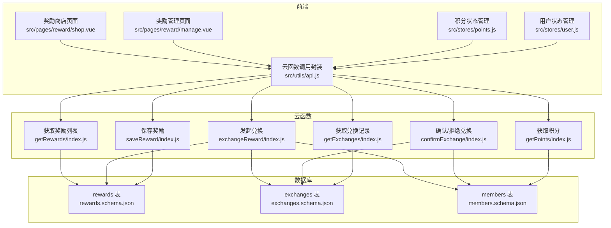
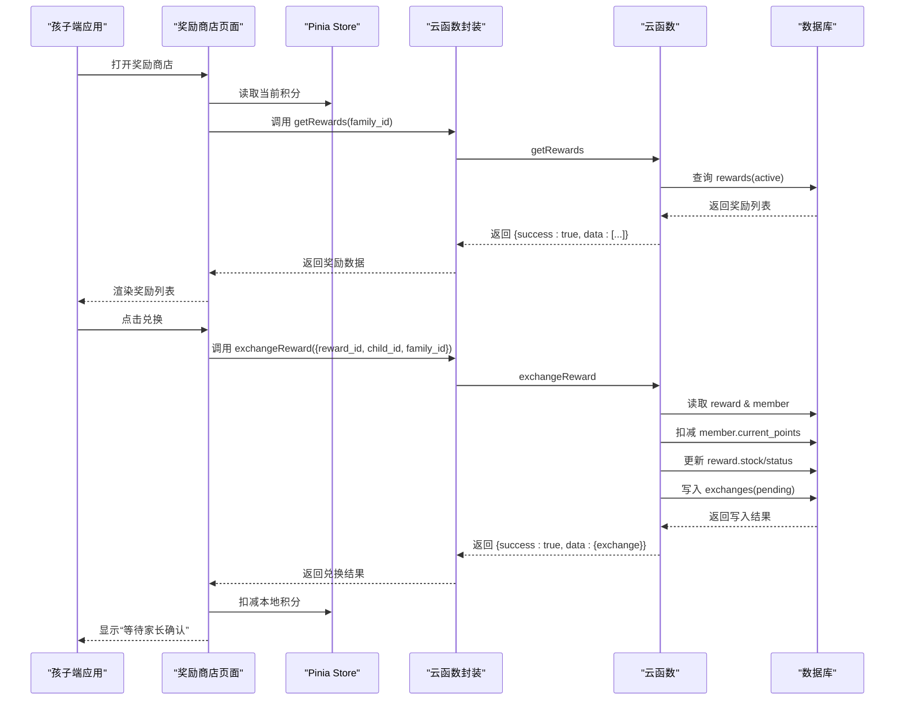
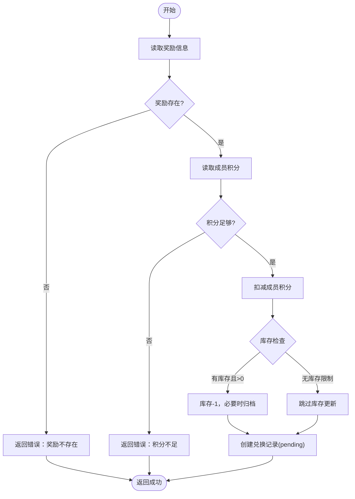
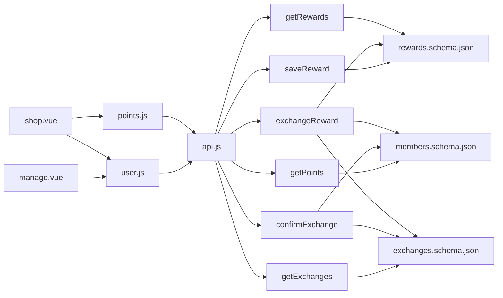
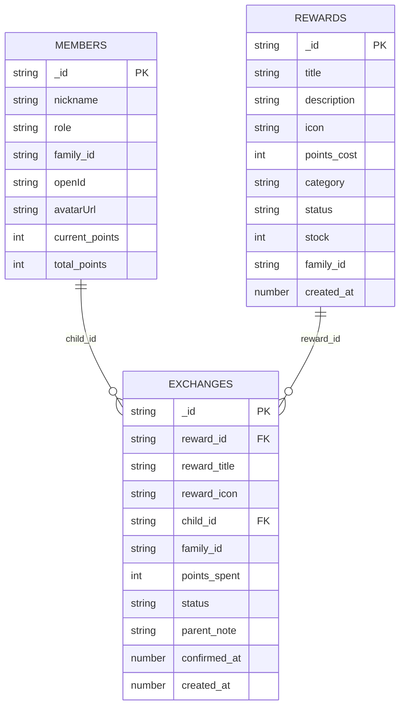

# 积分奖励接口

<cite>
**本文档引用的文件**
- [src/pages/reward/shop.vue](file://src/pages/reward/shop.vue)
- [src/pages/reward/manage.vue](file://src/pages/reward/manage.vue)
- [src/stores/points.js](file://src/stores/points.js)
- [src/stores/user.js](file://src/stores/user.js)
- [src/utils/api.js](file://src/utils/api.js)
- [uniCloud-aliyun/cloudfunctions/getRewards/index.js](file://uniCloud-aliyun/cloudfunctions/getRewards/index.js)
- [uniCloud-aliyun/cloudfunctions/exchangeReward/index.js](file://uniCloud-aliyun/cloudfunctions/exchangeReward/index.js)
- [uniCloud-aliyun/cloudfunctions/confirmExchange/index.js](file://uniCloud-aliyun/cloudfunctions/confirmExchange/index.js)
- [uniCloud-aliyun/cloudfunctions/saveReward/index.js](file://uniCloud-aliyun/cloudfunctions/saveReward/index.js)
- [uniCloud-aliyun/cloudfunctions/getPoints/index.js](file://uniCloud-aliyun/cloudfunctions/getPoints/index.js)
- [uniCloud-aliyun/cloudfunctions/getExchanges/index.js](file://uniCloud-aliyun/cloudfunctions/getExchanges/index.js)
- [uniCloud-aliyun/database/rewards.schema.json](file://uniCloud-aliyun/database/rewards.schema.json)
- [uniCloud-aliyun/database/exchanges.schema.json](file://uniCloud-aliyun/database/exchanges.schema.json)
- [uniCloud-aliyun/database/members.schema.json](file://uniCloud-aliyun/database/members.schema.json)
- [uniCloud-aliyun/common/const.js](file://uniCloud-aliyun/common/const.js)
</cite>

## 目录
1. [简介](#简介)
2. [项目结构](#项目结构)
3. [核心组件](#核心组件)
4. [架构总览](#架构总览)
5. [详细组件分析](#详细组件分析)
6. [依赖关系分析](#依赖关系分析)
7. [性能考虑](#性能考虑)
8. [故障排除指南](#故障排除指南)
9. [结论](#结论)
10. [附录](#附录)

## 简介
本文件为“积分和奖励系统”的API与业务流程文档，覆盖以下能力：
- 积分查询：获取当前可用积分与累计积分
- 奖励兑换：孩子端发起兑换，家长端确认/拒绝
- 奖励商店：展示可兑换奖励，按分类筛选
- 奖励管理：家长端新增/编辑/删除奖励，处理待确认兑换
- 权限与家长模式：角色切换、家长密码校验、数据隔离

系统采用前端页面+Pinia状态管理+uniCloud云函数+数据库Schema的分层设计，通过云函数实现业务逻辑与数据一致性保障。

## 项目结构
前端页面与状态管理位于 src 目录，云函数与数据库Schema位于 uniCloud-aliyun 目录。核心交互链路为：页面组件 -> Pinia Store -> 云函数调用封装 -> uniCloud 数据库。

图表来源
- [src/pages/reward/shop.vue:1-135](file://src/pages/reward/shop.vue#L1-L135)
- [src/pages/reward/manage.vue:1-219](file://src/pages/reward/manage.vue#L1-L219)
- [src/stores/points.js:1-44](file://src/stores/points.js#L1-L44)
- [src/stores/user.js:1-119](file://src/stores/user.js#L1-L119)
- [src/utils/api.js:1-18](file://src/utils/api.js#L1-L18)
- [uniCloud-aliyun/cloudfunctions/getRewards/index.js:1-18](file://uniCloud-aliyun/cloudfunctions/getRewards/index.js#L1-L18)
- [uniCloud-aliyun/cloudfunctions/exchangeReward/index.js:1-53](file://uniCloud-aliyun/cloudfunctions/exchangeReward/index.js#L1-L53)
- [uniCloud-aliyun/cloudfunctions/confirmExchange/index.js:1-34](file://uniCloud-aliyun/cloudfunctions/confirmExchange/index.js#L1-L34)
- [uniCloud-aliyun/cloudfunctions/saveReward/index.js:1-32](file://uniCloud-aliyun/cloudfunctions/saveReward/index.js#L1-L32)
- [uniCloud-aliyun/cloudfunctions/getPoints/index.js:1-18](file://uniCloud-aliyun/cloudfunctions/getPoints/index.js#L1-L18)
- [uniCloud-aliyun/cloudfunctions/getExchanges/index.js:1-20](file://uniCloud-aliyun/cloudfunctions/getExchanges/index.js#L1-L20)
- [uniCloud-aliyun/database/rewards.schema.json:1-53](file://uniCloud-aliyun/database/rewards.schema.json#L1-L53)
- [uniCloud-aliyun/database/exchanges.schema.json:1-56](file://uniCloud-aliyun/database/exchanges.schema.json#L1-L56)
- [uniCloud-aliyun/database/members.schema.json:1-46](file://uniCloud-aliyun/database/members.schema.json#L1-L46)

章节来源
- [src/pages/reward/shop.vue:1-135](file://src/pages/reward/shop.vue#L1-L135)
- [src/pages/reward/manage.vue:1-219](file://src/pages/reward/manage.vue#L1-L219)
- [src/stores/points.js:1-44](file://src/stores/points.js#L1-L44)
- [src/stores/user.js:1-119](file://src/stores/user.js#L1-L119)
- [src/utils/api.js:1-18](file://src/utils/api.js#L1-L18)

## 核心组件
- 页面组件
  - 奖励商店：展示积分、分类筛选、奖励列表、兑换弹窗与家长入口
  - 奖励管理：新建/编辑/删除奖励、查看待确认兑换、确认/拒绝
- 状态管理
  - 积分状态：当前积分、累计积分、历史记录，本地缓存持久化
  - 用户状态：成员ID、家庭ID、角色、昵称、头像、家长密码、家长模式开关
- 云函数封装：统一调用 uniCloud.callFunction 并返回 {success, data}

章节来源
- [src/pages/reward/shop.vue:45-108](file://src/pages/reward/shop.vue#L45-L108)
- [src/pages/reward/manage.vue:70-178](file://src/pages/reward/manage.vue#L70-L178)
- [src/stores/points.js:9-43](file://src/stores/points.js#L9-L43)
- [src/stores/user.js:7-118](file://src/stores/user.js#L7-L118)
- [src/utils/api.js:9-17](file://src/utils/api.js#L9-L17)

## 架构总览
系统采用“前端页面 + 状态管理 + 云函数 + 数据库”四层架构。前端通过 Pinia Store 维护本地状态，通过云函数封装统一调用后端云函数；云函数对数据库进行读写操作，确保业务规则与数据一致性。

图表来源
- [src/pages/reward/shop.vue:64-104](file://src/pages/reward/shop.vue#L64-L104)
- [src/utils/api.js:9-17](file://src/utils/api.js#L9-L17)
- [uniCloud-aliyun/cloudfunctions/getRewards/index.js:4-17](file://uniCloud-aliyun/cloudfunctions/getRewards/index.js#L4-L17)
- [uniCloud-aliyun/cloudfunctions/exchangeReward/index.js:4-52](file://uniCloud-aliyun/cloudfunctions/exchangeReward/index.js#L4-L52)
- [uniCloud-aliyun/database/rewards.schema.json:10-52](file://uniCloud-aliyun/database/rewards.schema.json#L10-L52)
- [uniCloud-aliyun/database/exchanges.schema.json:10-55](file://uniCloud-aliyun/database/exchanges.schema.json#L10-L55)
- [uniCloud-aliyun/database/members.schema.json:10-45](file://uniCloud-aliyun/database/members.schema.json#L10-L45)

## 详细组件分析

### 积分查询接口
- 接口名称：getPoints
- 请求参数
  - member_id: 成员ID（必填）
- 返回字段
  - current_points: 当前可用积分
  - total_points: 累计积分
- 调用位置
  - 前端：积分页面或商店页初始化时调用
  - 实现：读取 members 表对应记录
- 错误处理
  - 成员不存在时返回默认值（0）

章节来源
- [src/stores/points.js:14-24](file://src/stores/points.js#L14-L24)
- [uniCloud-aliyun/cloudfunctions/getPoints/index.js:4-17](file://uniCloud-aliyun/cloudfunctions/getPoints/index.js#L4-L17)
- [uniCloud-aliyun/database/members.schema.json:34-43](file://uniCloud-aliyun/database/members.schema.json#L34-L43)

### 奖励兑换接口
- 接口名称：exchangeReward
- 请求参数
  - reward_id: 奖励ID（必填）
  - child_id: 孩子成员ID（必填）
  - family_id: 家庭ID（可选）
- 返回字段
  - exchange 对象：包含 reward_id、child_id、points_spent、status 等
- 业务规则
  - 校验积分余额是否足够
  - 扣减成员积分
  - 库存检查：若库存存在且>0则扣减；库存<=0时将奖励状态置为归档
  - 创建兑换记录，初始状态为 pending
- 错误处理
  - 奖励不存在、积分不足、数据库异常等

图表来源
- [uniCloud-aliyun/cloudfunctions/exchangeReward/index.js:4-52](file://uniCloud-aliyun/cloudfunctions/exchangeReward/index.js#L4-L52)
- [uniCloud-aliyun/database/rewards.schema.json:34-42](file://uniCloud-aliyun/database/rewards.schema.json#L34-L42)
- [uniCloud-aliyun/database/exchanges.schema.json:34-41](file://uniCloud-aliyun/database/exchanges.schema.json#L34-L41)
- [uniCloud-aliyun/database/members.schema.json:34-37](file://uniCloud-aliyun/database/members.schema.json#L34-L37)

章节来源
- [src/pages/reward/shop.vue:77-104](file://src/pages/reward/shop.vue#L77-L104)
- [uniCloud-aliyun/cloudfunctions/exchangeReward/index.js:4-52](file://uniCloud-aliyun/cloudfunctions/exchangeReward/index.js#L4-L52)

### 确认/拒绝兑换接口
- 接口名称：confirmExchange
- 请求参数
  - exchange_id: 兑换记录ID（必填）
  - confirmed: true/false（必填）
  - parent_note: 家长备注（可选）
- 业务规则
  - confirmed=true：将状态置为 confirmed，记录确认时间
  - confirmed=false：将状态置为 cancelled，并退还积分给成员
- 错误处理
  - 兑换记录不存在、数据库异常等

章节来源
- [src/pages/reward/manage.vue:150-177](file://src/pages/reward/manage.vue#L150-L177)
- [uniCloud-aliyun/cloudfunctions/confirmExchange/index.js:4-33](file://uniCloud-aliyun/cloudfunctions/confirmExchange/index.js#L4-L33)

### 奖励商店接口
- 接口名称：getRewards
- 请求参数
  - family_id: 家庭ID（可选）
- 返回字段
  - 奖励数组：按创建时间倒序，仅返回状态为 active 的奖励
- 业务规则
  - 支持按家庭ID过滤，实现多用户数据隔离
- 错误处理
  - 数据库查询异常

章节来源
- [src/pages/reward/shop.vue:64-75](file://src/pages/reward/shop.vue#L64-L75)
- [uniCloud-aliyun/cloudfunctions/getRewards/index.js:4-17](file://uniCloud-aliyun/cloudfunctions/getRewards/index.js#L4-L17)

### 奖励管理接口
- 接口名称：saveReward
- 请求参数
  - reward_id: 奖励ID（可选，存在时表示更新）
  - title/description/icon/category/stock/family_id：奖励属性
  - points_cost：所需积分
- 返回字段
  - 保存后的奖励对象
- 业务规则
  - 新建：设置默认状态为 active，库存默认-1（无限）
  - 更新：直接更新字段
- 错误处理
  - 数据库异常

章节来源
- [src/pages/reward/manage.vue:104-128](file://src/pages/reward/manage.vue#L104-L128)
- [uniCloud-aliyun/cloudfunctions/saveReward/index.js:4-31](file://uniCloud-aliyun/cloudfunctions/saveReward/index.js#L4-L31)
- [uniCloud-aliyun/database/rewards.schema.json:34-42](file://uniCloud-aliyun/database/rewards.schema.json#L34-L42)

### 兑换记录查询接口
- 接口名称：getExchanges
- 请求参数
  - child_id: 孩子成员ID（可选）
  - status: 状态过滤（可选）
  - family_id: 家庭ID（可选）
- 返回字段
  - 兑换记录数组：按创建时间倒序
- 业务规则
  - 支持按成员、状态、家庭ID过滤
- 错误处理
  - 数据库异常

章节来源
- [src/pages/reward/manage.vue:93-96](file://src/pages/reward/manage.vue#L93-L96)
- [uniCloud-aliyun/cloudfunctions/getExchanges/index.js:4-19](file://uniCloud-aliyun/cloudfunctions/getExchanges/index.js#L4-L19)

### 积分计算规则与获取来源
- 计算规则
  - 当前可用积分：members.current_points
  - 累计积分：members.total_points
  - 历史记录：每次加/扣积分都会写入历史，最多保留最近200条
- 获取来源
  - 系统常量中定义了连续打卡加成规则（例如连续3/7/14天的额外积分）
  - 参考常量定义文件中的加成配置
- 使用限制
  - 兑换前会校验当前积分是否≥奖励所需积分
  - 兑换后立即从当前积分中扣除相应数值

章节来源
- [src/stores/points.js:26-33](file://src/stores/points.js#L26-L33)
- [uniCloud-aliyun/common/const.js:2-17](file://uniCloud-aliyun/common/const.js#L2-L17)
- [uniCloud-aliyun/database/members.schema.json:34-43](file://uniCloud-aliyun/database/members.schema.json#L34-L43)

### 奖励商品管理与库存控制
- 商品管理
  - 支持新增、编辑、删除奖励
  - 支持分类（体验/物质）、图标、描述、库存等属性
- 库存控制
  - 库存为-1表示无限
  - 有库存时，每次兑换库存-1；当库存<=0时自动归档（状态变为归档）
- 数据一致性
  - 兑换流程中先扣减积分，再更新库存，最后创建兑换记录，确保原子性

章节来源
- [src/pages/reward/manage.vue:88-148](file://src/pages/reward/manage.vue#L88-L148)
- [uniCloud-aliyun/cloudfunctions/saveReward/index.js:8-31](file://uniCloud-aliyun/cloudfunctions/saveReward/index.js#L8-L31)
- [uniCloud-aliyun/cloudfunctions/exchangeReward/index.js:29-35](file://uniCloud-aliyun/cloudfunctions/exchangeReward/index.js#L29-L35)
- [uniCloud-aliyun/database/rewards.schema.json:34-42](file://uniCloud-aliyun/database/rewards.schema.json#L34-L42)

### 兑换流程API调用方式
- 孩子端
  - 加载奖励：调用 getRewards(family_id)
  - 发起兑换：调用 exchangeReward({reward_id, child_id, family_id})
- 家长端
  - 加载待确认：调用 getExchanges({status:'pending', family_id})
  - 确认/拒绝：调用 confirmExchange({exchange_id, confirmed, parent_note})
  - 管理奖励：调用 getRewards/getExchanges/saveReward/deleteReward

章节来源
- [src/pages/reward/shop.vue:64-104](file://src/pages/reward/shop.vue#L64-L104)
- [src/pages/reward/manage.vue:83-177](file://src/pages/reward/manage.vue#L83-L177)

### 完整流程示例（请求/响应）
- 积分查询
  - 请求：调用 getPoints({ member_id })
  - 响应：{ success: true, data: { current_points, total_points } }
- 奖励兑换
  - 请求：调用 exchangeReward({ reward_id, child_id, family_id })
  - 响应：{ success: true, data: { _id, reward_id, child_id, points_spent, status } }
- 确认/拒绝兑换
  - 请求：调用 confirmExchange({ exchange_id, confirmed, parent_note })
  - 响应：{ success: true }
- 奖励管理
  - 请求：调用 saveReward({ family_id, title, points_cost, category, stock, ... })
  - 响应：{ success: true, data: { _id, ... } }

章节来源
- [uniCloud-aliyun/cloudfunctions/getPoints/index.js:11-16](file://uniCloud-aliyun/cloudfunctions/getPoints/index.js#L11-L16)
- [uniCloud-aliyun/cloudfunctions/exchangeReward/index.js:51](file://uniCloud-aliyun/cloudfunctions/exchangeReward/index.js#L51)
- [uniCloud-aliyun/cloudfunctions/confirmExchange/index.js:32](file://uniCloud-aliyun/cloudfunctions/confirmExchange/index.js#L32)
- [uniCloud-aliyun/cloudfunctions/saveReward/index.js:30](file://uniCloud-aliyun/cloudfunctions/saveReward/index.js#L30)

### 权限控制与家长管理模式
- 角色模型
  - 角色：parent（家长）、child（孩子）
  - 家长密码：设置后开启家长模式，需密码验证
- 技术实现
  - 用户状态存储：role、memberId、familyId、openId、avatarUrl 等
  - 家长模式切换：switchToParent(password) 验证密码后切换为 parent
  - 数据隔离：所有查询均携带 family_id，确保多用户数据隔离
- 页面入口
  - 孩子端：显示“管理奖励”入口（仅家长可见）
  - 家长端：提供奖励管理与待确认兑换界面

章节来源
- [src/stores/user.js:18-77](file://src/stores/user.js#L18-L77)
- [src/pages/reward/shop.vue:35-41](file://src/pages/reward/shop.vue#L35-L41)
- [src/pages/reward/manage.vue:83-96](file://src/pages/reward/manage.vue#L83-L96)

## 依赖关系分析
- 前端依赖
  - 页面组件依赖 Pinia Store 提供的状态
  - Store 依赖云函数封装进行后端调用
- 云函数依赖
  - 读写数据库集合：rewards、exchanges、members
  - 业务规则在云函数中集中实现，避免前端绕过校验
- 数据库依赖
  - Schema 定义字段类型、默认值与权限
  - 通过 family_id 实现多租户隔离

图表来源
- [src/pages/reward/shop.vue:45-51](file://src/pages/reward/shop.vue#L45-L51)
- [src/pages/reward/manage.vue:73-74](file://src/pages/reward/manage.vue#L73-L74)
- [src/stores/points.js:4](file://src/stores/points.js#L4)
- [src/stores/user.js:4](file://src/stores/user.js#L4)
- [src/utils/api.js:9-17](file://src/utils/api.js#L9-L17)
- [uniCloud-aliyun/cloudfunctions/getRewards/index.js:4-17](file://uniCloud-aliyun/cloudfunctions/getRewards/index.js#L4-L17)
- [uniCloud-aliyun/cloudfunctions/exchangeReward/index.js:4-52](file://uniCloud-aliyun/cloudfunctions/exchangeReward/index.js#L4-L52)
- [uniCloud-aliyun/cloudfunctions/confirmExchange/index.js:4-33](file://uniCloud-aliyun/cloudfunctions/confirmExchange/index.js#L4-L33)
- [uniCloud-aliyun/cloudfunctions/saveReward/index.js:4-31](file://uniCloud-aliyun/cloudfunctions/saveReward/index.js#L4-L31)
- [uniCloud-aliyun/cloudfunctions/getPoints/index.js:4-17](file://uniCloud-aliyun/cloudfunctions/getPoints/index.js#L4-L17)
- [uniCloud-aliyun/cloudfunctions/getExchanges/index.js:4-19](file://uniCloud-aliyun/cloudfunctions/getExchanges/index.js#L4-L19)
- [uniCloud-aliyun/database/rewards.schema.json:10-52](file://uniCloud-aliyun/database/rewards.schema.json#L10-L52)
- [uniCloud-aliyun/database/exchanges.schema.json:10-55](file://uniCloud-aliyun/database/exchanges.schema.json#L10-L55)
- [uniCloud-aliyun/database/members.schema.json:10-45](file://uniCloud-aliyun/database/members.schema.json#L10-L45)

## 性能考虑
- 前端缓存
  - 积分状态使用本地存储持久化，减少重复请求
- 合理分页
  - 当前页面未实现分页，建议后续对奖励列表与兑换记录增加分页参数
- 网络优化
  - 云函数中尽量合并数据库操作，减少往返次数
- 数据库索引
  - 建议在 members.family_id、rewards.family_id、exchanges.family_id 上建立索引以提升查询性能

## 故障排除指南
- 云函数调用失败
  - 现象：返回 { success: false, error }
  - 处理：检查网络状态、云函数部署状态、参数格式
- 奖励不存在
  - 现象：exchangeReward 返回错误
  - 处理：确认 reward_id 正确、奖励状态为 active
- 积分不足
  - 现象：exchangeReward 返回错误
  - 处理：提示用户刷新积分或完成任务获取积分
- 兑换记录不存在
  - 现象：confirmExchange 返回错误
  - 处理：确认 exchange_id 正确、状态未被其他操作修改
- 家长模式无法切换
  - 现象：switchToParent 返回 need_set/wrong
  - 处理：先设置家长密码或输入正确密码

章节来源
- [src/utils/api.js:13-16](file://src/utils/api.js#L13-L16)
- [uniCloud-aliyun/cloudfunctions/exchangeReward/index.js:11-22](file://uniCloud-aliyun/cloudfunctions/exchangeReward/index.js#L11-L22)
- [uniCloud-aliyun/cloudfunctions/confirmExchange/index.js:11-13](file://uniCloud-aliyun/cloudfunctions/confirmExchange/index.js#L11-L13)
- [src/stores/user.js:67-77](file://src/stores/user.js#L67-L77)

## 结论
本系统通过清晰的前后端分层与严格的云函数业务逻辑，实现了积分查询、奖励兑换与管理的完整闭环。家长模式与数据隔离机制确保了多用户场景下的安全与独立性。建议后续引入分页、索引优化与更完善的错误提示，进一步提升用户体验与系统稳定性。

## 附录
- 数据模型图

图表来源
- [uniCloud-aliyun/database/members.schema.json:10-45](file://uniCloud-aliyun/database/members.schema.json#L10-L45)
- [uniCloud-aliyun/database/rewards.schema.json:10-52](file://uniCloud-aliyun/database/rewards.schema.json#L10-L52)
- [uniCloud-aliyun/database/exchanges.schema.json:10-55](file://uniCloud-aliyun/database/exchanges.schema.json#L10-L55)