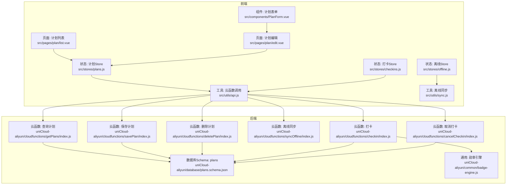
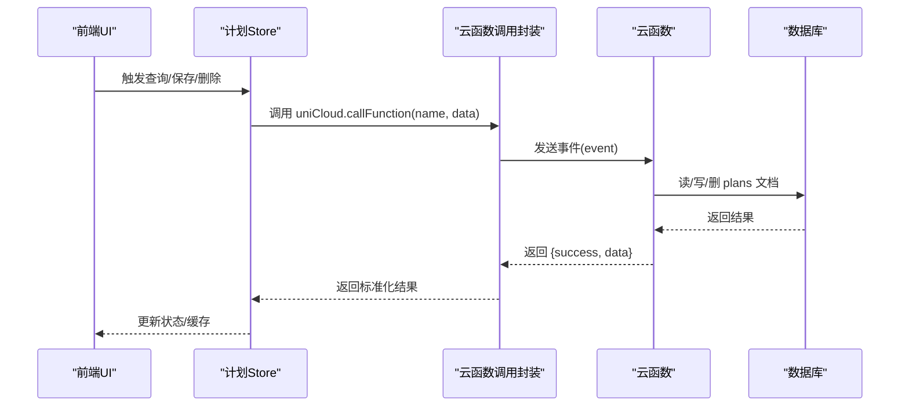
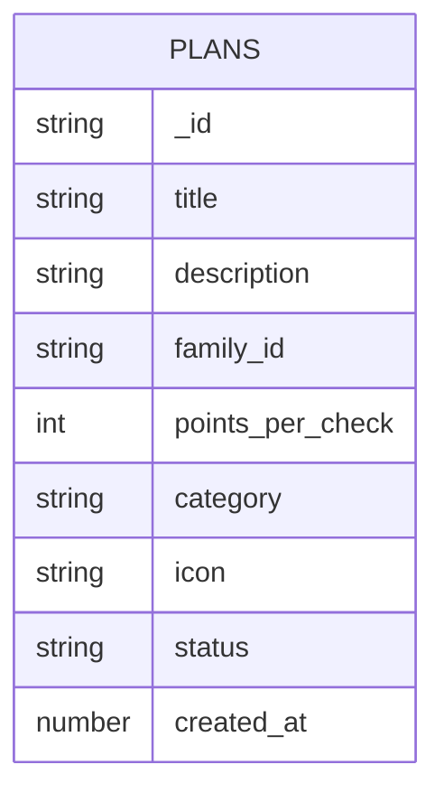
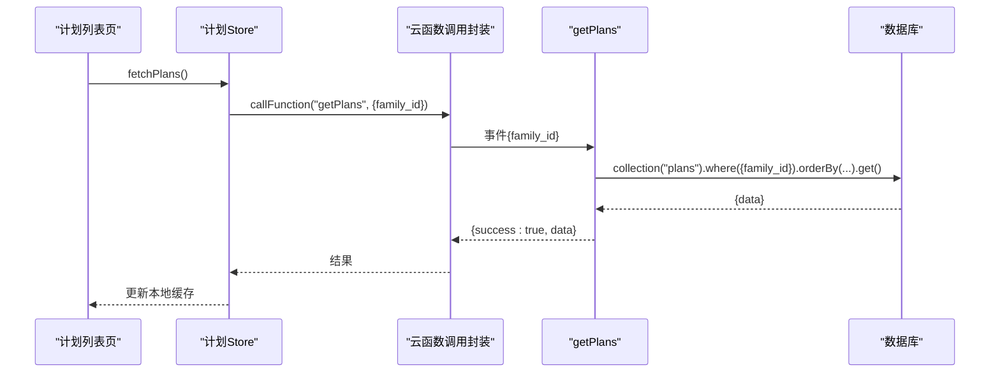
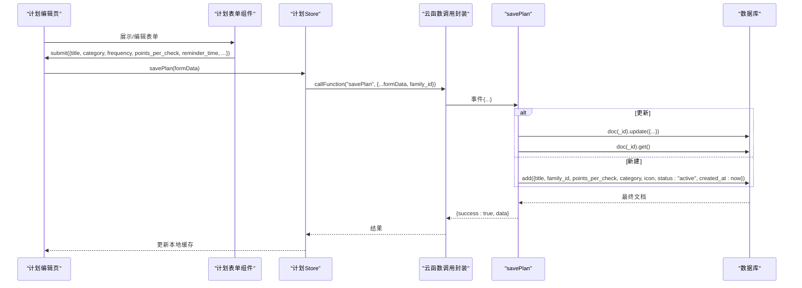
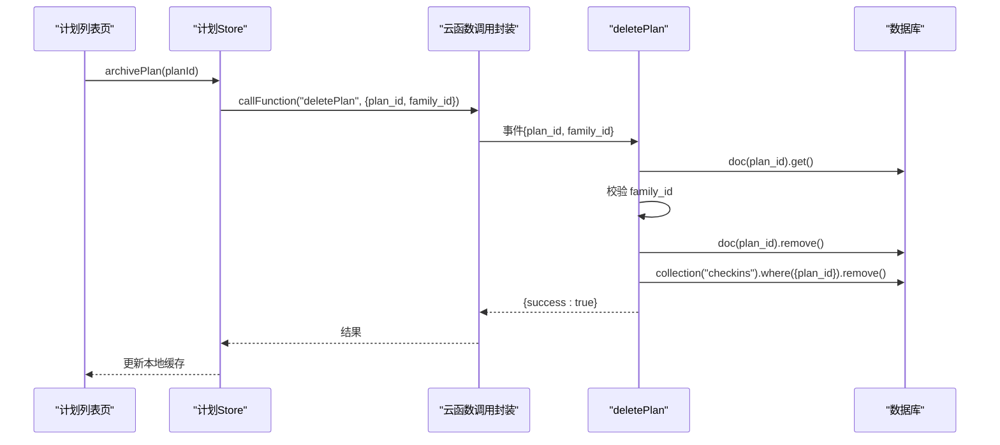
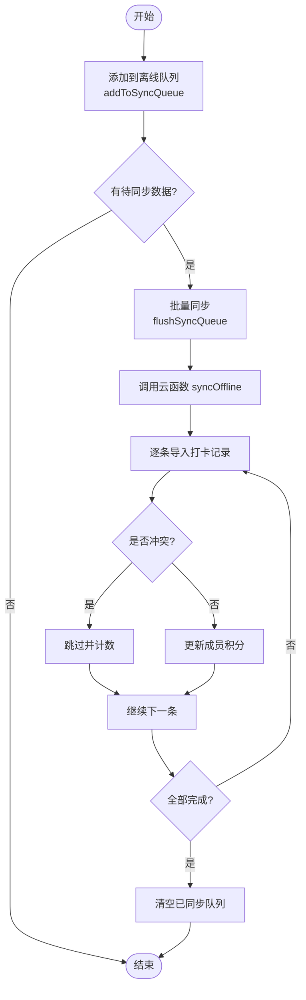
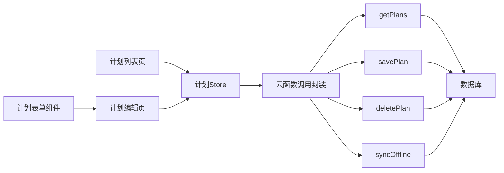

# 计划管理接口

<cite>
**本文档引用的文件**
- [src/stores/plans.js](file://src/stores/plans.js)
- [src/utils/api.js](file://src/utils/api.js)
- [src/pages/plan/list.vue](file://src/pages/plan/list.vue)
- [src/pages/plan/edit.vue](file://src/pages/plan/edit.vue)
- [src/components/PlanForm.vue](file://src/components/PlanForm.vue)
- [src/stores/checkins.js](file://src/stores/checkins.js)
- [src/stores/offline.js](file://src/stores/offline.js)
- [src/utils/sync.js](file://src/utils/sync.js)
- [uniCloud-aliyun/cloudfunctions/getPlans/index.js](file://uniCloud-aliyun/cloudfunctions/getPlans/index.js)
- [uniCloud-aliyun/cloudfunctions/savePlan/index.js](file://uniCloud-aliyun/cloudfunctions/savePlan/index.js)
- [uniCloud-aliyun/cloudfunctions/deletePlan/index.js](file://uniCloud-aliyun/cloudfunctions/deletePlan/index.js)
- [uniCloud-aliyun/cloudfunctions/syncOffline/index.js](file://uniCloud-aliyun/cloudfunctions/syncOffline/index.js)
- [uniCloud-aliyun/cloudfunctions/checkin/index.js](file://uniCloud-aliyun/cloudfunctions/checkin/index.js)
- [uniCloud-aliyun/cloudfunctions/cancelCheckin/index.js](file://uniCloud-aliyun/cloudfunctions/cancelCheckin/index.js)
- [uniCloud-aliyun/database/plans.schema.json](file://uniCloud-aliyun/database/plans.schema.json)
- [uniCloud-aliyun/common/badge-engine.js](file://uniCloud-aliyun/common/badge-engine.js)
</cite>

## 目录
1. [简介](#简介)
2. [项目结构](#项目结构)
3. [核心组件](#核心组件)
4. [架构总览](#架构总览)
5. [详细组件分析](#详细组件分析)
6. [依赖关系分析](#依赖关系分析)
7. [性能考虑](#性能考虑)
8. [故障排除指南](#故障排除指南)
9. [结论](#结论)
10. [附录](#附录)

## 简介
本文件为“计划管理API”的完整技术文档，覆盖计划的查询、保存与删除三大核心能力，以及计划数据结构、字段定义、验证规则、状态管理、时间安排与重复设置的API调用方式。文档同时解释权限控制与数据同步机制，提供完整的请求与响应示例路径，并总结批量操作与错误处理的最佳实践。

## 项目结构
计划管理涉及前端状态管理与后端云函数两大部分：
- 前端通过 Pinia Store 管理计划列表、保存与删除操作，并通过统一的云函数调用封装发起请求。
- 后端通过 uniCloud 云函数实现计划的增删改查、权限校验与数据清理，配合数据库 schema 定义字段约束。

图表来源
- [src/pages/plan/list.vue:1-133](file://src/pages/plan/list.vue#L1-L133)
- [src/pages/plan/edit.vue:1-35](file://src/pages/plan/edit.vue#L1-L35)
- [src/components/PlanForm.vue:1-119](file://src/components/PlanForm.vue#L1-L119)
- [src/stores/plans.js:1-73](file://src/stores/plans.js#L1-L73)
- [src/stores/checkins.js:1-163](file://src/stores/checkins.js#L1-L163)
- [src/stores/offline.js:1-30](file://src/stores/offline.js#L1-L30)
- [src/utils/api.js:1-18](file://src/utils/api.js#L1-L18)
- [src/utils/sync.js:1-96](file://src/utils/sync.js#L1-L96)
- [uniCloud-aliyun/cloudfunctions/getPlans/index.js:1-15](file://uniCloud-aliyun/cloudfunctions/getPlans/index.js#L1-L15)
- [uniCloud-aliyun/cloudfunctions/savePlan/index.js:1-31](file://uniCloud-aliyun/cloudfunctions/savePlan/index.js#L1-L31)
- [uniCloud-aliyun/cloudfunctions/deletePlan/index.js:1-25](file://uniCloud-aliyun/cloudfunctions/deletePlan/index.js#L1-L25)
- [uniCloud-aliyun/cloudfunctions/syncOffline/index.js:1-90](file://uniCloud-aliyun/cloudfunctions/syncOffline/index.js#L1-L90)
- [uniCloud-aliyun/cloudfunctions/checkin/index.js:1-83](file://uniCloud-aliyun/cloudfunctions/checkin/index.js#L1-L83)
- [uniCloud-aliyun/cloudfunctions/cancelCheckin/index.js:1-33](file://uniCloud-aliyun/cloudfunctions/cancelCheckin/index.js#L1-L33)
- [uniCloud-aliyun/database/plans.schema.json:1-50](file://uniCloud-aliyun/database/plans.schema.json#L1-L50)
- [uniCloud-aliyun/common/badge-engine.js:1-125](file://uniCloud-aliyun/common/badge-engine.js#L1-L125)

章节来源
- [src/stores/plans.js:1-73](file://src/stores/plans.js#L1-L73)
- [src/utils/api.js:1-18](file://src/utils/api.js#L1-L18)
- [uniCloud-aliyun/cloudfunctions/getPlans/index.js:1-15](file://uniCloud-aliyun/cloudfunctions/getPlans/index.js#L1-L15)
- [uniCloud-aliyun/cloudfunctions/savePlan/index.js:1-31](file://uniCloud-aliyun/cloudfunctions/savePlan/index.js#L1-L31)
- [uniCloud-aliyun/cloudfunctions/deletePlan/index.js:1-25](file://uniCloud-aliyun/cloudfunctions/deletePlan/index.js#L1-L25)
- [uniCloud-aliyun/database/plans.schema.json:1-50](file://uniCloud-aliyun/database/plans.schema.json#L1-L50)

## 核心组件
- 计划Store（Pinia）：负责计划列表的拉取、保存（新建/更新）、归档（删除），并维护本地缓存。
- 云函数调用封装：统一封装 uniCloud.callFunction 调用，返回标准化结果。
- 计划表单组件：提供计划名称、分类、频次、每次积分、提醒时间等输入项。
- 打卡Store：与计划关联，支持打卡、取消打卡、离线同步与连续打卡加成计算。
- 离线Store：管理待同步队列数量与触发批量同步。

章节来源
- [src/stores/plans.js:9-72](file://src/stores/plans.js#L9-L72)
- [src/utils/api.js:9-17](file://src/utils/api.js#L9-L17)
- [src/components/PlanForm.vue:52-88](file://src/components/PlanForm.vue#L52-L88)
- [src/stores/checkins.js:9-162](file://src/stores/checkins.js#L9-L162)
- [src/stores/offline.js:6-28](file://src/stores/offline.js#L6-L28)

## 架构总览
前端通过 Pinia Store 调用统一的云函数封装，后端云函数访问数据库 plans 集合并执行业务逻辑；删除计划会级联清理打卡记录；离线场景下通过 syncOffline 云函数批量导入打卡并更新成员积分。

图表来源
- [src/stores/plans.js:14-59](file://src/stores/plans.js#L14-L59)
- [src/utils/api.js:9-17](file://src/utils/api.js#L9-L17)
- [uniCloud-aliyun/cloudfunctions/getPlans/index.js:4-14](file://uniCloud-aliyun/cloudfunctions/getPlans/index.js#L4-L14)
- [uniCloud-aliyun/cloudfunctions/savePlan/index.js:4-30](file://uniCloud-aliyun/cloudfunctions/savePlan/index.js#L4-L30)
- [uniCloud-aliyun/cloudfunctions/deletePlan/index.js:4-24](file://uniCloud-aliyun/cloudfunctions/deletePlan/index.js#L4-L24)

## 详细组件分析

### 计划数据模型与字段定义
- 数据集合：plans
- 字段定义与约束（schema）：
  - _id：字符串，文档ID
  - title：字符串，必填
  - description：字符串
  - family_id：字符串，必填（用于权限隔离）
  - points_per_check：整数，默认10，必填
  - category：字符串，默认"other"，必填
  - icon：字符串
  - status：字符串，默认"active"，可选值"active"/"archived"
  - created_at：数字，时间戳

图表来源
- [uniCloud-aliyun/database/plans.schema.json:10-49](file://uniCloud-aliyun/database/plans.schema.json#L10-L49)

章节来源
- [uniCloud-aliyun/database/plans.schema.json:1-50](file://uniCloud-aliyun/database/plans.schema.json#L1-L50)

### 计划查询接口
- HTTP方法：GET（通过 uniCloud 云函数封装）
- URL模式：调用云函数 getPlans
- 请求参数：
  - family_id：字符串，必填（用于按家庭过滤）
- 响应数据：
  - success：布尔
  - data：数组，每个元素为一个计划对象（包含上述字段）

图表来源
- [src/stores/plans.js:14-28](file://src/stores/plans.js#L14-L28)
- [src/utils/api.js:9-17](file://src/utils/api.js#L9-L17)
- [uniCloud-aliyun/cloudfunctions/getPlans/index.js:4-14](file://uniCloud-aliyun/cloudfunctions/getPlans/index.js#L4-L14)

章节来源
- [src/stores/plans.js:14-28](file://src/stores/plans.js#L14-L28)
- [uniCloud-aliyun/cloudfunctions/getPlans/index.js:4-14](file://uniCloud-aliyun/cloudfunctions/getPlans/index.js#L4-L14)

### 计划保存接口（新建/更新）
- HTTP方法：POST（通过云函数封装）
- URL模式：调用云函数 savePlan
- 请求参数：
  - _id：字符串（更新时传入）
  - title：字符串，必填
  - description：字符串
  - family_id：字符串，必填
  - points_per_check：整数，默认10
  - category：字符串，默认"other"
  - icon：字符串
- 响应数据：
  - success：布尔
  - data：保存后的计划对象

图表来源
- [src/pages/plan/edit.vue:22-30](file://src/pages/plan/edit.vue#L22-L30)
- [src/components/PlanForm.vue:79-88](file://src/components/PlanForm.vue#L79-L88)
- [src/stores/plans.js:31-47](file://src/stores/plans.js#L31-L47)
- [src/utils/api.js:9-17](file://src/utils/api.js#L9-L17)
- [uniCloud-aliyun/cloudfunctions/savePlan/index.js:4-30](file://uniCloud-aliyun/cloudfunctions/savePlan/index.js#L4-L30)

章节来源
- [src/pages/plan/edit.vue:22-30](file://src/pages/plan/edit.vue#L22-L30)
- [src/components/PlanForm.vue:69-88](file://src/components/PlanForm.vue#L69-L88)
- [src/stores/plans.js:31-47](file://src/stores/plans.js#L31-L47)
- [uniCloud-aliyun/cloudfunctions/savePlan/index.js:4-30](file://uniCloud-aliyun/cloudfunctions/savePlan/index.js#L4-L30)

### 计划删除接口（归档）
- HTTP方法：POST（通过云函数封装）
- URL模式：调用云函数 deletePlan
- 请求参数：
  - plan_id：字符串，必填
  - family_id：字符串，必填（用于权限校验）
- 响应数据：
  - success：布尔
- 删除行为：
  - 校验计划属于该家庭，防止越权删除
  - 删除计划文档
  - 级联删除该计划下的所有打卡记录

图表来源
- [src/pages/plan/list.vue:73-93](file://src/pages/plan/list.vue#L73-L93)
- [src/stores/plans.js:49-59](file://src/stores/plans.js#L49-L59)
- [src/utils/api.js:9-17](file://src/utils/api.js#L9-L17)
- [uniCloud-aliyun/cloudfunctions/deletePlan/index.js:4-24](file://uniCloud-aliyun/cloudfunctions/deletePlan/index.js#L4-L24)

章节来源
- [src/pages/plan/list.vue:73-93](file://src/pages/plan/list.vue#L73-L93)
- [src/stores/plans.js:49-59](file://src/stores/plans.js#L49-L59)
- [uniCloud-aliyun/cloudfunctions/deletePlan/index.js:4-24](file://uniCloud-aliyun/cloudfunctions/deletePlan/index.js#L4-L24)

### 计划状态管理与时间安排
- 状态字段：status（active/archived），默认 active
- 时间字段：created_at（数字时间戳）
- 重复设置：前端表单包含 frequency 对象（type: daily/weekly, count: 数字），但后端云函数未直接解析该字段；如需服务端重复逻辑，请在云函数中扩展解析与存储。

章节来源
- [uniCloud-aliyun/database/plans.schema.json:39-47](file://uniCloud-aliyun/database/plans.schema.json#L39-L47)
- [src/components/PlanForm.vue:22-32](file://src/components/PlanForm.vue#L22-L32)
- [uniCloud-aliyun/cloudfunctions/savePlan/index.js:6-29](file://uniCloud-aliyun/cloudfunctions/savePlan/index.js#L6-L29)

### 权限控制与数据同步机制
- 权限控制：
  - 查询：按 family_id 过滤
  - 删除：先校验计划的 family_id 是否匹配，防止越权删除
- 数据同步：
  - 前端离线场景：通过 addToSyncQueue 将打卡记录加入本地队列
  - 批量同步：flushSyncQueue 调用 syncOffline 云函数，按日期排序后批量导入
  - 冲突处理：云端按 plan_id+child_id+date 去重，避免重复导入

图表来源
- [src/utils/sync.js:13-53](file://src/utils/sync.js#L13-L53)
- [uniCloud-aliyun/cloudfunctions/syncOffline/index.js:5-89](file://uniCloud-aliyun/cloudfunctions/syncOffline/index.js#L5-L89)

章节来源
- [src/utils/sync.js:13-53](file://src/utils/sync.js#L13-L53)
- [uniCloud-aliyun/cloudfunctions/syncOffline/index.js:5-89](file://uniCloud-aliyun/cloudfunctions/syncOffline/index.js#L5-L89)

### 批量操作与错误处理最佳实践
- 批量操作：
  - 离线队列：按日期排序后批量导入，减少多次网络往返
  - 幂等设计：云端根据复合键去重，避免重复导入
- 错误处理：
  - 云函数封装统一捕获异常并返回 {success:false, error}
  - 前端 Store 在保存/删除失败时返回 {success:false, error}，便于 UI 提示
  - 删除失败时保持本地缓存不变，保证一致性

章节来源
- [src/utils/api.js:9-17](file://src/utils/api.js#L9-L17)
- [src/stores/plans.js:44-46](file://src/stores/plans.js#L44-L46)
- [uniCloud-aliyun/cloudfunctions/syncOffline/index.js:15-28](file://uniCloud-aliyun/cloudfunctions/syncOffline/index.js#L15-L28)

## 依赖关系分析
- 组件耦合：
  - 页面依赖 Store，Store 依赖云函数封装
  - Store 与数据库 schema 存在隐式依赖（字段名与类型）
  - 打卡模块与计划模块通过 plan_id 关联
- 外部依赖：
  - uniCloud.callFunction
  - 本地存储（Storage）用于缓存与离线队列

图表来源
- [src/pages/plan/list.vue:46-93](file://src/pages/plan/list.vue#L46-L93)
- [src/pages/plan/edit.vue:7-30](file://src/pages/plan/edit.vue#L7-L30)
- [src/components/PlanForm.vue:52-88](file://src/components/PlanForm.vue#L52-L88)
- [src/stores/plans.js:9-72](file://src/stores/plans.js#L9-L72)
- [src/utils/api.js:9-17](file://src/utils/api.js#L9-L17)
- [uniCloud-aliyun/cloudfunctions/getPlans/index.js:4-14](file://uniCloud-aliyun/cloudfunctions/getPlans/index.js#L4-L14)
- [uniCloud-aliyun/cloudfunctions/savePlan/index.js:4-30](file://uniCloud-aliyun/cloudfunctions/savePlan/index.js#L4-L30)
- [uniCloud-aliyun/cloudfunctions/deletePlan/index.js:4-24](file://uniCloud-aliyun/cloudfunctions/deletePlan/index.js#L4-L24)
- [uniCloud-aliyun/cloudfunctions/syncOffline/index.js:5-89](file://uniCloud-aliyun/cloudfunctions/syncOffline/index.js#L5-L89)

章节来源
- [src/stores/plans.js:9-72](file://src/stores/plans.js#L9-L72)
- [src/utils/api.js:9-17](file://src/utils/api.js#L9-L17)
- [uniCloud-aliyun/cloudfunctions/getPlans/index.js:4-14](file://uniCloud-aliyun/cloudfunctions/getPlans/index.js#L4-L14)
- [uniCloud-aliyun/cloudfunctions/savePlan/index.js:4-30](file://uniCloud-aliyun/cloudfunctions/savePlan/index.js#L4-L30)
- [uniCloud-aliyun/cloudfunctions/deletePlan/index.js:4-24](file://uniCloud-aliyun/cloudfunctions/deletePlan/index.js#L4-L24)
- [uniCloud-aliyun/cloudfunctions/syncOffline/index.js:5-89](file://uniCloud-aliyun/cloudfunctions/syncOffline/index.js#L5-L89)

## 性能考虑
- 前端缓存：计划列表与打卡缓存于本地 Storage，减少重复请求
- 批量同步：离线队列按日期排序后一次性提交，降低网络开销
- 幂等导入：云端去重避免重复写入，提升稳定性
- 建议：
  - 在云函数中增加索引（如 plans.family_id、checkins.plan_id+child_id+date）
  - 对频繁查询的字段建立复合索引以优化查询性能

## 故障排除指南
- 云函数调用失败：
  - 检查返回的 error 字段，确认网络与权限
  - 参考：[src/utils/api.js:13-16](file://src/utils/api.js#L13-L16)
- 删除失败（无权删除）：
  - 确认 family_id 与计划所属家庭一致
  - 参考：[uniCloud-aliyun/cloudfunctions/deletePlan/index.js:9-15](file://uniCloud-aliyun/cloudfunctions/deletePlan/index.js#L9-L15)
- 保存失败：
  - 检查必填字段（title、family_id、points_per_check、category）
  - 参考：[uniCloud-aliyun/database/plans.schema.json:3-9](file://uniCloud-aliyun/database/plans.schema.json#L3-L9)
- 离线同步未生效：
  - 确认队列中有待同步数据，且网络可用
  - 参考：[src/utils/sync.js:84-95](file://src/utils/sync.js#L84-L95)

章节来源
- [src/utils/api.js:13-16](file://src/utils/api.js#L13-L16)
- [uniCloud-aliyun/cloudfunctions/deletePlan/index.js:9-15](file://uniCloud-aliyun/cloudfunctions/deletePlan/index.js#L9-L15)
- [uniCloud-aliyun/database/plans.schema.json:3-9](file://uniCloud-aliyun/database/plans.schema.json#L3-L9)
- [src/utils/sync.js:84-95](file://src/utils/sync.js#L84-L95)

## 结论
本方案通过统一的云函数封装与 Pinia Store 实现了计划的完整 CRUD 流程，并结合权限校验与离线同步机制保障了数据一致性与用户体验。建议后续在云函数中完善重复设置与更严格的字段校验，以进一步增强系统健壮性。

## 附录

### API 定义与示例路径
- 查询计划
  - 方法：GET（通过云函数封装）
  - 路径：getPlans
  - 请求参数：family_id
  - 示例路径：[请求示例:6-11](file://uniCloud-aliyun/cloudfunctions/getPlans/index.js#L6-L11)，[响应示例:13-14](file://uniCloud-aliyun/cloudfunctions/getPlans/index.js#L13-L14)
- 保存计划
  - 方法：POST（通过云函数封装）
  - 路径：savePlan
  - 请求参数：_id（可选）、title、description、family_id、points_per_check、category、icon
  - 示例路径：[请求示例:6-29](file://uniCloud-aliyun/cloudfunctions/savePlan/index.js#L6-L29)，[响应示例:13-29](file://uniCloud-aliyun/cloudfunctions/savePlan/index.js#L13-L29)
- 删除计划
  - 方法：POST（通过云函数封装）
  - 路径：deletePlan
  - 请求参数：plan_id、family_id
  - 示例路径：[请求示例:6-15](file://uniCloud-aliyun/cloudfunctions/deletePlan/index.js#L6-L15)，[响应示例:23-24](file://uniCloud-aliyun/cloudfunctions/deletePlan/index.js#L23-L24)

章节来源
- [uniCloud-aliyun/cloudfunctions/getPlans/index.js:4-14](file://uniCloud-aliyun/cloudfunctions/getPlans/index.js#L4-L14)
- [uniCloud-aliyun/cloudfunctions/savePlan/index.js:4-30](file://uniCloud-aliyun/cloudfunctions/savePlan/index.js#L4-L30)
- [uniCloud-aliyun/cloudfunctions/deletePlan/index.js:4-24](file://uniCloud-aliyun/cloudfunctions/deletePlan/index.js#L4-L24)