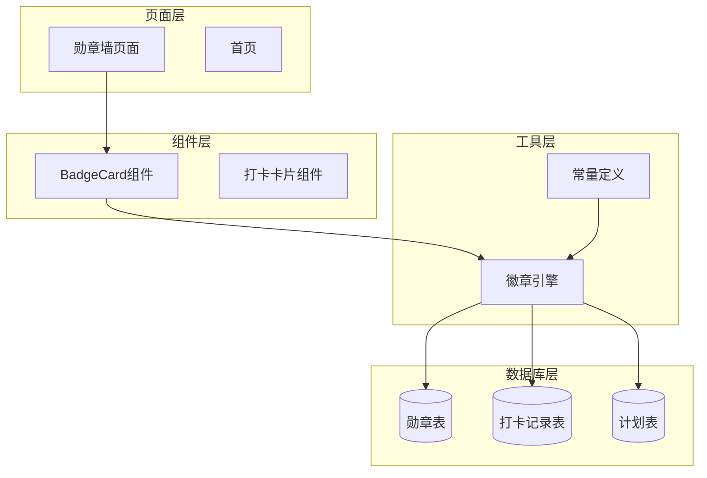
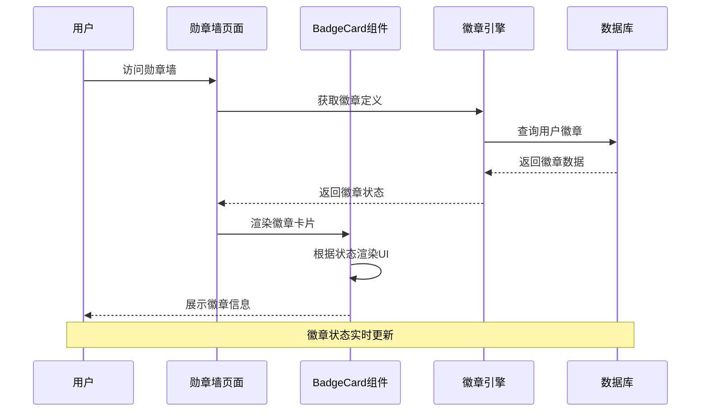
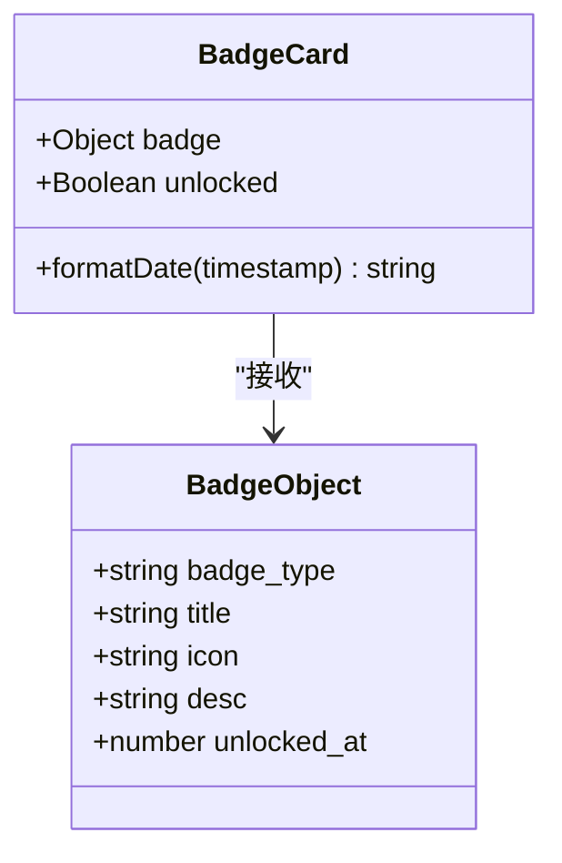
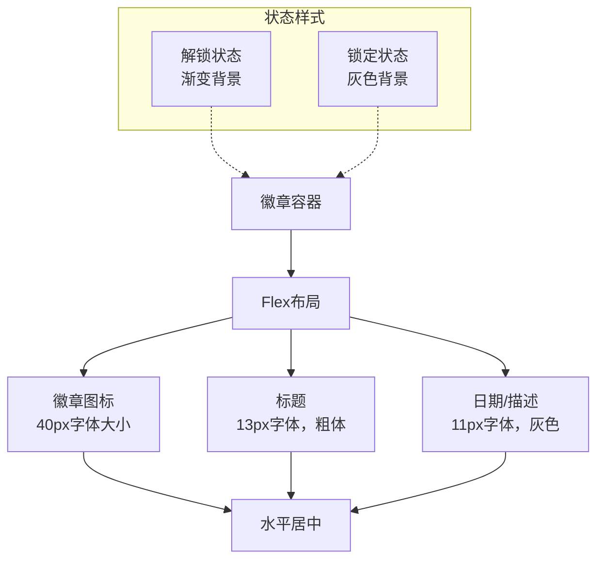
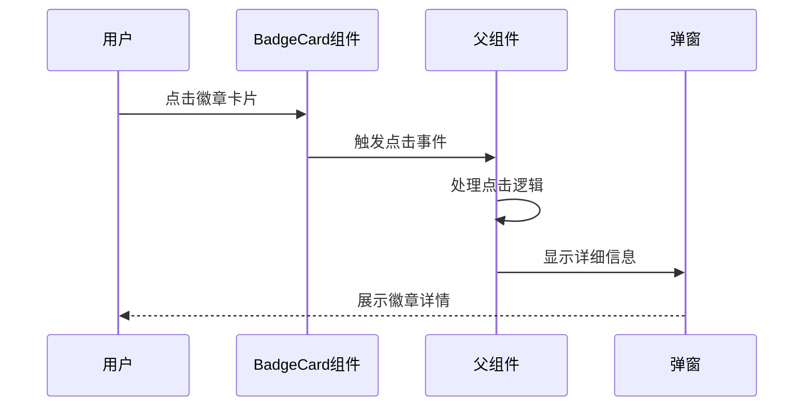
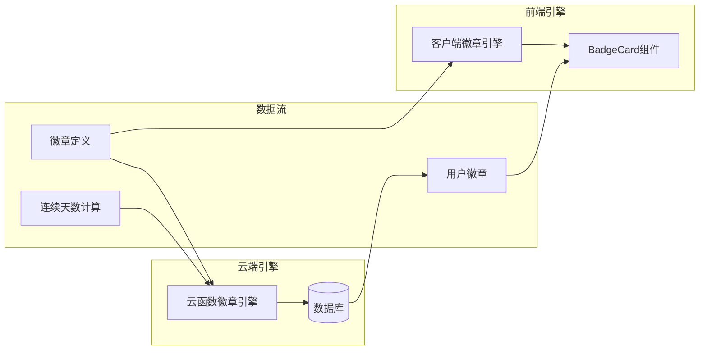
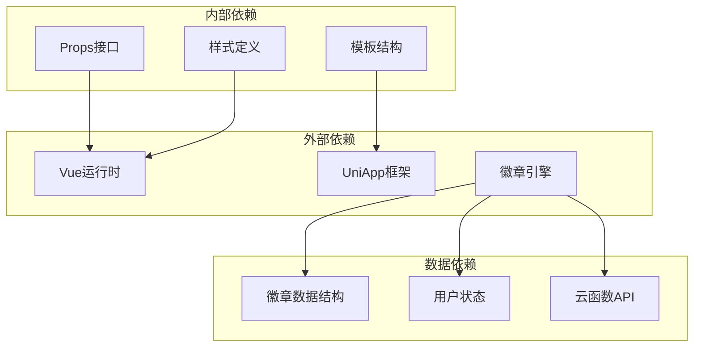
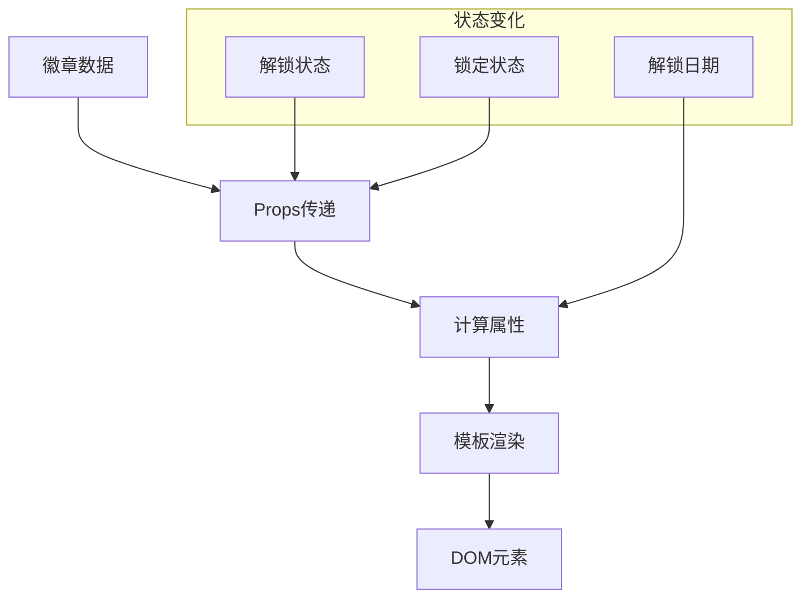

# BadgeCard 勋章卡片组件

<cite>
**本文档引用的文件**
- [BadgeCard.vue](file://src/components/BadgeCard.vue)
- [wall.vue](file://src/pages/badge/wall.vue)
- [badge-engine.js](file://uniCloud-aliyun/common/badge-engine.js)
- [const.js](file://uniCloud-aliyun/common/const.js)
- [badges.schema.json](file://uniCloud-aliyun/database/badges.schema.json)
- [badge-engine.js](file://src/utils/badge-engine.js)
</cite>

## 目录
1. [简介](#简介)
2. [项目结构](#项目结构)
3. [核心组件](#核心组件)
4. [架构概览](#架构概览)
5. [详细组件分析](#详细组件分析)
6. [依赖关系分析](#依赖关系分析)
7. [性能考虑](#性能考虑)
8. [故障排除指南](#故障排除指南)
9. [结论](#结论)
10. [附录](#附录)

## 简介

BadgeCard 是 Star-Grow 成就系统中的核心展示组件，负责以直观的视觉方式呈现用户的勋章收藏。该组件在成就激励体系中发挥着重要作用，通过丰富的视觉反馈和状态指示帮助用户追踪个人成长历程。

组件采用简洁而富有表现力的设计语言，通过颜色编码、图标系统和状态切换来传达不同类型的成就信息。从基础的里程碑成就到复杂的连续挑战，BadgeCard 能够准确反映用户的各项成就状态。

## 项目结构

BadgeCard 组件位于项目的组件层，与页面层和云函数层形成清晰的分层架构：



**图表来源**
- [BadgeCard.vue:1-37](file://src/components/BadgeCard.vue#L1-L37)
- [wall.vue:1-82](file://src/pages/badge/wall.vue#L1-L82)
- [badge-engine.js:1-125](file://uniCloud-aliyun/common/badge-engine.js#L1-L125)

**章节来源**
- [BadgeCard.vue:1-37](file://src/components/BadgeCard.vue#L1-L37)
- [wall.vue:1-82](file://src/pages/badge/wall.vue#L1-L82)

## 核心组件

### BadgeCard 组件概述

BadgeCard 是一个轻量级的 Vue 3 组件，专门用于展示单个勋章的状态和基本信息。组件通过 props 接收勋章数据和解锁状态，并根据状态动态调整视觉表现。

#### 主要功能特性

1. **状态驱动的视觉呈现**：根据 `unlocked` 属性在锁定和解锁状态间切换
2. **响应式布局**：自适应不同屏幕尺寸的显示需求
3. **图标系统**：支持 Unicode 字符和自定义图标的灵活使用
4. **日期格式化**：智能处理解锁时间的本地化显示

**章节来源**
- [BadgeCard.vue:11-22](file://src/components/BadgeCard.vue#L11-L22)

## 架构概览

BadgeCard 组件在整个成就系统中扮演着承上启下的关键角色，连接着前端展示层和后端数据层：



**图表来源**
- [wall.vue:35-65](file://src/pages/badge/wall.vue#L35-L65)
- [badge-engine.js:52-122](file://uniCloud-aliyun/common/badge-engine.js#L52-L122)

## 详细组件分析

### 组件属性定义

BadgeCard 组件通过明确的 props 接口接收外部数据：

| 属性名 | 类型 | 必需 | 默认值 | 描述 |
|--------|------|------|--------|------|
| badge | Object | 是 | - | 勋章数据对象，包含标题、图标、描述等信息 |
| unlocked | Boolean | 否 | false | 勋章解锁状态标志 |

#### Badge 对象数据结构

徽章对象遵循统一的数据规范，确保组件的一致性表现：



**图表来源**
- [BadgeCard.vue:12-15](file://src/components/BadgeCard.vue#L12-L15)
- [badges.schema.json:10-39](file://uniCloud-aliyun/database/badges.schema.json#L10-L39)

#### 状态显示模式

组件通过 CSS 类名切换实现两种主要状态：

1. **解锁状态 (unlocked)**：使用渐变背景色和彩色图标
2. **锁定状态 (locked)**：使用灰色滤镜和淡化效果

**章节来源**
- [BadgeCard.vue:3-8](file://src/components/BadgeCard.vue#L3-L8)
- [BadgeCard.vue:24-36](file://src/components/BadgeCard.vue#L24-L36)

### 视觉设计系统

#### 颜色编码机制

组件采用层次化的颜色系统来传达不同含义：

| 状态 | 颜色方案 | 用途 | 示例 |
|------|----------|------|------|
| 解锁 | 渐变橙色背景 (#FFF5E6 到 #FFE8D6) | 表示已获得的成就 | ✅ 已解锁的徽章 |
| 锁定 | 浅灰色背景 (#f5f5f5) | 表示未解锁的成就 | 🔒 未解锁的徽章 |
| 文字 | 深灰 (#333) 到浅灰 (#999) | 信息层级区分 | 标题、描述、日期 |

#### 图标系统

徽章图标采用 Unicode 字符，每个成就类型对应特定的表情符号：

| 成就类型 | 图标 | 含义 |
|----------|------|------|
| first_checkin | 🌱 | 首次打卡 |
| streak_3 | 🔥 | 连续3天打卡 |
| streak_7 | ⚡ | 连续7天打卡 |
| streak_14 | 💎 | 连续14天打卡 |
| streak_30 | 👑 | 连续30天打卡 |
| first_self | 🦸 | 首次自主打卡 |
| all_category | 🌈 | 全能之星 |
| mood_recorder | 📝 | 心情记录员 |

**章节来源**
- [BadgeCard.vue:4](file://src/components/BadgeCard.vue#L4)
- [const.js:6-17](file://uniCloud-aliyun/common/const.js#L6-L17)

### 响应式布局设计

组件采用 Flexbox 布局系统，确保在不同设备上的良好表现：



**图表来源**
- [BadgeCard.vue:25-36](file://src/components/BadgeCard.vue#L25-L36)

#### 屏幕适配策略

- **移动端优先**：采用触摸友好的点击区域
- **弹性布局**：支持不同屏幕尺寸的自适应
- **字体缩放**：根据设备像素密度调整文字大小
- **间距优化**：合理的边距和内边距确保内容可读性

**章节来源**
- [BadgeCard.vue:25-36](file://src/components/BadgeCard.vue#L25-L36)

### 交互设计

#### 点击查看详情功能

虽然 BadgeCard 组件本身不直接处理点击事件，但可以通过父组件扩展实现更丰富的交互：



#### 长按操作支持

组件预留了扩展接口，可以轻松添加长按功能：

| 交互类型 | 实现方式 | 用户体验 |
|----------|----------|----------|
| 点击查看详情 | 事件冒泡 + 父组件处理 | 即时反馈，信息丰富 |
| 长按编辑 | 长按事件监听 + 弹窗菜单 | 批量操作，效率提升 |
| 分享徽章 | 长按 + 分享面板 | 社交传播，增强粘性 |

### 与 badge-engine 引擎的协作机制

BadgeCard 组件与徽章引擎通过以下方式紧密协作：



**图表来源**
- [badge-engine.js:1-125](file://uniCloud-aliyun/common/badge-engine.js#L1-L125)
- [badge-engine.js:1-120](file://src/utils/badge-engine.js#L1-L120)

#### 引擎功能对比

| 功能模块 | 客户端引擎 | 云函数引擎 | 协作方式 |
|----------|------------|------------|----------|
| 连续天数计算 | ✅ 基础版本 | ✅ 完整版本 | 数据共享 |
| 徽章检查 | ✅ 简化版 | ✅ 全量版 | 状态同步 |
| 数据验证 | ✅ 基础校验 | ✅ 严格校验 | 双重保障 |
| 性能优化 | ✅ 轻量级 | ✅ 高效查询 | 分层处理 |

**章节来源**
- [badge-engine.js:52-122](file://uniCloud-aliyun/common/badge-engine.js#L52-L122)
- [badge-engine.js:36-119](file://src/utils/badge-engine.js#L36-L119)

### 使用示例

#### 在勋章墙场景中集成

```vue
<!-- 勋章墙页面集成示例 -->
<template>
  <view class="badge-grid">
    <BadgeCard
      v-for="badge in allBadges"
      :key="badge.badge_type"
      :badge="badge"
      :unlocked="isUnlocked(badge.badge_type)"
    />
  </view>
</template>
```

#### 在个人档案场景中应用

```vue
<!-- 个人档案页面集成示例 -->
<template>
  <view class="profile-badges">
    <BadgeCard
      v-for="badge in userBadges"
      :key="badge.badge_type"
      :badge="badge"
      :unlocked="true"
    />
  </view>
</template>
```

#### 动态状态管理

组件支持动态状态更新，适用于实时成就追踪场景：

```javascript
// 状态更新示例
function updateBadgeStatus(newBadges) {
  newBadges.forEach(badge => {
    const card = document.getElementById(`badge-${badge.badge_type}`)
    if (card) {
      card.classList.add('unlocked')
      card.classList.remove('locked')
    }
  })
}
```

**章节来源**
- [wall.vue:17-24](file://src/pages/badge/wall.vue#L17-L24)

### 样式定制和主题适配

#### 主题变量系统

组件支持通过 CSS 变量实现主题定制：

| CSS 变量 | 默认值 | 用途 |
|----------|--------|------|
| --badge-unlocked-bg | linear-gradient(135deg, #FFF5E6, #FFE8D6) | 解锁状态背景 |
| --badge-locked-bg | #f5f5f5 | 锁定状态背景 |
| --badge-icon-size | 40px | 图标字体大小 |
| --badge-title-color | #333 | 标题文字颜色 |
| --badge-desc-color | #999 | 描述文字颜色 |

#### 自定义样式示例

```css
/* 深色主题适配 */
.dark-theme .badge-card.unlocked {
  background: linear-gradient(135deg, #2D1B10, #4A2C1A);
}

/* 圆角定制 */
.custom-badge {
  border-radius: 20px;
  padding: 20px 12px;
}
```

**章节来源**
- [BadgeCard.vue:24-36](file://src/components/BadgeCard.vue#L24-L36)

## 依赖关系分析

### 组件耦合度评估

BadgeCard 组件具有良好的内聚性和低耦合性：



**图表来源**
- [BadgeCard.vue:11-22](file://src/components/BadgeCard.vue#L11-L22)
- [wall.vue:35-65](file://src/pages/badge/wall.vue#L35-L65)

### 数据流分析

组件遵循单向数据流原则，确保状态管理的清晰性：



**图表来源**
- [BadgeCard.vue:12-21](file://src/components/BadgeCard.vue#L12-L21)

**章节来源**
- [BadgeCard.vue:11-22](file://src/components/BadgeCard.vue#L11-L22)

## 性能考虑

### 渲染优化策略

1. **条件渲染**：仅在解锁状态下显示日期信息
2. **懒加载**：徽章图标作为静态文本渲染
3. **CSS 优化**：使用硬件加速的 transform 和 opacity 属性

### 内存管理

组件采用无状态设计，避免不必要的内存占用：
- 不存储本地状态
- 依赖外部传入的数据
- 事件处理函数保持轻量级

### 网络请求优化

在勋章墙场景中，建议实现以下优化：
- 批量加载徽章数据
- 缓存徽章定义
- 懒加载未显示的徽章

## 故障排除指南

### 常见问题诊断

#### 图标显示异常

**症状**：徽章图标显示为问号或特殊字符
**可能原因**：
- 字体文件未正确加载
- Unicode 字符不被设备支持
- 数据字段为空

**解决方案**：
```javascript
// 添加图标回退机制
function getBadgeIcon(icon) {
  return icon || '🔒' || '❓'
}
```

#### 状态显示错误

**症状**：徽章状态与实际不符
**可能原因**：
- 解锁状态判断逻辑错误
- 数据同步延迟
- 缓存数据过期

**解决方案**：
```javascript
// 实现状态验证
function validateBadgeStatus(badge, userBadges) {
  const isUnlocked = userBadges.some(b => b.badge_type === badge.badge_type)
  return isUnlocked
}
```

#### 性能问题

**症状**：大量徽章渲染导致页面卡顿
**可能原因**：
- 单次渲染过多徽章
- 样式计算复杂
- 事件绑定过多

**优化建议**：
- 实现虚拟滚动
- 减少样式计算
- 合并事件处理

**章节来源**
- [BadgeCard.vue:17-21](file://src/components/BadgeCard.vue#L17-L21)
- [wall.vue:58-65](file://src/pages/badge/wall.vue#L58-L65)

## 结论

BadgeCard 组件作为 Star-Grow 成就系统的核心展示层，展现了优秀的架构设计和用户体验理念。组件通过简洁的接口设计、丰富的视觉表达和灵活的扩展能力，为用户提供了直观而富有成就感的成就展示体验。

该组件的成功体现在以下几个方面：
- **设计一致性**：统一的视觉语言和交互模式
- **性能优化**：轻量级实现和高效的渲染策略  
- **可扩展性**：清晰的接口设计便于功能扩展
- **用户体验**：直观的状态反馈和及时的信息展示

未来可以在以下方面进一步完善：
- 增强交互功能（点击详情、长按操作）
- 优化动画效果和过渡体验
- 扩展主题定制能力
- 加强无障碍访问支持

## 附录

### 组件 API 参考

#### Props 接口

| 参数 | 类型 | 必填 | 默认值 | 说明 |
|------|------|------|--------|------|
| badge | Object | 是 | - | 徽章数据对象 |
| unlocked | Boolean | 否 | false | 徽章解锁状态 |

#### Badge 数据对象字段

| 字段名 | 类型 | 必填 | 说明 |
|--------|------|------|------|
| badge_type | String | 是 | 徽章类型标识 |
| title | String | 是 | 徽章标题 |
| icon | String | 否 | 徽章图标 |
| desc | String | 否 | 徽章描述 |
| unlocked_at | Number | 否 | 解锁时间戳 |

### 开发最佳实践

1. **数据验证**：始终验证 badge 对象的完整性
2. **状态管理**：合理管理徽章状态的生命周期
3. **性能监控**：关注大量徽章渲染的性能影响
4. **用户体验**：提供清晰的状态反馈和加载指示