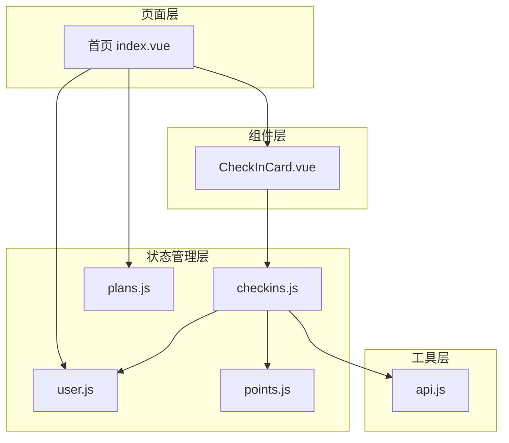
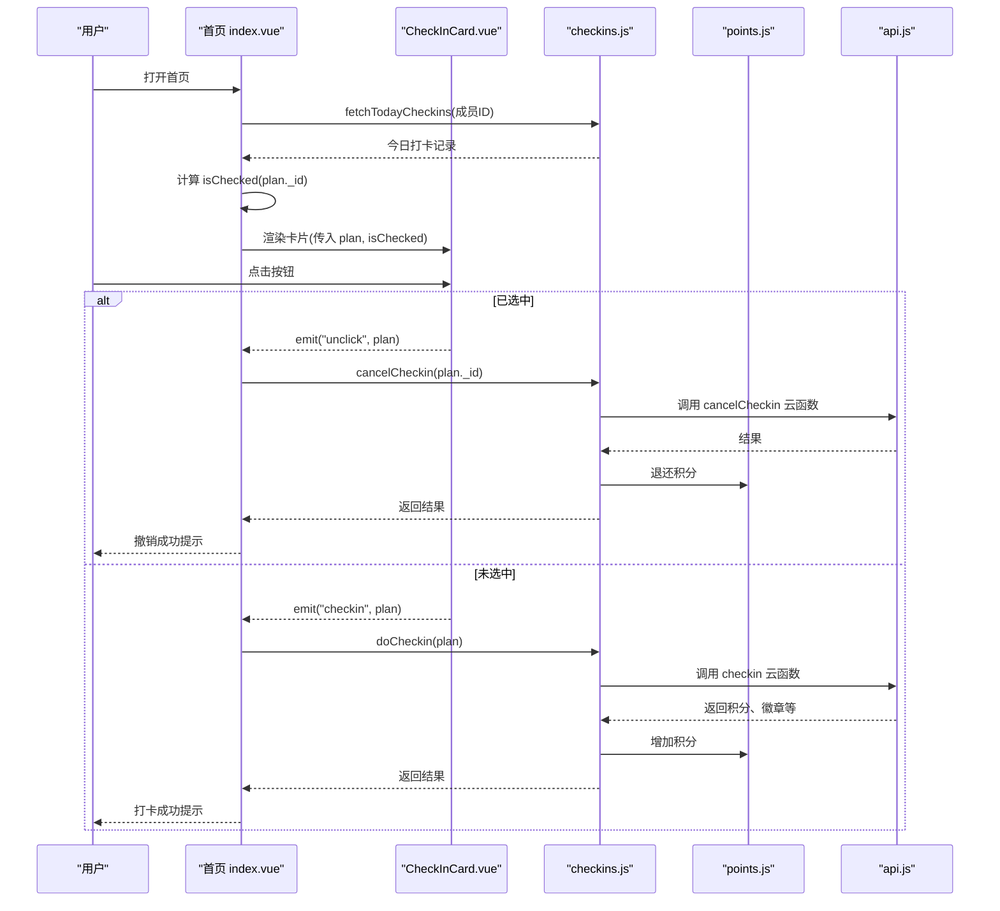
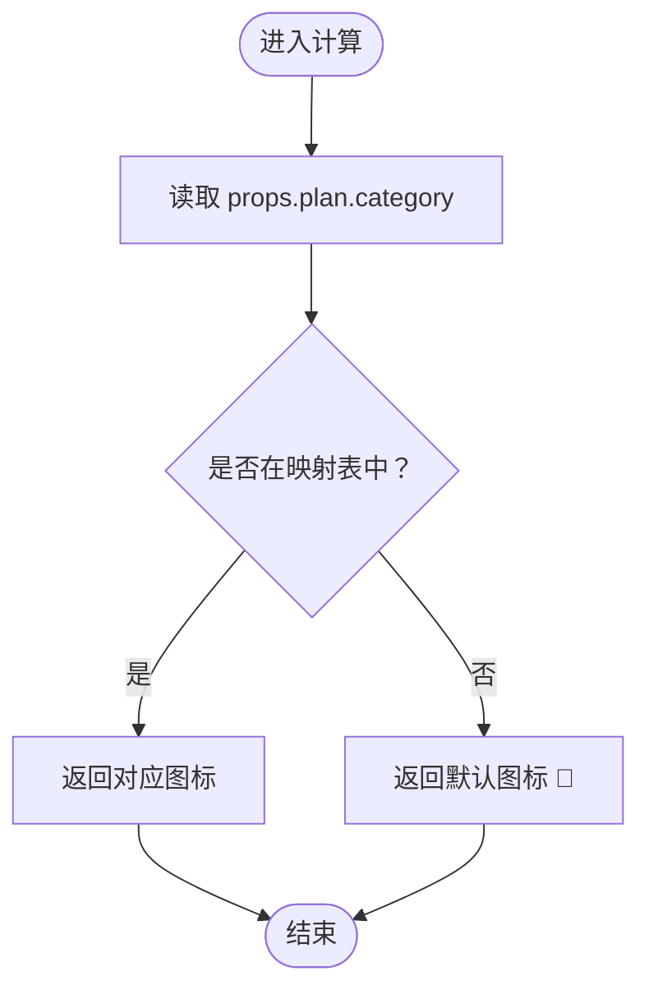
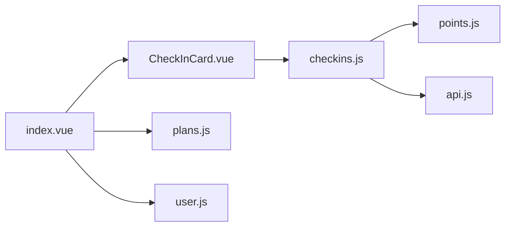

# CheckInCard 打卡卡片组件

<cite>
**本文引用的文件**
- [CheckInCard.vue](file://src/components/CheckInCard.vue)
- [index.vue](file://src/pages/index/index.vue)
- [checkins.js](file://src/stores/checkins.js)
- [plans.js](file://src/stores/plans.js)
- [user.js](file://src/stores/user.js)
- [points.js](file://src/stores/points.js)
- [api.js](file://src/utils/api.js)
</cite>

## 目录
1. [简介](#简介)
2. [项目结构](#项目结构)
3. [核心组件](#核心组件)
4. [架构总览](#架构总览)
5. [详细组件分析](#详细组件分析)
6. [依赖关系分析](#依赖关系分析)
7. [性能考虑](#性能考虑)
8. [故障排查指南](#故障排查指南)
9. [结论](#结论)
10. [附录](#附录)

## 简介
CheckInCard 是习惯养成系统中的核心交互组件，用于展示用户的每日/每周计划，并提供一键打卡与撤销打卡功能。组件通过简洁直观的视觉反馈（选中态、渐变按钮、点击缩放）增强用户操作体验，同时与 Pinia Store 和云函数协同，实现数据持久化、离线同步与积分奖励闭环。

## 项目结构
本组件位于 src/components 目录，被首页 src/pages/index/index.vue 引入并循环渲染多个计划卡片；其行为由 src/stores/checkins.js 统一管理，数据来源为计划存储 src/stores/plans.js 与用户上下文 src/stores/user.js。

图表来源
- [index.vue:48-55](file://src/pages/index/index.vue#L48-L55)
- [CheckInCard.vue:23-27](file://src/components/CheckInCard.vue#L23-L27)
- [checkins.js:9-161](file://src/stores/checkins.js#L9-L161)
- [plans.js:9-72](file://src/stores/plans.js#L9-L72)
- [user.js:7-117](file://src/stores/user.js#L7-L117)
- [points.js:9-42](file://src/stores/points.js#L9-L42)
- [api.js:9-17](file://src/utils/api.js#L9-L17)

章节来源
- [index.vue:48-55](file://src/pages/index/index.vue#L48-L55)
- [CheckInCard.vue:1-67](file://src/components/CheckInCard.vue#L1-L67)

## 核心组件
- 组件职责
  - 展示计划信息：标题、频率、积分奖励
  - 基于 isChecked 状态切换视觉样式
  - 提供点击交互：未打卡时触发 checkin，已打卡时触发 unclick
  - 基于计划类别动态选择图标

- 关键特性
  - 响应式 props：plan、isToday、isChecked
  - 自定义事件：checkin、unclick
  - 计算属性：categoryIcon
  - 视觉反馈：选中态背景色、渐变按钮、点击缩放

章节来源
- [CheckInCard.vue:23-42](file://src/components/CheckInCard.vue#L23-L42)

## 架构总览
CheckInCard 的数据流自上而下：页面根据计划列表与打卡状态计算 isChecked，传入组件；组件通过事件向上抛出 checkin/unclick；页面调用 Store 执行 doCheckin/cancelCheckin，完成后刷新界面状态。

图表来源
- [index.vue:127-154](file://src/pages/index/index.vue#L127-L154)
- [CheckInCard.vue:36-42](file://src/components/CheckInCard.vue#L36-L42)
- [checkins.js:26-89](file://src/stores/checkins.js#L26-L89)
- [points.js:26-33](file://src/stores/points.js#L26-L33)
- [api.js:9-17](file://src/utils/api.js#L9-L17)

## 详细组件分析

### Props 属性定义与用途
- plan: 对象，必填
  - 字段要点：title、category、frequency.type、points_per_check、_id
  - 作用：承载计划基本信息，驱动标题、频率文案、积分文案与图标映射
- isToday: 布尔，默认 true
  - 作用：标记是否为“今天”的卡片（当前实现未直接使用，保留语义）
- isChecked: 布尔，默认 false
  - 作用：控制卡片选中态与按钮文案/样式

章节来源
- [CheckInCard.vue:23-27](file://src/components/CheckInCard.vue#L23-L27)
- [plans.js:62-69](file://src/stores/plans.js#L62-L69)

### 事件系统
- checkin(plan)
  - 触发时机：未选中状态下点击按钮
  - 回调参数：当前 plan 对象
- unclick(plan)
  - 触发时机：已选中状态下点击按钮
  - 回调参数：当前 plan 对象
- 页面处理流程
  - handleCheckin：调用 doCheckin，toast 提示，刷新连击天数
  - handleUnclick：弹窗确认后调用 cancelCheckin，toast 提示并退款积分

章节来源
- [CheckInCard.vue:29-42](file://src/components/CheckInCard.vue#L29-L42)
- [index.vue:127-154](file://src/pages/index/index.vue#L127-L154)
- [checkins.js:26-89](file://src/stores/checkins.js#L26-L89)

### 计算属性 categoryIcon 实现逻辑
- 映射规则
  - reading → 📚
  - study → 📝
  - exercise → 🏃
  - life → 🏠
  - custom → 🎯
  - 其他 → 默认 🎯
- 实现要点
  - 读取 props.plan.category
  - 通过映射表返回对应 emoji
  - 作为左侧分类图标显示

图表来源
- [CheckInCard.vue:31-34](file://src/components/CheckInCard.vue#L31-L34)

章节来源
- [CheckInCard.vue:31-34](file://src/components/CheckInCard.vue#L31-L34)

### 样式设计与交互反馈
- 卡片容器
  - 选中态背景色变化，提供视觉确认
- 分类图标
  - 字体大小适中，突出计划类型
- 按钮
  - 渐变背景与阴影营造立体感
  - 点击时缩放反馈，提升触控体验
  - 已选中态切换为绿色，强调完成状态
- 文案
  - 标题粗体、副标题细小灰色，层次清晰

章节来源
- [CheckInCard.vue:45-66](file://src/components/CheckInCard.vue#L45-L66)

### 使用示例与场景
- 基础用法
  - 在页面中遍历计划列表，传入 plan 与 isChecked
  - 监听 checkin/unclick 事件，执行相应业务逻辑
- 场景建议
  - 今日任务页：按 isChecked 控制按钮样式与文案
  - 进度统计：结合 isChecked 计算完成率
  - 连续打卡：在事件回调后刷新连击天数

章节来源
- [index.vue:48-55](file://src/pages/index/index.vue#L48-L55)
- [index.vue:127-154](file://src/pages/index/index.vue#L127-L154)

### 与 Store 的集成与数据流向
- 数据来源
  - 计划列表：usePlanStore.plans
  - 打卡状态：useCheckinStore.todayCheckins/checkedPlanIds
  - 用户上下文：useUserStore.memberId
  - 积分：usePointsStore.current/total
- 写入路径
  - 打卡：checkins.js.doCheckin → 云函数 → 本地缓存 → 积分增加
  - 撤销：checkins.js.cancelCheckin → 云函数 → 本地缓存 → 积分退还
- 事件链路
  - 页面 → 组件事件 → Store 方法 → 云函数 → Store 状态更新 → 页面刷新

章节来源
- [index.vue:66-79](file://src/pages/index/index.vue#L66-L79)
- [checkins.js:14-24](file://src/stores/checkins.js#L14-L24)
- [checkins.js:26-89](file://src/stores/checkins.js#L26-L89)
- [checkins.js:126-159](file://src/stores/checkins.js#L126-L159)
- [points.js:26-33](file://src/stores/points.js#L26-L33)
- [api.js:9-17](file://src/utils/api.js#L9-L17)

## 依赖关系分析
- 组件依赖
  - Vue 计算属性与事件机制
  - Scoped 样式隔离
- 页面依赖
  - Pinia Store 注入与响应式计算
  - 事件监听与异步调用
- Store 依赖
  - 云函数封装工具
  - 用户与积分 Store 的联动
- 云函数
  - getCheckins、checkin、cancelCheckin

图表来源
- [CheckInCard.vue:20-21](file://src/components/CheckInCard.vue#L20-L21)
- [index.vue:66-79](file://src/pages/index/index.vue#L66-L79)
- [checkins.js:9-161](file://src/stores/checkins.js#L9-L161)
- [plans.js:9-72](file://src/stores/plans.js#L9-L72)
- [user.js:7-117](file://src/stores/user.js#L7-L117)
- [points.js:9-42](file://src/stores/points.js#L9-L42)
- [api.js:9-17](file://src/utils/api.js#L9-L17)

章节来源
- [CheckInCard.vue:20-21](file://src/components/CheckInCard.vue#L20-L21)
- [index.vue:66-79](file://src/pages/index/index.vue#L66-L79)
- [checkins.js:9-161](file://src/stores/checkins.js#L9-L161)

## 性能考虑
- 渲染优化
  - 使用 v-for 渲染计划列表时，确保 key 唯一（推荐使用 plan._id 或稳定标识）
  - 将 isChecked 的计算放在页面层，避免在组件内部重复计算
- 事件节流
  - 在高频点击场景下，可在页面层对事件进行防抖/互斥处理
- 状态缓存
  - 本地缓存今日打卡记录，减少网络请求
- 样式复用
  - 将通用样式抽离至公共样式文件，避免重复定义

## 故障排查指南
- 无法触发事件
  - 检查父组件是否正确监听并处理 checkin/unclick
  - 确认 isChecked 传值是否与 Store 状态一致
- 图标不显示或异常
  - 检查 plan.category 是否为受支持的枚举值
  - 确保字体渲染正常
- 打卡失败
  - 查看云函数返回与错误提示
  - 检查网络状态与离线队列
- 积分未更新
  - 确认 doCheckin/cancelCheckin 是否正确调用积分 Store
  - 检查本地缓存与同步队列

章节来源
- [index.vue:127-154](file://src/pages/index/index.vue#L127-L154)
- [checkins.js:77-88](file://src/stores/checkins.js#L77-L88)
- [checkins.js:126-159](file://src/stores/checkins.js#L126-L159)
- [points.js:26-33](file://src/stores/points.js#L26-L33)

## 结论
CheckInCard 以简洁的结构实现了“计划展示 + 打卡交互”的核心功能，配合 Pinia Store 与云函数，构建了从 UI 到数据的完整闭环。通过合理的 props 设计、事件分发与样式反馈，组件在保持易用性的同时，也为扩展（如撤销确认、离线同步、徽章提示）提供了良好基础。

## 附录
- 计划对象关键字段参考
  - title：计划名称
  - category：分类（reading/study/exercise/life/custom）
  - frequency.type：周期类型（daily/weekly）
  - points_per_check：单次打卡积分
  - _id：计划唯一标识
- 云函数接口
  - getCheckins：获取指定日期/周的打卡记录
  - checkin：执行打卡并返回奖励
  - cancelCheckin：撤销当日打卡并退还积分

章节来源
- [plans.js:62-69](file://src/stores/plans.js#L62-L69)
- [checkins.js:14-24](file://src/stores/checkins.js#L14-L24)
- [checkins.js:26-89](file://src/stores/checkins.js#L26-L89)
- [checkins.js:126-159](file://src/stores/checkins.js#L126-L159)
- [api.js:9-17](file://src/utils/api.js#L9-L17)