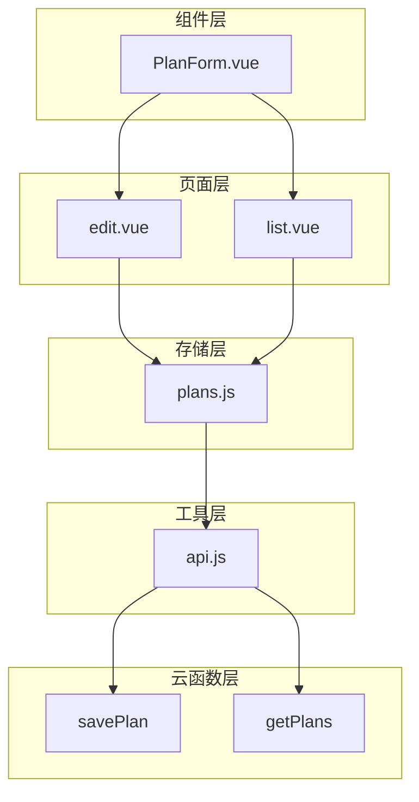
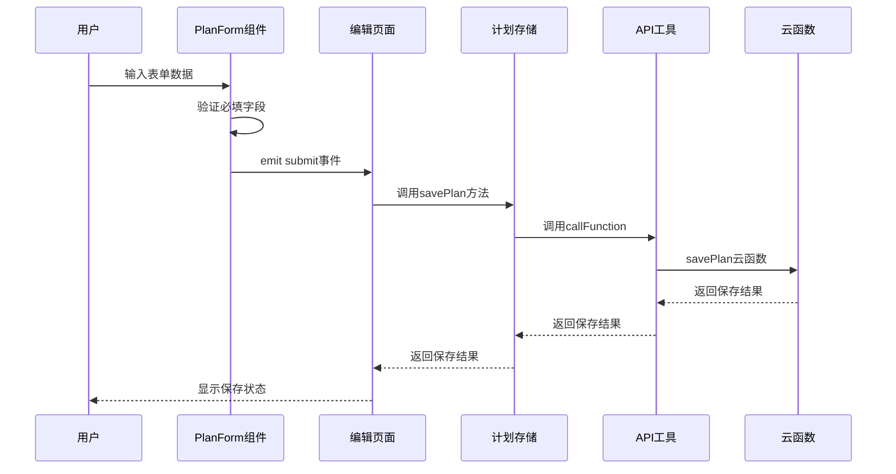
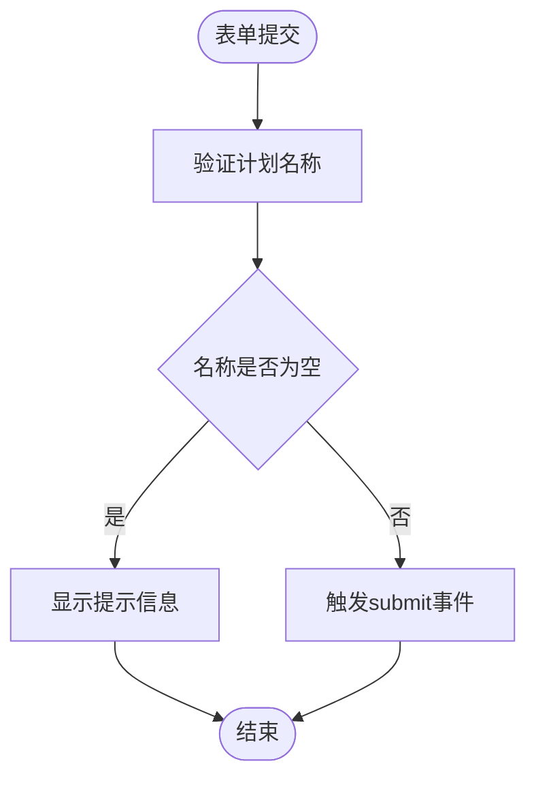
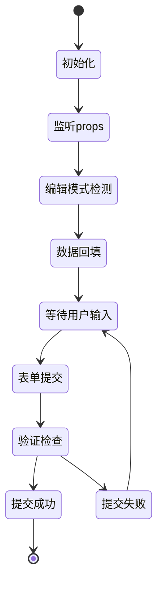
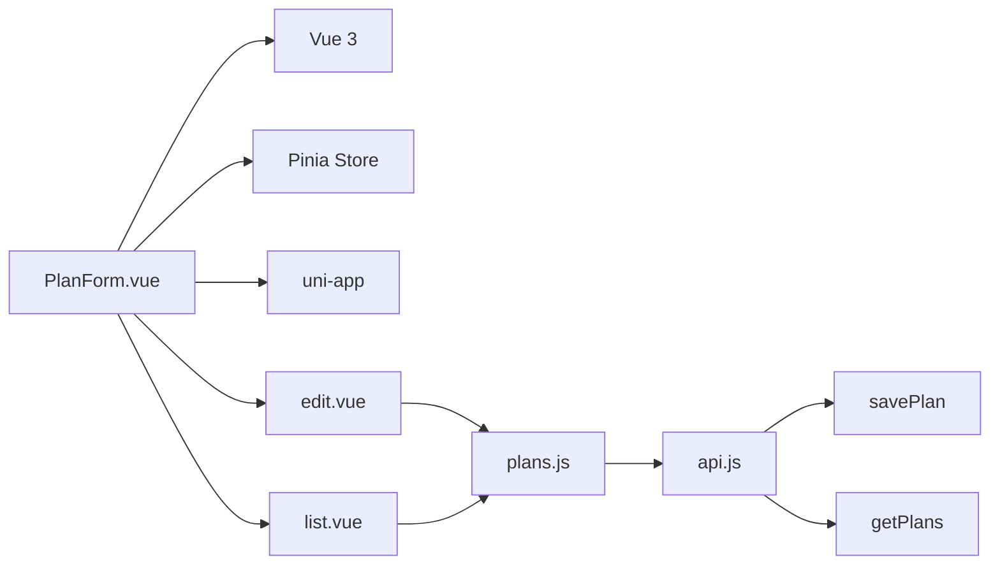

# PlanForm 计划表单组件

<cite>
**本文档引用的文件**
- [PlanForm.vue](file://src/components/PlanForm.vue)
- [plans.js](file://src/stores/plans.js)
- [edit.vue](file://src/pages/plan/edit.vue)
- [list.vue](file://src/pages/plan/list.vue)
- [api.js](file://src/utils/api.js)
- [savePlan/index.js](file://uniCloud-aliyun/cloudfunctions/savePlan/index.js)
- [getPlans/index.js](file://uniCloud-aliyun/cloudfunctions/getPlans/index.js)
</cite>

## 目录
1. [简介](#简介)
2. [项目结构](#项目结构)
3. [核心组件](#核心组件)
4. [架构概览](#架构概览)
5. [详细组件分析](#详细组件分析)
6. [依赖关系分析](#依赖关系分析)
7. [性能考虑](#性能考虑)
8. [故障排除指南](#故障排除指南)
9. [结论](#结论)

## 简介

PlanForm 是星成长计划管理系统的计划表单组件，负责创建和编辑用户计划。该组件提供了直观的表单界面，支持计划名称输入、分类选择、频率设置、积分配置和提醒时间设置等功能。作为计划管理系统的核心交互组件，PlanForm 在用户创建新计划、编辑现有计划以及管理个人习惯养成方面发挥着关键作用。

## 项目结构

PlanForm 组件位于 `src/components/` 目录下，与页面组件和存储层协同工作：

**图表来源**
- [PlanForm.vue:1-119](file://src/components/PlanForm.vue#L1-L119)
- [plans.js:1-73](file://src/stores/plans.js#L1-L73)
- [edit.vue:1-35](file://src/pages/plan/edit.vue#L1-L35)
- [list.vue:1-133](file://src/pages/plan/list.vue#L1-L133)

**章节来源**
- [PlanForm.vue:1-119](file://src/components/PlanForm.vue#L1-L119)
- [plans.js:1-73](file://src/stores/plans.js#L1-L73)

## 核心组件

PlanForm 组件是一个响应式的 Vue 3 组件，采用 Composition API 和 `<script setup>` 语法。组件的核心特性包括：

### 主要功能特性
- **表单数据绑定**：使用 `v-model` 实现双向数据绑定
- **实时验证**：基础的必填字段验证
- **事件驱动**：通过 `emit` 事件向父组件传递数据
- **编辑模式支持**：支持从父组件接收现有计划数据进行编辑

### 数据结构
组件维护一个响应式表单对象，包含以下字段：
- `title`：计划名称
- `category`：计划分类
- `frequency`：频率设置对象（type, count）
- `points_per_check`：每次打卡获得的积分
- `reminder_time`：提醒时间
- `reminder_text`：提醒文本

**章节来源**
- [PlanForm.vue:55-88](file://src/components/PlanForm.vue#L55-L88)

## 架构概览

PlanForm 组件在整个系统架构中扮演着重要的桥梁角色，连接用户界面、业务逻辑和数据持久化层：

**图表来源**
- [PlanForm.vue:85-88](file://src/components/PlanForm.vue#L85-L88)
- [edit.vue:22-30](file://src/pages/plan/edit.vue#L22-L30)
- [plans.js:30-47](file://src/stores/plans.js#L30-L47)
- [api.js:9-17](file://src/utils/api.js#L9-L17)

## 详细组件分析

### 表单字段设计

PlanForm 组件提供了完整的计划表单字段设计：

#### 1. 计划名称字段
- **类型**：文本输入框
- **验证**：必填验证
- **占位符**：示例格式如"每天阅读"
- **用途**：标识计划的主要内容

#### 2. 分类选择字段
- **类型**：图标化分类网格
- **选项**：阅读、学习、运动、生活、自定义
- **交互**：点击切换选中状态
- **视觉反馈**：激活状态显示边框高亮

#### 3. 频率设置字段
- **类型**：单选按钮组 + 数字输入框
- **选项**：每天、每周
- **计数器**：可配置每日/每周打卡次数
- **默认值**：每天1次

#### 4. 积分配置字段
- **类型**：数字输入框
- **默认值**：10分
- **用途**：设置每次打卡获得的积分

#### 5. 提醒时间字段
- **类型**：时间选择器
- **模式**：time模式
- **占位符**：不提醒
- **用途**：设置每日打卡提醒时间

**章节来源**
- [PlanForm.vue:4-48](file://src/components/PlanForm.vue#L4-L48)

### 表单验证机制

组件实现了基础的前端验证机制：

**图表来源**
- [PlanForm.vue:85-88](file://src/components/PlanForm.vue#L85-L88)

验证策略特点：
- **即时反馈**：用户输入时提供视觉反馈
- **基础验证**：主要验证必填字段
- **无后端验证**：验证逻辑集中在前端

**章节来源**
- [PlanForm.vue:85-88](file://src/components/PlanForm.vue#L85-L88)

### 交互设计

组件采用了直观的交互设计模式：

#### 字段联动
- **分类选择**：点击分类项自动更新表单数据
- **频率切换**：每天/每周按钮的激活状态
- **实时更新**：所有字段都支持实时数据绑定

#### 动态行为
- **编辑模式**：通过 `watch` 监听父组件传入的计划数据
- **数据回填**：编辑模式下自动填充现有计划信息
- **响应式更新**：表单数据变化时自动更新显示

**章节来源**
- [PlanForm.vue:78-81](file://src/components/PlanForm.vue#L78-L81)

### 组件生命周期

**图表来源**
- [PlanForm.vue:78-88](file://src/components/PlanForm.vue#L78-L88)

## 依赖关系分析

PlanForm 组件与系统其他部分的依赖关系如下：

**图表来源**
- [PlanForm.vue:52-59](file://src/components/PlanForm.vue#L52-L59)
- [edit.vue:10-11](file://src/pages/plan/edit.vue#L10-L11)
- [list.vue:49](file://src/pages/plan/list.vue#L49)
- [plans.js:2-7](file://src/stores/plans.js#L2-L7)

### 外部依赖

- **Vue 3**：使用 Composition API 和响应式系统
- **uni-app**：跨平台框架，支持小程序、H5等
- **Pinia**：状态管理库
- **uniCloud**：云端数据库服务

**章节来源**
- [PlanForm.vue:52-59](file://src/components/PlanForm.vue#L52-L59)
- [plans.js:2-7](file://src/stores/plans.js#L2-L7)

## 性能考虑

### 渲染优化
- **响应式数据**：使用 `reactive` 创建响应式表单对象
- **条件渲染**：根据编辑模式动态显示不同内容
- **事件处理**：使用原生事件处理器避免不必要的重渲染

### 数据流优化
- **单向数据流**：表单数据通过 props 传入，通过 emit 传出
- **浅拷贝**：编辑模式下的数据回填使用 JSON 序列化避免引用问题
- **缓存策略**：存储层使用本地缓存减少网络请求

## 故障排除指南

### 常见问题及解决方案

#### 表单验证失败
**问题**：提交时提示"请输入计划名称"
**原因**：标题字段为空
**解决**：确保在提交前填写有效的计划名称

#### 编辑模式数据不更新
**问题**：编辑现有计划时表单未显示正确数据
**原因**：props 监听器未正确触发
**解决**：检查父组件是否正确传递 `plan` 属性

#### 云函数调用失败
**问题**：保存计划时出现网络错误
**原因**：网络连接问题或云函数异常
**解决**：检查网络连接，查看控制台错误日志

**章节来源**
- [PlanForm.vue:85-88](file://src/components/PlanForm.vue#L85-L88)
- [plans.js:30-47](file://src/stores/plans.js#L30-L47)

## 结论

PlanForm 计划表单组件是一个设计精良的用户界面组件，具有以下特点：

### 优势
- **简洁直观**：表单设计符合用户习惯，易于理解和使用
- **响应式设计**：支持多种设备和屏幕尺寸
- **良好的数据流**：清晰的父子组件通信机制
- **可扩展性**：模块化的代码结构便于功能扩展

### 改进建议
- **增强验证**：添加更全面的表单验证规则
- **错误处理**：改进错误处理和用户反馈机制
- **国际化**：支持多语言界面
- **无障碍访问**：增强键盘导航和屏幕阅读器支持

该组件为星成长计划管理系统提供了稳定可靠的表单处理能力，是用户管理个人计划的重要工具。