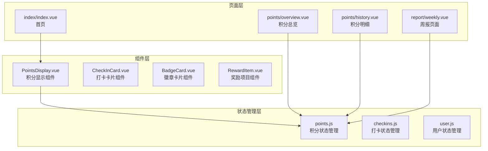
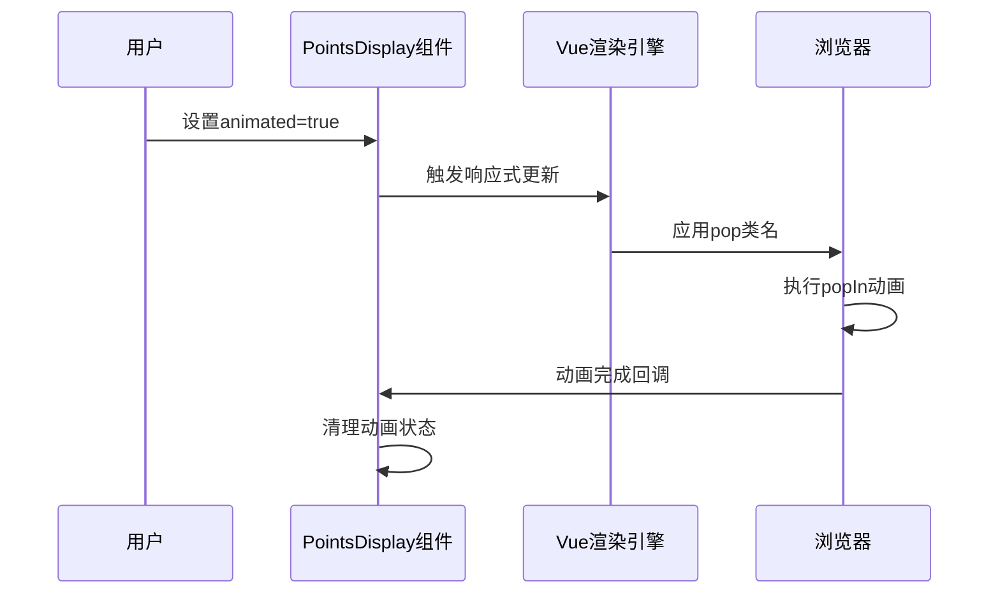
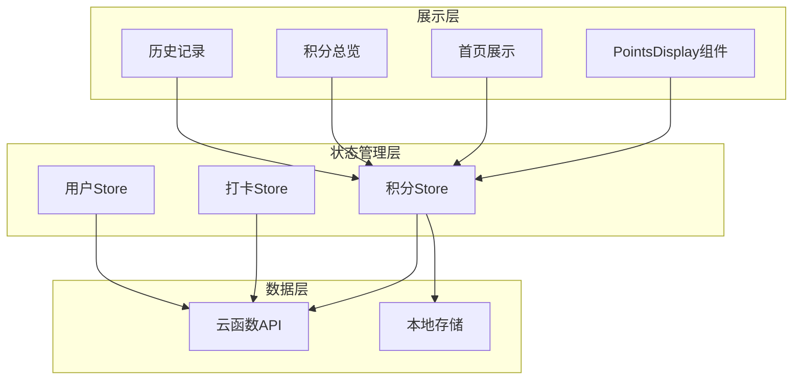
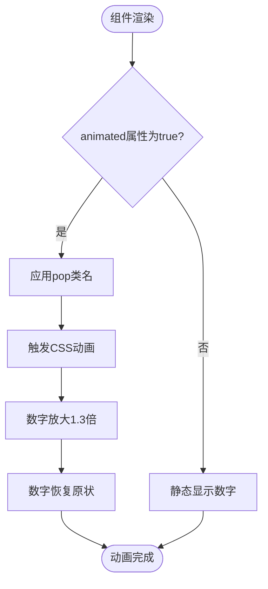
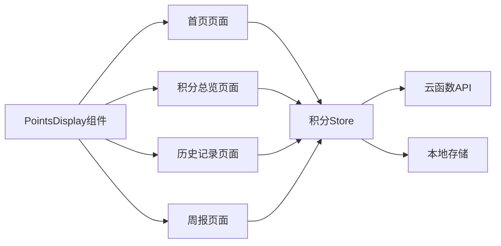
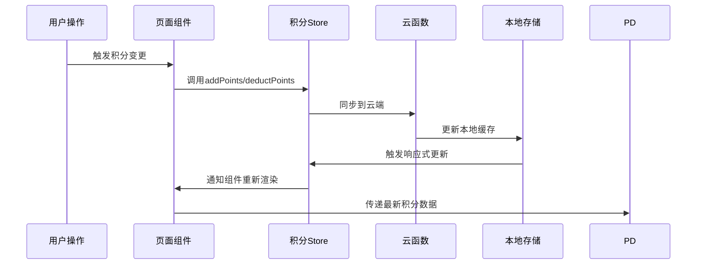

# PointsDisplay 积分显示组件

<cite>
**本文档引用的文件**
- [PointsDisplay.vue](file://src/components/PointsDisplay.vue)
- [points.js](file://src/stores/points.js)
- [index.vue](file://src/pages/index/index/index.vue)
- [overview.vue](file://src/pages/points/overview.vue)
- [history.vue](file://src/pages/points/history.vue)
- [weekly.vue](file://src/pages/report/weekly.vue)
</cite>

## 目录
1. [简介](#简介)
2. [项目结构](#项目结构)
3. [核心组件](#核心组件)
4. [架构概览](#架构概览)
5. [详细组件分析](#详细组件分析)
6. [依赖关系分析](#依赖关系分析)
7. [性能考虑](#性能考虑)
8. [故障排除指南](#故障排除指南)
9. [结论](#结论)

## 简介

PointsDisplay 是一个专门用于展示用户积分的Vue 3组件，采用Composition API和TypeScript语法编写。该组件提供了简洁直观的积分显示功能，包含大号数字显示、星星图标装饰以及可选的数字动画效果。组件设计遵循极简主义原则，专注于提供清晰的积分可视化体验。

该组件在积分系统中扮演着核心展示角色，为用户提供即时的积分余额反馈，并通过动画效果增强用户体验。组件支持响应式设计，在不同屏幕尺寸下都能保持良好的视觉效果。

## 项目结构

PointsDisplay组件位于项目的组件目录中，与其它业务组件共同构成完整的前端架构：

**图表来源**
- [PointsDisplay.vue:1-32](file://src/components/PointsDisplay.vue#L1-L32)
- [points.js:1-44](file://src/stores/points.js#L1-L44)

**章节来源**
- [PointsDisplay.vue:1-32](file://src/components/PointsDisplay.vue#L1-L32)
- [points.js:1-44](file://src/stores/points.js#L1-L44)

## 核心组件

### 组件属性定义

PointsDisplay组件通过props接收外部传入的数据，具有以下核心属性：

| 属性名 | 类型 | 默认值 | 必需 | 描述 |
|--------|------|--------|------|------|
| points | Number | 0 | 否 | 要显示的积分数值 |
| animated | Boolean | false | 否 | 是否启用数字动画效果 |

组件采用Vue 3的setup语法糖，使用defineProps函数定义属性接口，确保类型安全和良好的开发体验。

### 视觉设计规范

组件采用统一的设计语言，包含以下视觉元素：

- **积分符号**：使用⭐字符作为积分标识符，字号40px
- **数字显示**：使用48px加粗字体，#FF6B6B红色主题色
- **标签文字**：14px字号，#999灰色辅助色
- **布局结构**：flex布局，居中对齐，10px间距

### 动画系统

组件内置简单的数字弹跳动画，通过CSS keyframes实现：

**图表来源**
- [PointsDisplay.vue:25-30](file://src/components/PointsDisplay.vue#L25-L30)

**章节来源**
- [PointsDisplay.vue:13-17](file://src/components/PointsDisplay.vue#L13-L17)
- [PointsDisplay.vue:20-31](file://src/components/PointsDisplay.vue#L20-L31)

## 架构概览

PointsDisplay组件在整个积分系统中承担着数据展示层的角色，与状态管理层形成清晰的分层架构：

**图表来源**
- [points.js:9-43](file://src/stores/points.js#L9-L43)
- [index.vue:79-79](file://src/pages/index/index/index.vue#L79-L79)

## 详细组件分析

### 组件结构分析

PointsDisplay组件采用简洁的模板结构，包含三个主要部分：

1. **积分图标区域**：显示⭐符号，提供视觉识别
2. **积分内容区域**：包含积分数字和标签文本
3. **响应式动画**：通过条件类名控制动画执行

### 数据流处理

组件通过props接收外部数据，内部不维护状态，完全依赖外部传入的数值进行渲染。这种设计确保了组件的高内聚性和低耦合性。

### 响应式更新机制

当外部传入的points属性发生变化时，组件会自动重新渲染。如果同时设置了animated属性为true，则会触发动画效果。

### 使用场景分析

组件在多个页面中发挥重要作用：

#### 首页场景
在首页中，组件用于展示用户的当前积分余额，配合问候语和日期信息，营造积极的用户体验。

#### 积分总览场景  
在积分总览页面中，组件可以用于突出显示重要的积分统计信息，如累计获得积分等。

#### 历史记录场景
虽然历史记录页面主要展示详细列表，但组件可以用于关键节点的积分强调显示。

**章节来源**
- [PointsDisplay.vue:3-11](file://src/components/PointsDisplay.vue#L3-L11)
- [index.vue:16-19](file://src/pages/index/index/index.vue#L16-L19)
- [overview.vue:6-11](file://src/pages/points/overview.vue#L6-L11)

### 数字动画效果实现

组件的动画效果通过CSS实现，采用scale变换创建弹跳效果：

**图表来源**
- [PointsDisplay.vue:25-30](file://src/components/PointsDisplay.vue#L25-L30)

### 视觉设计要素

组件的视觉设计体现了以下设计理念：

- **色彩体系**：使用#FF6B6B作为主色调，传达活力和积极向上的感觉
- **字体层次**：48px主标题字体突出重要信息，14px辅助字体提供上下文
- **空间布局**：40px图标与48px数字形成良好的视觉平衡
- **响应式设计**：flex布局适应不同屏幕尺寸

**章节来源**
- [PointsDisplay.vue:20-31](file://src/components/PointsDisplay.vue#L20-L31)

## 依赖关系分析

### 组件间依赖

PointsDisplay组件本身不依赖其他组件，但被多个页面广泛使用：

**图表来源**
- [index.vue:79-79](file://src/pages/index/index/index.vue#L79-L79)
- [overview.vue:52-52](file://src/pages/points/overview.vue#L52-L52)
- [history.vue:13-13](file://src/pages/points/history.vue#L13-L13)
- [weekly.vue:58-58](file://src/pages/report/weekly.vue#L58-L58)

### 状态管理集成

组件与Pinia状态管理系统的集成方式：

1. **直接依赖**：各页面通过usePointsStore()直接访问积分状态
2. **响应式绑定**：组件自动响应store中数据的变化
3. **数据一致性**：所有页面共享同一份状态数据

### 数据更新机制

积分数据的更新遵循以下流程：

**图表来源**
- [points.js:26-40](file://src/stores/points.js#L26-L40)

**章节来源**
- [points.js:9-43](file://src/stores/points.js#L9-L43)
- [index.vue:124-124](file://src/pages/index/index/index.vue#L124-L124)

## 性能考虑

### 渲染优化

- **轻量级组件**：组件结构简单，渲染开销极小
- **响应式更新**：仅在props变化时重新渲染
- **内存效率**：无内部状态，避免内存泄漏风险

### 动画性能

- **硬件加速**：使用transform属性触发动画，利用GPU加速
- **动画时长**：0.4秒的动画时长适中，不会造成明显延迟
- **动画触发**：仅在需要时才应用动画类名

### 最佳实践建议

1. **合理使用动画**：仅在积分发生显著变化时启用animated属性
2. **避免频繁重渲染**：通过合理的props传递策略减少不必要的更新
3. **性能监控**：在复杂页面中监控组件的渲染性能

## 故障排除指南

### 常见问题及解决方案

#### 组件不显示任何内容
**可能原因**：
- points属性未正确传递
- 父组件未正确初始化store

**解决方法**：
- 确保传递有效的数字给points属性
- 检查父组件是否正确导入和使用store

#### 动画效果不生效
**可能原因**：
- animated属性未设置为true
- CSS类名冲突

**解决方法**：
- 确保animated属性为true
- 检查是否有其他样式覆盖了动画效果

#### 积分显示异常
**可能原因**：
- store数据未正确同步
- 本地存储损坏

**解决方法**：
- 调用store.fetchPoints()重新获取数据
- 清除本地存储缓存后重新加载

**章节来源**
- [points.js:14-24](file://src/stores/points.js#L14-L24)

## 结论

PointsDisplay积分显示组件是一个设计精良、功能明确的UI组件。它通过简洁的接口和优雅的动画效果，为用户提供了直观的积分可视化体验。组件与状态管理系统的良好集成确保了数据的一致性和实时性。

该组件的成功之处在于：
- **设计简洁**：专注于核心功能，避免过度设计
- **性能优秀**：轻量级实现，适合高频使用场景
- **易于集成**：标准化的接口设计，便于在各页面中复用
- **扩展性强**：为未来功能扩展预留了充足的空间

在未来的发展中，可以考虑添加更多的定制选项，如自定义动画效果、不同的显示模式等，以满足更丰富的使用场景需求。