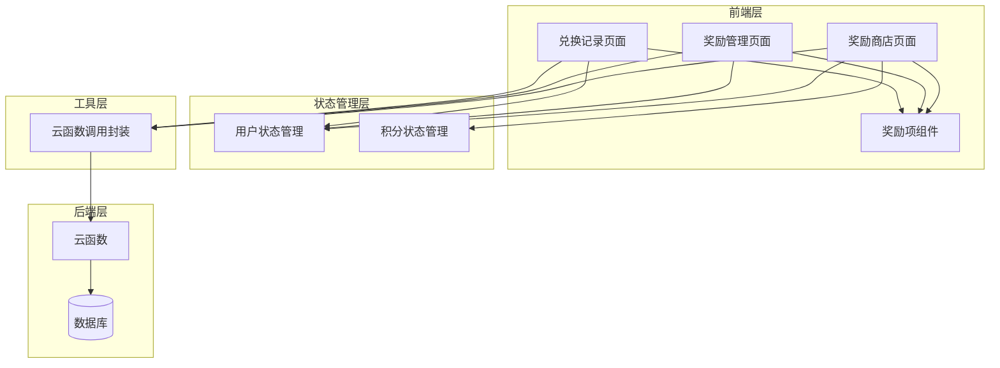
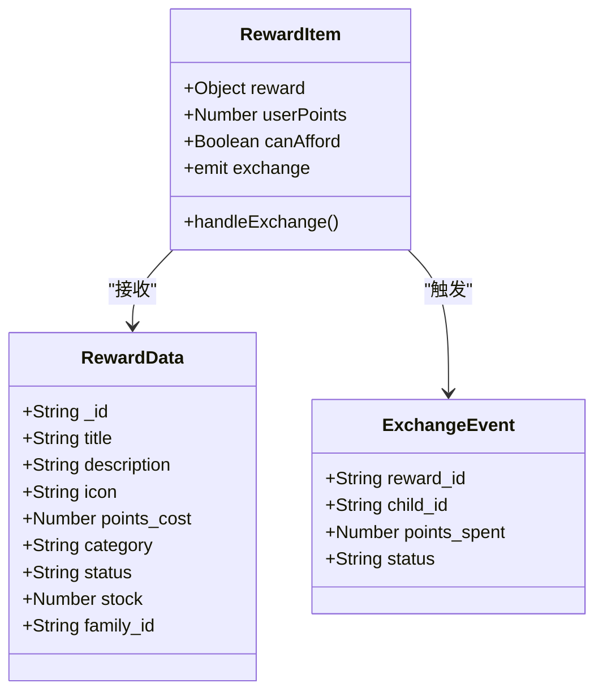
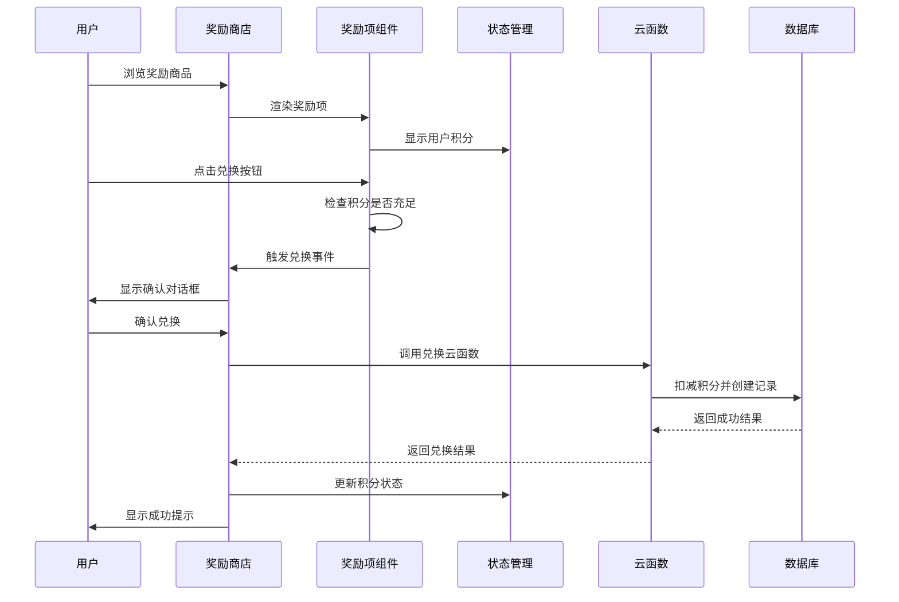
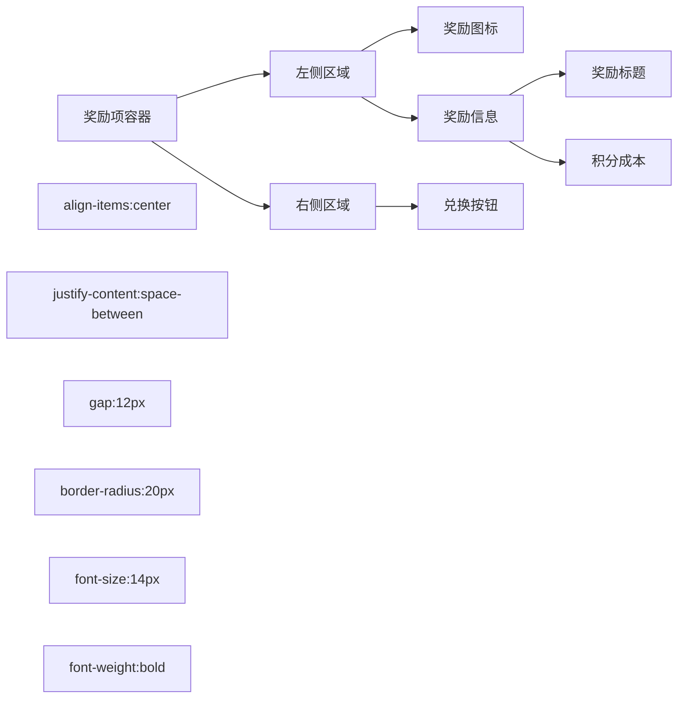
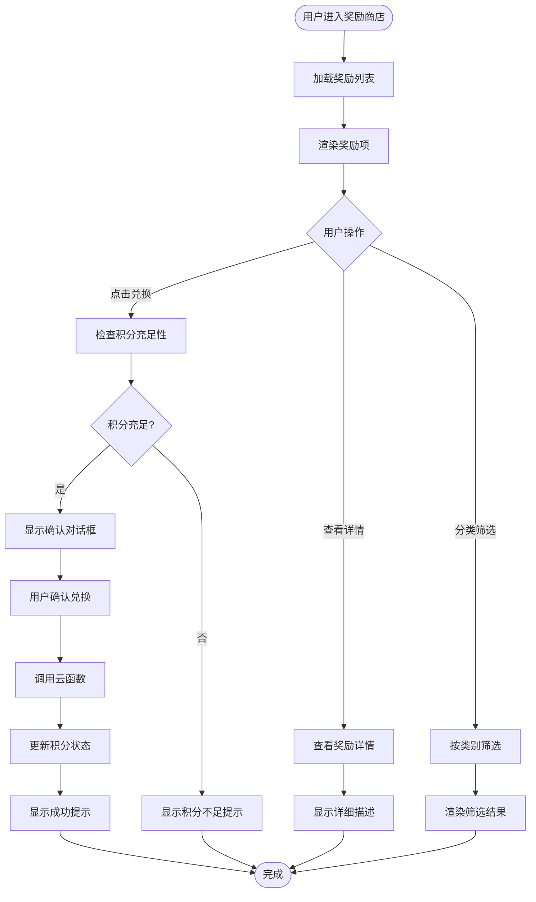
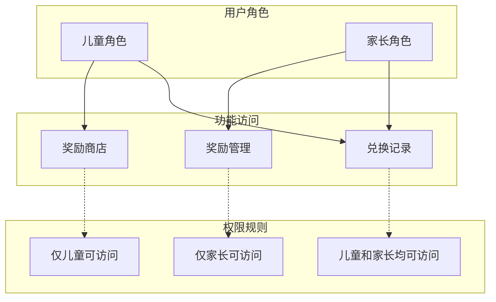
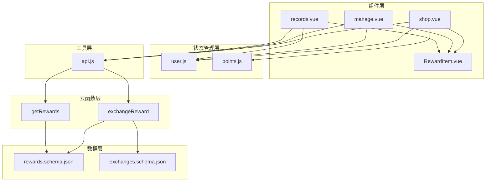
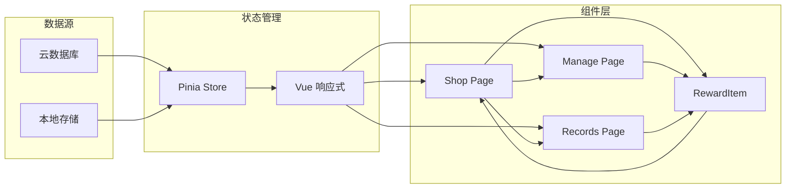

# RewardItem 奖励项组件

<cite>
**本文档引用的文件**
- [RewardItem.vue](file://src/components/RewardItem.vue)
- [shop.vue](file://src/pages/reward/shop.vue)
- [manage.vue](file://src/pages/reward/manage.vue)
- [records.vue](file://src/pages/reward/records.vue)
- [user.js](file://src/stores/user.js)
- [points.js](file://src/stores/points.js)
- [api.js](file://src/utils/api.js)
- [rewards.schema.json](file://uniCloud-aliyun/database/rewards.schema.json)
- [exchanges.schema.json](file://uniCloud-aliyun/database/exchanges.schema.json)
- [exchangeReward/index.js](file://uniCloud-aliyun/cloudfunctions/exchangeReward/index.js)
- [getRewards/index.js](file://uniCloud-aliyun/cloudfunctions/getRewards/index.js)
</cite>

## 目录
1. [简介](#简介)
2. [项目结构](#项目结构)
3. [核心组件](#核心组件)
4. [架构概览](#架构概览)
5. [详细组件分析](#详细组件分析)
6. [依赖关系分析](#依赖关系分析)
7. [性能考虑](#性能考虑)
8. [故障排除指南](#故障排除指南)
9. [结论](#结论)
10. [附录](#附录)

## 简介

RewardItem 是星成长奖励系统中的核心展示组件，负责在奖励商店中显示可兑换的商品信息。该组件采用简洁直观的设计理念，通过统一的界面元素展示奖励的基本信息，并提供完整的兑换交互流程。

组件的核心价值在于：
- **统一的奖励展示格式**：标准化不同类型的奖励商品展示
- **实时的积分匹配**：动态计算用户的积分余额与奖励成本的匹配关系
- **流畅的兑换体验**：提供从浏览到确认的完整用户操作流程
- **响应式设计**：适配不同屏幕尺寸和设备类型

## 项目结构

奖励系统的整体架构采用分层设计，各模块职责明确，耦合度低：



**图表来源**
- [shop.vue:1-135](file://src/pages/reward/shop.vue#L1-L135)
- [manage.vue:1-219](file://src/pages/reward/manage.vue#L1-L219)
- [records.vue:1-108](file://src/pages/reward/records.vue#L1-L108)
- [user.js:1-119](file://src/stores/user.js#L1-L119)
- [points.js:1-44](file://src/stores/points.js#L1-L44)

**章节来源**
- [shop.vue:1-135](file://src/pages/reward/shop.vue#L1-L135)
- [manage.vue:1-219](file://src/pages/reward/manage.vue#L1-L219)
- [records.vue:1-108](file://src/pages/reward/records.vue#L1-L108)

## 核心组件

RewardItem 组件是奖励系统的基础构建块，具有以下核心特性：

### 组件架构设计



**图表来源**
- [RewardItem.vue:20-35](file://src/components/RewardItem.vue#L20-L35)
- [rewards.schema.json:10-51](file://uniCloud-aliyun/database/rewards.schema.json#L10-L51)

### Props 属性详解

| 属性名 | 类型 | 必需 | 默认值 | 描述 |
|--------|------|------|--------|------|
| reward | Object | 是 | - | 奖励商品对象，包含标题、描述、图标、积分成本等信息 |
| userPoints | Number | 否 | 0 | 当前用户的积分余额 |

### 计算属性

组件使用 Vue 的计算属性系统来实现响应式状态管理：

- **canAfford**: 基于用户积分与奖励成本的比较，动态判断是否可以兑换

**章节来源**
- [RewardItem.vue:23-34](file://src/components/RewardItem.vue#L23-L34)

## 架构概览

奖励系统的整体架构体现了清晰的关注点分离和模块化设计：



**图表来源**
- [shop.vue:77-104](file://src/pages/reward/shop.vue#L77-L104)
- [exchangeReward/index.js:4-52](file://uniCloud-aliyun/cloudfunctions/exchangeReward/index.js#L4-L52)

## 详细组件分析

### 组件渲染结构

RewardItem 采用简洁的两列布局设计：



**图表来源**
- [RewardItem.vue:3-17](file://src/components/RewardItem.vue#L3-L17)

### 不同奖励类型的展示差异

虽然当前组件实现了统一的展示格式，但系统架构支持不同类型奖励的差异化处理：

| 奖励类型 | 展示特点 | 特殊处理 |
|----------|----------|----------|
| 实物奖励 | 图标+标题+积分成本 | 可能需要额外的物流信息 |
| 虚拟奖励 | 数字内容或服务 | 显示激活码或使用说明 |
| 服务奖励 | 时间或体验类项目 | 显示预约或使用限制 |

### 交互设计流程



**图表来源**
- [shop.vue:77-104](file://src/pages/reward/shop.vue#L77-L104)
- [RewardItem.vue:32-34](file://src/components/RewardItem.vue#L32-L34)

### 视觉设计规范

组件采用温暖的渐变色彩方案，营造积极向上的奖励氛围：

| 设计元素 | 规范 | 用途 |
|----------|------|------|
| 主色调 | 渐变橙色 (#FF6B6B 至 #FF8E53) | 兑换按钮的主要颜色 |
| 背景色 | 白色 (#FFFFFF) | 奖励项容器背景 |
| 字体颜色 | 深灰 (#333333) | 标题和描述文字 |
| 积分颜色 | 红色 (#FF6B6B) | 积分成本标识 |
| 禁用状态 | 灰色 (#999999) | 积分不足时的按钮样式 |

### 权限控制和角色适配

系统采用基于角色的权限控制机制：



**图表来源**
- [user.js:18-20](file://src/stores/user.js#L18-L20)
- [shop.vue:35-41](file://src/pages/reward/shop.vue#L35-L41)

**章节来源**
- [user.js:18-20](file://src/stores/user.js#L18-L20)
- [shop.vue:35-41](file://src/pages/reward/shop.vue#L35-L41)

### 组件使用示例

#### 奖励商店场景

在奖励商店中，RewardItem 组件以列表形式展示所有可用的奖励商品：

```javascript
// 在奖励商店页面中使用
<RewardItem
  v-for="reward in filteredRewards"
  :key="reward._id"
  :reward="reward"
  :user-points="pointsStore.current"
  @exchange="handleExchange"
/>
```

#### 兑换记录场景

在兑换记录页面中，组件用于展示历史兑换状态：

```javascript
// 在兑换记录页面中使用
<RecordItem
  v-for="record in records"
  :key="record._id"
  :record="record"
  :user-role="userStore.role"
/>
```

#### 管理后台场景

在奖励管理页面中，组件用于编辑和管理奖励商品：

```javascript
// 在管理页面中使用
<RewardItem
  v-for="reward in rewards"
  :key="reward._id"
  :reward="reward"
  @edit="editReward"
  @delete="deleteReward"
/>
```

**章节来源**
- [shop.vue:22-29](file://src/pages/reward/shop.vue#L22-L29)
- [records.vue:29-41](file://src/pages/reward/records.vue#L29-L41)
- [manage.vue:51-62](file://src/pages/reward/manage.vue#L51-L62)

## 依赖关系分析

### 组件间依赖关系



**图表来源**
- [RewardItem.vue:1-53](file://src/components/RewardItem.vue#L1-L53)
- [shop.vue:48-51](file://src/pages/reward/shop.vue#L48-L51)
- [manage.vue:74-75](file://src/pages/reward/manage.vue#L74-L75)
- [records.vue:49-51](file://src/pages/reward/records.vue#L49-L51)

### 数据流分析

组件的数据流遵循单向数据绑定原则：



**图表来源**
- [points.js:9-42](file://src/stores/points.js#L9-L42)
- [user.js:7-118](file://src/stores/user.js#L7-L118)

**章节来源**
- [points.js:9-42](file://src/stores/points.js#L9-L42)
- [user.js:7-118](file://src/stores/user.js#L7-L118)

## 性能考虑

### 渲染优化策略

1. **虚拟滚动**: 对于大量奖励商品的情况，建议实现虚拟滚动以减少 DOM 元素数量
2. **懒加载**: 奖励图片采用懒加载策略，提升首屏加载速度
3. **计算属性缓存**: 使用 Vue 的计算属性缓存昂贵的计算操作

### 状态同步优化

1. **批量更新**: 将多个状态更新合并为一次操作，避免重复渲染
2. **防抖处理**: 对频繁的状态变化进行防抖处理
3. **增量更新**: 仅更新发生变化的部分，而非整个组件树

### 网络请求优化

1. **请求去重**: 避免重复发送相同的网络请求
2. **缓存策略**: 实现合理的数据缓存机制
3. **错误重试**: 对网络异常进行智能重试

## 故障排除指南

### 常见问题及解决方案

#### 积分不足问题

**问题现象**: 兑换按钮显示"积分不足"且无法点击

**可能原因**:
- 用户积分余额不足
- 积分状态未正确更新
- 云函数执行失败

**解决步骤**:
1. 检查用户积分余额是否正确
2. 验证云函数调用是否成功
3. 确认状态管理器的积分更新逻辑

#### 奖励商品显示异常

**问题现象**: 奖励商品图标或标题显示不正确

**可能原因**:
- 数据库字段缺失
- 前端渲染逻辑错误
- 缓存数据过期

**解决步骤**:
1. 验证数据库中的奖励数据完整性
2. 检查前端模板渲染逻辑
3. 清除并重新加载缓存数据

#### 兑换流程中断

**问题现象**: 兑换过程中断，状态不一致

**可能原因**:
- 网络请求超时
- 云函数执行异常
- 前端状态同步失败

**解决步骤**:
1. 检查网络连接状态
2. 查看云函数执行日志
3. 实现补偿机制处理异常状态

**章节来源**
- [shop.vue:77-104](file://src/pages/reward/shop.vue#L77-L104)
- [exchangeReward/index.js:4-52](file://uniCloud-aliyun/cloudfunctions/exchangeReward/index.js#L4-L52)

## 结论

RewardItem 奖励项组件作为星成长奖励系统的核心组成部分，展现了优秀的架构设计和用户体验。组件通过简洁的接口设计、完善的权限控制和流畅的交互流程，为用户提供了优质的奖励兑换体验。

### 主要优势

1. **设计简洁**: 采用统一的视觉设计语言，符合移动端使用习惯
2. **功能完整**: 覆盖从浏览到兑换的完整业务流程
3. **扩展性强**: 支持不同类型奖励的差异化展示
4. **权限清晰**: 基于角色的权限控制确保系统安全

### 改进建议

1. **增强响应式设计**: 适配更多屏幕尺寸和设备类型
2. **优化性能表现**: 实现虚拟滚动和图片懒加载
3. **完善错误处理**: 提供更友好的错误提示和恢复机制
4. **增强可访问性**: 支持屏幕阅读器和其他辅助技术

## 附录

### API 接口定义

#### 奖励商品查询
- **路径**: `/api/rewards`
- **方法**: GET
- **参数**: `family_id` (可选)
- **返回**: 奖励商品列表

#### 奖励兑换
- **路径**: `/api/exchange`
- **方法**: POST
- **参数**: 
  - `reward_id`: 奖励商品 ID
  - `child_id`: 孩子用户 ID
  - `family_id`: 家庭 ID
- **返回**: 兑换结果和状态

### 数据模型

#### 奖励商品模型
```json
{
  "_id": "字符串",
  "title": "字符串",
  "description": "字符串",
  "icon": "字符串",
  "points_cost": "数字",
  "category": "字符串",
  "status": "字符串",
  "stock": "数字",
  "family_id": "字符串"
}
```

#### 兑换记录模型
```json
{
  "_id": "字符串",
  "reward_id": "字符串",
  "reward_title": "字符串",
  "child_id": "字符串",
  "family_id": "字符串",
  "points_spent": "数字",
  "status": "字符串",
  "created_at": "数字"
}
```