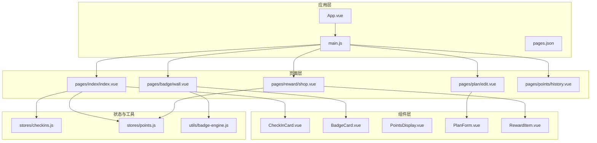
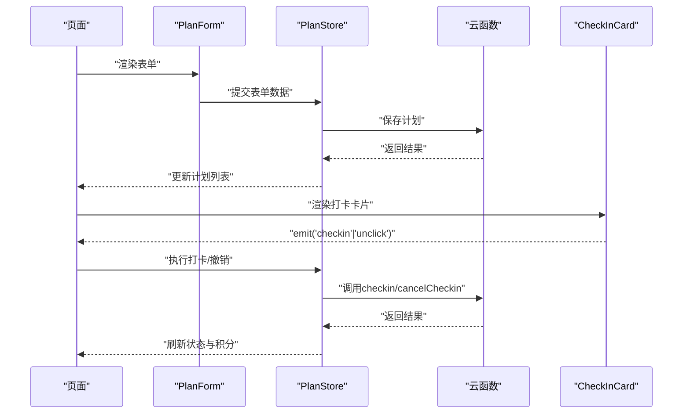
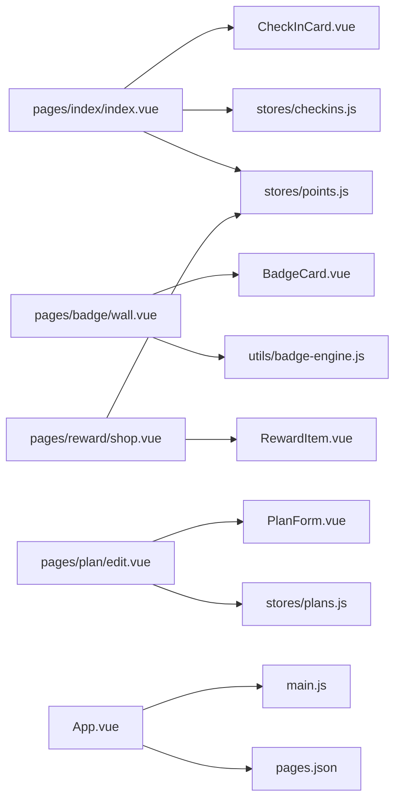

# UI组件系统

<cite>
**本文引用的文件**
- [CheckInCard.vue](file://src/components/CheckInCard.vue)
- [BadgeCard.vue](file://src/components/BadgeCard.vue)
- [PointsDisplay.vue](file://src/components/PointsDisplay.vue)
- [PlanForm.vue](file://src/components/PlanForm.vue)
- [RewardItem.vue](file://src/components/RewardItem.vue)
- [index.vue（首页）](file://src/pages/index/index.vue)
- [wall.vue（勋章墙）](file://src/pages/badge/wall.vue)
- [shop.vue（奖励商店）](file://src/pages/reward/shop.vue)
- [edit.vue（编辑计划）](file://src/pages/plan/edit.vue)
- [history.vue（积分明细）](file://src/pages/points/history.vue)
- [checkins.js（打卡状态管理）](file://src/stores/checkins.js)
- [points.js（积分状态管理）](file://src/stores/points.js)
- [badge-engine.js（勋章引擎）](file://src/utils/badge-engine.js)
- [package.json（依赖）](file://package.json)
- [App.vue（应用入口）](file://src/App.vue)
- [main.js（应用初始化）](file://src/main.js)
- [pages.json（页面配置）](file://src/pages.json)
</cite>

## 目录
1. [简介](#简介)
2. [项目结构](#项目结构)
3. [核心组件](#核心组件)
4. [架构总览](#架构总览)
5. [组件详解](#组件详解)
6. [依赖关系分析](#依赖关系分析)
7. [性能考量](#性能考量)
8. [故障排查指南](#故障排查指南)
9. [结论](#结论)
10. [附录](#附录)

## 简介
本文件面向Star Grow项目中的UI组件系统，重点围绕uView Plus框架与自定义组件的设计理念，系统梳理并说明以下可复用组件：CheckInCard（打卡卡片）、BadgeCard（勋章卡片）、PointsDisplay（积分显示）、PlanForm（计划表单）、RewardItem（奖励项）。内容涵盖组件功能、属性、事件、插槽使用方式、样式定制与主题适配、响应式与多端兼容、组合使用模式与最佳实践，并给出测试策略与维护建议，帮助开发者快速理解并正确使用这些UI组件。

## 项目结构
- 组件层：位于 src/components，包含五个核心可复用组件。
- 页面层：位于 src/pages，各页面通过引入组件实现业务功能。
- 状态层：位于 src/stores，提供数据与业务逻辑支撑（如打卡、积分）。
- 工具层：位于 src/utils，包含业务规则与工具函数（如勋章引擎）。
- 应用层：src/App.vue、src/main.js、src/pages.json 提供全局样式、应用初始化与页面路由配置。

图表来源
- [App.vue:1-64](file://src/App.vue#L1-L64)
- [main.js:1-11](file://src/main.js#L1-L11)
- [pages.json:1-56](file://src/pages.json#L1-L56)
- [index.vue（首页）:1-204](file://src/pages/index/index.vue#L1-L204)
- [wall.vue（勋章墙）:1-82](file://src/pages/badge/wall.vue#L1-L82)
- [shop.vue（奖励商店）:1-135](file://src/pages/reward/shop.vue#L1-L135)
- [edit.vue（编辑计划）:1-35](file://src/pages/plan/edit.vue#L1-L35)
- [checkins.js:1-163](file://src/stores/checkins.js#L1-L163)
- [points.js:1-44](file://src/stores/points.js#L1-L44)
- [badge-engine.js:1-120](file://src/utils/badge-engine.js#L1-L120)

章节来源
- [package.json:1-74](file://package.json#L1-L74)
- [pages.json:1-56](file://src/pages.json#L1-L56)

## 核心组件
本节概述五个核心组件的职责与交互关系，便于快速定位与使用。

- CheckInCard：用于“今日任务”列表，展示计划类别、频率与积分奖励，支持点击打卡/撤销。
- BadgeCard：用于“勋章墙”，展示徽章图标、标题、解锁日期或未解锁描述。
- PointsDisplay：用于积分概览，展示当前可用积分并支持简单动画。
- PlanForm：用于创建/编辑计划，提供表单输入与校验，输出标准化表单数据。
- RewardItem：用于奖励商店，展示奖励信息与兑换按钮，根据用户积分控制可用状态。

章节来源
- [CheckInCard.vue:1-67](file://src/components/CheckInCard.vue#L1-L67)
- [BadgeCard.vue:1-37](file://src/components/BadgeCard.vue#L1-L37)
- [PointsDisplay.vue:1-32](file://src/components/PointsDisplay.vue#L1-L32)
- [PlanForm.vue:1-119](file://src/components/PlanForm.vue#L1-L119)
- [RewardItem.vue:1-53](file://src/components/RewardItem.vue#L1-L53)

## 架构总览
组件与页面、状态管理、工具函数之间的交互如下：

图表来源
- [edit.vue（编辑计划）:1-35](file://src/pages/plan/edit.vue#L1-L35)
- [PlanForm.vue:1-119](file://src/components/PlanForm.vue#L1-L119)
- [index.vue（首页）:1-204](file://src/pages/index/index.vue#L1-L204)
- [checkins.js:1-163](file://src/stores/checkins.js#L1-L163)

## 组件详解

### CheckInCard 打卡卡片
- 功能：展示计划信息与打卡按钮；根据是否已打卡切换样式与文案；支持点击事件。
- 关键属性（props）
  - plan: 对象，必需；包含计划标题、类别、频率与每次积分奖励等字段。
  - isToday: 布尔值，默认true；用于标识是否为今日任务。
  - isChecked: 布尔值，默认false；表示该计划是否已打卡。
- 事件（emits）
  - checkin(plan): 已打卡时点击触发，传入计划对象。
  - unclick(plan): 未打卡时点击触发，传入计划对象。
- 插槽：无。
- 样式与主题
  - 使用圆角、阴影与渐变背景，选中态与未选中态通过类名切换。
  - 支持通过外部容器类名覆盖部分样式。
- 响应式与多端
  - 使用flex布局与相对单位，适配不同屏幕尺寸。
  - 在微信小程序、H5等多端运行稳定。
- 使用示例（路径）
  - [首页渲染与事件绑定:48-55](file://src/pages/index/index.vue#L48-L55)
- 最佳实践
  - 与状态管理配合，实时更新 isChecked 状态。
  - 结合离线同步队列，保证网络异常时的用户体验。

章节来源
- [CheckInCard.vue:1-67](file://src/components/CheckInCard.vue#L1-L67)
- [index.vue（首页）:1-204](file://src/pages/index/index.vue#L1-L204)

### BadgeCard 勋章卡片
- 功能：展示徽章图标、标题、解锁日期或未解锁描述；根据解锁状态切换样式。
- 关键属性（props）
  - badge: 对象，必需；包含徽章类型、图标、标题、描述、解锁时间等。
  - unlocked: 布尔值，默认false；表示是否已解锁。
- 事件：无。
- 插槽：无。
- 样式与主题
  - 解锁态使用渐变背景，未解锁态采用灰阶与低透明度。
  - 图标与文字大小按设计规范设定，适配移动端。
- 使用示例（路径）
  - [勋章墙渲染:17-24](file://src/pages/badge/wall.vue#L17-L24)
- 最佳实践
  - 与勋章引擎配合，动态判断解锁状态。
  - 在网格布局中注意响应式列数与间距。

章节来源
- [BadgeCard.vue:1-37](file://src/components/BadgeCard.vue#L1-L37)
- [wall.vue（勋章墙）:1-82](file://src/pages/badge/wall.vue#L1-L82)
- [badge-engine.js:1-120](file://src/utils/badge-engine.js#L1-L120)

### PointsDisplay 积分显示
- 功能：以大号数字与星形图标展示当前可用积分；支持简单动画。
- 关键属性（props）
  - points: 数字，默认0；当前可用积分。
  - animated: 布尔值，默认false；是否触发动画。
- 事件：无。
- 插槽：无。
- 样式与主题
  - 主题色用于积分数字，标签文字使用浅色。
  - 动画通过scoped样式定义，避免全局污染。
- 使用示例（路径）
  - [首页顶部积分展示:16-19](file://src/pages/index/index.vue#L16-L19)
  - [积分明细页展示:4-8](file://src/pages/points/history.vue#L4-L8)
- 最佳实践
  - 与积分状态管理联动，及时更新 points。
  - 动画仅在关键状态变化时启用，避免频繁触发。

章节来源
- [PointsDisplay.vue:1-32](file://src/components/PointsDisplay.vue#L1-L32)
- [index.vue（首页）:1-204](file://src/pages/index/index.vue#L1-L204)
- [history.vue（积分明细）:1-27](file://src/pages/points/history.vue#L1-L27)

### PlanForm 计划表单
- 功能：创建/编辑计划的统一表单，包含名称、分类、频次、积分奖励、提醒时间等。
- 关键属性（props）
  - plan: 对象，默认null；编辑模式时传入原计划数据。
- 事件（emits）
  - submit(formData): 表单校验通过后触发，传入标准化表单数据。
- 插槽：无。
- 样式与主题
  - 输入框、按钮、分类网格与频次按钮均使用统一的渐变与圆角风格。
  - 通过scoped样式隔离，避免影响其他组件。
- 使用示例（路径）
  - [编辑计划页面:1-35](file://src/pages/plan/edit.vue#L1-35)
- 最佳实践
  - 编辑模式下使用 watch 回填表单数据。
  - 表单校验在提交时进行，必要时结合页面提示。

章节来源
- [PlanForm.vue:1-119](file://src/components/PlanForm.vue#L1-L119)
- [edit.vue（编辑计划）:1-35](file://src/pages/plan/edit.vue#L1-L35)

### RewardItem 奖励项
- 功能：展示奖励图标、标题与所需积分，支持兑换按钮；根据用户积分控制按钮可用状态。
- 关键属性（props）
  - reward: 对象，必需；包含奖励图标、标题、描述、所需积分等。
  - userPoints: 数字，默认0；用户当前可用积分。
- 事件（emits）
  - exchange(reward): 用户点击兑换且满足条件时触发，传入奖励对象。
- 插槽：无。
- 样式与主题
  - 兑换按钮使用渐变背景，禁用态使用灰色。
  - 与页面整体风格保持一致。
- 使用示例（路径）
  - [奖励商店渲染与兑换流程:21-29](file://src/pages/reward/shop.vue#L21-L29)
- 最佳实践
  - 兑换前进行积分校验，避免无效点击。
  - 兑换成功后及时更新用户积分与历史记录。

章节来源
- [RewardItem.vue:1-53](file://src/components/RewardItem.vue#L1-L53)
- [shop.vue（奖励商店）:1-135](file://src/pages/reward/shop.vue#L1-L135)

## 依赖关系分析
- 组件依赖
  - CheckInCard 依赖页面状态（是否已打卡），并与状态管理交互。
  - BadgeCard 依赖徽章定义与解锁状态。
  - PointsDisplay 依赖积分状态管理。
  - PlanForm 依赖计划状态管理与云函数。
  - RewardItem 依赖积分状态管理与云函数。
- 外部依赖
  - uView Plus：项目依赖中包含 uview-plus，可作为UI增强与组件补充的基础。
- 数据流
  - 页面通过组件暴露的事件与props进行双向通信，状态管理负责持久化与跨页面共享。

图表来源
- [index.vue（首页）:1-204](file://src/pages/index/index.vue#L1-L204)
- [wall.vue（勋章墙）:1-82](file://src/pages/badge/wall.vue#L1-L82)
- [shop.vue（奖励商店）:1-135](file://src/pages/reward/shop.vue#L1-L135)
- [edit.vue（编辑计划）:1-35](file://src/pages/plan/edit.vue#L1-L35)
- [checkins.js:1-163](file://src/stores/checkins.js#L1-L163)
- [points.js:1-44](file://src/stores/points.js#L1-L44)
- [badge-engine.js:1-120](file://src/utils/badge-engine.js#L1-L120)
- [App.vue:1-64](file://src/App.vue#L1-L64)
- [main.js:1-11](file://src/main.js#L1-L11)
- [pages.json:1-56](file://src/pages.json#L1-L56)

章节来源
- [package.json:1-74](file://package.json#L1-L74)

## 性能考量
- 渲染优化
  - 列表渲染时使用 v-for 并提供稳定 key（如计划ID或标题），减少重排。
  - 将复杂计算放入计算属性，避免重复计算。
- 事件与动画
  - 动画仅在必要时触发（如积分变化），避免频繁触发导致掉帧。
- 网络与离线
  - 打卡与兑换操作在网络异常时进入离线队列，完成后提示同步。
- 主题与样式
  - 使用scoped样式与变量化的颜色，降低样式冲突风险。
- 多端兼容
  - 组件布局采用flex与相对单位，适配H5与小程序端。

## 故障排查指南
- 打卡相关
  - 若点击无效，检查 isChecked 状态是否与计划ID匹配。
  - 若撤销失败，查看状态管理返回的错误信息并提示用户。
- 兑换相关
  - 若兑换按钮不可用，确认 userPoints 是否小于 reward.points_cost。
  - 兑换后未扣减积分，检查状态管理的扣减逻辑与本地缓存。
- 表单相关
  - 若提交失败，检查必填字段与类型（如频次count为数值）。
- 徽章相关
  - 若未解锁，确认上下文数据（连续天数、本周打卡记录、计划集合）是否完整。

章节来源
- [checkins.js:1-163](file://src/stores/checkins.js#L1-L163)
- [points.js:1-44](file://src/stores/points.js#L1-L44)
- [PlanForm.vue:1-119](file://src/components/PlanForm.vue#L1-L119)
- [RewardItem.vue:1-53](file://src/components/RewardItem.vue#L1-L53)

## 结论
本UI组件系统以简洁、可复用为核心目标，结合uView Plus与自定义组件，实现了从打卡、积分到奖励与勋章的完整闭环。通过明确的props、事件与样式约定，开发者可以快速组合使用这些组件，并在多端环境下保持一致的视觉与交互体验。建议在后续迭代中持续完善测试与文档，确保组件的稳定性与可维护性。

## 附录

### 组件属性与事件速查
- CheckInCard
  - 属性：plan（对象，必需）、isToday（布尔）、isChecked（布尔）
  - 事件：checkin、unclick
- BadgeCard
  - 属性：badge（对象，必需）、unlocked（布尔）
  - 事件：无
- PointsDisplay
  - 属性：points（数字）、animated（布尔）
  - 事件：无
- PlanForm
  - 属性：plan（对象）
  - 事件：submit
- RewardItem
  - 属性：reward（对象，必需）、userPoints（数字）
  - 事件：exchange

### 组合使用模式与最佳实践
- 首页“今日任务”：使用 CheckInCard 列表，结合状态管理实时更新打卡状态与积分。
- 勋章墙：使用 BadgeCard 网格，结合徽章引擎判断解锁状态。
- 奖励商店：使用 RewardItem 列表，结合积分状态管理控制兑换按钮可用性。
- 计划管理：使用 PlanForm 表单，结合计划状态管理与云函数实现创建/编辑。
- 积分展示：使用 PointsDisplay 在多个页面统一展示当前积分。

### 测试策略与维护指南
- 单元测试
  - 为组件的计算属性与事件处理编写单元测试，覆盖边界条件（空数据、非法输入）。
- 集成测试
  - 覆盖从页面到状态管理再到云函数的完整链路，验证数据一致性与错误处理。
- 可访问性与多端
  - 在H5与各小程序平台进行回归测试，确保交互与样式一致。
- 文档与规范
  - 统一组件命名、属性与事件命名规范，保持文档与代码同步更新。