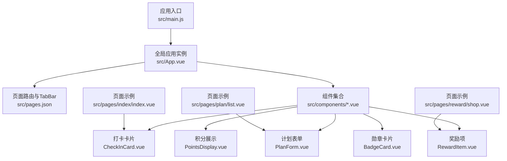
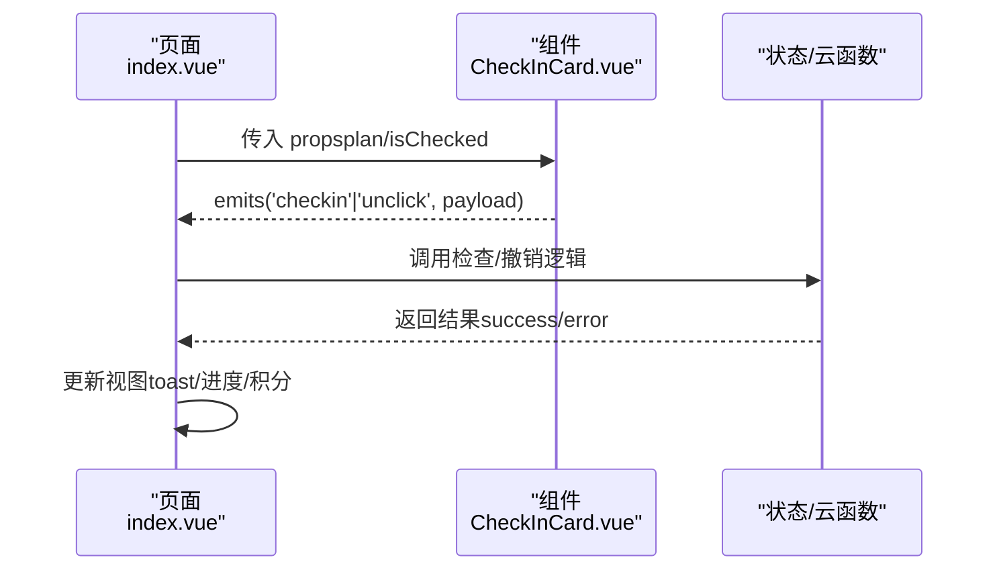
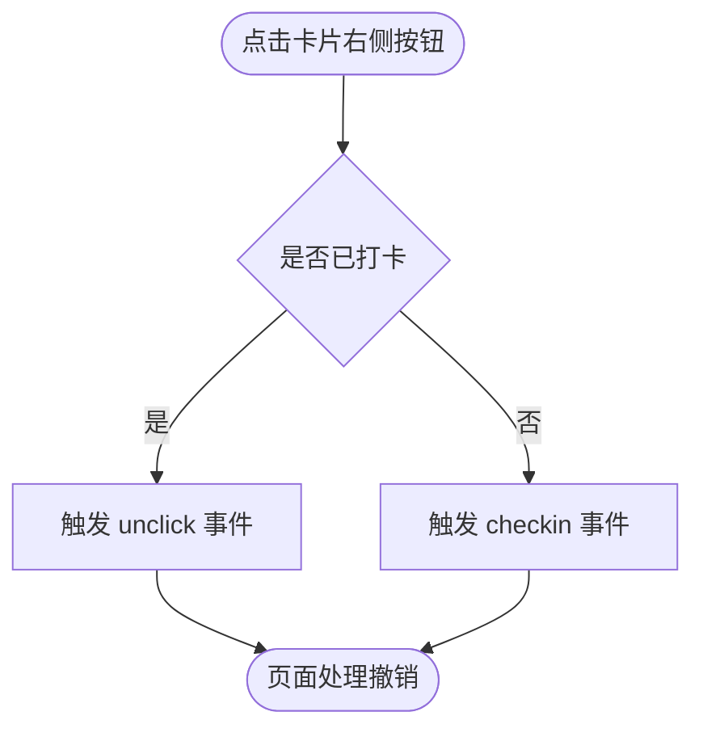
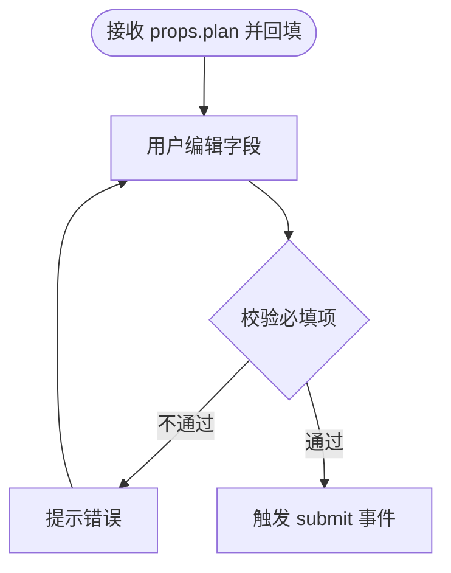
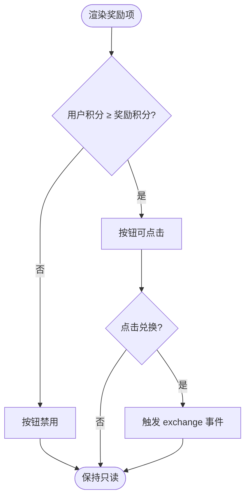
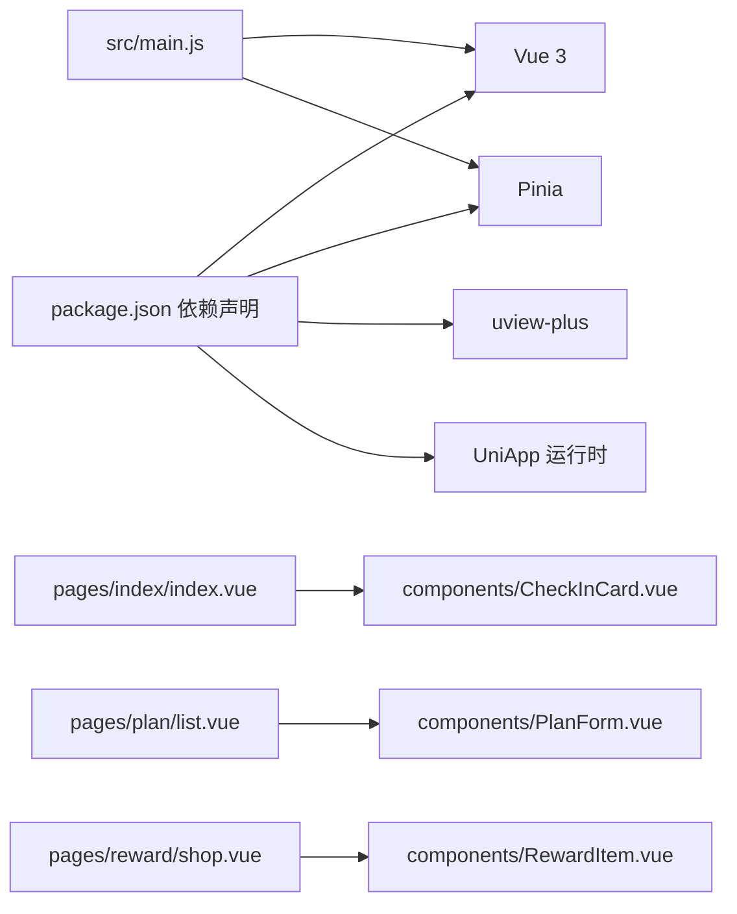

# 组件概览

<cite>
**本文引用的文件**
- [package.json](file://package.json)
- [src/main.js](file://src/main.js)
- [src/App.vue](file://src/App.vue)
- [src/pages.json](file://src/pages.json)
- [src/manifest.json](file://src/manifest.json)
- [src/components/CheckInCard.vue](file://src/components/CheckInCard.vue)
- [src/components/PlanForm.vue](file://src/components/PlanForm.vue)
- [src/components/RewardItem.vue](file://src/components/RewardItem.vue)
- [src/components/PointsDisplay.vue](file://src/components/PointsDisplay.vue)
- [src/components/BadgeCard.vue](file://src/components/BadgeCard.vue)
- [src/pages/index/index.vue](file://src/pages/index/index.vue)
- [src/pages/plan/list.vue](file://src/pages/plan/list.vue)
- [src/pages/reward/shop.vue](file://src/pages/reward/shop.vue)
</cite>

## 目录
1. [简介](#简介)
2. [项目结构](#项目结构)
3. [核心组件](#核心组件)
4. [架构总览](#架构总览)
5. [详细组件分析](#详细组件分析)
6. [依赖关系分析](#依赖关系分析)
7. [性能与可维护性](#性能与可维护性)
8. [故障排查指南](#故障排查指南)
9. [结论](#结论)
10. [附录](#附录)

## 简介
本概览面向 Star Grow 项目的 UI 组件系统，重点说明以下内容：
- 使用的 UI 框架与自定义组件的整体设计理念
- 组件系统的架构模式、命名规范与使用约定
- 组件分类体系（基础组件、业务组件、复合组件）与层次结构
- 通用属性、事件与插槽的设计原则
- 组件选择指南与典型使用场景
- 主题适配与样式定制方法
- 响应式设计与多端兼容性考虑
- 开发者使用流程与最佳实践

## 项目结构
项目采用基于功能域的目录组织方式，前端核心由 Vue 3 + UniApp 构建，组件集中在 src/components 下，页面位于 src/pages 中，并通过 pages.json 进行路由与 TabBar 配置。

图表来源
- [src/main.js:1-11](file://src/main.js#L1-L11)
- [src/App.vue:1-64](file://src/App.vue#L1-L64)
- [src/pages.json:1-56](file://src/pages.json#L1-L56)
- [src/components/CheckInCard.vue:1-67](file://src/components/CheckInCard.vue#L1-L67)
- [src/components/PlanForm.vue:1-119](file://src/components/PlanForm.vue#L1-L119)
- [src/components/RewardItem.vue:1-53](file://src/components/RewardItem.vue#L1-L53)
- [src/components/PointsDisplay.vue:1-32](file://src/components/PointsDisplay.vue#L1-L32)
- [src/components/BadgeCard.vue:1-37](file://src/components/BadgeCard.vue#L1-L37)
- [src/pages/index/index.vue:1-204](file://src/pages/index/index.vue#L1-L204)
- [src/pages/plan/list.vue:1-133](file://src/pages/plan/list.vue#L1-L133)
- [src/pages/reward/shop.vue:1-135](file://src/pages/reward/shop.vue#L1-L135)

章节来源
- [src/main.js:1-11](file://src/main.js#L1-L11)
- [src/App.vue:1-64](file://src/App.vue#L1-L64)
- [src/pages.json:1-56](file://src/pages.json#L1-L56)

## 核心组件
本项目未直接引入 uView Plus 的内置组件库，而是以自定义组件为主，结合 uni-app 的原生组件能力实现统一风格与交互。核心自定义组件包括：
- 打卡卡片：用于展示与触发“打卡”动作
- 计划表单：用于创建/编辑计划
- 奖励项：用于展示奖励并触发兑换
- 积分展示：用于展示当前可用积分
- 勋章卡片：用于展示徽章状态与解锁信息

这些组件均采用 Vue 3 Composition API 与单文件组件（SFC）形式，具备明确的 props、emits 与 scoped 样式，便于复用与主题化。

章节来源
- [src/components/CheckInCard.vue:1-67](file://src/components/CheckInCard.vue#L1-L67)
- [src/components/PlanForm.vue:1-119](file://src/components/PlanForm.vue#L1-L119)
- [src/components/RewardItem.vue:1-53](file://src/components/RewardItem.vue#L1-L53)
- [src/components/PointsDisplay.vue:1-32](file://src/components/PointsDisplay.vue#L1-L32)
- [src/components/BadgeCard.vue:1-37](file://src/components/BadgeCard.vue#L1-L37)

## 架构总览
组件系统遵循“页面驱动组件”的模式：页面通过 import 引入组件并在模板中渲染；组件通过 props 接收数据、通过 emits 触发事件，页面监听事件并更新状态或调用云函数。

图表来源
- [src/pages/index/index.vue:48-55](file://src/pages/index/index.vue#L48-L55)
- [src/components/CheckInCard.vue:23-42](file://src/components/CheckInCard.vue#L23-L42)

章节来源
- [src/pages/index/index.vue:127-154](file://src/pages/index/index.vue#L127-L154)
- [src/components/CheckInCard.vue:29-42](file://src/components/CheckInCard.vue#L29-L42)

## 详细组件分析

### 打卡卡片（CheckInCard）
- 设计理念：以视觉反馈强化“完成/未完成”状态，按钮采用渐变与阴影增强触控反馈
- 属性（props）
  - plan: 对象，包含标题、分类、频率、每次积分等
  - isToday: 布尔，是否为今日
  - isChecked: 布尔，是否已打卡
- 事件（emits）
  - checkin: 点击未完成按钮时触发
  - unclick: 点击已完成按钮时触发
- 插槽：无
- 使用场景：首页“今日任务”列表逐项渲染

图表来源
- [src/components/CheckInCard.vue:36-42](file://src/components/CheckInCard.vue#L36-L42)

章节来源
- [src/components/CheckInCard.vue:1-67](file://src/components/CheckInCard.vue#L1-L67)
- [src/pages/index/index.vue:48-55](file://src/pages/index/index.vue#L48-L55)

### 计划表单（PlanForm）
- 设计理念：通过网格与按钮组直观选择分类与频次，输入框与时间选择器保证易用性
- 属性（props）
  - plan: 对象（可选），编辑模式时用于回填
- 事件（emits）
  - submit: 提交时触发，携带完整表单数据
- 插槽：无
- 使用场景：计划列表页的“新建/编辑”页面

图表来源
- [src/components/PlanForm.vue:79-88](file://src/components/PlanForm.vue#L79-L88)

章节来源
- [src/components/PlanForm.vue:1-119](file://src/components/PlanForm.vue#L1-L119)
- [src/pages/plan/list.vue:61-93](file://src/pages/plan/list.vue#L61-L93)

### 奖励项（RewardItem）
- 设计理念：突出积分消耗与按钮禁用态，弱化不可兑换状态的视觉噪音
- 属性（props）
  - reward: 对象，包含标题、图标、积分消耗等
  - userPoints: 数字，用户当前积分
- 事件（emits）
  - exchange: 可兑换时触发
- 插槽：无
- 使用场景：奖励商店列表

图表来源
- [src/components/RewardItem.vue:30-34](file://src/components/RewardItem.vue#L30-L34)

章节来源
- [src/components/RewardItem.vue:1-53](file://src/components/RewardItem.vue#L1-L53)
- [src/pages/reward/shop.vue:22-29](file://src/pages/reward/shop.vue#L22-L29)

### 积分展示（PointsDisplay）
- 设计理念：大号数字与星标强调“可用积分”，支持简单动画提升反馈
- 属性（props）
  - points: 数字，默认 0
  - animated: 布尔，默认 false
- 事件：无
- 插槽：无
- 使用场景：首页头部、奖励商店头部等

章节来源
- [src/components/PointsDisplay.vue:1-32](file://src/components/PointsDisplay.vue#L1-L32)
- [src/pages/index/index.vue:16-20](file://src/pages/index/index.vue#L16-L20)
- [src/pages/reward/shop.vue:4-12](file://src/pages/reward/shop.vue#L4-L12)

### 勋章卡片（BadgeCard）
- 设计理念：区分“已解锁/未解锁”两种状态，使用灰度与颜色变化传达语义
- 属性（props）
  - badge: 对象，包含图标、标题、描述、解锁时间等
  - unlocked: 布尔，默认 false
- 事件：无
- 插槽：无
- 使用场景：勋章墙页面

章节来源
- [src/components/BadgeCard.vue:1-37](file://src/components/BadgeCard.vue#L1-L37)

## 依赖关系分析
- 框架与运行时
  - Vue 3 与 Pinia 状态管理
  - UniApp 多端运行时
- UI 框架
  - 项目未直接依赖 uView Plus 组件库，而是以自定义组件为主
  - 项目依赖 uview-plus 版本信息存在于依赖清单中，但未在组件代码中显式使用
- 页面与组件
  - 页面通过 import 引入组件并在模板中渲染
  - 组件通过 emits 与页面通信，页面负责调用云函数与更新状态

图表来源
- [package.json:39-74](file://package.json#L39-L74)
- [src/main.js:1-11](file://src/main.js#L1-L11)
- [src/pages/index/index.vue:73](file://src/pages/index/index.vue#L73)
- [src/pages/plan/list.vue:49](file://src/pages/plan/list.vue#L49)
- [src/pages/reward/shop.vue:51](file://src/pages/reward/shop.vue#L51)

章节来源
- [package.json:39-74](file://package.json#L39-L74)
- [src/main.js:1-11](file://src/main.js#L1-L11)

## 性能与可维护性
- 组件粒度
  - 自定义组件职责单一，props 与 emits 明确，利于缓存与重用
- 渲染优化
  - 列表渲染使用 v-for + key，避免不必要的整组重绘
- 状态与副作用
  - 页面集中处理业务逻辑（如检查/撤销、兑换），组件专注 UI 表达
- 样式隔离
  - 使用 scoped 样式，降低样式冲突风险

[本节为通用建议，无需特定文件引用]

## 故障排查指南
- 组件未显示或样式异常
  - 检查 props 是否正确传递（如 plan、reward、userPoints）
  - 确认页面是否监听并处理了组件发出的事件
- 事件未触发
  - 确认组件内是否正确调用 emit
  - 确认页面是否正确绑定 @事件名
- 多端表现差异
  - 检查 pages.json 与 manifest.json 的多端配置
  - 关注平台差异导致的组件行为差异（如 picker、button）

章节来源
- [src/pages/index/index.vue:127-154](file://src/pages/index/index.vue#L127-L154)
- [src/pages/reward/shop.vue:77-104](file://src/pages/reward/shop.vue#L77-L104)
- [src/pages.json:1-56](file://src/pages.json#L1-56)
- [src/manifest.json:1-77](file://src/manifest.json#L1-L77)

## 结论
- 本项目采用“自定义组件 + UniApp 运行时”的轻量 UI 架构，组件职责清晰、可组合性强
- 通过 props/emit 的约定实现页面与组件的解耦，便于扩展与维护
- 在多端与响应式方面，建议优先使用 uni-app 原生组件能力，并在必要时通过条件编译与样式适配解决平台差异

[本节为总结，无需特定文件引用]

## 附录

### 组件分类与层次
- 基础组件
  - PointsDisplay、BadgeCard：纯展示型，无复杂交互
- 业务组件
  - CheckInCard、RewardItem：承载具体业务动作，具备明确的事件契约
- 复合组件
  - PlanForm：聚合多种输入控件，封装表单逻辑

[本节为概念性说明，无需特定文件引用]

### 命名规范与使用约定
- 组件文件命名：帕斯卡命名（如 CheckInCard.vue）
- 组件导出：默认导出单文件组件
- 属性命名：camelCase，布尔值带默认值
- 事件命名：使用动词短语，语义明确
- 样式：scoped，按模块化命名空间组织

[本节为通用规范，无需特定文件引用]

### 主题适配与样式定制
- 颜色体系：项目采用统一的暖色系（橙红渐变），组件样式中体现一致的主色与辅助色
- 字体与字号：全局与组件内统一字体族与字号层级
- 动效：少量关键动效（如按钮按压、积分数字弹跳）提升交互感知
- 主题扩展：建议通过 CSS 变量或主题包统一管理颜色与尺寸

章节来源
- [src/App.vue:30-63](file://src/App.vue#L30-L63)
- [src/components/CheckInCard.vue:45-66](file://src/components/CheckInCard.vue#L45-L66)
- [src/components/RewardItem.vue:37-52](file://src/components/RewardItem.vue#L37-L52)
- [src/components/PointsDisplay.vue:20-31](file://src/components/PointsDisplay.vue#L20-L31)

### 响应式与多端兼容
- 多端配置：pages.json 与 manifest.json 中针对不同小程序平台开启 usingComponents
- 响应式布局：页面与组件普遍采用 flex 布局，配合相对单位与间距常量
- 平台差异：注意不同平台对 picker、button、导航栏等组件的行为差异，必要时通过条件编译或运行时判断规避

章节来源
- [src/pages.json:23-54](file://src/pages.json#L23-L54)
- [src/manifest.json:52-67](file://src/manifest.json#L52-L67)

### 组件选择指南与使用场景
- 需要展示“打卡”动作与状态：使用 CheckInCard
- 需要创建/编辑计划：使用 PlanForm
- 需要展示奖励并支持兑换：使用 RewardItem
- 需要展示当前积分：使用 PointsDisplay
- 需要展示徽章状态：使用 BadgeCard

章节来源
- [src/pages/index/index.vue:48-55](file://src/pages/index/index.vue#L48-L55)
- [src/pages/plan/list.vue:61-93](file://src/pages/plan/list.vue#L61-L93)
- [src/pages/reward/shop.vue:22-29](file://src/pages/reward/shop.vue#L22-L29)

### 开发者使用流程与最佳实践
- 流程
  - 在页面中 import 组件
  - 在模板中渲染并传入 props
  - 监听组件 emits 的事件并处理业务逻辑
  - 通过状态管理或云函数更新数据
- 最佳实践
  - 组件保持无副作用，仅根据 props 输出 UI
  - 页面负责协调数据流与错误提示
  - 使用统一的颜色与字号变量，避免硬编码
  - 对于复杂交互，拆分为多个小组件并组合使用

[本节为通用流程与建议，无需特定文件引用]