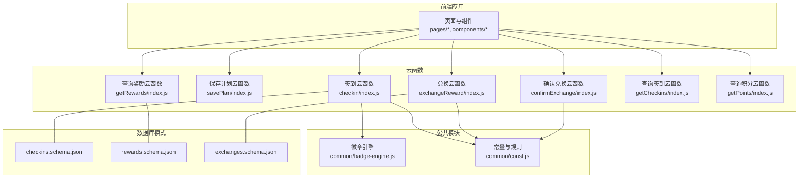
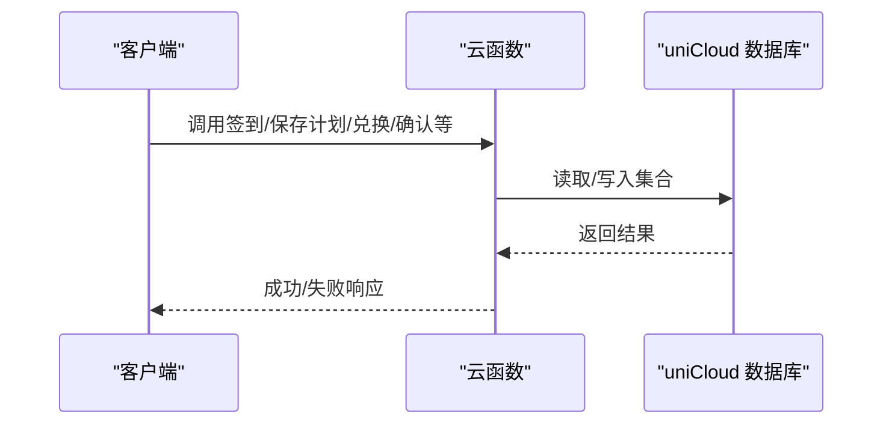
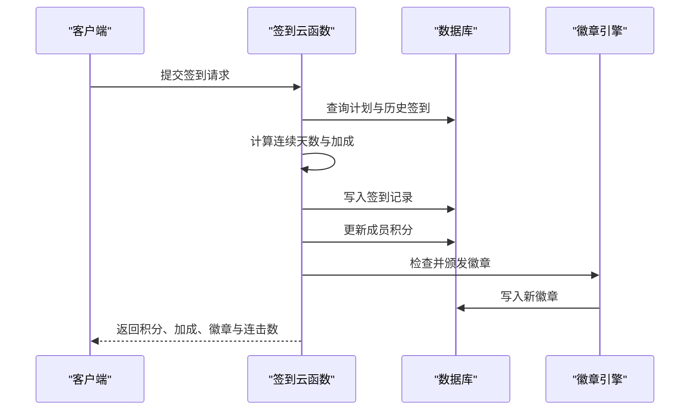
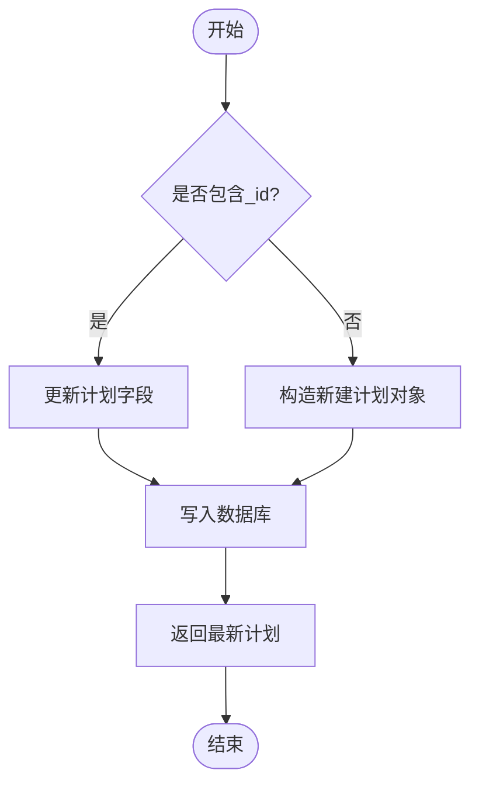
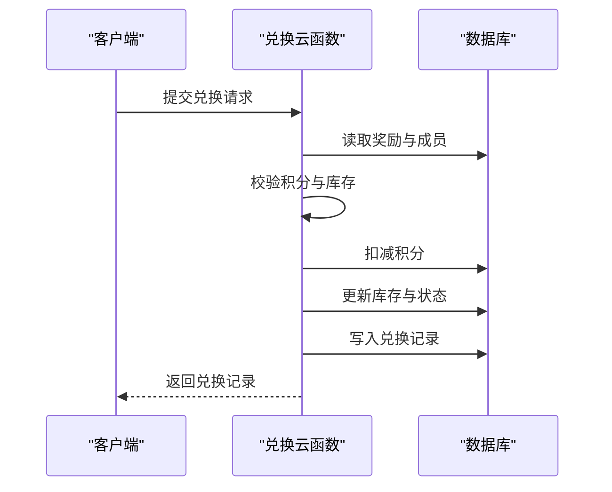
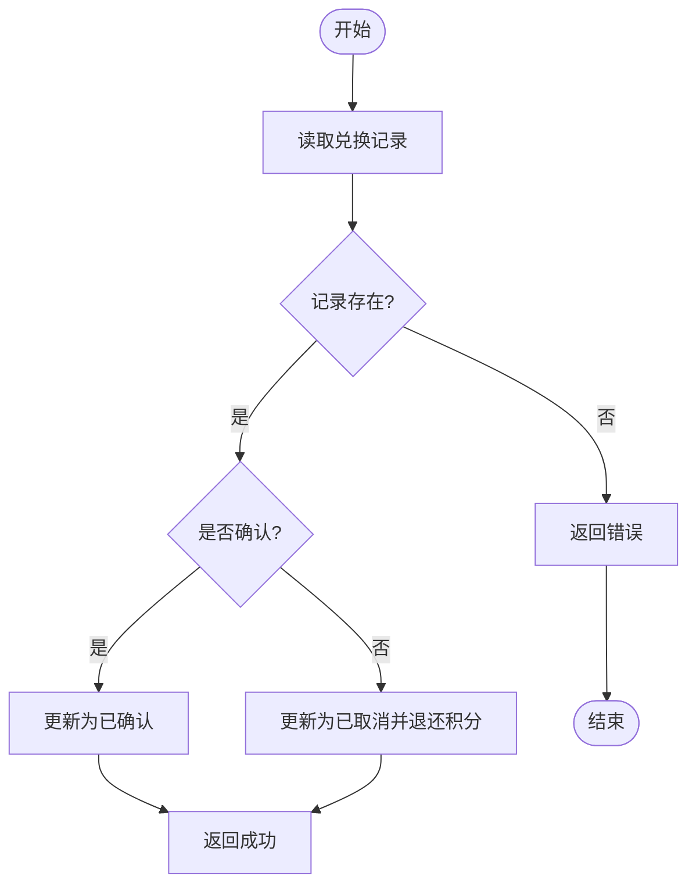
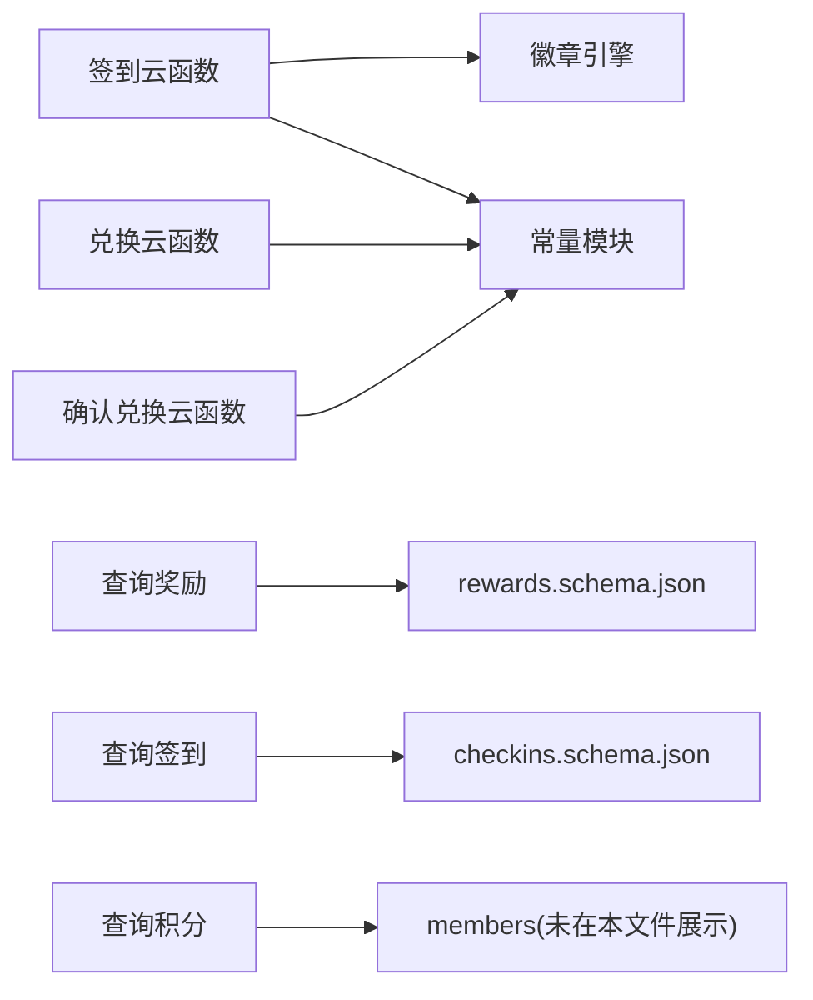
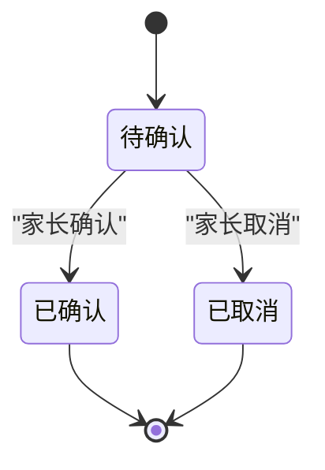

# 业务逻辑云函数

<cite>
**本文引用的文件**
- [src/cloudfunctions/checkin/index.js](file://src/cloudfunctions/checkin/index.js)
- [src/cloudfunctions/exchangeReward/index.js](file://src/cloudfunctions/exchangeReward/index.js)
- [uniCloud-aliyun/cloudfunctions/checkin/index.js](file://uniCloud-aliyun/cloudfunctions/checkin/index.js)
- [uniCloud-aliyun/cloudfunctions/savePlan/index.js](file://uniCloud-aliyun/cloudfunctions/savePlan/index.js)
- [uniCloud-aliyun/cloudfunctions/exchangeReward/index.js](file://uniCloud-aliyun/cloudfunctions/exchangeReward/index.js)
- [uniCloud-aliyun/common/badge-engine.js](file://uniCloud-aliyun/common/badge-engine.js)
- [uniCloud-aliyun/common/const.js](file://uniCloud-aliyun/common/const.js)
- [uniCloud-aliyun/cloudfunctions/getRewards/index.js](file://uniCloud-aliyun/cloudfunctions/getRewards/index.js)
- [uniCloud-aliyun/cloudfunctions/getCheckins/index.js](file://uniCloud-aliyun/cloudfunctions/getCheckins/index.js)
- [uniCloud-aliyun/cloudfunctions/getPoints/index.js](file://uniCloud-aliyun/cloudfunctions/getPoints/index.js)
- [uniCloud-aliyun/cloudfunctions/confirmExchange/index.js](file://uniCloud-aliyun/cloudfunctions/confirmExchange/index.js)
- [uniCloud-aliyun/database/checkins.schema.json](file://uniCloud-aliyun/database/checkins.schema.json)
- [uniCloud-aliyun/database/rewards.schema.json](file://uniCloud-aliyun/database/rewards.schema.json)
- [uniCloud-aliyun/database/exchanges.schema.json](file://uniCloud-aliyun/database/exchanges.schema.json)
</cite>

## 目录
1. [简介](#简介)
2. [项目结构](#项目结构)
3. [核心组件](#核心组件)
4. [架构总览](#架构总览)
5. [详细组件分析](#详细组件分析)
6. [依赖关系分析](#依赖关系分析)
7. [性能考虑](#性能考虑)
8. [故障排查指南](#故障排查指南)
9. [结论](#结论)
10. [附录](#附录)

## 简介
本文件面向“业务逻辑云函数”模块，系统化梳理并解释以下关键业务流程与实现细节：
- 打卡签到：签到校验、连续打卡加成、积分计算、勋章颁发与状态返回
- 计划保存：新建与更新计划，含默认值与状态控制
- 奖励兑换：积分校验、库存管理、兑换记录创建与家长确认/取消流程
- 数据完整性与校验：数据库模式约束、字段类型与必填项
- 事务与回滚：当前实现中的原子性边界与补偿策略
- 状态机设计：签到、兑换记录的状态转换
- 日志与审计：错误捕获与返回信息
- 性能优化：批量处理与异步执行建议
- 测试方法：单元与集成测试要点
- 扩展与定制：可配置规则与能力边界

## 项目结构
该模块由前端 uni-app 应用与后端 uniCloud（阿里云）云函数组成。业务逻辑主要集中在 uniCloud-aliyun 的云函数目录下，配合公共工具与数据库模式定义。

图表来源
- [uniCloud-aliyun/cloudfunctions/checkin/index.js:1-83](file://uniCloud-aliyun/cloudfunctions/checkin/index.js#L1-L83)
- [uniCloud-aliyun/cloudfunctions/savePlan/index.js:1-31](file://uniCloud-aliyun/cloudfunctions/savePlan/index.js#L1-L31)
- [uniCloud-aliyun/cloudfunctions/exchangeReward/index.js:1-53](file://uniCloud-aliyun/cloudfunctions/exchangeReward/index.js#L1-L53)
- [uniCloud-aliyun/cloudfunctions/confirmExchange/index.js:1-34](file://uniCloud-aliyun/cloudfunctions/confirmExchange/index.js#L1-L34)
- [uniCloud-aliyun/cloudfunctions/getRewards/index.js:1-18](file://uniCloud-aliyun/cloudfunctions/getRewards/index.js#L1-L18)
- [uniCloud-aliyun/cloudfunctions/getCheckins/index.js:1-19](file://uniCloud-aliyun/cloudfunctions/getCheckins/index.js#L1-L19)
- [uniCloud-aliyun/cloudfunctions/getPoints/index.js:1-18](file://uniCloud-aliyun/cloudfunctions/getPoints/index.js#L1-L18)
- [uniCloud-aliyun/common/badge-engine.js:1-125](file://uniCloud-aliyun/common/badge-engine.js#L1-L125)
- [uniCloud-aliyun/common/const.js:1-27](file://uniCloud-aliyun/common/const.js#L1-L27)
- [uniCloud-aliyun/database/checkins.schema.json:1-52](file://uniCloud-aliyun/database/checkins.schema.json#L1-L52)
- [uniCloud-aliyun/database/rewards.schema.json:1-53](file://uniCloud-aliyun/database/rewards.schema.json#L1-L53)
- [uniCloud-aliyun/database/exchanges.schema.json:1-56](file://uniCloud-aliyun/database/exchanges.schema.json#L1-L56)

章节来源
- [uniCloud-aliyun/cloudfunctions/checkin/index.js:1-83](file://uniCloud-aliyun/cloudfunctions/checkin/index.js#L1-L83)
- [uniCloud-aliyun/cloudfunctions/savePlan/index.js:1-31](file://uniCloud-aliyun/cloudfunctions/savePlan/index.js#L1-L31)
- [uniCloud-aliyun/cloudfunctions/exchangeReward/index.js:1-53](file://uniCloud-aliyun/cloudfunctions/exchangeReward/index.js#L1-L53)
- [uniCloud-aliyun/cloudfunctions/confirmExchange/index.js:1-34](file://uniCloud-aliyun/cloudfunctions/confirmExchange/index.js#L1-L34)
- [uniCloud-aliyun/cloudfunctions/getRewards/index.js:1-18](file://uniCloud-aliyun/cloudfunctions/getRewards/index.js#L1-L18)
- [uniCloud-aliyun/cloudfunctions/getCheckins/index.js:1-19](file://uniCloud-aliyun/cloudfunctions/getCheckins/index.js#L1-L19)
- [uniCloud-aliyun/cloudfunctions/getPoints/index.js:1-18](file://uniCloud-aliyun/cloudfunctions/getPoints/index.js#L1-L18)
- [uniCloud-aliyun/common/badge-engine.js:1-125](file://uniCloud-aliyun/common/badge-engine.js#L1-L125)
- [uniCloud-aliyun/common/const.js:1-27](file://uniCloud-aliyun/common/const.js#L1-L27)
- [uniCloud-aliyun/database/checkins.schema.json:1-52](file://uniCloud-aliyun/database/checkins.schema.json#L1-L52)
- [uniCloud-aliyun/database/rewards.schema.json:1-53](file://uniCloud-aliyun/database/rewards.schema.json#L1-L53)
- [uniCloud-aliyun/database/exchanges.schema.json:1-56](file://uniCloud-aliyun/database/exchanges.schema.json#L1-L56)

## 核心组件
- 签到云函数：负责签到校验、连续打卡加成计算、积分发放、勋章检查与返回
- 保存计划云函数：支持新建与更新计划，设置默认值与状态
- 兑换云函数：校验积分与库存，创建兑换记录
- 确认兑换云函数：家长确认或取消兑换，必要时进行积分退还
- 查询类云函数：查询奖励、签到、积分等
- 徽章引擎与常量：统一管理连续打卡加成规则与徽章定义
- 数据库模式：定义集合字段类型、必填项与默认值

章节来源
- [uniCloud-aliyun/cloudfunctions/checkin/index.js:1-83](file://uniCloud-aliyun/cloudfunctions/checkin/index.js#L1-L83)
- [uniCloud-aliyun/cloudfunctions/savePlan/index.js:1-31](file://uniCloud-aliyun/cloudfunctions/savePlan/index.js#L1-L31)
- [uniCloud-aliyun/cloudfunctions/exchangeReward/index.js:1-53](file://uniCloud-aliyun/cloudfunctions/exchangeReward/index.js#L1-L53)
- [uniCloud-aliyun/cloudfunctions/confirmExchange/index.js:1-34](file://uniCloud-aliyun/cloudfunctions/confirmExchange/index.js#L1-L34)
- [uniCloud-aliyun/cloudfunctions/getRewards/index.js:1-18](file://uniCloud-aliyun/cloudfunctions/getRewards/index.js#L1-L18)
- [uniCloud-aliyun/cloudfunctions/getCheckins/index.js:1-19](file://uniCloud-aliyun/cloudfunctions/getCheckins/index.js#L1-L19)
- [uniCloud-aliyun/cloudfunctions/getPoints/index.js:1-18](file://uniCloud-aliyun/cloudfunctions/getPoints/index.js#L1-L18)
- [uniCloud-aliyun/common/badge-engine.js:1-125](file://uniCloud-aliyun/common/badge-engine.js#L1-L125)
- [uniCloud-aliyun/common/const.js:1-27](file://uniCloud-aliyun/common/const.js#L1-L27)

## 架构总览
整体采用“前端调用云函数”的架构，云函数通过 uniCloud 数据库接口读写集合，使用公共模块统一业务规则与徽章逻辑。

图表来源
- [uniCloud-aliyun/cloudfunctions/checkin/index.js:1-83](file://uniCloud-aliyun/cloudfunctions/checkin/index.js#L1-L83)
- [uniCloud-aliyun/cloudfunctions/savePlan/index.js:1-31](file://uniCloud-aliyun/cloudfunctions/savePlan/index.js#L1-L31)
- [uniCloud-aliyun/cloudfunctions/exchangeReward/index.js:1-53](file://uniCloud-aliyun/cloudfunctions/exchangeReward/index.js#L1-L53)
- [uniCloud-aliyun/cloudfunctions/confirmExchange/index.js:1-34](file://uniCloud-aliyun/cloudfunctions/confirmExchange/index.js#L1-L34)

## 详细组件分析

### 组件一：签到流程（checkin）
- 输入参数：计划ID、成员ID、日期、打卡人、感受等
- 核心步骤：
  1) 校验计划存在性
  2) 防重复签到（按计划+成员+日期）
  3) 计算基础积分与连续打卡加成
  4) 写入签到记录，包含基础分、加成分、总分
  5) 更新成员积分（当前积分与历史总计）
  6) 触发徽章检查与颁发
- 关键规则：
  - 连续打卡加成：按阈值阶梯累加
  - 徽章：首次打卡、连续天数、自主打卡、一周多分类覆盖、连续写感受等
- 返回数据：本次获得积分、加成类型、当前连击数、新增徽章列表等

图表来源
- [uniCloud-aliyun/cloudfunctions/checkin/index.js:5-82](file://uniCloud-aliyun/cloudfunctions/checkin/index.js#L5-L82)
- [uniCloud-aliyun/common/badge-engine.js:52-122](file://uniCloud-aliyun/common/badge-engine.js#L52-L122)

章节来源
- [uniCloud-aliyun/cloudfunctions/checkin/index.js:1-83](file://uniCloud-aliyun/cloudfunctions/checkin/index.js#L1-L83)
- [uniCloud-aliyun/common/badge-engine.js:1-125](file://uniCloud-aliyun/common/badge-engine.js#L1-L125)
- [uniCloud-aliyun/common/const.js:1-27](file://uniCloud-aliyun/common/const.js#L1-L27)
- [uniCloud-aliyun/database/checkins.schema.json:1-52](file://uniCloud-aliyun/database/checkins.schema.json#L1-L52)

### 组件二：计划保存（savePlan）
- 支持新建与更新两种模式
- 新建时设置默认值（如默认积分、分类、状态、创建时间）
- 更新时仅更新指定字段
- 返回最新计划对象

图表来源
- [uniCloud-aliyun/cloudfunctions/savePlan/index.js:4-30](file://uniCloud-aliyun/cloudfunctions/savePlan/index.js#L4-L30)

章节来源
- [uniCloud-aliyun/cloudfunctions/savePlan/index.js:1-31](file://uniCloud-aliyun/cloudfunctions/savePlan/index.js#L1-L31)

### 组件三：奖励兑换（exchangeReward）
- 输入参数：奖励ID、成员ID、家庭ID
- 核心步骤：
  1) 读取奖励信息与成员积分
  2) 校验积分是否足够
  3) 扣减成员积分
  4) 库存检查与状态更新（若库存为有限值）
  5) 创建兑换记录（初始状态为待确认）
- 返回：兑换记录ID与状态

图表来源
- [uniCloud-aliyun/cloudfunctions/exchangeReward/index.js:4-52](file://uniCloud-aliyun/cloudfunctions/exchangeReward/index.js#L4-L52)

章节来源
- [uniCloud-aliyun/cloudfunctions/exchangeReward/index.js:1-53](file://uniCloud-aliyun/cloudfunctions/exchangeReward/index.js#L1-L53)
- [uniCloud-aliyun/database/rewards.schema.json:1-53](file://uniCloud-aliyun/database/rewards.schema.json#L1-L53)
- [uniCloud-aliyun/database/exchanges.schema.json:1-56](file://uniCloud-aliyun/database/exchanges.schema.json#L1-L56)

### 组件四：确认兑换（confirmExchange）
- 输入参数：兑换ID、是否确认、家长备注
- 核心步骤：
  1) 读取兑换记录
  2) 若确认：更新状态为已确认并记录确认时间
  3) 若取消：更新状态为已取消并退还积分
- 返回：操作成功

图表来源
- [uniCloud-aliyun/cloudfunctions/confirmExchange/index.js:4-33](file://uniCloud-aliyun/cloudfunctions/confirmExchange/index.js#L4-L33)

章节来源
- [uniCloud-aliyun/cloudfunctions/confirmExchange/index.js:1-34](file://uniCloud-aliyun/cloudfunctions/confirmExchange/index.js#L1-L34)

### 组件五：查询类云函数
- 查询奖励：按家庭过滤，按创建时间倒序
- 查询签到：按成员、日期或周起始日期过滤
- 查询积分：返回当前积分与历史总计

章节来源
- [uniCloud-aliyun/cloudfunctions/getRewards/index.js:1-18](file://uniCloud-aliyun/cloudfunctions/getRewards/index.js#L1-L18)
- [uniCloud-aliyun/cloudfunctions/getCheckins/index.js:1-19](file://uniCloud-aliyun/cloudfunctions/getCheckins/index.js#L1-L19)
- [uniCloud-aliyun/cloudfunctions/getPoints/index.js:1-18](file://uniCloud-aliyun/cloudfunctions/getPoints/index.js#L1-L18)

### 组件六：徽章引擎与常量
- 连续打卡加成规则集中定义
- 徽章定义与颁发逻辑封装
- 提供通用的连续天数计算、加成查询与徽章检查能力

章节来源
- [uniCloud-aliyun/common/badge-engine.js:1-125](file://uniCloud-aliyun/common/badge-engine.js#L1-L125)
- [uniCloud-aliyun/common/const.js:1-27](file://uniCloud-aliyun/common/const.js#L1-L27)

## 依赖关系分析
- 签到云函数依赖徽章引擎与常量模块，确保规则一致性
- 兑换云函数依赖常量模块以复用徽章与规则定义
- 查询类云函数作为数据访问层，不直接参与业务规则
- 数据库模式为各集合提供字段级约束与默认值

图表来源
- [uniCloud-aliyun/cloudfunctions/checkin/index.js:1-83](file://uniCloud-aliyun/cloudfunctions/checkin/index.js#L1-L83)
- [uniCloud-aliyun/cloudfunctions/exchangeReward/index.js:1-53](file://uniCloud-aliyun/cloudfunctions/exchangeReward/index.js#L1-L53)
- [uniCloud-aliyun/cloudfunctions/confirmExchange/index.js:1-34](file://uniCloud-aliyun/cloudfunctions/confirmExchange/index.js#L1-L34)
- [uniCloud-aliyun/common/badge-engine.js:1-125](file://uniCloud-aliyun/common/badge-engine.js#L1-L125)
- [uniCloud-aliyun/common/const.js:1-27](file://uniCloud-aliyun/common/const.js#L1-L27)
- [uniCloud-aliyun/database/checkins.schema.json:1-52](file://uniCloud-aliyun/database/checkins.schema.json#L1-L52)
- [uniCloud-aliyun/database/rewards.schema.json:1-53](file://uniCloud-aliyun/database/rewards.schema.json#L1-L53)
- [uniCloud-aliyun/database/exchanges.schema.json:1-56](file://uniCloud-aliyun/database/exchanges.schema.json#L1-L56)

## 性能考虑
- 批量处理建议
  - 多个签到或兑换操作可合并为批量写入，减少网络往返
  - 对高频查询（如周维度签到统计）可引入聚合索引或预聚合视图
- 异步执行
  - 将非关键路径（如通知、报表生成）改为异步触发，避免阻塞主流程
- 索引与查询优化
  - 在查询条件常用字段上建立索引（如 child_id、date、plan_id、family_id）
- 缓存策略
  - 对静态配置（如常量、徽章定义）进行本地缓存，降低重复读取成本

## 故障排查指南
- 常见错误与定位
  - 签到重复：检查按计划+成员+日期的唯一性约束与去重逻辑
  - 积分不足：核对成员当前积分与奖励所需积分，确认兑换前后的扣减顺序
  - 兑换取消未退分：确认取消分支是否执行了积分退还更新
- 日志与审计
  - 使用云函数返回体记录关键信息，便于前端与运营审计
  - 对异常进行统一捕获并返回标准化错误信息
- 补偿机制
  - 兑换取消时必须执行积分退还
  - 徽章颁发应幂等，避免重复颁发

章节来源
- [uniCloud-aliyun/cloudfunctions/checkin/index.js:15-82](file://uniCloud-aliyun/cloudfunctions/checkin/index.js#L15-L82)
- [uniCloud-aliyun/cloudfunctions/exchangeReward/index.js:20-35](file://uniCloud-aliyun/cloudfunctions/exchangeReward/index.js#L20-L35)
- [uniCloud-aliyun/cloudfunctions/confirmExchange/index.js:21-30](file://uniCloud-aliyun/cloudfunctions/confirmExchange/index.js#L21-L30)

## 结论
本模块围绕“签到—积分—徽章—兑换—确认”的闭环构建，规则集中于公共模块，云函数职责清晰。当前实现具备良好的可扩展性，可通过调整常量与模式进一步增强业务灵活性；同时建议在高并发场景下引入批量与异步策略以提升性能与稳定性。

## 附录

### 数据模型与约束
- 签到集合字段与约束
  - 必填字段：计划ID、成员ID、日期
  - 关键字段：获得积分、加成积分、加成类型、打卡人、感受、创建时间
- 奖励集合字段与约束
  - 必填字段：标题、积分消耗、分类
  - 关键字段：状态、库存、家庭ID、创建时间
- 兑换集合字段与约束
  - 必填字段：奖励ID、奖励标题、成员ID、消耗积分
  - 关键字段：状态、家长备注、确认时间、创建时间

章节来源
- [uniCloud-aliyun/database/checkins.schema.json:1-52](file://uniCloud-aliyun/database/checkins.schema.json#L1-L52)
- [uniCloud-aliyun/database/rewards.schema.json:1-53](file://uniCloud-aliyun/database/rewards.schema.json#L1-L53)
- [uniCloud-aliyun/database/exchanges.schema.json:1-56](file://uniCloud-aliyun/database/exchanges.schema.json#L1-L56)

### 状态机设计与转换
- 兑换记录状态机
  - 初始：待确认（pending）
  - 确认：已确认（confirmed），记录确认时间
  - 取消：已取消（cancelled），执行积分退还

图表来源
- [uniCloud-aliyun/cloudfunctions/confirmExchange/index.js:15-30](file://uniCloud-aliyun/cloudfunctions/confirmExchange/index.js#L15-L30)
- [uniCloud-aliyun/database/exchanges.schema.json:38-40](file://uniCloud-aliyun/database/exchanges.schema.json#L38-L40)

### 业务规则与校验清单
- 签到
  - 防重复：同一计划+成员+日期不可重复
  - 加成：按连续天数阶梯计算
  - 徽章：多类徽章触发条件明确
- 兑换
  - 积分校验：当前积分需≥奖励所需积分
  - 库存校验：有限库存时需递减并维护状态
  - 记录创建：包含奖励标题、图标、家庭ID等

章节来源
- [uniCloud-aliyun/cloudfunctions/checkin/index.js:14-62](file://uniCloud-aliyun/cloudfunctions/checkin/index.js#L14-L62)
- [uniCloud-aliyun/cloudfunctions/exchangeReward/index.js:20-49](file://uniCloud-aliyun/cloudfunctions/exchangeReward/index.js#L20-L49)
- [uniCloud-aliyun/common/badge-engine.js:52-122](file://uniCloud-aliyun/common/badge-engine.js#L52-L122)

### 单元与集成测试方法
- 单元测试
  - 对签到加成计算、徽章检查、库存与积分校验分别编写独立测试用例
  - 使用模拟数据库接口验证边界条件（如零库存、负积分、空输入）
- 集成测试
  - 覆盖完整流程：签到→积分更新→徽章颁发；兑换→扣分→库存更新→记录创建；确认/取消→状态变更与积分回退
  - 并发场景：模拟重复签到、同时兑换等竞争条件，验证幂等性与一致性

### 扩展与定制化指南
- 规则定制
  - 通过常量模块调整连续天数阈值与加成分值
  - 新增徽章类型：在常量与徽章引擎中补充定义与触发条件
- 功能扩展
  - 增加批量签到/兑换接口，结合异步任务处理
  - 引入缓存与索引优化高频查询
- 数据隔离
  - 通过家庭ID与白名单机制实现多用户隔离与权限控制