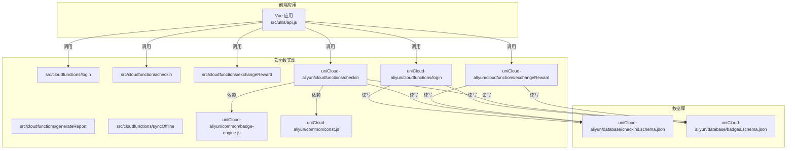
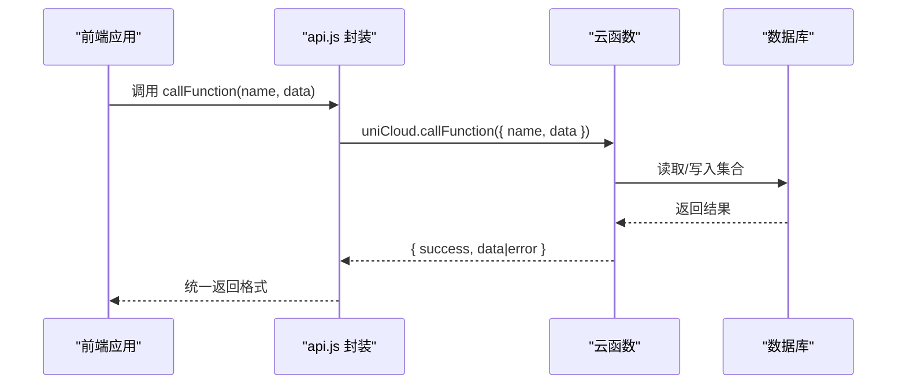
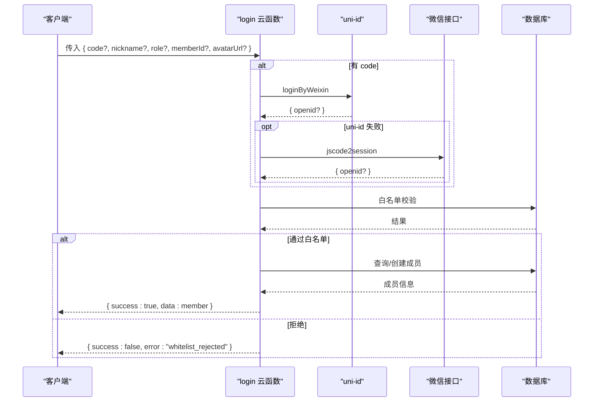
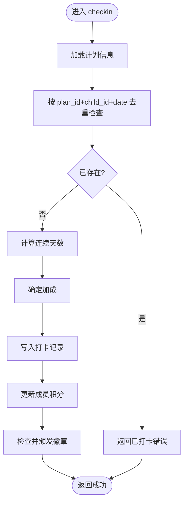
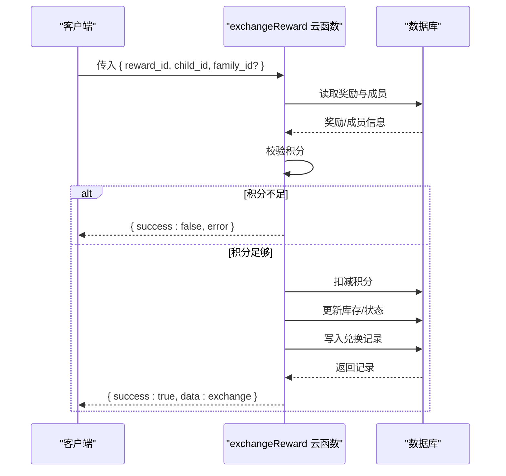
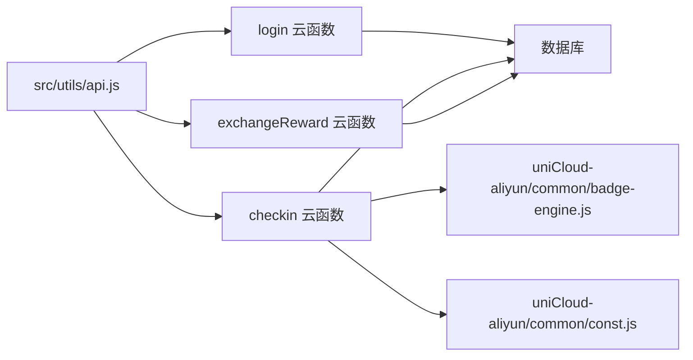

# 云函数服务

<cite>
**本文引用的文件**
- [src/cloudfunctions/login/index.js](file://src/cloudfunctions/login/index.js)
- [src/cloudfunctions/checkin/index.js](file://src/cloudfunctions/checkin/index.js)
- [src/cloudfunctions/exchangeReward/index.js](file://src/cloudfunctions/exchangeReward/index.js)
- [src/cloudfunctions/generateReport/index.js](file://src/cloudfunctions/generateReport/index.js)
- [src/cloudfunctions/syncOffline/index.js](file://src/cloudfunctions/syncOffline/index.js)
- [uniCloud-aliyun/cloudfunctions/login/index.js](file://uniCloud-aliyun/cloudfunctions/login/index.js)
- [uniCloud-aliyun/cloudfunctions/checkin/index.js](file://uniCloud-aliyun/cloudfunctions/checkin/index.js)
- [uniCloud-aliyun/cloudfunctions/exchangeReward/index.js](file://uniCloud-aliyun/cloudfunctions/exchangeReward/index.js)
- [uniCloud-aliyun/common/badge-engine.js](file://uniCloud-aliyun/common/badge-engine.js)
- [uniCloud-aliyun/common/const.js](file://uniCloud-aliyun/common/const.js)
- [uniCloud-aliyun/database/badges.schema.json](file://uniCloud-aliyun/database/badges.schema.json)
- [uniCloud-aliyun/database/checkins.schema.json](file://uniCloud-aliyun/database/checkins.schema.json)
- [src/utils/api.js](file://src/utils/api.js)
- [package.json](file://package.json)
</cite>

## 目录
1. [简介](#简介)
2. [项目结构](#项目结构)
3. [核心组件](#核心组件)
4. [架构总览](#架构总览)
5. [详细组件分析](#详细组件分析)
6. [依赖分析](#依赖分析)
7. [性能考虑](#性能考虑)
8. [故障排查指南](#故障排查指南)
9. [结论](#结论)
10. [附录](#附录)

## 简介
本文件为 Star Grow 云函数服务的全面技术文档，面向希望理解与扩展该系统的开发者。内容涵盖 uniCloud 云开发服务的架构与使用方式，云函数的设计原则与最佳实践（请求处理流程、错误处理机制、安全考虑），以及登录认证、打卡处理、积分查询、奖励兑换等核心业务逻辑的实现要点。同时提供部署配置、调试方法、前后端交互协议、性能优化策略、并发处理机制、安全策略与权限控制、监控与日志分析方法。

## 项目结构
项目采用“前端工程 + 两套云函数实现”的组织方式：
- src/cloudfunctions：示例/占位型云函数（注释完整，便于理解业务流程）
- uniCloud-aliyun/cloudfunctions：基于 uniCloud 的真实实现（含鉴权、积分、勋章、兑换等完整逻辑）
- uniCloud-aliyun/common：通用工具与常量（徽章引擎、常量定义）
- uniCloud-aliyun/database：数据库 Schema 定义（集合权限与字段约束）
- src/utils/api.js：前端统一调用云函数的封装
- package.json：构建脚本与多端运行配置

图表来源
- [src/cloudfunctions/login/index.js:1-13](file://src/cloudfunctions/login/index.js#L1-L13)
- [src/cloudfunctions/checkin/index.js:1-142](file://src/cloudfunctions/checkin/index.js#L1-L142)
- [src/cloudfunctions/exchangeReward/index.js:1-28](file://src/cloudfunctions/exchangeReward/index.js#L1-L28)
- [src/cloudfunctions/generateReport/index.js:1-33](file://src/cloudfunctions/generateReport/index.js#L1-L33)
- [src/cloudfunctions/syncOffline/index.js:1-20](file://src/cloudfunctions/syncOffline/index.js#L1-L20)
- [uniCloud-aliyun/cloudfunctions/login/index.js:1-103](file://uniCloud-aliyun/cloudfunctions/login/index.js#L1-L103)
- [uniCloud-aliyun/cloudfunctions/checkin/index.js:1-83](file://uniCloud-aliyun/cloudfunctions/checkin/index.js#L1-L83)
- [uniCloud-aliyun/cloudfunctions/exchangeReward/index.js:1-53](file://uniCloud-aliyun/cloudfunctions/exchangeReward/index.js#L1-L53)
- [uniCloud-aliyun/common/badge-engine.js:1-125](file://uniCloud-aliyun/common/badge-engine.js#L1-L125)
- [uniCloud-aliyun/common/const.js:1-27](file://uniCloud-aliyun/common/const.js#L1-L27)
- [uniCloud-aliyun/database/checkins.schema.json:1-52](file://uniCloud-aliyun/database/checkins.schema.json#L1-L52)
- [uniCloud-aliyun/database/badges.schema.json:1-40](file://uniCloud-aliyun/database/badges.schema.json#L1-L40)

章节来源
- [package.json:1-74](file://package.json#L1-L74)

## 核心组件
- 登录认证云函数：负责微信登录换取 openid、白名单校验、成员查询/创建与返回
- 打卡处理云函数：校验计划、去重、计算积分与加成、更新成员积分、颁发徽章
- 奖励兑换云函数：校验积分、扣减积分、库存管理、创建兑换记录
- 报表生成云函数：汇总周数据、统计完成率、匹配家长指导建议
- 离线同步云函数：批量导入离线打卡，幂等处理与冲突检测
- 前端调用封装：统一的云函数调用封装，集中错误处理与返回格式化

章节来源
- [src/cloudfunctions/login/index.js:1-13](file://src/cloudfunctions/login/index.js#L1-L13)
- [src/cloudfunctions/checkin/index.js:1-142](file://src/cloudfunctions/checkin/index.js#L1-L142)
- [src/cloudfunctions/exchangeReward/index.js:1-28](file://src/cloudfunctions/exchangeReward/index.js#L1-L28)
- [src/cloudfunctions/generateReport/index.js:1-33](file://src/cloudfunctions/generateReport/index.js#L1-L33)
- [src/cloudfunctions/syncOffline/index.js:1-20](file://src/cloudfunctions/syncOffline/index.js#L1-L20)
- [src/utils/api.js:1-18](file://src/utils/api.js#L1-L18)

## 架构总览
系统采用“前端通过 uniCloud.callFunction 调用云函数”的典型架构。uniCloud-aliyun 版本提供了完整的鉴权、积分、徽章与兑换逻辑；src 示例版本以注释形式展示流程，便于快速理解业务。

图表来源
- [src/utils/api.js:1-18](file://src/utils/api.js#L1-L18)
- [uniCloud-aliyun/cloudfunctions/login/index.js:1-103](file://uniCloud-aliyun/cloudfunctions/login/index.js#L1-L103)
- [uniCloud-aliyun/cloudfunctions/checkin/index.js:1-83](file://uniCloud-aliyun/cloudfunctions/checkin/index.js#L1-L83)
- [uniCloud-aliyun/cloudfunctions/exchangeReward/index.js:1-53](file://uniCloud-aliyun/cloudfunctions/exchangeReward/index.js#L1-L53)

## 详细组件分析

### 登录认证（login）
- 设计原则
  - 支持微信小程序登录与降级方案（jscode2session）
  - 白名单校验，拒绝未授权 openId
  - 成员查询/创建，自动填充家庭标识，保障数据隔离
- 请求参数
  - code（可选）：用于换取 openid
  - nickname、role、memberId、avatarUrl（可选）：用于更新或创建成员信息
- 处理流程
  - 若传入 code：优先调用 uni-id 登录；若失败则回退到微信官方接口
  - 白名单校验：若 openId 不在白名单则拒绝
  - 查询/创建成员：根据 openId 或 memberId 获取或新建成员
- 错误处理
  - 微信登录失败、白名单拒绝、成员操作异常均返回统一错误结构
- 安全考虑
  - 严格白名单控制
  - openId 作为关键标识，避免泄露
  - 家庭隔离：基于 openId 后缀生成 family_id

图表来源
- [uniCloud-aliyun/cloudfunctions/login/index.js:1-103](file://uniCloud-aliyun/cloudfunctions/login/index.js#L1-L103)
- [uniCloud-aliyun/common/const.js:19-24](file://uniCloud-aliyun/common/const.js#L19-L24)

章节来源
- [uniCloud-aliyun/cloudfunctions/login/index.js:1-103](file://uniCloud-aliyun/cloudfunctions/login/index.js#L1-L103)
- [uniCloud-aliyun/common/const.js:1-27](file://uniCloud-aliyun/common/const.js#L1-L27)

### 打卡处理（checkin）
- 设计原则
  - 幂等性：按 plan_id + child_id + date 去重
  - 积分计算：基础分 + 连续打卡加成
  - 勋章颁发：首签、连续签、自签、感受记录、全类别等
- 请求参数
  - plan_id、child_id、date、checked_by（self/parent）、feeling（可选）
- 处理流程
  - 校验计划存在性
  - 按日期去重检查
  - 计算连续天数与加成
  - 写入打卡记录，更新成员积分
  - 颁发符合条件的新徽章
- 错误处理
  - 已打卡、数据库异常等场景返回统一错误结构
- 性能与并发
  - 建议对去重查询与积分更新使用原子操作
  - 连续天数计算限制窗口大小，避免全量扫描

图表来源
- [src/cloudfunctions/checkin/index.js:1-142](file://src/cloudfunctions/checkin/index.js#L1-L142)
- [uniCloud-aliyun/cloudfunctions/checkin/index.js:1-83](file://uniCloud-aliyun/cloudfunctions/checkin/index.js#L1-L83)
- [uniCloud-aliyun/common/badge-engine.js:1-125](file://uniCloud-aliyun/common/badge-engine.js#L1-L125)

章节来源
- [src/cloudfunctions/checkin/index.js:1-142](file://src/cloudfunctions/checkin/index.js#L1-L142)
- [uniCloud-aliyun/cloudfunctions/checkin/index.js:1-83](file://uniCloud-aliyun/cloudfunctions/checkin/index.js#L1-L83)
- [uniCloud-aliyun/common/badge-engine.js:1-125](file://uniCloud-aliyun/common/badge-engine.js#L1-L125)

### 奖励兑换（exchangeReward）
- 设计原则
  - 积分校验与扣减
  - 库存管理（-1 表示无限，0 时归档）
  - 创建兑换记录（初始状态 pending）
- 请求参数
  - reward_id、child_id、family_id（可选）
- 处理流程
  - 读取奖励与成员信息
  - 校验积分是否足够
  - 扣减积分
  - 更新库存与状态
  - 写入兑换记录
- 错误处理
  - 奖励不存在、积分不足、数据库异常等

图表来源
- [uniCloud-aliyun/cloudfunctions/exchangeReward/index.js:1-53](file://uniCloud-aliyun/cloudfunctions/exchangeReward/index.js#L1-L53)

章节来源
- [src/cloudfunctions/exchangeReward/index.js:1-28](file://src/cloudfunctions/exchangeReward/index.js#L1-L28)
- [uniCloud-aliyun/cloudfunctions/exchangeReward/index.js:1-53](file://uniCloud-aliyun/cloudfunctions/exchangeReward/index.js#L1-L53)

### 报表生成（generateReport）
- 设计原则
  - 汇总本周打卡、统计完成率与积分
  - 分类完成率与解锁徽章
  - 匹配家长指导建议（按周数）
- 请求参数
  - child_id、week_start（YYYY-MM-DD）
- 处理流程
  - 获取本周打卡与计划
  - 统计指标与分类分布
  - 获取本周解锁徽章
  - 匹配家长指导建议
- 当前实现
  - 示例版本返回固定模板数据，真实版本应按上述流程完善

章节来源
- [src/cloudfunctions/generateReport/index.js:1-33](file://src/cloudfunctions/generateReport/index.js#L1-L33)

### 离线同步（syncOffline）
- 设计原则
  - 批量导入离线打卡，逐条幂等处理
  - 冲突检测（已存在则跳过）
  - 统计同步数量、失败与冲突
- 请求参数
  - child_id、checkins（数组，每项含 plan_id、date、feeling、checked_by）
- 处理流程
  - 遍历 checkins，查重、写入、积分与徽章处理
  - 返回统计结果

章节来源
- [src/cloudfunctions/syncOffline/index.js:1-20](file://src/cloudfunctions/syncOffline/index.js#L1-L20)

### 勋章系统与常量（badge-engine、const）
- 常量定义
  - 连续打卡加成规则
  - 勋章定义（标题、图标、描述）
  - 白名单校验工具
- 勋章引擎
  - 计算连续天数
  - 计算加成
  - 检查并颁发多种徽章（首签、连续、自签、感受记录、全类别等）

章节来源
- [uniCloud-aliyun/common/const.js:1-27](file://uniCloud-aliyun/common/const.js#L1-L27)
- [uniCloud-aliyun/common/badge-engine.js:1-125](file://uniCloud-aliyun/common/badge-engine.js#L1-L125)

### 数据模型与权限
- checkins 集合
  - 字段：plan_id、child_id、date、checked_by、feeling、points_earned、bonus_points、bonus_type、created_at
  - 权限：读写删改均允许
- badges 集合
  - 字段：child_id、badge_type、title、icon、desc、unlocked_at
  - 权限：读允许，创建允许，更新/删除不允许

章节来源
- [uniCloud-aliyun/database/checkins.schema.json:1-52](file://uniCloud-aliyun/database/checkins.schema.json#L1-L52)
- [uniCloud-aliyun/database/badges.schema.json:1-40](file://uniCloud-aliyun/database/badges.schema.json#L1-L40)

## 依赖分析
- 前端依赖
  - 使用 uniCloud.callFunction 统一调用云函数
  - 通过 api.js 封装进行错误处理与返回格式化
- 云函数依赖
  - uniCloud 数据库命令（如 inc、gte、lte 等）
  - badge-engine 与 const 提供复用逻辑与常量
  - 数据库 Schema 约束集合字段与权限

图表来源
- [src/utils/api.js:1-18](file://src/utils/api.js#L1-L18)
- [uniCloud-aliyun/cloudfunctions/checkin/index.js:1-83](file://uniCloud-aliyun/cloudfunctions/checkin/index.js#L1-L83)
- [uniCloud-aliyun/common/badge-engine.js:1-125](file://uniCloud-aliyun/common/badge-engine.js#L1-L125)
- [uniCloud-aliyun/common/const.js:1-27](file://uniCloud-aliyun/common/const.js#L1-L27)

章节来源
- [src/utils/api.js:1-18](file://src/utils/api.js#L1-L18)
- [uniCloud-aliyun/cloudfunctions/checkin/index.js:1-83](file://uniCloud-aliyun/cloudfunctions/checkin/index.js#L1-L83)
- [uniCloud-aliyun/common/badge-engine.js:1-125](file://uniCloud-aliyun/common/badge-engine.js#L1-L125)
- [uniCloud-aliyun/common/const.js:1-27](file://uniCloud-aliyun/common/const.js#L1-L27)

## 性能考虑
- 数据访问
  - 对 checkins 的去重查询与积分更新尽量使用索引字段（plan_id、child_id、date）
  - 连续天数计算限制查询窗口，避免全表扫描
- 并发与一致性
  - 使用数据库原子更新（如 inc）减少竞态
  - 批量导入时逐条幂等处理，必要时引入分布式锁或队列
- 资源与成本
  - 合理设置云函数超时与内存上限
  - 减少不必要的数据库往返与循环内查询
- 缓存策略
  - 对热点数据（如徽章定义、加成规则）可在云函数层缓存

## 故障排查指南
- 常见问题
  - 微信登录失败：检查 code 是否过期、回调地址配置、uni-id 配置或回退的 jscode2session 参数
  - 白名单拒绝：确认 whitelist 集合中是否存在对应 openId
  - 已打卡重复：确认去重条件与日期格式
  - 积分不足：核对成员 current_points 与奖励 cost
  - 勋章未颁发：检查连续天数计算边界与徽章类型映射
- 日志与监控
  - 在云函数中记录关键路径日志（输入参数、中间结果、异常堆栈）
  - 使用 uniCloud 控制台查看云函数执行日志与耗时
  - 对高频接口增加埋点与告警

章节来源
- [uniCloud-aliyun/cloudfunctions/login/index.js:1-103](file://uniCloud-aliyun/cloudfunctions/login/index.js#L1-L103)
- [uniCloud-aliyun/cloudfunctions/checkin/index.js:1-83](file://uniCloud-aliyun/cloudfunctions/checkin/index.js#L1-L83)
- [uniCloud-aliyun/cloudfunctions/exchangeReward/index.js:1-53](file://uniCloud-aliyun/cloudfunctions/exchangeReward/index.js#L1-L53)

## 结论
本项目通过清晰的云函数职责划分与统一的前端调用封装，实现了从登录、打卡、积分、徽章到奖励兑换的完整闭环。uniCloud-aliyun 版本提供了生产可用的完整实现，而 src 示例版本则便于快速理解业务流程。建议在实际部署中结合数据库索引、原子操作与合理的缓存策略提升性能，并通过完善的日志与监控体系保障稳定性。

## 附录
- 部署与调试
  - 使用 uni-app 开发工具进行本地预览与云端部署
  - 通过 uniCloud 控制台查看云函数日志、触发器与环境变量
- 前后端交互协议
  - 前端统一通过 api.js 调用 uniCloud.callFunction
  - 云函数返回统一结构：{ success: boolean, data|error }
- 安全与权限
  - 白名单控制 openId
  - 勋章与兑换仅在满足条件时更新
  - 数据库 Schema 明确字段与权限，避免越权