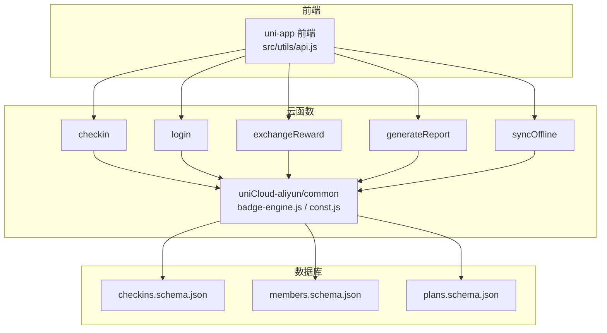
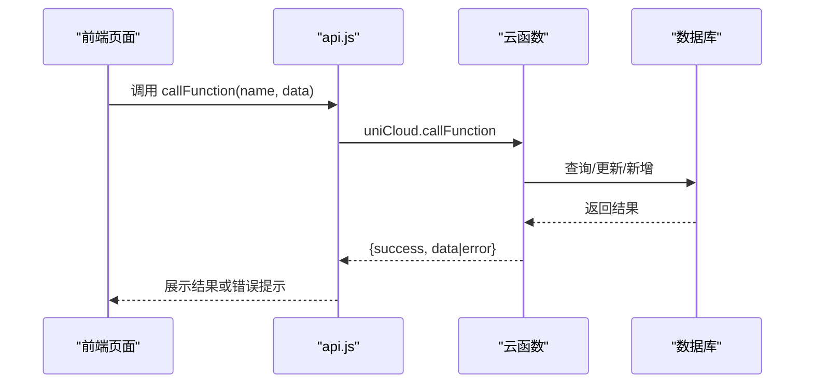
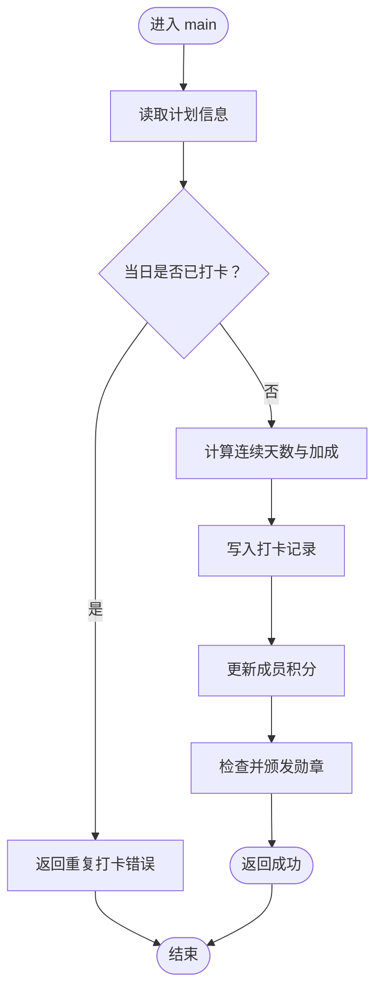
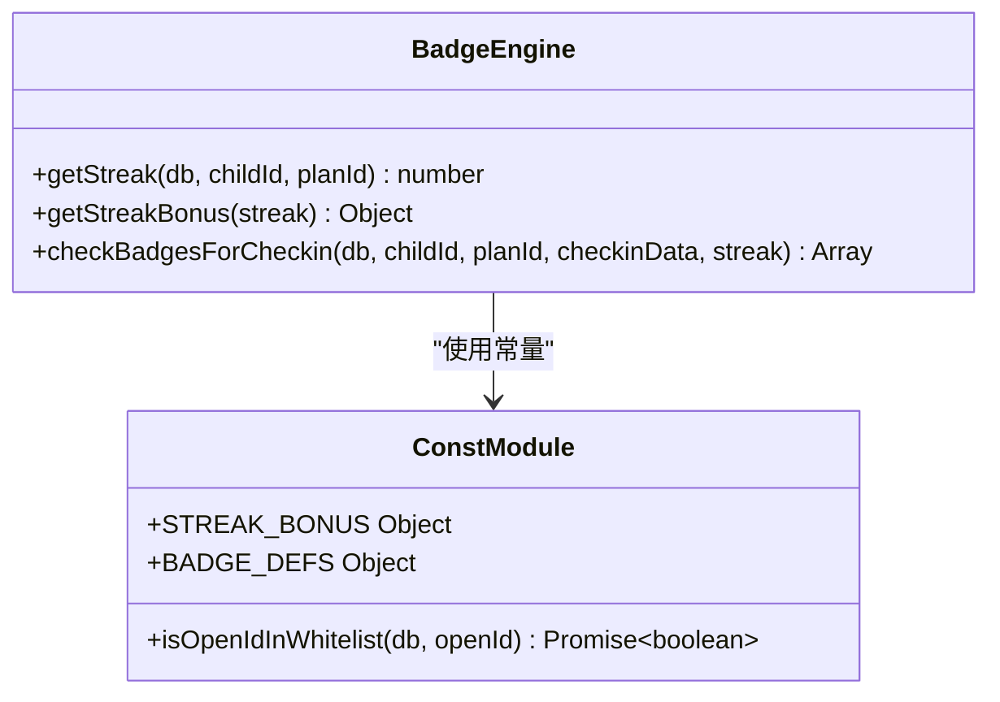
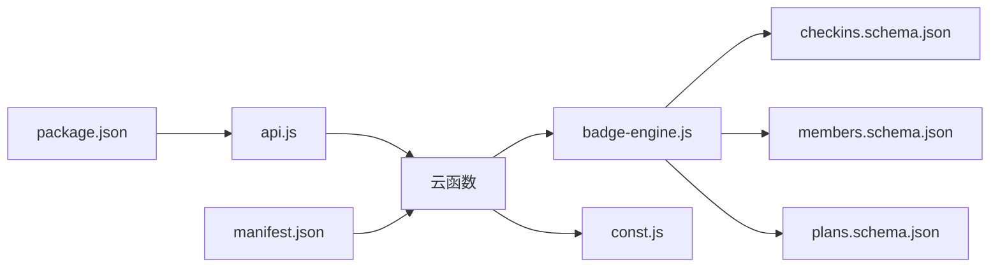

# 云函数架构设计

<cite>
**本文引用的文件**
- [checkin/index.js](file://src/cloudfunctions/checkin/index.js)
- [login/index.js](file://src/cloudfunctions/login/index.js)
- [exchangeReward/index.js](file://src/cloudfunctions/exchangeReward/index.js)
- [generateReport/index.js](file://src/cloudfunctions/generateReport/index.js)
- [syncOffline/index.js](file://src/cloudfunctions/syncOffline/index.js)
- [api.js](file://src/utils/api.js)
- [badge-engine.js](file://uniCloud-aliyun/common/badge-engine.js)
- [const.js](file://uniCloud-aliyun/common/const.js)
- [checkins.schema.json](file://uniCloud-aliyun/database/checkins.schema.json)
- [members.schema.json](file://uniCloud-aliyun/database/members.schema.json)
- [plans.schema.json](file://uniCloud-aliyun/database/plans.schema.json)
- [manifest.json](file://src/manifest.json)
- [package.json](file://package.json)
</cite>

## 目录
1. [简介](#简介)
2. [项目结构](#项目结构)
3. [核心组件](#核心组件)
4. [架构总览](#架构总览)
5. [详细组件分析](#详细组件分析)
6. [依赖关系分析](#依赖关系分析)
7. [性能考虑](#性能考虑)
8. [故障排查指南](#故障排查指南)
9. [结论](#结论)
10. [附录](#附录)

## 简介
本文件面向uniCloud云开发的整体架构与云函数设计，结合仓库中的实际实现，系统阐述以下主题：
- 云函数生命周期与内存管理、并发处理机制
- 与数据库的连接池管理、事务处理与索引优化策略
- 错误处理、重试与降级方案
- 性能监控指标与调优方法
- 安全架构（身份认证、权限控制、数据加密）
- 部署架构与负载均衡策略
- 与前端的通信协议与数据传输格式
- 调试工具与开发环境配置

## 项目结构
该项目采用“前端 + 云函数 + 数据库Schema”的分层组织方式：
- 前端工程位于 src/，通过 uniCloud.callFunction 统一调用云函数
- 云函数位于 src/cloudfunctions 与 uniCloud-aliyun/cloudfunctions，前者为示例/占位实现，后者为阿里云uniCloud的完整实现（含公共模块与数据库Schema）
- 数据库Schema位于 uniCloud-aliyun/database，用于约束字段、权限与默认值
- 配置文件包括 manifest.json（uniCloud厂商与应用标识）、package.json（构建脚本）

图表来源
- [api.js:1-18](file://src/utils/api.js#L1-L18)
- [checkin/index.js:1-142](file://src/cloudfunctions/checkin/index.js#L1-L142)
- [login/index.js:1-13](file://src/cloudfunctions/login/index.js#L1-L13)
- [exchangeReward/index.js:1-28](file://src/cloudfunctions/exchangeReward/index.js#L1-L28)
- [generateReport/index.js:1-33](file://src/cloudfunctions/generateReport/index.js#L1-L33)
- [syncOffline/index.js:1-20](file://src/cloudfunctions/syncOffline/index.js#L1-L20)
- [badge-engine.js:1-125](file://uniCloud-aliyun/common/badge-engine.js#L1-L125)
- [const.js:1-27](file://uniCloud-aliyun/common/const.js#L1-L27)
- [checkins.schema.json:1-52](file://uniCloud-aliyun/database/checkins.schema.json#L1-L52)
- [members.schema.json:1-46](file://uniCloud-aliyun/database/members.schema.json#L1-L46)
- [plans.schema.json:1-50](file://uniCloud-aliyun/database/plans.schema.json#L1-L50)

章节来源
- [manifest.json:72-75](file://src/manifest.json#L72-L75)
- [package.json:1-74](file://package.json#L1-L74)

## 核心组件
- 云函数层：提供业务能力封装，统一返回 { success, data|error } 结构；部分函数为占位实现，后续可替换为真实数据库操作
- 公共模块层：在 uniCloud-aliyun/common 中集中复用勋章引擎与常量定义，降低重复逻辑
- 数据层：通过 JSON Schema 定义集合字段、权限与默认值，保障数据一致性与安全边界
- 前端调用层：通过 utils/api.js 统一封装 uniCloud.callFunction 调用，便于错误捕获与统一返回

章节来源
- [checkin/index.js:12-83](file://src/cloudfunctions/checkin/index.js#L12-L83)
- [login/index.js:4-12](file://src/cloudfunctions/login/index.js#L4-L12)
- [exchangeReward/index.js:4-19](file://src/cloudfunctions/exchangeReward/index.js#L4-L19)
- [generateReport/index.js:4-32](file://src/cloudfunctions/generateReport/index.js#L4-L32)
- [syncOffline/index.js:4-19](file://src/cloudfunctions/syncOffline/index.js#L4-L19)
- [api.js:9-17](file://src/utils/api.js#L9-L17)
- [badge-engine.js:1-125](file://uniCloud-aliyun/common/badge-engine.js#L1-L125)
- [const.js:1-27](file://uniCloud-aliyun/common/const.js#L1-L27)

## 架构总览
下图展示从前端到云函数再到数据库的典型调用链路与数据流。

图表来源
- [api.js:9-17](file://src/utils/api.js#L9-L17)
- [checkin/index.js:12-83](file://src/cloudfunctions/checkin/index.js#L12-L83)
- [login/index.js:4-12](file://src/cloudfunctions/login/index.js#L4-L12)
- [exchangeReward/index.js:4-19](file://src/cloudfunctions/exchangeReward/index.js#L4-L19)
- [generateReport/index.js:4-32](file://src/cloudfunctions/generateReport/index.js#L4-L32)
- [syncOffline/index.js:4-19](file://src/cloudfunctions/syncOffline/index.js#L4-L19)

## 详细组件分析

### 打卡云函数（checkin）
- 功能要点
  - 输入参数：计划ID、儿童ID、日期、可选感受、打卡人
  - 校验流程：检查计划存在性、当日是否已打卡
  - 积分计算：基础积分 + 连续打卡加成
  - 数据写入：新增打卡记录、更新成员积分
  - 勋章检查：根据连续打卡与行为触发条件颁发勋章
- 并发与幂等
  - 当日查重避免重复写入
  - 使用原子更新（自增）减少并发冲突
- 错误处理
  - try/catch 包裹，统一返回 { success: false, error }

图表来源
- [checkin/index.js:12-83](file://src/cloudfunctions/checkin/index.js#L12-L83)
- [badge-engine.js:52-122](file://uniCloud-aliyun/common/badge-engine.js#L52-L122)

章节来源
- [checkin/index.js:12-83](file://src/cloudfunctions/checkin/index.js#L12-L83)
- [badge-engine.js:7-31](file://uniCloud-aliyun/common/badge-engine.js#L7-L31)
- [badge-engine.js:52-122](file://uniCloud-aliyun/common/badge-engine.js#L52-L122)

### 登录云函数（login）
- 功能要点
  - 输入参数：小程序登录code
  - 占位实现：返回临时用户信息
  - 后续扩展：通过 wx.cloud.getOpenId() 获取 openid，查询/创建成员
- 安全建议
  - 引入白名单校验与角色映射
  - 前端仅传递必要参数，避免泄露敏感字段

章节来源
- [login/index.js:4-12](file://src/cloudfunctions/login/index.js#L4-L12)
- [const.js:19-24](file://uniCloud-aliyun/common/const.js#L19-L24)

### 兑换奖励云函数（exchangeReward）
- 功能要点
  - 输入参数：奖励ID、儿童ID
  - 占位实现：返回模拟兑换结果
  - 后续扩展：校验积分、扣减积分、创建待确认兑换记录
- 安全建议
  - 在数据库侧限制成员与奖励的可见范围
  - 父亲确认时回滚积分需幂等处理

章节来源
- [exchangeReward/index.js:4-19](file://src/cloudfunctions/exchangeReward/index.js#L4-L19)

### 生成周报云函数（generateReport）
- 功能要点
  - 输入参数：儿童ID、周起始日期
  - 占位实现：返回统计占位数据与家长建议
  - 后续扩展：聚合本周打卡、计划、勋章，匹配家长指南阶段

章节来源
- [generateReport/index.js:4-32](file://src/cloudfunctions/generateReport/index.js#L4-L32)

### 批量同步离线打卡（syncOffline）
- 功能要点
  - 输入参数：儿童ID、打卡数组
  - 占位实现：逐条处理，去重、统计结果
  - 后续扩展：逐条写入、积分计算、勋章检查

章节来源
- [syncOffline/index.js:4-19](file://src/cloudfunctions/syncOffline/index.js#L4-L19)

### 公共模块（badge-engine 与 const）
- badge-engine
  - 提供连续天数计算、加成查询、勋章颁发逻辑
  - 支持多种勋章触发条件（连续打卡、自主打卡、情感记录、全类别覆盖等）
- const
  - 定义加成规则与勋章字典
  - 提供白名单校验工具

图表来源
- [badge-engine.js:1-125](file://uniCloud-aliyun/common/badge-engine.js#L1-L125)
- [const.js:1-27](file://uniCloud-aliyun/common/const.js#L1-L27)

章节来源
- [badge-engine.js:1-125](file://uniCloud-aliyun/common/badge-engine.js#L1-L125)
- [const.js:1-27](file://uniCloud-aliyun/common/const.js#L1-L27)

## 依赖关系分析
- 前端依赖 uniCloud.callFunction 统一调用云函数
- 云函数依赖公共模块（badge-engine、const）进行通用逻辑复用
- 数据库通过 JSON Schema 约束字段与权限
- 部署配置由 manifest.json 指定 uniCloud 厂商与应用标识

图表来源
- [api.js:1-18](file://src/utils/api.js#L1-L18)
- [checkin/index.js:1-142](file://src/cloudfunctions/checkin/index.js#L1-L142)
- [badge-engine.js:1-125](file://uniCloud-aliyun/common/badge-engine.js#L1-L125)
- [const.js:1-27](file://uniCloud-aliyun/common/const.js#L1-L27)
- [checkins.schema.json:1-52](file://uniCloud-aliyun/database/checkins.schema.json#L1-L52)
- [members.schema.json:1-46](file://uniCloud-aliyun/database/members.schema.json#L1-L46)
- [plans.schema.json:1-50](file://uniCloud-aliyun/database/plans.schema.json#L1-L50)
- [manifest.json:72-75](file://src/manifest.json#L72-L75)
- [package.json:1-74](file://package.json#L1-L74)

章节来源
- [manifest.json:72-75](file://src/manifest.json#L72-L75)
- [package.json:1-74](file://package.json#L1-L74)

## 性能考虑
- 云函数生命周期与内存
  - 使用一次性初始化（如云函数入口处的初始化），避免在全局作用域重复初始化
  - 复用公共模块，减少冷启动开销
- 并发与连接池
  - 使用数据库命令的原子更新（如自增）降低锁竞争
  - 对高频查询增加必要索引（见“索引优化策略”）
- I/O 与批处理
  - 批量同步场景优先使用批量写入与去重策略，减少往返次数
- 监控指标
  - 关键指标：请求耗时、错误率、超时率、并发峰值、数据库查询耗时、命中率
  - 建议：在云函数入口与出口埋点，结合平台提供的日志与指标面板
- 调优建议
  - 缓存热点数据（如常量、白名单）
  - 合理拆分大查询，使用分页与投影字段
  - 控制单次事务范围，缩短锁持有时间

## 故障排查指南
- 常见问题
  - 云函数调用失败：前端统一捕获异常并提示
  - 数据库访问异常：检查集合权限与Schema约束
  - 并发写入冲突：确保幂等与原子更新
- 排查步骤
  - 查看云函数日志与错误堆栈
  - 核对输入参数与Schema字段类型
  - 检查网络与uniCloud服务状态
- 降级方案
  - 本地缓存兜底：对只读数据进行短期缓存
  - 限流与熔断：对下游依赖设置超时与重试上限

章节来源
- [api.js:9-17](file://src/utils/api.js#L9-L17)
- [checkins.schema.json:1-52](file://uniCloud-aliyun/database/checkins.schema.json#L1-L52)
- [members.schema.json:1-46](file://uniCloud-aliyun/database/members.schema.json#L1-L46)
- [plans.schema.json:1-50](file://uniCloud-aliyun/database/plans.schema.json#L1-L50)

## 结论
本项目以“前端统一封装 + 云函数职责清晰 + 公共模块复用 + Schema约束”的方式构建了可扩展的uniCloud架构。通过幂等写入、原子更新与合理的索引策略，可在保证一致性的同时提升性能。后续可在登录鉴权、权限控制、事务与重试等方面进一步完善，以满足生产级需求。

## 附录

### 数据模型与索引优化策略
- 集合与字段
  - checkins：按 plan_id、child_id、date 建立复合索引，支持按天查重与统计
  - members：按 family_id、openId 建立索引，支持成员查询与白名单校验
  - plans：按 family_id、category、status 建立索引，支持计划筛选与聚合
- 权限与默认值
  - 通过 JSON Schema 设置字段必填、默认值与权限，减少脏数据与越权风险

章节来源
- [checkins.schema.json:1-52](file://uniCloud-aliyun/database/checkins.schema.json#L1-L52)
- [members.schema.json:1-46](file://uniCloud-aliyun/database/members.schema.json#L1-L46)
- [plans.schema.json:1-50](file://uniCloud-aliyun/database/plans.schema.json#L1-L50)

### 安全架构设计
- 身份认证
  - 登录流程：前端传入 code，云函数换取 openid，查询/创建成员，返回会话标识
  - 白名单校验：通过 const.js 的 isOpenIdInWhitelist 实现访问控制
- 权限控制
  - 基于 family_id 的数据隔离
  - 集合级权限与字段级权限约束
- 数据加密
  - 前端敏感数据不上传，云端不存储明文密钥
- 传输安全
  - 使用 uniCloud 提供的 HTTPS 通道与签名机制

章节来源
- [login/index.js:4-12](file://src/cloudfunctions/login/index.js#L4-L12)
- [const.js:19-24](file://uniCloud-aliyun/common/const.js#L19-L24)
- [manifest.json:72-75](file://src/manifest.json#L72-L75)

### 部署架构与负载均衡
- 厂商与应用标识：manifest.json 指定阿里云uniCloud与应用ID
- 负载均衡：uniCloud 平台自动调度与扩缩容，云函数实例按流量动态伸缩
- 构建与发布：通过 package.json 中的构建脚本进行多端编译与发布

章节来源
- [manifest.json:72-75](file://src/manifest.json#L72-L75)
- [package.json:1-74](file://package.json#L1-L74)

### 前端通信协议与数据格式
- 通信协议：uniCloud.callFunction（基于 uniCloud 平台的统一RPC）
- 数据格式：请求体为 { name, data }，返回体为 { success, data|error }
- 建议：前后端约定统一的错误码与提示文案，便于统一处理

章节来源
- [api.js:9-17](file://src/utils/api.js#L9-L17)

### 调试工具与开发环境配置
- 开发脚本：package.json 提供多端 dev/build 脚本
- 日志与监控：使用 uniCloud 控制台查看云函数日志与指标
- 本地联调：通过 uniCloud 本地调试工具与模拟器进行联调

章节来源
- [package.json:1-74](file://package.json#L1-L74)