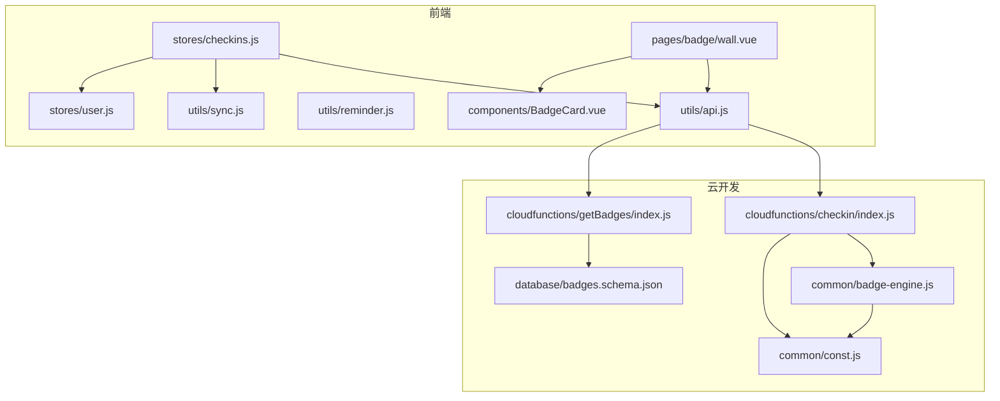
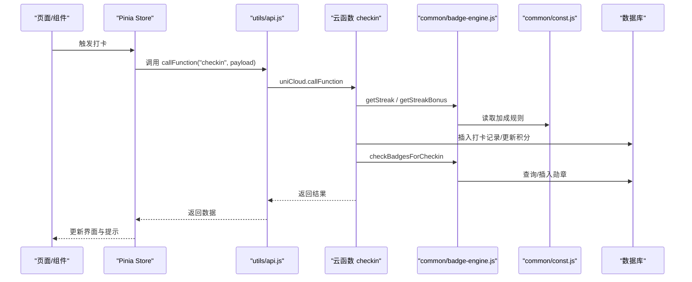
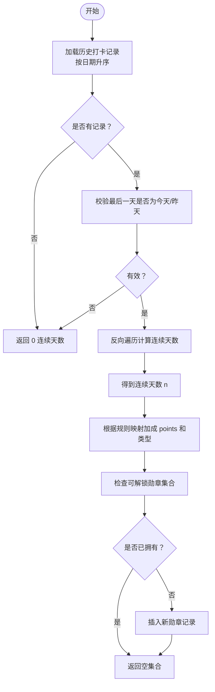
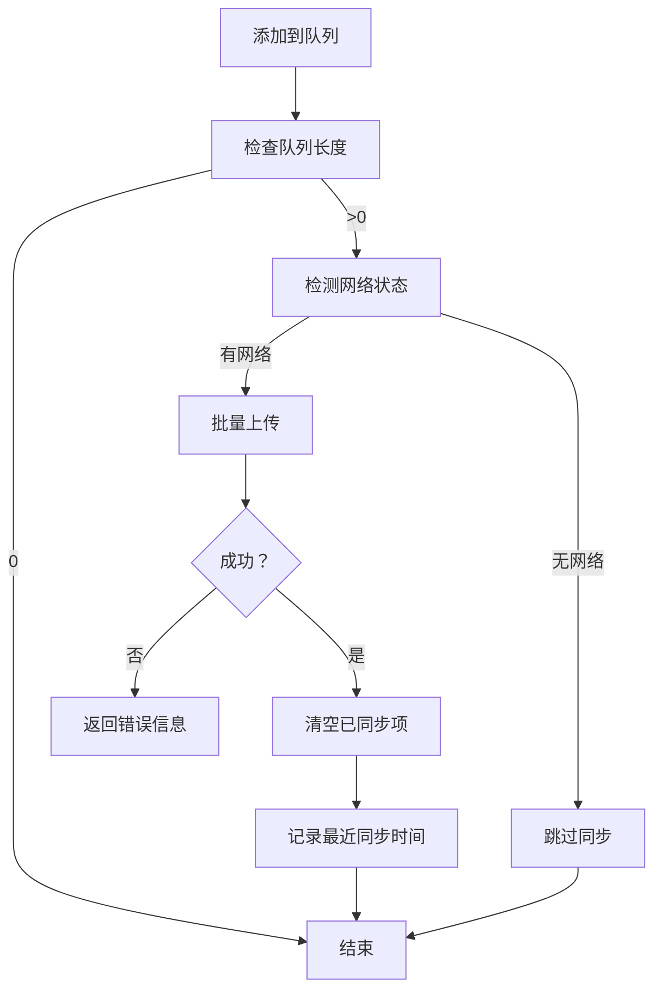
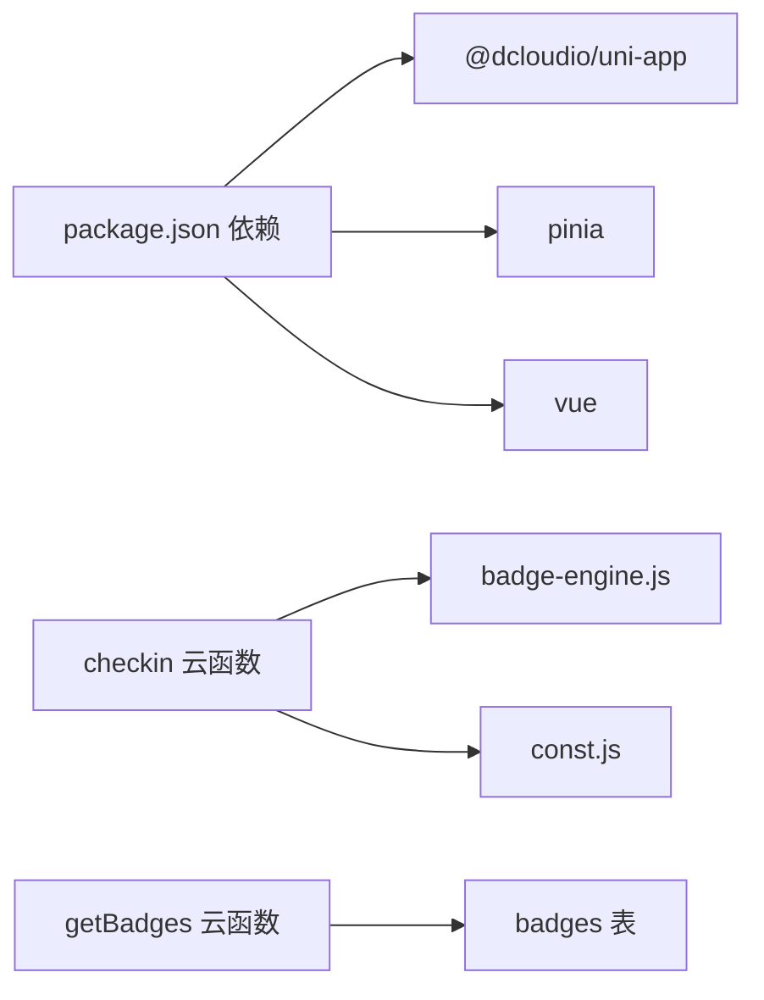

# 公共模块

<cite>
**本文引用的文件**
- [badge-engine.js](file://uniCloud-aliyun/common/badge-engine.js)
- [const.js](file://uniCloud-aliyun/common/const.js)
- [api.js](file://src/utils/api.js)
- [reminder.js](file://src/utils/reminder.js)
- [sync.js](file://src/utils/sync.js)
- [checkin 云函数](file://uniCloud-aliyun/cloudfunctions/checkin/index.js)
- [getBadges 云函数](file://uniCloud-aliyun/cloudfunctions/getBadges/index.js)
- [user.js](file://src/stores/user.js)
- [checkins.js](file://src/stores/checkins.js)
- [BadgeCard 组件](file://src/components/BadgeCard.vue)
- [badge 墙页面](file://src/pages/badge/wall.vue)
- [badges 数据表结构](file://uniCloud-aliyun/database/badges.schema.json)
- [package.json](file://package.json)
</cite>

## 目录
1. [简介](#简介)
2. [项目结构](#项目结构)
3. [核心组件](#核心组件)
4. [架构总览](#架构总览)
5. [详细组件分析](#详细组件分析)
6. [依赖分析](#依赖分析)
7. [性能考虑](#性能考虑)
8. [故障排查指南](#故障排查指南)
9. [结论](#结论)
10. [附录](#附录)

## 简介
本文件系统性梳理项目中的公共模块与工具函数，重点覆盖以下方面：
- 勋章引擎：连续打卡算法、加成规则、解锁条件与数据库结构
- 常量定义：规则与配置的集中化管理
- 通用工具库：云函数调用封装、离线同步、提醒调度
- 版本管理与依赖：前端与云开发依赖、云函数包配置
- 使用示例与最佳实践：如何在业务流程中正确集成
- 测试与质量保障：错误处理、边界条件与幂等设计
- 扩展与定制：如何新增规则、勋章与加成
- 性能优化与缓存策略：本地缓存、批量同步、智能触发
- 文档生成与维护：常量与引擎的可维护性建议
- 迁移与兼容：跨平台与历史数据兼容策略

## 项目结构
公共模块主要分布在两个区域：
- 前端公共工具与状态管理：位于 src/utils 与 src/stores
- 云开发公共引擎与常量：位于 uniCloud-aliyun/common 与对应的云函数目录

图表来源
- [api.js:1-18](file://src/utils/api.js#L1-L18)
- [sync.js:1-96](file://src/utils/sync.js#L1-L96)
- [reminder.js:1-59](file://src/utils/reminder.js#L1-L59)
- [checkins.js:1-163](file://src/stores/checkins.js#L1-L163)
- [user.js:1-119](file://src/stores/user.js#L1-L119)
- [BadgeCard 组件:1-37](file://src/components/BadgeCard.vue#L1-L37)
- [badge 墙页面:1-82](file://src/pages/badge/wall.vue#L1-L82)
- [badge-engine.js:1-125](file://uniCloud-aliyun/common/badge-engine.js#L1-L125)
- [const.js:1-27](file://uniCloud-aliyun/common/const.js#L1-L27)
- [checkin 云函数:1-83](file://uniCloud-aliyun/cloudfunctions/checkin/index.js#L1-L83)
- [getBadges 云函数:1-15](file://uniCloud-aliyun/cloudfunctions/getBadges/index.js#L1-L15)
- [badges 数据表结构:1-40](file://uniCloud-aliyun/database/badges.schema.json#L1-L40)

章节来源
- [api.js:1-18](file://src/utils/api.js#L1-L18)
- [sync.js:1-96](file://src/utils/sync.js#L1-L96)
- [reminder.js:1-59](file://src/utils/reminder.js#L1-L59)
- [checkins.js:1-163](file://src/stores/checkins.js#L1-L163)
- [user.js:1-119](file://src/stores/user.js#L1-L119)
- [BadgeCard 组件:1-37](file://src/components/BadgeCard.vue#L1-L37)
- [badge 墙页面:1-82](file://src/pages/badge/wall.vue#L1-L82)
- [badge-engine.js:1-125](file://uniCloud-aliyun/common/badge-engine.js#L1-L125)
- [const.js:1-27](file://uniCloud-aliyun/common/const.js#L1-L27)
- [checkin 云函数:1-83](file://uniCloud-aliyun/cloudfunctions/checkin/index.js#L1-L83)
- [getBadges 云函数:1-15](file://uniCloud-aliyun/cloudfunctions/getBadges/index.js#L1-L15)
- [badges 数据表结构:1-40](file://uniCloud-aliyun/database/badges.schema.json#L1-L40)

## 核心组件
- 勋章引擎（common/badge-engine.js）：负责连续打卡统计、加成计算、勋章判定与颁发
- 常量定义（common/const.js）：集中管理连续打卡加成规则与勋章定义
- 云函数封装（utils/api.js）：统一调用 uniCloud.callFunction，返回标准化结果
- 离线同步（utils/sync.js）：离线优先、静默同步、冲突以云端为准
- 提醒调度（utils/reminder.js）：按计划类别选择文案，支持小程序订阅与 App 本地通知
- 勋章墙页面（pages/badge/wall.vue）：展示所有勋章与解锁进度
- 勋章卡片组件（components/BadgeCard.vue）：渲染已解锁/未解锁状态
- 云函数：checkin（执行打卡、加成、积分更新、勋章检查）、getBadges（查询勋章）

章节来源
- [badge-engine.js:1-125](file://uniCloud-aliyun/common/badge-engine.js#L1-L125)
- [const.js:1-27](file://uniCloud-aliyun/common/const.js#L1-L27)
- [api.js:1-18](file://src/utils/api.js#L1-L18)
- [sync.js:1-96](file://src/utils/sync.js#L1-L96)
- [reminder.js:1-59](file://src/utils/reminder.js#L1-L59)
- [badge 墙页面:1-82](file://src/pages/badge/wall.vue#L1-L82)
- [BadgeCard 组件:1-37](file://src/components/BadgeCard.vue#L1-L37)
- [checkin 云函数:1-83](file://uniCloud-aliyun/cloudfunctions/checkin/index.js#L1-L83)
- [getBadges 云函数:1-15](file://uniCloud-aliyun/cloudfunctions/getBadges/index.js#L1-L15)

## 架构总览
前端通过 Pinia Store 管理用户与打卡状态，调用 utils 中的 API 封装发起云函数请求；云函数侧复用 common 中的 badge-engine 与 const，完成业务计算与数据库操作。

图表来源
- [checkins.js:26-89](file://src/stores/checkins.js#L26-L89)
- [api.js:9-17](file://src/utils/api.js#L9-L17)
- [checkin 云函数:5-82](file://uniCloud-aliyun/cloudfunctions/checkin/index.js#L5-L82)
- [badge-engine.js:7-122](file://uniCloud-aliyun/common/badge-engine.js#L7-L122)
- [const.js:3-17](file://uniCloud-aliyun/common/const.js#L3-L17)

## 详细组件分析

### 勋章引擎与解锁条件
- 连续打卡统计：按日期倒序取记录，判断最后一天是否为当天或昨天，然后向前累加连续天数
- 加成规则：基于连续天数映射加成点数与类型
- 解锁条件：
  - 首次打卡：首次完成任意打卡
  - 连续天数：3/7/14/30 天对应不同勋章
  - 自主打卡：首次自主打卡
  - 心情记录员：连续5天有“感受”记录
  - 全能之星：一周内覆盖至少4个不同分类
- 幂等保护：若已拥有某勋章则不再重复颁发

图表来源
- [badge-engine.js:7-31](file://uniCloud-aliyun/common/badge-engine.js#L7-L31)
- [badge-engine.js:36-47](file://uniCloud-aliyun/common/badge-engine.js#L36-L47)
- [badge-engine.js:52-122](file://uniCloud-aliyun/common/badge-engine.js#L52-L122)
- [const.js:3-17](file://uniCloud-aliyun/common/const.js#L3-L17)

章节来源
- [badge-engine.js:1-125](file://uniCloud-aliyun/common/badge-engine.js#L1-L125)
- [const.js:1-27](file://uniCloud-aliyun/common/const.js#L1-L27)

### 常量定义与组织结构
- 连续打卡加成规则：键为天数阈值，值为加成点数
- 勋章定义：包含类型、标题、图标、描述
- 白名单校验：用于权限控制的辅助函数

命名规范与组织建议：
- 常量名采用全大写蛇形（如 STREAK_BONUS、BADGE_DEFS）
- 勋章类型使用语义化标识（如 streak_3、first_self）
- 保持 BADGE_DEFS 与解锁逻辑一致，避免遗漏

章节来源
- [const.js:1-27](file://uniCloud-aliyun/common/const.js#L1-L27)

### 通用工具库

#### 云函数调用封装（utils/api.js）
- 统一封装 uniCloud.callFunction，捕获异常并返回 { success, data|error }
- 便于上层组件与 Store 无差别处理成功/失败

章节来源
- [api.js:1-18](file://src/utils/api.js#L1-L18)

#### 离线同步（utils/sync.js）
- 队列机制：addToSyncQueue 去重并追加时间戳
- 批量上传：flushSyncQueue 按日期排序后调用云函数
- 智能同步：smartSync 在有网络且有待同步数据时触发
- 冲突处理：以云端为准，本地幂等（同天同计划去重）

图表来源
- [sync.js:13-53](file://src/utils/sync.js#L13-L53)
- [sync.js:84-95](file://src/utils/sync.js#L84-L95)

章节来源
- [sync.js:1-96](file://src/utils/sync.js#L1-L96)

#### 提醒调度（utils/reminder.js）
- 按计划类别选择文案池，支持自定义文案
- App 端：plus.push.createMessage 注册本地定时通知
- 小程序端：调用云函数 setupReminder，由云端定时器触发订阅消息

章节来源
- [reminder.js:1-59](file://src/utils/reminder.js#L1-L59)

### 勋章墙与展示组件
- 勋章墙页面：聚合所有勋章定义，对比已解锁类型，计算进度百分比
- 勋章卡片组件：根据解锁状态切换样式，显示图标、标题、解锁日期或描述

章节来源
- [badge 墙页面:1-82](file://src/pages/badge/wall.vue#L1-L82)
- [BadgeCard 组件:1-37](file://src/components/BadgeCard.vue#L1-L37)

### 云函数集成
- checkin 云函数：读取计划基础积分，防重复打卡，插入记录，计算加成并更新积分，最后检查并颁发勋章
- getBadges 云函数：按 child_id 查询并按解锁时间倒序返回

章节来源
- [checkin 云函数:1-83](file://uniCloud-aliyun/cloudfunctions/checkin/index.js#L1-L83)
- [getBadges 云函数:1-15](file://uniCloud-aliyun/cloudfunctions/getBadges/index.js#L1-L15)

## 依赖分析
- 前端依赖：@dcloudio/uni-app、pinia、uview-plus、vue 等
- 云函数依赖：common 模块（badge-engine 与 const）被多个云函数复用
- 数据模型：badges 表字段包含 child_id、badge_type、title、icon、desc、unlocked_at

图表来源
- [package.json:39-72](file://package.json#L39-L72)
- [checkin 云函数](file://uniCloud-aliyun/cloudfunctions/checkin/index.js#L3)
- [badge-engine.js](file://uniCloud-aliyun/common/badge-engine.js#L2)
- [const.js](file://uniCloud-aliyun/common/const.js#L2)
- [getBadges 云函数:1-15](file://uniCloud-aliyun/cloudfunctions/getBadges/index.js#L1-L15)
- [badges 数据表结构:1-40](file://uniCloud-aliyun/database/badges.schema.json#L1-L40)

章节来源
- [package.json:1-74](file://package.json#L1-L74)
- [checkin 云函数:1-83](file://uniCloud-aliyun/cloudfunctions/checkin/index.js#L1-L83)
- [badge-engine.js:1-125](file://uniCloud-aliyun/common/badge-engine.js#L1-L125)
- [const.js:1-27](file://uniCloud-aliyun/common/const.js#L1-L27)
- [getBadges 云函数:1-15](file://uniCloud-aliyun/cloudfunctions/getBadges/index.js#L1-L15)
- [badges 数据表结构:1-40](file://uniCloud-aliyun/database/badges.schema.json#L1-L40)

## 性能考虑
- 离线优先：打卡直接写入本地存储，避免阻塞用户
- 批量同步：按日期排序后一次性上传，减少网络往返
- 智能触发：仅在网络可用且存在待同步数据时执行
- 数据库查询优化：按 child_id、date、plan_id 等建立索引（建议）
- 前端缓存：本地缓存今日/本周打卡，降低云端压力
- 勋章计算：按需查询，避免全量扫描；对频繁访问的集合进行分页或索引优化

## 故障排查指南
- 云函数调用失败：检查 utils/api.js 的错误返回与日志输出
- 重复打卡：checkin 云函数已做重复检查，确认前端传参与日期格式
- 离线同步失败：查看 smartSync 的网络检测与 flushSyncQueue 的异常分支
- 勋章未解锁：核对 badge-engine 的解锁条件与 const 中的定义一致性
- 勋章墙空白：确认 getBadges 云函数返回的数据结构与页面解析逻辑

章节来源
- [api.js:10-16](file://src/utils/api.js#L10-L16)
- [checkin 云函数:14-20](file://uniCloud-aliyun/cloudfunctions/checkin/index.js#L14-L20)
- [sync.js:84-95](file://src/utils/sync.js#L84-L95)
- [badge-engine.js:52-122](file://uniCloud-aliyun/common/badge-engine.js#L52-L122)
- [getBadges 云函数:8-13](file://uniCloud-aliyun/cloudfunctions/getBadges/index.js#L8-L13)

## 结论
本公共模块以“常量集中、引擎复用、工具解耦”为核心设计原则，实现了稳定可扩展的勋章系统与通用工具链。通过离线优先与智能同步策略，兼顾用户体验与数据一致性；通过清晰的解锁条件与数据模型，确保业务规则透明可维护。

## 附录

### 使用示例与最佳实践
- 打卡流程：在页面触发 doCheckin → 调用云函数 → 成功后更新本地缓存与积分 → 若有新勋章弹窗提示
- 离线场景：失败时自动进入同步队列，应用切前台或手动触发 smartSync
- 勋章墙：页面 onShow 时调用 getBadges，渲染 BadgeCard 并计算进度
- 提醒功能：根据计划设置提醒时间，区分小程序与 App 的实现路径

章节来源
- [checkins.js:26-89](file://src/stores/checkins.js#L26-L89)
- [sync.js:84-95](file://src/utils/sync.js#L84-L95)
- [badge 墙页面:58-65](file://src/pages/badge/wall.vue#L58-L65)
- [reminder.js:19-41](file://src/utils/reminder.js#L19-L41)

### 扩展与定制化方法
- 新增加成规则：在 const.js 的 STREAK_BONUS 中添加键值对
- 新增勋章：在 BADGE_DEFS 中添加定义，并在 badge-engine.js 的解锁逻辑中补充条件
- 新增解锁条件：在 checkBadgesForCheckin 中扩展分支，注意幂等性与去重
- 新增云函数：遵循现有云函数模板，复用 common 模块与 utils 封装

章节来源
- [const.js:3-17](file://uniCloud-aliyun/common/const.js#L3-L17)
- [badge-engine.js:52-122](file://uniCloud-aliyun/common/badge-engine.js#L52-L122)

### 版本管理与依赖关系
- 前端版本：package.json 中声明 @dcloudio/uni-app、pinia、vue 等依赖
- 云函数包配置：各云函数目录下的 package.json 定义 memorySize 与 timeout
- 建议：统一管理版本号，定期升级依赖以获得安全与性能改进

章节来源
- [package.json:1-74](file://package.json#L1-L74)

### 测试与质量保证
- 单元测试建议：针对 badge-engine 的 getStreak、getStreakBonus、checkBadgesForCheckin 编写边界用例（空记录、跨日、重复打卡、连续中断等）
- 集成测试建议：模拟离线同步、网络异常、重复打卡、并发提交等场景
- 质量保障：统一错误返回结构、日志埋点、接口超时与重试策略

### 文档生成与维护指南
- 常量与规则：在 const.js 中集中维护，引擎与页面共同引用
- 引擎函数：保持纯函数特性，输入输出明确，便于测试与演进
- 页面与组件：尽量薄化逻辑，将业务规则下沉至引擎与 Store

### 迁移与兼容性处理
- 跨平台兼容：通过 #ifdef 条件编译适配 App 与小程序的通知差异
- 历史数据兼容：在 badge-engine 中对“最后一天”判断兼容昨天/今天，避免迁移后规则失效
- 字段演进：数据库 schema 变更时，云函数与前端需同时兼容旧字段