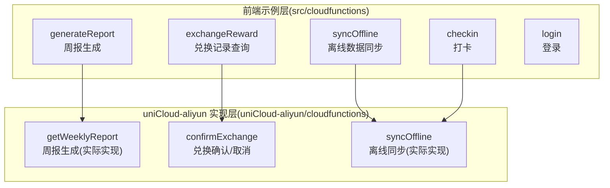
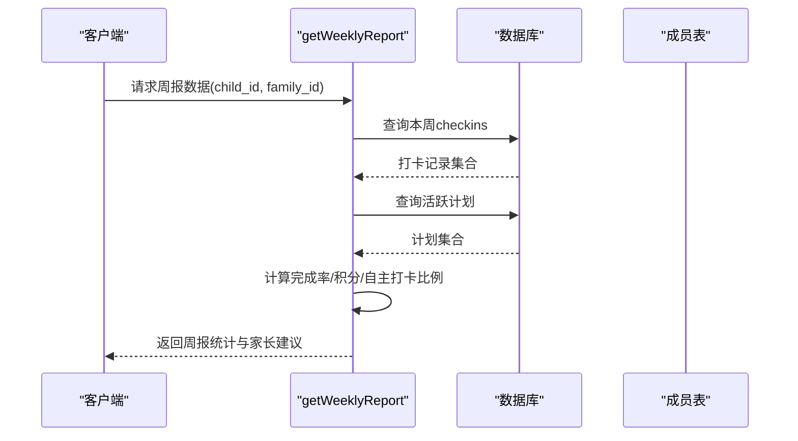
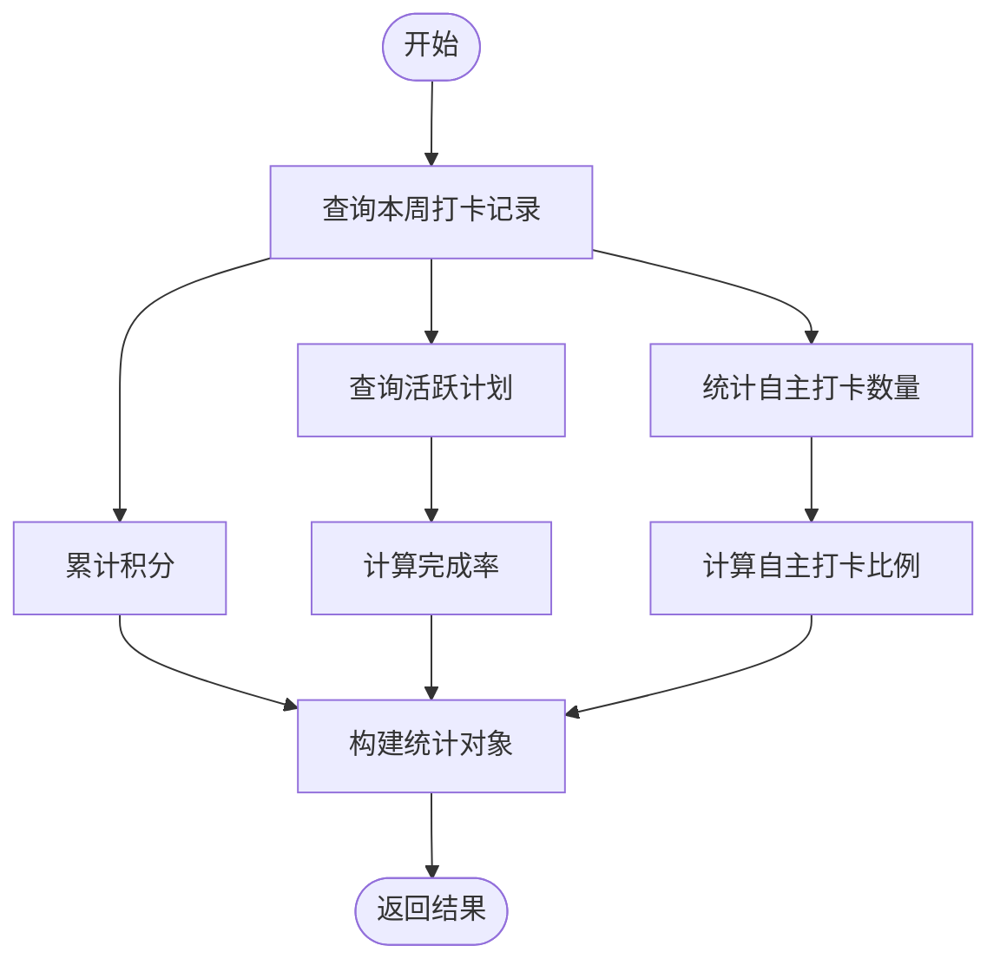
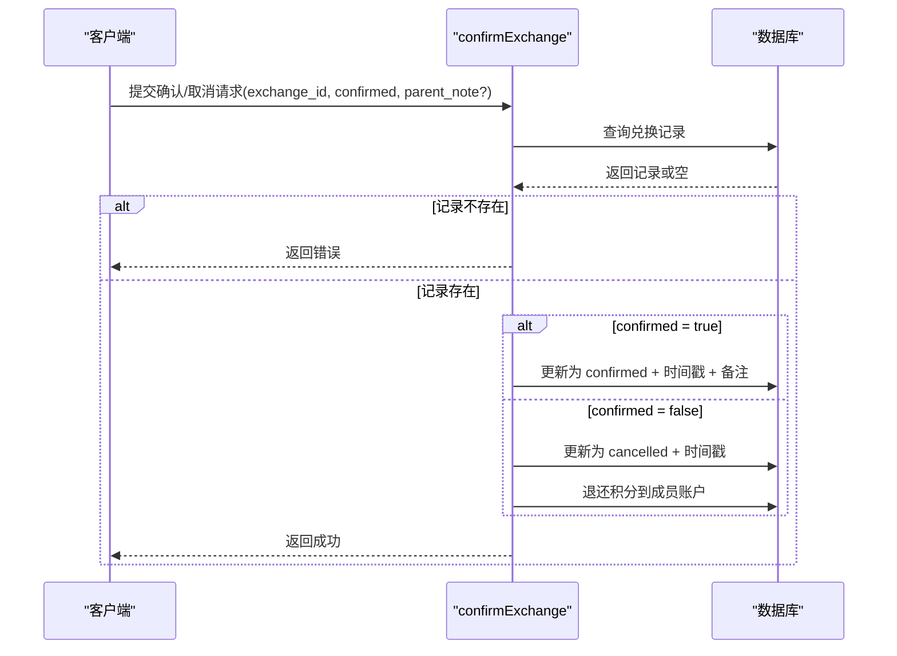
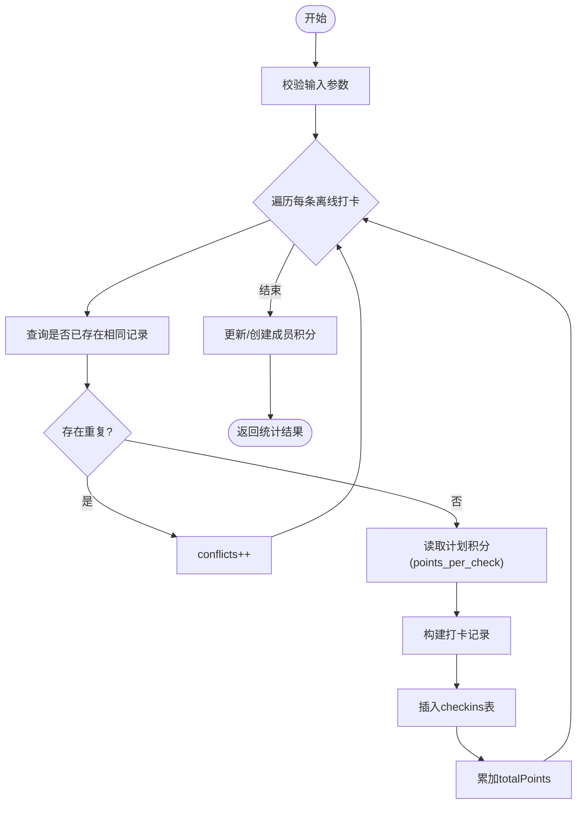
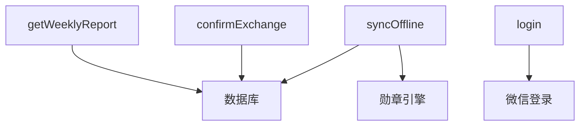

# 工具类云函数

<cite>
**本文档引用的文件**
- [generateReport/index.js](file://src/cloudfunctions/generateReport/index.js)
- [generateReport/package.json](file://src/cloudfunctions/generateReport/package.json)
- [exchangeReward/index.js](file://src/cloudfunctions/exchangeReward/index.js)
- [exchangeReward/package.json](file://src/cloudfunctions/exchangeReward/package.json)
- [syncOffline/index.js](file://src/cloudfunctions/syncOffline/index.js)
- [syncOffline/package.json](file://src/cloudfunctions/syncOffline/package.json)
- [checkin/index.js](file://src/cloudfunctions/checkin/index.js)
- [checkin/package.json](file://src/cloudfunctions/checkin/package.json)
- [login/index.js](file://src/cloudfunctions/login/index.js)
- [login/package.json](file://src/cloudfunctions/login/package.json)
- [getWeeklyReport/index.js](file://uniCloud-aliyun/cloudfunctions/getWeeklyReport/index.js)
- [confirmExchange/index.js](file://uniCloud-aliyun/cloudfunctions/confirmExchange/index.js)
- [syncOffline/index.js](file://uniCloud-aliyun/cloudfunctions/syncOffline/index.js)
- [checkins.schema.json](file://uniCloud-aliyun/database/checkins.schema.json)
- [exchanges.schema.json](file://uniCloud-aliyun/database/exchanges.schema.json)
</cite>

## 目录
1. [简介](#简介)
2. [项目结构](#项目结构)
3. [核心组件](#核心组件)
4. [架构概览](#架构概览)
5. [详细组件分析](#详细组件分析)
6. [依赖分析](#依赖分析)
7. [性能考虑](#性能考虑)
8. [故障排除指南](#故障排除指南)
9. [结论](#结论)
10. [附录](#附录)

## 简介
本文件系统性梳理并文档化工具类云函数，涵盖以下关键能力：
- 周报生成：基于数据库中的打卡与计划数据，计算完成率、积分累计、自主打卡比例等指标，并输出家长指导建议。
- 兑换记录查询：提供兑换记录的查询与状态管理，支持家长确认或取消兑换并进行积分退还。
- 离线数据同步：批量处理离线打卡数据，具备幂等性、冲突检测与积分累加、勋章检查等完整流程。

同时，文档将深入解析数据聚合逻辑与格式化处理、队列管理与冲突解决、批量处理机制、通用性与可复用性设计、配置参数与自定义选项、性能优化与资源管理策略、日志与监控指标、错误处理与异常恢复、测试策略与质量保证，以及维护与升级指南。

## 项目结构
工具类云函数主要分布在两个层次：
- 前端侧示例实现：位于 src/cloudfunctions，提供基础框架与注释说明，便于理解业务流程。
- uniCloud-aliyun 实际实现：位于 uniCloud-aliyun/cloudfunctions，包含完整的数据库操作、数据聚合与状态管理逻辑。

图表来源
- [generateReport/index.js:1-33](file://src/cloudfunctions/generateReport/index.js#L1-L33)
- [exchangeReward/index.js:1-28](file://src/cloudfunctions/exchangeReward/index.js#L1-L28)
- [syncOffline/index.js:1-20](file://src/cloudfunctions/syncOffline/index.js#L1-L20)
- [checkin/index.js:1-142](file://src/cloudfunctions/checkin/index.js#L1-L142)
- [login/index.js:1-13](file://src/cloudfunctions/login/index.js#L1-L13)
- [getWeeklyReport/index.js:1-46](file://uniCloud-aliyun/cloudfunctions/getWeeklyReport/index.js#L1-L46)
- [confirmExchange/index.js:1-34](file://uniCloud-aliyun/cloudfunctions/confirmExchange/index.js#L1-L34)
- [syncOffline/index.js:1-90](file://uniCloud-aliyun/cloudfunctions/syncOffline/index.js#L1-L90)

章节来源
- [generateReport/index.js:1-33](file://src/cloudfunctions/generateReport/index.js#L1-L33)
- [exchangeReward/index.js:1-28](file://src/cloudfunctions/exchangeReward/index.js#L1-L28)
- [syncOffline/index.js:1-20](file://src/cloudfunctions/syncOffline/index.js#L1-L20)
- [checkin/index.js:1-142](file://src/cloudfunctions/checkin/index.js#L1-L142)
- [login/index.js:1-13](file://src/cloudfunctions/login/index.js#L1-L13)
- [getWeeklyReport/index.js:1-46](file://uniCloud-aliyun/cloudfunctions/getWeeklyReport/index.js#L1-L46)
- [confirmExchange/index.js:1-34](file://uniCloud-aliyun/cloudfunctions/confirmExchange/index.js#L1-L34)
- [syncOffline/index.js:1-90](file://uniCloud-aliyun/cloudfunctions/syncOffline/index.js#L1-L90)

## 核心组件
- 周报生成组件：负责统计本周打卡数量、完成率、积分累计、自主打卡比例等，并给出家长指导建议。
- 兑换记录查询组件：提供兑换记录的状态管理，支持家长确认或取消兑换，并在取消时进行积分退还。
- 离线数据同步组件：批量处理离线打卡，进行重复性检查、积分累加、成员信息补全与勋章检查。

章节来源
- [getWeeklyReport/index.js:1-46](file://uniCloud-aliyun/cloudfunctions/getWeeklyReport/index.js#L1-L46)
- [confirmExchange/index.js:1-34](file://uniCloud-aliyun/cloudfunctions/confirmExchange/index.js#L1-L34)
- [syncOffline/index.js:1-90](file://uniCloud-aliyun/cloudfunctions/syncOffline/index.js#L1-L90)

## 架构概览
工具类云函数围绕数据库表进行数据聚合与状态流转，形成“查询-统计-更新”的闭环。前端示例层提供流程示意，uniCloud-aliyun 层提供具体实现。

图表来源
- [getWeeklyReport/index.js:4-44](file://uniCloud-aliyun/cloudfunctions/getWeeklyReport/index.js#L4-L44)

## 详细组件分析

### 周报生成组件
- 输入参数
  - child_id: 孩子成员ID
  - family_id: 家庭ID（用于过滤活跃计划）
- 数据聚合逻辑
  - 统计本周打卡数量：通过日期范围查询 checkins 表。
  - 计算完成率：总打卡数 / (活跃计划数 × 7 天)。
  - 积分累计：对 points_earned 字段求和。
  - 自主打卡比例：checked_by = 'self' 的打卡数占比。
- 输出格式
  - stats: 包含 total_checks、completion_rate、points_earned、self_check_rate。
  - parent_tip: 家长指导建议文本。
- 设计要点
  - 通用性：通过 family_id 隔离多用户数据，避免跨家庭数据污染。
  - 可复用性：统计逻辑独立于前端展示，便于在不同页面复用。
  - 性能：使用日期范围查询与聚合函数，减少内存计算。

图表来源
- [getWeeklyReport/index.js:10-44](file://uniCloud-aliyun/cloudfunctions/getWeeklyReport/index.js#L10-L44)

章节来源
- [getWeeklyReport/index.js:1-46](file://uniCloud-aliyun/cloudfunctions/getWeeklyReport/index.js#L1-L46)
- [checkins.schema.json:1-52](file://uniCloud-aliyun/database/checkins.schema.json#L1-L52)

### 兑换记录查询组件
- 输入参数
  - exchange_id: 兑换记录ID
  - confirmed: 是否确认兑换（true/false）
  - parent_note: 家长备注（可选）
- 处理流程
  - 查询兑换记录：若不存在则返回错误。
  - 确认兑换：更新状态为 confirmed 并记录确认时间与备注。
  - 取消兑换：更新状态为 cancelled，并退还相应积分到成员账户。
- 错误处理
  - 兑换记录不存在：返回明确错误提示。
  - 退还积分失败：需确保幂等性与一致性，必要时引入事务或补偿机制。

图表来源
- [confirmExchange/index.js:4-33](file://uniCloud-aliyun/cloudfunctions/confirmExchange/index.js#L4-L33)

章节来源
- [confirmExchange/index.js:1-34](file://uniCloud-aliyun/cloudfunctions/confirmExchange/index.js#L1-L34)
- [exchanges.schema.json:1-56](file://uniCloud-aliyun/database/exchanges.schema.json#L1-L56)

### 离线数据同步组件
- 输入参数
  - child_id: 孩子成员ID
  - checkins: 打卡数组，每项包含 plan_id、date、feeling、checked_by
- 批量处理机制
  - 逐条处理：遍历 checkins 数组，对每条记录执行以下步骤。
  - 冲突检测：根据 plan_id + child_id + date 查询是否存在重复记录，存在则计入 conflicts 并跳过。
  - 积分计算：优先读取计划 points_per_check，否则使用默认值；累加 totalPoints。
  - 写入数据库：插入 checkins 记录，标记 created_at。
  - 成员更新：使用增量更新累加 current_points 与 total_points；若成员不存在则创建默认成员。
  - 勋章检查：调用外部引擎检查并发放新勋章（由外部模块提供）。
- 输出统计
  - synced：成功写入数量
  - failed：写入失败数量
  - conflicts：重复记录数量
  - total_points_added：本次累计积分
  - new_badges：新增勋章列表

图表来源
- [syncOffline/index.js:5-88](file://uniCloud-aliyun/cloudfunctions/syncOffline/index.js#L5-L88)

章节来源
- [syncOffline/index.js:1-90](file://uniCloud-aliyun/cloudfunctions/syncOffline/index.js#L1-L90)

### 通用性与可复用性设计
- 参数化设计：所有组件均采用事件驱动的参数化入口，便于在不同场景下复用。
- 数据模型解耦：通过统一的 schema 定义字段约束，降低耦合度，提升扩展性。
- 外部模块集成：离线同步调用外部勋章引擎，便于替换与升级。
- 幂等性保障：离线同步对重复记录进行检测与跳过，确保多次执行的安全性。

章节来源
- [syncOffline/index.js:19-28](file://uniCloud-aliyun/cloudfunctions/syncOffline/index.js#L19-L28)
- [checkins.schema.json:1-52](file://uniCloud-aliyun/database/checkins.schema.json#L1-L52)

### 配置参数与自定义选项
- 周报生成
  - child_id/family_id：用于筛选数据范围。
  - parent_tip：家长建议文本，可根据业务需求动态调整。
- 兑换记录
  - exchange_id：唯一标识。
  - confirmed：控制状态流转。
  - parent_note：可选备注字段。
- 离线同步
  - child_id：成员标识。
  - checkins[]：批量打卡数组，支持自定义字段（如 feeling、checked_by）。
  - 默认积分：当计划缺失时使用默认值，便于容错。

章节来源
- [getWeeklyReport/index.js:6-44](file://uniCloud-aliyun/cloudfunctions/getWeeklyReport/index.js#L6-L44)
- [confirmExchange/index.js:6-33](file://uniCloud-aliyun/cloudfunctions/confirmExchange/index.js#L6-L33)
- [syncOffline/index.js:7-57](file://uniCloud-aliyun/cloudfunctions/syncOffline/index.js#L7-L57)

### 性能优化与资源管理策略
- 查询优化
  - 使用日期范围查询与索引字段（如 date、child_id、plan_id）减少扫描范围。
  - 对聚合操作尽量在数据库层面完成，避免大结果集回传。
- 批量处理
  - 离线同步采用单条插入与增量更新，避免复杂事务带来的锁竞争。
- 资源管理
  - 控制循环次数与单次处理规模，避免超时与内存峰值。
  - 对成员不存在的情况采用 upsert，减少分支判断与额外查询。

章节来源
- [getWeeklyReport/index.js:11-23](file://uniCloud-aliyun/cloudfunctions/getWeeklyReport/index.js#L11-L23)
- [syncOffline/index.js:50-77](file://uniCloud-aliyun/cloudfunctions/syncOffline/index.js#L50-L77)

### 日志记录与监控指标
- 建议埋点
  - 开始/结束时间戳：用于评估执行耗时。
  - 关键变量：如 synced、failed、conflicts、total_points_added。
  - 错误码与错误消息：便于定位问题根因。
- 监控维度
  - QPS：按组件维度统计调用量。
  - 响应时间：P50/P95/P99 分位。
  - 失败率：failed/synced 比例。
  - 冲突率：conflicts/synced 比例。

章节来源
- [syncOffline/index.js:6-17](file://uniCloud-aliyun/cloudfunctions/syncOffline/index.js#L6-L17)

### 错误处理与异常恢复机制
- 输入校验
  - 缺少必填参数或格式不正确时，立即返回错误。
- 数据一致性
  - 兑换取消时必须先更新状态再退还积分，确保原子性。
- 幂等性
  - 离线同步对重复记录直接跳过，避免重复计分与写入。
- 异常恢复
  - 对外部依赖（如计划查询）设置降级策略（使用默认值），保证流程可用。

章节来源
- [confirmExchange/index.js:15-30](file://uniCloud-aliyun/cloudfunctions/confirmExchange/index.js#L15-L30)
- [syncOffline/index.js:32-38](file://uniCloud-aliyun/cloudfunctions/syncOffline/index.js#L32-L38)
- [syncOffline/index.js:25-28](file://uniCloud-aliyun/cloudfunctions/syncOffline/index.js#L25-L28)

### 测试策略与质量保证
- 单元测试
  - 针对统计函数（完成率、比例）构造边界数据集，验证极端情况。
  - 针对离线同步的冲突检测与幂等性编写用例。
- 集成测试
  - 模拟真实数据库环境，验证多组件协作（同步 -> 积分更新 -> 勋章检查）。
- 回归测试
  - 在 schema 变更或业务规则调整后，回归验证核心指标（完成率、积分、比例）。
- 性能测试
  - 对批量处理组件进行压力测试，评估最大吞吐与延迟。

章节来源
- [getWeeklyReport/index.js:25-31](file://uniCloud-aliyun/cloudfunctions/getWeeklyReport/index.js#L25-L31)
- [syncOffline/index.js:15-17](file://uniCloud-aliyun/cloudfunctions/syncOffline/index.js#L15-L17)

### 维护与升级指南
- 版本管理
  - 采用语义化版本号，变更 schema 或业务规则时升级主版本。
- 向后兼容
  - 新增字段时保持默认值，避免影响旧逻辑。
- 依赖更新
  - 定期更新云函数运行时与 SDK，关注安全补丁。
- 文档同步
  - 修改实现时同步更新接口文档与注释，确保团队一致理解。

章节来源
- [checkins.schema.json:1-52](file://uniCloud-aliyun/database/checkins.schema.json#L1-L52)
- [exchanges.schema.json:1-56](file://uniCloud-aliyun/database/exchanges.schema.json#L1-L56)

## 依赖分析
- 组件内聚与耦合
  - 周报生成与兑换确认相对独立，仅通过数据库表进行间接耦合。
  - 离线同步与打卡流程存在数据一致性关联（积分与勋章）。
- 外部依赖
  - 微信登录：登录组件依赖 openid 获取能力（当前为占位实现）。
  - 勋章引擎：离线同步依赖外部模块进行勋章检查与发放。

图表来源
- [getWeeklyReport/index.js:4-44](file://uniCloud-aliyun/cloudfunctions/getWeeklyReport/index.js#L4-L44)
- [confirmExchange/index.js:4-33](file://uniCloud-aliyun/cloudfunctions/confirmExchange/index.js#L4-L33)
- [syncOffline/index.js:3-3](file://uniCloud-aliyun/cloudfunctions/syncOffline/index.js#L3-L3)
- [login/index.js:4-12](file://src/cloudfunctions/login/index.js#L4-L12)

章节来源
- [getWeeklyReport/index.js:1-46](file://uniCloud-aliyun/cloudfunctions/getWeeklyReport/index.js#L1-L46)
- [confirmExchange/index.js:1-34](file://uniCloud-aliyun/cloudfunctions/confirmExchange/index.js#L1-L34)
- [syncOffline/index.js:1-90](file://uniCloud-aliyun/cloudfunctions/syncOffline/index.js#L1-L90)
- [login/index.js:1-13](file://src/cloudfunctions/login/index.js#L1-L13)

## 性能考虑
- 查询优化：使用日期范围与复合索引，减少全表扫描。
- 聚合优化：在数据库层面完成统计，避免大结果集传输。
- 批量写入：离线同步采用单条插入，避免复杂事务锁争用。
- 资源限制：控制单次处理规模，避免超时与内存峰值。

## 故障排除指南
- 周报统计异常
  - 检查 child_id/family_id 是否正确，确认计划与打卡数据是否存在。
  - 核对完成率计算公式与边界条件（除零风险）。
- 兑换确认失败
  - 确认 exchange_id 是否存在，检查状态是否已被修改。
  - 若取消兑换，核对积分退还是否成功。
- 离线同步冲突过多
  - 检查 plan_id + child_id + date 组合是否唯一。
  - 确认客户端去重逻辑是否生效。

章节来源
- [getWeeklyReport/index.js:25-31](file://uniCloud-aliyun/cloudfunctions/getWeeklyReport/index.js#L25-L31)
- [confirmExchange/index.js:11-13](file://uniCloud-aliyun/cloudfunctions/confirmExchange/index.js#L11-L13)
- [syncOffline/index.js:25-28](file://uniCloud-aliyun/cloudfunctions/syncOffline/index.js#L25-L28)

## 结论
工具类云函数通过清晰的职责划分与数据聚合逻辑，实现了周报生成、兑换记录查询与离线数据同步的核心能力。其设计强调通用性、可复用性与幂等性，配合完善的错误处理与性能策略，能够稳定支撑业务发展。建议在后续迭代中完善登录与兑换确认的完整实现，并持续优化监控与测试体系。

## 附录
- 数据模型参考
  - 打卡记录表：包含 plan_id、child_id、date、checked_by、feeling、points_earned、bonus_points、bonus_type、created_at 等字段。
  - 兑换记录表：包含 reward_id、reward_title、child_id、family_id、points_spent、status、parent_note、confirmed_at、created_at 等字段。

章节来源
- [checkins.schema.json:1-52](file://uniCloud-aliyun/database/checkins.schema.json#L1-L52)
- [exchanges.schema.json:1-56](file://uniCloud-aliyun/database/exchanges.schema.json#L1-L56)