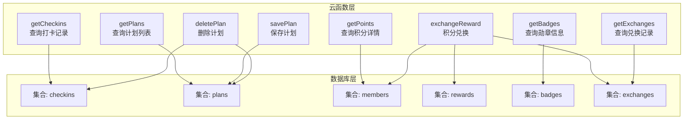
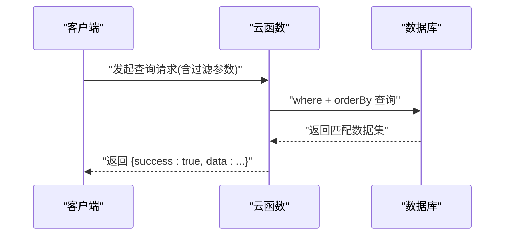
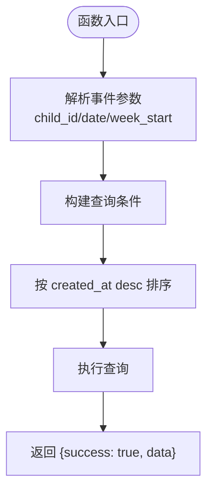
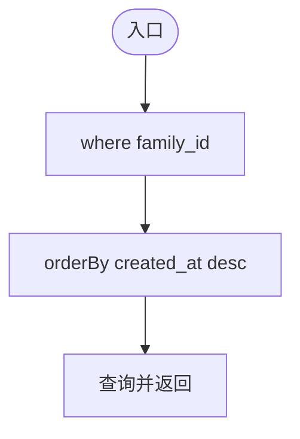
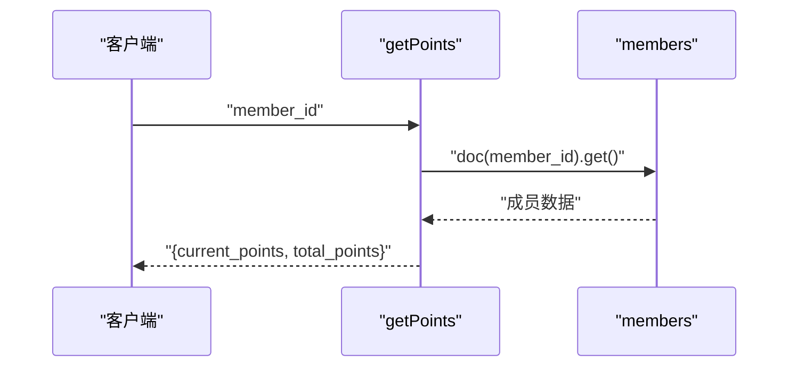
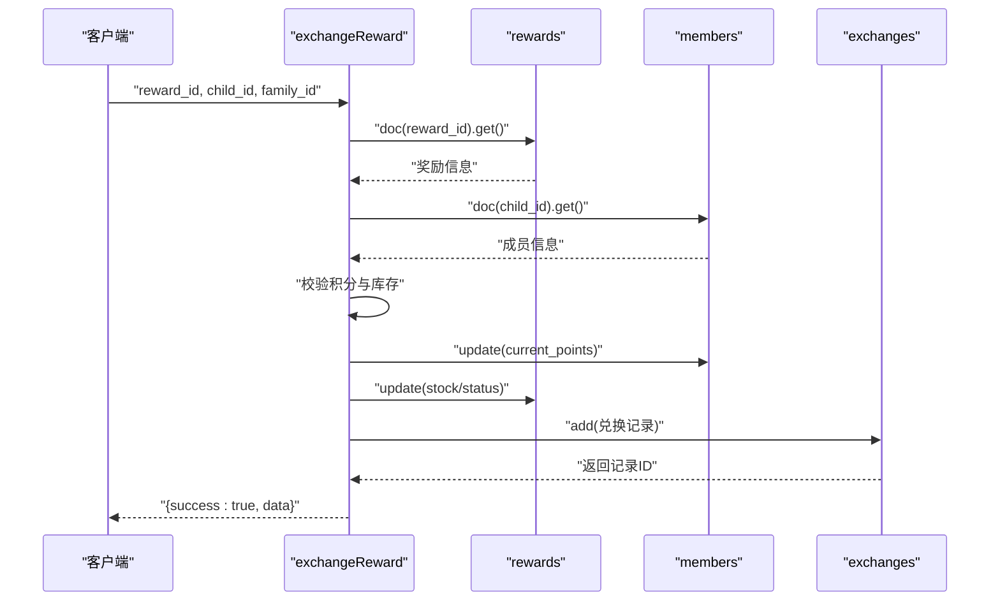
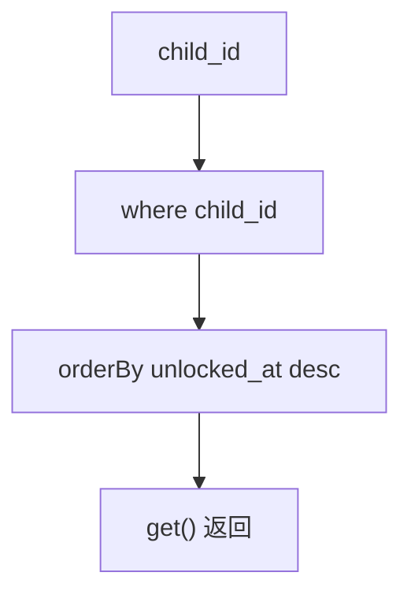
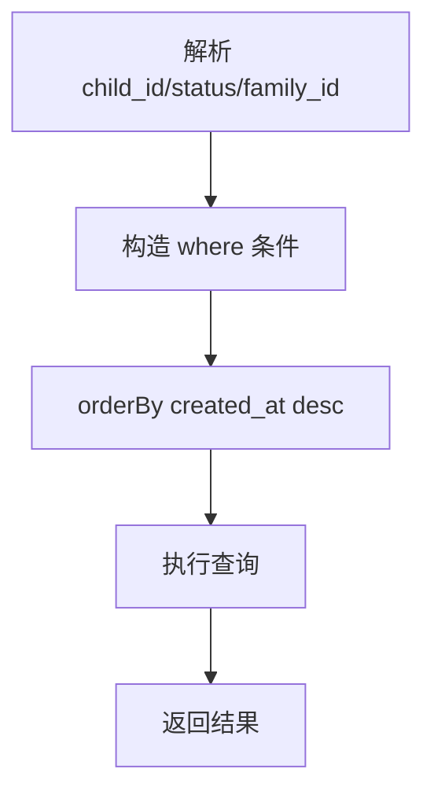
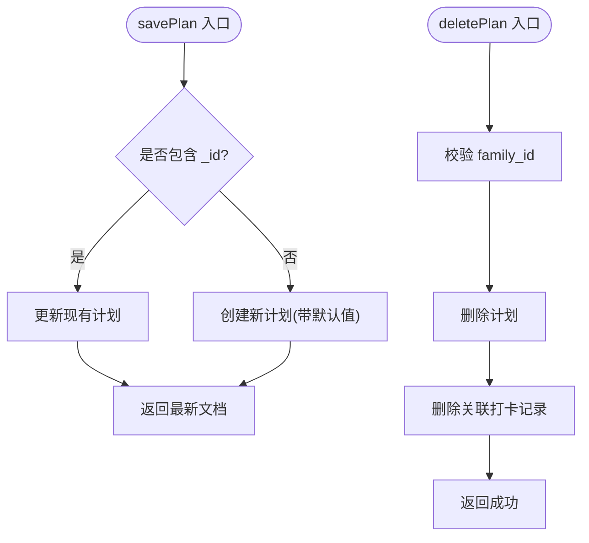
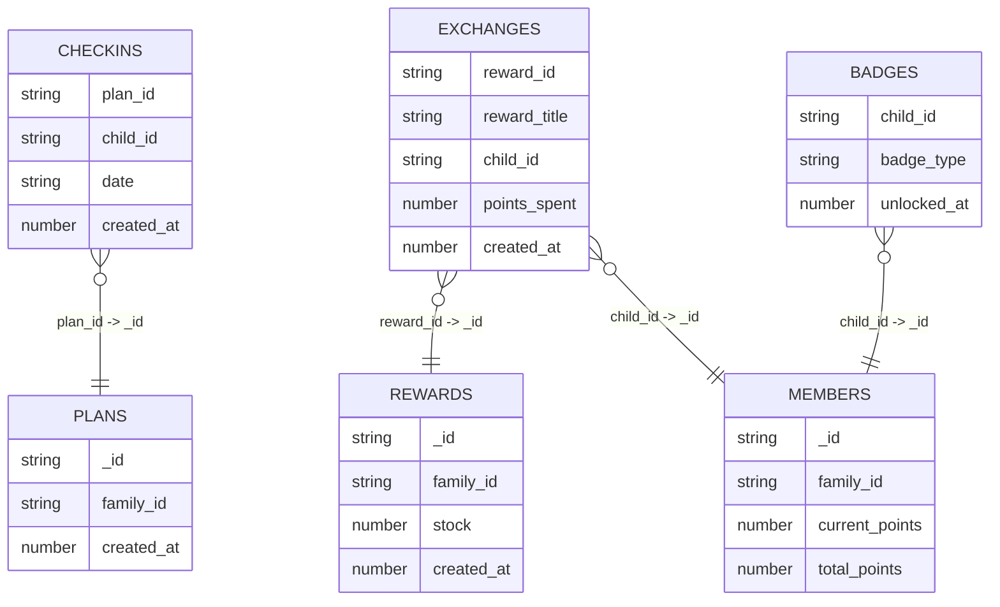

# 数据处理云函数

<cite>
**本文引用的文件**
- [uniCloud-aliyun/cloudfunctions/getCheckins/index.js](file://uniCloud-aliyun/cloudfunctions/getCheckins/index.js)
- [uniCloud-aliyun/cloudfunctions/getPlans/index.js](file://uniCloud-aliyun/cloudfunctions/getPlans/index.js)
- [uniCloud-aliyun/cloudfunctions/getPoints/index.js](file://uniCloud-aliyun/cloudfunctions/getPoints/index.js)
- [uniCloud-aliyun/cloudfunctions/exchangeReward/index.js](file://uniCloud-aliyun/cloudfunctions/exchangeReward/index.js)
- [uniCloud-aliyun/cloudfunctions/getBadges/index.js](file://uniCloud-aliyun/cloudfunctions/getBadges/index.js)
- [uniCloud-aliyun/cloudfunctions/getExchanges/index.js](file://uniCloud-aliyun/cloudfunctions/getExchanges/index.js)
- [uniCloud-aliyun/cloudfunctions/savePlan/index.js](file://uniCloud-aliyun/cloudfunctions/savePlan/index.js)
- [uniCloud-aliyun/cloudfunctions/deletePlan/index.js](file://uniCloud-aliyun/cloudfunctions/deletePlan/index.js)
- [uniCloud-aliyun/database/checkins.schema.json](file://uniCloud-aliyun/database/checkins.schema.json)
- [uniCloud-aliyun/database/plans.schema.json](file://uniCloud-aliyun/database/plans.schema.json)
- [uniCloud-aliyun/database/rewards.schema.json](file://uniCloud-aliyun/database/rewards.schema.json)
- [uniCloud-aliyun/database/badges.schema.json](file://uniCloud-aliyun/database/badges.schema.json)
- [uniCloud-aliyun/database/members.schema.json](file://uniCloud-aliyun/database/members.schema.json)
- [uniCloud-aliyun/database/exchanges.schema.json](file://uniCloud-aliyun/database/exchanges.schema.json)
</cite>

## 目录
1. [简介](#简介)
2. [项目结构](#项目结构)
3. [核心组件](#核心组件)
4. [架构总览](#架构总览)
5. [详细组件分析](#详细组件分析)
6. [依赖关系分析](#依赖关系分析)
7. [性能考虑](#性能考虑)
8. [故障排查指南](#故障排查指南)
9. [结论](#结论)
10. [附录](#附录)

## 简介
本文件面向“数据处理云函数”的实现与运维，聚焦于以下查询类云函数：打卡记录、计划列表、积分详情、奖励商品、勋章信息与兑换记录的查询处理；同时覆盖数据过滤、排序与分页机制，聚合与统计优化（多表联查与索引使用），缓存与实时更新策略，性能优化技巧（查询计划与索引设计），以及数据安全与隐私保护、一致性与事务处理、错误处理与异常恢复、数据导出与批量处理等主题。

## 项目结构
后端采用 uniCloud（阿里云）云开发环境，查询型云函数集中在 uniCloud-aliyun/cloudfunctions 下，数据模型定义在 uniCloud-aliyun/database 下。查询类云函数主要通过 uniCloud.database() 进行集合查询、排序与返回；部分业务流程（如积分兑换）涉及多集合读写与原子性保障。

图表来源
- [uniCloud-aliyun/cloudfunctions/getCheckins/index.js:1-19](file://uniCloud-aliyun/cloudfunctions/getCheckins/index.js#L1-L19)
- [uniCloud-aliyun/cloudfunctions/getPlans/index.js:1-15](file://uniCloud-aliyun/cloudfunctions/getPlans/index.js#L1-L15)
- [uniCloud-aliyun/cloudfunctions/getPoints/index.js:1-18](file://uniCloud-aliyun/cloudfunctions/getPoints/index.js#L1-L18)
- [uniCloud-aliyun/cloudfunctions/exchangeReward/index.js:1-53](file://uniCloud-aliyun/cloudfunctions/exchangeReward/index.js#L1-L53)
- [uniCloud-aliyun/cloudfunctions/getBadges/index.js:1-15](file://uniCloud-aliyun/cloudfunctions/getBadges/index.js#L1-L15)
- [uniCloud-aliyun/cloudfunctions/getExchanges/index.js:1-20](file://uniCloud-aliyun/cloudfunctions/getExchanges/index.js#L1-L20)
- [uniCloud-aliyun/cloudfunctions/savePlan/index.js:1-31](file://uniCloud-aliyun/cloudfunctions/savePlan/index.js#L1-L31)
- [uniCloud-aliyun/cloudfunctions/deletePlan/index.js:1-25](file://uniCloud-aliyun/cloudfunctions/deletePlan/index.js#L1-L25)

章节来源
- [uniCloud-aliyun/cloudfunctions/getCheckins/index.js:1-19](file://uniCloud-aliyun/cloudfunctions/getCheckins/index.js#L1-L19)
- [uniCloud-aliyun/cloudfunctions/getPlans/index.js:1-15](file://uniCloud-aliyun/cloudfunctions/getPlans/index.js#L1-L15)
- [uniCloud-aliyun/cloudfunctions/getPoints/index.js:1-18](file://uniCloud-aliyun/cloudfunctions/getPoints/index.js#L1-L18)
- [uniCloud-aliyun/cloudfunctions/exchangeReward/index.js:1-53](file://uniCloud-aliyun/cloudfunctions/exchangeReward/index.js#L1-L53)
- [uniCloud-aliyun/cloudfunctions/getBadges/index.js:1-15](file://uniCloud-aliyun/cloudfunctions/getBadges/index.js#L1-L15)
- [uniCloud-aliyun/cloudfunctions/getExchanges/index.js:1-20](file://uniCloud-aliyun/cloudfunctions/getExchanges/index.js#L1-L20)
- [uniCloud-aliyun/cloudfunctions/savePlan/index.js:1-31](file://uniCloud-aliyun/cloudfunctions/savePlan/index.js#L1-L31)
- [uniCloud-aliyun/cloudfunctions/deletePlan/index.js:1-25](file://uniCloud-aliyun/cloudfunctions/deletePlan/index.js#L1-L25)

## 核心组件
- 打卡记录查询：按 child_id 与可选日期/周起始日期过滤，按创建时间倒序返回。
- 计划列表查询：按 family_id 过滤，按创建时间倒序返回。
- 积分详情查询：按成员 ID 查询成员文档，返回当前可用积分与累计积分。
- 奖励商品查询：按主键查询单个奖励，用于兑换前置校验与库存检查。
- 勋章信息查询：按 child_id 过滤，按解锁时间倒序返回。
- 兑换记录查询：按 child_id、状态与家庭 ID 组合过滤，按创建时间倒序返回。
- 计划保存与删除：支持新建/更新计划，删除计划时级联清理相关打卡记录。

章节来源
- [uniCloud-aliyun/cloudfunctions/getCheckins/index.js:4-18](file://uniCloud-aliyun/cloudfunctions/getCheckins/index.js#L4-L18)
- [uniCloud-aliyun/cloudfunctions/getPlans/index.js:4-14](file://uniCloud-aliyun/cloudfunctions/getPlans/index.js#L4-L14)
- [uniCloud-aliyun/cloudfunctions/getPoints/index.js:4-17](file://uniCloud-aliyun/cloudfunctions/getPoints/index.js#L4-L17)
- [uniCloud-aliyun/cloudfunctions/getBadges/index.js:4-14](file://uniCloud-aliyun/cloudfunctions/getBadges/index.js#L4-L14)
- [uniCloud-aliyun/cloudfunctions/getExchanges/index.js:4-19](file://uniCloud-aliyun/cloudfunctions/getExchanges/index.js#L4-L19)
- [uniCloud-aliyun/cloudfunctions/savePlan/index.js:4-30](file://uniCloud-aliyun/cloudfunctions/savePlan/index.js#L4-L30)
- [uniCloud-aliyun/cloudfunctions/deletePlan/index.js:4-24](file://uniCloud-aliyun/cloudfunctions/deletePlan/index.js#L4-L24)

## 架构总览
查询型云函数统一通过 uniCloud.database() 访问数据库集合，遵循“事件驱动、轻量处理、快速返回”的原则。业务型云函数（如积分兑换）在单次调用内完成跨集合读取、条件判断与写入，确保关键路径的原子性与一致性。

图表来源
- [uniCloud-aliyun/cloudfunctions/getCheckins/index.js:4-18](file://uniCloud-aliyun/cloudfunctions/getCheckins/index.js#L4-L18)
- [uniCloud-aliyun/cloudfunctions/getPlans/index.js:4-14](file://uniCloud-aliyun/cloudfunctions/getPlans/index.js#L4-L14)
- [uniCloud-aliyun/cloudfunctions/getPoints/index.js:4-17](file://uniCloud-aliyun/cloudfunctions/getPoints/index.js#L4-L17)
- [uniCloud-aliyun/cloudfunctions/getBadges/index.js:4-14](file://uniCloud-aliyun/cloudfunctions/getBadges/index.js#L4-L14)
- [uniCloud-aliyun/cloudfunctions/getExchanges/index.js:4-19](file://uniCloud-aliyun/cloudfunctions/getExchanges/index.js#L4-L19)

## 详细组件分析

### 打卡记录查询（getCheckins）
- 功能要点
  - 支持按 child_id 必填条件过滤。
  - 可选参数 date 或 week_start 决定按具体日期或周区间过滤。
  - 结果按 created_at 倒序排列，便于展示最新记录。
- 数据过滤与排序
  - 过滤：根据 child_id 与日期范围动态构建 where 条件。
  - 排序：created_at desc。
- 分页机制
  - 当前实现未显式分页；建议在上层 UI 层进行虚拟滚动或懒加载，或在云函数中增加 limit/skip 参数以支持服务端分页。
- 性能与索引
  - 建议在 checkins 上建立复合索引：(child_id, date) 或 (child_id, created_at)，以覆盖常用查询与排序字段。
- 错误处理
  - 未见显式 try/catch；建议包裹查询逻辑并返回标准化错误对象。
- 安全与隐私
  - 若存在越权风险，可在查询前校验 child_id 对应的家庭归属。

图表来源
- [uniCloud-aliyun/cloudfunctions/getCheckins/index.js:4-18](file://uniCloud-aliyun/cloudfunctions/getCheckins/index.js#L4-L18)

章节来源
- [uniCloud-aliyun/cloudfunctions/getCheckins/index.js:4-18](file://uniCloud-aliyun/cloudfunctions/getCheckins/index.js#L4-L18)
- [uniCloud-aliyun/database/checkins.schema.json:1-52](file://uniCloud-aliyun/database/checkins.schema.json#L1-L52)

### 计划列表查询（getPlans）
- 功能要点
  - 按 family_id 过滤，返回该家庭下所有计划。
  - 按 created_at 倒序，优先展示新创建的计划。
- 过滤与排序
  - 过滤：family_id。
  - 排序：created_at desc。
- 分页
  - 同样未实现服务端分页；建议增加 limit/skip。
- 索引建议
  - 在 plans 上为 family_id 建立索引，提升过滤效率。
- 错误处理
  - 建议增加 try/catch 并返回统一错误格式。
- 安全
  - 若需跨家庭隔离，应在调用侧确保传入正确的 family_id。

图表来源
- [uniCloud-aliyun/cloudfunctions/getPlans/index.js:4-14](file://uniCloud-aliyun/cloudfunctions/getPlans/index.js#L4-L14)

章节来源
- [uniCloud-aliyun/cloudfunctions/getPlans/index.js:4-14](file://uniCloud-aliyun/cloudfunctions/getPlans/index.js#L4-L14)
- [uniCloud-aliyun/database/plans.schema.json:1-50](file://uniCloud-aliyun/database/plans.schema.json#L1-L50)

### 积分详情查询（getPoints）
- 功能要点
  - 通过成员 ID 查询成员文档，返回当前可用积分与累计积分；若成员不存在则返回默认值。
- 复杂度与性能
  - 单文档查询，复杂度 O(1)。
- 安全
  - 若存在越权访问，应在调用侧限制仅能查询自身或子成员的积分。

图表来源
- [uniCloud-aliyun/cloudfunctions/getPoints/index.js:4-17](file://uniCloud-aliyun/cloudfunctions/getPoints/index.js#L4-L17)

章节来源
- [uniCloud-aliyun/cloudfunctions/getPoints/index.js:4-17](file://uniCloud-aliyun/cloudfunctions/getPoints/index.js#L4-L17)
- [uniCloud-aliyun/database/members.schema.json:1-46](file://uniCloud-aliyun/database/members.schema.json#L1-L46)

### 奖励商品与兑换流程（exchangeReward）
- 功能要点
  - 校验奖励是否存在与库存状态。
  - 校验成员积分是否足够。
  - 原子性扣减积分与更新库存。
  - 创建兑换记录并返回。
- 关键流程
  - 读取奖励 -> 校验库存 -> 读取成员 -> 校验积分 -> 扣减积分 -> 更新库存 -> 写入兑换记录。
- 一致性与事务
  - 当前实现为多次独立写操作，未使用数据库事务。建议在支持事务的环境下改为事务执行，或采用幂等设计与补偿机制。
- 性能
  - 建议对 members 和 rewards 的主键查询使用索引；对库存字段 stock 建立索引以支持快速判定。
- 错误处理
  - 已包含基础错误返回；建议补充更细粒度的状态码与日志记录。

图表来源
- [uniCloud-aliyun/cloudfunctions/exchangeReward/index.js:4-52](file://uniCloud-aliyun/cloudfunctions/exchangeReward/index.js#L4-L52)
- [uniCloud-aliyun/database/rewards.schema.json:1-53](file://uniCloud-aliyun/database/rewards.schema.json#L1-L53)
- [uniCloud-aliyun/database/members.schema.json:1-46](file://uniCloud-aliyun/database/members.schema.json#L1-L46)
- [uniCloud-aliyun/database/exchanges.schema.json:1-56](file://uniCloud-aliyun/database/exchanges.schema.json#L1-L56)

章节来源
- [uniCloud-aliyun/cloudfunctions/exchangeReward/index.js:4-52](file://uniCloud-aliyun/cloudfunctions/exchangeReward/index.js#L4-L52)
- [uniCloud-aliyun/database/rewards.schema.json:1-53](file://uniCloud-aliyun/database/rewards.schema.json#L1-L53)
- [uniCloud-aliyun/database/members.schema.json:1-46](file://uniCloud-aliyun/database/members.schema.json#L1-L46)
- [uniCloud-aliyun/database/exchanges.schema.json:1-56](file://uniCloud-aliyun/database/exchanges.schema.json#L1-L56)

### 勋章信息查询（getBadges）
- 功能要点
  - 按 child_id 过滤，按解锁时间倒序返回。
- 索引建议
  - 在 badges 上为 child_id 建立索引，按 unlocked_at 倒序查询时可利用复合索引 (child_id, unlocked_at)。

图表来源
- [uniCloud-aliyun/cloudfunctions/getBadges/index.js:4-14](file://uniCloud-aliyun/cloudfunctions/getBadges/index.js#L4-L14)

章节来源
- [uniCloud-aliyun/cloudfunctions/getBadges/index.js:4-14](file://uniCloud-aliyun/cloudfunctions/getBadges/index.js#L4-L14)
- [uniCloud-aliyun/database/badges.schema.json:1-40](file://uniCloud-aliyun/database/badges.schema.json#L1-L40)

### 兑换记录查询（getExchanges）
- 功能要点
  - 支持按 child_id、status、family_id 组合过滤，按创建时间倒序返回。
- 分页
  - 建议增加 limit/skip 实现服务端分页。
- 索引建议
  - 建议复合索引：(child_id, created_at)、(status, created_at)、(family_id, created_at)。

图表来源
- [uniCloud-aliyun/cloudfunctions/getExchanges/index.js:4-19](file://uniCloud-aliyun/cloudfunctions/getExchanges/index.js#L4-L19)

章节来源
- [uniCloud-aliyun/cloudfunctions/getExchanges/index.js:4-19](file://uniCloud-aliyun/cloudfunctions/getExchanges/index.js#L4-L19)
- [uniCloud-aliyun/database/exchanges.schema.json:1-56](file://uniCloud-aliyun/database/exchanges.schema.json#L1-L56)

### 计划保存与删除（savePlan / deletePlan）
- 保存计划
  - 支持新建与更新两种模式；新建时设置默认字段与状态；更新后返回最新文档。
- 删除计划
  - 校验家庭归属，防止越权删除；删除计划后级联删除其下的打卡记录。
- 安全
  - 删除前进行家庭 ID 校验，避免越权操作。

图表来源
- [uniCloud-aliyun/cloudfunctions/savePlan/index.js:4-30](file://uniCloud-aliyun/cloudfunctions/savePlan/index.js#L4-L30)
- [uniCloud-aliyun/cloudfunctions/deletePlan/index.js:4-24](file://uniCloud-aliyun/cloudfunctions/deletePlan/index.js#L4-L24)

章节来源
- [uniCloud-aliyun/cloudfunctions/savePlan/index.js:4-30](file://uniCloud-aliyun/cloudfunctions/savePlan/index.js#L4-L30)
- [uniCloud-aliyun/cloudfunctions/deletePlan/index.js:4-24](file://uniCloud-aliyun/cloudfunctions/deletePlan/index.js#L4-L24)

## 依赖关系分析
- 集合间关系
  - checkins.plan_id → plans._id
  - exchanges.reward_id → rewards._id
  - exchanges.child_id → members._id
  - badges.child_id → members._id
- 查询依赖
  - getExchanges 依赖 members 与 rewards 的信息（标题、图标等）进行展示，但当前云函数仅返回存储在 exchanges 中的字段；若需要完整信息，可在前端拼接或扩展云函数。
- 耦合与内聚
  - 查询云函数职责单一，耦合度低；业务云函数（exchangeReward）涉及多集合写入，需关注一致性与错误回滚。

图表来源
- [uniCloud-aliyun/database/checkins.schema.json:1-52](file://uniCloud-aliyun/database/checkins.schema.json#L1-L52)
- [uniCloud-aliyun/database/plans.schema.json:1-50](file://uniCloud-aliyun/database/plans.schema.json#L1-L50)
- [uniCloud-aliyun/database/exchanges.schema.json:1-56](file://uniCloud-aliyun/database/exchanges.schema.json#L1-L56)
- [uniCloud-aliyun/database/rewards.schema.json:1-53](file://uniCloud-aliyun/database/rewards.schema.json#L1-L53)
- [uniCloud-aliyun/database/members.schema.json:1-46](file://uniCloud-aliyun/database/members.schema.json#L1-L46)
- [uniCloud-aliyun/database/badges.schema.json:1-40](file://uniCloud-aliyun/database/badges.schema.json#L1-L40)

章节来源
- [uniCloud-aliyun/database/checkins.schema.json:1-52](file://uniCloud-aliyun/database/checkins.schema.json#L1-L52)
- [uniCloud-aliyun/database/plans.schema.json:1-50](file://uniCloud-aliyun/database/plans.schema.json#L1-L50)
- [uniCloud-aliyun/database/exchanges.schema.json:1-56](file://uniCloud-aliyun/database/exchanges.schema.json#L1-L56)
- [uniCloud-aliyun/database/rewards.schema.json:1-53](file://uniCloud-aliyun/database/rewards.schema.json#L1-L53)
- [uniCloud-aliyun/database/members.schema.json:1-46](file://uniCloud-aliyun/database/members.schema.json#L1-L46)
- [uniCloud-aliyun/database/badges.schema.json:1-40](file://uniCloud-aliyun/database/badges.schema.json#L1-L40)

## 性能考虑
- 查询计划与索引设计
  - checkins：(child_id, date) 或 (child_id, created_at)
  - plans：(family_id)
  - badges：(child_id, unlocked_at)
  - exchanges：(child_id, created_at)、(status, created_at)、(family_id, created_at)
  - members：(family_id)、(openId)
  - rewards：(family_id, stock)
- 分页策略
  - 在 getCheckins、getPlans、getExchanges 等查询中增加 limit/skip 参数，避免一次性返回大量数据。
- 缓存策略
  - 对高频查询（如 getPoints、getBadges）可在云函数层引入短期缓存（TTL），结合 created_at 或版本号做失效控制。
- 统计与聚合
  - 使用数据库聚合管道（$group/$match/$sort）替代应用层聚合，减少网络往返与内存占用。
- 批量处理
  - 对批量导入/导出场景，建议使用数据库导出工具或分批查询+异步处理，避免阻塞主线程。

## 故障排查指南
- 常见错误与定位
  - 参数缺失：校验 event 中必填字段（如 child_id、member_id、reward_id），返回明确提示。
  - 权限问题：删除计划前校验 family_id，避免越权；积分兑换前校验成员积分与奖励库存。
  - 数据不一致：积分兑换流程建议采用事务或幂等设计；失败时记录日志并触发补偿。
- 日志与监控
  - 在云函数入口与关键节点记录请求参数、查询耗时与异常堆栈，便于定位问题。
- 异常恢复
  - 对外返回统一的 {success, error, data} 结构；对内部异常捕获并映射为用户友好的错误信息。

章节来源
- [uniCloud-aliyun/cloudfunctions/deletePlan/index.js:8-15](file://uniCloud-aliyun/cloudfunctions/deletePlan/index.js#L8-L15)
- [uniCloud-aliyun/cloudfunctions/exchangeReward/index.js:20-22](file://uniCloud-aliyun/cloudfunctions/exchangeReward/index.js#L20-L22)

## 结论
本项目的数据查询云函数实现了清晰的职责划分与稳定的查询能力。建议在现有基础上完善分页、索引与缓存策略，强化业务流程的一致性与安全性，并通过统一的错误处理与监控体系提升可观测性与可维护性。

## 附录
- 数据安全与隐私保护
  - 访问控制：在调用侧确保传入正确的家庭 ID 与成员 ID；在云函数中进行二次校验。
  - 敏感数据脱敏：避免在日志中输出敏感字段；对返回给前端的数据进行最小化裁剪。
- 一致性与事务
  - 对于积分兑换等关键业务，建议使用事务或分布式锁；若不支持事务，需设计幂等与补偿机制。
- 导出与批量处理
  - 提供批量导出接口，按天/周/月分批拉取并写入对象存储；对大体量数据采用异步任务队列处理。