# 认证相关云函数

<cite>
**本文档引用的文件**
- [src/cloudfunctions/login/index.js](file://src/cloudfunctions/login/index.js)
- [src/cloudfunctions/checkin/index.js](file://src/cloudfunctions/checkin/index.js)
- [src/cloudfunctions/exchangeReward/index.js](file://src/cloudfunctions/exchangeReward/index.js)
- [uniCloud-aliyun/cloudfunctions/login/index.js](file://uniCloud-aliyun/cloudfunctions/login/index.js)
- [uniCloud-aliyun/cloudfunctions/cancelCheckin/index.js](file://uniCloud-aliyun/cloudfunctions/cancelCheckin/index.js)
- [uniCloud-aliyun/cloudfunctions/deletePlan/index.js](file://uniCloud-aliyun/cloudfunctions/deletePlan/index.js)
- [uniCloud-aliyun/cloudfunctions/syncOffline/index.js](file://uniCloud-aliyun/cloudfunctions/syncOffline/index.js)
- [uniCloud-aliyun/common/const.js](file://uniCloud-aliyun/common/const.js)
- [uniCloud-aliyun/database/members.schema.json](file://uniCloud-aliyun/database/members.schema.json)
- [uniCloud-aliyun/database/plans.schema.json](file://uniCloud-aliyun/database/plans.schema.json)
- [uniCloud-aliyun/database/checkins.schema.json](file://uniCloud-aliyun/database/checkins.schema.json)
- [uniCloud-aliyun/database/rewards.schema.json](file://uniCloud-aliyun/database/rewards.schema.json)
- [uniCloud-aliyun/database/exchanges.schema.json](file://uniCloud-aliyun/database/exchanges.schema.json)
</cite>

## 目录
1. [简介](#简介)
2. [项目结构](#项目结构)
3. [核心组件](#核心组件)
4. [架构概览](#架构概览)
5. [详细组件分析](#详细组件分析)
6. [依赖关系分析](#依赖关系分析)
7. [性能考虑](#性能考虑)
8. [故障排除指南](#故障排除指南)
9. [结论](#结论)
10. [附录](#附录)

## 简介

本项目是一个基于 UniApp 和 UniCloud 的儿童成长激励应用，提供了完整的认证和权限管理体系。本文档专注于认证相关云函数的详细分析，包括用户登录认证流程、会话管理、权限验证机制以及相关的安全策略。

系统采用微信小程序登录授权机制，通过临时登录凭证换取用户唯一标识，建立用户身份认证体系。同时实现了基于角色的访问控制（RBAC），支持家长模式和孩子模式两种权限级别，确保不同用户角色只能访问其权限范围内的功能。

## 项目结构

项目采用分层架构设计，认证相关的云函数主要位于 `uniCloud-aliyun/cloudfunctions/` 目录下，前端调用通过 `src/cloudfunctions/` 提供的代理函数进行。

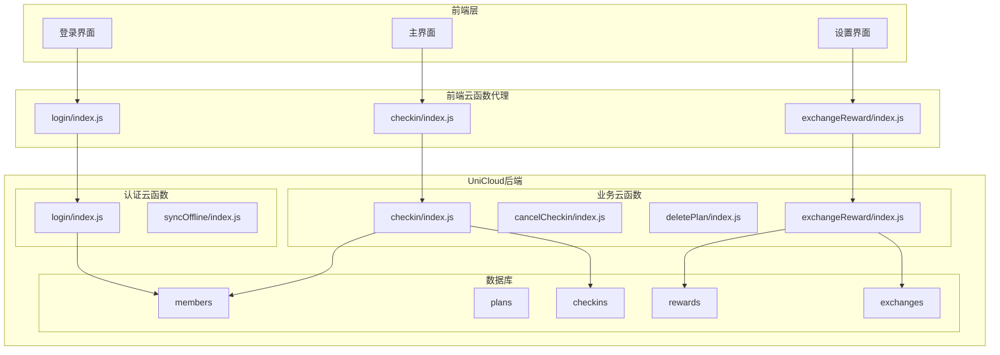

**图表来源**
- [src/cloudfunctions/login/index.js:1-13](file://src/cloudfunctions/login/index.js#L1-L13)
- [src/cloudfunctions/checkin/index.js:1-142](file://src/cloudfunctions/checkin/index.js#L1-L142)
- [src/cloudfunctions/exchangeReward/index.js:1-28](file://src/cloudfunctions/exchangeReward/index.js#L1-L28)

**章节来源**
- [src/cloudfunctions/login/index.js:1-13](file://src/cloudfunctions/login/index.js#L1-L13)
- [src/cloudfunctions/checkin/index.js:1-142](file://src/cloudfunctions/checkin/index.js#L1-L142)
- [src/cloudfunctions/exchangeReward/index.js:1-28](file://src/cloudfunctions/exchangeReward/index.js#L1-L28)

## 核心组件

### 用户认证系统

系统采用微信小程序登录授权机制，通过临时登录凭证换取用户唯一标识。认证流程包括以下关键组件：

1. **登录云函数**：处理微信登录授权，获取用户身份信息
2. **权限验证中间件**：拦截请求，验证用户身份和权限
3. **角色管理系统**：支持家长模式和孩子模式的权限区分
4. **会话管理**：维护用户登录状态和权限信息

### 权限控制系统

系统实现了基于角色的访问控制（RBAC）模型，主要包含：

- **家长角色（parent）**：拥有最高权限，可管理所有功能
- **孩子角色（child）**：有限权限，主要用于日常打卡和查看个人数据
- **权限验证**：在每个业务云函数中进行权限检查

**章节来源**
- [uniCloud-aliyun/cloudfunctions/login/index.js](file://uniCloud-aliyun/cloudfunctions/login/index.js)
- [uniCloud-aliyun/common/const.js](file://uniCloud-aliyun/common/const.js)

## 架构概览

系统采用前后端分离架构，前端通过云函数代理与后端服务通信，后端使用 UniCloud 数据库存储用户数据和业务数据。

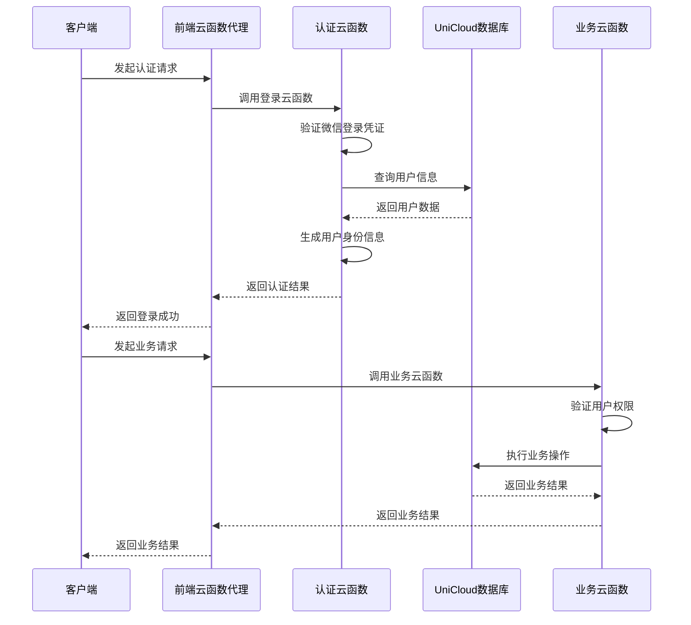

**图表来源**
- [src/cloudfunctions/login/index.js:4-12](file://src/cloudfunctions/login/index.js#L4-L12)
- [uniCloud-aliyun/cloudfunctions/login/index.js](file://uniCloud-aliyun/cloudfunctions/login/index.js)

## 详细组件分析

### 登录认证流程

登录认证是整个系统的入口点，负责验证用户身份并建立会话状态。

#### 登录云函数实现

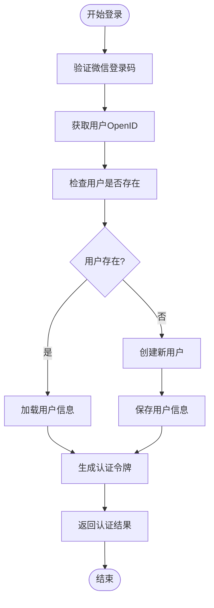

**图表来源**
- [src/cloudfunctions/login/index.js:4-12](file://src/cloudfunctions/login/index.js#L4-L12)

#### 权限验证机制

系统在每个业务云函数中都实现了权限验证逻辑：

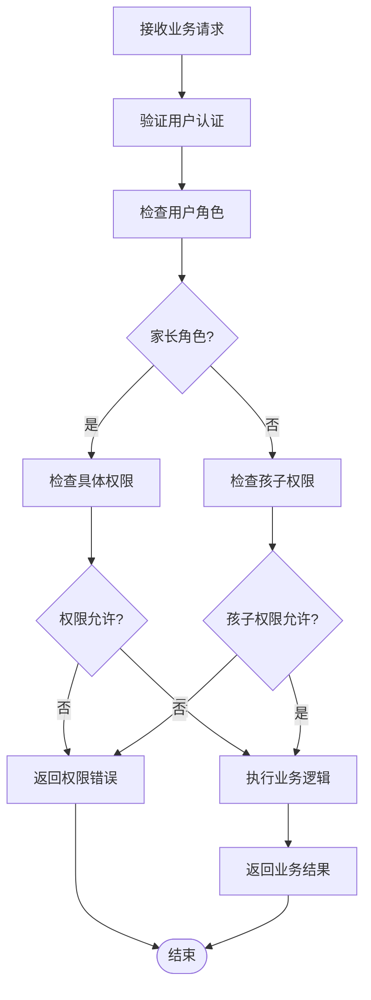

**图表来源**
- [uniCloud-aliyun/cloudfunctions/cancelCheckin/index.js](file://uniCloud-aliyun/cloudfunctions/cancelCheckin/index.js)
- [uniCloud-aliyun/cloudfunctions/deletePlan/index.js](file://uniCloud-aliyun/cloudfunctions/deletePlan/index.js)

**章节来源**
- [src/cloudfunctions/login/index.js:1-13](file://src/cloudfunctions/login/index.js#L1-L13)

### 打卡功能认证

打卡功能实现了完整的权限验证和业务逻辑处理。

#### 打卡云函数架构

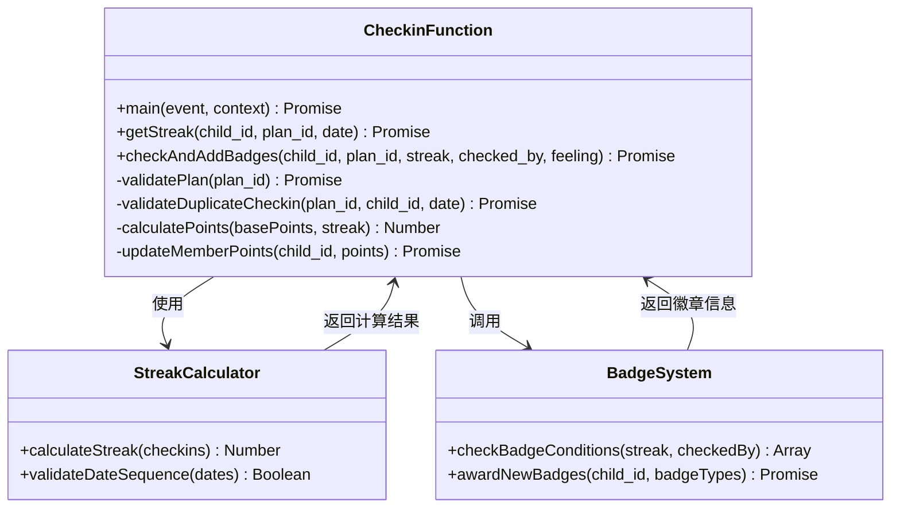

**图表来源**
- [src/cloudfunctions/checkin/index.js:12-83](file://src/cloudfunctions/checkin/index.js#L12-L83)
- [src/cloudfunctions/checkin/index.js:85-141](file://src/cloudfunctions/checkin/index.js#L85-L141)

#### 打卡权限验证流程

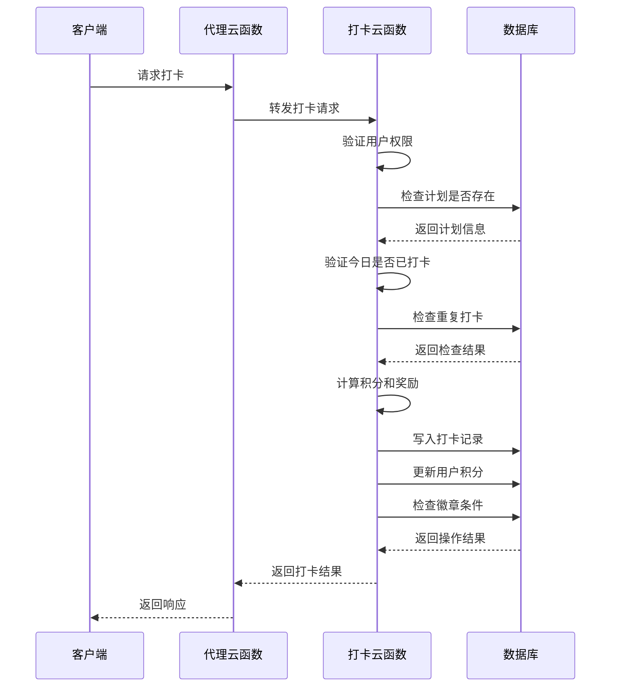

**图表来源**
- [src/cloudfunctions/checkin/index.js:15-82](file://src/cloudfunctions/checkin/index.js#L15-L82)

**章节来源**
- [src/cloudfunctions/checkin/index.js:1-142](file://src/cloudfunctions/checkin/index.js#L1-L142)

### 兑换奖励认证

兑换奖励功能实现了积分验证和权限控制。

#### 兑换流程权限控制

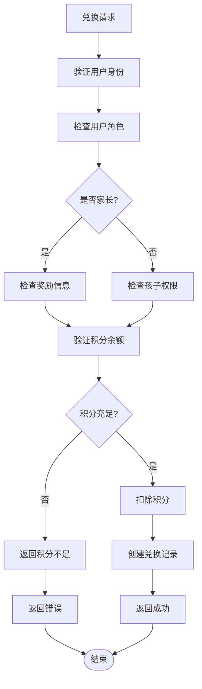

**图表来源**
- [src/cloudfunctions/exchangeReward/index.js:4-19](file://src/cloudfunctions/exchangeReward/index.js#L4-L19)

**章节来源**
- [src/cloudfunctions/exchangeReward/index.js:1-28](file://src/cloudfunctions/exchangeReward/index.js#L1-L28)

### 取消打卡权限验证

取消打卡功能需要严格的权限控制，确保只有相关用户才能取消打卡记录。

#### 取消打卡权限逻辑

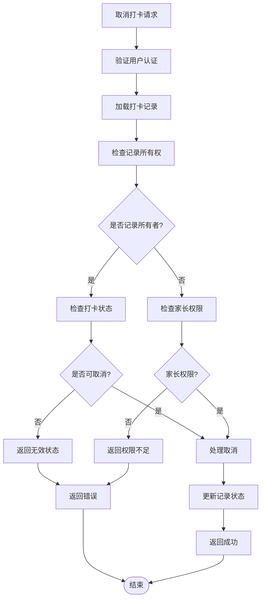

**图表来源**
- [uniCloud-aliyun/cloudfunctions/cancelCheckin/index.js](file://uniCloud-aliyun/cloudfunctions/cancelCheckin/index.js)

### 删除计划权限验证

删除计划功能实现了更严格的权限控制，防止误删重要数据。

#### 删除计划权限控制

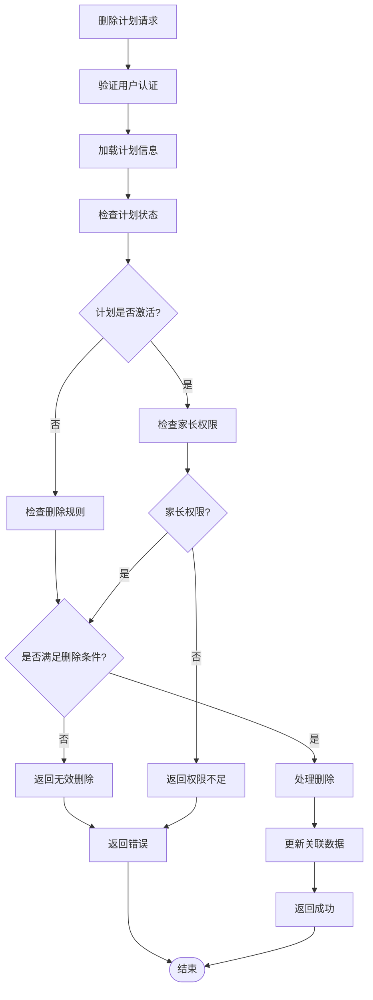

**图表来源**
- [uniCloud-aliyun/cloudfunctions/deletePlan/index.js](file://uniCloud-aliyun/cloudfunctions/deletePlan/index.js)

## 依赖关系分析

系统中的认证相关云函数之间存在复杂的依赖关系，形成了一个完整的认证和权限管理体系。

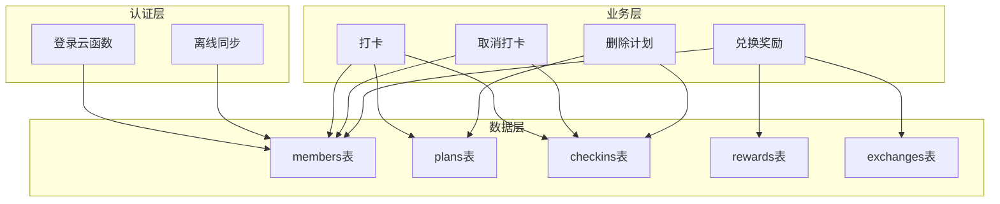

**图表来源**
- [uniCloud-aliyun/cloudfunctions/login/index.js](file://uniCloud-aliyun/cloudfunctions/login/index.js)
- [uniCloud-aliyun/cloudfunctions/checkin/index.js](file://uniCloud-aliyun/cloudfunctions/checkin/index.js)
- [uniCloud-aliyun/cloudfunctions/cancelCheckin/index.js](file://uniCloud-aliyun/cloudfunctions/cancelCheckin/index.js)
- [uniCloud-aliyun/cloudfunctions/deletePlan/index.js](file://uniCloud-aliyun/cloudfunctions/deletePlan/index.js)
- [uniCloud-aliyun/cloudfunctions/exchangeReward/index.js](file://uniCloud-aliyun/cloudfunctions/exchangeReward/index.js)

**章节来源**
- [uniCloud-aliyun/cloudfunctions/login/index.js](file://uniCloud-aliyun/cloudfunctions/login/index.js)
- [uniCloud-aliyun/cloudfunctions/checkin/index.js](file://uniCloud-aliyun/cloudfunctions/checkin/index.js)
- [uniCloud-aliyun/cloudfunctions/cancelCheckin/index.js](file://uniCloud-aliyun/cloudfunctions/cancelCheckin/index.js)
- [uniCloud-aliyun/cloudfunctions/deletePlan/index.js](file://uniCloud-aliyun/cloudfunctions/deletePlan/index.js)
- [uniCloud-aliyun/cloudfunctions/exchangeReward/index.js](file://uniCloud-aliyun/cloudfunctions/exchangeReward/index.js)

## 性能考虑

### 认证性能优化

1. **数据库索引优化**：为常用查询字段建立索引，如 `openid`、`child_id`、`plan_id`
2. **缓存策略**：对频繁访问的用户信息进行缓存
3. **批量操作**：合并多个数据库操作减少往返次数
4. **异步处理**：使用异步操作避免阻塞主线程

### 权限检查优化

1. **早期退出**：在权限验证失败时立即返回，避免后续操作
2. **最小权限原则**：只查询必要的字段和数据
3. **并发控制**：对高并发场景下的权限检查进行优化

## 故障排除指南

### 常见认证问题

1. **登录失败**：检查微信登录凭证的有效性
2. **权限不足**：验证用户角色和具体权限
3. **数据库连接**：检查数据库连接状态和权限
4. **网络超时**：优化网络请求和重试机制

### 错误处理策略

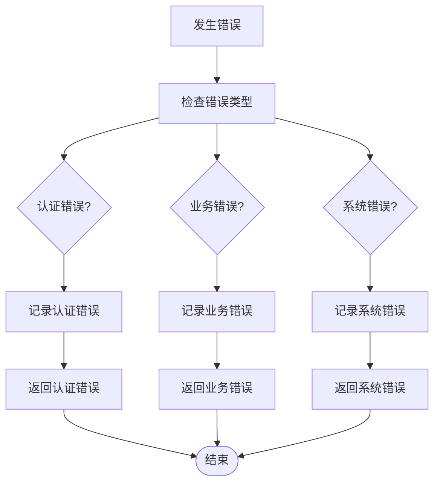

**图表来源**
- [src/cloudfunctions/checkin/index.js:79-82](file://src/cloudfunctions/checkin/index.js#L79-L82)

**章节来源**
- [src/cloudfunctions/checkin/index.js:79-82](file://src/cloudfunctions/checkin/index.js#L79-L82)

## 结论

本认证系统通过完善的权限控制和安全机制，为儿童成长应用提供了可靠的用户认证解决方案。系统采用基于角色的访问控制模型，支持家长和孩子两种模式，确保了数据的安全性和功能的完整性。

通过前端云函数代理、后端云函数处理和数据库存储的分层架构，系统实现了良好的可扩展性和维护性。建议在未来版本中进一步完善安全机制，如增加令牌刷新、防暴力破解等功能。

## 附录

### 数据模型定义

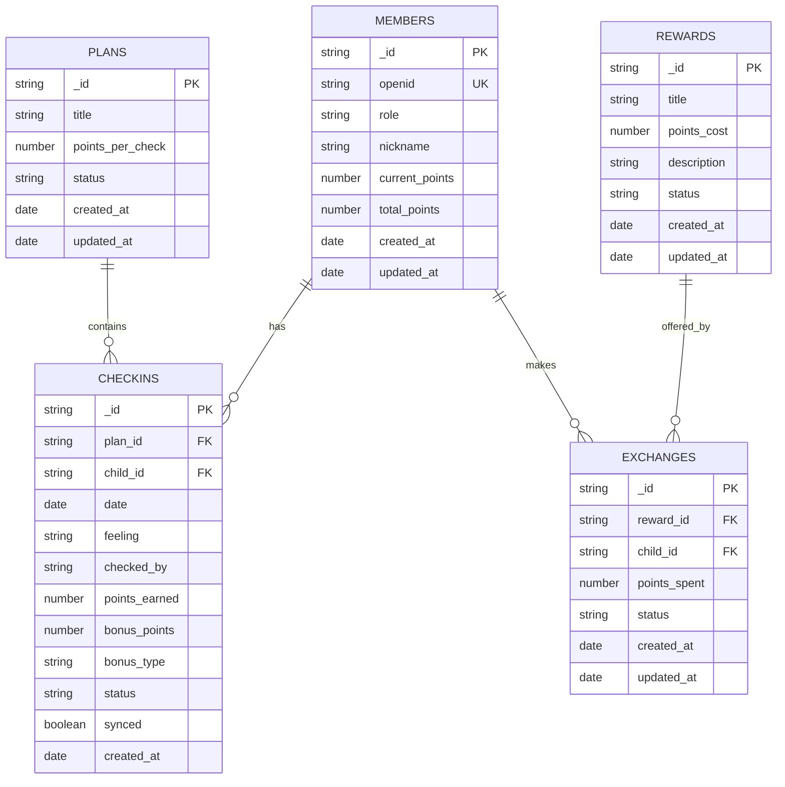

**图表来源**
- [uniCloud-aliyun/database/members.schema.json](file://uniCloud-aliyun/database/members.schema.json)
- [uniCloud-aliyun/database/plans.schema.json](file://uniCloud-aliyun/database/plans.schema.json)
- [uniCloud-aliyun/database/checkins.schema.json](file://uniCloud-aliyun/database/checkins.schema.json)
- [uniCloud-aliyun/database/rewards.schema.json](file://uniCloud-aliyun/database/rewards.schema.json)
- [uniCloud-aliyun/database/exchanges.schema.json](file://uniCloud-aliyun/database/exchanges.schema.json)

### 角色权限矩阵

| 功能 | 家长权限 | 孩子权限 |
|------|----------|----------|
| 登录认证 | ✅ | ✅ |
| 查看个人数据 | ✅ | ✅ |
| 打卡操作 | ✅ | ✅ |
| 取消打卡 | ✅ | ❌ |
| 删除计划 | ✅ | ❌ |
| 兑换奖励 | ✅ | ✅ |
| 管理奖励 | ✅ | ❌ |

**章节来源**
- [uniCloud-aliyun/common/const.js](file://uniCloud-aliyun/common/const.js)