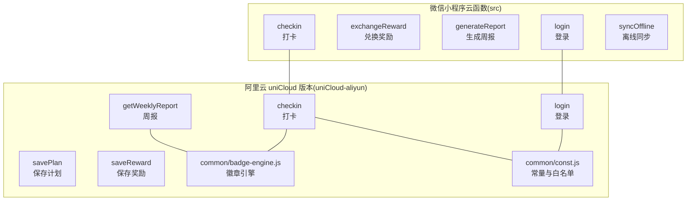
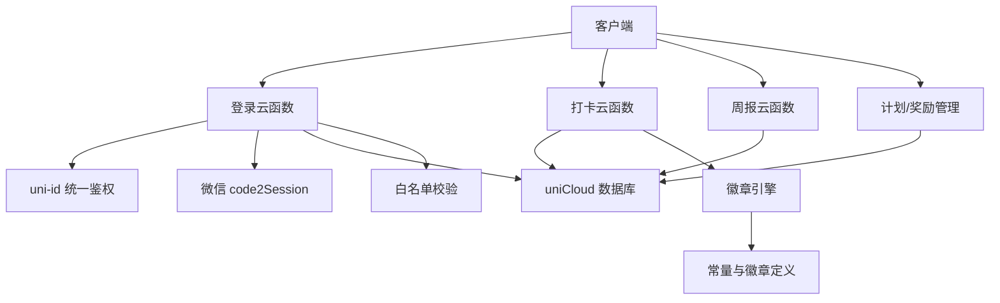
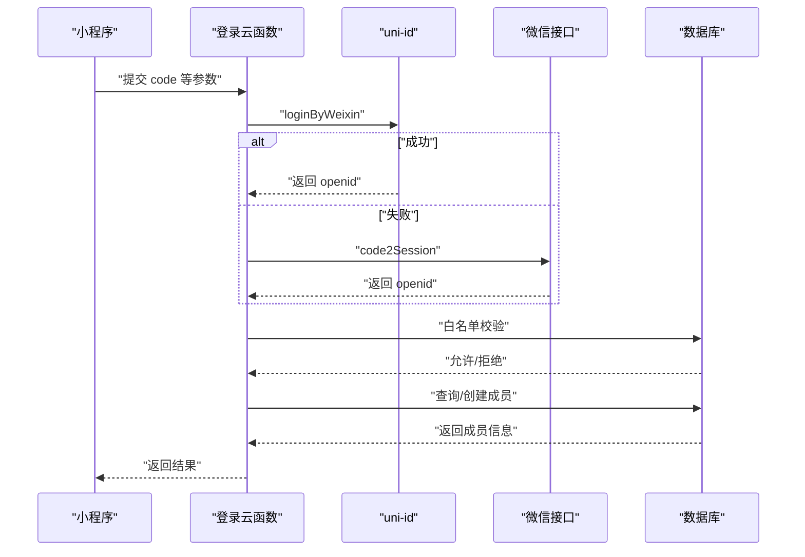
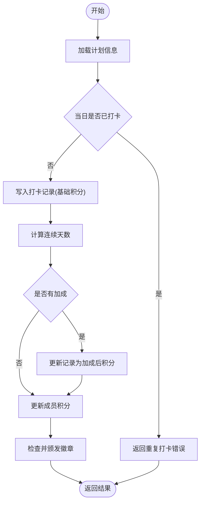
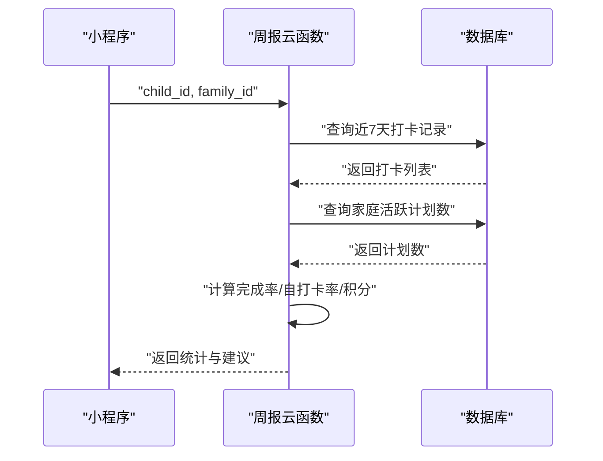
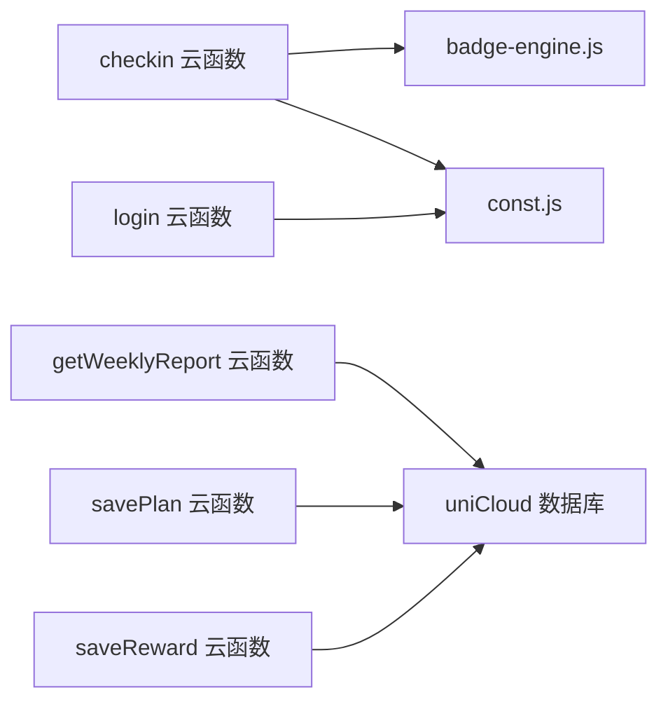

# 云函数开发指南

<cite>
**本文档引用的文件**
- [src/cloudfunctions/checkin/index.js](file://src/cloudfunctions/checkin/index.js)
- [src/cloudfunctions/exchangeReward/index.js](file://src/cloudfunctions/exchangeReward/index.js)
- [src/cloudfunctions/generateReport/index.js](file://src/cloudfunctions/generateReport/index.js)
- [src/cloudfunctions/login/index.js](file://src/cloudfunctions/login/index.js)
- [src/cloudfunctions/syncOffline/index.js](file://src/cloudfunctions/syncOffline/index.js)
- [uniCloud-aliyun/cloudfunctions/checkin/index.js](file://uniCloud-aliyun/cloudfunctions/checkin/index.js)
- [uniCloud-aliyun/cloudfunctions/login/index.js](file://uniCloud-aliyun/cloudfunctions/login/index.js)
- [uniCloud-aliyun/cloudfunctions/getWeeklyReport/index.js](file://uniCloud-aliyun/cloudfunctions/getWeeklyReport/index.js)
- [uniCloud-aliyun/cloudfunctions/savePlan/index.js](file://uniCloud-aliyun/cloudfunctions/savePlan/index.js)
- [uniCloud-aliyun/cloudfunctions/saveReward/index.js](file://uniCloud-aliyun/cloudfunctions/saveReward/index.js)
- [uniCloud-aliyun/common/badge-engine.js](file://uniCloud-aliyun/common/badge-engine.js)
- [uniCloud-aliyun/common/const.js](file://uniCloud-aliyun/common/const.js)
- [src/cloudfunctions/checkin/package.json](file://src/cloudfunctions/checkin/package.json)
- [uniCloud-aliyun/cloudfunctions/common/package.json](file://uniCloud-aliyun/cloudfunctions/common/package.json)
- [package.json](file://package.json)
</cite>

## 目录
1. [简介](#简介)
2. [项目结构](#项目结构)
3. [核心组件](#核心组件)
4. [架构总览](#架构总览)
5. [详细组件分析](#详细组件分析)
6. [依赖关系分析](#依赖关系分析)
7. [性能与冷启动优化](#性能与冷启动优化)
8. [测试与本地调试](#测试与本地调试)
9. [API 设计与返回值规范](#api-设计与返回值规范)
10. [权限验证与数据校验](#权限验证与数据校验)
11. [数据库操作最佳实践与安全策略](#数据库操作最佳实践与安全策略)
12. [错误处理与异常捕获](#错误处理与异常捕获)
13. [监控与日志记录](#监控与日志记录)
14. [部署与版本管理](#部署与版本管理)
15. [结论](#结论)

## 简介
本指南面向 Star Grow 项目的云函数开发者，系统阐述 uniCloud 云函数的设计原则、开发规范、数据库操作最佳实践、安全策略、错误处理、性能优化、测试与本地调试、API 规范、权限与校验、监控日志以及部署与版本管理。文档以仓库中的实际云函数为依据，结合阿里云 uniCloud 的实现细节，帮助团队统一开发标准，提升可维护性与稳定性。

## 项目结构
云函数采用按功能分层的组织方式，分为微信小程序端云函数与阿里云 uniCloud 版本两套实现，核心功能覆盖登录、打卡、周报、计划与奖励管理、离线同步等。

**图表来源**
- [src/cloudfunctions/checkin/index.js:1-142](file://src/cloudfunctions/checkin/index.js#L1-L142)
- [src/cloudfunctions/login/index.js:1-13](file://src/cloudfunctions/login/index.js#L1-L13)
- [uniCloud-aliyun/cloudfunctions/checkin/index.js:1-83](file://uniCloud-aliyun/cloudfunctions/checkin/index.js#L1-L83)
- [uniCloud-aliyun/cloudfunctions/login/index.js:1-103](file://uniCloud-aliyun/cloudfunctions/login/index.js#L1-L103)
- [uniCloud-aliyun/cloudfunctions/getWeeklyReport/index.js:1-46](file://uniCloud-aliyun/cloudfunctions/getWeeklyReport/index.js#L1-L46)
- [uniCloud-aliyun/cloudfunctions/savePlan/index.js:1-31](file://uniCloud-aliyun/cloudfunctions/savePlan/index.js#L1-L31)
- [uniCloud-aliyun/cloudfunctions/saveReward/index.js:1-32](file://uniCloud-aliyun/cloudfunctions/saveReward/index.js#L1-L32)
- [uniCloud-aliyun/common/badge-engine.js:1-125](file://uniCloud-aliyun/common/badge-engine.js#L1-L125)
- [uniCloud-aliyun/common/const.js:1-27](file://uniCloud-aliyun/common/const.js#L1-L27)

**章节来源**
- [src/cloudfunctions/checkin/index.js:1-142](file://src/cloudfunctions/checkin/index.js#L1-L142)
- [uniCloud-aliyun/cloudfunctions/checkin/index.js:1-83](file://uniCloud-aliyun/cloudfunctions/checkin/index.js#L1-L83)
- [uniCloud-aliyun/common/badge-engine.js:1-125](file://uniCloud-aliyun/common/badge-engine.js#L1-L125)
- [uniCloud-aliyun/common/const.js:1-27](file://uniCloud-aliyun/common/const.js#L1-L27)

## 核心组件
- 登录云函数：负责微信登录态换取 openId、白名单校验、成员信息查询/创建与返回。
- 打卡云函数：校验计划存在性与当日重复打卡，计算积分与连续打卡加成，更新成员积分，检查并颁发徽章。
- 周报云函数：统计本周打卡、完成率、自打卡比例等指标，返回家长建议。
- 计划/奖励管理：支持新建与更新计划、奖励，含默认值与状态字段。
- 离线同步：批量导入离线打卡，保证幂等与冲突处理。
- 公共模块：徽章引擎（连续打卡计算、加成、徽章颁发）、常量与白名单校验。

**章节来源**
- [src/cloudfunctions/login/index.js:1-13](file://src/cloudfunctions/login/index.js#L1-L13)
- [uniCloud-aliyun/cloudfunctions/login/index.js:1-103](file://uniCloud-aliyun/cloudfunctions/login/index.js#L1-L103)
- [src/cloudfunctions/checkin/index.js:1-142](file://src/cloudfunctions/checkin/index.js#L1-L142)
- [uniCloud-aliyun/cloudfunctions/checkin/index.js:1-83](file://uniCloud-aliyun/cloudfunctions/checkin/index.js#L1-L83)
- [uniCloud-aliyun/cloudfunctions/getWeeklyReport/index.js:1-46](file://uniCloud-aliyun/cloudfunctions/getWeeklyReport/index.js#L1-L46)
- [uniCloud-aliyun/cloudfunctions/savePlan/index.js:1-31](file://uniCloud-aliyun/cloudfunctions/savePlan/index.js#L1-L31)
- [uniCloud-aliyun/cloudfunctions/saveReward/index.js:1-32](file://uniCloud-aliyun/cloudfunctions/saveReward/index.js#L1-L32)
- [uniCloud-aliyun/common/badge-engine.js:1-125](file://uniCloud-aliyun/common/badge-engine.js#L1-L125)
- [uniCloud-aliyun/common/const.js:1-27](file://uniCloud-aliyun/common/const.js#L1-L27)

## 架构总览
云函数通过 uniCloud 数据库进行读写，部分功能复用公共模块；登录流程可调用 uni-id 统一鉴权，或回退到微信 code2Session；徽章系统独立于业务逻辑，便于扩展。

**图表来源**
- [uniCloud-aliyun/cloudfunctions/login/index.js:10-56](file://uniCloud-aliyun/cloudfunctions/login/index.js#L10-L56)
- [uniCloud-aliyun/cloudfunctions/checkin/index.js:1-83](file://uniCloud-aliyun/cloudfunctions/checkin/index.js#L1-L83)
- [uniCloud-aliyun/common/badge-engine.js:1-125](file://uniCloud-aliyun/common/badge-engine.js#L1-L125)
- [uniCloud-aliyun/common/const.js:1-27](file://uniCloud-aliyun/common/const.js#L1-L27)

## 详细组件分析

### 登录云函数
- 功能要点
  - 接收小程序端传入的 code，优先调用 uni-id 获取 openId；若未配置则回退至微信官方接口。
  - 白名单校验：仅允许白名单内的 openId 登录。
  - 成员信息：根据 memberId 或 openId 查询/创建成员，返回完整用户信息。
- 参数与返回
  - 输入：code、nickname、role、memberId、avatarUrl 等。
  - 输出：success、data（包含成员信息）或错误信息。
- 安全与校验
  - 白名单拒绝策略，避免未授权访问。
  - openId 为空时拒绝登录。
- 可扩展点
  - 支持多角色（child/parent/admin）与家庭隔离（family_id）。

**图表来源**
- [uniCloud-aliyun/cloudfunctions/login/index.js:10-102](file://uniCloud-aliyun/cloudfunctions/login/index.js#L10-L102)

**章节来源**
- [uniCloud-aliyun/cloudfunctions/login/index.js:1-103](file://uniCloud-aliyun/cloudfunctions/login/index.js#L1-L103)

### 打卡云函数
- 功能要点
  - 校验计划存在性与当日重复打卡。
  - 计算基础积分与连续打卡加成，写入打卡记录。
  - 更新成员积分（当前积分与历史总计）。
  - 检查并颁发徽章（含自主打卡、连续打卡、分类覆盖、感受记录等）。
- 参数与返回
  - 输入：plan_id、child_id、date、checked_by、feeling 等。
  - 输出：success、data（包含本次积分、加成、新徽章、当前连击等）。
- 关键算法
  - 连续打卡天数计算：从最近记录向前逐日推算，要求最后一天必须是当天或昨天。
  - 加成规则：按阈值阶梯累加。
  - 徽章判定：基于连击、自打、感受连续、一周内覆盖类别等条件。

**图表来源**
- [uniCloud-aliyun/cloudfunctions/checkin/index.js:5-82](file://uniCloud-aliyun/cloudfunctions/checkin/index.js#L5-L82)
- [uniCloud-aliyun/common/badge-engine.js:52-122](file://uniCloud-aliyun/common/badge-engine.js#L52-L122)

**章节来源**
- [src/cloudfunctions/checkin/index.js:1-142](file://src/cloudfunctions/checkin/index.js#L1-L142)
- [uniCloud-aliyun/cloudfunctions/checkin/index.js:1-83](file://uniCloud-aliyun/cloudfunctions/checkin/index.js#L1-L83)
- [uniCloud-aliyun/common/badge-engine.js:1-125](file://uniCloud-aliyun/common/badge-engine.js#L1-L125)

### 周报云函数
- 功能要点
  - 统计本周打卡数量、完成率、获得积分、自打卡比例等。
  - 返回家长建议语句。
- 参数与返回
  - 输入：child_id、family_id。
  - 输出：success、data（stats、parent_tip）。

**图表来源**
- [uniCloud-aliyun/cloudfunctions/getWeeklyReport/index.js:4-45](file://uniCloud-aliyun/cloudfunctions/getWeeklyReport/index.js#L4-L45)

**章节来源**
- [uniCloud-aliyun/cloudfunctions/getWeeklyReport/index.js:1-46](file://uniCloud-aliyun/cloudfunctions/getWeeklyReport/index.js#L1-L46)

### 计划与奖励管理
- 保存计划
  - 支持新建与更新，设置默认值与状态字段。
- 保存奖励
  - 支持新建与更新，库存字段支持无限制标记。

**章节来源**
- [uniCloud-aliyun/cloudfunctions/savePlan/index.js:1-31](file://uniCloud-aliyun/cloudfunctions/savePlan/index.js#L1-L31)
- [uniCloud-aliyun/cloudfunctions/saveReward/index.js:1-32](file://uniCloud-aliyun/cloudfunctions/saveReward/index.js#L1-L32)

### 离线同步
- 功能要点
  - 批量导入离线打卡，逐条去重，保证幂等。
  - 统计同步成功/失败/冲突数量，返回新增积分与新徽章。

**章节来源**
- [src/cloudfunctions/syncOffline/index.js:1-20](file://src/cloudfunctions/syncOffline/index.js#L1-L20)

## 依赖关系分析
- 模块化与复用
  - 打卡流程复用徽章引擎与常量定义，降低重复逻辑。
  - 登录流程依赖 uni-id 与微信接口，白名单校验集中于常量模块。
- 外部依赖
  - 微信 code2Session 接口用于登录态换取 openId。
  - uni-id 提供统一登录能力（可选）。

**图表来源**
- [uniCloud-aliyun/cloudfunctions/checkin/index.js:1-83](file://uniCloud-aliyun/cloudfunctions/checkin/index.js#L1-L83)
- [uniCloud-aliyun/common/badge-engine.js:1-125](file://uniCloud-aliyun/common/badge-engine.js#L1-L125)
- [uniCloud-aliyun/common/const.js:1-27](file://uniCloud-aliyun/common/const.js#L1-L27)
- [uniCloud-aliyun/cloudfunctions/getWeeklyReport/index.js:1-46](file://uniCloud-aliyun/cloudfunctions/getWeeklyReport/index.js#L1-L46)
- [uniCloud-aliyun/cloudfunctions/savePlan/index.js:1-31](file://uniCloud-aliyun/cloudfunctions/savePlan/index.js#L1-L31)
- [uniCloud-aliyun/cloudfunctions/saveReward/index.js:1-32](file://uniCloud-aliyun/cloudfunctions/saveReward/index.js#L1-L32)

**章节来源**
- [uniCloud-aliyun/common/badge-engine.js:1-125](file://uniCloud-aliyun/common/badge-engine.js#L1-L125)
- [uniCloud-aliyun/common/const.js:1-27](file://uniCloud-aliyun/common/const.js#L1-L27)

## 性能与冷启动优化
- 优化策略
  - 将可复用逻辑下沉至公共模块，减少重复计算与分支判断。
  - 使用数据库命令（如自增）原子更新，避免读取-修改-写入的竞态。
  - 合理使用索引字段（如 plan_id、child_id、date），减少扫描范围。
  - 对批量操作（如离线同步）采用循环内幂等检查，避免重复写入。
  - 在登录流程中优先使用 uni-id，减少网络往返与异常分支处理。
- 冷启动
  - 将热点函数置于同一云函数实例，减少跨实例调用。
  - 避免在入口处做重型初始化，延迟到首次调用时按需加载。

[本节为通用指导，无需特定文件引用]

## 测试与本地调试
- 单元测试
  - 对纯函数（如连续天数计算、加成规则）编写独立测试，输入边界值与典型场景。
- 集成测试
  - 使用数据库快照与事务模拟真实场景，覆盖重复打卡、跨日边界、自打与他人打等分支。
- 本地调试
  - 利用 uniCloud CLI 或 IDE 插件进行本地联调，模拟事件参数与数据库环境。
  - 对登录流程，准备白名单数据与 openId，验证拒绝与放行逻辑。
- 日志与追踪
  - 在关键路径输出结构化日志，便于定位问题与审计。

[本节为通用指导，无需特定文件引用]

## API 设计与返回值规范
- 统一返回结构
  - 成功：{ success: true, data: any }
  - 失败：{ success: false, error: string, message?: string }
- 参数命名
  - 明确必填与可选字段，避免歧义。
  - 字段类型与取值范围清晰，必要时提供示例。
- 错误码约定
  - 重复打卡、积分不足、白名单拒绝等常见错误应有稳定的消息文本，便于前端统一提示。

[本节为通用指导，无需特定文件引用]

## 权限验证与数据校验
- 登录态校验
  - 通过 openId 识别用户身份，结合白名单控制访问。
- 数据域隔离
  - 使用 family_id 隔离不同家庭的数据，避免越权。
- 参数校验
  - 对关键字段（如 child_id、plan_id、date）进行存在性与格式校验。
- 幂等性
  - 打卡与离线同步需保证重复请求不产生副作用。

**章节来源**
- [uniCloud-aliyun/cloudfunctions/login/index.js:50-56](file://uniCloud-aliyun/cloudfunctions/login/index.js#L50-L56)
- [uniCloud-aliyun/cloudfunctions/checkin/index.js:14-20](file://uniCloud-aliyun/cloudfunctions/checkin/index.js#L14-L20)

## 数据库操作最佳实践与安全策略
- 最佳实践
  - 使用数据库命令（如自增）替代读取-修改-写入，降低并发风险。
  - 合理使用 where 条件与排序，限制查询范围与数量。
  - 对高频查询建立索引（如日期、计划与成员关联字段）。
- 安全策略
  - 白名单校验与家庭隔离双保险。
  - 敏感字段（如 openId）仅在必要时写入与返回。
  - 对外部接口（微信 code2Session）增加超时与重试策略。

**章节来源**
- [uniCloud-aliyun/cloudfunctions/checkin/index.js:62-65](file://uniCloud-aliyun/cloudfunctions/checkin/index.js#L62-L65)
- [uniCloud-aliyun/common/const.js:19-24](file://uniCloud-aliyun/common/const.js#L19-L24)

## 错误处理与异常捕获
- 结构化错误
  - 统一返回 { success: false, error }，并在日志中记录堆栈。
- 分层处理
  - 网络与第三方接口异常（如微信 code2Session）需分别捕获与降级。
- 用户友好提示
  - 将技术错误映射为可理解的业务提示（如“今日已打卡”、“积分不足”）。

**章节来源**
- [src/cloudfunctions/checkin/index.js:79-82](file://src/cloudfunctions/checkin/index.js#L79-L82)
- [uniCloud-aliyun/cloudfunctions/login/index.js:25-47](file://uniCloud-aliyun/cloudfunctions/login/index.js#L25-L47)

## 监控与日志记录
- 日志
  - 关键路径输出结构化日志（时间戳、函数名、参数摘要、耗时、结果状态）。
- 监控
  - 关注成功率、平均耗时、错误分布与异常峰值。
- 告警
  - 对登录失败、白名单拒绝、数据库写入异常设置阈值告警。

[本节为通用指导，无需特定文件引用]

## 部署与版本管理
- 部署流程
  - 使用 uniCloud 控制台或 CLI 进行云函数发布，确保数据库 schema 与权限配置一致。
- 版本管理
  - 采用语义化版本号，重要变更打标签，保留回滚路径。
- 发布策略
  - 先灰度到部分 openId 或家庭，观察指标后再全量发布。

[本节为通用指导，无需特定文件引用]

## 结论
本指南总结了 Star Grow 云函数的开发规范与最佳实践，涵盖从设计原则、数据库操作、安全策略、错误处理、性能优化、测试调试到部署与监控的全流程。建议团队在日常开发中严格遵循统一的 API 规范与返回值结构，将热点逻辑下沉至公共模块，持续完善白名单与家庭隔离策略，保障系统的可维护性与安全性。