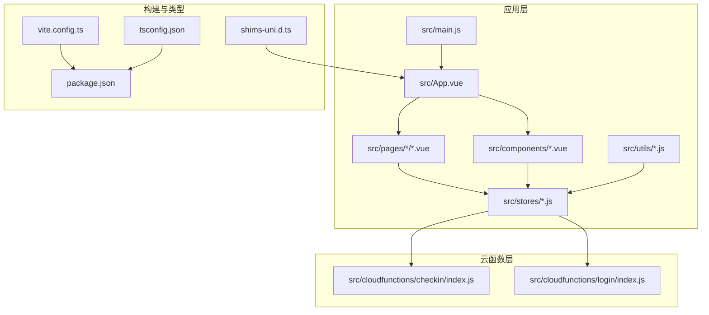
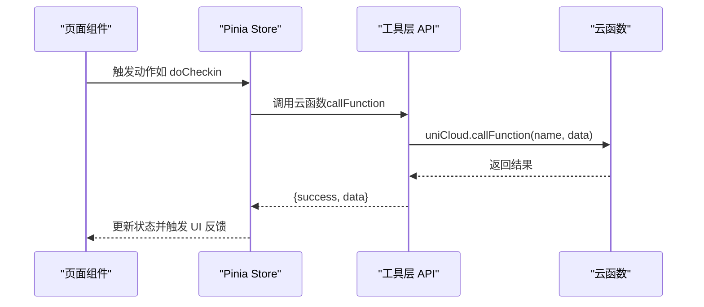
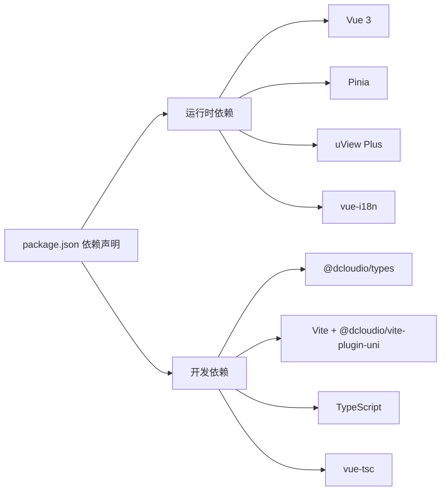

# 代码规范

<cite>
**本文引用的文件**
- [package.json](file://package.json)
- [tsconfig.json](file://tsconfig.json)
- [vite.config.ts](file://vite.config.ts)
- [shims-uni.d.ts](file://shims-uni.d.ts)
- [src/main.js](file://src/main.js)
- [src/App.vue](file://src/App.vue)
- [src/components/BadgeCard.vue](file://src/components/BadgeCard.vue)
- [src/stores/checkins.js](file://src/stores/checkins.js)
- [src/utils/api.js](file://src/utils/api.js)
- [src/pages/guide/index.vue](file://src/pages/guide/index.vue)
- [src/cloudfunctions/checkin/index.js](file://src/cloudfunctions/checkin/index.js)
- [src/cloudfunctions/login/index.js](file://src/cloudfunctions/login/index.js)
- [src/static/tab-icons-placeholder.js](file://src/static/tab-icons-placeholder.js)
</cite>

## 目录
1. 引言
2. 项目结构
3. 核心组件
4. 架构总览
5. 详细组件分析
6. 依赖分析
7. 性能考虑
8. 故障排查指南
9. 结论
10. 附录

## 引言
本规范面向 Star Grow 项目，统一 JavaScript/Vue 代码的命名约定、ES6+ 最佳实践、Vue 组件编写规范、TypeScript 配置与使用、注释与文档注释标准、代码格式化与自动化检查流程、Git 提交消息与分支管理策略，以及代码审查清单与质量保证标准。旨在提升团队协作效率、可维护性与一致性。

## 项目结构
项目采用 UniApp + Vue 3 + Pinia + TypeScript 的技术栈，前端源码位于 src 目录，云函数位于 src/cloudfunctions 与 uniCloud-aliyun/cloudfunctions。构建工具使用 Vite 插件 @dcloudio/vite-plugin-uni，类型声明通过 @dcloudio/types 与自定义 shims-uni.d.ts 注入。

**图表来源**
- [src/main.js:1-11](file://src/main.js#L1-L11)
- [src/App.vue:1-64](file://src/App.vue#L1-L64)
- [vite.config.ts:1-8](file://vite.config.ts#L1-L8)
- [tsconfig.json:1-14](file://tsconfig.json#L1-L14)
- [shims-uni.d.ts:1-11](file://shims-uni.d.ts#L1-L11)
- [package.json:1-74](file://package.json#L1-L74)

**章节来源**
- [package.json:1-74](file://package.json#L1-L74)
- [tsconfig.json:1-14](file://tsconfig.json#L1-L14)
- [vite.config.ts:1-8](file://vite.config.ts#L1-L8)
- [shims-uni.d.ts:1-11](file://shims-uni.d.ts#L1-L11)
- [src/main.js:1-11](file://src/main.js#L1-L11)
- [src/App.vue:1-64](file://src/App.vue#L1-L64)

## 核心组件
- 应用入口与全局初始化：在应用启动时进行平台环境判断与云开发初始化，并在前台显示时触发离线数据同步。
- 存储层：使用 Pinia 管理状态，如打卡、积分、用户等；提供异步数据拉取、离线队列处理与本地缓存。
- 工具层：统一封装云函数调用，提供错误兜底与统一返回结构。
- 页面与组件：页面采用单文件组件结构，组件以功能划分，遵循 props、事件与样式的清晰边界。

**章节来源**
- [src/App.vue:1-64](file://src/App.vue#L1-L64)
- [src/stores/checkins.js:1-163](file://src/stores/checkins.js#L1-L163)
- [src/utils/api.js:1-18](file://src/utils/api.js#L1-L18)
- [src/pages/guide/index.vue:1-30](file://src/pages/guide/index.vue#L1-L30)

## 架构总览
前端通过 Pinia Store 与云函数交互，Store 中封装网络请求、本地缓存与 UI 响应逻辑；页面组件通过组合式 API 使用 Store 并渲染视图；全局样式与主题在 App.vue 中集中定义。

**图表来源**
- [src/stores/checkins.js:26-89](file://src/stores/checkins.js#L26-L89)
- [src/utils/api.js:9-17](file://src/utils/api.js#L9-L17)

## 详细组件分析

### 命名约定与文件组织
- 目录与文件命名
  - 页面与组件：采用 kebab-case（如 pages/guide/index.vue），组件文件使用 PascalCase（如 BadgeCard.vue）。
  - 存储模块：使用小驼峰命名（如 checkins.js），导出使用 useXxxStore 形式。
  - 工具模块：使用小驼峰命名（如 api.js）。
  - 云函数：目录与文件同名（如 checkin/index.js）。
- 变量与函数
  - 常量使用全大写下划线（如 STREAK_BONUS）。
  - 函数使用小驼峰命名（如 formatDate、doCheckin）。
  - Promise/异步函数以 doXxx/获取数据类函数以 fetchXxx/getXxx 命名。
- 组件
  - 单文件组件结构：template/script/setup/style，props 使用 defineProps，方法在 script setup 中定义。
  - 样式作用域：组件样式使用 scoped，避免全局污染。

**章节来源**
- [src/components/BadgeCard.vue:1-37](file://src/components/BadgeCard.vue#L1-L37)
- [src/stores/checkins.js:1-163](file://src/stores/checkins.js#L1-L163)
- [src/utils/api.js:1-18](file://src/utils/api.js#L1-L18)
- [src/pages/guide/index.vue:1-30](file://src/pages/guide/index.vue#L1-L30)

### ES6+ 语法最佳实践
- 模块化与导入导出：统一使用 ES Module 导入导出，避免混用 require。
- 解构赋值：对对象属性与数组元素进行解构，提升可读性。
- 模板字符串：用于拼接字符串，减少 + 拼接。
- 箭头函数：在回调中优先使用箭头函数，保持 this 上下文稳定。
- Promise/async-await：统一使用 async/await 处理异步，避免深层回调。
- 可选链与空值合并：在访问深层对象或不确定值时使用可选链与空值合并。
- 数组与对象方法：优先使用 map/filter/reduce/find 等函数式方法。

**章节来源**
- [src/stores/checkins.js:14-24](file://src/stores/checkins.js#L14-L24)
- [src/stores/checkins.js:26-89](file://src/stores/checkins.js#L26-L89)
- [src/utils/api.js:9-17](file://src/utils/api.js#L9-L17)

### Vue 组件编写规范
- 单文件组件结构
  - template：语义化标签，避免过度嵌套，使用 class 与动态类控制样式。
  - script setup：使用 defineProps 定义输入，内部函数在 script setup 中声明。
  - style：scoped 样式，组件样式局部生效；全局样式集中在 App.vue。
- Props 与事件
  - 明确 props 类型与默认值；子组件通过 emits 与父组件通信。
- 生命周期与副作用
  - 在 onLaunch/onShow 等生命周期钩子中执行初始化与前台恢复逻辑。
- 数据流
  - Store 管理状态，组件只负责展示与交互，避免直接操作全局状态。

**章节来源**
- [src/components/BadgeCard.vue:1-37](file://src/components/BadgeCard.vue#L1-L37)
- [src/App.vue:1-64](file://src/App.vue#L1-L64)

### TypeScript 配置与使用规范
- 编译选项
  - 继承 @vue/tsconfig，启用 sourceMap，配置路径别名 @/* 指向 ./src/*。
  - lib 包含 esnext 与 dom，types 引入 @dcloudio/types。
- 类型声明
  - 使用 shims-uni.d.ts 注入 UniApp 类型扩展，确保在 Vue 组合式 API 中获得正确类型提示。
- 项目脚本
  - type-check 使用 vue-tsc 进行类型检查，建议在 CI 中执行。

**章节来源**
- [tsconfig.json:1-14](file://tsconfig.json#L1-L14)
- [shims-uni.d.ts:1-11](file://shims-uni.d.ts#L1-L11)
- [package.json:37-37](file://package.json#L37-L37)

### 注释与文档注释规范
- 文件级注释：在文件顶部添加简要说明与用途，便于快速理解。
- 函数注释：使用 JSDoc 风格，标注参数类型、返回值与异常情况。
- 重要逻辑注释：对复杂算法、业务规则与边界条件进行说明。
- 云函数注释：明确入参、处理逻辑与返回结构，便于前后端对接。

示例参考：
- [src/utils/api.js:3-8](file://src/utils/api.js#L3-L8)
- [src/cloudfunctions/checkin/index.js:1-3](file://src/cloudfunctions/checkin/index.js#L1-L3)

**章节来源**
- [src/utils/api.js:1-18](file://src/utils/api.js#L1-L18)
- [src/cloudfunctions/checkin/index.js:1-142](file://src/cloudfunctions/checkin/index.js#L1-L142)

### 代码格式化与自动化检查流程
- 构建与运行
  - 使用 Vite 插件 @dcloudio/vite-plugin-uni 进行多端构建与开发。
  - 通过 npm scripts 提供多端 dev/build 脚本，统一命令入口。
- 类型检查
  - 通过 type-check 脚本执行 vue-tsc，确保类型安全。
- 建议补充
  - 在项目中引入 ESLint 与 Prettier，配合 husky/pre-commit 在提交前自动格式化与静态检查。
  - 在 CI 中增加 type-check、lint 与单元测试步骤，保障质量。

**章节来源**
- [vite.config.ts:1-8](file://vite.config.ts#L1-L8)
- [package.json:4-37](file://package.json#L4-L37)
- [package.json:37-37](file://package.json#L37-L37)

### Git 提交消息规范与分支管理策略
- 提交消息规范（参考 Conventional Commits）
  - 类型：feat、fix、docs、style、refactor、perf、test、build、ci、chore、revert
  - 范围：可选，描述改动范围（如 store、component、cloudfunction）
  - 描述：简洁明了，使用动宾结构
  - 示例：feat(store): 添加积分状态管理；fix(component): 修复 BadgeCard 样式问题
- 分支管理策略
  - main：发布分支，保持稳定
  - develop：开发分支，集成特性
  - feature/*：特性分支，按功能拆分
  - hotfix/*：紧急修复分支
  - 代码合并：通过 Pull Request 进行审查，合并前确保通过 lint、类型检查与测试

[本节为通用规范说明，无需列出章节来源]

### 代码审查清单与质量保证标准
- 代码质量
  - 命名清晰、职责单一、函数长度适中
  - 避免魔法数字与字符串，使用常量与枚举
  - 错误处理完整，UI 反馈明确
- 可维护性
  - 组件拆分合理，props 与事件边界清晰
  - Store 逻辑可测试，必要时拆分为多个小 Store
- 安全性
  - 云函数入参校验，避免未授权访问
  - 敏感信息不打印到日志
- 性能
  - 避免不必要的重渲染，合理使用 computed 与 watch
  - 离线场景提供本地缓存与同步队列
- 文档与注释
  - 关键函数与云函数具备 JSDoc 注释
  - 复杂业务逻辑添加注释说明

**章节来源**
- [src/stores/checkins.js:1-163](file://src/stores/checkins.js#L1-L163)
- [src/utils/api.js:1-18](file://src/utils/api.js#L1-L18)
- [src/cloudfunctions/checkin/index.js:1-142](file://src/cloudfunctions/checkin/index.js#L1-L142)

## 依赖分析
- 运行时依赖
  - Vue 3、Pinia、uView Plus、vue-i18n 等，提供响应式与状态管理能力。
- 开发依赖
  - @dcloudio/types、@dcloudio/vite-plugin-uni、typescript、vite、vue-tsc 等，支撑类型系统与构建。
- 云函数
  - 使用 wx-server-sdk 与数据库命令，实现业务逻辑与数据持久化。

**图表来源**
- [package.json:39-72](file://package.json#L39-L72)

**章节来源**
- [package.json:1-74](file://package.json#L1-L74)

## 性能考虑
- 渲染优化
  - 合理拆分组件，避免不必要的整页重渲染；使用 v-if/v-show 控制条件渲染。
- 状态管理
  - 将派生状态放入 computed，避免重复计算；按需加载数据，减少 Store 冗余字段。
- 网络与缓存
  - 对频繁调用的接口进行缓存；离线场景使用本地存储与同步队列。
- 云函数
  - 查询时使用索引与限制数量，避免全表扫描；批量写入时注意事务与幂等性。

[本节为通用性能指导，无需列出章节来源]

## 故障排查指南
- 云函数调用失败
  - 检查云函数名称与参数是否正确；查看返回结构中的 success 字段与错误信息。
  - 参考：[src/utils/api.js:9-17](file://src/utils/api.js#L9-L17)
- 打卡流程异常
  - 确认当天是否已打卡；检查积分更新与勋章解锁逻辑；离线场景确认本地缓存与同步队列。
  - 参考：[src/stores/checkins.js:14-24](file://src/stores/checkins.js#L14-L24)，[src/stores/checkins.js:26-89](file://src/stores/checkins.js#L26-L89)
- 登录流程
  - 当前云函数为占位实现，需补充获取 openid 与成员查询/创建逻辑。
  - 参考：[src/cloudfunctions/login/index.js:1-13](file://src/cloudfunctions/login/index.js#L1-L13)
- tabBar 图标
  - 当前为占位文件，需在 static 目录下提供 PNG 图标文件。
  - 参考：[src/static/tab-icons-placeholder.js:1-10](file://src/static/tab-icons-placeholder.js#L1-L10)

**章节来源**
- [src/utils/api.js:1-18](file://src/utils/api.js#L1-L18)
- [src/stores/checkins.js:1-163](file://src/stores/checkins.js#L1-L163)
- [src/cloudfunctions/login/index.js:1-13](file://src/cloudfunctions/login/index.js#L1-L13)
- [src/static/tab-icons-placeholder.js:1-10](file://src/static/tab-icons-placeholder.js#L1-L10)

## 结论
本规范基于现有代码库提炼出命名、结构、类型、注释、构建与质量保障等方面的统一标准。建议在团队内推广并持续演进，结合 ESLint/Prettier 与 CI 流水线进一步强化质量控制。

## 附录
- 常量与规则
  - 常量使用全大写下划线（如 STREAK_BONUS）
  - 组件文件使用 PascalCase（如 BadgeCard.vue）
  - 页面文件使用 kebab-case（如 pages/guide/index.vue）
  - Store 文件使用小驼峰（如 checkins.js）