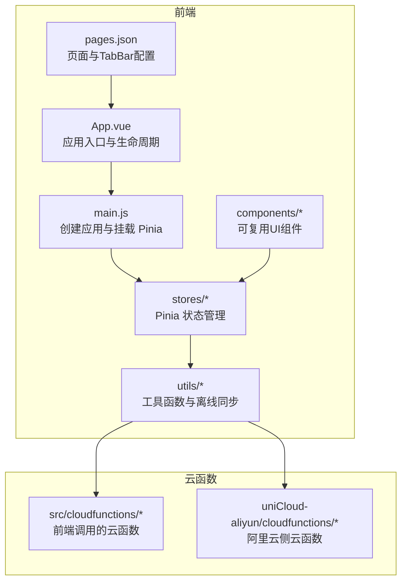
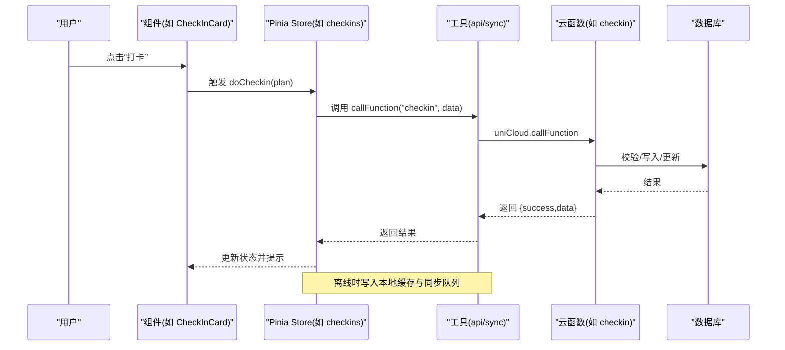
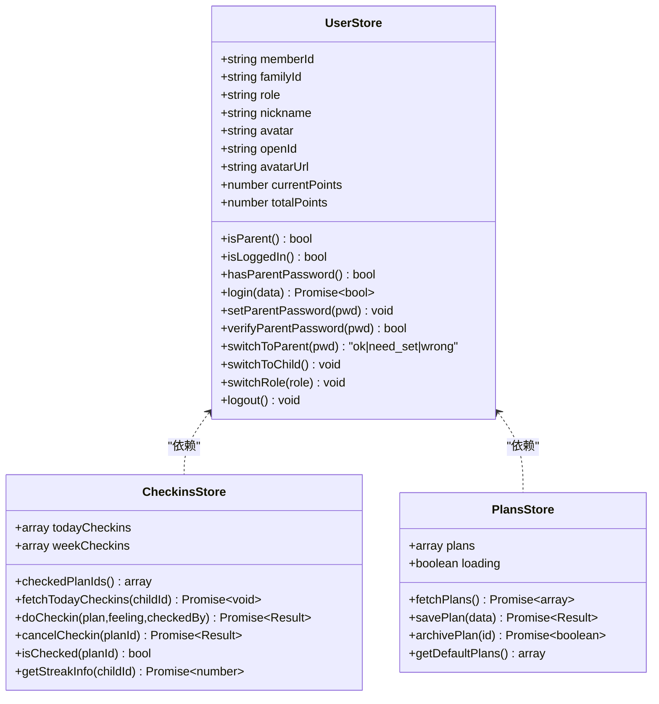
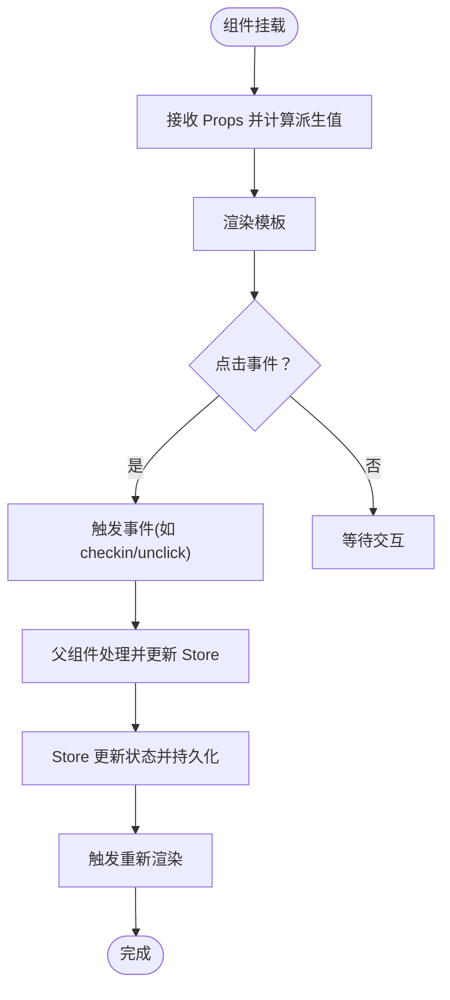
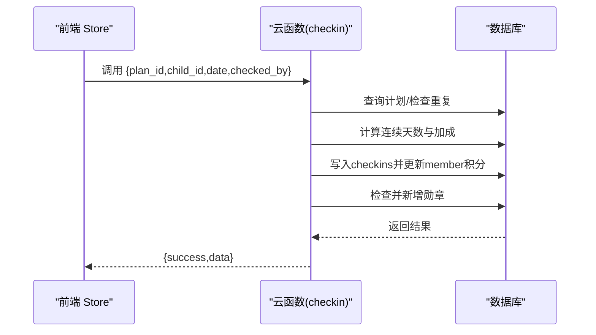
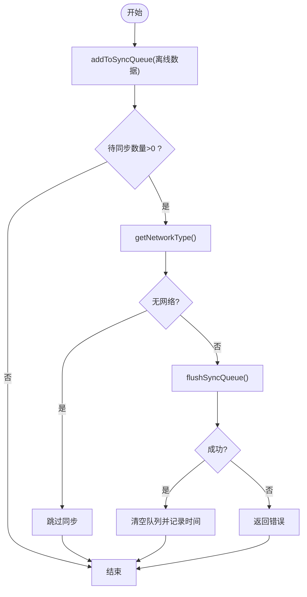
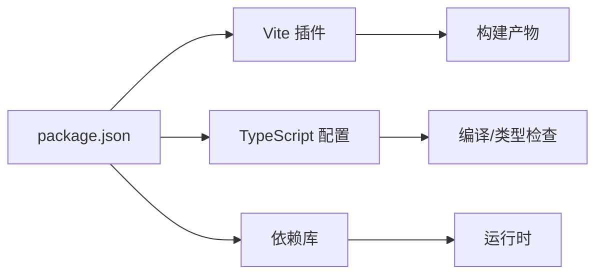

# 开发指南

<cite>
**本文引用的文件**
- [package.json](file://package.json)
- [vite.config.ts](file://vite.config.ts)
- [tsconfig.json](file://tsconfig.json)
- [src/main.js](file://src/main.js)
- [src/App.vue](file://src/App.vue)
- [src/pages.json](file://src/pages.json)
- [src/stores/user.js](file://src/stores/user.js)
- [src/stores/checkins.js](file://src/stores/checkins.js)
- [src/stores/plans.js](file://src/stores/plans.js)
- [src/utils/api.js](file://src/utils/api.js)
- [src/utils/sync.js](file://src/utils/sync.js)
- [src/components/CheckInCard.vue](file://src/components/CheckInCard.vue)
- [src/cloudfunctions/checkin/index.js](file://src/cloudfunctions/checkin/index.js)
- [src/cloudfunctions/login/index.js](file://src/cloudfunctions/login/index.js)
- [uniCloud-aliyun/cloudfunctions/getCheckins/index.js](file://uniCloud-aliyun/cloudfunctions/getCheckins/index.js)
</cite>

## 目录
1. [简介](#简介)
2. [项目结构](#项目结构)
3. [核心组件](#核心组件)
4. [架构总览](#架构总览)
5. [详细组件分析](#详细组件分析)
6. [依赖关系分析](#依赖关系分析)
7. [性能与内存优化](#性能与内存优化)
8. [调试与开发工具](#调试与开发工具)
9. [代码规范与最佳实践](#代码规范与最佳实践)
10. [云函数开发指南](#云函数开发指南)
11. [工具函数开发规范](#工具函数开发规范)
12. [代码审查清单与质量保障](#代码审查清单与质量保障)
13. [版本控制与协作开发](#版本控制与协作开发)
14. [结语](#结语)

## 简介
本指南面向新加入的开发者，帮助快速上手 Star Grow 项目。内容涵盖代码规范、组件开发、状态管理、云函数、工具函数、调试与性能优化、代码审查与协作流程等，确保团队在统一标准下高效交付。

## 项目结构
项目采用 UniApp + Vue 3 + Pinia 架构，前端通过 Vite 插件构建，页面路由与 TabBar 在 pages.json 中集中配置；状态管理使用 Pinia；工具层封装云函数调用与离线同步；云函数位于 src/cloudfunctions 与 uniCloud-aliyun/cloudfunctions 两处，分别对应不同部署环境。

图表来源
- [src/App.vue:1-64](file://src/App.vue#L1-L64)
- [src/main.js:1-11](file://src/main.js#L1-L11)
- [src/pages.json:1-56](file://src/pages.json#L1-L56)
- [src/stores/user.js:1-119](file://src/stores/user.js#L1-L119)
- [src/stores/checkins.js:1-163](file://src/stores/checkins.js#L1-L163)
- [src/stores/plans.js:1-73](file://src/stores/plans.js#L1-L73)
- [src/utils/api.js:1-18](file://src/utils/api.js#L1-L18)
- [src/utils/sync.js:1-96](file://src/utils/sync.js#L1-L96)
- [src/components/CheckInCard.vue:1-67](file://src/components/CheckInCard.vue#L1-L67)
- [src/cloudfunctions/checkin/index.js:1-142](file://src/cloudfunctions/checkin/index.js#L1-L142)
- [uniCloud-aliyun/cloudfunctions/getCheckins/index.js:1-19](file://uniCloud-aliyun/cloudfunctions/getCheckins/index.js#L1-L19)

章节来源
- [package.json:1-74](file://package.json#L1-L74)
- [vite.config.ts:1-8](file://vite.config.ts#L1-L8)
- [tsconfig.json:1-14](file://tsconfig.json#L1-L14)
- [src/pages.json:1-56](file://src/pages.json#L1-L56)

## 核心组件
- 应用入口与生命周期：在 App.vue 中初始化云开发、处理前后台切换与离线数据同步。
- 状态管理：用户、打卡、计划等状态集中在 Pinia Store 中，统一持久化与计算属性。
- 工具函数：封装云函数调用与离线同步，保证业务层简洁一致。
- 组件：CheckInCard 等可复用组件，遵循 Props/Events 规范，样式局部作用域化。

章节来源
- [src/App.vue:1-64](file://src/App.vue#L1-L64)
- [src/main.js:1-11](file://src/main.js#L1-L11)
- [src/stores/user.js:1-119](file://src/stores/user.js#L1-L119)
- [src/stores/checkins.js:1-163](file://src/stores/checkins.js#L1-L163)
- [src/stores/plans.js:1-73](file://src/stores/plans.js#L1-L73)
- [src/utils/api.js:1-18](file://src/utils/api.js#L1-L18)
- [src/utils/sync.js:1-96](file://src/utils/sync.js#L1-L96)
- [src/components/CheckInCard.vue:1-67](file://src/components/CheckInCard.vue#L1-L67)

## 架构总览
前端通过 Pinia 管理状态，组件触发动作；工具层调用云函数；云函数访问数据库并返回结果；离线场景通过本地存储与队列实现“先本地、后同步”。

图表来源
- [src/components/CheckInCard.vue:1-67](file://src/components/CheckInCard.vue#L1-L67)
- [src/stores/checkins.js:1-163](file://src/stores/checkins.js#L1-L163)
- [src/utils/api.js:1-18](file://src/utils/api.js#L1-L18)
- [src/utils/sync.js:1-96](file://src/utils/sync.js#L1-L96)
- [src/cloudfunctions/checkin/index.js:1-142](file://src/cloudfunctions/checkin/index.js#L1-L142)

## 详细组件分析

### 状态管理：Pinia Store 设计与使用规范
- 设计模式
  - 使用组合式 Store（defineStore + setup 语法）集中定义状态、计算属性与方法。
  - 将持久化逻辑封装在 Store 内部，避免业务组件感知存储细节。
  - 对外仅暴露必要字段与方法，保持 API 稳定性。
- 生命周期与集成
  - 在 main.js 中创建并挂载 Pinia，确保全局可用。
  - 在 App.vue 的 onLaunch/onShow 中进行初始化与离线同步。
- 推荐实践
  - 将“读取/写入”与“业务逻辑”分离，Store 内部处理副作用。
  - 对外返回标准化结果对象，便于组件统一处理。
  - 对复杂计算使用 computed，减少重复计算。

图表来源
- [src/stores/user.js:1-119](file://src/stores/user.js#L1-L119)
- [src/stores/checkins.js:1-163](file://src/stores/checkins.js#L1-L163)
- [src/stores/plans.js:1-73](file://src/stores/plans.js#L1-L73)

章节来源
- [src/main.js:1-11](file://src/main.js#L1-L11)
- [src/App.vue:1-64](file://src/App.vue#L1-L64)
- [src/stores/user.js:1-119](file://src/stores/user.js#L1-L119)
- [src/stores/checkins.js:1-163](file://src/stores/checkins.js#L1-L163)
- [src/stores/plans.js:1-73](file://src/stores/plans.js#L1-L73)

### 组件开发规范：Vue 组件设计与生命周期
- Props/Events
  - 明确 props 类型与默认值，使用 defineProps/defineEmits。
  - 事件命名采用动词短语，如 checkin、unclick。
- 样式
  - 使用 scoped 样式，避免全局污染；组件内联样式与外部类名结合。
- 生命周期
  - 在组件内部处理自身生命周期，避免在 Store 中做 UI 相关副作用。
- 示例参考
  - CheckInCard 展示了分类图标、状态样式与点击交互的完整模式。

图表来源
- [src/components/CheckInCard.vue:1-67](file://src/components/CheckInCard.vue#L1-L67)

章节来源
- [src/components/CheckInCard.vue:1-67](file://src/components/CheckInCard.vue#L1-L67)

### 云函数开发：设计原则与错误处理
- 设计原则
  - 输入校验：严格校验参数，避免重复打卡、越权访问。
  - 原子操作：事务或命令组合，保证数据一致性。
  - 幂等设计：离线重试不产生副作用。
- 错误处理
  - 捕获异常并返回标准化错误对象，便于前端统一处理。
  - 记录日志，定位问题。
- 示例参考
  - 打卡云函数包含连续天数计算、积分发放、勋章检查等完整流程。
  - 登录云函数为占位实现，后续接入微信登录与成员查询。

图表来源
- [src/cloudfunctions/checkin/index.js:1-142](file://src/cloudfunctions/checkin/index.js#L1-L142)
- [uniCloud-aliyun/cloudfunctions/getCheckins/index.js:1-19](file://uniCloud-aliyun/cloudfunctions/getCheckins/index.js#L1-L19)

章节来源
- [src/cloudfunctions/checkin/index.js:1-142](file://src/cloudfunctions/checkin/index.js#L1-L142)
- [src/cloudfunctions/login/index.js:1-13](file://src/cloudfunctions/login/index.js#L1-L13)
- [uniCloud-aliyun/cloudfunctions/getCheckins/index.js:1-19](file://uniCloud-aliyun/cloudfunctions/getCheckins/index.js#L1-L19)

### 工具函数：开发规范与使用示例
- api.js
  - 统一封装 uniCloud.callFunction，返回 { success, data } 格式，捕获异常并记录日志。
- sync.js
  - 离线优先：操作直接写本地缓存与队列。
  - 静默同步：应用前台时自动检测并批量上传。
  - 冲突处理：以云端为准，避免重复写入。
  - 网络感知：智能同步，无网络时跳过。
- 使用示例
  - Store 中调用 callFunction 获取/写入数据。
  - App.vue 在 onShow 时触发离线同步。

图表来源
- [src/utils/sync.js:1-96](file://src/utils/sync.js#L1-L96)

章节来源
- [src/utils/api.js:1-18](file://src/utils/api.js#L1-L18)
- [src/utils/sync.js:1-96](file://src/utils/sync.js#L1-L96)
- [src/App.vue:1-64](file://src/App.vue#L1-L64)

## 依赖关系分析
- 构建与运行
  - Vite 插件由 @dcloudio/vite-plugin-uni 提供，适配多端构建。
  - TypeScript 通过 tsconfig.json 配置路径别名与类型声明。
- 前端依赖
  - Vue 3、Pinia、uView Plus、vue-i18n 等，版本在 package.json 中统一管理。
- 页面与导航
  - pages.json 定义页面与 TabBar，确保导航一致性。

图表来源
- [package.json:1-74](file://package.json#L1-L74)
- [vite.config.ts:1-8](file://vite.config.ts#L1-L8)
- [tsconfig.json:1-14](file://tsconfig.json#L1-L14)

章节来源
- [package.json:1-74](file://package.json#L1-L74)
- [vite.config.ts:1-8](file://vite.config.ts#L1-L8)
- [tsconfig.json:1-14](file://tsconfig.json#L1-L14)

## 性能与内存优化
- 状态与计算
  - 使用 computed 缓存派生数据，避免重复计算。
  - 将大型数组分页或懒加载，减少渲染压力。
- 网络与离线
  - 优先离线写入，批量同步，降低前台阻塞。
  - 智能同步仅在网络可用时执行。
- 存储与缓存
  - 本地缓存采用键值对，避免冗余数据；定期清理过期数据。
- 组件优化
  - 合理拆分组件，按需渲染；使用 v-memo（若适用）或依赖最小化。
- 数据库
  - 为常用查询建立索引；限制单次查询数量；使用投影字段减少传输。

## 调试与开发工具
- 日志与错误
  - 工具函数与云函数均记录错误日志，便于定位问题。
- 网络诊断
  - 使用 getNetworkType 判断网络状态，避免无效请求。
- 开发脚本
  - package.json 提供多端开发与构建脚本，按平台选择 dev/build 命令。
- 浏览器与小程序调试
  - 使用各平台提供的开发者工具进行断点与网络监控。

章节来源
- [src/utils/sync.js:1-96](file://src/utils/sync.js#L1-L96)
- [src/utils/api.js:1-18](file://src/utils/api.js#L1-L18)
- [package.json:1-74](file://package.json#L1-L74)

## 代码规范与最佳实践
- 命名约定
  - 文件：模块功能命名，如 user.js、checkins.js、api.js。
  - 函数：动宾短语，如 fetchTodayCheckins、addToSyncQueue。
  - 常量：全大写下划线，如 STREAK_BONUS。
- 文件组织
  - 组件：src/components 下按功能命名，.vue 文件包含模板、脚本、样式。
  - 状态：src/stores 下按领域划分，每个 Store 聚合状态与方法。
  - 工具：src/utils 下按职责划分，如 api.js、sync.js。
- 注释标准
  - 函数/模块顶部注释说明用途、参数与返回值。
  - 关键逻辑处添加简要注释，解释业务规则或边界条件。
- 组件规范
  - Props 明确类型与默认值；事件命名清晰；样式局部作用域化。
- 状态管理
  - Store 内部处理副作用与持久化；对外暴露稳定 API。
- 错误处理
  - 统一返回 { success, data|error } 结构；捕获异常并记录日志。

## 云函数开发指南
- 设计原则
  - 输入校验：校验必填参数与权限。
  - 原子性：使用数据库命令或事务，保证一致性。
  - 幂等：避免重复写入，支持重试。
- 错误处理
  - 捕获异常并返回 { success: false, error }。
  - 记录日志，便于排查。
- 示例参考
  - 打卡云函数：校验计划、检查重复、计算加成、更新积分与勋章。
  - 登录云函数：占位实现，后续接入微信登录与成员查询。

章节来源
- [src/cloudfunctions/checkin/index.js:1-142](file://src/cloudfunctions/checkin/index.js#L1-L142)
- [src/cloudfunctions/login/index.js:1-13](file://src/cloudfunctions/login/index.js#L1-L13)

## 工具函数开发规范
- 统一入口
  - 所有云函数调用通过 api.js 封装，便于统一错误处理与日志记录。
- 离线策略
  - 同步前先写入本地队列，失败时保留重试机会。
  - 智能同步：仅在网络可用时执行，避免无效请求。
- 使用示例
  - Store 中调用 callFunction 获取/写入数据。
  - App.vue 在 onShow 时触发离线同步。

章节来源
- [src/utils/api.js:1-18](file://src/utils/api.js#L1-L18)
- [src/utils/sync.js:1-96](file://src/utils/sync.js#L1-L96)
- [src/App.vue:1-64](file://src/App.vue#L1-L64)

## 代码审查清单与质量保障
- 代码层面
  - 是否遵循命名与文件组织规范？
  - 是否存在重复逻辑与硬编码？
  - 是否有完善的错误处理与日志记录？
- 组件与状态
  - Props 类型与默认值是否明确？
  - 计算属性是否合理使用，避免重复计算？
  - Store 是否集中处理副作用与持久化？
- 云函数
  - 输入校验是否完备？
  - 是否考虑幂等与冲突处理？
  - 是否记录关键日志？
- 性能与安全
  - 是否存在潜在的性能瓶颈（如大数据量渲染）？
  - 是否存在敏感信息泄露风险（如密钥、日志）？

## 版本控制与协作开发
- 分支策略
  - 主分支保护，功能开发在特性分支进行合并请求。
- 提交规范
  - 使用清晰的提交信息，说明变更目的与影响范围。
- 代码评审
  - 强制评审通过后再合并，确保质量与一致性。
- 文档与注释
  - 重要变更补充文档或注释，便于后续维护。

## 结语
本指南提供了从架构到实现、从规范到流程的系统性指导。建议新同学在熟悉 pages.json、App.vue、Pinia Store 与工具函数的基础上，逐步深入到组件与云函数的细节，持续关注性能与稳定性，共同维护高质量的代码与产品体验。