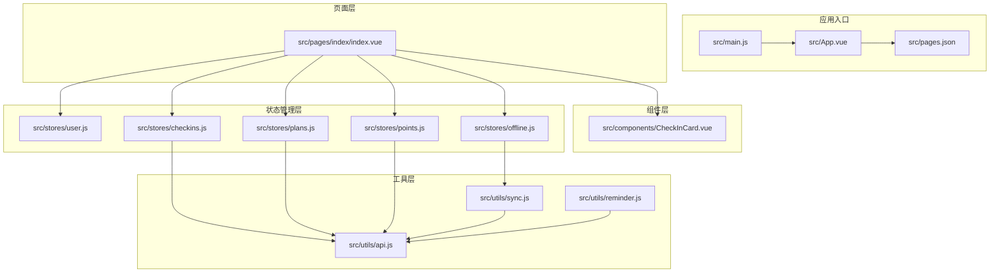
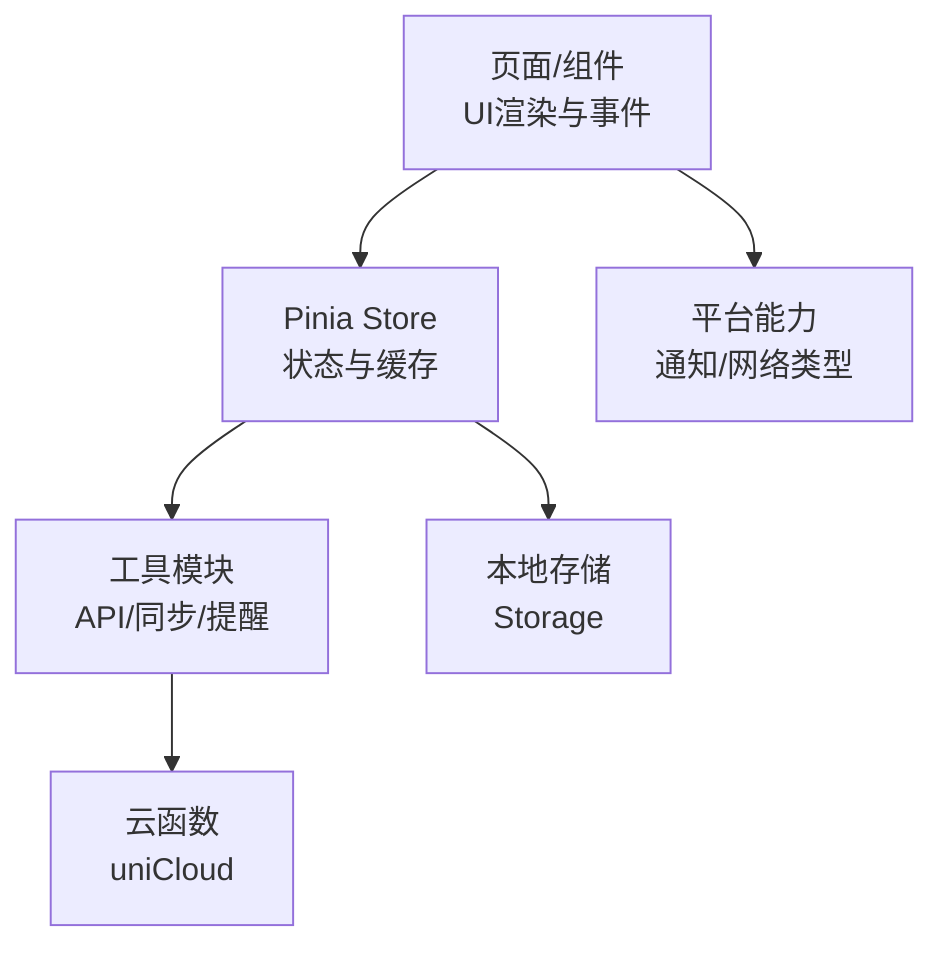
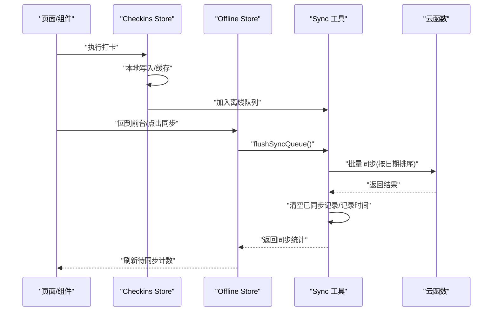
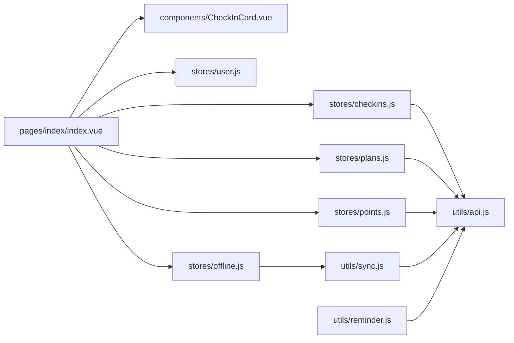

# 性能优化指南

<cite>
**本文引用的文件**
- [package.json](file://package.json)
- [vite.config.ts](file://vite.config.ts)
- [src/main.js](file://src/main.js)
- [src/App.vue](file://src/App.vue)
- [src/pages.json](file://src/pages.json)
- [src/pages/index/index.vue](file://src/pages/index/index.vue)
- [src/components/CheckInCard.vue](file://src/components/CheckInCard.vue)
- [src/stores/user.js](file://src/stores/user.js)
- [src/stores/plans.js](file://src/stores/plans.js)
- [src/stores/checkins.js](file://src/stores/checkins.js)
- [src/stores/points.js](file://src/stores/points.js)
- [src/stores/offline.js](file://src/stores/offline.js)
- [src/utils/api.js](file://src/utils/api.js)
- [src/utils/sync.js](file://src/utils/sync.js)
- [src/utils/reminder.js](file://src/utils/reminder.js)
</cite>

## 目录
1. [简介](#简介)
2. [项目结构](#项目结构)
3. [核心组件](#核心组件)
4. [架构总览](#架构总览)
5. [详细组件分析](#详细组件分析)
6. [依赖关系分析](#依赖关系分析)
7. [性能考虑](#性能考虑)
8. [故障排查指南](#故障排查指南)
9. [结论](#结论)
10. [附录](#附录)

## 简介
本指南面向 Star Grow 项目，聚焦前端性能优化与工程实践，涵盖组件懒加载与代码分割、状态管理与内存管理、API 调用与缓存策略、离线数据同步与批量处理、图片与静态资源优化、滚动与虚拟列表、动画与硬件加速、性能监控与指标分析、以及内存泄漏检测与预防。文档基于仓库现有实现进行提炼，并提供可落地的优化建议。

## 项目结构
项目采用 uni-app + Vue 3 + Vite + Pinia 的技术栈，页面通过 pages.json 声明路由，状态管理集中在 stores 目录，业务工具在 utils 目录，组件位于 components 目录，静态资源位于 static 目录。

**图表来源**
- [src/main.js:1-11](file://src/main.js#L1-L11)
- [src/App.vue:1-64](file://src/App.vue#L1-L64)
- [src/pages.json:1-56](file://src/pages.json#L1-L56)
- [src/pages/index/index.vue:1-204](file://src/pages/index/index.vue#L1-L204)
- [src/components/CheckInCard.vue:1-67](file://src/components/CheckInCard.vue#L1-L67)
- [src/stores/user.js:1-119](file://src/stores/user.js#L1-L119)
- [src/stores/plans.js:1-73](file://src/stores/plans.js#L1-L73)
- [src/stores/checkins.js:1-163](file://src/stores/checkins.js#L1-L163)
- [src/stores/points.js:1-44](file://src/stores/points.js#L1-L44)
- [src/stores/offline.js:1-30](file://src/stores/offline.js#L1-L30)
- [src/utils/api.js:1-18](file://src/utils/api.js#L1-L18)
- [src/utils/sync.js:1-96](file://src/utils/sync.js#L1-L96)
- [src/utils/reminder.js:1-59](file://src/utils/reminder.js#L1-L59)

**章节来源**
- [package.json:1-74](file://package.json#L1-L74)
- [vite.config.ts:1-8](file://vite.config.ts#L1-L8)
- [src/main.js:1-11](file://src/main.js#L1-L11)
- [src/App.vue:1-64](file://src/App.vue#L1-L64)
- [src/pages.json:1-56](file://src/pages.json#L1-L56)

## 核心组件
- 应用入口与全局初始化：在入口处创建应用实例并挂载 Pinia；App 在 onLaunch 初始化云开发环境；在 onShow 时尝试同步离线数据。
- 页面与组件：首页聚合展示、进度条、打卡卡片组件；卡片组件轻量、事件驱动。
- 状态管理：用户、计划、打卡、积分、离线队列五个核心 Store，均使用本地存储进行缓存与持久化。
- 工具链：统一的云函数调用封装、离线队列与智能同步、提醒调度。

**章节来源**
- [src/main.js:1-11](file://src/main.js#L1-L11)
- [src/App.vue:1-64](file://src/App.vue#L1-L64)
- [src/pages/index/index.vue:1-204](file://src/pages/index/index.vue#L1-L204)
- [src/components/CheckInCard.vue:1-67](file://src/components/CheckInCard.vue#L1-L67)
- [src/stores/user.js:1-119](file://src/stores/user.js#L1-L119)
- [src/stores/plans.js:1-73](file://src/stores/plans.js#L1-L73)
- [src/stores/checkins.js:1-163](file://src/stores/checkins.js#L1-L163)
- [src/stores/points.js:1-44](file://src/stores/points.js#L1-L44)
- [src/stores/offline.js:1-30](file://src/stores/offline.js#L1-L30)
- [src/utils/api.js:1-18](file://src/utils/api.js#L1-L18)
- [src/utils/sync.js:1-96](file://src/utils/sync.js#L1-L96)
- [src/utils/reminder.js:1-59](file://src/utils/reminder.js#L1-L59)

## 架构总览
整体采用“页面-组件-Store-工具-云函数”的分层架构。页面负责交互与渲染，组件负责局部 UI 与事件，Store 负责状态与缓存，工具负责网络与离线逻辑，云函数作为后端服务接口。

**图表来源**
- [src/pages/index/index.vue:65-167](file://src/pages/index/index.vue#L65-L167)
- [src/stores/checkins.js:1-163](file://src/stores/checkins.js#L1-L163)
- [src/stores/plans.js:1-73](file://src/stores/plans.js#L1-L73)
- [src/stores/points.js:1-44](file://src/stores/points.js#L1-L44)
- [src/stores/offline.js:1-30](file://src/stores/offline.js#L1-L30)
- [src/utils/api.js:1-18](file://src/utils/api.js#L1-L18)
- [src/utils/sync.js:1-96](file://src/utils/sync.js#L1-L96)
- [src/utils/reminder.js:1-59](file://src/utils/reminder.js#L1-L59)

## 详细组件分析

### 组件懒加载与代码分割
现状
- 当前页面通过 pages.json 声明路由，组件在页面内直接引入，未见动态 import 的懒加载写法。
- Vite 插件由 @dcloudio/vite-plugin-uni 提供，未发现显式的 splitChunks 或动态 import 规则配置。

优化建议
- 对于非首屏使用的页面或重型组件，采用动态 import 实现按需加载与代码分割。
- 在 pages.json 中对非关键路径的页面延迟加载，减少初始包体。
- 结合平台特性（如小程序分包）拆分页面，降低主包体积。

参考路径
- 页面路由声明：[src/pages.json:1-56](file://src/pages.json#L1-L56)
- 页面入口与组件引入：[src/pages/index/index.vue](file://src/pages/index/index.vue#L73)

**章节来源**
- [src/pages.json:1-56](file://src/pages.json#L1-L56)
- [src/pages/index/index.vue](file://src/pages/index/index.vue#L73)

### 状态管理与内存管理
现状
- Store 使用 ref 与本地缓存结合，读取/写入均通过 uni.getStorageSync/uni.setStorageSync。
- 存在潜在内存增长风险：例如积分历史仅保留最近 N 条，但未见对大型数组的定期清理策略。

优化建议
- 对大型集合（如积分历史）设置上限并定期裁剪，避免无限增长。
- 使用 computed 缓存派生结果，避免重复计算。
- 在页面卸载或离开时，及时清理定时器与监听器，防止内存泄漏。
- 对频繁更新的状态，采用节流/防抖策略，减少重渲染。

参考路径
- 积分历史裁剪示例：[src/stores/points.js](file://src/stores/points.js#L32)
- 本地缓存读写封装：[src/stores/user.js:4-5](file://src/stores/user.js#L4-L5)

**章节来源**
- [src/stores/points.js:1-44](file://src/stores/points.js#L1-L44)
- [src/stores/user.js:1-119](file://src/stores/user.js#L1-L119)

### API 调用优化与缓存策略
现状
- 统一的云函数调用封装，异常时返回统一结构，便于上层处理。
- 打卡与计划等关键数据使用本地缓存兜底，提升可用性。

优化建议
- 为高频接口增加请求合并与去重（同一参数的并发请求合并为一次）。
- 对可预测的数据增加 TTL 缓存，结合 last_sync_at 判断有效性。
- 对列表类接口增加分页与增量拉取，避免一次性加载过多数据。
- 在弱网环境下优先使用本地缓存，成功后再进行回放同步。

参考路径
- 云函数调用封装：[src/utils/api.js:1-18](file://src/utils/api.js#L1-L18)
- 打卡缓存与回放：[src/stores/checkins.js:14-24](file://src/stores/checkins.js#L14-L24)
- 计划缓存：[src/stores/plans.js:10-27](file://src/stores/plans.js#L10-L27)

**章节来源**
- [src/utils/api.js:1-18](file://src/utils/api.js#L1-L18)
- [src/stores/checkins.js:1-163](file://src/stores/checkins.js#L1-L163)
- [src/stores/plans.js:1-73](file://src/stores/plans.js#L1-L73)

### 离线数据同步与批量处理
现状
- 打卡操作优先本地写入，失败时进入离线队列；应用回到前台时尝试同步。
- 离线队列按日期排序后批量提交至云函数，成功后清空队列并记录最后同步时间。

优化建议
- 增加网络状态监听与智能同步：仅在网络良好时批量同步，避免浪费流量。
- 对批量同步增加幂等校验，云端以“已存在即跳过”策略处理重复记录。
- 引入重试与指数退避机制，失败时延时重试并限制最大重试次数。
- 对同步进度进行可视化反馈，提升用户体验。

**图表来源**
- [src/stores/checkins.js:78-89](file://src/stores/checkins.js#L78-L89)
- [src/stores/offline.js:14-26](file://src/stores/offline.js#L14-L26)
- [src/utils/sync.js:25-53](file://src/utils/sync.js#L25-L53)

**章节来源**
- [src/stores/checkins.js:1-163](file://src/stores/checkins.js#L1-L163)
- [src/stores/offline.js:1-30](file://src/stores/offline.js#L1-L30)
- [src/utils/sync.js:1-96](file://src/utils/sync.js#L1-L96)

### 图片资源优化与静态资源压缩
现状
- 静态资源位于 static 目录，包含图标与占位图。
- 未见明确的图片压缩与格式转换策略。

优化建议
- 使用 WebP/JPEG XL 等现代格式替代 PNG/JPG，结合质量阈值与尺寸控制。
- 对图标与 Tabbar 图标采用 SVG 或矢量资源，减小体积并提升缩放清晰度。
- 开启构建时的静态资源压缩与哈希命名，利用浏览器缓存。
- 对首屏关键图片采用懒加载与骨架屏，改善感知性能。

参考路径
- 静态资源目录与图标引用：[src/pages.json:23-54](file://src/pages.json#L23-L54)

**章节来源**
- [src/pages.json:1-56](file://src/pages.json#L1-L56)

### 滚动性能优化与虚拟列表
现状
- 打卡列表通过 v-for 渲染多个 CheckInCard，未见虚拟列表实现。

优化建议
- 对长列表采用虚拟滚动，仅渲染可视区域内的节点，显著降低 DOM 数量。
- 对列表项使用 key 合理绑定，避免不必要的重排与重绘。
- 将昂贵的计算放入 computed/computed 缓存，减少渲染成本。

参考路径
- 列表渲染与事件绑定：[src/pages/index/index.vue:48-56](file://src/pages/index/index.vue#L48-L56)
- 列表项组件：[src/components/CheckInCard.vue:1-67](file://src/components/CheckInCard.vue#L1-L67)

**章节来源**
- [src/pages/index/index.vue:48-56](file://src/pages/index/index.vue#L48-L56)
- [src/components/CheckInCard.vue:1-67](file://src/components/CheckInCard.vue#L1-L67)

### 动画性能优化与硬件加速
现状
- 使用 CSS 渐变与 transform/scale 等属性，具备一定硬件加速潜力。
- 未见复杂动画与过渡效果。

优化建议
- 尽量使用 transform 与 opacity 控制动画，避免触发布局与重绘。
- 对频繁动画使用 will-change 或 GPU 加速属性，但要适度使用以免造成过度优化。
- 控制动画帧率与时长，避免在低端设备上造成掉帧。

参考路径
- 打卡按钮与进度条样式：[src/pages/index/index.vue:169-203](file://src/pages/index/index.vue#L169-L203)
- 组件内按钮样式：[src/components/CheckInCard.vue:45-67](file://src/components/CheckInCard.vue#L45-L67)

**章节来源**
- [src/pages/index/index.vue:169-203](file://src/pages/index/index.vue#L169-L203)
- [src/components/CheckInCard.vue:45-67](file://src/components/CheckInCard.vue#L45-L67)

### 性能监控与指标分析
现状
- 未见内置性能监控埋点与指标上报。

优化建议
- 在关键路径（首屏渲染、页面切换、API 请求、离线同步）埋点。
- 上报指标：FP/FCP/LCP/INP/TBT、网络耗时、错误率、离线队列长度、同步成功率。
- 使用平台提供的性能分析工具（如微信开发者工具性能面板、H5 分析工具）进行观测。

参考路径
- 页面生命周期与加载流程：[src/pages/index/index.vue:101-125](file://src/pages/index/index.vue#L101-L125)

**章节来源**
- [src/pages/index/index.vue:101-125](file://src/pages/index/index.vue#L101-L125)

### 内存泄漏检测与预防
现状
- 未见专门的内存泄漏检测与预防机制。

优化建议
- 定期检查定时器、事件监听器、观察者与全局变量，确保在组件销毁时清理。
- 对 Store 中的大型集合设置上限与清理策略，避免长期累积。
- 使用浏览器/平台调试工具监控内存曲线，定位异常增长。

参考路径
- Store 本地缓存读写：[src/stores/user.js:4-5](file://src/stores/user.js#L4-L5)
- 页面生命周期 onShow/onHide：[src/pages/index/index.vue:101-107](file://src/pages/index/index.vue#L101-L107)

**章节来源**
- [src/stores/user.js:1-119](file://src/stores/user.js#L1-L119)
- [src/pages/index/index.vue:101-107](file://src/pages/index/index.vue#L101-L107)

## 依赖关系分析
- 组件耦合：页面与组件松耦合，通过 props/emit 通信；Store 之间通过组合式调用共享用户上下文。
- 外部依赖：Pinia、uView Plus、uni-app 生态；Vite 作为构建工具。
- 平台差异：通过条件编译区分小程序与 App 端能力（通知、云开发）。

**图表来源**
- [src/pages/index/index.vue:65-73](file://src/pages/index/index.vue#L65-L73)
- [src/components/CheckInCard.vue:20-29](file://src/components/CheckInCard.vue#L20-L29)
- [src/stores/checkins.js:1-163](file://src/stores/checkins.js#L1-L163)
- [src/stores/plans.js:1-73](file://src/stores/plans.js#L1-L73)
- [src/stores/points.js:1-44](file://src/stores/points.js#L1-L44)
- [src/stores/offline.js:1-30](file://src/stores/offline.js#L1-L30)
- [src/utils/api.js:1-18](file://src/utils/api.js#L1-L18)
- [src/utils/sync.js:1-96](file://src/utils/sync.js#L1-L96)
- [src/utils/reminder.js:1-59](file://src/utils/reminder.js#L1-L59)

**章节来源**
- [src/pages/index/index.vue:65-73](file://src/pages/index/index.vue#L65-L73)
- [src/stores/checkins.js:1-163](file://src/stores/checkins.js#L1-L163)
- [src/stores/plans.js:1-73](file://src/stores/plans.js#L1-L73)
- [src/stores/points.js:1-44](file://src/stores/points.js#L1-L44)
- [src/stores/offline.js:1-30](file://src/stores/offline.js#L1-L30)
- [src/utils/api.js:1-18](file://src/utils/api.js#L1-L18)
- [src/utils/sync.js:1-96](file://src/utils/sync.js#L1-L96)
- [src/utils/reminder.js:1-59](file://src/utils/reminder.js#L1-L59)

## 性能考虑
- 构建与打包
  - 使用 Vite 的原生按需加载与 Tree-shaking，减少无效代码。
  - 配置合理的 chunk 分割策略，避免过细导致请求数过多。
- 运行时性能
  - 避免在渲染路径中进行昂贵计算，使用 computed 与缓存。
  - 控制响应式数据规模，避免深层嵌套与超大对象。
- 网络与缓存
  - 为接口增加缓存与去重，弱网优先本地回退。
  - 离线同步采用批量与幂等策略，减少云端压力。
- 用户体验
  - 骨架屏与占位图提升感知速度；合理使用 Loading 与 Toast。
  - 动画简洁流畅，避免在低端设备上过度消耗。

[本节为通用指导，无需特定文件引用]

## 故障排查指南
- 离线同步失败
  - 检查网络状态与队列长度；查看同步日志与错误码。
  - 参考：[src/utils/sync.js:84-95](file://src/utils/sync.js#L84-L95)
- 打卡数据不同步
  - 确认本地缓存是否正确写入；检查云端返回与队列清空逻辑。
  - 参考：[src/stores/checkins.js:78-89](file://src/stores/checkins.js#L78-L89)
- 页面白屏或渲染缓慢
  - 检查是否存在超大列表未虚拟化；确认关键资源是否被缓存。
  - 参考：[src/pages/index/index.vue:48-56](file://src/pages/index/index.vue#L48-L56)
- 内存占用持续上升
  - 检查定时器与事件监听是否清理；Store 是否存在未裁剪的大数组。
  - 参考：[src/stores/points.js](file://src/stores/points.js#L32)

**章节来源**
- [src/utils/sync.js:84-95](file://src/utils/sync.js#L84-L95)
- [src/stores/checkins.js:78-89](file://src/stores/checkins.js#L78-L89)
- [src/pages/index/index.vue:48-56](file://src/pages/index/index.vue#L48-L56)
- [src/stores/points.js](file://src/stores/points.js#L32)

## 结论
本指南基于现有代码结构，提出了覆盖前端性能优化的关键方向：组件懒加载与代码分割、状态与内存管理、API 与缓存、离线同步与批量处理、图片与静态资源、滚动与动画、性能监控与内存泄漏防护。建议按优先级逐步实施，并结合平台工具持续观测与迭代。

[本节为总结，无需特定文件引用]

## 附录
- 关键实现路径汇总
  - 应用入口与初始化：[src/main.js:1-11](file://src/main.js#L1-L11)，[src/App.vue:1-64](file://src/App.vue#L1-L64)
  - 页面与组件：[src/pages/index/index.vue:1-204](file://src/pages/index/index.vue#L1-L204)，[src/components/CheckInCard.vue:1-67](file://src/components/CheckInCard.vue#L1-L67)
  - 状态管理：[src/stores/user.js:1-119](file://src/stores/user.js#L1-L119)，[src/stores/plans.js:1-73](file://src/stores/plans.js#L1-L73)，[src/stores/checkins.js:1-163](file://src/stores/checkins.js#L1-L163)，[src/stores/points.js:1-44](file://src/stores/points.js#L1-L44)，[src/stores/offline.js:1-30](file://src/stores/offline.js#L1-L30)
  - 工具与云函数：[src/utils/api.js:1-18](file://src/utils/api.js#L1-L18)，[src/utils/sync.js:1-96](file://src/utils/sync.js#L1-L96)，[src/utils/reminder.js:1-59](file://src/utils/reminder.js#L1-L59)

[本节为补充索引，无需特定文件引用]