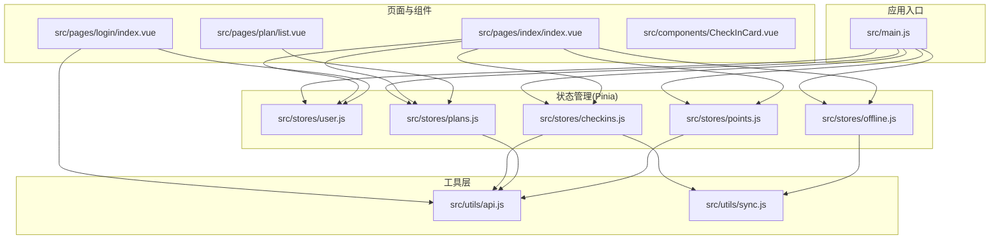
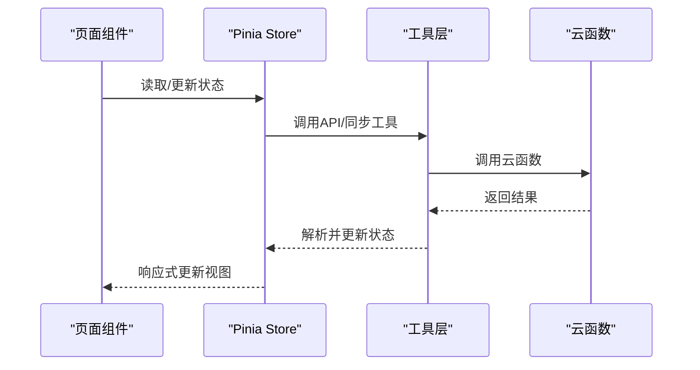
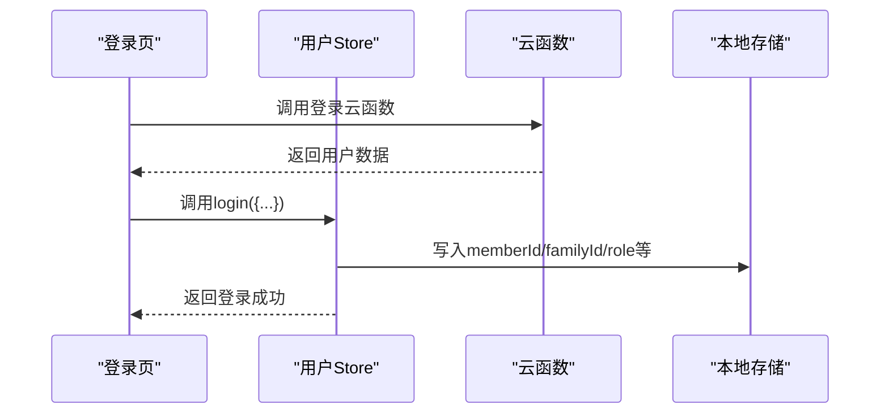
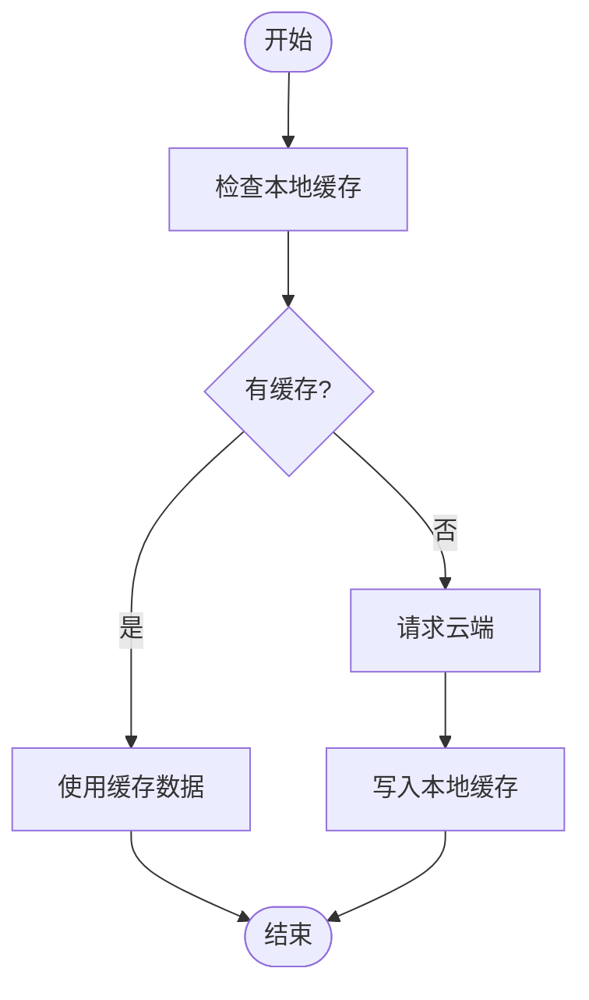
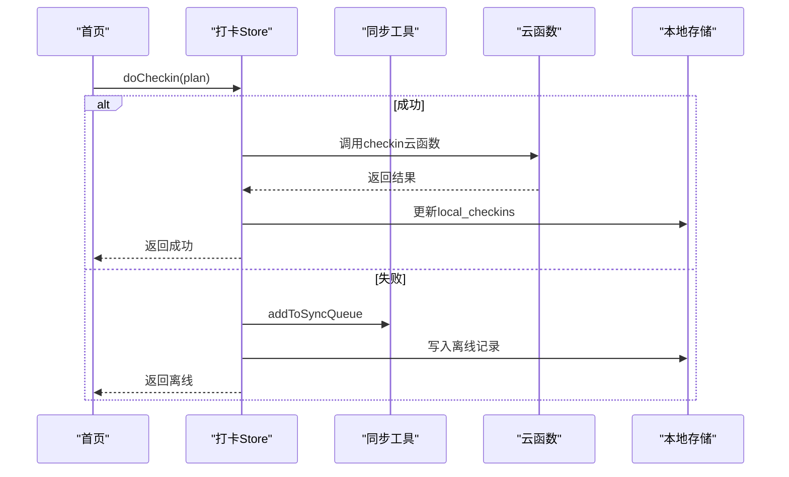
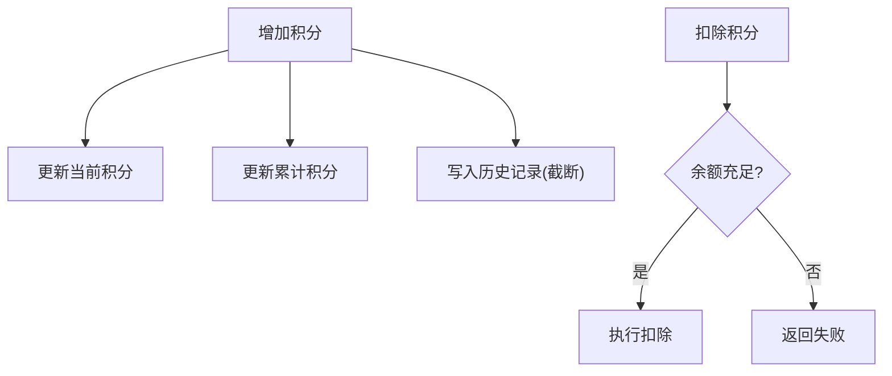
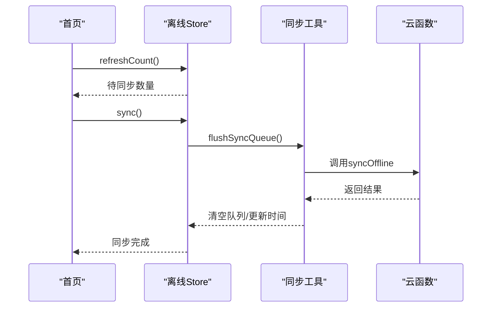
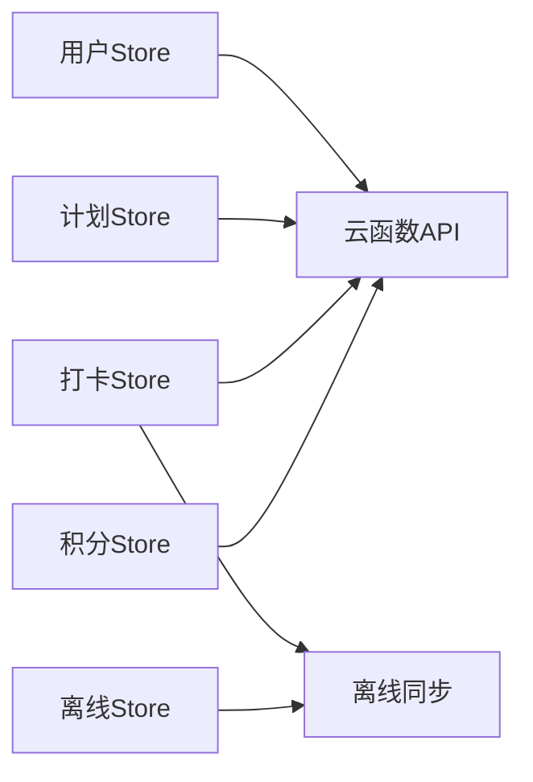

# 状态管理最佳实践

<cite>
**本文档引用的文件**
- [src/main.js](file://src/main.js)
- [src/stores/user.js](file://src/stores/user.js)
- [src/stores/plans.js](file://src/stores/plans.js)
- [src/stores/checkins.js](file://src/stores/checkins.js)
- [src/stores/points.js](file://src/stores/points.js)
- [src/stores/offline.js](file://src/stores/offline.js)
- [src/utils/sync.js](file://src/utils/sync.js)
- [src/utils/api.js](file://src/utils/api.js)
- [src/pages/index/index.vue](file://src/pages/index/index.vue)
- [src/pages/plan/list.vue](file://src/pages/plan/list.vue)
- [src/pages/login/index.vue](file://src/pages/login/index.vue)
- [src/components/CheckInCard.vue](file://src/components/CheckInCard.vue)
- [package.json](file://package.json)
</cite>

## 目录
1. [简介](#简介)
2. [项目结构](#项目结构)
3. [核心组件](#核心组件)
4. [架构总览](#架构总览)
5. [详细组件分析](#详细组件分析)
6. [依赖关系分析](#依赖关系分析)
7. [性能考虑](#性能考虑)
8. [故障排查指南](#故障排查指南)
9. [结论](#结论)
10. [附录](#附录)

## 简介
本文件面向Star Grow项目，系统性总结基于Pinia的状态管理最佳实践。内容涵盖store设计原则、模块划分、响应式更新与数据流、持久化与本地存储、跨组件共享、异步与loading管理、调试与开发工具、状态重置与清理、以及测试与模拟数据准备等主题。目标是帮助开发者在多端（小程序/APP/H5）环境下构建稳定、可维护、高性能的状态管理方案。

## 项目结构
项目采用“按功能域划分”的store组织方式，结合页面级组件对store进行组合使用。核心目录与文件如下：
- 应用入口与全局初始化：src/main.js
- Store模块：src/stores 下按业务域拆分（用户、计划、打卡、积分、离线）
- 工具层：src/utils（云函数调用、离线同步）
- 页面组件：src/pages（首页、计划列表、登录页等）
- 组件库：src/components（通用UI组件）

图表来源
- [src/main.js:1-11](file://src/main.js#L1-L11)
- [src/stores/user.js:1-119](file://src/stores/user.js#L1-L119)
- [src/stores/plans.js:1-73](file://src/stores/plans.js#L1-L73)
- [src/stores/checkins.js:1-163](file://src/stores/checkins.js#L1-L163)
- [src/stores/points.js:1-44](file://src/stores/points.js#L1-L44)
- [src/stores/offline.js:1-30](file://src/stores/offline.js#L1-L30)
- [src/utils/api.js:1-18](file://src/utils/api.js#L1-L18)
- [src/utils/sync.js:1-96](file://src/utils/sync.js#L1-L96)
- [src/pages/index/index.vue:1-204](file://src/pages/index/index.vue#L1-L204)
- [src/pages/plan/list.vue:1-133](file://src/pages/plan/list.vue#L1-L133)
- [src/pages/login/index.vue:1-289](file://src/pages/login/index.vue#L1-L289)
- [src/components/CheckInCard.vue:1-67](file://src/components/CheckInCard.vue#L1-L67)

章节来源
- [src/main.js:1-11](file://src/main.js#L1-L11)
- [package.json:1-74](file://package.json#L1-L74)

## 核心组件
本节聚焦于各store的职责边界、状态结构与对外接口，帮助理解模块化设计与数据流。

- 用户状态（user）
  - 关键状态：成员ID、家庭ID、角色、昵称、头像、OpenID、当前/历史积分
  - 关键行为：登录/注册、家长密码设置与校验、角色切换、登出、积分设置
  - 特点：持久化到本地存储；通过computed派生逻辑（如isParent、isLoggedIn）

- 计划状态（plans）
  - 关键状态：计划列表、加载状态
  - 关键行为：拉取计划、保存计划、归档计划、默认计划模板
  - 特点：本地缓存（plans_cache）；依赖用户家庭ID隔离

- 打卡状态（checkins）
  - 关键状态：今日/本周打卡集合、今日已打计划ID集合
  - 关键行为：拉取今日打卡、执行打卡、取消打卡、计算连击天数
  - 特点：优先离线、静默同步；本地缓存（local_checkins）；联动积分增长

- 积分状态（points）
  - 关键状态：当前积分、历史积分、累计积分
  - 关键行为：拉取积分、增加积分、扣减积分
  - 特点：本地持久化；历史记录截断保留最新N条

- 离线状态（offline）
  - 关键状态：待同步数量、同步中标志
  - 关键行为：刷新待同步计数、触发同步、智能同步
  - 特点：与同步工具配合，避免重复提交

章节来源
- [src/stores/user.js:1-119](file://src/stores/user.js#L1-L119)
- [src/stores/plans.js:1-73](file://src/stores/plans.js#L1-L73)
- [src/stores/checkins.js:1-163](file://src/stores/checkins.js#L1-L163)
- [src/stores/points.js:1-44](file://src/stores/points.js#L1-L44)
- [src/stores/offline.js:1-30](file://src/stores/offline.js#L1-L30)

## 架构总览
下图展示从页面到store再到工具层的整体数据流与交互关系。

图表来源
- [src/pages/index/index.vue:101-125](file://src/pages/index/index.vue#L101-L125)
- [src/stores/checkins.js:14-24](file://src/stores/checkins.js#L14-L24)
- [src/stores/plans.js:14-28](file://src/stores/plans.js#L14-L28)
- [src/stores/points.js:14-24](file://src/stores/points.js#L14-L24)
- [src/utils/api.js:9-17](file://src/utils/api.js#L9-L17)
- [src/utils/sync.js:25-53](file://src/utils/sync.js#L25-L53)

## 详细组件分析

### 用户状态（user）设计与使用
- 设计原则
  - 将用户身份与角色作为核心状态，通过computed派生派生状态，减少冗余存储
  - 登录流程统一走store的login方法，确保本地持久化与云端数据一致
  - 家长模式/孩子模式切换通过角色字段控制，避免重复逻辑

- 数据流与持久化
  - 登录成功后，将关键字段写入本地存储，保证重启后状态可用
  - 角色切换与密码校验均即时落盘，确保权限变更立即生效

- 最佳实践
  - 在页面生命周期中优先检查登录态，未登录则跳转登录页
  - 使用computed派生状态，避免在多个组件重复计算

图表来源
- [src/pages/login/index.vue:164-230](file://src/pages/login/index.vue#L164-L230)
- [src/stores/user.js:23-53](file://src/stores/user.js#L23-L53)
- [src/utils/api.js:9-17](file://src/utils/api.js#L9-L17)

章节来源
- [src/stores/user.js:1-119](file://src/stores/user.js#L1-L119)
- [src/pages/login/index.vue:1-289](file://src/pages/login/index.vue#L1-L289)

### 计划状态（plans）设计与使用
- 设计原则
  - 计划列表作为纯展示数据，配合loading状态提升用户体验
  - 本地缓存用于离线场景与降级容错，避免频繁请求云端

- 数据流与持久化
  - 拉取成功后写入本地缓存；保存/归档后同步更新缓存
  - 默认计划模板用于新用户引导，减少初始配置成本

- 最佳实践
  - 在页面显示前优先检查缓存，再决定是否请求云端
  - 对保存/归档操作进行错误兜底，保证界面一致性

图表来源
- [src/stores/plans.js:14-28](file://src/stores/plans.js#L14-L28)

章节来源
- [src/stores/plans.js:1-73](file://src/stores/plans.js#L1-L73)
- [src/pages/plan/list.vue:57-59](file://src/pages/plan/list.vue#L57-L59)

### 打卡状态（checkins）设计与使用
- 设计原则
  - 优先离线：用户操作立即写入本地，不阻塞交互
  - 静默同步：后台批量上传未同步记录，避免影响主线程
  - 幂等设计：云端以最终一致性为准，避免重复打卡

- 数据流与持久化
  - 今日打卡列表与本地缓存双向同步，支持撤销与连击计算
  - 联动积分增长，支持离线积分与在线积分的差异提示

- 最佳实践
  - 在页面加载时同时拉取今日打卡与连击信息
  - 提供离线提示与一键同步入口，增强用户掌控感

图表来源
- [src/stores/checkins.js:26-89](file://src/stores/checkins.js#L26-L89)
- [src/utils/sync.js:13-20](file://src/utils/sync.js#L13-L20)
- [src/utils/api.js:9-17](file://src/utils/api.js#L9-L17)

章节来源
- [src/stores/checkins.js:1-163](file://src/stores/checkins.js#L1-L163)
- [src/pages/index/index.vue:127-136](file://src/pages/index/index.vue#L127-L136)

### 积分状态（points）设计与使用
- 设计原则
  - 当前积分与累计积分分离，便于统计与展示
  - 历史记录截断，避免无限增长导致性能问题

- 数据流与持久化
  - 拉取云端积分后更新本地缓存；新增/扣除积分即时落盘
  - 历史记录按时间戳排序，限制长度

- 最佳实践
  - 在打卡成功后立即更新积分，保证UI实时反馈
  - 在页面加载时同步云端积分，避免本地与云端不一致

图表来源
- [src/stores/points.js:26-40](file://src/stores/points.js#L26-L40)

章节来源
- [src/stores/points.js:1-44](file://src/stores/points.js#L1-L44)
- [src/pages/index/index.vue:124](file://src/pages/index/index.vue#L124)

### 离线状态（offline）设计与使用
- 设计原则
  - 将待同步数量与同步状态解耦，避免重复同步
  - 提供智能同步：仅在网络可用且存在待同步数据时执行

- 数据流与持久化
  - 通过同步工具获取待同步数量与最后同步时间
  - 同步完成后清空队列并更新最后同步时间

- 最佳实践
  - 在页面显示离线提示时，提供一键同步入口
  - 在应用启动/切前台时触发智能同步，提升体验

图表来源
- [src/stores/offline.js:10-26](file://src/stores/offline.js#L10-L26)
- [src/utils/sync.js:25-53](file://src/utils/sync.js#L25-L53)

章节来源
- [src/stores/offline.js:1-30](file://src/stores/offline.js#L1-L30)
- [src/pages/index/index.vue:156-162](file://src/pages/index/index.vue#L156-L162)

## 依赖关系分析
- 模块内聚与耦合
  - 各store围绕单一职责域（用户、计划、打卡、积分、离线）设计，内聚度高
  - store之间通过工具层（api/sync）间接通信，降低直接耦合

- 外部依赖
  - 云函数调用封装在utils/api.js中，统一错误处理与返回格式
  - 离线同步通过utils/sync.js集中管理，避免重复逻辑

图表来源
- [src/stores/user.js:1-119](file://src/stores/user.js#L1-L119)
- [src/stores/plans.js:1-73](file://src/stores/plans.js#L1-L73)
- [src/stores/checkins.js:1-163](file://src/stores/checkins.js#L1-L163)
- [src/stores/points.js:1-44](file://src/stores/points.js#L1-L44)
- [src/stores/offline.js:1-30](file://src/stores/offline.js#L1-L30)
- [src/utils/api.js:1-18](file://src/utils/api.js#L1-L18)
- [src/utils/sync.js:1-96](file://src/utils/sync.js#L1-L96)

章节来源
- [src/utils/api.js:1-18](file://src/utils/api.js#L1-L18)
- [src/utils/sync.js:1-96](file://src/utils/sync.js#L1-L96)

## 性能考虑
- 响应式更新与渲染优化
  - 使用computed派生状态（如checkedPlanIds、isParent、isLoggedIn），减少重复计算
  - 页面组件中对列表进行条件渲染与懒加载，避免不必要的重绘

- 异步与loading管理
  - 在计划拉取、积分同步等耗时操作中使用loading状态，提升交互反馈
  - 在首页加载时并行拉取多项数据，缩短首屏等待

- 本地缓存与离线策略
  - 通过本地缓存与离线队列降低网络依赖，提升弱网体验
  - 合理设置缓存有效期与清理策略，避免数据陈旧

- 存储与内存
  - 历史记录截断、本地缓存键命名规范化，避免存储膨胀
  - 避免在store中存储大对象或重复数据，减少内存占用

## 故障排查指南
- 登录与权限
  - 若登录后仍提示未登录，检查本地存储中的memberId/familyId是否正确写入
  - 校验云函数返回的用户数据是否包含必要字段

- 打卡与积分
  - 打卡失败但本地已记录：检查离线队列是否正确添加与去重
  - 积分不一致：核对云端拉取与本地更新顺序，确保幂等

- 离线同步
  - 待同步数量不更新：确认刷新计数逻辑与本地存储键值
  - 同步失败：查看网络类型判断与错误日志，确保智能同步条件满足

- 调试与开发工具
  - 使用浏览器/小程序调试工具观察store状态变化
  - 在关键路径打印日志（如云函数调用、本地缓存写入），定位问题

章节来源
- [src/pages/login/index.vue:164-230](file://src/pages/login/index.vue#L164-L230)
- [src/stores/checkins.js:77-88](file://src/stores/checkins.js#L77-L88)
- [src/stores/offline.js:14-26](file://src/stores/offline.js#L14-L26)

## 结论
Star Grow项目采用模块化的Pinia store设计，结合本地缓存与离线同步策略，在多端环境下实现了稳定、可维护的状态管理。通过统一的工具层封装与清晰的职责边界，提升了代码复用与可测试性。建议在后续迭代中持续完善测试覆盖与调试工具链，进一步提升可观测性与可维护性。

## 附录

### 状态持久化策略与本地存储集成
- 关键键值
  - 用户：memberId、familyId、role、nickname、avatar、openId、avatarUrl、parent_pwd
  - 计划：plans_cache
  - 打卡：local_checkins
  - 积分：current_points、total_points、points_history
  - 离线：pending_sync、last_sync_at

- 策略要点
  - 登录成功后统一写入关键字段，确保重启后状态可用
  - 本地缓存用于降级与离线场景，云端为主、本地为辅
  - 历史记录截断与键值规范化，避免存储膨胀

章节来源
- [src/stores/user.js:4-52](file://src/stores/user.js#L4-L52)
- [src/stores/plans.js:10-21](file://src/stores/plans.js#L10-L21)
- [src/stores/checkins.js:54-56](file://src/stores/checkins.js#L54-L56)
- [src/stores/points.js:10-32](file://src/stores/points.js#L10-L32)
- [src/utils/sync.js:7-67](file://src/utils/sync.js#L7-L67)

### 跨组件状态共享与性能优化
- 共享策略
  - 页面组件通过useXxxStore直接注入store实例，避免props逐层传递
  - 使用computed派生状态，减少重复计算与渲染

- 性能优化
  - 列表渲染时使用key，避免重复DOM
  - 并行加载与懒加载策略，缩短首屏时间

章节来源
- [src/pages/index/index.vue:65-79](file://src/pages/index/index.vue#L65-L79)
- [src/components/CheckInCard.vue:1-67](file://src/components/CheckInCard.vue#L1-L67)

### 异步状态与loading管理
- 典型流程
  - 计划拉取：fetchPlans设置loading=true，请求结束后置false
  - 打卡流程：doCheckin根据结果返回成功/离线，界面即时反馈
  - 同步流程：sync设置syncing=true，完成后置false

- 最佳实践
  - 在页面生命周期中统一触发加载与刷新
  - 对失败场景提供明确提示与重试入口

章节来源
- [src/stores/plans.js:14-28](file://src/stores/plans.js#L14-L28)
- [src/stores/checkins.js:26-89](file://src/stores/checkins.js#L26-L89)
- [src/stores/offline.js:14-26](file://src/stores/offline.js#L14-L26)

### 状态调试与开发工具集成
- 工具与方法
  - 浏览器/小程序开发者工具：观察store状态变化与响应式更新
  - 日志打印：在关键路径输出参数与返回值，辅助定位问题
  - 键值监控：关注本地存储键值的写入与更新时机

- 建议
  - 在store中增加状态变更日志开关
  - 对异步流程增加超时与重试机制

章节来源
- [src/utils/api.js:9-17](file://src/utils/api.js#L9-L17)
- [src/utils/sync.js:25-53](file://src/utils/sync.js#L25-L53)

### 状态重置与清理策略
- 登出重置
  - 清空用户相关字段并清理本地存储对应键值
  - 重置积分与打卡状态，确保下次登录干净环境

- 缓存清理
  - 计划与打卡缓存按需清理或替换
  - 离线队列在同步成功后清空

章节来源
- [src/stores/user.js:98-109](file://src/stores/user.js#L98-L109)
- [src/stores/checkins.js:141-145](file://src/stores/checkins.js#L141-L145)
- [src/utils/sync.js:42-44](file://src/utils/sync.js#L42-L44)

### 测试方法与模拟数据准备
- 单元测试
  - 对store的纯函数（如计算属性、工具函数）进行单元测试
  - 使用mock云函数返回值，验证状态更新逻辑

- 集成测试
  - 模拟网络异常与离线场景，验证本地缓存与离线队列行为
  - 验证角色切换、家长密码校验等关键流程

- 模拟数据
  - 准备典型计划、打卡、积分数据，覆盖正常与异常分支
  - 使用本地存储模拟器，验证持久化与重置流程

[本节为通用指导，无需特定文件引用]