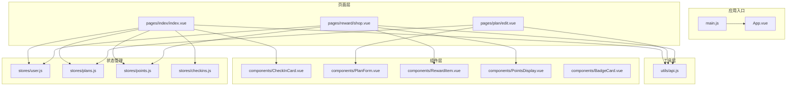
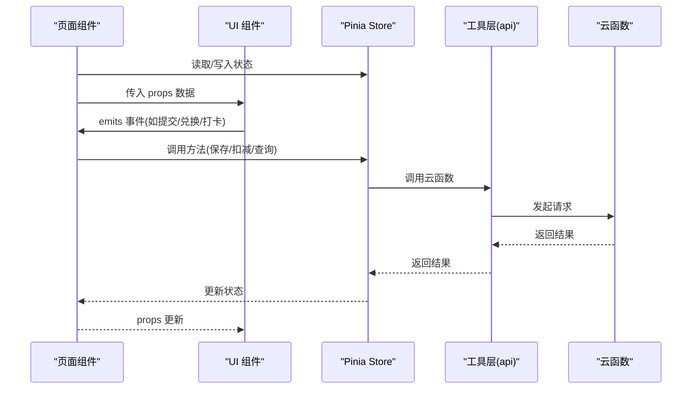
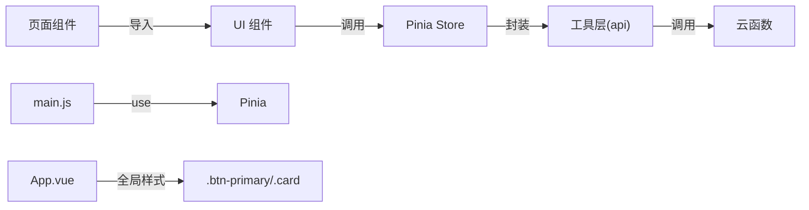

# 组件开发规范

<cite>
**本文引用的文件**
- [src/components/BadgeCard.vue](file://src/components/BadgeCard.vue)
- [src/components/CheckInCard.vue](file://src/components/CheckInCard.vue)
- [src/components/PlanForm.vue](file://src/components/PlanForm.vue)
- [src/components/PointsDisplay.vue](file://src/components/PointsDisplay.vue)
- [src/components/RewardItem.vue](file://src/components/RewardItem.vue)
- [src/pages/index/index.vue](file://src/pages/index/index.vue)
- [src/pages/plan/edit.vue](file://src/pages/plan/edit.vue)
- [src/pages/reward/shop.vue](file://src/pages/reward/shop.vue)
- [src/stores/points.js](file://src/stores/points.js)
- [src/stores/plans.js](file://src/stores/plans.js)
- [src/stores/user.js](file://src/stores/user.js)
- [src/stores/checkins.js](file://src/stores/checkins.js)
- [src/utils/api.js](file://src/utils/api.js)
- [src/App.vue](file://src/App.vue)
- [src/main.js](file://src/main.js)
- [package.json](file://package.json)
- [vite.config.ts](file://vite.config.ts)
</cite>

## 目录
1. [引言](#引言)
2. [项目结构](#项目结构)
3. [核心组件](#核心组件)
4. [架构总览](#架构总览)
5. [组件详细分析](#组件详细分析)
6. [依赖关系分析](#依赖关系分析)
7. [性能考量](#性能考量)
8. [故障排查指南](#故障排查指南)
9. [结论](#结论)
10. [附录](#附录)

## 引言
本规范面向 Star Grow 项目中的 Vue 组件开发，目标是统一组件设计原则、props 规范、事件与插槽使用、样式与主题定制、生命周期与状态管理集成、测试策略、文档编写标准、性能优化与懒加载策略，以及组件间通信与数据流管理。内容基于现有代码库进行提炼与扩展，确保新老成员都能高效协作。

## 项目结构
项目采用“页面 + 组件 + 存储 + 工具”的分层组织方式：
- 页面层：pages 下按功能模块划分页面，负责业务编排与状态拉取
- 组件层：components 提供可复用 UI 组件
- 存储层：stores 使用 Pinia 进行状态管理
- 工具层：utils 封装云函数调用与业务工具
- 应用入口：App.vue 全局样式与生命周期钩子；main.js 注册 Pinia

图表来源
- [src/App.vue:1-64](file://src/App.vue#L1-L64)
- [src/main.js:1-10](file://src/main.js#L1-L10)
- [src/pages/index/index.vue:1-204](file://src/pages/index/index.vue#L1-L204)
- [src/pages/plan/edit.vue:1-35](file://src/pages/plan/edit.vue#L1-L35)
- [src/pages/reward/shop.vue:1-135](file://src/pages/reward/shop.vue#L1-L135)
- [src/components/CheckInCard.vue:1-67](file://src/components/CheckInCard.vue#L1-L67)
- [src/components/PlanForm.vue:1-119](file://src/components/PlanForm.vue#L1-L119)
- [src/components/RewardItem.vue:1-53](file://src/components/RewardItem.vue#L1-L53)
- [src/components/PointsDisplay.vue:1-32](file://src/components/PointsDisplay.vue#L1-L32)
- [src/components/BadgeCard.vue:1-37](file://src/components/BadgeCard.vue#L1-L37)
- [src/stores/user.js:1-119](file://src/stores/user.js#L1-L119)
- [src/stores/plans.js:1-73](file://src/stores/plans.js#L1-L73)
- [src/stores/points.js:1-44](file://src/stores/points.js#L1-L44)
- [src/stores/checkins.js:1-163](file://src/stores/checkins.js#L1-L163)
- [src/utils/api.js:1-18](file://src/utils/api.js#L1-L18)

章节来源
- [src/App.vue:1-64](file://src/App.vue#L1-L64)
- [src/main.js:1-10](file://src/main.js#L1-L10)
- [package.json:1-74](file://package.json#L1-L74)
- [vite.config.ts:1-8](file://vite.config.ts#L1-L8)

## 核心组件
本节梳理项目中已有的核心 UI 组件及其职责边界，便于后续扩展与复用。

- BadgeCard：展示勋章信息，支持解锁/锁定态样式区分
- CheckInCard：展示计划打卡卡片，支持点击打卡/撤销
- PlanForm：计划创建/编辑表单，内置分类选择、频次设置、提醒时间等
- PointsDisplay：积分展示组件，支持数字动画
- RewardItem：奖励项组件，支持兑换按钮与积分校验

章节来源
- [src/components/BadgeCard.vue:1-37](file://src/components/BadgeCard.vue#L1-L37)
- [src/components/CheckInCard.vue:1-67](file://src/components/CheckInCard.vue#L1-L67)
- [src/components/PlanForm.vue:1-119](file://src/components/PlanForm.vue#L1-L119)
- [src/components/PointsDisplay.vue:1-32](file://src/components/PointsDisplay.vue#L1-L32)
- [src/components/RewardItem.vue:1-53](file://src/components/RewardItem.vue#L1-L53)

## 架构总览
组件与状态管理的交互遵循“页面驱动 + 组件承载 + Pinia 状态 + 云函数调用”的模式。页面通过 Pinia Store 拉取/更新数据，组件通过 props 接收数据、通过 emits 上抛事件，工具层统一封装云函数调用。

图表来源
- [src/pages/index/index.vue:127-154](file://src/pages/index/index.vue#L127-L154)
- [src/pages/reward/shop.vue:77-104](file://src/pages/reward/shop.vue#L77-L104)
- [src/components/CheckInCard.vue:29-42](file://src/components/CheckInCard.vue#L29-L42)
- [src/components/RewardItem.vue:28-34](file://src/components/RewardItem.vue#L28-L34)
- [src/stores/checkins.js:26-89](file://src/stores/checkins.js#L26-L89)
- [src/stores/points.js:26-40](file://src/stores/points.js#L26-L40)
- [src/utils/api.js:9-17](file://src/utils/api.js#L9-L17)

## 组件详细分析

### 设计原则与拆分策略
- 单一职责：每个组件聚焦一个功能点（如 CheckInCard 仅负责打卡交互，PlanForm 仅负责表单）
- 可复用性：通过 props 与 emits 解耦，避免硬编码业务逻辑
- 可组合性：页面通过组合多个组件完成复杂视图（首页由卡片列表组成）
- 可测试性：将副作用（网络请求）集中在工具层与 Store，组件保持纯渲染

### Props 定义规范
- 必填参数：使用 required 标注，确保调用方显式传入
- 默认值：提供合理默认，减少调用方心智负担
- 类型约束：明确类型，配合 TypeScript 可获得更好开发体验
- 命名约定：语义化命名，避免缩写；布尔开关建议带 is/has 前缀

示例参考路径
- [CheckInCard props:23-27](file://src/components/CheckInCard.vue#L23-L27)
- [PlanForm props:55-57](file://src/components/PlanForm.vue#L55-L57)
- [RewardItem props:23-26](file://src/components/RewardItem.vue#L23-L26)
- [PointsDisplay props:14-17](file://src/components/PointsDisplay.vue#L14-L17)
- [BadgeCard props:12-15](file://src/components/BadgeCard.vue#L12-L15)

章节来源
- [src/components/CheckInCard.vue:23-27](file://src/components/CheckInCard.vue#L23-L27)
- [src/components/PlanForm.vue:55-57](file://src/components/PlanForm.vue#L55-L57)
- [src/components/RewardItem.vue:23-26](file://src/components/RewardItem.vue#L23-L26)
- [src/components/PointsDisplay.vue:14-17](file://src/components/PointsDisplay.vue#L14-L17)
- [src/components/BadgeCard.vue:12-15](file://src/components/BadgeCard.vue#L12-L15)

### 事件处理与插槽使用
- 事件命名：采用动词短语，如 checkin、unclick、submit、exchange，清晰表达意图
- 事件参数：传递最小必要数据，避免传递整个对象
- 插槽使用：当前组件未使用具名插槽，若需扩展可参考具名插槽模式，但需保持向后兼容

示例参考路径
- [CheckInCard emits](file://src/components/CheckInCard.vue#L29)
- [PlanForm emits](file://src/components/PlanForm.vue#L59)
- [RewardItem emits](file://src/components/RewardItem.vue#L28)

章节来源
- [src/components/CheckInCard.vue:29](file://src/components/CheckInCard.vue#L29)
- [src/components/PlanForm.vue:59](file://src/components/PlanForm.vue#L59)
- [src/components/RewardItem.vue:28](file://src/components/RewardItem.vue#L28)

### 样式规范与主题定制
- 通用样式：在 App.vue 中定义全局样式与通用类（如按钮、卡片），组件内使用 scoped 样式避免污染
- 主题色：项目采用渐变橙红系为主色调，组件内使用一致的配色变量
- 动画与反馈：通过类名控制状态（如 checked、disabled、active），并在样式中定义过渡与动画
- 响应式：组件尺寸与间距使用相对单位，保证在不同屏幕下的一致性

示例参考路径
- [App.vue 全局样式:30-63](file://src/App.vue#L30-L63)
- [CheckInCard 样式:45-66](file://src/components/CheckInCard.vue#L45-L66)
- [PlanForm 样式:91-118](file://src/components/PlanForm.vue#L91-L118)
- [PointsDisplay 样式:20-31](file://src/components/PointsDisplay.vue#L20-L31)

章节来源
- [src/App.vue:30-63](file://src/App.vue#L30-L63)
- [src/components/CheckInCard.vue:45-66](file://src/components/CheckInCard.vue#L45-L66)
- [src/components/PlanForm.vue:91-118](file://src/components/PlanForm.vue#L91-L118)
- [src/components/PointsDisplay.vue:20-31](file://src/components/PointsDisplay.vue#L20-L31)

### 生命周期管理与状态集成
- 页面级生命周期：使用 onShow/onLoad 等钩子触发数据加载与刷新
- 组件级生命周期：在 setup 中声明响应式数据与计算属性，避免在模板中直接访问副作用
- Store 集成：组件通过 Store 方法读取/更新状态，避免直接操作全局变量
- 离线与同步：CheckInStore 在网络异常时写入本地缓存，并在前台显示同步提示

示例参考路径
- [首页生命周期与数据加载:101-125](file://src/pages/index/index.vue#L101-L125)
- [计划编辑页面:16-30](file://src/pages/plan/edit.vue#L16-L30)
- [奖励商店页面:73-75](file://src/pages/reward/shop.vue#L73-L75)
- [CheckInStore 打卡流程:26-89](file://src/stores/checkins.js#L26-L89)

章节来源
- [src/pages/index/index.vue:101-125](file://src/pages/index/index.vue#L101-L125)
- [src/pages/plan/edit.vue:16-30](file://src/pages/plan/edit.vue#L16-L30)
- [src/pages/reward/shop.vue:73-75](file://src/pages/reward/shop.vue#L73-L75)
- [src/stores/checkins.js:26-89](file://src/stores/checkins.js#L26-L89)

### 组件间通信与数据流
- 父子通信：通过 props 传参，emits 上抛事件，形成单向数据流
- 页面聚合：页面作为协调者，负责从 Store 拉取数据并传给子组件
- 事件链路：从组件到页面再到 Store 的调用链，保持职责清晰

示例参考路径
- [首页与 CheckInCard 通信:48-55](file://src/pages/index/index.vue#L48-L55)
- [奖励商店与 RewardItem 通信:22-29](file://src/pages/reward/shop.vue#L22-L29)

章节来源
- [src/pages/index/index.vue:48-55](file://src/pages/index/index.vue#L48-L55)
- [src/pages/reward/shop.vue:22-29](file://src/pages/reward/shop.vue#L22-L29)

### 性能优化与懒加载策略
- 列表渲染：使用 v-for 时提供稳定 key，避免重复渲染
- 计算属性：将派生数据放入 computed，减少不必要的重算
- 条件渲染：根据状态切换显示/隐藏，避免渲染无关节点
- 网络请求：集中于工具层与 Store，组件只负责展示与触发
- 懒加载：页面 onShow 再加载数据，避免首屏阻塞

示例参考路径
- [首页进度与条件渲染:36-46](file://src/pages/index/index.vue#L36-L46)
- [CheckInCard 条件样式:3-51](file://src/components/CheckInCard.vue#L3-L51)

章节来源
- [src/pages/index/index.vue:36-46](file://src/pages/index/index.vue#L36-L46)
- [src/components/CheckInCard.vue:3-51](file://src/components/CheckInCard.vue#L3-L51)

### 测试策略与单元测试规范
- 单元测试：针对组件的 props 校验、事件触发、计算属性输出进行断言
- 集成测试：模拟 Store 与工具层返回值，验证组件在不同状态下的行为
- 端到端测试：使用 uni-app 自动化工具覆盖关键用户路径（如打卡、兑换）
- 测试用例建议：
  - Props 输入边界：必填项缺失、类型错误、空值
  - 事件回调：点击、提交、切换等交互
  - 状态变更：props 改变导致的 UI 变化
  - 错误场景：网络失败、权限不足、数据为空

[本节为通用测试指导，不直接分析具体文件，故无章节来源]

### 文档编写标准与示例
- 组件文档应包含：用途、属性列表（含类型、默认值、是否必填）、事件列表、插槽说明、使用示例、注意事项
- 示例路径：在页面中以注释形式给出组件使用片段，便于复制粘贴
- 维护策略：随着组件演进同步更新文档，保持与实现一致

[本节为通用文档规范，不直接分析具体文件，故无章节来源]

## 依赖关系分析

图表来源
- [src/main.js:5-9](file://src/main.js#L5-L9)
- [src/App.vue:30-63](file://src/App.vue#L30-L63)
- [src/utils/api.js:9-17](file://src/utils/api.js#L9-L17)
- [src/stores/plans.js:31-47](file://src/stores/plans.js#L31-L47)
- [src/stores/points.js:26-40](file://src/stores/points.js#L26-L40)
- [src/stores/checkins.js:26-89](file://src/stores/checkins.js#L26-L89)

章节来源
- [src/main.js:5-9](file://src/main.js#L5-L9)
- [src/App.vue:30-63](file://src/App.vue#L30-L63)
- [src/utils/api.js:9-17](file://src/utils/api.js#L9-L17)
- [src/stores/plans.js:31-47](file://src/stores/plans.js#L31-L47)
- [src/stores/points.js:26-40](file://src/stores/points.js#L26-L40)
- [src/stores/checkins.js:26-89](file://src/stores/checkins.js#L26-L89)

## 性能考量
- 避免在模板中执行复杂逻辑，将计算放入 computed 或在 Store 中预处理
- 对频繁更新的数据使用浅层响应式，减少深层监听开销
- 图标与小尺寸元素使用 Unicode 字符，减少图片体积
- 列表滚动区域使用虚拟滚动（如未来扩展）降低 DOM 数量
- 云函数调用合并与节流，避免短时间内大量请求

[本节为通用性能指导，不直接分析具体文件，故无章节来源]

## 故障排查指南
- 云函数调用失败：检查工具层返回值与错误提示，页面弹出 toast 提示用户
- 状态不更新：确认 Store 方法是否正确更新响应式数据，页面是否重新拉取数据
- 本地缓存异常：检查本地存储键名与序列化方式，确保读写一致
- 权限问题：核对用户角色与家庭 ID，避免跨家庭数据访问

示例参考路径
- [工具层错误处理:13-17](file://src/utils/api.js#L13-L17)
- [首页错误提示:133-135](file://src/pages/index/index.vue#L133-L135)
- [CheckInStore 离线处理:78-88](file://src/stores/checkins.js#L78-L88)

章节来源
- [src/utils/api.js:13-17](file://src/utils/api.js#L13-L17)
- [src/pages/index/index.vue:133-135](file://src/pages/index/index.vue#L133-L135)
- [src/stores/checkins.js:78-88](file://src/stores/checkins.js#L78-L88)

## 结论
本规范总结了 Star Grow 项目中组件开发的设计原则、实现要点与最佳实践，强调了可复用性、可测试性与可维护性。建议在新增组件时严格遵循 Props/Events/Slots 规范，统一样式与主题，结合 Pinia 与工具层实现清晰的数据流与错误处理，持续完善测试与文档，保障产品长期演进。

## 附录
- 开发与构建脚本：详见 package.json scripts
- Vite 插件配置：详见 vite.config.ts

章节来源
- [package.json:4-37](file://package.json#L4-L37)
- [vite.config.ts:5-7](file://vite.config.ts#L5-L7)