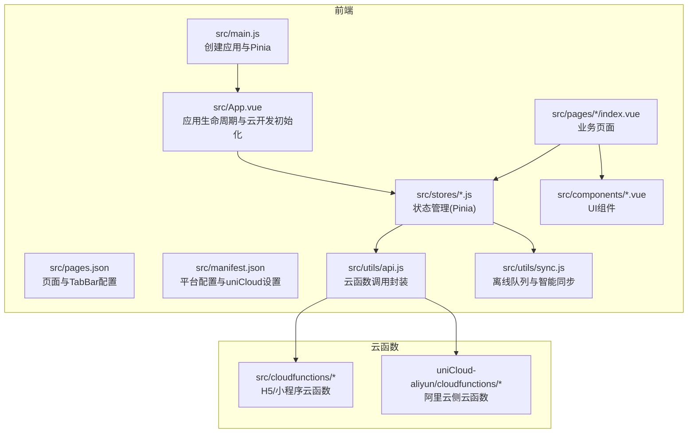
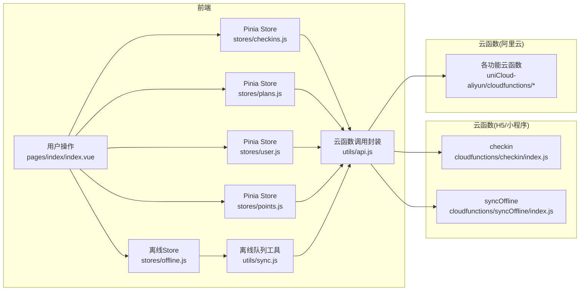
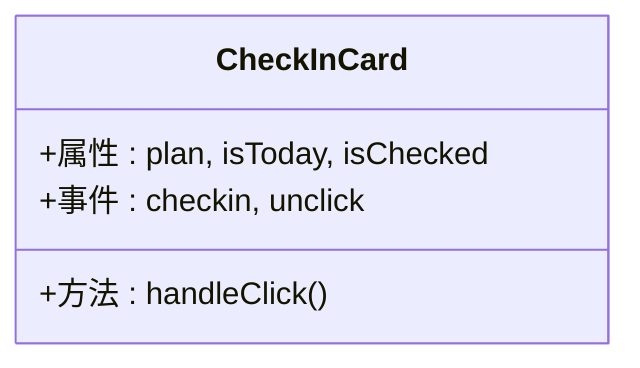
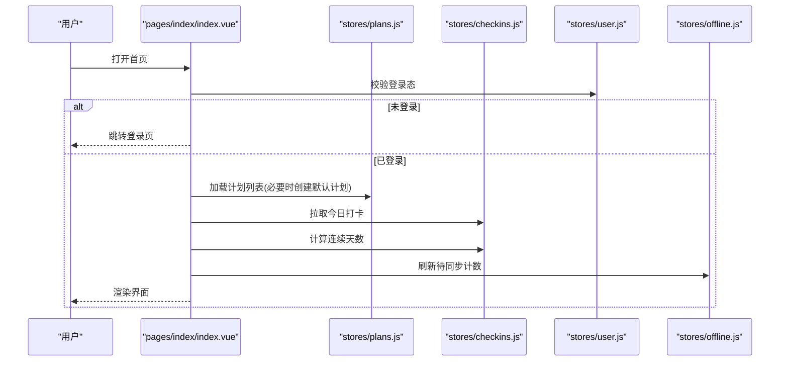
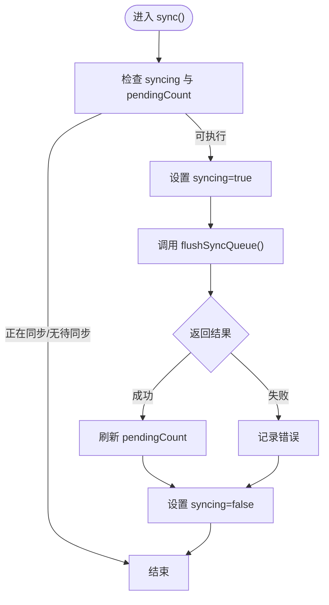
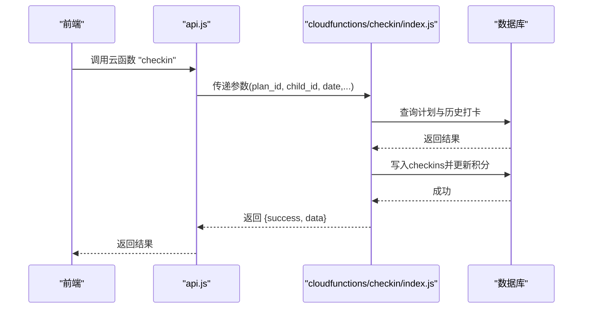
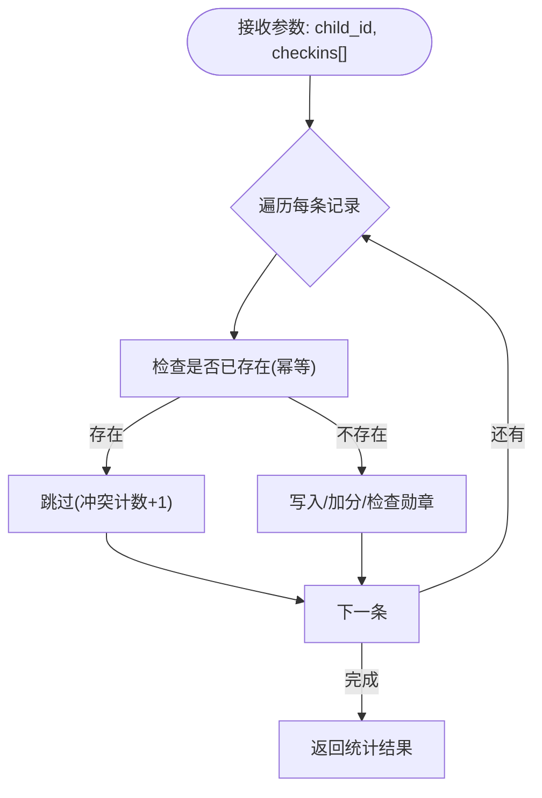
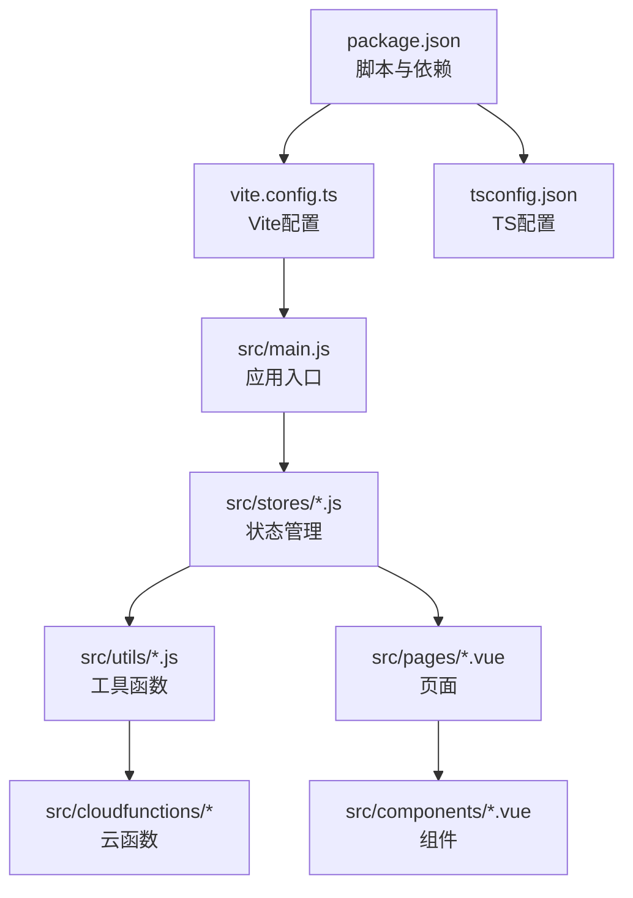

# 调试与开发工具

<cite>
**本文引用的文件**
- [package.json](file://package.json)
- [vite.config.ts](file://vite.config.ts)
- [tsconfig.json](file://tsconfig.json)
- [src/main.js](file://src/main.js)
- [src/App.vue](file://src/App.vue)
- [src/pages.json](file://src/pages.json)
- [src/manifest.json](file://src/manifest.json)
- [src/utils/api.js](file://src/utils/api.js)
- [src/utils/sync.js](file://src/utils/sync.js)
- [src/stores/offline.js](file://src/stores/offline.js)
- [src/stores/checkins.js](file://src/stores/checkins.js)
- [src/stores/plans.js](file://src/stores/plans.js)
- [src/stores/user.js](file://src/stores/user.js)
- [src/stores/points.js](file://src/stores/points.js)
- [src/components/CheckInCard.vue](file://src/components/CheckInCard.vue)
- [src/pages/index/index.vue](file://src/pages/index/index.vue)
- [src/cloudfunctions/syncOffline/index.js](file://src/cloudfunctions/syncOffline/index.js)
- [src/cloudfunctions/checkin/index.js](file://src/cloudfunctions/checkin/index.js)
</cite>

## 目录
1. [简介](#简介)
2. [项目结构](#项目结构)
3. [核心组件](#核心组件)
4. [架构总览](#架构总览)
5. [详细组件分析](#详细组件分析)
6. [依赖分析](#依赖分析)
7. [性能考虑](#性能考虑)
8. [故障排查指南](#故障排查指南)
9. [结论](#结论)
10. [附录](#附录)

## 简介
本指南面向Star Grow项目的开发者与测试人员，聚焦于uni-app生态下的调试与开发工具使用方法，涵盖以下主题：
- uni-app开发环境配置与运行方式（HBuilderX与Vite开发服务器）
- Vue DevTools使用技巧与组件调试方法
- API调试工具与网络请求监控
- 离线数据同步的调试策略与问题排查
- 性能分析工具与优化建议
- 错误日志收集与分析
- 断点调试与条件断点技巧
- 开发工具链配置与自定义开发环境搭建

## 项目结构
该项目采用uni-app 3.x + Vite + Pinia + uView Plus的组合，前端通过Vite插件统一构建，云函数位于src/cloudfunctions与uniCloud-aliyun/cloudfunctions两套目录中，页面路由与全局样式在pages.json与App.vue中集中管理。

图表来源
- [src/main.js:1-11](file://src/main.js#L1-L11)
- [src/App.vue:1-64](file://src/App.vue#L1-L64)
- [src/pages.json:1-56](file://src/pages.json#L1-L56)
- [src/manifest.json:1-77](file://src/manifest.json#L1-L77)
- [src/utils/api.js:1-18](file://src/utils/api.js#L1-L18)
- [src/utils/sync.js:1-96](file://src/utils/sync.js#L1-L96)
- [src/stores/checkins.js:1-163](file://src/stores/checkins.js#L1-L163)
- [src/stores/plans.js:1-73](file://src/stores/plans.js#L1-L73)
- [src/stores/user.js:1-119](file://src/stores/user.js#L1-L119)
- [src/stores/points.js:1-44](file://src/stores/points.js#L1-L44)
- [src/components/CheckInCard.vue:1-67](file://src/components/CheckInCard.vue#L1-L67)
- [src/pages/index/index.vue:1-204](file://src/pages/index/index.vue#L1-L204)
- [src/cloudfunctions/syncOffline/index.js:1-20](file://src/cloudfunctions/syncOffline/index.js#L1-L20)
- [src/cloudfunctions/checkin/index.js:1-142](file://src/cloudfunctions/checkin/index.js#L1-L142)

章节来源
- [package.json:1-74](file://package.json#L1-L74)
- [vite.config.ts:1-8](file://vite.config.ts#L1-L8)
- [tsconfig.json:1-14](file://tsconfig.json#L1-L14)
- [src/pages.json:1-56](file://src/pages.json#L1-L56)
- [src/manifest.json:1-77](file://src/manifest.json#L1-L77)

## 核心组件
- 应用入口与状态管理
  - 应用创建与Pinia注入：[src/main.js:1-11](file://src/main.js#L1-L11)
  - 应用生命周期与云开发初始化：[src/App.vue:1-64](file://src/App.vue#L1-L64)
- 页面与导航
  - 页面与TabBar配置：[src/pages.json:1-56](file://src/pages.json#L1-L56)
  - 平台与uniCloud配置：[src/manifest.json:1-77](file://src/manifest.json#L1-L77)
- 云函数调用封装
  - 统一调用与错误兜底：[src/utils/api.js:1-18](file://src/utils/api.js#L1-L18)
- 离线同步
  - 队列管理与批量同步：[src/utils/sync.js:1-96](file://src/utils/sync.js#L1-L96)
  - 状态与触发：[src/stores/offline.js:1-30](file://src/stores/offline.js#L1-L30)
- 业务状态
  - 打卡、计划、用户、积分：[src/stores/checkins.js:1-163](file://src/stores/checkins.js#L1-L163)，[src/stores/plans.js:1-73](file://src/stores/plans.js#L1-L73)，[src/stores/user.js:1-119](file://src/stores/user.js#L1-L119)，[src/stores/points.js:1-44](file://src/stores/points.js#L1-L44)
- 组件与页面
  - 打卡卡片组件：[src/components/CheckInCard.vue:1-67](file://src/components/CheckInCard.vue#L1-L67)
  - 首页与交互流程：[src/pages/index/index.vue:1-204](file://src/pages/index/index.vue#L1-L204)

章节来源
- [src/main.js:1-11](file://src/main.js#L1-L11)
- [src/App.vue:1-64](file://src/App.vue#L1-L64)
- [src/pages.json:1-56](file://src/pages.json#L1-L56)
- [src/manifest.json:1-77](file://src/manifest.json#L1-L77)
- [src/utils/api.js:1-18](file://src/utils/api.js#L1-L18)
- [src/utils/sync.js:1-96](file://src/utils/sync.js#L1-L96)
- [src/stores/offline.js:1-30](file://src/stores/offline.js#L1-L30)
- [src/stores/checkins.js:1-163](file://src/stores/checkins.js#L1-L163)
- [src/stores/plans.js:1-73](file://src/stores/plans.js#L1-L73)
- [src/stores/user.js:1-119](file://src/stores/user.js#L1-L119)
- [src/stores/points.js:1-44](file://src/stores/points.js#L1-L44)
- [src/components/CheckInCard.vue:1-67](file://src/components/CheckInCard.vue#L1-L67)
- [src/pages/index/index.vue:1-204](file://src/pages/index/index.vue#L1-L204)

## 架构总览
下图展示前端与云函数之间的调用关系与数据流，以及离线队列的处理路径。

图表来源
- [src/pages/index/index.vue:1-204](file://src/pages/index/index.vue#L1-L204)
- [src/stores/checkins.js:1-163](file://src/stores/checkins.js#L1-L163)
- [src/stores/plans.js:1-73](file://src/stores/plans.js#L1-L73)
- [src/stores/user.js:1-119](file://src/stores/user.js#L1-L119)
- [src/stores/points.js:1-44](file://src/stores/points.js#L1-L44)
- [src/stores/offline.js:1-30](file://src/stores/offline.js#L1-L30)
- [src/utils/sync.js:1-96](file://src/utils/sync.js#L1-L96)
- [src/utils/api.js:1-18](file://src/utils/api.js#L1-L18)
- [src/cloudfunctions/checkin/index.js:1-142](file://src/cloudfunctions/checkin/index.js#L1-L142)
- [src/cloudfunctions/syncOffline/index.js:1-20](file://src/cloudfunctions/syncOffline/index.js#L1-L20)

## 详细组件分析

### 组件：CheckInCard（打卡卡片）
- 功能要点
  - 展示计划类别图标、标题、频率与积分奖励
  - 点击“打卡/取消”触发父组件事件
- 调试建议
  - 在父组件中监听事件，打印传入的plan对象，确认字段完整性
  - 使用Vue DevTools观察props与emit行为，定位渲染异常

图表来源
- [src/components/CheckInCard.vue:1-67](file://src/components/CheckInCard.vue#L1-L67)

章节来源
- [src/components/CheckInCard.vue:1-67](file://src/components/CheckInCard.vue#L1-L67)

### 页面：首页（今日打卡）
- 关键流程
  - 登录态校验与数据加载
  - 计划列表与今日打卡状态
  - 连续打卡天数计算
  - 离线同步提示与手动触发
- 调试建议
  - 在onShow钩子中打断点，检查用户登录态与数据拉取结果
  - 观察积分与徽章弹窗时机，确保异步回调顺序正确

图表来源
- [src/pages/index/index.vue:1-204](file://src/pages/index/index.vue#L1-L204)
- [src/stores/plans.js:1-73](file://src/stores/plans.js#L1-L73)
- [src/stores/checkins.js:1-163](file://src/stores/checkins.js#L1-L163)
- [src/stores/user.js:1-119](file://src/stores/user.js#L1-L119)
- [src/stores/offline.js:1-30](file://src/stores/offline.js#L1-L30)

章节来源
- [src/pages/index/index.vue:1-204](file://src/pages/index/index.vue#L1-L204)

### 状态管理：离线同步（Pinia）
- 关键点
  - pendingCount与syncing状态
  - 批量同步flushSyncQueue与幂等处理
  - 智能同步smartSync在网络可用时触发
- 调试建议
  - 在sync方法前后断点，观察syncing状态变化
  - 检查队列长度与返回结果，定位失败原因

图表来源
- [src/stores/offline.js:1-30](file://src/stores/offline.js#L1-L30)
- [src/utils/sync.js:25-53](file://src/utils/sync.js#L25-L53)

章节来源
- [src/stores/offline.js:1-30](file://src/stores/offline.js#L1-L30)
- [src/utils/sync.js:1-96](file://src/utils/sync.js#L1-L96)

### 云函数：checkin（打卡）
- 关键点
  - 校验计划存在性与当日重复
  - 计算连续天数与加成
  - 写入checkins并更新成员积分
  - 勋章检查与返回
- 调试建议
  - 在数据库查询与更新处设置断点，核对字段映射
  - 模拟重复打卡场景，验证错误返回

图表来源
- [src/utils/api.js:1-18](file://src/utils/api.js#L1-L18)
- [src/cloudfunctions/checkin/index.js:1-142](file://src/cloudfunctions/checkin/index.js#L1-L142)

章节来源
- [src/utils/api.js:1-18](file://src/utils/api.js#L1-L18)
- [src/cloudfunctions/checkin/index.js:1-142](file://src/cloudfunctions/checkin/index.js#L1-L142)

### 云函数：syncOffline（离线批量同步）
- 关键点
  - 逐条处理离线打卡，避免重复（注释保留幂等逻辑）
  - 返回统计信息（已同步、失败、冲突等）
- 调试建议
  - 构造重复数据与边界数据，验证去重与统计
  - 对比前端队列与后端处理结果

图表来源
- [src/cloudfunctions/syncOffline/index.js:1-20](file://src/cloudfunctions/syncOffline/index.js#L1-L20)
- [src/utils/sync.js:25-53](file://src/utils/sync.js#L25-L53)

章节来源
- [src/cloudfunctions/syncOffline/index.js:1-20](file://src/cloudfunctions/syncOffline/index.js#L1-L20)
- [src/utils/sync.js:1-96](file://src/utils/sync.js#L1-L96)

## 依赖分析
- 构建与运行
  - Vite配置与uni插件：[vite.config.ts:1-8](file://vite.config.ts#L1-L8)
  - 脚本命令与平台产物：[package.json:4-37](file://package.json#L4-L37)
  - TypeScript配置与类型声明：[tsconfig.json:1-14](file://tsconfig.json#L1-L14)
- 应用与平台
  - 页面与TabBar：[src/pages.json:1-56](file://src/pages.json#L1-L56)
  - 平台与uniCloud配置：[src/manifest.json:1-77](file://src/manifest.json#L1-L77)
- 状态与工具
  - Pinia Store与API封装：[src/stores/*.js:1-163](file://src/stores/checkins.js#L1-L163)，[src/utils/api.js:1-18](file://src/utils/api.js#L1-L18)
  - 离线队列与智能同步：[src/utils/sync.js:1-96](file://src/utils/sync.js#L1-L96)

图表来源
- [package.json:1-74](file://package.json#L1-L74)
- [vite.config.ts:1-8](file://vite.config.ts#L1-L8)
- [tsconfig.json:1-14](file://tsconfig.json#L1-L14)
- [src/main.js:1-11](file://src/main.js#L1-L11)
- [src/stores/checkins.js:1-163](file://src/stores/checkins.js#L1-L163)
- [src/utils/api.js:1-18](file://src/utils/api.js#L1-L18)
- [src/utils/sync.js:1-96](file://src/utils/sync.js#L1-L96)
- [src/pages/index/index.vue:1-204](file://src/pages/index/index.vue#L1-L204)
- [src/components/CheckInCard.vue:1-67](file://src/components/CheckInCard.vue#L1-L67)
- [src/cloudfunctions/checkin/index.js:1-142](file://src/cloudfunctions/checkin/index.js#L1-L142)

章节来源
- [package.json:1-74](file://package.json#L1-L74)
- [vite.config.ts:1-8](file://vite.config.ts#L1-L8)
- [tsconfig.json:1-14](file://tsconfig.json#L1-L14)
- [src/main.js:1-11](file://src/main.js#L1-L11)
- [src/stores/checkins.js:1-163](file://src/stores/checkins.js#L1-L163)
- [src/utils/api.js:1-18](file://src/utils/api.js#L1-L18)
- [src/utils/sync.js:1-96](file://src/utils/sync.js#L1-L96)
- [src/pages/index/index.vue:1-204](file://src/pages/index/index.vue#L1-L204)
- [src/components/CheckInCard.vue:1-67](file://src/components/CheckInCard.vue#L1-L67)
- [src/cloudfunctions/checkin/index.js:1-142](file://src/cloudfunctions/checkin/index.js#L1-L142)

## 性能考虑
- 构建与运行
  - 使用Vite进行快速冷启动与热更新，减少等待时间
  - 在开发阶段开启sourceMap便于定位源码位置
- 数据访问
  - Pinia状态持久化与本地缓存结合，降低重复请求
  - 打卡与计划列表采用缓存回退策略，提升弱网体验
- 网络与离线
  - 离线队列按日期排序，批量上传减少请求次数
  - 智能同步仅在网络可用时执行，避免无效请求
- UI渲染
  - 组件内计算属性与响应式数据最小化更新范围
  - 首页进度条与徽章弹窗采用延迟与节流策略

## 故障排查指南
- uni-app开发环境与运行
  - HBuilderX：导入项目后选择对应平台（如微信小程序）进行预览与真机调试
  - Vite开发服务器：使用脚本命令启动H5开发服务，参考[package.json:4-37](file://package.json#L4-L37)
  - Vite配置：确认插件加载与别名解析，参考[vite.config.ts:1-8](file://vite.config.ts#L1-L8)
- Vue DevTools
  - 安装浏览器扩展后，在H5或小程序开发者工具中启用调试
  - 观察组件树、状态变更与事件流，定位渲染与数据异常
- API调试与网络监控
  - 统一通过云函数调用封装发起请求，参考[src/utils/api.js:1-18](file://src/utils/api.js#L1-L18)
  - 在小程序开发者工具中查看网络面板，核对请求参数与返回体
- 离线同步问题
  - 检查本地队列内容与去重逻辑，参考[src/utils/sync.js:13-20](file://src/utils/sync.js#L13-L20)
  - 触发批量同步并观察返回统计，参考[src/stores/offline.js:14-26](file://src/stores/offline.js#L14-L26)
  - 核对云函数幂等实现，参考[src/cloudfunctions/syncOffline/index.js:10-16](file://src/cloudfunctions/syncOffline/index.js#L10-L16)
- 错误日志收集与分析
  - 前端错误统一捕获与日志输出，参考[src/utils/api.js:13-17](file://src/utils/api.js#L13-L17)与[src/utils/sync.js:49-52](file://src/utils/sync.js#L49-L52)
  - 在小程序开发者工具控制台查看堆栈信息
- 断点调试与条件断点
  - 在store方法与页面生命周期中设置断点，观察状态变化
  - 条件断点：针对重复打卡、网络类型判断等关键分支设置条件表达式

章节来源
- [package.json:4-37](file://package.json#L4-L37)
- [vite.config.ts:1-8](file://vite.config.ts#L1-L8)
- [src/utils/api.js:1-18](file://src/utils/api.js#L1-L18)
- [src/utils/sync.js:13-20](file://src/utils/sync.js#L13-L20)
- [src/stores/offline.js:14-26](file://src/stores/offline.js#L14-L26)
- [src/cloudfunctions/syncOffline/index.js:10-16](file://src/cloudfunctions/syncOffline/index.js#L10-L16)
- [src/utils/sync.js:49-52](file://src/utils/sync.js#L49-L52)

## 结论
本指南围绕Star Grow的uni-app工程，系统梳理了开发环境配置、调试工具使用、API与网络监控、离线同步策略、性能优化与故障排查方法。建议在日常开发中：
- 固化Vite与HBuilderX的双轨开发流程
- 以Pinia为核心组织状态，配合Vue DevTools进行可视化调试
- 通过统一的云函数封装与严格的错误处理，保障接口稳定性
- 借助离线队列与智能同步机制，提升弱网场景用户体验
- 建立完善的日志与断点调试体系，缩短问题定位时间

## 附录
- 开发工具链配置建议
  - TypeScript：开启sourceMap与DOM类型，参考[tsconfig.json:1-14](file://tsconfig.json#L1-L14)
  - Vite：保持默认插件配置，按需扩展别名与代理，参考[vite.config.ts:1-8](file://vite.config.ts#L1-L8)
  - 脚本命令：根据目标平台选择对应dev/build命令，参考[package.json:4-37](file://package.json#L4-L37)
- 自定义开发环境搭建
  - 平台配置：在[manifest.json:52-58](file://src/manifest.json#L52-L58)中设置小程序AppID与调试参数
  - 云开发：在[App.vue:9-18](file://src/App.vue#L9-L18)中初始化云开发环境ID
  - 页面与TabBar：在[pages.json:1-56](file://src/pages.json#L1-L56)中维护导航结构

章节来源
- [tsconfig.json:1-14](file://tsconfig.json#L1-L14)
- [vite.config.ts:1-8](file://vite.config.ts#L1-L8)
- [package.json:4-37](file://package.json#L4-L37)
- [src/manifest.json:52-58](file://src/manifest.json#L52-L58)
- [src/App.vue:9-18](file://src/App.vue#L9-L18)
- [src/pages.json:1-56](file://src/pages.json#L1-L56)