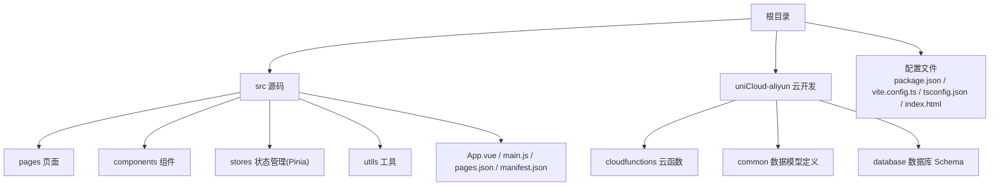
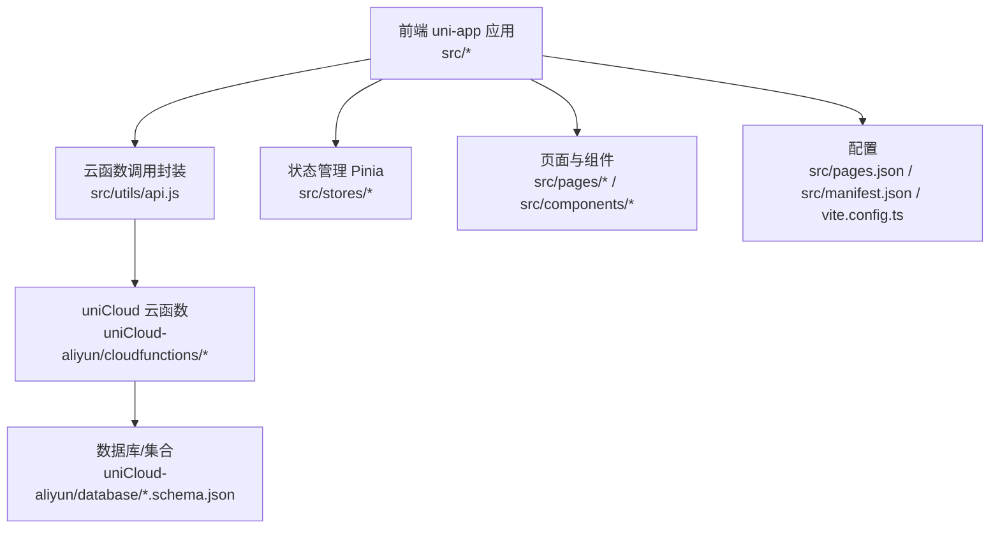
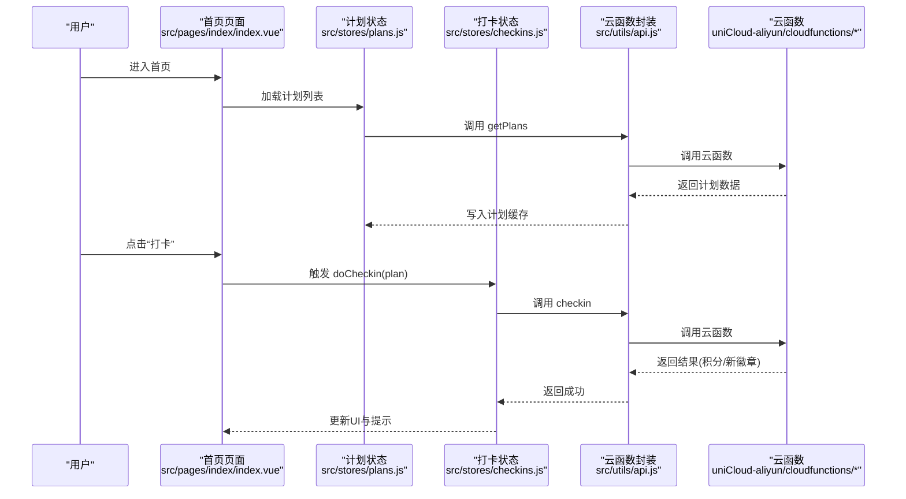
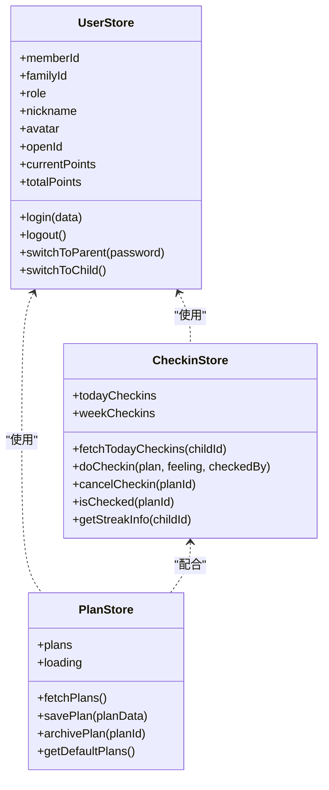
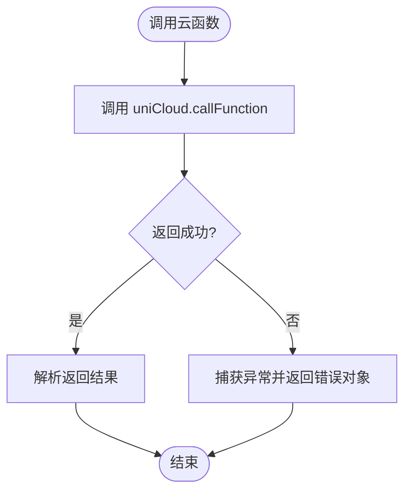
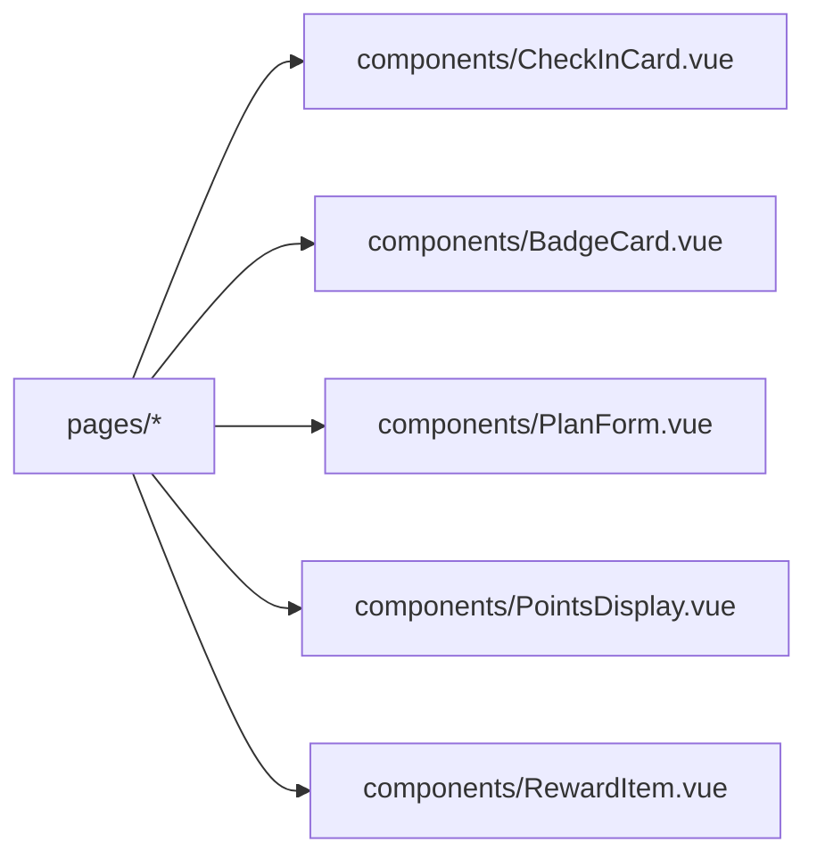
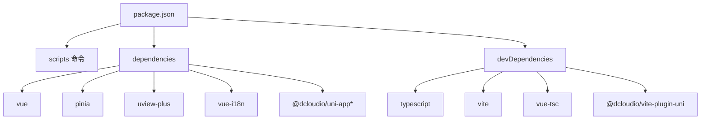

# 快速开始

<cite>
**本文引用的文件**
- [package.json](file://package.json)
- [vite.config.ts](file://vite.config.ts)
- [tsconfig.json](file://tsconfig.json)
- [shims-uni.d.ts](file://shims-uni.d.ts)
- [index.html](file://index.html)
- [src/main.js](file://src/main.js)
- [src/App.vue](file://src/App.vue)
- [src/pages.json](file://src/pages.json)
- [src/manifest.json](file://src/manifest.json)
- [src/pages/index/index.vue](file://src/pages/index/index.vue)
- [src/stores/user.js](file://src/stores/user.js)
- [src/stores/checkins.js](file://src/stores/checkins.js)
- [src/stores/plans.js](file://src/stores/plans.js)
- [src/utils/api.js](file://src/utils/api.js)
- [src/components/CheckInCard.vue](file://src/components/CheckInCard.vue)
- [uniCloud-aliyun/cloudfunctions/login/index.js](file://uniCloud-aliyun/cloudfunctions/login/index.js)
</cite>

## 目录
1. [简介](#简介)
2. [项目结构](#项目结构)
3. [核心组件](#核心组件)
4. [架构总览](#架构总览)
5. [详细组件分析](#详细组件分析)
6. [依赖分析](#依赖分析)
7. [性能考虑](#性能考虑)
8. [故障排查指南](#故障排查指南)
9. [结论](#结论)
10. [附录](#附录)

## 简介
本指南面向首次接触 Star Grow 项目的开发者，帮助你在 Windows 环境下快速完成开发环境搭建与项目启动，涵盖以下内容：
- 开发工具与 Node.js 版本要求
- HBuilderX 或 VS Code 的配置要点
- 项目依赖安装与常见兼容性问题
- uni-app 多端编译环境设置
- 本地开发服务器启动与小程序调试
- 目录结构与关键配置文件说明
- 首次运行验证步骤
- 常见问题排查

## 项目结构
该项目采用 uni-app 3 + Vite 架构，源码位于 src 目录，云开发位于 uniCloud-aliyun 目录，支持多端编译（H5、微信小程序、支付宝小程序等）。

图表来源
- [src/pages/index/index.vue:1-204](file://src/pages/index/index.vue#L1-L204)
- [src/stores/user.js:1-119](file://src/stores/user.js#L1-L119)
- [src/stores/checkins.js:1-163](file://src/stores/checkins.js#L1-L163)
- [src/stores/plans.js:1-73](file://src/stores/plans.js#L1-L73)
- [src/utils/api.js:1-18](file://src/utils/api.js#L1-L18)
- [uniCloud-aliyun/cloudfunctions/login/index.js:1-103](file://uniCloud-aliyun/cloudfunctions/login/index.js#L1-L103)

章节来源
- [package.json:1-74](file://package.json#L1-L74)
- [vite.config.ts:1-8](file://vite.config.ts#L1-L8)
- [tsconfig.json:1-14](file://tsconfig.json#L1-L14)
- [index.html:1-21](file://index.html#L1-L21)
- [src/pages.json:1-56](file://src/pages.json#L1-L56)
- [src/manifest.json:1-77](file://src/manifest.json#L1-L77)

## 核心组件
- 应用入口与全局状态
  - 应用入口：[src/main.js:1-11](file://src/main.js#L1-L11) 使用 Vue 3 SSR App 创建函数，并挂载 Pinia。
  - 全局 App：[src/App.vue:1-64](file://src/App.vue#L1-L64) 在 onLaunch 中初始化微信云开发（条件编译），并在 onShow 中触发离线数据同步。
- 页面与导航
  - 页面清单：[src/pages.json:1-56](file://src/pages.json#L1-L56) 定义页面路径、标题与 tabBar。
  - 应用清单：[src/manifest.json:1-77](file://src/manifest.json#L1-L77) 定义各小程序平台配置、uniCloud 供应商与版本。
- 状态管理（Pinia）
  - 用户状态：[src/stores/user.js:1-119](file://src/stores/user.js#L1-L119)
  - 打卡状态：[src/stores/checkins.js:1-163](file://src/stores/checkins.js#L1-L163)
  - 计划状态：[src/stores/plans.js:1-73](file://src/stores/plans.js#L1-L73)
- 工具与云函数
  - 云函数调用封装：[src/utils/api.js:1-18](file://src/utils/api.js#L1-L18)
  - 登录云函数示例：[uniCloud-aliyun/cloudfunctions/login/index.js:1-103](file://uniCloud-aliyun/cloudfunctions/login/index.js#L1-L103)

章节来源
- [src/main.js:1-11](file://src/main.js#L1-L11)
- [src/App.vue:1-64](file://src/App.vue#L1-L64)
- [src/pages.json:1-56](file://src/pages.json#L1-L56)
- [src/manifest.json:1-77](file://src/manifest.json#L1-L77)
- [src/stores/user.js:1-119](file://src/stores/user.js#L1-L119)
- [src/stores/checkins.js:1-163](file://src/stores/checkins.js#L1-L163)
- [src/stores/plans.js:1-73](file://src/stores/plans.js#L1-L73)
- [src/utils/api.js:1-18](file://src/utils/api.js#L1-L18)
- [uniCloud-aliyun/cloudfunctions/login/index.js:1-103](file://uniCloud-aliyun/cloudfunctions/login/index.js#L1-L103)

## 架构总览
整体架构由前端 uni-app 应用与 uniCloud 云开发组成，前端通过 uniCloud.callFunction 调用云函数，实现登录、打卡、计划、积分等业务逻辑。

图表来源
- [src/utils/api.js:1-18](file://src/utils/api.js#L1-L18)
- [uniCloud-aliyun/cloudfunctions/login/index.js:1-103](file://uniCloud-aliyun/cloudfunctions/login/index.js#L1-L103)
- [src/stores/user.js:1-119](file://src/stores/user.js#L1-L119)
- [src/stores/checkins.js:1-163](file://src/stores/checkins.js#L1-L163)
- [src/stores/plans.js:1-73](file://src/stores/plans.js#L1-L73)
- [src/pages.json:1-56](file://src/pages.json#L1-L56)
- [src/manifest.json:1-77](file://src/manifest.json#L1-L77)
- [vite.config.ts:1-8](file://vite.config.ts#L1-L8)

## 详细组件分析

### 组件 A：首页与打卡流程
首页负责展示问候语、日期、积分、今日任务与连续打卡徽章；用户可对计划进行打卡/撤销，支持离线记录与后续同步。

图表来源
- [src/pages/index/index.vue:109-136](file://src/pages/index/index.vue#L109-L136)
- [src/stores/plans.js:14-28](file://src/stores/plans.js#L14-L28)
- [src/stores/checkins.js:26-89](file://src/stores/checkins.js#L26-L89)
- [src/utils/api.js:9-17](file://src/utils/api.js#L9-L17)

章节来源
- [src/pages/index/index.vue:1-204](file://src/pages/index/index.vue#L1-L204)
- [src/stores/plans.js:1-73](file://src/stores/plans.js#L1-L73)
- [src/stores/checkins.js:1-163](file://src/stores/checkins.js#L1-L163)
- [src/utils/api.js:1-18](file://src/utils/api.js#L1-L18)

### 组件 B：状态管理（Pinia）
- 用户状态：负责登录态、角色切换、积分字段与持久化存储。
- 打卡状态：负责今日/本周打卡记录、连续打卡统计、撤销与离线队列。
- 计划状态：负责计划的拉取、保存、归档与默认模板。

图表来源
- [src/stores/user.js:1-119](file://src/stores/user.js#L1-L119)
- [src/stores/checkins.js:1-163](file://src/stores/checkins.js#L1-L163)
- [src/stores/plans.js:1-73](file://src/stores/plans.js#L1-L73)

章节来源
- [src/stores/user.js:1-119](file://src/stores/user.js#L1-L119)
- [src/stores/checkins.js:1-163](file://src/stores/checkins.js#L1-L163)
- [src/stores/plans.js:1-73](file://src/stores/plans.js#L1-L73)

### 组件 C：云函数与数据库交互
- 登录云函数：处理微信登录、白名单校验、成员查找/创建与返回。
- 云函数调用封装：统一处理 uniCloud.callFunction 的返回与错误。

图表来源
- [src/utils/api.js:9-17](file://src/utils/api.js#L9-L17)
- [uniCloud-aliyun/cloudfunctions/login/index.js:6-102](file://uniCloud-aliyun/cloudfunctions/login/index.js#L6-L102)

章节来源
- [src/utils/api.js:1-18](file://src/utils/api.js#L1-L18)
- [uniCloud-aliyun/cloudfunctions/login/index.js:1-103](file://uniCloud-aliyun/cloudfunctions/login/index.js#L1-L103)

### 组件 D：页面与组件
- 页面：首页、登录、计划、积分、奖励、勋章、周报、家长指南、设置等。
- 组件：打卡卡片、徽章卡片、计划表单、积分显示、奖励项等。

图表来源
- [src/pages/index/index.vue:48-56](file://src/pages/index/index.vue#L48-L56)
- [src/components/CheckInCard.vue:1-67](file://src/components/CheckInCard.vue#L1-L67)

章节来源
- [src/pages/index/index.vue:1-204](file://src/pages/index/index.vue#L1-L204)
- [src/components/CheckInCard.vue:1-67](file://src/components/CheckInCard.vue#L1-L67)

## 依赖分析
- 构建与脚本
  - 脚本命令集中在 package.json 的 scripts 字段，覆盖 H5 与多端小程序开发/构建。
  - Vite 插件通过 @dcloudio/vite-plugin-uni 注入。
- 依赖关系
  - 前端框架：Vue 3、Pinia、uView-Plus、vue-i18n
  - uni-app 生态：@dcloudio/uni-app 及各平台适配包
  - 类型与开发工具：@dcloudio/types、typescript、vue-tsc、vite

图表来源
- [package.json:4-72](file://package.json#L4-L72)
- [vite.config.ts:1-8](file://vite.config.ts#L1-L8)

章节来源
- [package.json:1-74](file://package.json#L1-L74)
- [vite.config.ts:1-8](file://vite.config.ts#L1-L8)

## 性能考虑
- 状态缓存：Pinia store 与本地存储结合，减少重复请求。
- 本地离线队列：在无网络时记录打卡，联网后批量同步。
- 组件按需渲染：根据计划数量与完成度动态渲染，避免不必要的重绘。
- 图标与资源：静态资源放置于 static 目录，建议在生产构建中启用压缩与懒加载策略。

## 故障排查指南
- Node.js 版本不匹配
  - 现象：安装依赖时报错或运行时报语法错误。
  - 解决：使用与项目依赖兼容的 Node.js 版本（建议 LTS），并清理 node_modules 与 lock 文件后重新安装。
- npm install 失败
  - 现象：安装过程中出现网络超时、权限不足或版本冲突。
  - 解决：更换镜像源、升级 npm、使用管理员权限、删除 node_modules 与 package-lock.json 后重试。
- uni-app 多端编译失败
  - 现象：H5 正常但小程序端报错。
  - 解决：检查 manifest.json 对应平台配置（如 appid、urlCheck），确认已安装对应平台的开发者工具。
- 微信小程序云开发初始化失败
  - 现象：App.vue 中 onLaunch 初始化云开发报错。
  - 解决：替换 App.vue 中的环境 ID 为你的实际环境 ID，并在微信公众平台配置服务器域名与业务域名。
- 云函数调用失败
  - 现象：前端调用云函数返回错误。
  - 解决：检查云函数名称与参数是否正确，确认云函数已上传部署，查看控制台日志定位异常。
- 登录白名单拒绝
  - 现象：登录接口返回“未开放”。
  - 解决：将 openId 添加至白名单，或调整登录逻辑与白名单校验规则。
- 离线数据无法同步
  - 现象：点击同步后无变化。
  - 解决：检查离线队列是否为空，确认网络恢复后再次触发同步流程。

章节来源
- [src/App.vue:8-18](file://src/App.vue#L8-L18)
- [src/manifest.json:52-58](file://src/manifest.json#L52-L58)
- [src/utils/api.js:9-17](file://src/utils/api.js#L9-L17)
- [uniCloud-aliyun/cloudfunctions/login/index.js:50-56](file://uniCloud-aliyun/cloudfunctions/login/index.js#L50-L56)
- [src/stores/checkins.js:77-88](file://src/stores/checkins.js#L77-L88)

## 结论
通过本指南，你可以在 Windows 上完成 Star Grow 项目的开发环境搭建与本地调试。建议先完成依赖安装与平台配置，再启动对应的小程序模拟器进行联调，最后在 H5 端验证核心功能。遇到问题时，优先检查 Node.js 版本、网络与云开发配置，逐步定位并解决。

## 附录

### A. 开发工具与 Node.js 要求
- 推荐使用 Node.js LTS 版本，确保与项目依赖兼容。
- HBuilderX：推荐使用最新稳定版，内置 uni-app 调试与多端编译能力。
- VS Code：安装 uni-app 相关插件（如 Vetur/Volar、ESLint、Prettier），并配置 TypeScript 路径别名。

### B. 项目依赖安装步骤
- 在项目根目录执行安装命令，等待依赖下载完成。
- 若安装失败，尝试更换镜像源或升级 npm。
- 安装完成后，执行类型检查脚本以验证类型配置。

章节来源
- [package.json:4-37](file://package.json#L4-L37)

### C. uni-app 多端编译环境设置
- H5：使用 dev:h5 或 build:h5 脚本。
- 微信小程序：使用 dev:mp-weixin 或 build:mp-weixin 脚本。
- 支付宝小程序：使用 dev:mp-alipay 或 build:mp-alipay 脚本。
- 其他平台：参考 package.json 中的 scripts 命令，选择对应平台参数。

章节来源
- [package.json:4-36](file://package.json#L4-L36)

### D. 本地开发服务器启动方法
- H5：执行 dev:h5，浏览器访问本地地址。
- 小程序：执行 dev:mp-weixin，打开微信开发者工具导入项目，勾选“不校验合法域名”等必要选项。
- 其他平台：同理，选择对应平台脚本并在对应开发者工具中导入项目。

章节来源
- [package.json:4-36](file://package.json#L4-L36)
- [src/manifest.json:52-58](file://src/manifest.json#L52-L58)

### E. 目录结构与关键配置文件说明
- src/pages.json：页面路径、导航栏与 tabBar 配置。
- src/manifest.json：各平台 appid、urlCheck、uniCloud 供应商等配置。
- vite.config.ts：Vite 插件注入，启用 @dcloudio/vite-plugin-uni。
- tsconfig.json：TypeScript 编译选项与路径映射。
- index.html：H5 入口模板，包含 viewport 与预加载占位符。

章节来源
- [src/pages.json:1-56](file://src/pages.json#L1-L56)
- [src/manifest.json:1-77](file://src/manifest.json#L1-L77)
- [vite.config.ts:1-8](file://vite.config.ts#L1-L8)
- [tsconfig.json:1-14](file://tsconfig.json#L1-L14)
- [index.html:1-21](file://index.html#L1-L21)

### F. 首次运行项目步骤验证
- 安装依赖并执行类型检查。
- 启动 H5 或指定小程序平台进行调试。
- 在首页查看问候语、日期与积分展示，尝试添加默认计划并进行打卡/撤销。
- 确认离线记录与同步流程正常。

章节来源
- [package.json:37-38](file://package.json#L37-L38)
- [src/pages/index/index.vue:101-125](file://src/pages/index/index.vue#L101-L125)
- [src/stores/checkins.js:77-88](file://src/stores/checkins.js#L77-L88)