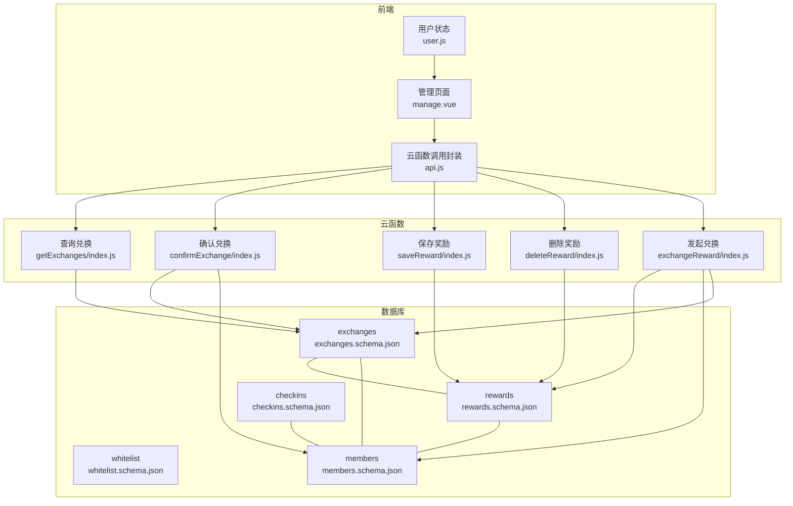
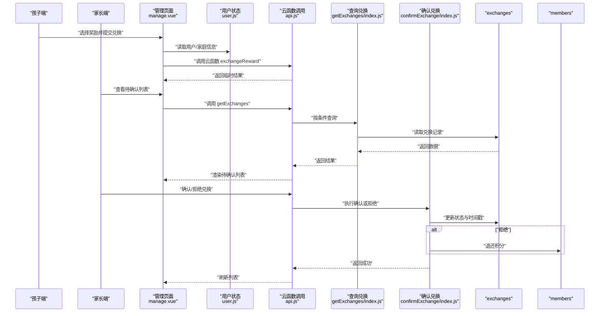
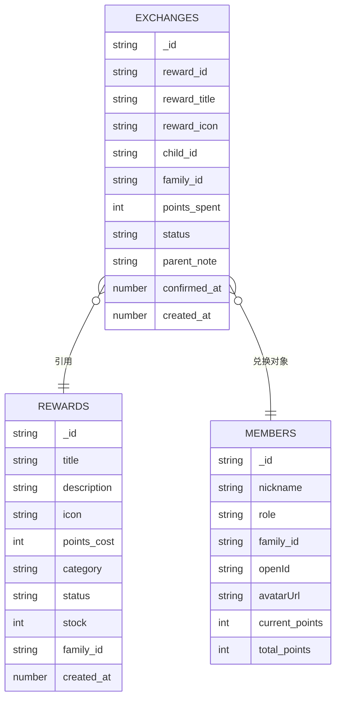
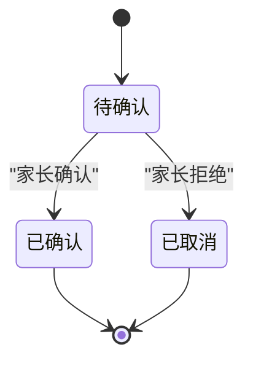
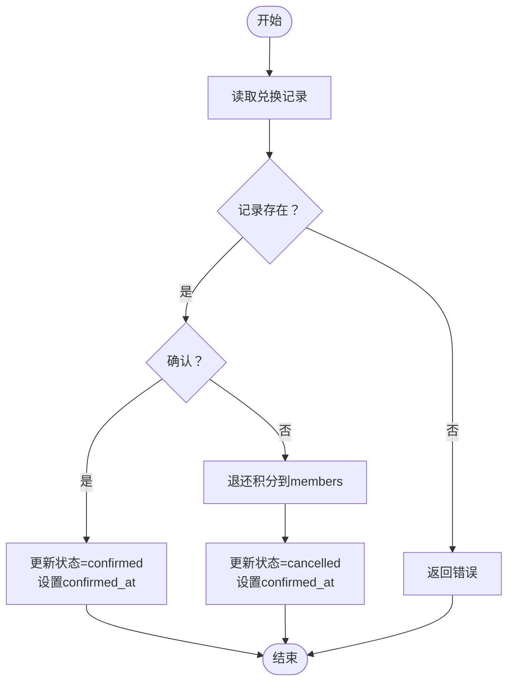
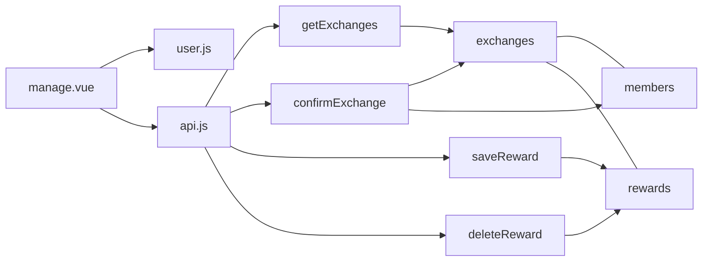

# 兑换与白名单集合设计

<cite>
**本文档引用的文件**
- [exchanges.schema.json](file://uniCloud-aliyun/database/exchanges.schema.json)
- [whitelist.schema.json](file://uniCloud-aliyun/database/whitelist.schema.json)
- [rewards.schema.json](file://uniCloud-aliyun/database/rewards.schema.json)
- [members.schema.json](file://uniCloud-aliyun/database/members.schema.json)
- [checkins.schema.json](file://uniCloud-aliyun/database/checkins.schema.json)
- [exchangeReward/index.js](file://src/cloudfunctions/exchangeReward/index.js)
- [getExchanges/index.js](file://uniCloud-aliyun/cloudfunctions/getExchanges/index.js)
- [confirmExchange/index.js](file://uniCloud-aliyun/cloudfunctions/confirmExchange/index.js)
- [saveReward/index.js](file://uniCloud-aliyun/cloudfunctions/saveReward/index.js)
- [deleteReward/index.js](file://uniCloud-aliyun/cloudfunctions/deleteReward/index.js)
- [user.js](file://src/stores/user.js)
- [manage.vue](file://src/pages/reward/manage.vue)
- [api.js](file://src/utils/api.js)
</cite>

## 目录
1. [引言](#引言)
2. [项目结构](#项目结构)
3. [核心组件](#核心组件)
4. [架构总览](#架构总览)
5. [详细组件分析](#详细组件分析)
6. [依赖分析](#依赖分析)
7. [性能考虑](#性能考虑)
8. [故障排除指南](#故障排除指南)
9. [结论](#结论)
10. [附录](#附录)

## 引言
本设计文档聚焦Star Grow项目中“兑换与白名单集合”的数据模型、状态管理、权限控制、事务处理与一致性保障、与用户认证系统的集成、审计与追踪、审批流程以及查询优化策略，并辅以数据安全与隐私保护建议。文档基于实际仓库中的数据库模式文件与云函数实现进行分析，确保内容可追溯且可落地。

## 项目结构
围绕兑换与白名单主题，项目在以下层次组织：
- 数据层：uniCloud-aliyun/database 下的各集合模式文件，定义字段、必填项、权限与默认值。
- 业务层：uniCloud-aliyun/cloudfunctions 下的云函数，实现兑换、查询、确认等核心业务。
- 前端层：src/pages/reward/manage.vue 展示家长端的兑换管理界面；src/stores/user.js 管理用户/家庭状态；src/utils/api.js 封装云函数调用。
- 认证与隔离：通过 members 集合的角色与 family_id 实现多用户隔离；白名单通过 whitelist 集合控制登录准入。

图表来源
- [manage.vue:83-96](file://src/pages/reward/manage.vue#L83-L96)
- [user.js:23-53](file://src/stores/user.js#L23-L53)
- [api.js:9-17](file://src/utils/api.js#L9-L17)
- [getExchanges/index.js:4-19](file://uniCloud-aliyun/cloudfunctions/getExchanges/index.js#L4-L19)
- [confirmExchange/index.js:4-33](file://uniCloud-aliyun/cloudfunctions/confirmExchange/index.js#L4-L33)
- [saveReward/index.js:4-31](file://uniCloud-aliyun/cloudfunctions/saveReward/index.js#L4-L31)
- [deleteReward/index.js:4-20](file://uniCloud-aliyun/cloudfunctions/deleteReward/index.js#L4-L20)
- [exchangeReward/index.js:4-19](file://src/cloudfunctions/exchangeReward/index.js#L4-L19)
- [exchanges.schema.json:10-54](file://uniCloud-aliyun/database/exchanges.schema.json#L10-L54)
- [whitelist.schema.json:10-26](file://uniCloud-aliyun/database/whitelist.schema.json#L10-L26)
- [rewards.schema.json:10-51](file://uniCloud-aliyun/database/rewards.schema.json#L10-L51)
- [members.schema.json:10-44](file://uniCloud-aliyun/database/members.schema.json#L10-L44)
- [checkins.schema.json:10-50](file://uniCloud-aliyun/database/checkins.schema.json#L10-L50)

章节来源
- [manage.vue:83-96](file://src/pages/reward/manage.vue#L83-L96)
- [user.js:23-53](file://src/stores/user.js#L23-L53)
- [api.js:9-17](file://src/utils/api.js#L9-L17)

## 核心组件
- 兑换集合（exchanges）：记录兑换请求、状态、积分消耗、家庭隔离标识、时间戳等。
- 白名单集合（whitelist）：记录允许登录的微信openId、备注与时间戳。
- 奖励集合（rewards）：记录奖励信息、积分成本、分类、状态、库存与家庭隔离。
- 成员集合（members）：记录用户角色、家庭隔离、积分余额等。
- 云函数：提供兑换查询、确认、奖励增删改查等能力。
- 前端页面：家长端展示待确认兑换并执行确认/拒绝操作。

章节来源
- [exchanges.schema.json:10-54](file://uniCloud-aliyun/database/exchanges.schema.json#L10-L54)
- [whitelist.schema.json:10-26](file://uniCloud-aliyun/database/whitelist.schema.json#L10-L26)
- [rewards.schema.json:10-51](file://uniCloud-aliyun/database/rewards.schema.json#L10-L51)
- [members.schema.json:10-44](file://uniCloud-aliyun/database/members.schema.json#L10-L44)

## 架构总览
下图展示了从前端到云函数再到数据库的完整交互路径，以及关键集合之间的关联关系。

图表来源
- [manage.vue:83-96](file://src/pages/reward/manage.vue#L83-L96)
- [manage.vue:150-177](file://src/pages/reward/manage.vue#L150-L177)
- [user.js:23-53](file://src/stores/user.js#L23-L53)
- [api.js:9-17](file://src/utils/api.js#L9-L17)
- [getExchanges/index.js:4-19](file://uniCloud-aliyun/cloudfunctions/getExchanges/index.js#L4-L19)
- [confirmExchange/index.js:4-33](file://uniCloud-aliyun/cloudfunctions/confirmExchange/index.js#L4-L33)
- [exchanges.schema.json:38-49](file://uniCloud-aliyun/database/exchanges.schema.json#L38-L49)
- [members.schema.json:34-43](file://uniCloud-aliyun/database/members.schema.json#L34-L43)

## 详细组件分析

### 兑换集合（exchanges）数据模型
- 必填字段：reward_id、reward_title、child_id、points_spent
- 关键字段：
  - reward_id/reward_title：指向奖励集合的引用信息
  - child_id：兑换对象（孩子）
  - family_id：家庭隔离标识
  - points_spent：消耗积分数
  - status：状态（pending/confirmed/cancelled）
  - parent_note：家长备注
  - confirmed_at：确认时间戳
  - created_at：创建时间戳
- 权限：读取与创建开启，更新开启，删除关闭（需业务侧配合）

图表来源
- [exchanges.schema.json:10-54](file://uniCloud-aliyun/database/exchanges.schema.json#L10-L54)
- [rewards.schema.json:10-51](file://uniCloud-aliyun/database/rewards.schema.json#L10-L51)
- [members.schema.json:10-44](file://uniCloud-aliyun/database/members.schema.json#L10-L44)

章节来源
- [exchanges.schema.json:3-9](file://uniCloud-aliyun/database/exchanges.schema.json#L3-L9)
- [exchanges.schema.json:10-54](file://uniCloud-aliyun/database/exchanges.schema.json#L10-L54)

### 白名单集合（whitelist）数据模型
- 必填字段：openId
- 关键字段：
  - openId：允许登录的微信openId
  - remark：备注（如用户名称）
  - created_at：添加时间戳
- 权限：读取、创建、更新、删除均开启

章节来源
- [whitelist.schema.json:3-9](file://uniCloud-aliyun/database/whitelist.schema.json#L3-L9)
- [whitelist.schema.json:10-26](file://uniCloud-aliyun/database/whitelist.schema.json#L10-L26)

### 兑换记录的状态管理机制
- 状态流转：
  - pending：创建兑换时初始状态
  - confirmed：家长确认后进入
  - cancelled：家长拒绝后进入，并触发积分退还
- 时间戳：
  - created_at：记录创建时间
  - confirmed_at：记录确认/取消时间
- 家长备注：
  - parent_note：可选字段，便于审计与沟通

图表来源
- [exchanges.schema.json:38-49](file://uniCloud-aliyun/database/exchanges.schema.json#L38-L49)
- [confirmExchange/index.js:15-30](file://uniCloud-aliyun/cloudfunctions/confirmExchange/index.js#L15-L30)

章节来源
- [exchanges.schema.json:38-49](file://uniCloud-aliyun/database/exchanges.schema.json#L38-L49)
- [confirmExchange/index.js:15-30](file://uniCloud-aliyun/cloudfunctions/confirmExchange/index.js#L15-L30)

### 白名单用户的权限控制与访问限制
- 白名单控制：仅当用户openId存在于whitelist集合时，允许登录入口（结合前端登录流程与后端鉴权策略）。
- 家庭隔离：所有集合均包含family_id字段，查询与写入时应带上该条件，避免跨家庭数据泄露。
- 角色控制：members集合的role字段区分parent/child，管理页面仅对家长开放。

章节来源
- [whitelist.schema.json:14-16](file://uniCloud-aliyun/database/whitelist.schema.json#L14-L16)
- [members.schema.json:18-21](file://uniCloud-aliyun/database/members.schema.json#L18-L21)

### 兑换操作的事务处理与数据一致性
- 当前实现要点：
  - 查询：getExchanges按条件查询并按时间倒序返回
  - 确认：confirmExchange原子性地更新状态与时间戳；若拒绝，则退还积分至members集合
- 一致性建议：
  - 使用数据库事务（如支持）包裹“扣减积分+创建兑换记录”与“退还积分”两个分支，确保最终一致
  - 对并发场景增加幂等校验（如重复确认、重复退还）
  - 对积分字段使用原子自增/自减命令，避免竞态

图表来源
- [getExchanges/index.js:8-16](file://uniCloud-aliyun/cloudfunctions/getExchanges/index.js#L8-L16)
- [confirmExchange/index.js:8-30](file://uniCloud-aliyun/cloudfunctions/confirmExchange/index.js#L8-L30)

章节来源
- [getExchanges/index.js:4-19](file://uniCloud-aliyun/cloudfunctions/getExchanges/index.js#L4-L19)
- [confirmExchange/index.js:4-33](file://uniCloud-aliyun/cloudfunctions/confirmExchange/index.js#L4-L33)

### 白名单与用户认证系统的集成
- 认证入口：前端登录流程中携带openId，后端根据whitelist.openId进行准入控制
- 家庭隔离：登录成功后，优先使用云端返回的family_id，确保后续所有数据操作均按家庭维度隔离
- 角色切换：用户状态store支持家长/孩子角色切换，家长拥有兑换确认权限

章节来源
- [user.js:23-53](file://src/stores/user.js#L23-L53)
- [whitelist.schema.json:14-16](file://uniCloud-aliyun/database/whitelist.schema.json#L14-L16)

### 兑换数据的审计日志与追踪机制
- 可审计字段：exchanges.created_at、exchanges.confirmed_at、members.current_points变更轨迹
- 追踪建议：
  - 在confirmExchange中记录操作日志（操作人、时间、动作、影响）
  - 对积分变动建立明细流水（可扩展members.points_history数组或新增明细集合）
  - 对白名单变更建立变更审计（whitelist.created_at、remark变更）

章节来源
- [exchanges.schema.json:50-53](file://uniCloud-aliyun/database/exchanges.schema.json#L50-L53)
- [members.schema.json:34-43](file://uniCloud-aliyun/database/members.schema.json#L34-L43)

### 白名单管理的审批流程与权限控制
- 审批流程建议：
  - 新增/修改白名单：管理员权限（可结合角色字段或独立管理员集合）
  - 删除白名单：二次确认与日志记录
- 权限控制：
  - whitelist集合本身权限全开，需在业务层（云函数）增加鉴权与越权校验
  - 建议在云函数中校验调用者角色与目标家庭

章节来源
- [whitelist.schema.json:4-9](file://uniCloud-aliyun/database/whitelist.schema.json#L4-L9)

### 兑换与白名单数据的查询优化策略
- 索引建议：
  - exchanges：child_id、status、family_id、created_at（复合索引）
  - whitelist：openId（唯一索引）
  - rewards：family_id、status、category（复合索引）
- 分页与排序：按created_at倒序分页，避免全表扫描
- 缓存：对热门奖励与白名单列表做短期缓存

章节来源
- [getExchanges/index.js:8-16](file://uniCloud-aliyun/cloudfunctions/getExchanges/index.js#L8-L16)
- [exchanges.schema.json:26-33](file://uniCloud-aliyun/database/exchanges.schema.json#L26-L33)
- [whitelist.schema.json:14](file://uniCloud-aliyun/database/whitelist.schema.json#L14)

### 数据安全与隐私保护措施
- 最小暴露：仅返回必要字段，避免泄露敏感信息
- 加密存储：对个人身份信息（如openId）在传输与存储中加密
- 访问控制：所有集合均需带family_id过滤；白名单操作需管理员权限
- 日志脱敏：审计日志中对openId等敏感字段做脱敏处理

## 依赖分析
- 前端依赖：
  - manage.vue 依赖 user.js 提供的用户/家庭信息，依赖 api.js 调用云函数
- 云函数依赖：
  - getExchanges 依赖 exchanges 集合
  - confirmExchange 依赖 exchanges 与 members 集合
  - saveReward/ deleteReward 依赖 rewards 集合
- 数据模型依赖：
  - exchanges 与 rewards、members 存在外键语义（字段引用）
  - checkins 与 members 存在外键语义

图表来源
- [manage.vue:83-96](file://src/pages/reward/manage.vue#L83-L96)
- [user.js:23-53](file://src/stores/user.js#L23-L53)
- [api.js:9-17](file://src/utils/api.js#L9-L17)
- [getExchanges/index.js:4-19](file://uniCloud-aliyun/cloudfunctions/getExchanges/index.js#L4-L19)
- [confirmExchange/index.js:4-33](file://uniCloud-aliyun/cloudfunctions/confirmExchange/index.js#L4-L33)
- [saveReward/index.js:4-31](file://uniCloud-aliyun/cloudfunctions/saveReward/index.js#L4-L31)
- [deleteReward/index.js:4-20](file://uniCloud-aliyun/cloudfunctions/deleteReward/index.js#L4-L20)
- [exchanges.schema.json:10-54](file://uniCloud-aliyun/database/exchanges.schema.json#L10-L54)
- [members.schema.json:10-44](file://uniCloud-aliyun/database/members.schema.json#L10-L44)
- [rewards.schema.json:10-51](file://uniCloud-aliyun/database/rewards.schema.json#L10-L51)

章节来源
- [manage.vue:83-96](file://src/pages/reward/manage.vue#L83-L96)
- [user.js:23-53](file://src/stores/user.js#L23-L53)
- [api.js:9-17](file://src/utils/api.js#L9-L17)

## 性能考虑
- 查询性能：
  - 为高频查询字段建立索引（如exchanges.child_id、status、family_id）
  - 使用分页与排序，避免一次性加载过多数据
- 写入性能：
  - 批量写入与事务合并，减少往返次数
  - 对积分等热点字段采用原子操作
- 缓存策略：
  - 对静态配置（如奖励列表）做短期缓存
  - 对白名单列表做缓存并设置失效时间

## 故障排除指南
- 兑换无法查询：
  - 检查是否传入正确的family_id与child_id/status过滤条件
  - 确认查询接口返回结构与前端解析逻辑一致
- 兑换确认失败：
  - 校验兑换记录是否存在与状态是否为pending
  - 拒绝时检查积分退还逻辑是否执行
- 白名单无效：
  - 确认openId是否正确且未过期
  - 检查白名单条目是否被误删或修改

章节来源
- [getExchanges/index.js:8-16](file://uniCloud-aliyun/cloudfunctions/getExchanges/index.js#L8-L16)
- [confirmExchange/index.js:11-13](file://uniCloud-aliyun/cloudfunctions/confirmExchange/index.js#L11-L13)
- [whitelist.schema.json:14-16](file://uniCloud-aliyun/database/whitelist.schema.json#L14-L16)

## 结论
本设计文档基于现有数据库模式与云函数实现，梳理了兑换与白名单集合的数据模型、状态管理、权限控制与一致性保障方案，并提出了审计、审批流程、查询优化与安全隐私建议。建议在后续版本中引入数据库事务、更完善的审计日志与白名单审批流程，以进一步提升系统的可靠性与合规性。

## 附录
- 奖励集合（rewards）与成员集合（members）的字段定义与默认值，用于理解积分体系与家庭隔离机制
- 打卡集合（checkins）用于积分发放与加成计算的基础数据

章节来源
- [rewards.schema.json:10-51](file://uniCloud-aliyun/database/rewards.schema.json#L10-L51)
- [members.schema.json:10-44](file://uniCloud-aliyun/database/members.schema.json#L10-L44)
- [checkins.schema.json:10-50](file://uniCloud-aliyun/database/checkins.schema.json#L10-L50)