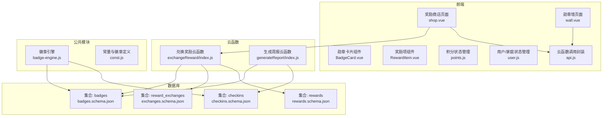
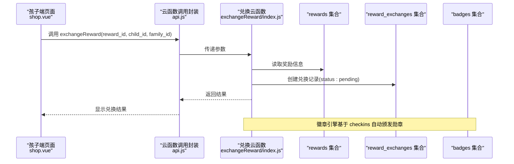
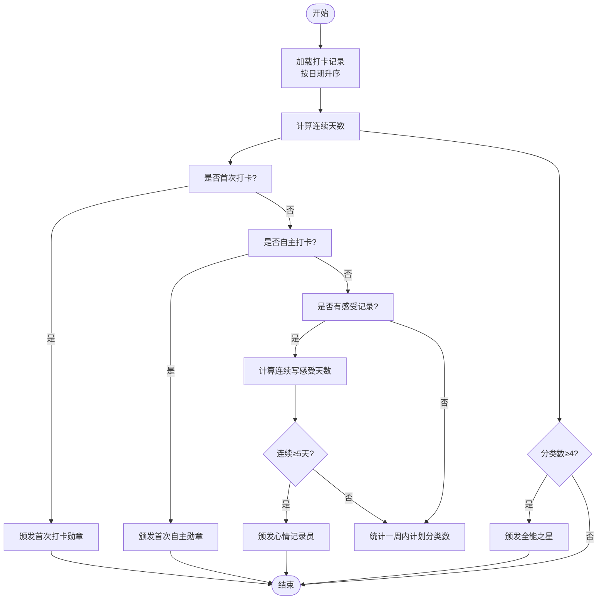
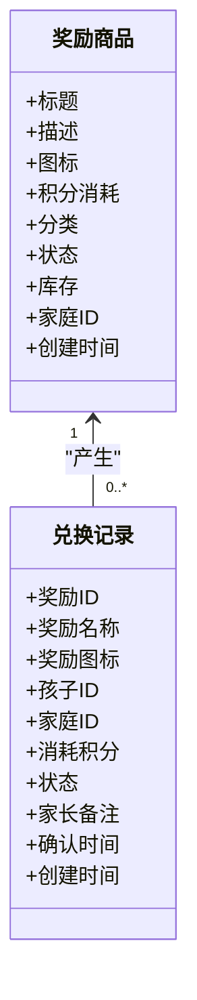
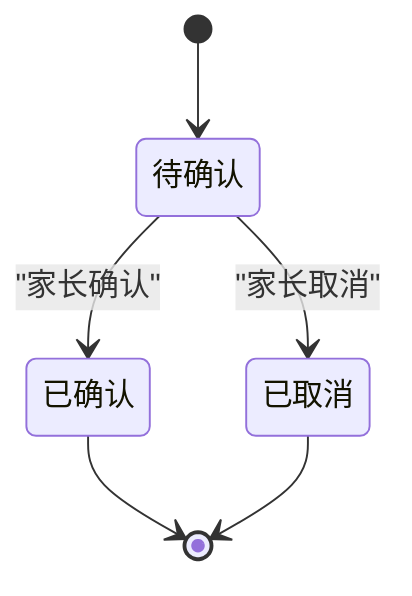
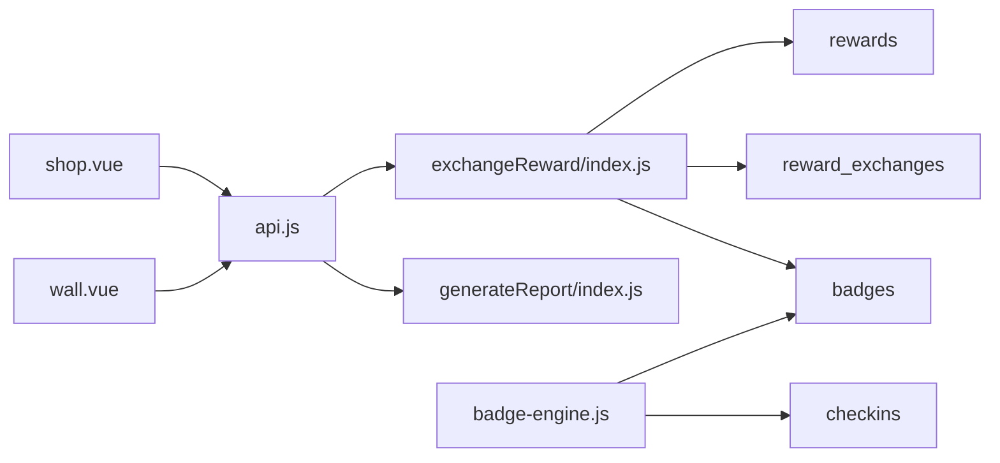

# 勋章与奖励集合设计

<cite>
**本文档引用的文件**
- [badges.schema.json](file://uniCloud-aliyun/database/badges.schema.json)
- [rewards.schema.json](file://uniCloud-aliyun/database/rewards.schema.json)
- [exchanges.schema.json](file://uniCloud-aliyun/database/exchanges.schema.json)
- [checkins.schema.json](file://uniCloud-aliyun/database/checkins.schema.json)
- [badge-engine.js](file://uniCloud-aliyun/common/badge-engine.js)
- [const.js](file://uniCloud-aliyun/common/const.js)
- [exchangeReward/index.js](file://src/cloudfunctions/exchangeReward/index.js)
- [generateReport/index.js](file://src/cloudfunctions/generateReport/index.js)
- [BadgeCard.vue](file://src/components/BadgeCard.vue)
- [RewardItem.vue](file://src/components/RewardItem.vue)
- [shop.vue](file://src/pages/reward/shop.vue)
- [wall.vue](file://src/pages/badge/wall.vue)
- [points.js](file://src/stores/points.js)
- [user.js](file://src/stores/user.js)
- [api.js](file://src/utils/api.js)
</cite>

## 目录
1. [简介](#简介)
2. [项目结构](#项目结构)
3. [核心组件](#核心组件)
4. [架构总览](#架构总览)
5. [详细组件分析](#详细组件分析)
6. [依赖分析](#依赖分析)
7. [性能考虑](#性能考虑)
8. [故障排除指南](#故障排除指南)
9. [结论](#结论)
10. [附录](#附录)

## 简介
本设计文档围绕 Star Grow 项目的勋章与奖励系统，系统性阐述以下内容：
- badges 和 rewards 集合的数据结构与字段定义
- 勋章类型设计与解锁条件机制
- 奖励商品的分类、价格与库存管理
- 勋章与奖励的查询、分配、兑换操作示例
- 勋章收集与积分消耗的关联关系
- 奖励兑换的业务流程与状态管理
- 勋章成就系统的数据模型设计
- 奖励数据的权限控制与安全策略
- 勋章与奖励数据的统计分析与报告功能

## 项目结构
本项目采用前端页面与 uniCloud 后端云函数/数据库 Schema 的分层组织方式：
- 前端页面与组件：负责用户交互与状态管理
- 云函数：实现业务逻辑（如兑换、报告生成）
- 数据库 Schema：定义集合结构、字段约束与权限
- 公共模块：包含徽章引擎与常量配置

图表来源
- [shop.vue:1-135](file://src/pages/reward/shop.vue#L1-L135)
- [wall.vue:1-82](file://src/pages/badge/wall.vue#L1-L82)
- [exchangeReward/index.js:1-28](file://src/cloudfunctions/exchangeReward/index.js#L1-L28)
- [generateReport/index.js:1-33](file://src/cloudfunctions/generateReport/index.js#L1-L33)
- [badges.schema.json:1-40](file://uniCloud-aliyun/database/badges.schema.json#L1-L40)
- [rewards.schema.json:1-53](file://uniCloud-aliyun/database/rewards.schema.json#L1-L53)
- [exchanges.schema.json:1-56](file://uniCloud-aliyun/database/exchanges.schema.json#L1-L56)
- [checkins.schema.json:1-52](file://uniCloud-aliyun/database/checkins.schema.json#L1-L52)
- [badge-engine.js:1-125](file://uniCloud-aliyun/common/badge-engine.js#L1-L125)
- [const.js:1-27](file://uniCloud-aliyun/common/const.js#L1-L27)

章节来源
- [shop.vue:1-135](file://src/pages/reward/shop.vue#L1-L135)
- [wall.vue:1-82](file://src/pages/badge/wall.vue#L1-L82)
- [exchangeReward/index.js:1-28](file://src/cloudfunctions/exchangeReward/index.js#L1-L28)
- [generateReport/index.js:1-33](file://src/cloudfunctions/generateReport/index.js#L1-L33)
- [badges.schema.json:1-40](file://uniCloud-aliyun/database/badges.schema.json#L1-L40)
- [rewards.schema.json:1-53](file://uniCloud-aliyun/database/rewards.schema.json#L1-L53)
- [exchanges.schema.json:1-56](file://uniCloud-aliyun/database/exchanges.schema.json#L1-L56)
- [checkins.schema.json:1-52](file://uniCloud-aliyun/database/checkins.schema.json#L1-L52)
- [badge-engine.js:1-125](file://uniCloud-aliyun/common/badge-engine.js#L1-L125)
- [const.js:1-27](file://uniCloud-aliyun/common/const.js#L1-L27)

## 核心组件
本节聚焦 badges、rewards、exchanges 三个核心集合的数据模型与字段定义。

- badges 集合
  - 字段要点：child_id、badge_type、title、icon、desc、unlocked_at
  - 权限：读取与创建开放，更新与删除受限
  - 用途：记录每个孩子已解锁的各类勋章

- rewards 集合
  - 字段要点：title、description、icon、points_cost、category、status、stock、family_id、created_at
  - 权限：读取、创建、更新、删除开放
  - 用途：奖励商品目录，支持分类、状态与库存管理

- exchanges 集合
  - 字段要点：reward_id、reward_title、reward_icon、child_id、family_id、points_spent、status、parent_note、confirmed_at、created_at
  - 权限：读取与创建开放，更新与删除受限
  - 用途：记录兑换申请与家长确认状态

章节来源
- [badges.schema.json:1-40](file://uniCloud-aliyun/database/badges.schema.json#L1-L40)
- [rewards.schema.json:1-53](file://uniCloud-aliyun/database/rewards.schema.json#L1-L53)
- [exchanges.schema.json:1-56](file://uniCloud-aliyun/database/exchanges.schema.json#L1-L56)

## 架构总览
下图展示勋章与奖励系统的关键交互路径：前端页面通过云函数访问数据库，徽章引擎根据打卡数据自动颁发勋章，兑换流程涉及积分扣减与兑换记录状态流转。

图表来源
- [shop.vue:77-104](file://src/pages/reward/shop.vue#L77-L104)
- [api.js:9-17](file://src/utils/api.js#L9-L17)
- [exchangeReward/index.js:4-18](file://src/cloudfunctions/exchangeReward/index.js#L4-L18)
- [rewards.schema.json:14-50](file://uniCloud-aliyun/database/rewards.schema.json#L14-L50)
- [exchanges.schema.json:14-53](file://uniCloud-aliyun/database/exchanges.schema.json#L14-L53)
- [badge-engine.js:52-122](file://uniCloud-aliyun/common/badge-engine.js#L52-L122)

## 详细组件分析

### 勋章系统数据模型与解锁机制
- 勋章类型与定义
  - 常量定义包含多种徽章类型，如首次打卡、连续打卡、自主打卡、全能之星、心情记录员等
  - 每种类型包含标题、图标与描述

- 解锁条件与触发逻辑
  - 连续打卡天数：基于 checkins 集合按日期排序统计连续天数，达到阈值时颁发对应勋章
  - 自主打卡：当打卡记录中标记为自打且未重复获得“首次自主”勋章时颁发
  - 心情记录员：统计连续5天写感受的日期序列，满足条件时颁发
  - 全能之星：统计一周内不同计划分类数量，若覆盖≥4类则颁发
  - 奖励兑换：兑换成功后会创建 pending 兑换记录，后续由家长确认或取消

图表来源
- [badge-engine.js:52-122](file://uniCloud-aliyun/common/badge-engine.js#L52-L122)
- [checkins.schema.json:14-49](file://uniCloud-aliyun/database/checkins.schema.json#L14-L49)
- [const.js:6-17](file://uniCloud-aliyun/common/const.js#L6-L17)

章节来源
- [badge-engine.js:1-125](file://uniCloud-aliyun/common/badge-engine.js#L1-L125)
- [const.js:1-27](file://uniCloud-aliyun/common/const.js#L1-L27)
- [checkins.schema.json:1-52](file://uniCloud-aliyun/database/checkins.schema.json#L1-L52)

### 奖励系统数据模型与库存管理
- 商品分类与属性
  - 分类：experience（体验类）、material（物质类）
  - 属性：points_cost（积分消耗）、stock（库存，-1 表示无限）、status（active/archived）

- 库存与价格控制
  - 兑换前前端与后端均需校验积分余额与库存
  - 库存为 -1 表示无限可用；实际业务可扩展为扣减库存的逻辑

- 页面与组件交互
  - 奖励商店页面支持分类筛选与积分显示
  - 奖励项组件根据用户积分决定按钮可用状态

图表来源
- [rewards.schema.json:14-50](file://uniCloud-aliyun/database/rewards.schema.json#L14-L50)
- [exchanges.schema.json:14-53](file://uniCloud-aliyun/database/exchanges.schema.json#L14-L53)

章节来源
- [rewards.schema.json:1-53](file://uniCloud-aliyun/database/rewards.schema.json#L1-L53)
- [exchanges.schema.json:1-56](file://uniCloud-aliyun/database/exchanges.schema.json#L1-L56)
- [RewardItem.vue:1-53](file://src/components/RewardItem.vue#L1-L53)
- [shop.vue:1-135](file://src/pages/reward/shop.vue#L1-L135)

### 兑换流程与状态管理
- 流程步骤
  1) 孩子端选择奖励并发起兑换请求
  2) 云函数校验积分与库存，创建兑换记录（状态 pending）
  3) 家长端确认或取消兑换
  4) 状态变更：confirmed 或 cancelled

- 状态流转
  - pending → confirmed：家长确认，系统可执行积分扣减与库存处理
  - pending → cancelled：家长拒绝，系统退还积分

图表来源
- [exchanges.schema.json:38-40](file://uniCloud-aliyun/database/exchanges.schema.json#L38-L40)
- [exchangeReward/index.js:21-27](file://src/cloudfunctions/exchangeReward/index.js#L21-L27)

章节来源
- [exchangeReward/index.js:1-28](file://src/cloudfunctions/exchangeReward/index.js#L1-L28)
- [exchanges.schema.json:1-56](file://uniCloud-aliyun/database/exchanges.schema.json#L1-L56)

### 查询、分配与兑换操作示例
- 查询徽章
  - 页面：勋章墙
  - 方法：调用 getBadges 云函数，按 child_id 查询
  - 组件：BadgeCard 渲染已解锁/未解锁状态

- 查询奖励
  - 页面：奖励商店
  - 方法：调用 getRewards 云函数，按 family_id 过滤
  - 组件：RewardItem 根据积分判断按钮可用性

- 兑换奖励
  - 步骤：确认积分充足 → 弹窗确认 → 调用 exchangeReward 云函数 → 更新本地积分状态

章节来源
- [wall.vue:58-65](file://src/pages/badge/wall.vue#L58-L65)
- [BadgeCard.vue:1-37](file://src/components/BadgeCard.vue#L1-L37)
- [shop.vue:64-71](file://src/pages/reward/shop.vue#L64-L71)
- [RewardItem.vue:20-34](file://src/components/RewardItem.vue#L20-L34)
- [shop.vue:77-104](file://src/pages/reward/shop.vue#L77-L104)

### 勋章收集与积分消耗的关联关系
- 勋章与积分的间接关联
  - 勋章通过徽章引擎自动颁发，不直接消耗积分
  - 奖励兑换直接消耗积分，与徽章收集形成互补的激励闭环

- 前端状态同步
  - 积分状态管理：当前积分、历史记录、累计积分
  - 兑换后前端即时扣减当前积分并更新历史

章节来源
- [badge-engine.js:52-122](file://uniCloud-aliyun/common/badge-engine.js#L52-L122)
- [points.js:14-40](file://src/stores/points.js#L14-L40)
- [shop.vue:94-95](file://src/pages/reward/shop.vue#L94-L95)

### 报告与统计分析
- 周报生成
  - 输入：child_id、week_start
  - 输出：统计指标（总打卡次数、可能次数、完成率、获得积分）、分类分布、本周解锁徽章、家长建议

- 数据来源
  - 打卡记录：checkins 集合
  - 徽章解锁：badges 集合（按解锁时间过滤）

章节来源
- [generateReport/index.js:4-31](file://src/cloudfunctions/generateReport/index.js#L4-L31)
- [checkins.schema.json:14-49](file://uniCloud-aliyun/database/checkins.schema.json#L14-L49)
- [badges.schema.json:14-37](file://uniCloud-aliyun/database/badges.schema.json#L14-L37)

## 依赖分析
- 前端依赖
  - 页面依赖云函数封装与 Pinia 状态管理
  - 组件依赖样式与事件回调

- 云函数依赖
  - 访问数据库集合进行读写
  - 依赖公共模块中的常量与徽章引擎

- 数据库依赖
  - badges、rewards、exchanges、checkins 四个集合相互配合
  - 权限控制确保数据隔离与安全

图表来源
- [shop.vue:1-135](file://src/pages/reward/shop.vue#L1-L135)
- [wall.vue:1-82](file://src/pages/badge/wall.vue#L1-L82)
- [api.js:1-18](file://src/utils/api.js#L1-L18)
- [exchangeReward/index.js:1-28](file://src/cloudfunctions/exchangeReward/index.js#L1-L28)
- [generateReport/index.js:1-33](file://src/cloudfunctions/generateReport/index.js#L1-L33)
- [badge-engine.js:1-125](file://uniCloud-aliyun/common/badge-engine.js#L1-L125)
- [checkins.schema.json:1-52](file://uniCloud-aliyun/database/checkins.schema.json#L1-L52)

章节来源
- [shop.vue:1-135](file://src/pages/reward/shop.vue#L1-L135)
- [wall.vue:1-82](file://src/pages/badge/wall.vue#L1-L82)
- [api.js:1-18](file://src/utils/api.js#L1-L18)
- [exchangeReward/index.js:1-28](file://src/cloudfunctions/exchangeReward/index.js#L1-L28)
- [generateReport/index.js:1-33](file://src/cloudfunctions/generateReport/index.js#L1-L33)
- [badge-engine.js:1-125](file://uniCloud-aliyun/common/badge-engine.js#L1-L125)

## 性能考虑
- 查询优化
  - badges、rewards、exchanges、checkins 建议按常用查询键建立索引（如 child_id、family_id、date、status）
- 批量写入
  - 徽章颁发时批量插入 badges，减少网络往返
- 前端缓存
  - 使用 Pinia 状态持久化当前积分与历史记录，降低重复请求

## 故障排除指南
- 兑换失败
  - 检查积分余额与库存是否满足条件
  - 查看云函数返回错误信息与网络状态
- 徽章未解锁
  - 确认打卡记录是否符合连续天数、分类覆盖等条件
  - 检查徽章引擎逻辑与现有徽章去重
- 报告数据异常
  - 核对 week_start 参数与 checkins 数据范围
  - 确认 badges 解锁时间是否正确

章节来源
- [exchangeReward/index.js:4-18](file://src/cloudfunctions/exchangeReward/index.js#L4-L18)
- [badge-engine.js:52-122](file://uniCloud-aliyun/common/badge-engine.js#L52-L122)
- [generateReport/index.js:4-31](file://src/cloudfunctions/generateReport/index.js#L4-L31)

## 结论
本设计文档从数据模型、业务流程、权限控制与统计分析等方面完整梳理了 Star Grow 的勋章与奖励系统。通过明确的集合结构、清晰的解锁与兑换机制以及前后端协同的状态管理，系统实现了对儿童行为的正向激励与可视化追踪。后续可在库存扣减、家长确认流程完善与报表维度扩展方面持续迭代。

## 附录
- 关键字段速览
  - badges：child_id、badge_type、title、icon、desc、unlocked_at
  - rewards：title、description、icon、points_cost、category、status、stock、family_id、created_at
  - exchanges：reward_id、reward_title、reward_icon、child_id、family_id、points_spent、status、parent_note、confirmed_at、created_at
  - checkins：plan_id、child_id、date、checked_by、feeling、points_earned、bonus_points、bonus_type、created_at