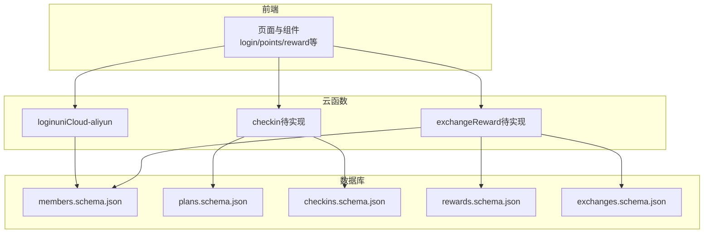
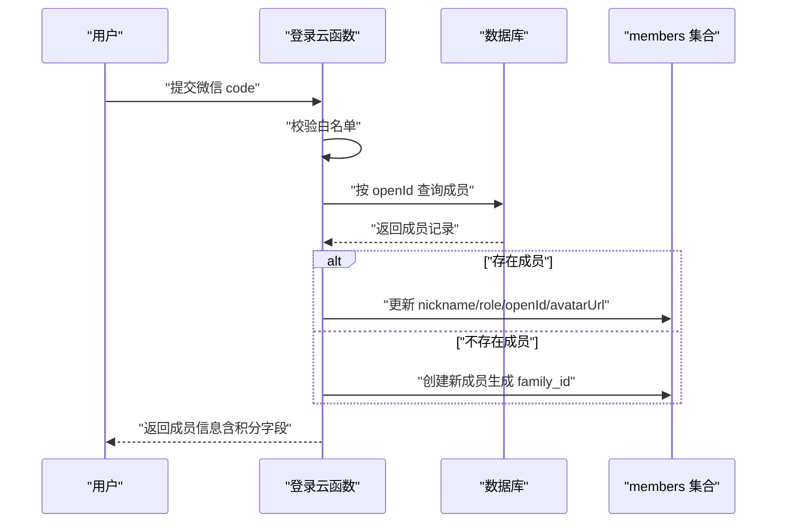
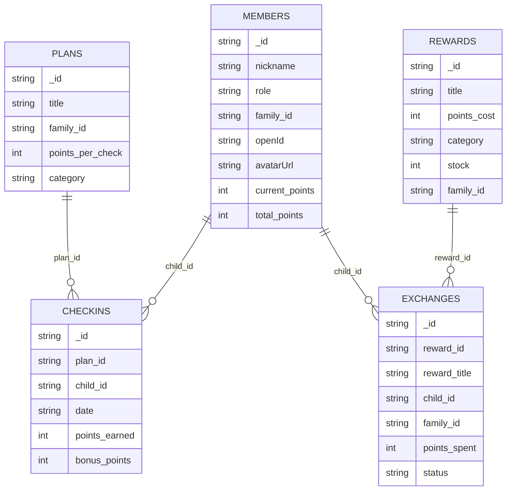
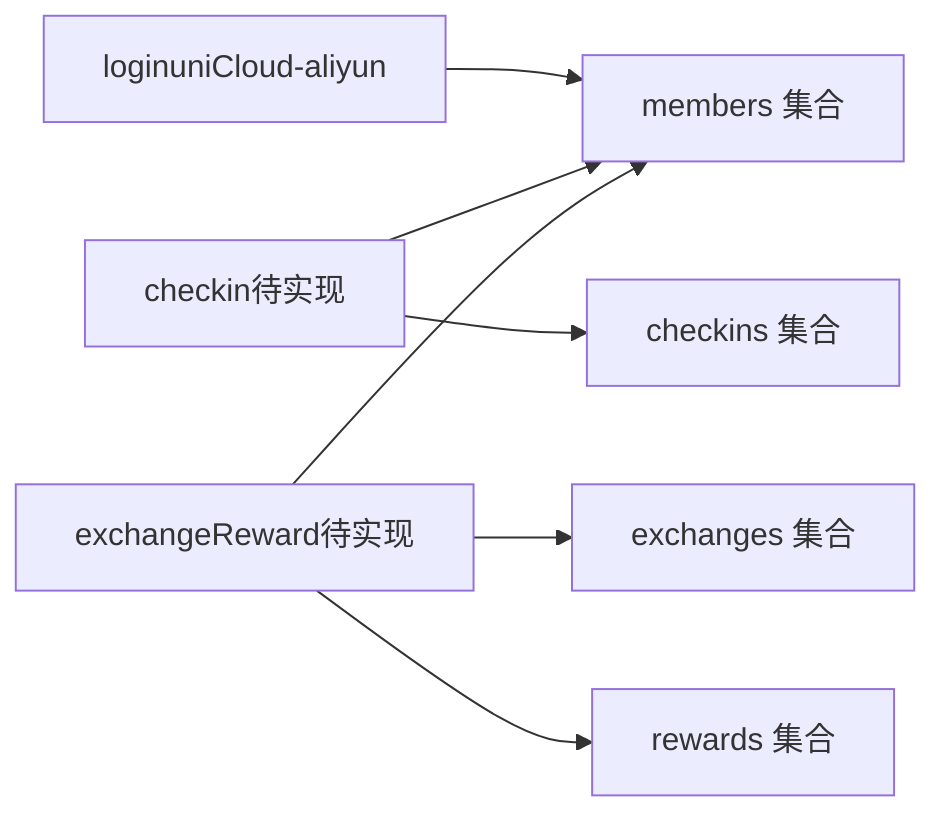

# 成员集合设计

<cite>
**本文档引用的文件**
- [members.schema.json](file://uniCloud-aliyun/database/members.schema.json)
- [plans.schema.json](file://uniCloud-aliyun/database/plans.schema.json)
- [checkins.schema.json](file://uniCloud-aliyun/database/checkins.schema.json)
- [rewards.schema.json](file://uniCloud-aliyun/database/rewards.schema.json)
- [exchanges.schema.json](file://uniCloud-aliyun/database/exchanges.schema.json)
- [login（uniCloud-aliyun）.js](file://uniCloud-aliyun/cloudfunctions/login/index.js)
- [login（src）.js](file://src/cloudfunctions/login/index.js)
</cite>

## 目录
1. [简介](#简介)
2. [项目结构](#项目结构)
3. [核心组件](#核心组件)
4. [架构总览](#架构总览)
5. [详细组件分析](#详细组件分析)
6. [依赖分析](#依赖分析)
7. [性能考虑](#性能考虑)
8. [故障排除指南](#故障排除指南)
9. [结论](#结论)
10. [附录](#附录)

## 简介
本设计文档聚焦于 Star Grow 项目中的成员集合（members）设计，系统性阐述其数据结构、字段定义、成员角色与家庭关系管理、积分字段设计与计算逻辑、增删改查操作示例、权限控制与数据安全策略、数据验证规则与约束、以及与计划（plans）、打卡（checkins）、奖励（rewards）、兑换（exchanges）等集合的关联关系，并提供数据迁移与备份策略建议。

## 项目结构
成员集合位于 uniCloud-aliyun 的数据库 schema 定义中，配合云函数实现登录与成员生命周期管理；前端页面与组件通过云函数调用实现用户交互与数据更新。

图表来源
- [members.schema.json:1-46](file://uniCloud-aliyun/database/members.schema.json#L1-L46)
- [plans.schema.json:1-50](file://uniCloud-aliyun/database/plans.schema.json#L1-L50)
- [checkins.schema.json:1-52](file://uniCloud-aliyun/database/checkins.schema.json#L1-L52)
- [rewards.schema.json:1-53](file://uniCloud-aliyun/database/rewards.schema.json#L1-L53)
- [exchanges.schema.json:1-56](file://uniCloud-aliyun/database/exchanges.schema.json#L1-L56)
- [login（uniCloud-aliyun）.js:1-103](file://uniCloud-aliyun/cloudfunctions/login/index.js#L1-L103)

章节来源
- [members.schema.json:1-46](file://uniCloud-aliyun/database/members.schema.json#L1-L46)
- [login（uniCloud-aliyun）.js:1-103](file://uniCloud-aliyun/cloudfunctions/login/index.js#L1-L103)

## 核心组件
- 成员集合（members）
  - 角色：parent（家长）、child（孩子）
  - 家庭隔离：通过 family_id 实现多用户数据隔离
  - 积分：current_points（当前可用积分）、total_points（累计获得积分）
  - 关联：与 checkins、exchanges 等集合通过 child_id/family_id 建立关系
- 权限与安全
  - 登录流程：微信 code 换取 openId，白名单校验，查询/创建成员
  - 数据隔离：基于 openId 生成 family_id，确保同一家庭内数据共享，不同家庭隔离
  - 默认值：current_points、total_points 初始化为 0

章节来源
- [members.schema.json:1-46](file://uniCloud-aliyun/database/members.schema.json#L1-L46)
- [login（uniCloud-aliyun）.js:50-99](file://uniCloud-aliyun/cloudfunctions/login/index.js#L50-L99)

## 架构总览
成员集合在系统中的位置与交互如下：

图表来源
- [login（uniCloud-aliyun）.js:50-102](file://uniCloud-aliyun/cloudfunctions/login/index.js#L50-L102)
- [members.schema.json:34-43](file://uniCloud-aliyun/database/members.schema.json#L34-L43)

## 详细组件分析

### 数据结构与字段定义
- 必填字段
  - nickname：字符串，昵称
  - role：字符串，角色（parent/child）
  - family_id：字符串，家庭标识，用于数据隔离
- 基础字段
  - openId：字符串，微信 openId
  - avatarUrl：字符串，头像 URL
- 积分字段
  - current_points：整数，默认 0，当前可用积分
  - total_points：整数，默认 0，累计获得积分
- 其他
  - _id：文档 ID

章节来源
- [members.schema.json:1-46](file://uniCloud-aliyun/database/members.schema.json#L1-L46)

### 成员角色设计与家庭关系管理
- 角色
  - parent：家长，通常拥有更多操作权限（如确认兑换）
  - child：孩子，主要参与打卡与获得积分
- 家庭隔离
  - 新用户首次登录时，使用 openId 生成 family_id，确保同一家庭成员共享数据
  - 后续登录若传入 memberId，则按 memberId 获取并更新成员信息

章节来源
- [members.schema.json:18-25](file://uniCloud-aliyun/database/members.schema.json#L18-L25)
- [login（uniCloud-aliyun）.js:84-99](file://uniCloud-aliyun/cloudfunctions/login/index.js#L84-L99)

### 积分字段设计与计算逻辑
- 字段
  - current_points：当前可用积分，用于消费与兑换
  - total_points：累计获得积分，仅统计不直接消费
- 计算与更新（基于现有 schema 的推导）
  - 打卡获得积分：checkins 中 points_earned 与 bonus_points 可能影响成员积分，但具体累加逻辑需在业务层实现
  - 兑换消耗积分：exchanges 中 points_spent 从 child_id 对应成员的 current_points 扣减
  - 建议在业务层维护 current_points = sum(checkins.points_earned) + sum(checkins.bonus_points) - sum(exchanges.points_spent)
- 默认值
  - 新成员初始化 current_points 与 total_points 为 0

章节来源
- [members.schema.json:34-43](file://uniCloud-aliyun/database/members.schema.json#L34-L43)
- [checkins.schema.json:34-41](file://uniCloud-aliyun/database/checkins.schema.json#L34-L41)
- [exchanges.schema.json:34-37](file://uniCloud-aliyun/database/exchanges.schema.json#L34-L37)

### 增删改查操作示例
- 创建成员
  - 输入：code（或 memberId、openId、nickname、role、avatarUrl）
  - 流程：登录云函数根据 openId 生成 family_id 并创建成员，返回成员信息
  - 参考路径：[login（uniCloud-aliyun）.js:84-99](file://uniCloud-aliyun/cloudfunctions/login/index.js#L84-L99)
- 查询成员
  - 按 openId 查询：[login（uniCloud-aliyun）.js:77-82](file://uniCloud-aliyun/cloudfunctions/login/index.js#L77-L82)
  - 按 memberId 查询：[login（uniCloud-aliyun）.js:60-75](file://uniCloud-aliyun/cloudfunctions/login/index.js#L60-L75)
- 更新成员
  - 更新 nickname/role/openId/avatarUrl：[login（uniCloud-aliyun）.js:64-73](file://uniCloud-aliyun/cloudfunctions/login/index.js#L64-L73)
- 删除成员
  - members 集合删除权限设置为 false，不支持直接删除（需业务另行设计）

章节来源
- [members.schema.json:8-8](file://uniCloud-aliyun/database/members.schema.json#L8-L8)
- [login（uniCloud-aliyun）.js:60-99](file://uniCloud-aliyun/cloudfunctions/login/index.js#L60-L99)

### 权限控制机制与数据安全策略
- 白名单控制
  - 登录前校验 openId 是否在白名单中，不在则拒绝登录
  - 参考路径：[login（uniCloud-aliyun）.js:50-56](file://uniCloud-aliyun/cloudfunctions/login/index.js#L50-L56)
- 数据隔离
  - 基于 openId 生成 family_id，确保同一家庭成员共享数据，不同家庭隔离
  - 参考路径：[login（uniCloud-aliyun）.js:84-86](file://uniCloud-aliyun/cloudfunctions/login/index.js#L84-L86)
- 集合权限
  - members：读取/创建/更新允许，删除禁止
  - 其他集合：读取/创建/更新/删除允许（以 schema 为准）

章节来源
- [members.schema.json:4-9](file://uniCloud-aliyun/database/members.schema.json#L4-L9)
- [login（uniCloud-aliyun）.js:50-56](file://uniCloud-aliyun/cloudfunctions/login/index.js#L50-L56)

### 数据验证规则与约束条件
- 字段类型
  - nickname、role、family_id、openId、avatarUrl 为字符串
  - current_points、total_points 为整数
- 默认值
  - current_points、total_points 默认 0
- 必填项
  - members：nickname、role、family_id
  - checkins：plan_id、child_id、date
  - rewards：title、points_cost、category
  - exchanges：reward_id、reward_title、child_id、points_spent

章节来源
- [members.schema.json:14-43](file://uniCloud-aliyun/database/members.schema.json#L14-L43)
- [checkins.schema.json:14-25](file://uniCloud-aliyun/database/checkins.schema.json#L14-L25)
- [rewards.schema.json:14-29](file://uniCloud-aliyun/database/rewards.schema.json#L14-L29)
- [exchanges.schema.json:14-37](file://uniCloud-aliyun/database/exchanges.schema.json#L14-L37)

### 与其他集合的关联关系
- 与计划（plans）
  - checkins 中的 plan_id 关联 plans._id，用于记录每次打卡对应的计划
- 与打卡（checkins）
  - checkins.child_id 关联 members._id，记录孩子成员的打卡行为
  - checkins.points_earned/bonus_points 与成员积分相关
- 与奖励（rewards）
  - exchanges.reward_id 关联 rewards._id，记录兑换的奖励
  - exchanges.points_spent 与成员积分扣减相关
- 与兑换（exchanges）
  - exchanges.child_id 关联 members._id，记录孩子成员的兑换行为
  - exchanges.family_id 与 members.family_id 保持一致，确保家庭隔离

图表来源
- [members.schema.json:1-46](file://uniCloud-aliyun/database/members.schema.json#L1-L46)
- [plans.schema.json:1-50](file://uniCloud-aliyun/database/plans.schema.json#L1-L50)
- [checkins.schema.json:1-52](file://uniCloud-aliyun/database/checkins.schema.json#L1-L52)
- [rewards.schema.json:1-53](file://uniCloud-aliyun/database/rewards.schema.json#L1-L53)
- [exchanges.schema.json:1-56](file://uniCloud-aliyun/database/exchanges.schema.json#L1-L56)

## 依赖分析
- 成员集合依赖
  - 登录云函数：负责成员创建与更新、白名单校验、family_id 生成
  - 打卡与兑换云函数：间接影响成员积分（需在业务层实现积分更新）
- 外部依赖
  - 微信登录：通过 uni-id 或 jscode2session 获取 openId
  - 白名单：通过常量模块校验 openId

图表来源
- [login（uniCloud-aliyun）.js:1-103](file://uniCloud-aliyun/cloudfunctions/login/index.js#L1-L103)
- [checkins.schema.json:1-52](file://uniCloud-aliyun/database/checkins.schema.json#L1-L52)
- [exchanges.schema.json:1-56](file://uniCloud-aliyun/database/exchanges.schema.json#L1-L56)
- [rewards.schema.json:1-53](file://uniCloud-aliyun/database/rewards.schema.json#L1-L53)

章节来源
- [login（uniCloud-aliyun）.js:1-103](file://uniCloud-aliyun/cloudfunctions/login/index.js#L1-L103)

## 性能考虑
- 查询优化
  - 优先使用 openId 与 memberId 的索引进行查询，减少全表扫描
- 写入优化
  - 批量写入积分变更（如批量同步 offline 数据）可降低数据库压力
- 缓存策略
  - 将常用成员信息缓存至内存，减少数据库访问频率
- 分页与限制
  - 在前端列表展示时采用分页加载，避免一次性传输大量数据

## 故障排除指南
- 登录失败
  - 检查微信 code 是否有效，确认 uni-id 配置或 jscode2session 接口可用
  - 核对白名单是否包含当前 openId
  - 参考路径：[login（uniCloud-aliyun）.js:13-47](file://uniCloud-aliyun/cloudfunctions/login/index.js#L13-L47)
- 成员信息未更新
  - 确认传入的 memberId 是否正确，更新逻辑会按 memberId 获取并更新
  - 参考路径：[login（uniCloud-aliyun）.js:60-75](file://uniCloud-aliyun/cloudfunctions/login/index.js#L60-L75)
- 积分异常
  - 核对 checkins 与 exchanges 的积分计算逻辑，确保 current_points 与 total_points 的一致性
  - 参考路径：[checkins.schema.json:34-41](file://uniCloud-aliyun/database/checkins.schema.json#L34-L41)，[exchanges.schema.json:34-37](file://uniCloud-aliyun/database/exchanges.schema.json#L34-L37)

章节来源
- [login（uniCloud-aliyun）.js:13-47](file://uniCloud-aliyun/cloudfunctions/login/index.js#L13-L47)
- [checkins.schema.json:34-41](file://uniCloud-aliyun/database/checkins.schema.json#L34-L41)
- [exchanges.schema.json:34-37](file://uniCloud-aliyun/database/exchanges.schema.json#L34-L37)

## 结论
成员集合（members）是 Star Grow 的核心数据实体，围绕角色（parent/child）、家庭隔离（family_id）与积分体系（current_points/total_points）构建了完整的家庭成长激励闭环。通过登录云函数实现成员生命周期管理，结合计划、打卡、奖励与兑换集合，形成清晰的数据流与业务流程。建议在业务层完善积分计算与更新逻辑，并持续优化查询与写入性能，确保系统的稳定性与扩展性。

## 附录
- 前端登录入口参考
  - [login（src）.js:1-13](file://src/cloudfunctions/login/index.js#L1-L13)
- 数据库 schema 参考
  - [members.schema.json:1-46](file://uniCloud-aliyun/database/members.schema.json#L1-L46)
  - [plans.schema.json:1-50](file://uniCloud-aliyun/database/plans.schema.json#L1-L50)
  - [checkins.schema.json:1-52](file://uniCloud-aliyun/database/checkins.schema.json#L1-L52)
  - [rewards.schema.json:1-53](file://uniCloud-aliyun/database/rewards.schema.json#L1-L53)
  - [exchanges.schema.json:1-56](file://uniCloud-aliyun/database/exchanges.schema.json#L1-L56)