# 打卡记录集合设计

<cite>
**本文档引用的文件**
- [checkins.schema.json](file://uniCloud-aliyun/database/checkins.schema.json)
- [checkins.js](file://src/stores/checkins.js)
- [checkin/index.js](file://src/cloudfunctions/checkin/index.js)
- [checkin/index.js](file://uniCloud-aliyun/cloudfunctions/checkin/index.js)
- [getCheckins/index.js](file://uniCloud-aliyun/cloudfunctions/getCheckins/index.js)
- [cancelCheckin/index.js](file://uniCloud-aliyun/cloudfunctions/cancelCheckin/index.js)
- [sync.js](file://src/utils/sync.js)
- [syncOffline/index.js](file://uniCloud-aliyun/cloudfunctions/syncOffline/index.js)
- [badge-engine.js](file://uniCloud-aliyun/common/badge-engine.js)
- [const.js](file://uniCloud-aliyun/common/const.js)
- [plans.schema.json](file://uniCloud-aliyun/database/plans.schema.json)
- [members.schema.json](file://uniCloud-aliyun/database/members.schema.json)
</cite>

## 目录
1. [简介](#简介)
2. [项目结构](#项目结构)
3. [核心组件](#核心组件)
4. [架构概览](#架构概览)
5. [详细组件分析](#详细组件分析)
6. [依赖关系分析](#依赖关系分析)
7. [性能考虑](#性能考虑)
8. [故障排除指南](#故障排除指南)
9. [结论](#结论)

## 简介

本设计文档详细说明了Star Grow项目中checkins集合的设计方案，包括数据结构、字段定义、状态管理、时间戳机制、关联关系以及完整的查询统计功能。该系统支持实时打卡、离线同步、连续打卡加成、勋章奖励等核心功能，为儿童养成习惯提供了完整的数字化解决方案。

## 项目结构

Star Grow项目采用前后端分离架构，主要分为以下层次：

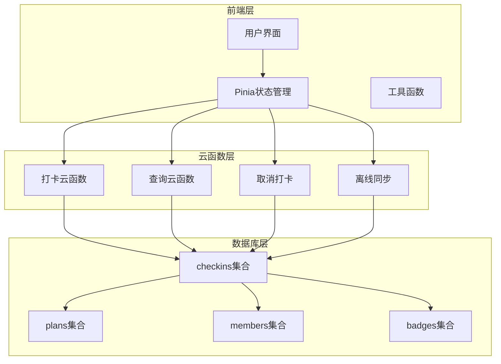

**图表来源**
- [checkins.js:1-163](file://src/stores/checkins.js#L1-L163)
- [checkin/index.js:1-83](file://uniCloud-aliyun/cloudfunctions/checkin/index.js#L1-L83)
- [getCheckins/index.js:1-19](file://uniCloud-aliyun/cloudfunctions/getCheckins/index.js#L1-L19)

**章节来源**
- [checkins.js:1-163](file://src/stores/checkins.js#L1-L163)
- [checkin/index.js:1-83](file://uniCloud-aliyun/cloudfunctions/checkin/index.js#L1-L83)

## 核心组件

### 数据模型设计

checkins集合采用严格的Schema验证，确保数据完整性和一致性：

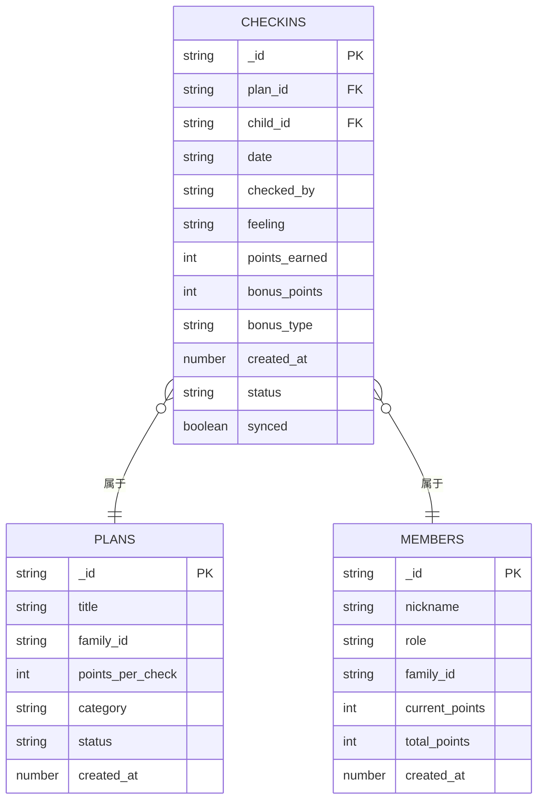

**图表来源**
- [checkins.schema.json:1-52](file://uniCloud-aliyun/database/checkins.schema.json#L1-L52)
- [plans.schema.json:1-50](file://uniCloud-aliyun/database/plans.schema.json#L1-L50)
- [members.schema.json:1-46](file://uniCloud-aliyun/database/members.schema.json#L1-L46)

### 字段详细定义

| 字段名 | 类型 | 必填 | 描述 | 默认值 |
|--------|------|------|------|--------|
| _id | ObjectId | 是 | 打卡记录ID | 系统生成 |
| plan_id | String | 是 | 计划ID | 外键约束 |
| child_id | String | 是 | 孩子成员ID | 外键约束 |
| date | String | 是 | 打卡日期 YYYY-MM-DD | 格式约束 |
| checked_by | String | 否 | 打卡人类型: self/parent | 'parent' |
| feeling | String | 否 | 打卡感受 | 空字符串 |
| points_earned | Integer | 否 | 获得积分 | 0 |
| bonus_points | Integer | 否 | 加成积分 | 0 |
| bonus_type | String | 否 | 加成类型 | null |
| created_at | Number | 否 | 创建时间戳 | 当前时间 |
| status | String | 否 | 状态: normal | 'normal' |
| synced | Boolean | 否 | 同步状态 | true |

**章节来源**
- [checkins.schema.json:10-51](file://uniCloud-aliyun/database/checkins.schema.json#L10-L51)

## 架构概览

系统采用事件驱动架构，支持实时交互和离线同步：

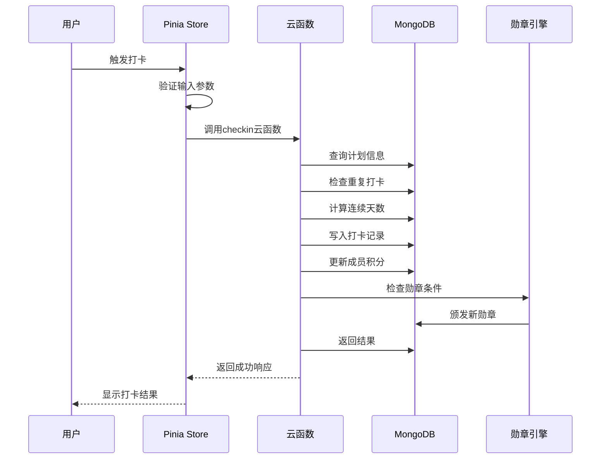

**图表来源**
- [checkins.js:26-89](file://src/stores/checkins.js#L26-L89)
- [checkin/index.js:12-83](file://uniCloud-aliyun/cloudfunctions/checkin/index.js#L12-L83)

## 详细组件分析

### 打卡状态管理系统

Pinia状态管理器负责维护用户的打卡状态：

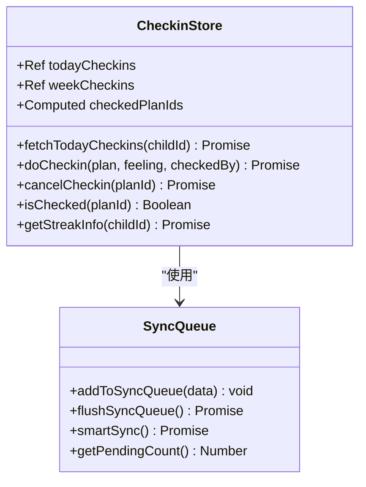

**图表来源**
- [checkins.js:9-163](file://src/stores/checkins.js#L9-L163)
- [sync.js:13-96](file://src/utils/sync.js#L13-L96)

#### 打卡流程状态图

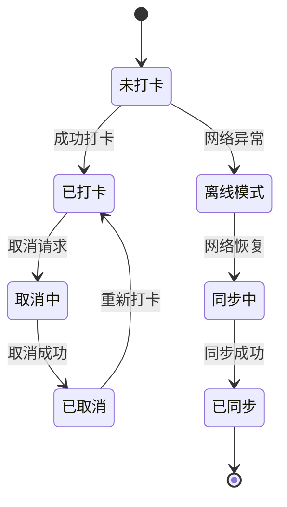

**章节来源**
- [checkins.js:14-159](file://src/stores/checkins.js#L14-L159)

### 时间戳管理机制

系统采用多层时间戳管理策略：

1. **创建时间戳**: 使用服务器时间确保时区一致性
2. **业务时间戳**: 以日期字符串YYYY-MM-DD格式存储
3. **同步时间戳**: 记录最后同步时间用于智能同步

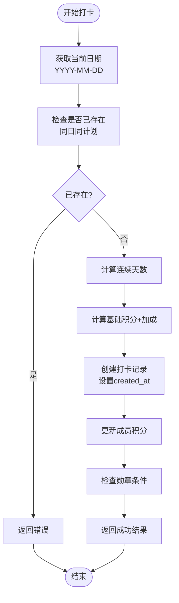

**图表来源**
- [checkin/index.js:86-107](file://uniCloud-aliyun/cloudfunctions/checkin/index.js#L86-L107)
- [checkins.js:26-89](file://src/stores/checkins.js#L26-L89)

**章节来源**
- [checkin/index.js:42-54](file://uniCloud-aliyun/cloudfunctions/checkin/index.js#L42-L54)
- [checkins.js:14-24](file://src/stores/checkins.js#L14-L24)

### 关联关系设计

打卡记录与计划、成员的关联关系通过外键实现：

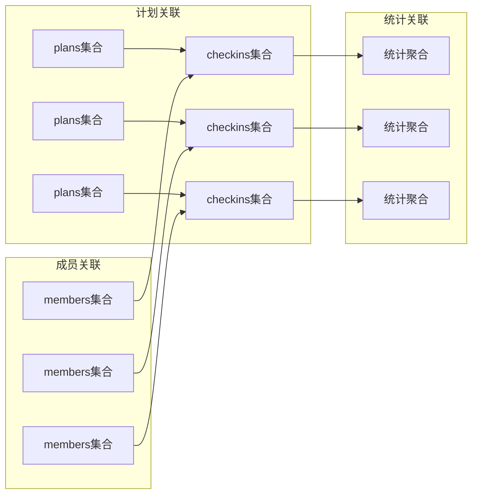

**图表来源**
- [checkins.schema.json:14-21](file://uniCloud-aliyun/database/checkins.schema.json#L14-L21)
- [plans.schema.json:1-50](file://uniCloud-aliyun/database/plans.schema.json#L1-L50)

**章节来源**
- [checkins.schema.json:14-21](file://uniCloud-aliyun/database/checkins.schema.json#L14-L21)

### 查询和统计分析

系统提供多种查询方式和统计功能：

#### 基础查询接口

| 查询类型 | 参数 | 功能 | 性能特点 |
|----------|------|------|----------|
| 今日查询 | child_id, date | 获取指定日期的全部打卡记录 | 单日查询，索引优化 |
| 周期查询 | child_id, week_start | 获取指定周的打卡记录 | 范围查询，需要复合索引 |
| 计划查询 | plan_id, date | 获取特定计划某日的打卡记录 | 精确匹配，快速查询 |

#### 统计分析功能

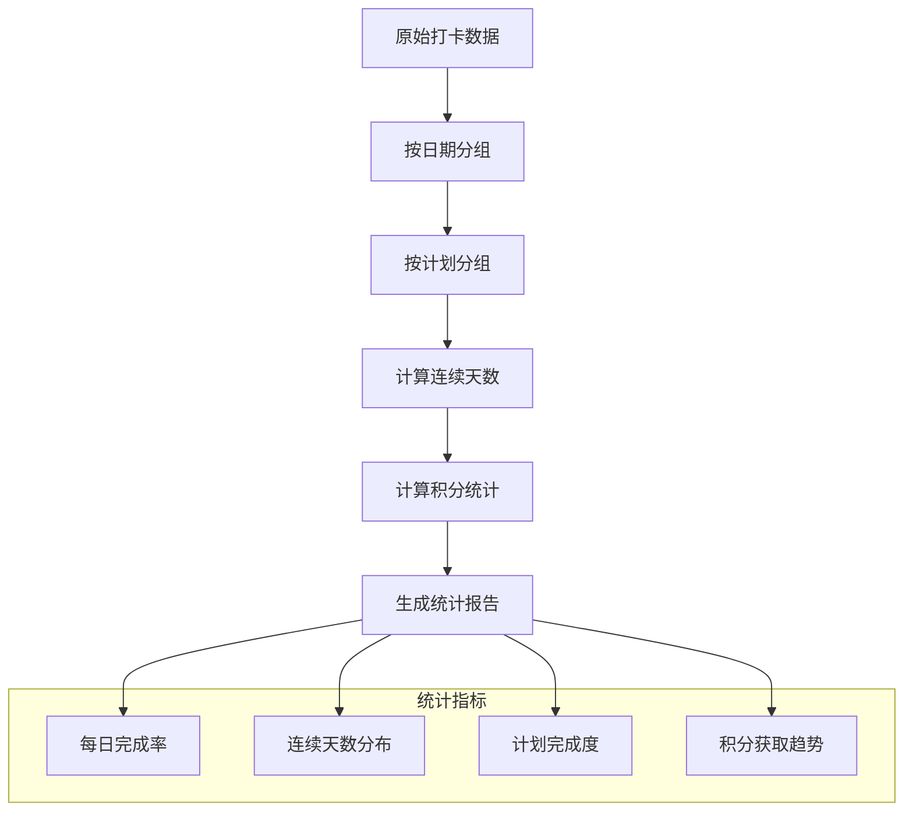

**图表来源**
- [getCheckins/index.js:4-18](file://uniCloud-aliyun/cloudfunctions/getCheckins/index.js#L4-L18)
- [checkins.js:96-123](file://src/stores/checkins.js#L96-L123)

**章节来源**
- [getCheckins/index.js:4-18](file://uniCloud-aliyun/cloudfunctions/getCheckins/index.js#L4-L18)
- [checkins.js:96-123](file://src/stores/checkins.js#L96-L123)

### 批量操作和同步机制

系统支持离线数据的批量同步：

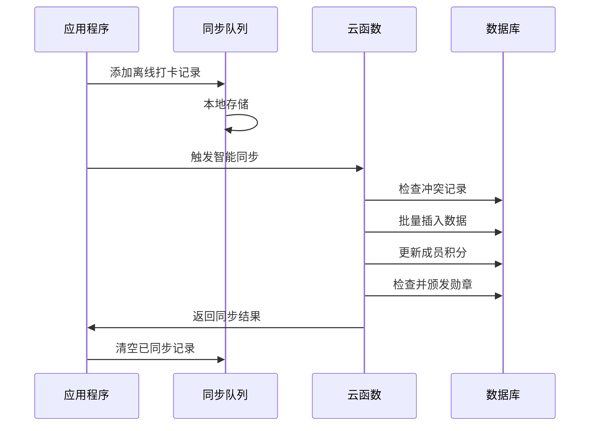

**图表来源**
- [sync.js:25-53](file://src/utils/sync.js#L25-L53)
- [syncOffline/index.js:5-89](file://uniCloud-aliyun/cloudfunctions/syncOffline/index.js#L5-L89)

#### 同步策略

| 同步类型 | 触发条件 | 批量大小 | 冲突处理 |
|----------|----------|----------|----------|
| 智能同步 | 网络可用且有待同步数据 | 全部队列 | 以云端为准 |
| 手动同步 | 用户主动触发 | 全部队列 | 以云端为准 |
| 实时同步 | 在线状态下 | 单条记录 | 幂等设计 |

**章节来源**
- [sync.js:84-96](file://src/utils/sync.js#L84-L96)
- [syncOffline/index.js:19-57](file://uniCloud-aliyun/cloudfunctions/syncOffline/index.js#L19-L57)

### 验证规则和完整性约束

系统采用多层次的数据验证机制：

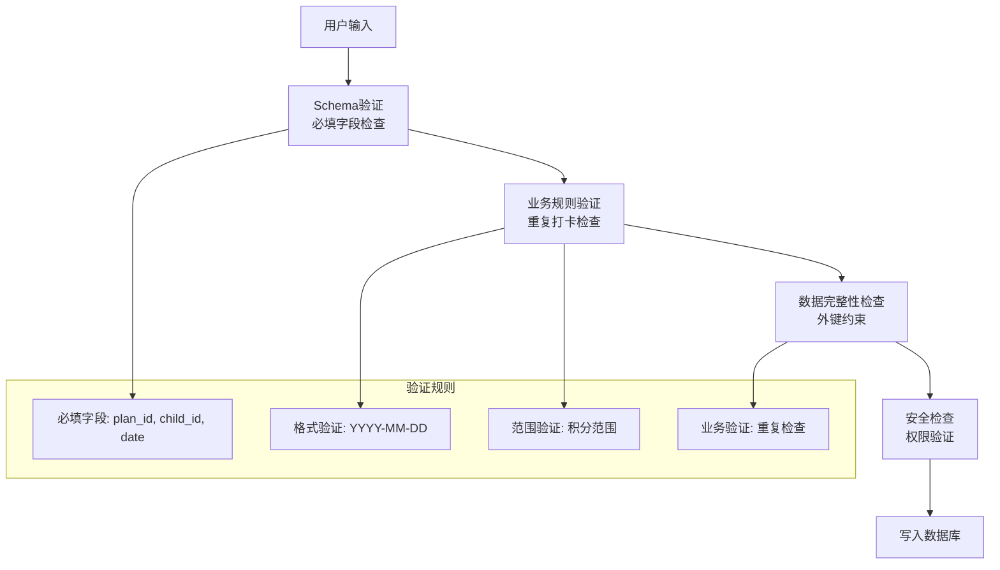

**图表来源**
- [checkins.schema.json:3-4](file://uniCloud-aliyun/database/checkins.schema.json#L3-L4)
- [checkin/index.js:16-24](file://uniCloud-aliyun/cloudfunctions/checkin/index.js#L16-L24)

**章节来源**
- [checkins.schema.json:3-9](file://uniCloud-aliyun/database/checkins.schema.json#L3-L9)
- [checkin/index.js:16-24](file://uniCloud-aliyun/cloudfunctions/checkin/index.js#L16-L24)

### 历史追踪和趋势分析

系统提供完整的数据追踪能力：

#### 连续打卡追踪

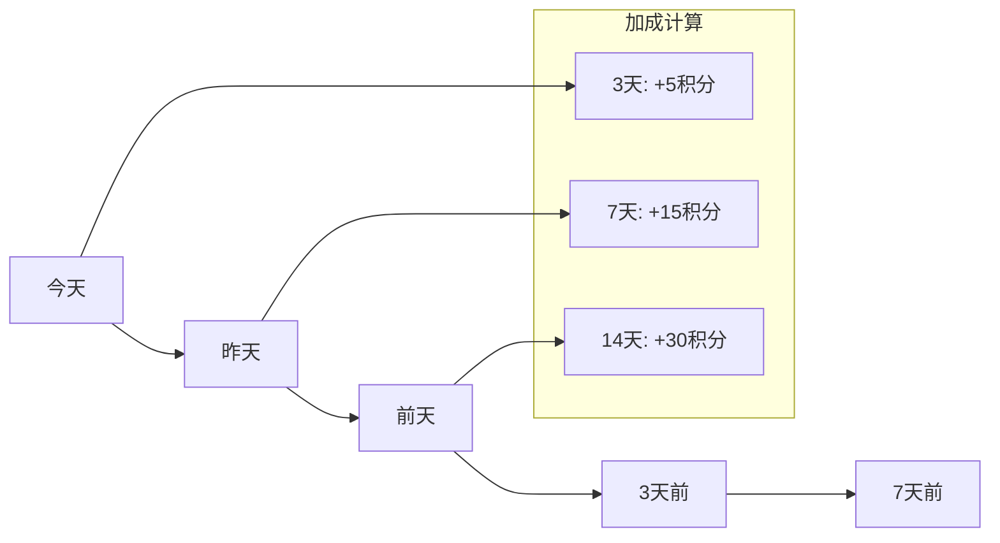

#### 勋章系统追踪

| 勋章类型 | 解锁条件 | 勋章图标 | 描述 |
|----------|----------|----------|------|
| 初出茅庐 | 首次打卡 | 🌱 | 首次完成打卡 |
| 三连击 | 连续3天 | 🔥 | 连续打卡3天 |
| 一周坚持 | 连续7天 | ⚡ | 连续打卡7天 |
| 两周达人 | 连续14天 | 💎 | 连续打卡14天 |
| 月度冠军 | 连续30天 | 👑 | 连续打卡30天 |
| 自主小达人 | 首次自主打卡 | 🦸 | 首次自主打卡 |
| 全能之星 | 一周内所有分类 | 🌈 | 一周内所有分类都打卡 |
| 心情记录员 | 连续5天写感受 | 📝 | 连续5天写了感受 |

**章节来源**
- [badge-engine.js:52-122](file://uniCloud-aliyun/common/badge-engine.js#L52-L122)
- [const.js:6-17](file://uniCloud-aliyun/common/const.js#L6-L17)

## 依赖关系分析

系统各组件之间的依赖关系如下：

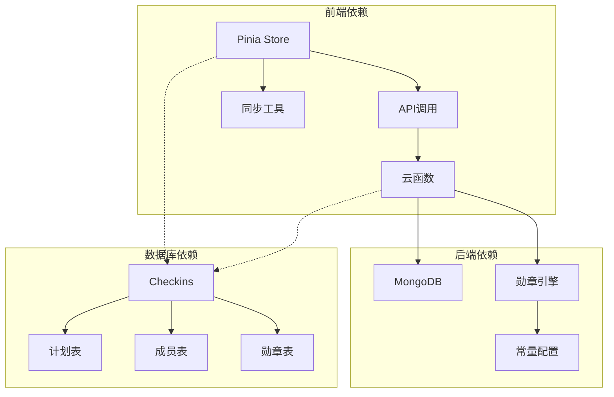

**图表来源**
- [checkins.js:4-7](file://src/stores/checkins.js#L4-L7)
- [checkin/index.js](file://uniCloud-aliyun/cloudfunctions/checkin/index.js#L3)
- [badge-engine.js](file://uniCloud-aliyun/common/badge-engine.js#L2)

**章节来源**
- [checkins.js:1-163](file://src/stores/checkins.js#L1-L163)
- [checkin/index.js:1-83](file://uniCloud-aliyun/cloudfunctions/checkin/index.js#L1-L83)

## 性能考虑

### 索引设计建议

基于查询模式，建议建立以下索引：

| 索引类型 | 字段组合 | 用途 | 性能收益 |
|----------|----------|------|----------|
| 单字段索引 | child_id | 按孩子查询 | O(log n) |
| 单字段索引 | plan_id | 按计划查询 | O(log n) |
| 单字段索引 | date | 按日期查询 | O(log n) |
| 复合索引 | (child_id, date) | 今日查询 | O(log n) |
| 复合索引 | (plan_id, child_id, date) | 唯一约束 | O(log n) |
| 复合索引 | (child_id, created_at) | 时间序列查询 | O(log n) |

### 缓存策略

系统采用多层缓存机制：

1. **本地缓存**: 使用localStorage缓存当日打卡数据
2. **内存缓存**: Pinia store缓存当前状态
3. **智能预加载**: 预加载未来7天的打卡状态

### 异步处理

- 打卡操作采用异步处理，避免阻塞UI
- 离线数据采用队列处理，支持批量同步
- 勋章检查采用异步任务，不影响主流程

## 故障排除指南

### 常见问题及解决方案

| 问题类型 | 症状 | 可能原因 | 解决方案 |
|----------|------|----------|----------|
| 打卡失败 | 显示"今天已打卡" | 重复提交 | 检查重复打卡逻辑 |
| 积分异常 | 积分不正确 | 加成计算错误 | 验证连续天数计算 |
| 同步失败 | 离线数据未同步 | 网络问题 | 检查网络状态和队列 |
| 勋章未解锁 | 勋章条件满足但未解锁 | 勋章检查逻辑 | 验证勋章条件判断 |

### 错误处理机制

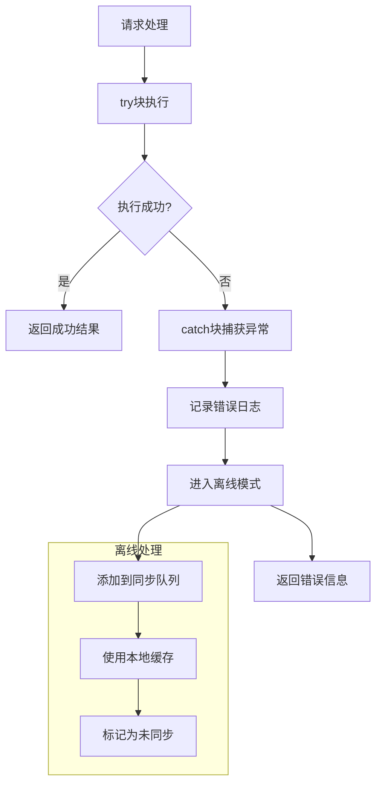

**图表来源**
- [checkins.js:77-88](file://src/stores/checkins.js#L77-L88)

**章节来源**
- [checkins.js:77-88](file://src/stores/checkins.js#L77-L88)
- [sync.js:25-53](file://src/utils/sync.js#L25-L53)

## 结论

Star Grow项目的checkins集合设计体现了现代移动应用的最佳实践，具有以下特点：

1. **数据完整性**: 通过Schema验证和业务规则确保数据质量
2. **用户体验**: 支持离线操作和智能同步，保证流畅体验
3. **扩展性**: 模块化设计便于功能扩展和维护
4. **性能优化**: 合理的索引设计和缓存策略提升系统性能
5. **激励机制**: 完善的积分和勋章系统促进用户参与

该设计为儿童习惯养成提供了坚实的技术基础，通过数字化的方式帮助孩子建立良好的生活习惯。