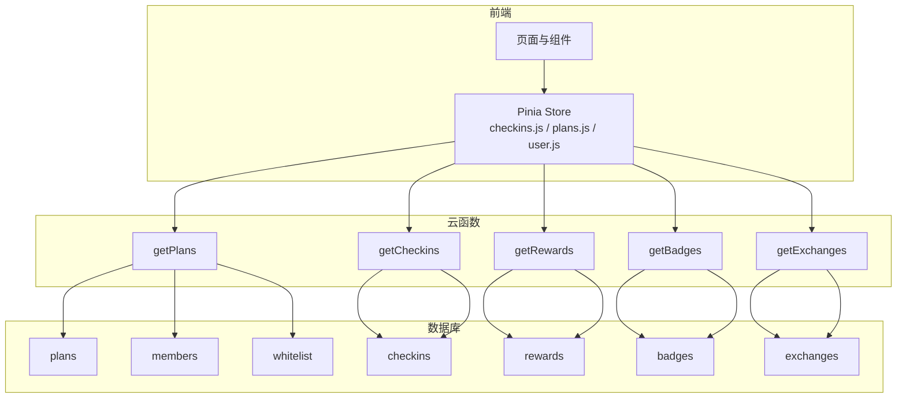
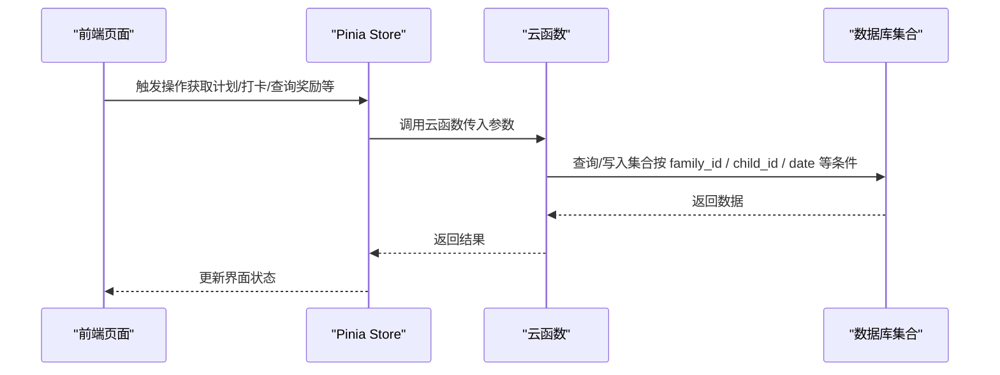
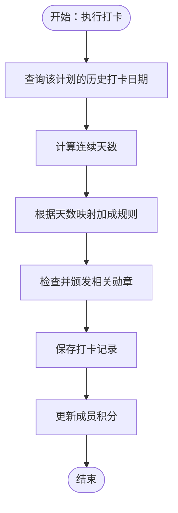
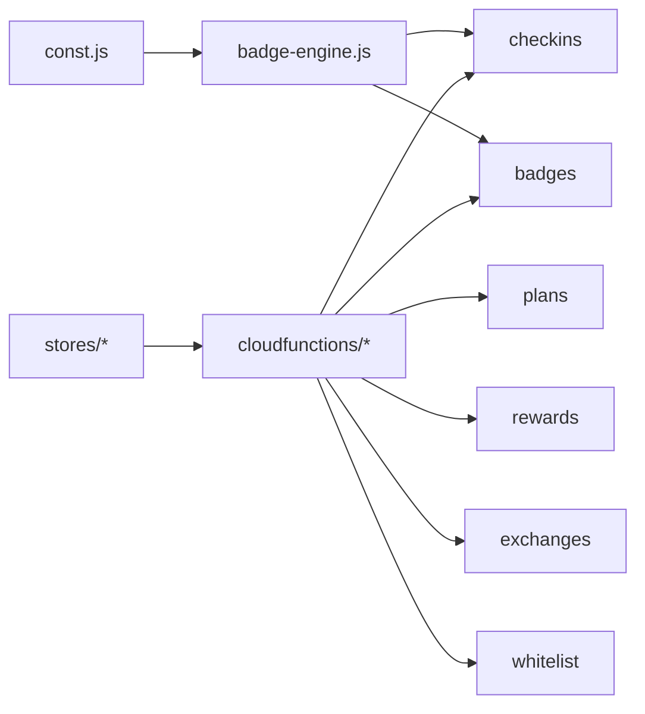

# 数据库设计

<cite>
**本文引用的文件**
- [members.schema.json](file://uniCloud-aliyun/database/members.schema.json)
- [plans.schema.json](file://uniCloud-aliyun/database/plans.schema.json)
- [checkins.schema.json](file://uniCloud-aliyun/database/checkins.schema.json)
- [badges.schema.json](file://uniCloud-aliyun/database/badges.schema.json)
- [rewards.schema.json](file://uniCloud-aliyun/database/rewards.schema.json)
- [exchanges.schema.json](file://uniCloud-aliyun/database/exchanges.schema.json)
- [whitelist.schema.json](file://uniCloud-aliyun/database/whitelist.schema.json)
- [getPlans/index.js](file://uniCloud-aliyun/cloudfunctions/getPlans/index.js)
- [getCheckins/index.js](file://uniCloud-aliyun/cloudfunctions/getCheckins/index.js)
- [getRewards/index.js](file://uniCloud-aliyun/cloudfunctions/getRewards/index.js)
- [getBadges/index.js](file://uniCloud-aliyun/cloudfunctions/getBadges/index.js)
- [getExchanges/index.js](file://uniCloud-aliyun/cloudfunctions/getExchanges/index.js)
- [checkins.js](file://src/stores/checkins.js)
- [plans.js](file://src/stores/plans.js)
- [user.js](file://src/stores/user.js)
- [const.js](file://uniCloud-aliyun/common/const.js)
- [badge-engine.js](file://uniCloud-aliyun/common/badge-engine.js)
</cite>

## 目录
1. [简介](#简介)
2. [项目结构](#项目结构)
3. [核心组件](#核心组件)
4. [架构总览](#架构总览)
5. [详细组件分析](#详细组件分析)
6. [依赖分析](#依赖分析)
7. [性能考虑](#性能考虑)
8. [故障排查指南](#故障排查指南)
9. [结论](#结论)
10. [附录](#附录)

## 简介
本文件为 Star Grow 项目的数据库设计与数据模型说明，聚焦 uniCloud 数据库的集合设计与关系，覆盖以下核心集合：members（成员）、plans（计划）、checkins（打卡记录）、badges（勋章）、rewards（奖励）、exchanges（兑换记录）、whitelist（白名单）。文档内容包括：
- 各集合的字段定义、数据类型与约束
- 集合之间的关系与引用策略
- 数据访问模式与查询优化建议
- 数据安全与权限控制机制
- 数据迁移与版本管理策略
- 索引设计与性能优化考虑
- 数据备份与恢复方案

## 项目结构
本项目采用 uniCloud 的“前端 + 云开发”架构，数据库 schema 定义位于 uniCloud-aliyun/database 下，云函数位于 uniCloud-aliyun/cloudfunctions 下，前端通过 Pinia stores 调用云函数实现数据交互。

图表来源
- [checkins.js:1-163](file://src/stores/checkins.js#L1-L163)
- [plans.js:1-73](file://src/stores/plans.js#L1-L73)
- [user.js:1-119](file://src/stores/user.js#L1-L119)
- [getPlans/index.js:1-15](file://uniCloud-aliyun/cloudfunctions/getPlans/index.js#L1-L15)
- [getCheckins/index.js:1-19](file://uniCloud-aliyun/cloudfunctions/getCheckins/index.js#L1-L19)
- [getRewards/index.js:1-18](file://uniCloud-aliyun/cloudfunctions/getRewards/index.js#L1-L18)
- [getBadges/index.js:1-15](file://uniCloud-aliyun/cloudfunctions/getBadges/index.js#L1-L15)
- [getExchanges/index.js:1-20](file://uniCloud-aliyun/cloudfunctions/getExchanges/index.js#L1-L20)

章节来源
- [checkins.js:1-163](file://src/stores/checkins.js#L1-L163)
- [plans.js:1-73](file://src/stores/plans.js#L1-L73)
- [user.js:1-119](file://src/stores/user.js#L1-L119)

## 核心组件
本节对各集合进行字段级说明，包括必填项、数据类型、默认值与业务含义，并总结集合间的引用关系与权限控制。

- members（成员）
  - 字段要点：昵称、角色（parent/child）、家庭ID、微信 openId、头像URL、当前可用积分、累计积分
  - 约束：必填字段包含昵称、角色、家庭ID；默认当前积分与累计积分为0
  - 权限：读取/创建/更新允许，删除不允许
  - 关系：作为 checkins.child_id、badges.child_id、exchanges.child_id 的外键来源

- plans（计划）
  - 字段要点：标题、描述、家庭ID、每次打卡积分、分类（study/life/exercise/other）、图标、状态（active/archived，默认active）、创建时间戳
  - 约束：必填字段包含标题、家庭ID、每次打卡积分、分类
  - 权限：读取/创建/更新/删除均允许
  - 关系：作为 checkins.plan_id 的外键来源

- checkins（打卡记录）
  - 字段要点：计划ID、孩子成员ID、日期（YYYY-MM-DD）、打卡人（self/parent）、感受、获得积分、加成积分、加成类型、创建时间戳
  - 约束：必填字段包含计划ID、孩子成员ID、日期
  - 权限：读取/创建/更新/删除均允许
  - 关系：与 plans、members、badges 存在间接关联（通过 child_id 和 plan_id）

- badges（勋章）
  - 字段要点：孩子成员ID、勋章类型、标题、图标、描述、解锁时间戳
  - 约束：必填字段包含孩子成员ID、勋章类型、标题
  - 权限：读取/创建允许，更新/删除不允许
  - 关系：与 members 通过 child_id 引用

- rewards（奖励）
  - 字段要点：标题、描述、图标、消耗积分、分类（experience/material）、状态（active/archived，默认active）、库存（-1 表示无限）、家庭ID、创建时间戳
  - 约束：必填字段包含标题、消耗积分、分类
  - 权限：读取/创建/更新/删除均允许
  - 关系：作为 exchanges.reward_id 的外键来源

- exchanges（兑换记录）
  - 字段要点：奖励ID、奖励名称、奖励图标、孩子成员ID、家庭ID、消耗积分、状态（pending/confirmed/cancelled）、家长备注、确认时间戳、创建时间戳
  - 约束：必填字段包含奖励ID、奖励标题、孩子成员ID、消耗积分
  - 权限：读取/创建/更新允许，删除不允许
  - 关系：与 rewards、members 通过 child_id 和 reward_id 引用

- whitelist（白名单）
  - 字段要点：微信 openId、备注、添加时间戳
  - 约束：必填字段包含 openId
  - 权限：读取/创建/更新/删除均允许
  - 关系：用于登录鉴权前置校验

章节来源
- [members.schema.json:1-46](file://uniCloud-aliyun/database/members.schema.json#L1-L46)
- [plans.schema.json:1-50](file://uniCloud-aliyun/database/plans.schema.json#L1-L50)
- [checkins.schema.json:1-52](file://uniCloud-aliyun/database/checkins.schema.json#L1-L52)
- [badges.schema.json:1-40](file://uniCloud-aliyun/database/badges.schema.json#L1-L40)
- [rewards.schema.json:1-53](file://uniCloud-aliyun/database/rewards.schema.json#L1-L53)
- [exchanges.schema.json:1-56](file://uniCloud-aliyun/database/exchanges.schema.json#L1-L56)
- [whitelist.schema.json:1-28](file://uniCloud-aliyun/database/whitelist.schema.json#L1-L28)

## 架构总览
下图展示前端 Store 与云函数、数据库之间的交互路径，以及集合间的主要引用关系。

图表来源
- [checkins.js:1-163](file://src/stores/checkins.js#L1-L163)
- [plans.js:1-73](file://src/stores/plans.js#L1-L73)
- [user.js:1-119](file://src/stores/user.js#L1-L119)
- [getPlans/index.js:1-15](file://uniCloud-aliyun/cloudfunctions/getPlans/index.js#L1-L15)
- [getCheckins/index.js:1-19](file://uniCloud-aliyun/cloudfunctions/getCheckins/index.js#L1-L19)
- [getRewards/index.js:1-18](file://uniCloud-aliyun/cloudfunctions/getRewards/index.js#L1-L18)
- [getBadges/index.js:1-15](file://uniCloud-aliyun/cloudfunctions/getBadges/index.js#L1-L15)
- [getExchanges/index.js:1-20](file://uniCloud-aliyun/cloudfunctions/getExchanges/index.js#L1-L20)

## 详细组件分析

### 成员与家庭隔离（members + whitelist）
- 设计要点
  - members 以 family_id 实现多用户/多家庭数据隔离
  - whitelist 用于微信 openId 白名单校验，保障登录入口安全
- 权限控制
  - members 支持读取/创建/更新；删除禁止，避免误删用户
  - whitelist 支持增删改查，用于登录前置校验
- 查询模式
  - 云函数 getPlans、getRewards、getExchanges 等均按 family_id 过滤
  - 前端 store 在调用云函数时统一注入 family_id

章节来源
- [members.schema.json:1-46](file://uniCloud-aliyun/database/members.schema.json#L1-L46)
- [whitelist.schema.json:1-28](file://uniCloud-aliyun/database/whitelist.schema.json#L1-L28)
- [getPlans/index.js:1-15](file://uniCloud-aliyun/cloudfunctions/getPlans/index.js#L1-L15)
- [getRewards/index.js:1-18](file://uniCloud-aliyun/cloudfunctions/getRewards/index.js#L1-L18)
- [getExchanges/index.js:1-20](file://uniCloud-aliyun/cloudfunctions/getExchanges/index.js#L1-L20)
- [user.js:1-119](file://src/stores/user.js#L1-L119)

### 计划与打卡（plans + checkins）
- 设计要点
  - plans 提供每个计划的积分产出与分类信息
  - checkins 记录每日打卡事实，包含加成计算与加成类型
- 关系与引用
  - checkins.plan_id 引用 plans._id
  - checkins.child_id 引用 members._id
- 查询与排序
  - getPlans 按 created_at 倒序
  - getCheckins 支持按 child_id、date 或 week_start 过滤，按 created_at 倒序
- 勋章与加成
  - 勋章引擎根据连续打卡天数计算加成，并颁发相应勋章

图表来源
- [badge-engine.js:1-125](file://uniCloud-aliyun/common/badge-engine.js#L1-L125)
- [const.js:1-27](file://uniCloud-aliyun/common/const.js#L1-L27)
- [checkins.js:1-163](file://src/stores/checkins.js#L1-L163)

章节来源
- [plans.schema.json:1-50](file://uniCloud-aliyun/database/plans.schema.json#L1-L50)
- [checkins.schema.json:1-52](file://uniCloud-aliyun/database/checkins.schema.json#L1-L52)
- [getCheckins/index.js:1-19](file://uniCloud-aliyun/cloudfunctions/getCheckins/index.js#L1-L19)
- [badge-engine.js:1-125](file://uniCloud-aliyun/common/badge-engine.js#L1-L125)
- [const.js:1-27](file://uniCloud-aliyun/common/const.js#L1-L27)

### 奖励与兑换（rewards + exchanges）
- 设计要点
  - rewards 提供可兑换物品与库存、分类、状态
  - exchanges 记录兑换事实，包含状态流转（pending/confirmed/cancelled）
- 关系与引用
  - exchanges.reward_id 引用 rewards._id
  - exchanges.child_id 引用 members._id
- 查询模式
  - getRewards 默认只查询 active 状态，可按 family_id 过滤
  - getExchanges 支持按 child_id、status、family_id 组合过滤

章节来源
- [rewards.schema.json:1-53](file://uniCloud-aliyun/database/rewards.schema.json#L1-L53)
- [exchanges.schema.json:1-56](file://uniCloud-aliyun/database/exchanges.schema.json#L1-L56)
- [getRewards/index.js:1-18](file://uniCloud-aliyun/cloudfunctions/getRewards/index.js#L1-L18)
- [getExchanges/index.js:1-20](file://uniCloud-aliyun/cloudfunctions/getExchanges/index.js#L1-L20)

### 勋章系统（badges）
- 设计要点
  - badges 记录解锁的勋章类型、标题、图标、描述与解锁时间
  - 勋章由 badge-engine 动态颁发，避免重复
- 查询模式
  - getBadges 按 child_id 查询并按解锁时间倒序

章节来源
- [badges.schema.json:1-40](file://uniCloud-aliyun/database/badges.schema.json#L1-L40)
- [getBadges/index.js:1-15](file://uniCloud-aliyun/cloudfunctions/getBadges/index.js#L1-L15)
- [badge-engine.js:1-125](file://uniCloud-aliyun/common/badge-engine.js#L1-L125)

## 依赖分析
- 前端 Store 依赖云函数实现数据访问，云函数依赖数据库集合
- badge-engine 与 const.js 提供业务规则（加成与勋章定义）
- whitelist 为登录流程提供白名单校验

图表来源
- [const.js:1-27](file://uniCloud-aliyun/common/const.js#L1-L27)
- [badge-engine.js:1-125](file://uniCloud-aliyun/common/badge-engine.js#L1-L125)
- [checkins.js:1-163](file://src/stores/checkins.js#L1-L163)
- [plans.js:1-73](file://src/stores/plans.js#L1-L73)
- [user.js:1-119](file://src/stores/user.js#L1-L119)
- [getPlans/index.js:1-15](file://uniCloud-aliyun/cloudfunctions/getPlans/index.js#L1-L15)
- [getCheckins/index.js:1-19](file://uniCloud-aliyun/cloudfunctions/getCheckins/index.js#L1-L19)
- [getRewards/index.js:1-18](file://uniCloud-aliyun/cloudfunctions/getRewards/index.js#L1-L18)
- [getBadges/index.js:1-15](file://uniCloud-aliyun/cloudfunctions/getBadges/index.js#L1-L15)
- [getExchanges/index.js:1-20](file://uniCloud-aliyun/cloudfunctions/getExchanges/index.js#L1-L20)

## 性能考虑
- 查询优化
  - 按 family_id 过滤：所有涉及家庭数据的查询均应带上 family_id，避免跨家庭数据扫描
  - 按日期范围过滤：getCheckins 支持 week_start 与 date 精确过滤，减少扫描范围
  - 排序与分页：按 created_at 倒序常见于列表展示，建议结合 limit 控制返回量
- 索引建议
  - 建议在以下字段建立复合索引以提升查询效率：
    - checkins: (child_id + date)
    - checkins: (plan_id + date)
    - plans: (family_id + created_at)
    - rewards: (family_id + status + created_at)
    - badges: (child_id + unlocked_at)
    - exchanges: (child_id + created_at)
    - exchanges: (family_id + created_at)
- 缓存策略
  - 前端对计划列表与当日打卡进行本地缓存，降低网络请求频率
- 写入优化
  - 勋章批量插入（一次多条）可减少往返次数
- 并发与一致性
  - 对积分与库存的变更建议使用原子操作或事务（如支持）保证一致性

## 故障排查指南
- 登录白名单问题
  - 若用户无法登录，检查 whitelist 中是否存在对应 openId
- 数据隔离异常
  - 确认云函数调用是否正确传递 family_id；查询未返回预期数据时优先检查过滤条件
- 打卡未生效
  - 检查 checkins 的 child_id、plan_id、date 是否正确；确认 badge-engine 是否正常颁发加成与勋章
- 兑换状态异常
  - 检查 exchanges 的状态流转（pending/confirmed/cancelled）与 points_spent 是否匹配

章节来源
- [whitelist.schema.json:1-28](file://uniCloud-aliyun/database/whitelist.schema.json#L1-L28)
- [getCheckins/index.js:1-19](file://uniCloud-aliyun/cloudfunctions/getCheckins/index.js#L1-L19)
- [getExchanges/index.js:1-20](file://uniCloud-aliyun/cloudfunctions/getExchanges/index.js#L1-L20)
- [badge-engine.js:1-125](file://uniCloud-aliyun/common/badge-engine.js#L1-L125)

## 结论
本数据库设计围绕“家庭隔离 + 明确的集合职责”展开，通过 schema 约束与云函数查询策略实现清晰的数据边界与良好的扩展性。配合前端缓存与后端加成/勋章引擎，形成完整的成长激励闭环。后续可在关键查询字段上完善索引，并在高并发场景下引入原子操作或事务以增强一致性。

## 附录

### 数据访问模式与最佳实践
- 计划管理
  - 使用 getPlans 按家庭维度拉取；保存时统一注入 family_id
- 打卡流程
  - doCheckin 流程：构造 checkinData → 调用云函数 → 解析返回的加成与新勋章 → 更新本地缓存与积分
- 奖励与兑换
  - getRewards 仅取 active；兑换时注意库存与积分校验
- 勋章颁发
  - 通过 badge-engine 按规则动态判断并批量插入

章节来源
- [checkins.js:1-163](file://src/stores/checkins.js#L1-L163)
- [plans.js:1-73](file://src/stores/plans.js#L1-L73)
- [getPlans/index.js:1-15](file://uniCloud-aliyun/cloudfunctions/getPlans/index.js#L1-L15)
- [getCheckins/index.js:1-19](file://uniCloud-aliyun/cloudfunctions/getCheckins/index.js#L1-L19)
- [getRewards/index.js:1-18](file://uniCloud-aliyun/cloudfunctions/getRewards/index.js#L1-L18)
- [getBadges/index.js:1-15](file://uniCloud-aliyun/cloudfunctions/getBadges/index.js#L1-L15)
- [getExchanges/index.js:1-20](file://uniCloud-aliyun/cloudfunctions/getExchanges/index.js#L1-L20)
- [badge-engine.js:1-125](file://uniCloud-aliyun/common/badge-engine.js#L1-L125)