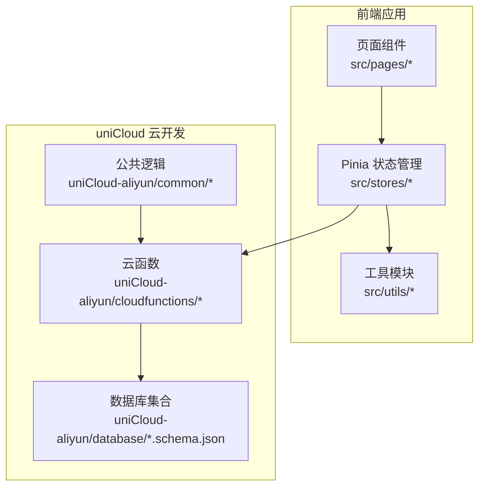
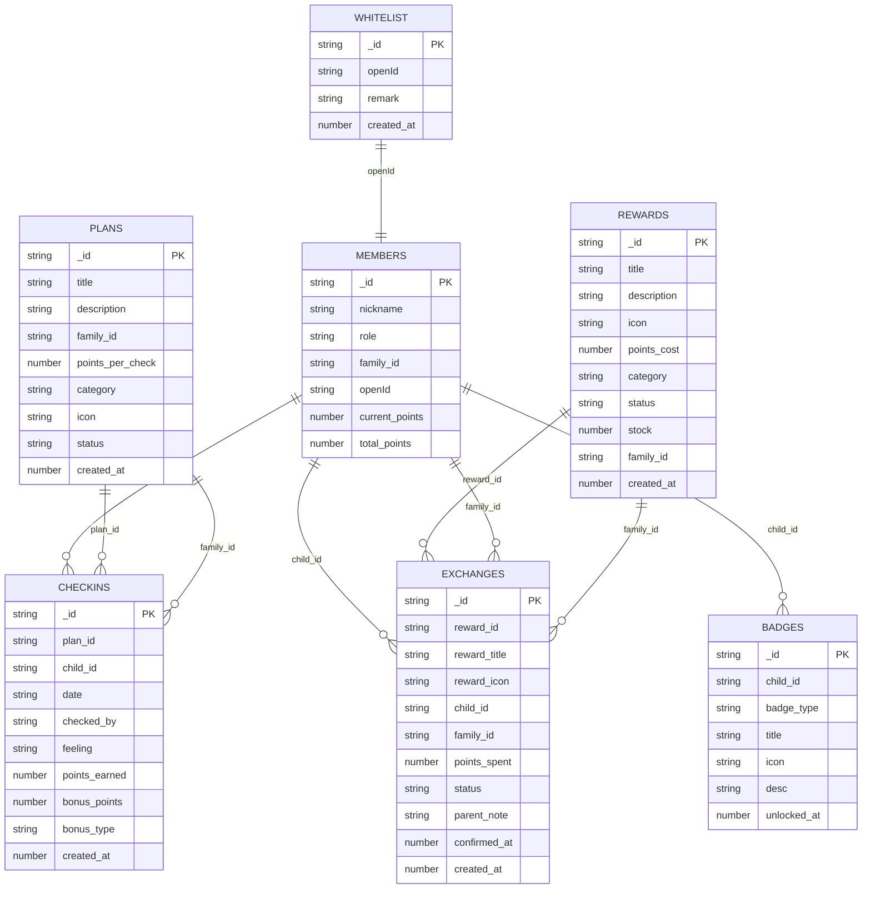
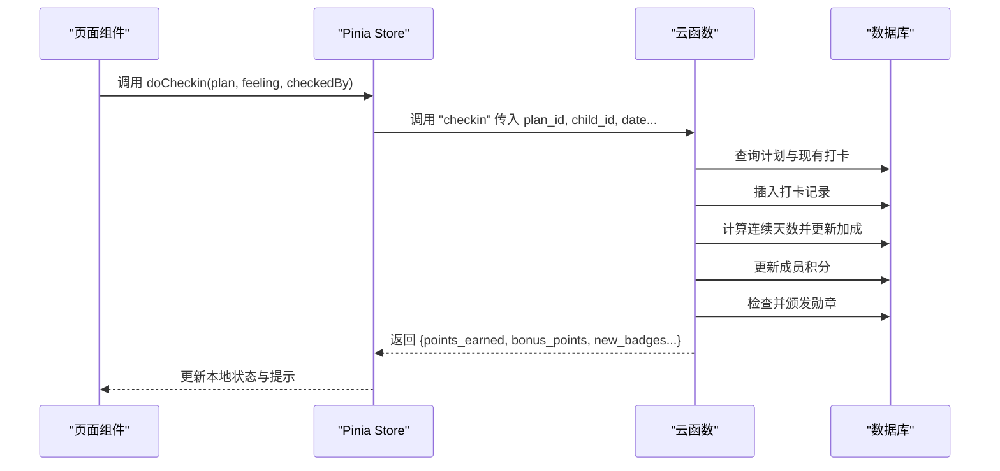
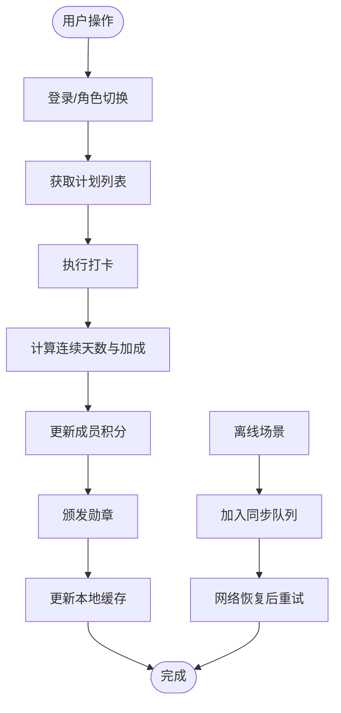

# 数据模型概览

<cite>
**本文档引用的文件**
- [badges.schema.json](file://uniCloud-aliyun/database/badges.schema.json)
- [checkins.schema.json](file://uniCloud-aliyun/database/checkins.schema.json)
- [exchanges.schema.json](file://uniCloud-aliyun/database/exchanges.schema.json)
- [members.schema.json](file://uniCloud-aliyun/database/members.schema.json)
- [plans.schema.json](file://uniCloud-aliyun/database/plans.schema.json)
- [rewards.schema.json](file://uniCloud-aliyun/database/rewards.schema.json)
- [whitelist.schema.json](file://uniCloud-aliyun/database/whitelist.schema.json)
- [badge-engine.js](file://uniCloud-aliyun/common/badge-engine.js)
- [user.js](file://src/stores/user.js)
- [checkins.js](file://src/stores/checkins.js)
- [plans.js](file://src/stores/plans.js)
- [points.js](file://src/stores/points.js)
- [offline.js](file://src/stores/offline.js)
- [getCheckins/index.js](file://uniCloud-aliyun/cloudfunctions/getCheckins/index.js)
- [checkin/index.js](file://uniCloud-aliyun/cloudfunctions/checkin/index.js)
- [getPoints/index.js](file://uniCloud-aliyun/cloudfunctions/getPoints/index.js)
- [savePlan/index.js](file://uniCloud-aliyun/cloudfunctions/savePlan/index.js)
- [getPlans/index.js](file://uniCloud-aliyun/cloudfunctions/getPlans/index.js)
</cite>

## 目录
1. [简介](#简介)
2. [项目结构](#项目结构)
3. [核心组件](#核心组件)
4. [架构总览](#架构总览)
5. [详细组件分析](#详细组件分析)
6. [依赖分析](#依赖分析)
7. [性能考虑](#性能考虑)
8. [故障排除指南](#故障排除指南)
9. [结论](#结论)
10. [附录](#附录)

## 简介
本文件为 Star Grow 项目的整体数据模型概览，聚焦于 uniCloud 数据库的集合结构、集合间关系与引用策略，以及前端 Pinia 状态管理与云函数的数据处理流程。文档旨在帮助开发者快速理解数据架构、实体关系、完整性约束、业务规则、数据流与查询策略，并提供 ER 图与数据流图以辅助设计与实现。

## 项目结构
项目采用“前端应用 + uniCloud 云开发”的混合架构：
- 前端使用 Vue 3 + Pinia 管理用户、计划、打卡、积分等状态，并通过统一的 API 工具调用云函数。
- uniCloud 提供云数据库与云函数，数据库集合通过 JSON Schema 定义结构与权限；云函数负责业务逻辑与数据一致性。

图表来源
- [user.js:1-119](file://src/stores/user.js#L1-L119)
- [checkins.js:1-163](file://src/stores/checkins.js#L1-L163)
- [getCheckins/index.js:1-19](file://uniCloud-aliyun/cloudfunctions/getCheckins/index.js#L1-L19)

章节来源
- [user.js:1-119](file://src/stores/user.js#L1-L119)
- [checkins.js:1-163](file://src/stores/checkins.js#L1-L163)
- [plans.js:1-73](file://src/stores/plans.js#L1-L73)
- [points.js:1-44](file://src/stores/points.js#L1-L44)
- [offline.js:1-30](file://src/stores/offline.js#L1-L30)

## 核心组件
本项目的核心数据集合包括：
- members：成员/家庭信息，包含角色、积分余额与累计积分等字段。
- plans：家庭计划，包含计划标题、类别、积分奖励等。
- checkins：打卡记录，包含计划、成员、日期、积分、加成等。
- rewards：奖励商品，包含名称、类别、积分成本、库存等。
- exchanges：兑换记录，包含奖励、成员、家庭、状态、家长备注等。
- badges：勋章记录，包含类型、标题、图标、解锁时间等。
- whitelist：白名单，包含允许登录的微信 openId。

各集合的权限策略与必填字段由对应的 schema 文件定义，体现读写分离与最小权限原则。

章节来源
- [members.schema.json:1-46](file://uniCloud-aliyun/database/members.schema.json#L1-L46)
- [plans.schema.json:1-50](file://uniCloud-aliyun/database/plans.schema.json#L1-L50)
- [checkins.schema.json:1-52](file://uniCloud-aliyun/database/checkins.schema.json#L1-L52)
- [rewards.schema.json:1-53](file://uniCloud-aliyun/database/rewards.schema.json#L1-L53)
- [exchanges.schema.json:1-56](file://uniCloud-aliyun/database/exchanges.schema.json#L1-L56)
- [badges.schema.json:1-40](file://uniCloud-aliyun/database/badges.schema.json#L1-L40)
- [whitelist.schema.json:1-28](file://uniCloud-aliyun/database/whitelist.schema.json#L1-L28)

## 架构总览
下图展示数据模型的整体关系与引用策略。集合间通过外键字段（如 child_id、plan_id、family_id）建立关联，实现家庭隔离与跨表一致性。

图表来源
- [members.schema.json:1-46](file://uniCloud-aliyun/database/members.schema.json#L1-L46)
- [plans.schema.json:1-50](file://uniCloud-aliyun/database/plans.schema.json#L1-L50)
- [checkins.schema.json:1-52](file://uniCloud-aliyun/database/checkins.schema.json#L1-L52)
- [rewards.schema.json:1-53](file://uniCloud-aliyun/database/rewards.schema.json#L1-L53)
- [exchanges.schema.json:1-56](file://uniCloud-aliyun/database/exchanges.schema.json#L1-L56)
- [badges.schema.json:1-40](file://uniCloud-aliyun/database/badges.schema.json#L1-L40)
- [whitelist.schema.json:1-28](file://uniCloud-aliyun/database/whitelist.schema.json#L1-L28)

## 详细组件分析

### 成员与家庭隔离（Members）
- 设计要点
  - 通过 family_id 实现多用户/多家庭数据隔离。
  - 角色字段区分 parent 与 child，支撑不同权限与界面行为。
  - 积分字段包含 current_points 与 total_points，便于统计与消费控制。
- 权限与约束
  - 读取权限通常开放；创建/更新/删除权限按角色配置。
  - openId 字段用于微信登录与白名单校验。
- 查询策略
  - 前端通过 getPoints 云函数按 member_id 获取积分。
  - 云函数 getCheckins 支持按 child_id 与日期范围查询打卡记录。

章节来源
- [members.schema.json:1-46](file://uniCloud-aliyun/database/members.schema.json#L1-L46)
- [getPoints/index.js:1-18](file://uniCloud-aliyun/cloudfunctions/getPoints/index.js#L1-L18)
- [getCheckins/index.js:1-19](file://uniCloud-aliyun/cloudfunctions/getCheckins/index.js#L1-L19)

### 计划与打卡（Plans & Checkins）
- 设计要点
  - 计划包含 points_per_check、category、status 等字段，支撑积分计算与分类展示。
  - 打卡记录包含 base 积分、bonus 加成、加成类型与解锁时间戳。
- 关系与引用
  - checkins.plan_id → plans._id；checkins.child_id → members._id。
  - 通过 family_id 在计划与打卡中实现家庭隔离。
- 业务规则
  - 同一 plan_id + child_id + date 的唯一性约束由云函数在插入前检查。
  - 连续打卡天数计算与加成由 badge-engine 统一处理。
- 查询策略
  - getPlans 按 family_id 查询；getCheckins 支持按日期或周起始日期查询。

章节来源
- [plans.schema.json:1-50](file://uniCloud-aliyun/database/plans.schema.json#L1-L50)
- [checkins.schema.json:1-52](file://uniCloud-aliyun/database/checkins.schema.json#L1-L52)
- [getPlans/index.js:1-15](file://uniCloud-aliyun/cloudfunctions/getPlans/index.js#L1-L15)
- [getCheckins/index.js:1-19](file://uniCloud-aliyun/cloudfunctions/getCheckins/index.js#L1-L19)
- [checkin/index.js:1-83](file://uniCloud-aliyun/cloudfunctions/checkin/index.js#L1-L83)
- [badge-engine.js:1-125](file://uniCloud-aliyun/common/badge-engine.js#L1-L125)

### 奖励与兑换（Rewards & Exchanges）
- 设计要点
  - 奖励包含 points_cost、category、stock 等字段，支持库存控制与状态管理。
  - 兑换记录包含 points_spent、status、parent_note 等，支撑家长审核流程。
- 关系与引用
  - exchanges.reward_id → rewards._id；exchanges.child_id → members._id。
  - 通过 family_id 实现家庭隔离与权限控制。
- 业务规则
  - 兑换时需校验成员积分余额与奖励库存（云函数侧执行）。
  - 状态字段支持 pending/confirmed/cancelled 流程管理。
- 查询策略
  - getRewards 与 getExchanges 分别按 family_id 或 child_id 查询。

章节来源
- [rewards.schema.json:1-53](file://uniCloud-aliyun/database/rewards.schema.json#L1-L53)
- [exchanges.schema.json:1-56](file://uniCloud-aliyun/database/exchanges.schema.json#L1-L56)

### 勋章系统（Badges）
- 设计要点
  - 勋章类型通过 badge_type 标识，包含 title、icon、desc、unlocked_at。
  - 通过 badge-engine 动态颁发，避免重复解锁。
- 关系与引用
  - badges.child_id → members._id。
- 业务规则
  - 连续打卡、自主打卡、心情记录员、全类别覆盖等条件触发。
  - 已拥有类型的勋章不会重复颁发。

章节来源
- [badges.schema.json:1-40](file://uniCloud-aliyun/database/badges.schema.json#L1-L40)
- [badge-engine.js:1-125](file://uniCloud-aliyun/common/badge-engine.js#L1-L125)

### 白名单与登录（Whitelist）
- 设计要点
  - whitelist.openId 作为允许登录的凭证，与 members.openId 对应。
- 权限与约束
  - 读写权限开放，便于运营维护。
- 查询策略
  - 通过 openId 校验用户是否在白名单内。

章节来源
- [whitelist.schema.json:1-28](file://uniCloud-aliyun/database/whitelist.schema.json#L1-L28)

### 前端状态与离线同步（Stores）
- user.js：管理登录态、角色切换、积分设置与持久化。
- checkins.js：封装今日/本周打卡查询、执行打卡、取消打卡、连续天数计算与离线缓存。
- plans.js：计划列表获取、保存与归档。
- points.js：积分余额与历史记录管理。
- offline.js：离线队列计数与同步触发。

章节来源
- [user.js:1-119](file://src/stores/user.js#L1-L119)
- [checkins.js:1-163](file://src/stores/checkins.js#L1-L163)
- [plans.js:1-73](file://src/stores/plans.js#L1-L73)
- [points.js:1-44](file://src/stores/points.js#L1-L44)
- [offline.js:1-30](file://src/stores/offline.js#L1-L30)

## 依赖分析
- 前端 Store 依赖云函数提供的数据接口，形成“UI → Store → 云函数 → 数据库”的调用链。
- 云函数之间存在内部依赖：checkin 依赖 badge-engine 计算连续天数与加成、颁发勋章。
- 数据库层通过 family_id 实现多租户隔离，避免跨家庭数据泄露。

图表来源
- [checkins.js:1-163](file://src/stores/checkins.js#L1-L163)
- [checkin/index.js:1-83](file://uniCloud-aliyun/cloudfunctions/checkin/index.js#L1-L83)
- [badge-engine.js:1-125](file://uniCloud-aliyun/common/badge-engine.js#L1-L125)

章节来源
- [checkins.js:1-163](file://src/stores/checkins.js#L1-L163)
- [checkin/index.js:1-83](file://uniCloud-aliyun/cloudfunctions/checkin/index.js#L1-L83)
- [badge-engine.js:1-125](file://uniCloud-aliyun/common/badge-engine.js#L1-L125)

## 性能考虑
- 查询优化
  - 在 checkins、plans、rewards 等高频查询集合上，建议基于 family_id、child_id、plan_id、date 等字段建立索引。
  - getCheckins 支持按日期范围查询，建议对 date 字段建立复合索引以提升周维度统计效率。
- 写入优化
  - 打卡写入采用先插入后更新加成的方式，减少并发冲突；可结合数据库事务或幂等更新策略进一步增强一致性。
- 缓存策略
  - 前端对今日/本周打卡与计划列表进行本地缓存，降低网络请求频率；离线场景通过本地存储与同步队列保障用户体验。

## 故障排除指南
- 登录与权限
  - 若用户无法登录，检查 whitelist 中是否存在对应 openId；确认 members 中 family_id 与 openId 映射正确。
- 打卡异常
  - “今日已打卡”错误：检查相同 plan_id + child_id + date 是否已存在；确认日期格式为 YYYY-MM-DD。
  - 积分未更新：核对 checkin 云函数是否成功更新 members 的 current_points/total_points。
- 兑换问题
  - 积分不足或库存为 0：确认成员 current_points 与奖励 stock；检查 exchanges 状态流转。
- 离线同步
  - 离线打卡后未同步：检查 offline store 的 pendingCount 与 sync 队列；确认网络恢复后重新触发同步。

章节来源
- [checkin/index.js:1-83](file://uniCloud-aliyun/cloudfunctions/checkin/index.js#L1-L83)
- [getCheckins/index.js:1-19](file://uniCloud-aliyun/cloudfunctions/getCheckins/index.js#L1-L19)
- [offline.js:1-30](file://src/stores/offline.js#L1-L30)

## 结论
本数据模型围绕“家庭隔离 + 角色驱动 + 事件触发”的设计原则构建，通过 schema 约束与云函数业务逻辑共同保障数据完整性与业务规则。前端通过 Pinia Store 与云函数解耦，既满足在线实时交互，也具备完善的离线能力。建议在生产环境中完善索引策略、事务与幂等写入，并持续评估性能与扩展性。

## 附录

### 数据流图（概念性）

### 设计原则与约束总结
- 家庭隔离：所有集合均包含 family_id，确保多用户数据隔离。
- 最小权限：通过 schema permission 控制读写；部分集合仅允许特定角色更新/删除。
- 事件驱动：打卡完成后自动计算加成、更新积分与颁发勋章。
- 幂等与一致性：云函数内对重复打卡、库存与积分进行校验，必要时采用先插入后更新策略。
- 离线优先：前端本地缓存与同步队列保障弱网与无网场景体验。