# 计划集合设计

<cite>
**本文档引用的文件**
- [plans.schema.json](file://uniCloud-aliyun/database/plans.schema.json)
- [checkins.schema.json](file://uniCloud-aliyun/database/checkins.schema.json)
- [members.schema.json](file://uniCloud-aliyun/database/members.schema.json)
- [plans.js](file://src/stores/plans.js)
- [PlanForm.vue](file://src/components/PlanForm.vue)
- [list.vue](file://src/pages/plan/list.vue)
- [edit.vue](file://src/pages/plan/edit.vue)
- [savePlan/index.js](file://uniCloud-aliyun/cloudfunctions/savePlan/index.js)
- [getPlans/index.js](file://uniCloud-aliyun/cloudfunctions/getPlans/index.js)
- [deletePlan/index.js](file://uniCloud-aliyun/cloudfunctions/deletePlan/index.js)
- [checkin/index.js](file://src/cloudfunctions/checkin/index.js)
- [getWeeklyReport/index.js](file://uniCloud-aliyun/cloudfunctions/getWeeklyReport/index.js)
- [const.js](file://uniCloud-aliyun/common/const.js)
</cite>

## 目录
1. [简介](#简介)
2. [项目结构](#项目结构)
3. [核心组件](#核心组件)
4. [架构概览](#架构概览)
5. [详细组件分析](#详细组件分析)
6. [依赖分析](#依赖分析)
7. [性能考虑](#性能考虑)
8. [故障排除指南](#故障排除指南)
9. [结论](#结论)
10. [附录](#附录)

## 简介

Star Grow项目中的计划集合（plans）是整个积分养成系统的核心数据结构，负责存储和管理用户创建的各种习惯培养计划。本设计文档详细说明了plans集合的数据结构、字段定义、计划类型设计、任务属性配置、状态管理机制以及与成员、打卡记录的关联关系。

计划系统采用前后端分离架构，前端使用Vue.js + UniApp框架，后端基于uniCloud云数据库，实现了完整的计划生命周期管理，包括创建、编辑、删除、状态切换等功能。

## 项目结构

计划系统涉及以下关键文件和模块：

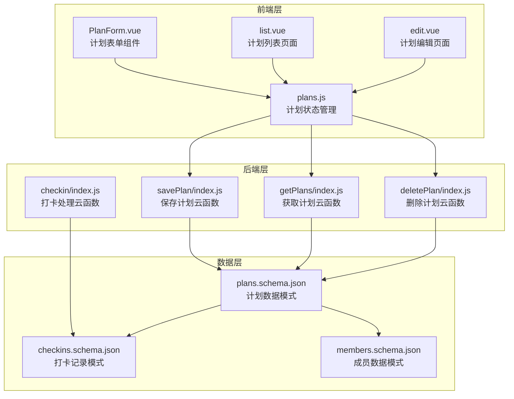

**图表来源**
- [PlanForm.vue:1-119](file://src/components/PlanForm.vue#L1-L119)
- [plans.js:1-73](file://src/stores/plans.js#L1-L73)
- [savePlan/index.js:1-31](file://uniCloud-aliyun/cloudfunctions/savePlan/index.js#L1-L31)
- [getPlans/index.js:1-15](file://uniCloud-aliyun/cloudfunctions/getPlans/index.js#L1-L15)

**章节来源**
- [plans.js:1-73](file://src/stores/plans.js#L1-L73)
- [PlanForm.vue:1-119](file://src/components/PlanForm.vue#L1-L119)
- [list.vue:1-133](file://src/pages/plan/list.vue#L1-L133)

## 核心组件

### 数据模型定义

plans集合采用JSON Schema定义，确保数据结构的完整性和一致性：

| 字段名 | 类型 | 必填 | 默认值 | 描述 |
|--------|------|------|--------|------|
| _id | ObjectId | 是 | 系统生成 | 计划唯一标识符 |
| title | String | 是 | 无 | 计划名称，长度限制在1-50字符 |
| description | String | 否 | 空字符串 | 计划描述信息 |
| family_id | String | 是 | 无 | 家庭ID，用于数据隔离 |
| points_per_check | Integer | 是 | 10 | 每次打卡获得的基础积分 |
| category | String | 是 | 无 | 计划分类：reading/study/exercise/life/custom |
| icon | String | 否 | 空字符串 | 计划图标标识 |
| status | String | 否 | active | 计划状态：active/archived |
| created_at | Number | 否 | 当前时间戳 | 计划创建时间 |

### 权限控制机制

系统通过Schema级别的权限控制实现数据安全：

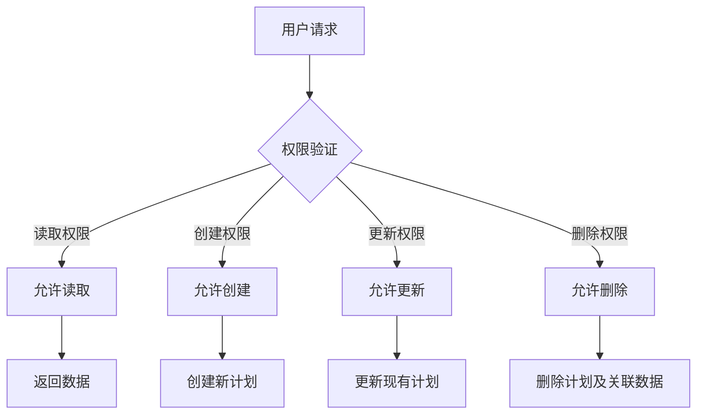

**图表来源**
- [plans.schema.json:4-8](file://uniCloud-aliyun/database/plans.schema.json#L4-L8)

**章节来源**
- [plans.schema.json:1-50](file://uniCloud-aliyun/database/plans.schema.json#L1-L50)

## 架构概览

计划系统的整体架构采用分层设计，确保各组件职责清晰、耦合度低：

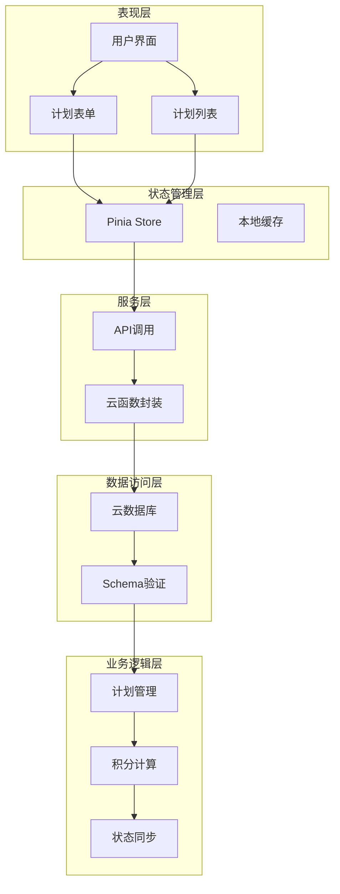

**图表来源**
- [plans.js:9-71](file://src/stores/plans.js#L9-L71)
- [savePlan/index.js:4-30](file://uniCloud-aliyun/cloudfunctions/savePlan/index.js#L4-L30)

## 详细组件分析

### 计划表单组件

PlanForm.vue提供了完整的计划配置界面，支持多种计划属性设置：

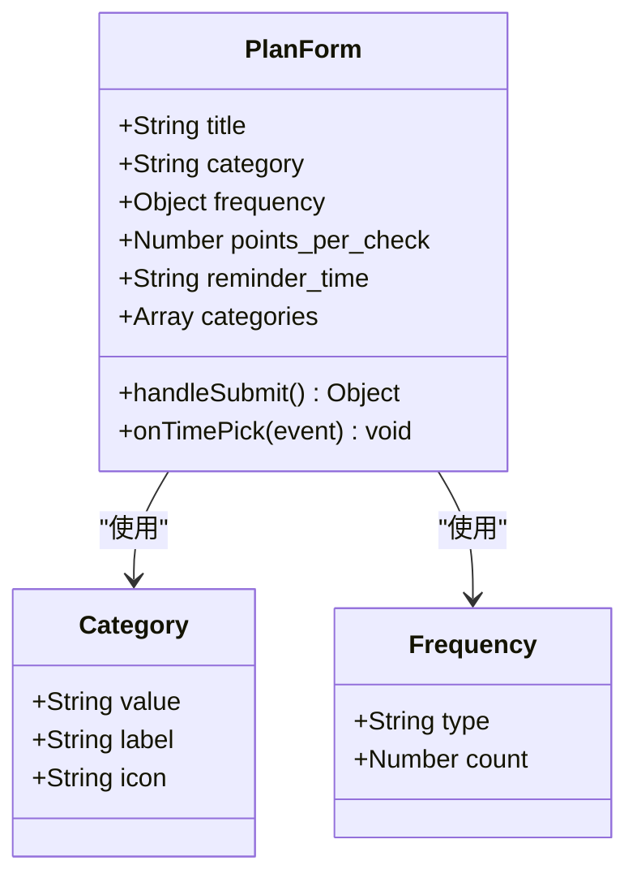

**图表来源**
- [PlanForm.vue:55-88](file://src/components/PlanForm.vue#L55-L88)

表单支持的分类选项：
- 阅读（📚）：reading
- 学习（📝）：study  
- 运动（🏃）：exercise
- 生活（🏠）：life
- 自定义（🎯）：custom

**章节来源**
- [PlanForm.vue:1-119](file://src/components/PlanForm.vue#L1-L119)

### 计划状态管理

Pinia Store实现了计划数据的集中管理：

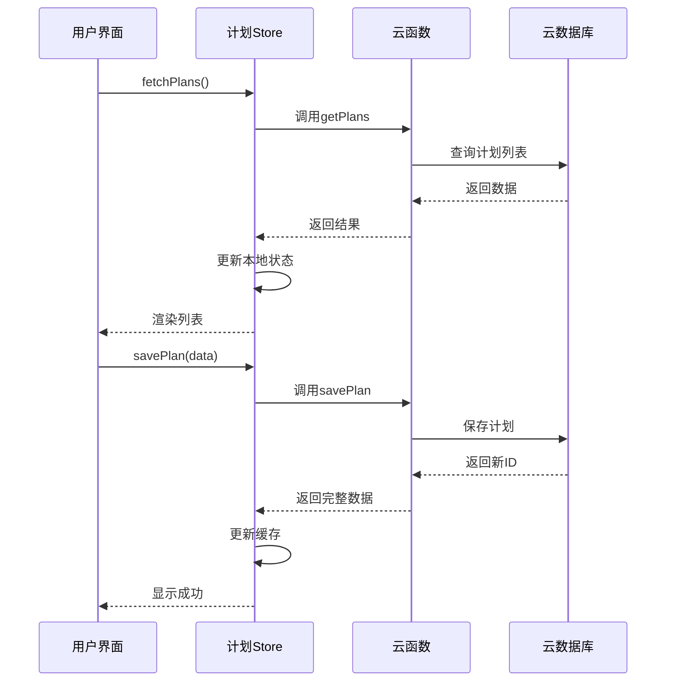

**图表来源**
- [plans.js:14-47](file://src/stores/plans.js#L14-L47)
- [getPlans/index.js:4-14](file://uniCloud-aliyun/cloudfunctions/getPlans/index.js#L4-L14)

**章节来源**
- [plans.js:1-73](file://src/stores/plans.js#L1-L73)

### 计划CRUD操作

#### 创建计划流程

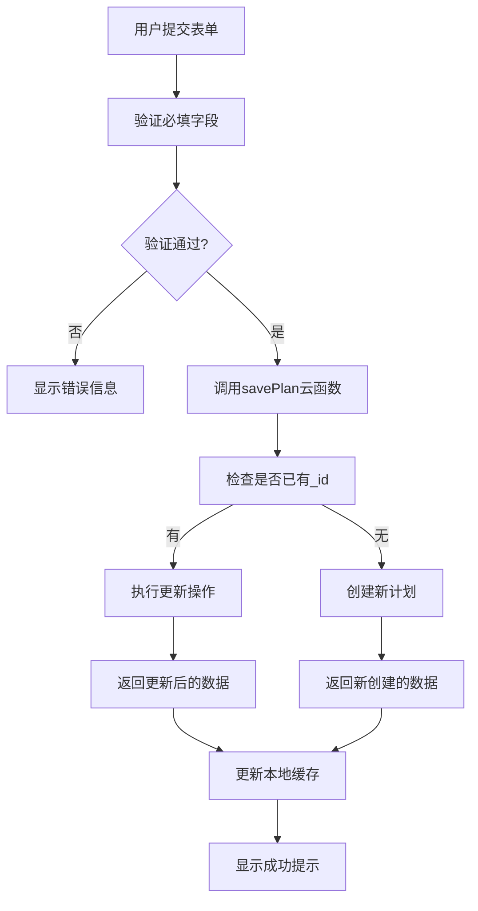

**图表来源**
- [savePlan/index.js:8-29](file://uniCloud-aliyun/cloudfunctions/savePlan/index.js#L8-L29)

#### 删除计划流程

系统实现了级联删除机制，确保数据完整性：

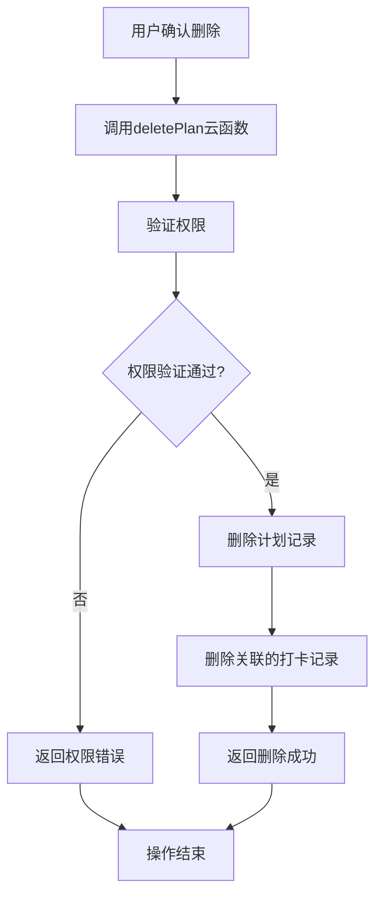

**图表来源**
- [deletePlan/index.js:8-23](file://uniCloud-aliyun/cloudfunctions/deletePlan/index.js#L8-L23)

**章节来源**
- [savePlan/index.js:1-31](file://uniCloud-aliyun/cloudfunctions/savePlan/index.js#L1-L31)
- [deletePlan/index.js:1-25](file://uniCloud-aliyun/cloudfunctions/deletePlan/index.js#L1-L25)

### 计划状态管理

系统支持两种状态：
- active：进行中的计划，参与日常打卡统计
- archived：已归档的计划，不再参与统计但保留历史数据

状态切换通过删除操作实现，实际删除时会同时清理相关的打卡记录。

**章节来源**
- [plans.schema.json:39-43](file://uniCloud-aliyun/database/plans.schema.json#L39-L43)

### 时间安排机制

虽然plans集合本身不直接存储复杂的时间安排，但通过frequency属性支持基本的时间配置：

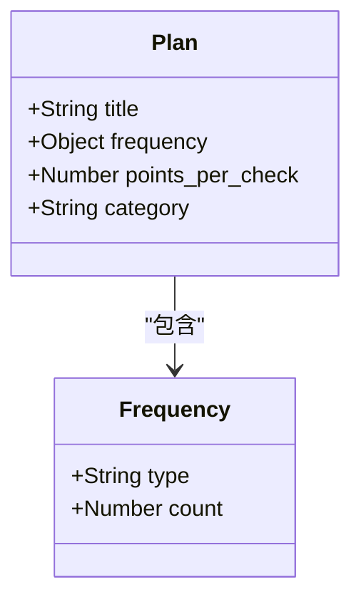

**图表来源**
- [PlanForm.vue:69-76](file://src/components/PlanForm.vue#L69-L76)

频率配置支持：
- daily：每日执行，count为每日次数
- weekly：每周执行，count为每周次数

**章节来源**
- [PlanForm.vue:22-32](file://src/components/PlanForm.vue#L22-L32)

## 依赖分析

### 数据关联关系

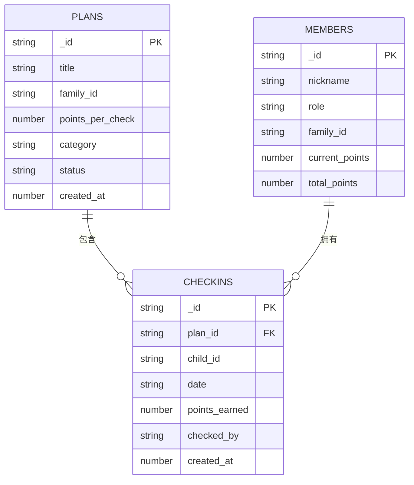

**图表来源**
- [plans.schema.json:10-48](file://uniCloud-aliyun/database/plans.schema.json#L10-L48)
- [checkins.schema.json:10-50](file://uniCloud-aliyun/database/checkins.schema.json#L10-L50)
- [members.schema.json:10-44](file://uniCloud-aliyun/database/members.schema.json#L10-L44)

### 业务流程依赖

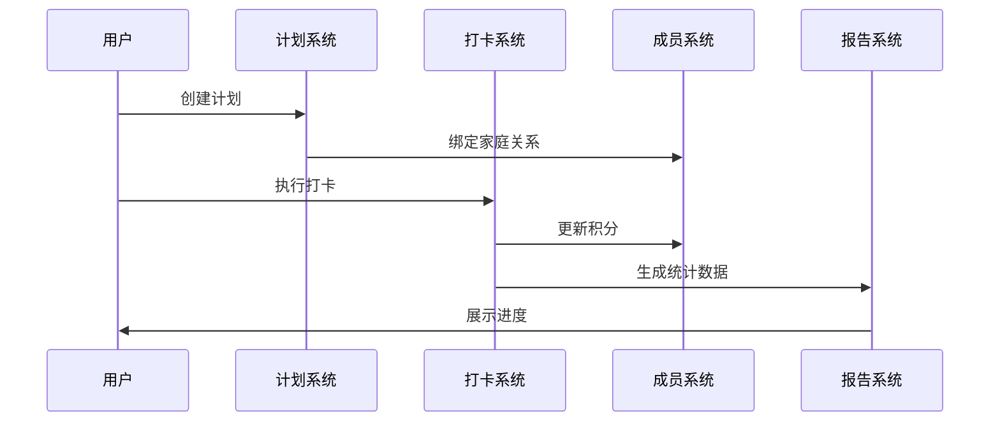

**图表来源**
- [checkin/index.js:12-83](file://src/cloudfunctions/checkin/index.js#L12-L83)
- [getWeeklyReport/index.js:4-45](file://uniCloud-aliyun/cloudfunctions/getWeeklyReport/index.js#L4-L45)

**章节来源**
- [checkin/index.js:1-83](file://src/cloudfunctions/checkin/index.js#L1-L83)
- [getWeeklyReport/index.js:1-45](file://uniCloud-aliyun/cloudfunctions/getWeeklyReport/index.js#L1-L45)

## 性能考虑

### 查询优化策略

1. **索引设计建议**：
   - family_id + created_at：用于按家庭查询最新计划
   - family_id + status：用于查询特定家庭的活跃计划
   - status：用于快速筛选活跃计划

2. **缓存策略**：
   - 本地缓存：使用localStorage缓存计划列表，减少网络请求
   - 状态缓存：Pinia Store管理响应式状态，避免重复渲染

3. **批量操作**：
   - 支持批量删除相关打卡记录，避免多次数据库往返

### 数据访问优化

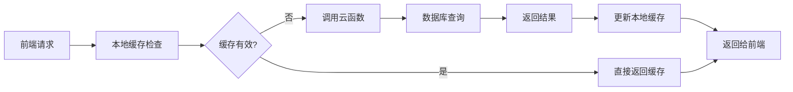

**图表来源**
- [plans.js:14-27](file://src/stores/plans.js#L14-L27)

**章节来源**
- [plans.js:1-73](file://src/stores/plans.js#L1-L73)

## 故障排除指南

### 常见问题及解决方案

1. **权限错误**：当尝试删除不属于当前家庭的计划时，系统会返回权限错误
   - 检查family_id参数是否正确传递
   - 验证用户登录状态和家庭绑定关系

2. **数据验证失败**：必填字段缺失会导致保存失败
   - 确保title、family_id、points_per_check、category等字段完整
   - 检查字段类型是否符合Schema要求

3. **重复打卡**：同一天同一计划重复打卡会被拒绝
   - 在前端添加重复检测逻辑
   - 提供适当的用户反馈

4. **离线同步**：网络异常时的处理机制
   - 自动缓存到本地存储
   - 后台定时同步队列
   - 提供手动同步功能

**章节来源**
- [deletePlan/index.js:8-15](file://uniCloud-aliyun/cloudfunctions/deletePlan/index.js#L8-L15)
- [checkin/index.js:20-24](file://src/cloudfunctions/checkin/index.js#L20-L24)

## 结论

Star Grow项目的计划集合设计体现了现代移动应用的最佳实践，通过清晰的数据模型、完善的权限控制、优雅的状态管理和高效的性能优化，构建了一个功能完整、用户体验良好的习惯养成系统。

系统的关键优势包括：
- **数据完整性**：通过Schema验证确保数据质量
- **安全性**：基于家庭维度的权限控制
- **可扩展性**：模块化设计支持功能扩展
- **用户体验**：响应式状态管理和离线支持

未来可以考虑的改进方向：
- 增加计划模板功能
- 实现更复杂的时间安排规则
- 添加计划分享和协作功能
- 优化移动端交互体验

## 附录

### API接口规范

| 接口名称 | 方法 | 路径 | 功能描述 |
|----------|------|------|----------|
| 获取计划列表 | GET | /getPlans | 获取指定家庭的所有计划 |
| 保存计划 | POST | /savePlan | 创建或更新计划 |
| 删除计划 | DELETE | /deletePlan | 删除计划及其关联数据 |

### 数据验证规则

1. **必填字段验证**：title、family_id、points_per_check、category
2. **类型验证**：points_per_check必须为整数，created_at为时间戳
3. **范围验证**：points_per_check默认值为10，最小为1
4. **枚举验证**：status只能为active或archived，category为预定义值之一

### 安全控制措施

1. **权限验证**：每个操作都验证用户权限和数据所有权
2. **数据隔离**：通过family_id确保数据在家庭维度内隔离
3. **输入过滤**：对用户输入进行严格验证和过滤
4. **审计日志**：记录重要的数据变更操作