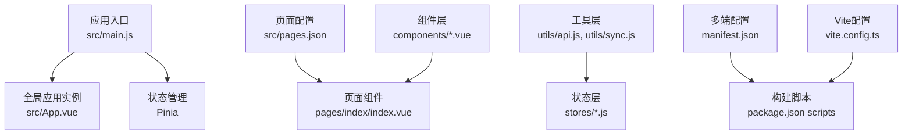
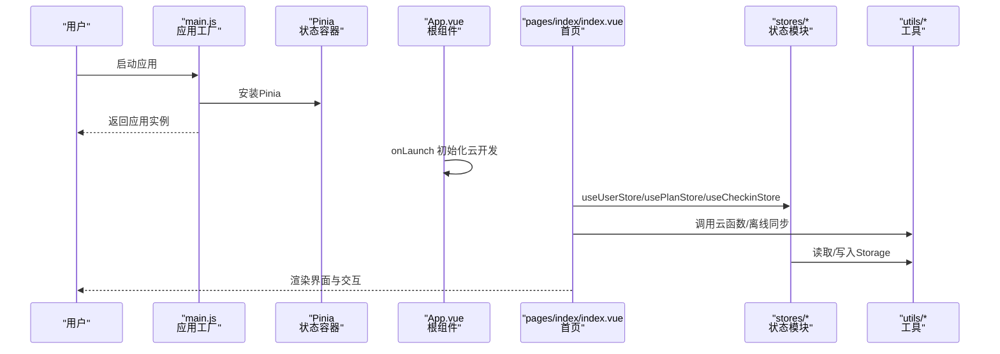
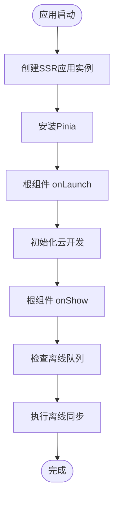
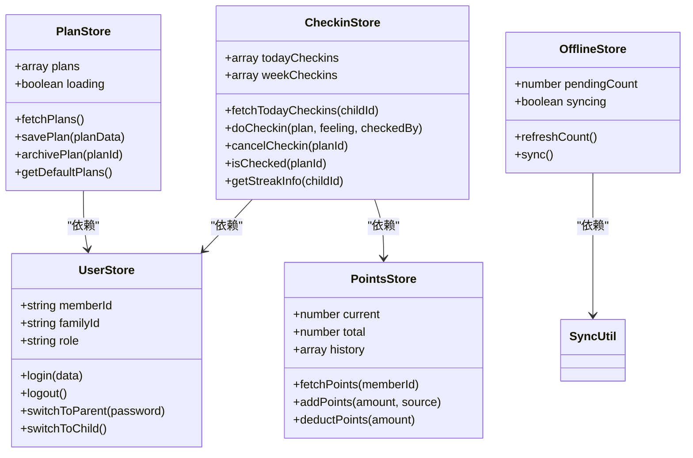
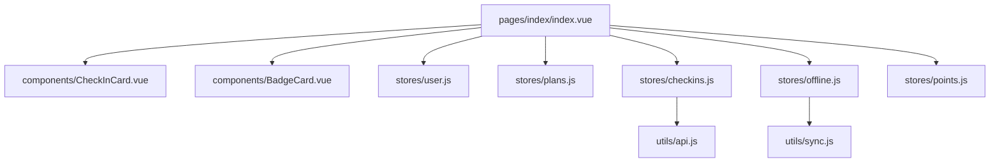
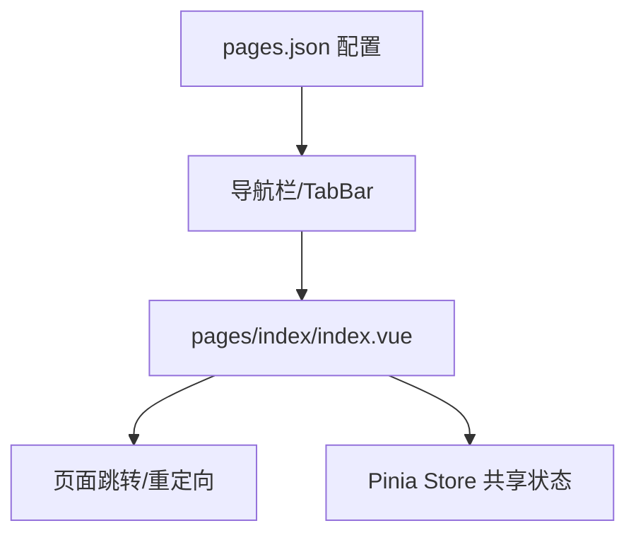
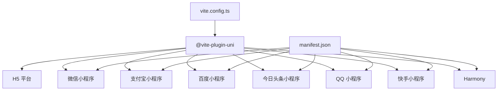
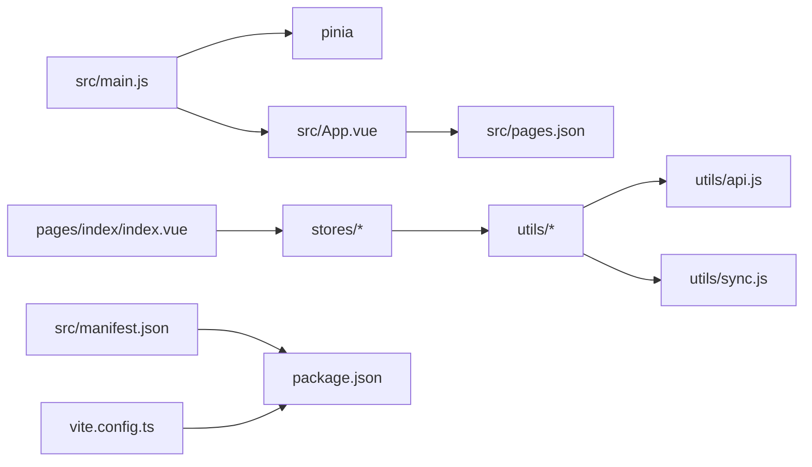

# 前端架构设计

<cite>
**本文引用的文件**
- [src/main.js](file://src/main.js)
- [src/App.vue](file://src/App.vue)
- [src/pages.json](file://src/pages.json)
- [package.json](file://package.json)
- [vite.config.ts](file://vite.config.ts)
- [src/stores/user.js](file://src/stores/user.js)
- [src/stores/checkins.js](file://src/stores/checkins.js)
- [src/stores/plans.js](file://src/stores/plans.js)
- [src/stores/points.js](file://src/stores/points.js)
- [src/stores/offline.js](file://src/stores/offline.js)
- [src/utils/api.js](file://src/utils/api.js)
- [src/utils/sync.js](file://src/utils/sync.js)
- [src/components/BadgeCard.vue](file://src/components/BadgeCard.vue)
- [src/components/CheckInCard.vue](file://src/components/CheckInCard.vue)
- [src/pages/index/index.vue](file://src/pages/index/index.vue)
- [src/manifest.json](file://src/manifest.json)
- [shims-uni.d.ts](file://shims-uni.d.ts)
</cite>

## 目录
1. [引言](#引言)
2. [项目结构](#项目结构)
3. [核心组件](#核心组件)
4. [架构总览](#架构总览)
5. [详细组件分析](#详细组件分析)
6. [依赖分析](#依赖分析)
7. [性能考虑](#性能考虑)
8. [故障排查指南](#故障排查指南)
9. [结论](#结论)
10. [附录](#附录)

## 引言
本文件面向Star Grow项目的前端架构设计，围绕基于Vue 3 Composition API与Pinia的状态管理、uni-app多端适配、组件化架构、路由与导航体系、以及响应式数据绑定与虚拟DOM工作原理进行系统性阐述。文档同时提供架构图与组件关系图，帮助开发者快速理解应用的控制流、数据流与模块边界。

## 项目结构
项目采用“功能域+层次化”的组织方式：
- 应用入口与全局配置：入口通过SSR应用工厂创建并挂载Pinia；全局App负责生命周期与云开发初始化；pages.json定义页面与tabBar；manifest.json声明多端配置。
- 页面层：pages目录按功能域划分，如index、plan、points、reward、report、badge、settings等。
- 组件层：components目录存放可复用UI组件，如BadgeCard、CheckInCard等。
- 状态层：stores目录按业务域拆分，如user、checkins、plans、points、offline等。
- 工具层：utils目录封装API调用与离线同步逻辑。
- 多端构建：通过Vite插件与脚本命令实现H5与多小程序平台的编译与运行。

**图表来源**
- [src/main.js:1-11](file://src/main.js#L1-L11)
- [src/App.vue:1-64](file://src/App.vue#L1-L64)
- [src/pages.json:1-56](file://src/pages.json#L1-L56)
- [src/manifest.json:1-77](file://src/manifest.json#L1-L77)
- [package.json:1-74](file://package.json#L1-L74)
- [vite.config.ts:1-8](file://vite.config.ts#L1-L8)

**章节来源**
- [src/main.js:1-11](file://src/main.js#L1-L11)
- [src/App.vue:1-64](file://src/App.vue#L1-L64)
- [src/pages.json:1-56](file://src/pages.json#L1-L56)
- [src/manifest.json:1-77](file://src/manifest.json#L1-L77)
- [package.json:1-74](file://package.json#L1-L74)
- [vite.config.ts:1-8](file://vite.config.ts#L1-L8)

## 核心组件
- 应用初始化与状态注入
  - 通过应用工厂创建SSR应用实例，并安装Pinia，确保全局状态可用。
- 生命周期与云开发
  - 在App根组件的onLaunch中初始化微信云开发；在onShow中触发离线数据同步。
- 页面与导航
  - pages.json集中声明页面路径、导航栏标题与tabBar配置，统一全局样式。
- 多端构建
  - Vite配合@vite-plugin-uni实现多端编译；package.json提供多平台开发/构建脚本。

**章节来源**
- [src/main.js:1-11](file://src/main.js#L1-L11)
- [src/App.vue:1-64](file://src/App.vue#L1-L64)
- [src/pages.json:1-56](file://src/pages.json#L1-L56)
- [package.json:1-74](file://package.json#L1-L74)
- [vite.config.ts:1-8](file://vite.config.ts#L1-L8)

## 架构总览
下图展示了应用启动到页面渲染的关键流程，以及状态管理与工具层的交互：

**图表来源**
- [src/main.js:1-11](file://src/main.js#L1-L11)
- [src/App.vue:1-64](file://src/App.vue#L1-L64)
- [src/pages/index/index.vue:1-204](file://src/pages/index/index.vue#L1-L204)
- [src/stores/user.js:1-119](file://src/stores/user.js#L1-L119)
- [src/stores/checkins.js:1-163](file://src/stores/checkins.js#L1-L163)
- [src/stores/plans.js:1-73](file://src/stores/plans.js#L1-L73)
- [src/utils/api.js:1-18](file://src/utils/api.js#L1-L18)
- [src/utils/sync.js:1-96](file://src/utils/sync.js#L1-L96)

## 详细组件分析

### 应用初始化与生命周期
- 初始化流程
  - 应用工厂创建SSR应用实例，安装Pinia，导出包含app的对象，供多端运行时使用。
  - App根组件在onLaunch中对特定平台进行云开发初始化；在onShow中触发离线数据同步。
- 生命周期要点
  - onLaunch：仅在应用启动时执行一次，适合初始化云服务与全局配置。
  - onShow：每次回到前台都会触发，用于检测并同步离线数据，保证数据一致性。

**图表来源**
- [src/main.js:1-11](file://src/main.js#L1-L11)
- [src/App.vue:1-64](file://src/App.vue#L1-L64)

**章节来源**
- [src/main.js:1-11](file://src/main.js#L1-L11)
- [src/App.vue:1-64](file://src/App.vue#L1-L64)

### Pinia状态管理与数据持久化
- 设计模式
  - 使用Composition API风格的defineStore，将状态、派生状态与方法聚合在一个store中，便于维护与测试。
  - store之间通过组合式API相互调用，如checkins依赖user与points，offline依赖sync工具。
- 数据持久化策略
  - 通过uniCloud与Storage结合：云端接口返回的数据写入Storage，作为本地缓存；同时在异常或离线场景下优先使用本地缓存，保障用户体验。
  - 关键持久化键：用户信息、积分、计划缓存、离线队列、上次同步时间等。
- 状态共享机制
  - 页面组件通过useXxxStore直接消费状态；store内部通过computed与ref实现响应式更新，驱动视图变化。

**图表来源**
- [src/stores/user.js:1-119](file://src/stores/user.js#L1-L119)
- [src/stores/checkins.js:1-163](file://src/stores/checkins.js#L1-L163)
- [src/stores/plans.js:1-73](file://src/stores/plans.js#L1-L73)
- [src/stores/points.js:1-44](file://src/stores/points.js#L1-L44)
- [src/stores/offline.js:1-30](file://src/stores/offline.js#L1-L30)
- [src/utils/sync.js:1-96](file://src/utils/sync.js#L1-L96)

**章节来源**
- [src/stores/user.js:1-119](file://src/stores/user.js#L1-L119)
- [src/stores/checkins.js:1-163](file://src/stores/checkins.js#L1-L163)
- [src/stores/plans.js:1-73](file://src/stores/plans.js#L1-L73)
- [src/stores/points.js:1-44](file://src/stores/points.js#L1-L44)
- [src/stores/offline.js:1-30](file://src/stores/offline.js#L1-L30)
- [src/utils/sync.js:1-96](file://src/utils/sync.js#L1-L96)

### 组件化架构与页面组件
- 页面组件
  - pages/index/index.vue作为首页，负责加载计划、打卡、积分与离线同步等核心流程；通过组合式API消费多个store，实现高内聚低耦合。
- 可复用组件
  - CheckInCard：展示计划项并触发checkin/unclick事件；BadgeCard：展示解锁/锁定的勋章信息。
- 业务组件
  - 与具体业务强相关的组件，如表单、列表、卡片等，均以props与events的方式与页面解耦。

**图表来源**
- [src/pages/index/index.vue:1-204](file://src/pages/index/index.vue#L1-L204)
- [src/components/CheckInCard.vue:1-67](file://src/components/CheckInCard.vue#L1-L67)
- [src/components/BadgeCard.vue:1-37](file://src/components/BadgeCard.vue#L1-L37)
- [src/stores/user.js:1-119](file://src/stores/user.js#L1-L119)
- [src/stores/plans.js:1-73](file://src/stores/plans.js#L1-L73)
- [src/stores/checkins.js:1-163](file://src/stores/checkins.js#L1-L163)
- [src/stores/offline.js:1-30](file://src/stores/offline.js#L1-L30)
- [src/stores/points.js:1-44](file://src/stores/points.js#L1-L44)
- [src/utils/api.js:1-18](file://src/utils/api.js#L1-L18)
- [src/utils/sync.js:1-96](file://src/utils/sync.js#L1-L96)

**章节来源**
- [src/pages/index/index.vue:1-204](file://src/pages/index/index.vue#L1-L204)
- [src/components/CheckInCard.vue:1-67](file://src/components/CheckInCard.vue#L1-L67)
- [src/components/BadgeCard.vue:1-37](file://src/components/BadgeCard.vue#L1-L37)

### 路由系统与导航管理
- pages.json配置
  - pages数组声明所有页面路径与导航样式；globalStyle统一导航栏与背景色；tabBar定义底部导航项及图标。
- 导航管理
  - 页面内通过uni.navigateTo/reLaunch等API进行页面跳转；首页在onShow时校验登录状态并重定向至登录页。
- 页面间通信
  - 通过store共享状态，避免复杂参数传递；必要时使用事件总线或回调约定。

**图表来源**
- [src/pages.json:1-56](file://src/pages.json#L1-L56)
- [src/pages/index/index.vue:1-204](file://src/pages/index/index.vue#L1-L204)

**章节来源**
- [src/pages.json:1-56](file://src/pages.json#L1-L56)
- [src/pages/index/index.vue:1-204](file://src/pages/index/index.vue#L1-L204)

### 响应式数据绑定与虚拟DOM
- 响应式模型
  - 使用ref/computed暴露状态与派生状态；store内部通过ref维护本地状态，computed计算派生值，减少重复计算。
- 视图更新
  - 页面组件通过组合式API订阅store状态；当store状态变更时，依赖该状态的计算属性与DOM节点自动更新。
- 虚拟DOM与渲染
  - Vue 3基于响应式系统驱动虚拟DOM diff与patch，实现最小化更新；组件级scoped样式与类名切换提升渲染效率。

**章节来源**
- [src/stores/user.js:1-119](file://src/stores/user.js#L1-L119)
- [src/stores/checkins.js:1-163](file://src/stores/checkins.js#L1-L163)
- [src/stores/plans.js:1-73](file://src/stores/plans.js#L1-L73)
- [src/stores/points.js:1-44](file://src/stores/points.js#L1-L44)
- [src/stores/offline.js:1-30](file://src/stores/offline.js#L1-L30)

### uni-app多端适配原理
- 编译时多端转换
  - 通过@vite-plugin-uni在构建阶段对不同平台进行语法与API转换，屏蔽平台差异。
- 运行时平台差异处理
  - 使用条件编译宏区分平台（如微信小程序）；在App根组件中针对特定平台初始化云开发。
- 多端构建脚本
  - package.json提供多平台开发与构建命令，覆盖H5、微信、支付宝、百度、头条、QQ、快手、Harmony等平台。

**图表来源**
- [vite.config.ts:1-8](file://vite.config.ts#L1-L8)
- [package.json:1-74](file://package.json#L1-L74)
- [src/manifest.json:1-77](file://src/manifest.json#L1-L77)

**章节来源**
- [vite.config.ts:1-8](file://vite.config.ts#L1-L8)
- [package.json:1-74](file://package.json#L1-L74)
- [src/manifest.json:1-77](file://src/manifest.json#L1-L77)
- [src/App.vue:1-64](file://src/App.vue#L1-L64)

## 依赖分析
- 组件耦合
  - 页面组件对store存在直接依赖；store之间通过组合式API相互调用，形成清晰的单向数据流。
- 外部依赖
  - @dcloudio/uni-app系列包提供多端运行时；pinia提供状态管理；uview-plus提供UI组件库；vue与vite构成基础框架。
- 循环依赖
  - 当前结构通过组合式API与模块化导入避免循环依赖；工具层通过动态import降低耦合。

**图表来源**
- [src/main.js:1-11](file://src/main.js#L1-L11)
- [src/App.vue:1-64](file://src/App.vue#L1-L64)
- [src/pages.json:1-56](file://src/pages.json#L1-L56)
- [src/pages/index/index.vue:1-204](file://src/pages/index/index.vue#L1-L204)
- [src/stores/user.js:1-119](file://src/stores/user.js#L1-L119)
- [src/stores/checkins.js:1-163](file://src/stores/checkins.js#L1-L163)
- [src/stores/plans.js:1-73](file://src/stores/plans.js#L1-L73)
- [src/stores/points.js:1-44](file://src/stores/points.js#L1-L44)
- [src/stores/offline.js:1-30](file://src/stores/offline.js#L1-L30)
- [src/utils/api.js:1-18](file://src/utils/api.js#L1-L18)
- [src/utils/sync.js:1-96](file://src/utils/sync.js#L1-L96)
- [src/manifest.json:1-77](file://src/manifest.json#L1-L77)
- [package.json:1-74](file://package.json#L1-L74)
- [vite.config.ts:1-8](file://vite.config.ts#L1-L8)

**章节来源**
- [package.json:1-74](file://package.json#L1-L74)
- [src/manifest.json:1-77](file://src/manifest.json#L1-L77)
- [vite.config.ts:1-8](file://vite.config.ts#L1-L8)

## 性能考虑
- 离线优先与静默同步
  - 打卡操作优先写入本地Storage，避免阻塞用户；在前台可见时自动触发智能同步，减少网络抖动带来的影响。
- 本地缓存与降级
  - 云函数调用失败时回退本地缓存，保证核心功能可用；积分与计划列表均具备缓存策略。
- 渲染优化
  - 使用computed缓存派生结果；组件级scoped样式减少全局样式冲突；合理拆分组件，降低不必要的重渲染。

## 故障排查指南
- 云函数调用失败
  - 检查云函数名称与参数；确认uniCloud初始化与权限配置；查看工具层返回的错误信息。
- 离线同步异常
  - 检查离线队列长度与上次同步时间；确认网络状态；查看同步工具返回的错误码。
- 页面无法进入
  - 检查登录态与重定向逻辑；确认pages.json中页面路径与导航配置正确。
- 多端差异问题
  - 使用条件编译宏区分平台；核对manifest.json中平台配置与权限声明。

**章节来源**
- [src/utils/api.js:1-18](file://src/utils/api.js#L1-L18)
- [src/utils/sync.js:1-96](file://src/utils/sync.js#L1-L96)
- [src/pages/index/index.vue:1-204](file://src/pages/index/index.vue#L1-L204)
- [src/App.vue:1-64](file://src/App.vue#L1-L64)
- [src/manifest.json:1-77](file://src/manifest.json#L1-L77)

## 结论
Star Grow前端采用Vue 3 + Pinia + uni-app的现代化技术栈，通过清晰的模块划分与状态管理实现了跨端一致的用户体验。离线优先与本地缓存策略提升了稳定性，组件化与页面化分离增强了可维护性。建议后续持续完善错误监控与埋点统计，进一步优化首屏性能与交互反馈。

## 附录
- 类型声明与钩子扩展
  - 通过shims-uni.d.ts扩展Vue运行时类型，使App与Page实例在类型层面可用，提升开发体验与IDE支持。

**章节来源**
- [shims-uni.d.ts:1-11](file://shims-uni.d.ts#L1-L11)