# 后端架构设计

<cite>
**本文档引用的文件**
- [login/index.js](file://uniCloud-aliyun/cloudfunctions/login/index.js)
- [checkin/index.js](file://uniCloud-aliyun/cloudfunctions/checkin/index.js)
- [exchangeReward/index.js](file://uniCloud-aliyun/cloudfunctions/exchangeReward/index.js)
- [syncOffline/index.js](file://uniCloud-aliyun/cloudfunctions/syncOffline/index.js)
- [badge-engine.js](file://uniCloud-aliyun/common/badge-engine.js)
- [const.js](file://uniCloud-aliyun/common/const.js)
- [badges.schema.json](file://uniCloud-aliyun/database/badges.schema.json)
- [checkins.schema.json](file://uniCloud-aliyun/database/checkins.schema.json)
- [members.schema.json](file://uniCloud-aliyun/database/members.schema.json)
- [plans.schema.json](file://uniCloud-aliyun/database/plans.schema.json)
- [rewards.schema.json](file://uniCloud-aliyun/database/rewards.schema.json)
- [exchanges.schema.json](file://uniCloud-aliyun/database/exchanges.schema.json)
- [whitelist.schema.json](file://uniCloud-aliyun/database/whitelist.schema.json)
- [package.json](file://package.json)
</cite>

## 目录
1. [项目概述](#项目概述)
2. [整体架构](#整体架构)
3. [云函数架构](#云函数架构)
4. [数据模型设计](#数据模型设计)
5. [业务分层设计](#业务分层设计)
6. [安全架构](#安全架构)
7. [异步处理与并发控制](#异步处理与并发控制)
8. [监控与日志](#监控与日志)
9. [部署与集成](#部署与集成)
10. [总结](#总结)

## 项目概述

Star Grow是一个基于uniCloud云开发的儿童成长打卡应用，通过积分奖励和勋章系统激励儿童养成良好习惯。项目采用前后端分离架构，前端使用Vue 3 + UniApp框架，后端基于DCloud uniCloud云开发平台。

## 整体架构

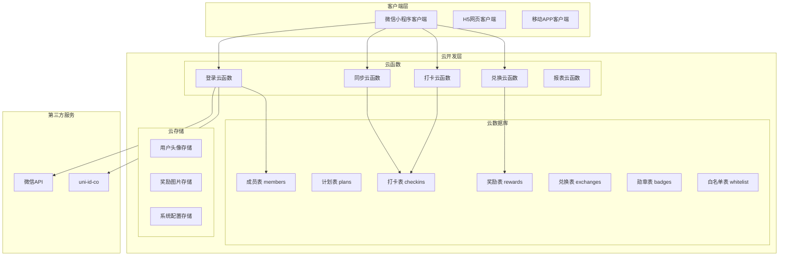

**图表来源**
- [login/index.js:1-103](file://uniCloud-aliyun/cloudfunctions/login/index.js#L1-L103)
- [checkin/index.js:1-83](file://uniCloud-aliyun/cloudfunctions/checkin/index.js#L1-L83)
- [exchangeReward/index.js:1-53](file://uniCloud-aliyun/cloudfunctions/exchangeReward/index.js#L1-L53)
- [syncOffline/index.js:1-90](file://uniCloud-aliyun/cloudfunctions/syncOffline/index.js#L1-L90)

## 云函数架构

### 云函数组织结构

项目采用功能模块化的云函数组织方式，每个云函数负责特定的业务功能：

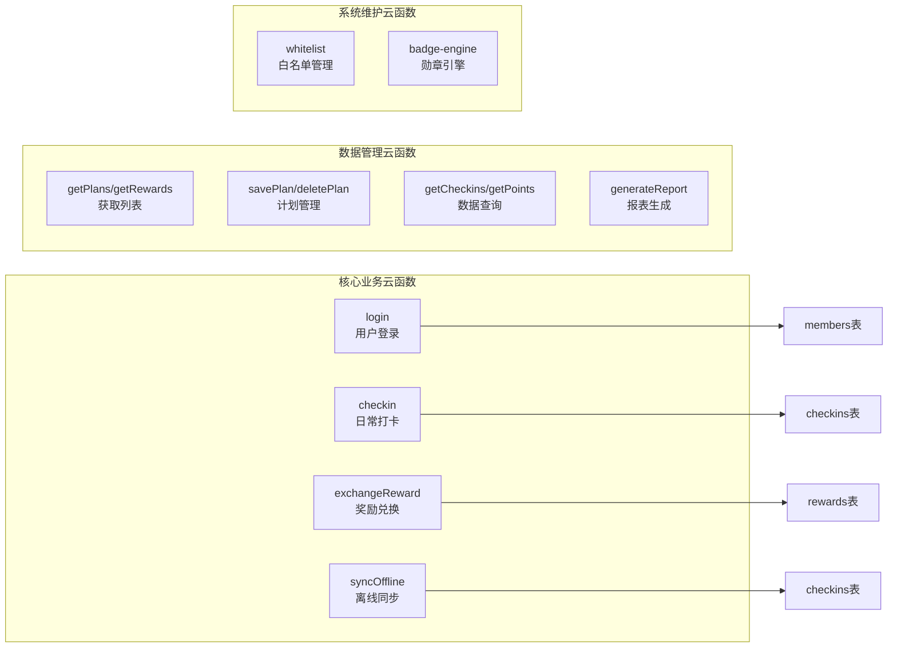

**图表来源**
- [login/index.js:1-103](file://uniCloud-aliyun/cloudfunctions/login/index.js#L1-L103)
- [checkin/index.js:1-83](file://uniCloud-aliyun/cloudfunctions/checkin/index.js#L1-L83)
- [exchangeReward/index.js:1-53](file://uniCloud-aliyun/cloudfunctions/exchangeReward/index.js#L1-L53)
- [syncOffline/index.js:1-90](file://uniCloud-aliyun/cloudfunctions/syncOffline/index.js#L1-L90)

### 云函数执行机制

云函数采用事件驱动的异步执行模式：

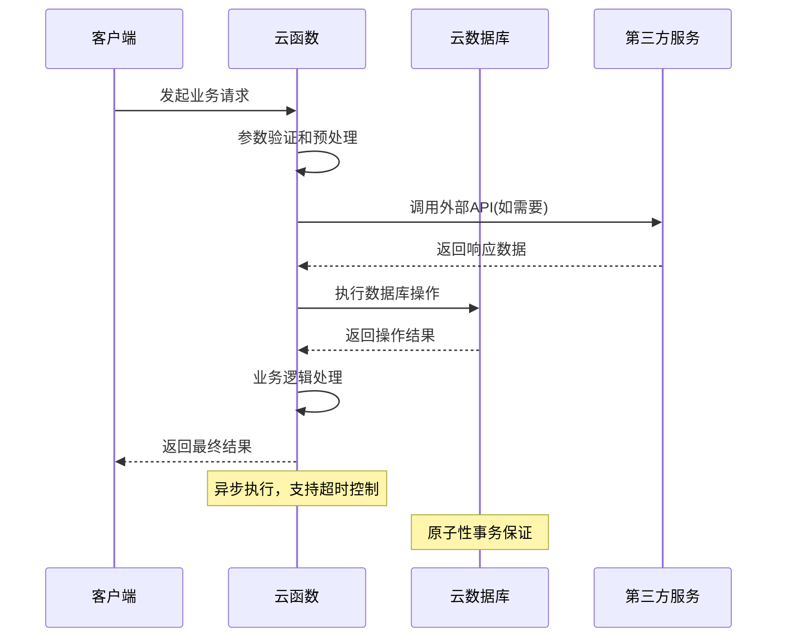

**图表来源**
- [login/index.js:6-48](file://uniCloud-aliyun/cloudfunctions/login/index.js#L6-L48)
- [checkin/index.js:5-38](file://uniCloud-aliyun/cloudfunctions/checkin/index.js#L5-L38)

### 客户端云函数 vs 云开发云函数

| 特性 | 客户端云函数 | 云开发云函数 |
|------|-------------|-------------|
| **调用方式** | 客户端直接调用 | 通过uniCloud.callFunction调用 |
| **执行环境** | 客户端设备 | 云端服务器 |
| **权限控制** | 基于客户端凭证 | 基于云函数权限 |
| **性能特点** | 低延迟，本地处理 | 高并发，集中处理 |
| **适用场景** | 简单查询，缓存操作 | 复杂业务逻辑，数据处理 |

## 数据模型设计

### 核心数据模型

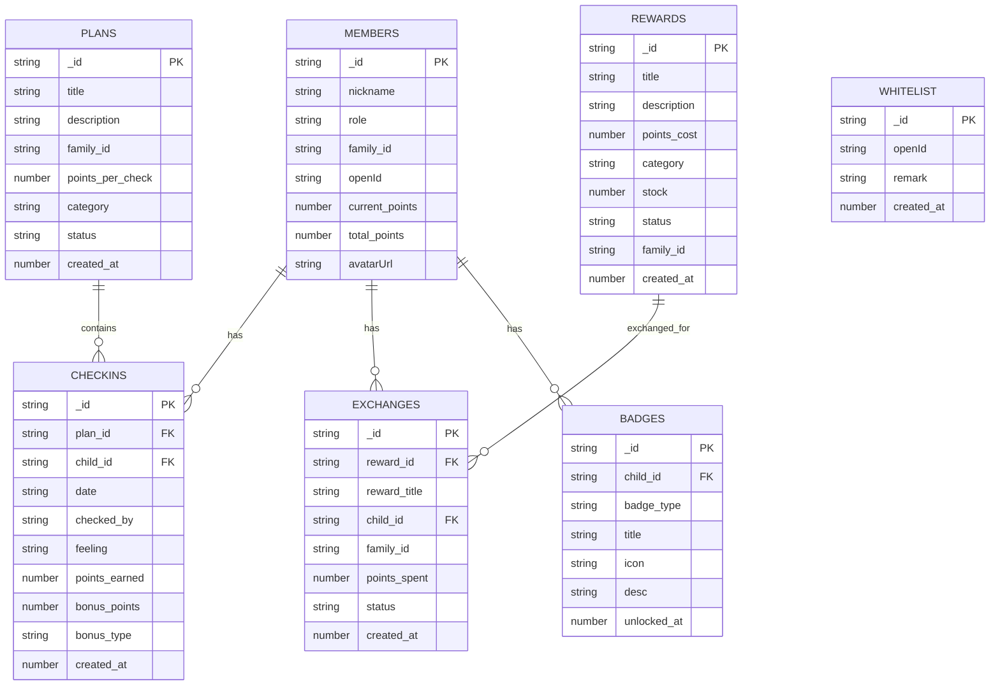

**图表来源**
- [members.schema.json:1-46](file://uniCloud-aliyun/database/members.schema.json#L1-L46)
- [plans.schema.json:1-50](file://uniCloud-aliyun/database/plans.schema.json#L1-L50)
- [checkins.schema.json:1-52](file://uniCloud-aliyun/database/checkins.schema.json#L1-L52)
- [rewards.schema.json:1-53](file://uniCloud-aliyun/database/rewards.schema.json#L1-L53)
- [exchanges.schema.json:1-56](file://uniCloud-aliyun/database/exchanges.schema.json#L1-L56)
- [badges.schema.json:1-40](file://uniCloud-aliyun/database/badges.schema.json#L1-L40)
- [whitelist.schema.json:1-28](file://uniCloud-aliyun/database/whitelist.schema.json#L1-L28)

### 集合关系设计原则

1. **一对一关系**: 成员与个人资料
2. **一对多关系**: 家庭包含多个成员，成员拥有多个打卡记录
3. **多对多关系**: 通过中间表实现，如成员-奖励的兑换关系
4. **继承关系**: 勋章类型通过badge_type字段实现

### 索引策略

```mermaid
flowchart TD
A[索引设计策略] --> B[复合索引]
A --> C[单字段索引]
A --> D[全文索引]
B --> B1[checkins: (plan_id, child_id, date)]
B --> B2[checkins: (child_id, date)]
B --> B3[exchanges: (child_id, created_at)]
C --> C1[family_id]
C --> C2[openId]
C --> C3[status]
D --> D1[搜索优化]
```

**图表来源**
- [checkins.schema.json:14-25](file://uniCloud-aliyun/database/checkins.schema.json#L14-L25)
- [exchanges.schema.json:26-33](file://uniCloud-aliyun/database/exchanges.schema.json#L26-L33)

### 权限控制机制

| 集合 | 读权限 | 写权限 | 删除权限 |
|------|-------|-------|---------|
| members | 所有用户 | 成员本人 | 禁止 |
| checkins | 所有用户 | 所有用户 | 所有用户 |
| rewards | 所有用户 | 管理员 | 管理员 |
| exchanges | 所有用户 | 所有用户 | 禁止 |
| badges | 所有用户 | 禁止 | 禁止 |
| whitelist | 管理员 | 管理员 | 管理员 |

## 业务分层设计

### 分层架构图

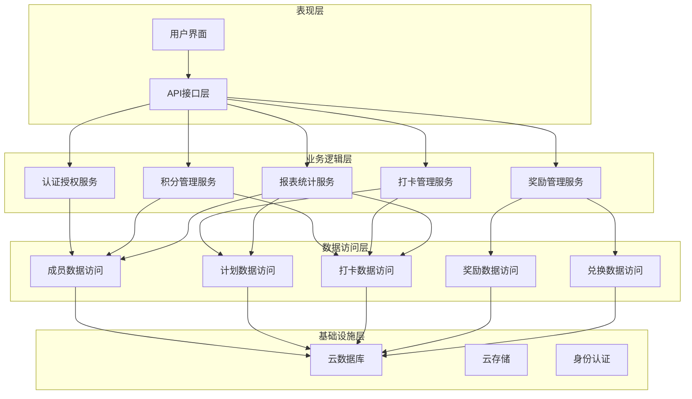

**图表来源**
- [login/index.js:1-103](file://uniCloud-aliyun/cloudfunctions/login/index.js#L1-L103)
- [checkin/index.js:1-83](file://uniCloud-aliyun/cloudfunctions/checkin/index.js#L1-L83)
- [exchangeReward/index.js:1-53](file://uniCloud-aliyun/cloudfunctions/exchangeReward/index.js#L1-L53)

### API层设计

API层负责处理HTTP请求和响应，提供RESTful接口：

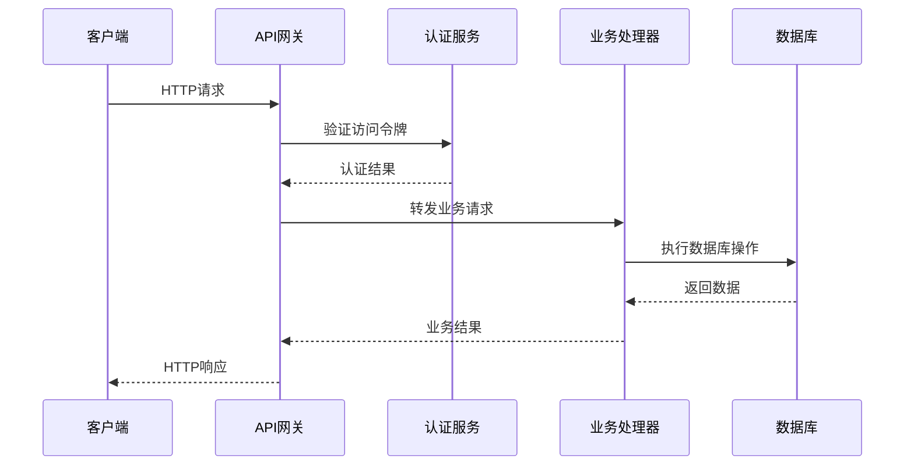

**图表来源**
- [login/index.js:6-102](file://uniCloud-aliyun/cloudfunctions/login/index.js#L6-L102)

### 业务层设计

业务层实现核心业务逻辑，包含以下主要服务：

#### 登录认证服务
- 微信小程序登录处理
- 白名单验证
- 用户信息管理和更新

#### 积分管理服务
- 打卡积分计算
- 连续打卡奖励
- 积分消费和统计

#### 奖励管理服务
- 奖励兑换流程
- 库存管理
- 兑换状态跟踪

## 安全架构

### 身份认证体系

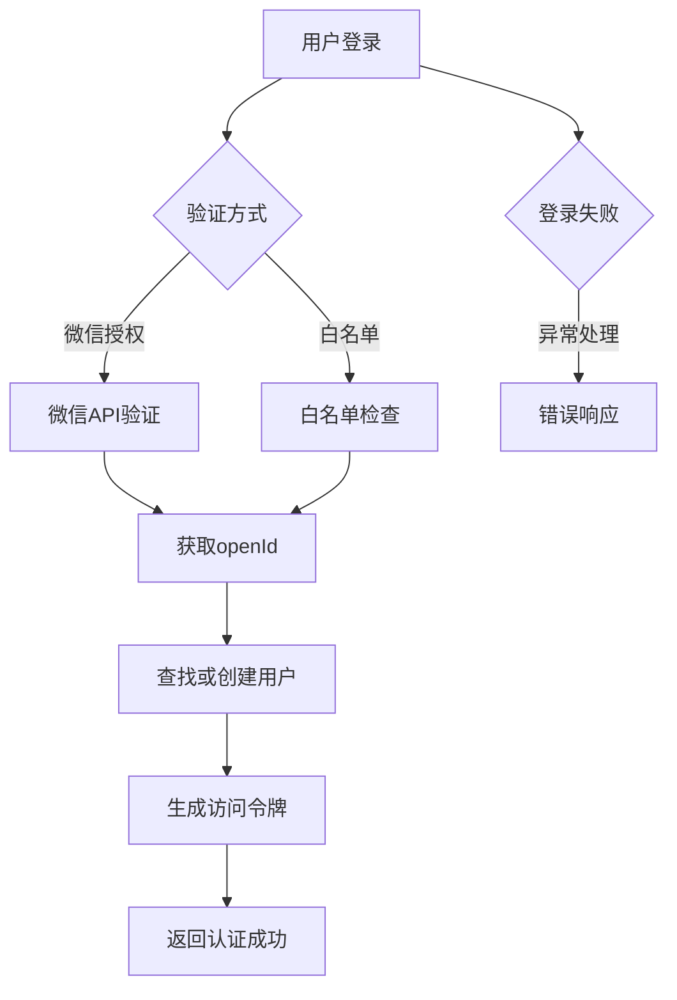

**图表来源**
- [login/index.js:13-56](file://uniCloud-aliyun/cloudfunctions/login/index.js#L13-L56)
- [const.js:19-24](file://uniCloud-aliyun/common/const.js#L19-L24)

### 权限验证机制

系统采用基于角色的访问控制(RBAC)：

| 角色 | 权限范围 | 可访问资源 |
|------|----------|-----------|
| child | 基础用户 | 个人信息、个人打卡、个人积分 |
| parent | 家长权限 | 子女信息、子女打卡、奖励兑换 |
| admin | 管理权限 | 所有数据、系统配置、用户管理 |

### 数据加密策略

1. **传输加密**: HTTPS/TLS协议
2. **存储加密**: 云数据库自动加密
3. **敏感数据**: 用户openId等进行脱敏处理
4. **会话安全**: JWT令牌过期机制

## 异步处理与并发控制

### 并发控制机制

```mermaid
sequenceDiagram
participant Client1 as 客户端1
participant Client2 as 客户端2
participant CloudFunc as 云函数
participant Database as 云数据库
Client1->>CloudFunc : 请求1
Client2->>CloudFunc : 请求2
par 并发执行
CloudFunc->>Database : 执行操作1
CloudFunc->>Database : 执行操作2
and
Database-->>CloudFunc : 操作1结果
Database-->>CloudFunc : 操作2结果
CloudFunc-->>Client1 : 结果1
CloudFunc-->>Client2 : 结果2
```

**图表来源**
- [checkin/index.js:14-20](file://uniCloud-aliyun/cloudfunctions/checkin/index.js#L14-L20)
- [syncOffline/index.js:19-28](file://uniCloud-aliyun/cloudfunctions/syncOffline/index.js#L19-L28)

### 事务处理策略

系统采用乐观锁和补偿机制处理并发冲突：

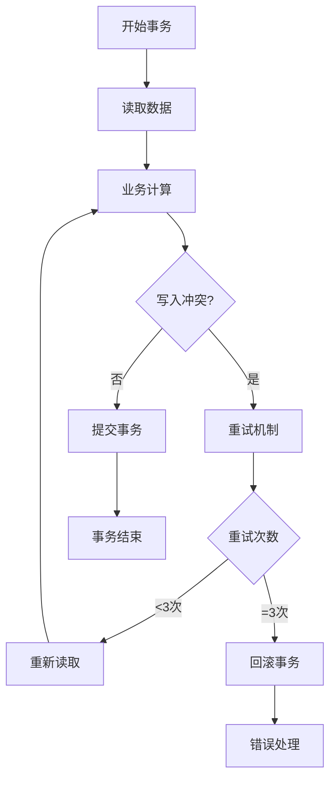

**图表来源**
- [syncOffline/index.js:19-57](file://uniCloud-aliyun/cloudfunctions/syncOffline/index.js#L19-L57)

### 冲突解决策略

1. **重复打卡检测**: 基于复合索引防止重复记录
2. **积分扣减保护**: 使用原子操作确保积分准确性
3. **库存管理**: 原子性更新避免超卖
4. **离线同步**: 冲突检测和合并策略

## 监控与日志

### 性能监控

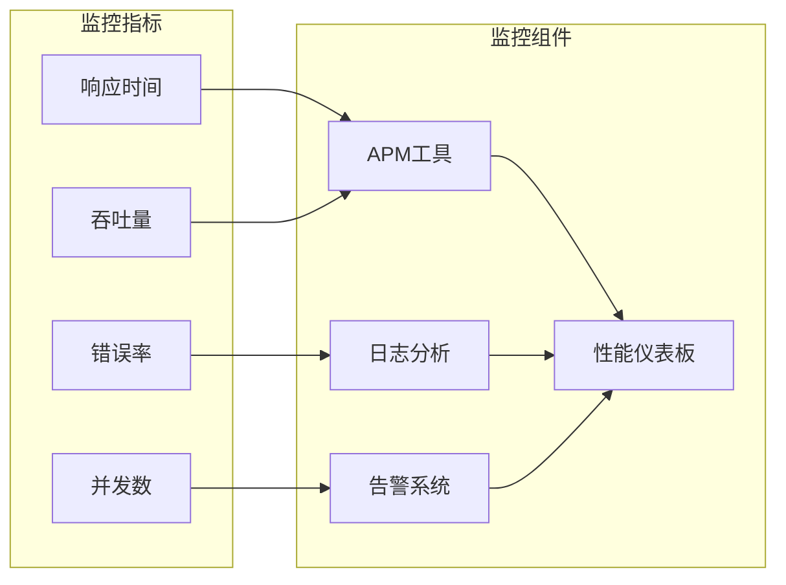

### 日志系统设计

系统采用多层级日志记录：

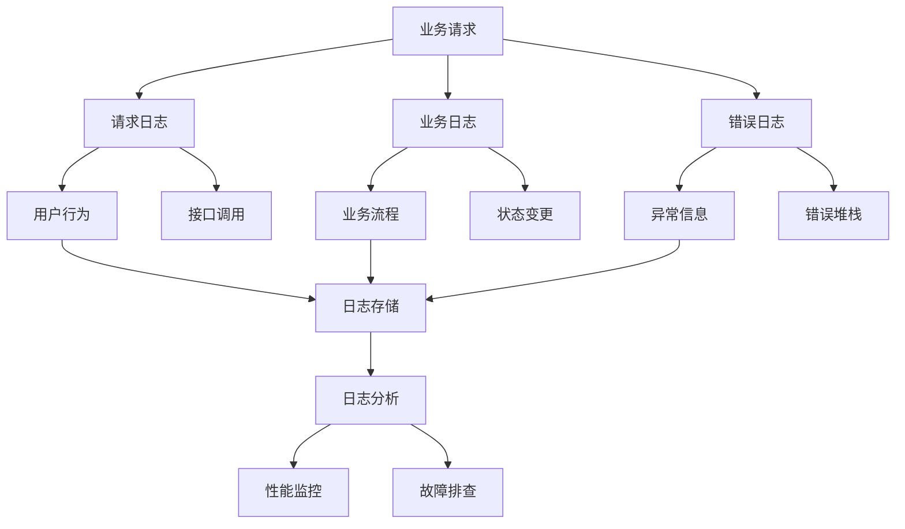

**图表来源**
- [login/index.js:44-46](file://uniCloud-aliyun/cloudfunctions/login/index.js#L44-L46)

## 部署与集成

### 部署架构

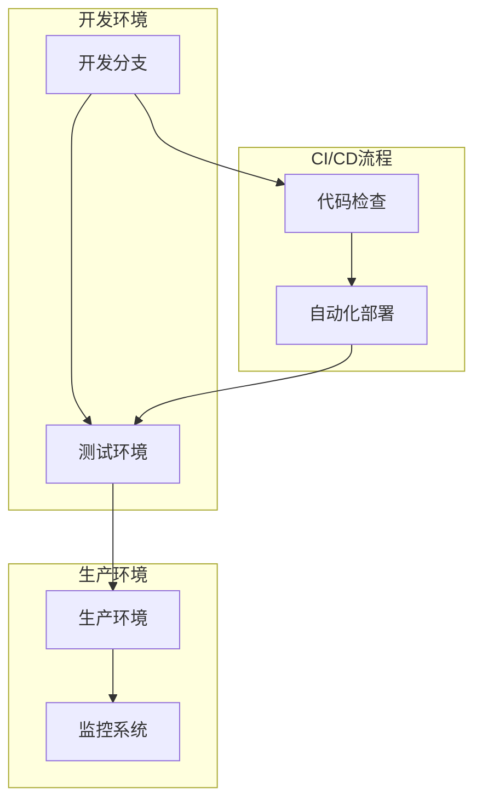

### 集成配置

项目使用uniCloud平台提供的统一配置管理：

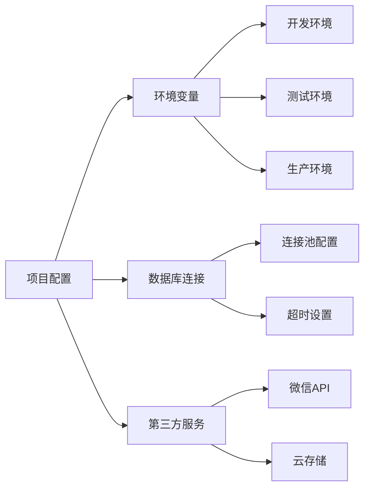

**图表来源**
- [package.json:1-74](file://package.json#L1-L74)

## 总结

Star Grow项目的后端架构基于uniCloud云开发平台构建，采用了现代化的微服务设计理念。通过合理的云函数分层、完善的数据模型设计和严格的安全控制机制，实现了高性能、可扩展的儿童成长管理平台。

### 核心优势

1. **高扩展性**: 基于云原生架构，支持弹性扩展
2. **高可用性**: 多层冗余设计，确保系统稳定性
3. **易维护性**: 模块化设计，便于功能迭代和维护
4. **安全性**: 多层次安全防护，保障用户数据安全

### 技术特色

- **无服务器架构**: 降低运维成本，提高资源利用率
- **实时数据处理**: 支持实时积分计算和勋章颁发
- **离线同步**: 完善的离线数据同步机制
- **智能推荐**: 基于用户行为的个性化建议

该架构设计充分考虑了教育应用场景的特殊需求，在保证系统稳定性的前提下，为用户提供流畅的使用体验。