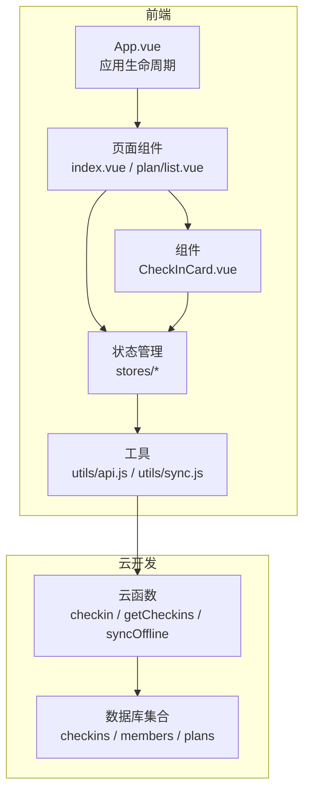
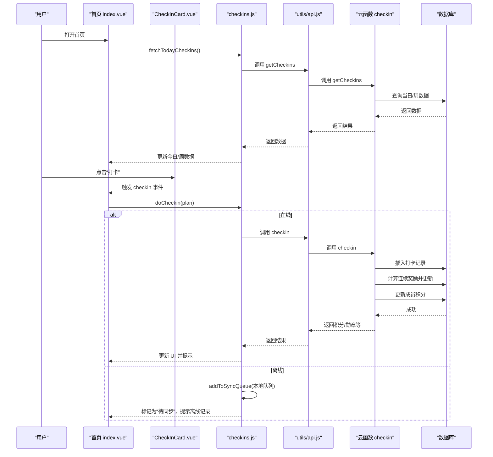
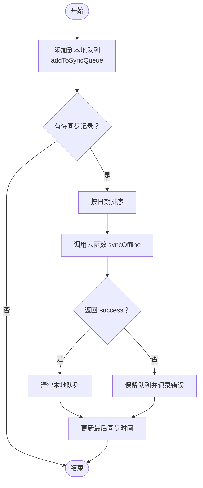
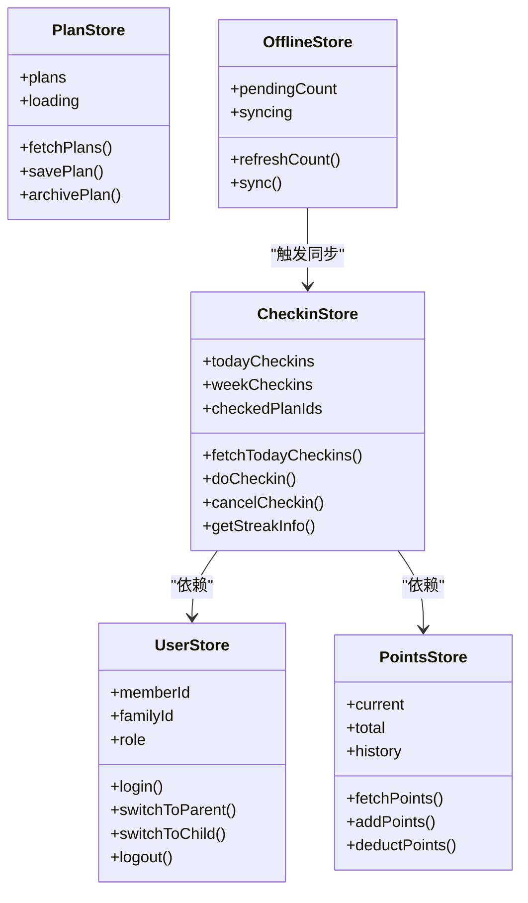
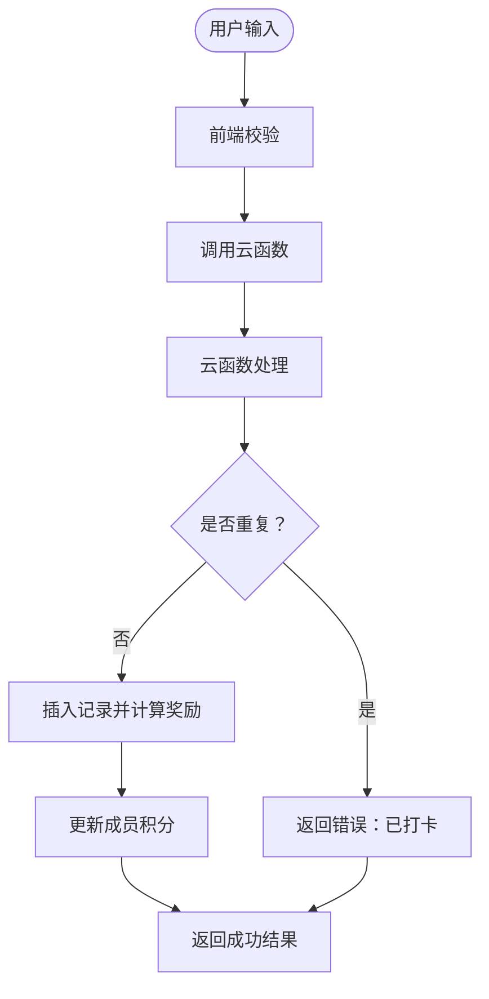
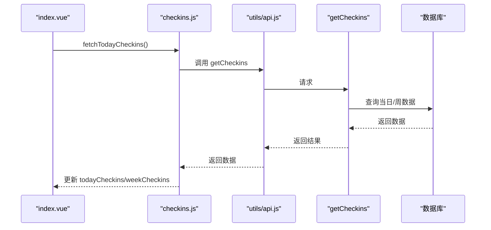
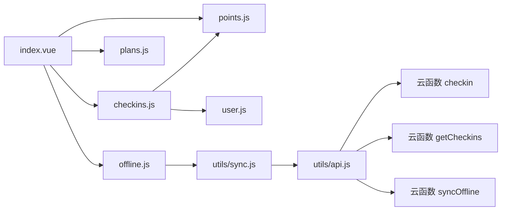

# 数据流设计

<cite>
**本文引用的文件**
- [src/main.js](file://src/main.js)
- [src/App.vue](file://src/App.vue)
- [src/utils/api.js](file://src/utils/api.js)
- [src/utils/sync.js](file://src/utils/sync.js)
- [src/stores/offline.js](file://src/stores/offline.js)
- [src/stores/checkins.js](file://src/stores/checkins.js)
- [src/stores/plans.js](file://src/stores/plans.js)
- [src/stores/points.js](file://src/stores/points.js)
- [src/stores/user.js](file://src/stores/user.js)
- [src/components/CheckInCard.vue](file://src/components/CheckInCard.vue)
- [src/pages/index/index.vue](file://src/pages/index/index.vue)
- [src/pages/plan/list.vue](file://src/pages/plan/list.vue)
- [src/cloudfunctions/syncOffline/index.js](file://src/cloudfunctions/syncOffline/index.js)
- [uniCloud-aliyun/cloudfunctions/checkin/index.js](file://uniCloud-aliyun/cloudfunctions/checkin/index.js)
- [uniCloud-aliyun/cloudfunctions/getCheckins/index.js](file://uniCloud-aliyun/cloudfunctions/getCheckins/index.js)
</cite>

## 目录
1. [简介](#简介)
2. [项目结构](#项目结构)
3. [核心组件](#核心组件)
4. [架构总览](#架构总览)
5. [详细组件分析](#详细组件分析)
6. [依赖关系分析](#依赖关系分析)
7. [性能考量](#性能考量)
8. [故障排查指南](#故障排查指南)
9. [结论](#结论)
10. [附录](#附录)

## 简介
本文件为 Star Grow 项目的数据流设计文档，聚焦于从用户操作到数据持久化的完整链路，覆盖以下主题：
- 前端状态更新与 Store 协作机制
- API 调用与云函数处理
- 离线数据同步策略（本地缓存、批量同步、冲突处理）
- 数据验证与转换流程（输入校验、格式化、错误处理）
- 实时数据更新机制（状态推送至 UI 的流程）
- 数据一致性保障（幂等、冲突处理）
- 数据备份与恢复（增量同步与全量恢复思路）
- 数据流与时序图，直观展示数据在系统中的流转

## 项目结构
项目采用“前端应用 + 云开发 + 云函数”的三层架构：
- 前端层：基于 Vue 3 + Pinia 的小程序应用，负责用户界面与状态管理
- 云开发层：通过 uniCloud 调用云函数，提供统一后端服务
- 数据存储层：云数据库集合（如 checkins、members、plans 等）

**图表来源**
- [src/App.vue:1-64](file://src/App.vue#L1-L64)
- [src/pages/index/index.vue:1-204](file://src/pages/index/index.vue#L1-L204)
- [src/pages/plan/list.vue:1-133](file://src/pages/plan/list.vue#L1-L133)
- [src/components/CheckInCard.vue:1-67](file://src/components/CheckInCard.vue#L1-L67)
- [src/stores/checkins.js:1-163](file://src/stores/checkins.js#L1-L163)
- [src/stores/plans.js:1-73](file://src/stores/plans.js#L1-L73)
- [src/stores/points.js:1-44](file://src/stores/points.js#L1-L44)
- [src/stores/user.js:1-119](file://src/stores/user.js#L1-L119)
- [src/utils/api.js:1-18](file://src/utils/api.js#L1-L18)
- [src/utils/sync.js:1-96](file://src/utils/sync.js#L1-L96)
- [uniCloud-aliyun/cloudfunctions/checkin/index.js:1-83](file://uniCloud-aliyun/cloudfunctions/checkin/index.js#L1-L83)
- [uniCloud-aliyun/cloudfunctions/getCheckins/index.js:1-19](file://uniCloud-aliyun/cloudfunctions/getCheckins/index.js#L1-L19)
- [src/cloudfunctions/syncOffline/index.js:1-20](file://src/cloudfunctions/syncOffline/index.js#L1-L20)

**章节来源**
- [src/main.js:1-11](file://src/main.js#L1-L11)
- [src/App.vue:1-64](file://src/App.vue#L1-L64)

## 核心组件
- 应用入口与初始化：创建应用实例与 Pinia，并在启动时初始化云开发能力
- 页面与组件：首页负责今日任务与打卡入口；计划列表负责计划 CRUD
- 状态管理：用户、计划、积分、打卡、离线队列五个 Store 协同工作
- 工具模块：API 封装与离线同步工具，提供统一的云函数调用与本地队列管理
- 云函数：提供 checkin、getCheckins、syncOffline 等后端能力

**章节来源**
- [src/main.js:1-11](file://src/main.js#L1-L11)
- [src/App.vue:1-64](file://src/App.vue#L1-L64)
- [src/pages/index/index.vue:1-204](file://src/pages/index/index.vue#L1-L204)
- [src/pages/plan/list.vue:1-133](file://src/pages/plan/list.vue#L1-L133)
- [src/stores/user.js:1-119](file://src/stores/user.js#L1-L119)
- [src/stores/plans.js:1-73](file://src/stores/plans.js#L1-L73)
- [src/stores/points.js:1-44](file://src/stores/points.js#L1-L44)
- [src/stores/checkins.js:1-163](file://src/stores/checkins.js#L1-L163)
- [src/stores/offline.js:1-30](file://src/stores/offline.js#L1-L30)
- [src/utils/api.js:1-18](file://src/utils/api.js#L1-L18)
- [src/utils/sync.js:1-96](file://src/utils/sync.js#L1-L96)
- [uniCloud-aliyun/cloudfunctions/checkin/index.js:1-83](file://uniCloud-aliyun/cloudfunctions/checkin/index.js#L1-L83)
- [uniCloud-aliyun/cloudfunctions/getCheckins/index.js:1-19](file://uniCloud-aliyun/cloudfunctions/getCheckins/index.js#L1-L19)
- [src/cloudfunctions/syncOffline/index.js:1-20](file://src/cloudfunctions/syncOffline/index.js#L1-L20)

## 架构总览
下图展示了从用户点击“打卡”到数据落库的完整数据流，包括离线优先与云端幂等处理。

**图表来源**
- [src/pages/index/index.vue:127-136](file://src/pages/index/index.vue#L127-L136)
- [src/components/CheckInCard.vue:36-42](file://src/components/CheckInCard.vue#L36-L42)
- [src/stores/checkins.js:26-89](file://src/stores/checkins.js#L26-L89)
- [src/utils/api.js:9-17](file://src/utils/api.js#L9-L17)
- [uniCloud-aliyun/cloudfunctions/checkin/index.js:5-82](file://uniCloud-aliyun/cloudfunctions/checkin/index.js#L5-L82)
- [uniCloud-aliyun/cloudfunctions/getCheckins/index.js:4-18](file://uniCloud-aliyun/cloudfunctions/getCheckins/index.js#L4-L18)

## 详细组件分析

### 离线数据同步机制
- 本地缓存策略：使用本地存储维护当日打卡缓存与待同步队列
- 批量同步处理：按日期排序后一次性提交到云函数，减少请求次数
- 冲突解决算法：云端以“同计划+同日期”为维度进行查重，避免重复写入（幂等设计）

**图表来源**
- [src/utils/sync.js:13-53](file://src/utils/sync.js#L13-L53)
- [src/stores/offline.js:14-26](file://src/stores/offline.js#L14-L26)
- [src/cloudfunctions/syncOffline/index.js:4-19](file://src/cloudfunctions/syncOffline/index.js#L4-L19)

**章节来源**
- [src/utils/sync.js:1-96](file://src/utils/sync.js#L1-L96)
- [src/stores/offline.js:1-30](file://src/stores/offline.js#L1-L30)
- [src/cloudfunctions/syncOffline/index.js:1-20](file://src/cloudfunctions/syncOffline/index.js#L1-L20)

### 状态管理的数据流设计（Store Actions/Mutations/Getters）
- 用户状态（user.js）：登录、角色切换、家长密码设置与校验
- 计划状态（plans.js）：加载、保存、归档，带本地缓存
- 积分状态（points.js）：读取、累计、扣减、历史记录
- 打卡状态（checkins.js）：今日/周查询、打卡、撤销、连续天数计算
- 离线状态（offline.js）：待同步计数、同步开关、触发同步

**图表来源**
- [src/stores/user.js:1-119](file://src/stores/user.js#L1-L119)
- [src/stores/plans.js:1-73](file://src/stores/plans.js#L1-L73)
- [src/stores/points.js:1-44](file://src/stores/points.js#L1-L44)
- [src/stores/checkins.js:1-163](file://src/stores/checkins.js#L1-L163)
- [src/stores/offline.js:1-30](file://src/stores/offline.js#L1-L30)

**章节来源**
- [src/stores/user.js:1-119](file://src/stores/user.js#L1-L119)
- [src/stores/plans.js:1-73](file://src/stores/plans.js#L1-L73)
- [src/stores/points.js:1-44](file://src/stores/points.js#L1-L44)
- [src/stores/checkins.js:1-163](file://src/stores/checkins.js#L1-L163)
- [src/stores/offline.js:1-30](file://src/stores/offline.js#L1-L30)

### 数据验证与转换流程
- 输入校验：前端组件对用户输入进行简单校验（如点击防抖），云函数对重复打卡进行查重
- 数据格式化：统一日期格式（YYYY-MM-DD）、积分累加、连续天数计算
- 错误处理：统一捕获异常，返回结构化错误信息，前端提示用户

**图表来源**
- [src/components/CheckInCard.vue:36-42](file://src/components/CheckInCard.vue#L36-L42)
- [src/stores/checkins.js:26-89](file://src/stores/checkins.js#L26-L89)
- [uniCloud-aliyun/cloudfunctions/checkin/index.js:14-20](file://uniCloud-aliyun/cloudfunctions/checkin/index.js#L14-L20)

**章节来源**
- [src/stores/checkins.js:14-24](file://src/stores/checkins.js#L14-L24)
- [uniCloud-aliyun/cloudfunctions/checkin/index.js:14-20](file://uniCloud-aliyun/cloudfunctions/checkin/index.js#L14-L20)

### 实时数据更新机制
- 首页加载：进入页面时拉取当日/周打卡数据，计算连续天数
- 离线提示：后台回到前台时检查待同步数量，引导用户手动同步
- 状态推送：Store 更新后，页面组件自动响应并刷新 UI

**图表来源**
- [src/pages/index/index.vue:109-125](file://src/pages/index/index.vue#L109-L125)
- [src/stores/checkins.js:14-24](file://src/stores/checkins.js#L14-L24)
- [uniCloud-aliyun/cloudfunctions/getCheckins/index.js:4-18](file://uniCloud-aliyun/cloudfunctions/getCheckins/index.js#L4-L18)

**章节来源**
- [src/pages/index/index.vue:101-125](file://src/pages/index/index.vue#L101-L125)
- [src/App.vue:21-27](file://src/App.vue#L21-L27)

### 数据一致性保证机制
- 幂等性：云函数以“计划+日期+儿童”为键进行查重，避免重复写入
- 乐观更新：前端先更新本地状态，再等待云端确认；离线场景标记“待同步”
- 版本控制：当前未实现显式版本号字段，建议后续引入版本号或时间戳字段用于冲突检测

**章节来源**
- [src/stores/checkins.js:78-88](file://src/stores/checkins.js#L78-L88)
- [uniCloud-aliyun/cloudfunctions/checkin/index.js:14-20](file://uniCloud-aliyun/cloudfunctions/checkin/index.js#L14-L20)

### 数据备份与恢复机制
- 增量同步：通过本地队列与最后同步时间，仅同步未上传记录
- 全量恢复：可基于 getCheckins 云函数拉取指定时间段内的完整数据，重建本地缓存
- 建议：未来可引入“最近一次全量导出时间”与“差异补丁”机制，提升恢复效率

**章节来源**
- [src/utils/sync.js:25-53](file://src/utils/sync.js#L25-L53)
- [uniCloud-aliyun/cloudfunctions/getCheckins/index.js:4-18](file://uniCloud-aliyun/cloudfunctions/getCheckins/index.js#L4-L18)

## 依赖关系分析
- 组件依赖：页面组件依赖多个 Store；组件内部通过事件与页面交互
- Store 依赖：checkins 依赖 user 与 points；offline 依赖 sync 工具
- 云函数依赖：checkin 依赖数据库与勋章引擎；getCheckins 提供查询接口；syncOffline 负责批量写入

**图表来源**
- [src/pages/index/index.vue:65-79](file://src/pages/index/index.vue#L65-L79)
- [src/stores/checkins.js:1-163](file://src/stores/checkins.js#L1-L163)
- [src/stores/plans.js:1-73](file://src/stores/plans.js#L1-L73)
- [src/stores/points.js:1-44](file://src/stores/points.js#L1-L44)
- [src/stores/offline.js:1-30](file://src/stores/offline.js#L1-L30)
- [src/utils/sync.js:1-96](file://src/utils/sync.js#L1-L96)
- [src/utils/api.js:1-18](file://src/utils/api.js#L1-L18)
- [uniCloud-aliyun/cloudfunctions/checkin/index.js:1-83](file://uniCloud-aliyun/cloudfunctions/checkin/index.js#L1-L83)
- [uniCloud-aliyun/cloudfunctions/getCheckins/index.js:1-19](file://uniCloud-aliyun/cloudfunctions/getCheckins/index.js#L1-L19)
- [src/cloudfunctions/syncOffline/index.js:1-20](file://src/cloudfunctions/syncOffline/index.js#L1-L20)

**章节来源**
- [src/pages/index/index.vue:65-79](file://src/pages/index/index.vue#L65-L79)
- [src/stores/checkins.js:1-163](file://src/stores/checkins.js#L1-L163)
- [src/stores/offline.js:1-30](file://src/stores/offline.js#L1-L30)
- [src/utils/sync.js:1-96](file://src/utils/sync.js#L1-L96)
- [src/utils/api.js:1-18](file://src/utils/api.js#L1-L18)
- [uniCloud-aliyun/cloudfunctions/checkin/index.js:1-83](file://uniCloud-aliyun/cloudfunctions/checkin/index.js#L1-L83)
- [uniCloud-aliyun/cloudfunctions/getCheckins/index.js:1-19](file://uniCloud-aliyun/cloudfunctions/getCheckins/index.js#L1-L19)
- [src/cloudfunctions/syncOffline/index.js:1-20](file://src/cloudfunctions/syncOffline/index.js#L1-L20)

## 性能考量
- 减少网络请求：批量同步、本地缓存、本地乐观更新
- 降低数据库压力：查重与幂等写入，避免重复索引扫描
- 前端渲染优化：组件级状态最小化更新，计算属性复用
- 网络感知：智能同步仅在网络可用时执行

[本节为通用指导，无需特定文件引用]

## 故障排查指南
- 云函数调用失败：检查云函数名称与参数，查看返回的错误信息
- 离线无法同步：确认网络状态、待同步队列长度、最后同步时间
- 重复打卡：确认查重逻辑是否生效，检查日期与计划 ID
- 积分不一致：核对云端更新与本地缓存，必要时触发全量拉取

**章节来源**
- [src/utils/api.js:9-17](file://src/utils/api.js#L9-L17)
- [src/utils/sync.js:84-95](file://src/utils/sync.js#L84-L95)
- [uniCloud-aliyun/cloudfunctions/checkin/index.js:14-20](file://uniCloud-aliyun/cloudfunctions/checkin/index.js#L14-L20)

## 结论
本设计通过“前端 Store + 本地缓存 + 云函数幂等写入”的组合，实现了高可用、低延迟的数据流。离线优先策略确保弱网场景下的用户体验，批量同步与智能同步进一步提升了性能与可靠性。建议后续引入版本控制与增量导出机制，以增强数据一致性与恢复能力。

[本节为总结，无需特定文件引用]

## 附录
- 关键流程路径参考
  - 打卡主流程：[src/pages/index/index.vue:127-136](file://src/pages/index/index.vue#L127-L136) → [src/stores/checkins.js:26-89](file://src/stores/checkins.js#L26-L89) → [uniCloud-aliyun/cloudfunctions/checkin/index.js:5-82](file://uniCloud-aliyun/cloudfunctions/checkin/index.js#L5-L82)
  - 离线同步：[src/utils/sync.js:25-53](file://src/utils/sync.js#L25-L53) → [src/cloudfunctions/syncOffline/index.js:4-19](file://src/cloudfunctions/syncOffline/index.js#L4-L19)
  - 数据查询：[uniCloud-aliyun/cloudfunctions/getCheckins/index.js:4-18](file://uniCloud-aliyun/cloudfunctions/getCheckins/index.js#L4-L18)

[本节为补充说明，无需特定文件引用]