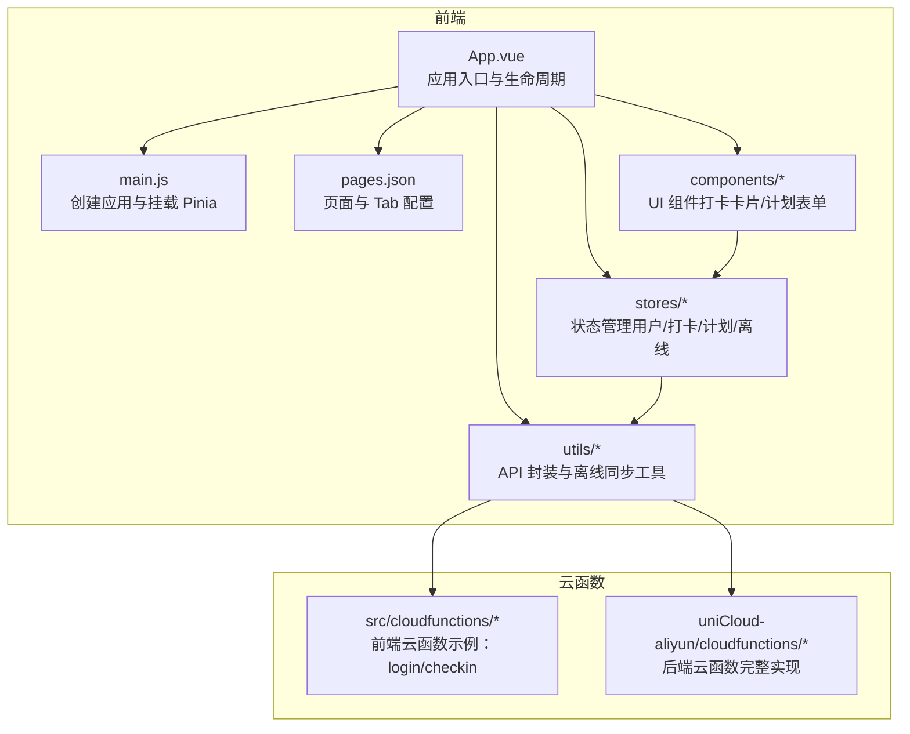
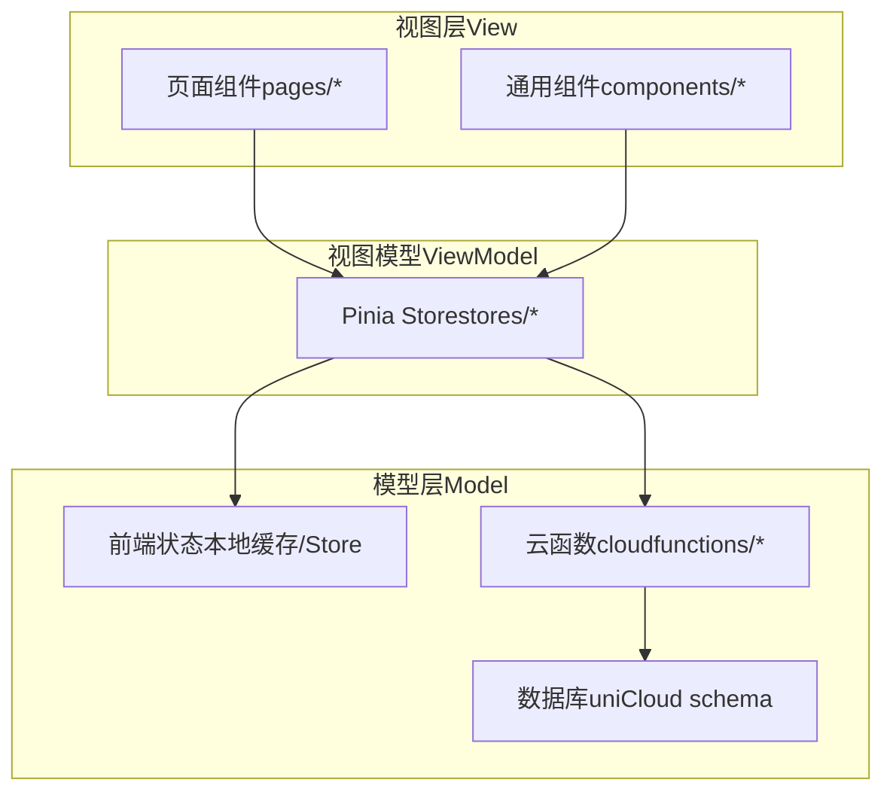
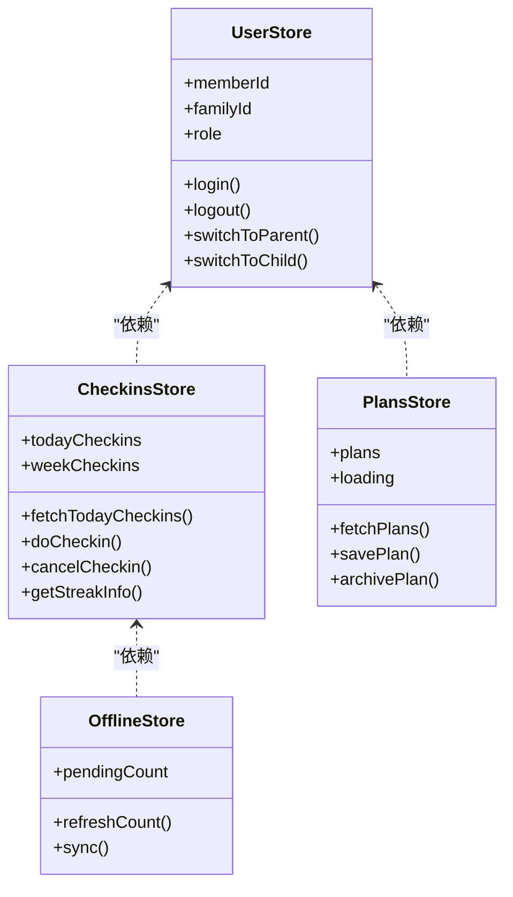
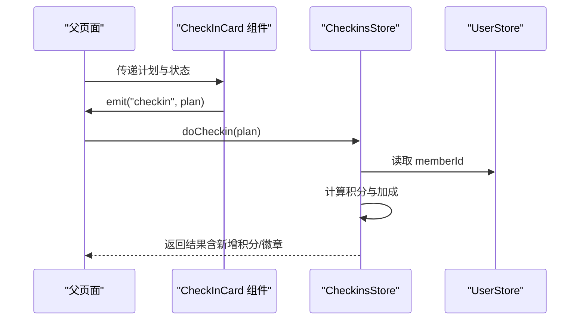
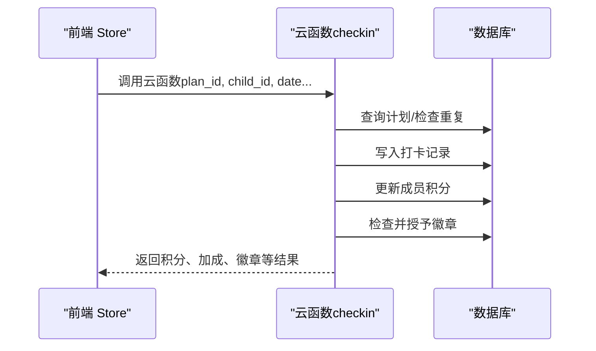
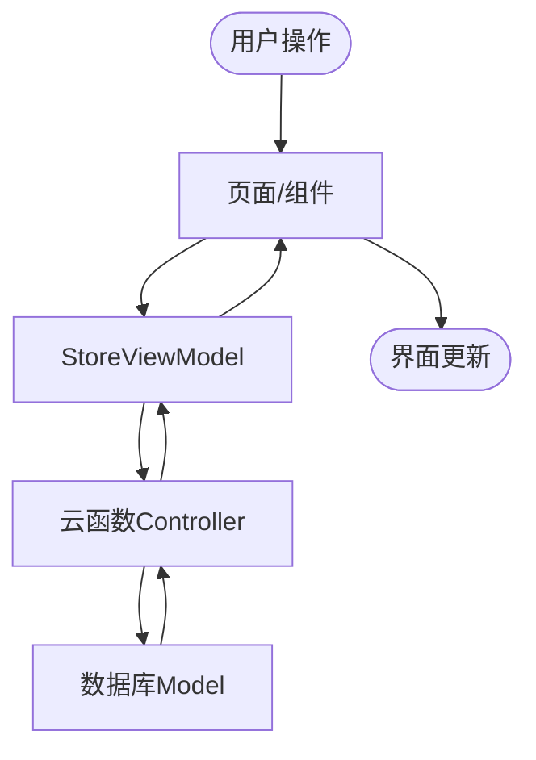
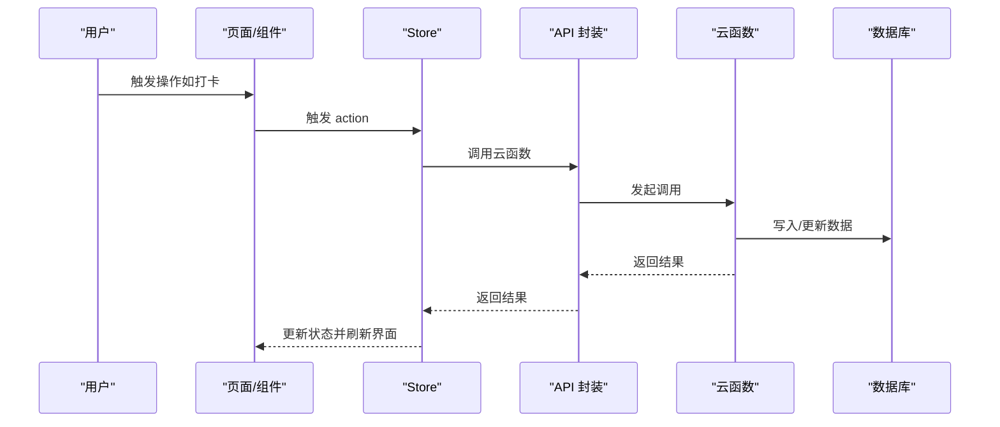
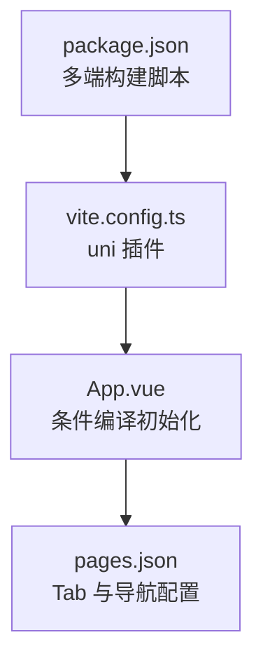
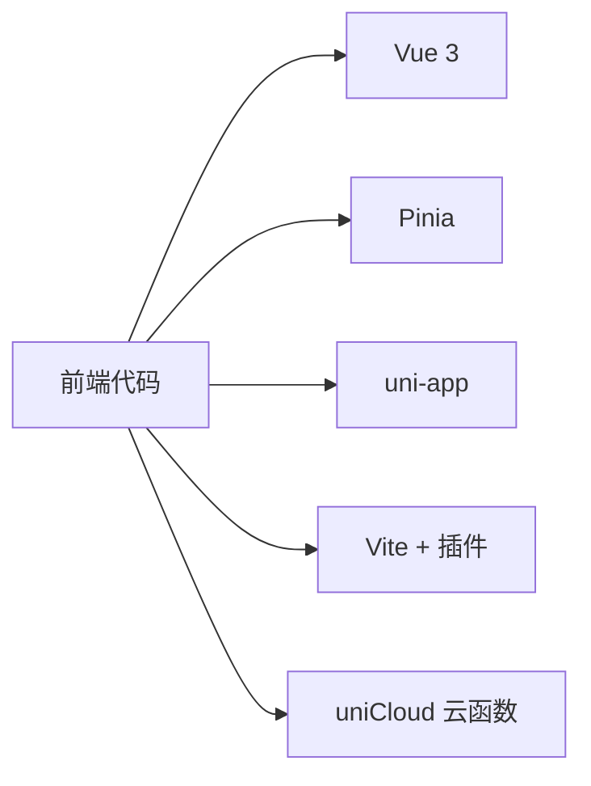

# 架构设计

<cite>
**本文引用的文件**
- [src/main.js](file://src/main.js)
- [src/App.vue](file://src/App.vue)
- [src/pages.json](file://src/pages.json)
- [package.json](file://package.json)
- [vite.config.ts](file://vite.config.ts)
- [src/stores/user.js](file://src/stores/user.js)
- [src/stores/checkins.js](file://src/stores/checkins.js)
- [src/stores/plans.js](file://src/stores/plans.js)
- [src/stores/offline.js](file://src/stores/offline.js)
- [src/utils/api.js](file://src/utils/api.js)
- [src/utils/sync.js](file://src/utils/sync.js)
- [src/cloudfunctions/login/index.js](file://src/cloudfunctions/login/index.js)
- [src/cloudfunctions/checkin/index.js](file://src/cloudfunctions/checkin/index.js)
- [src/components/CheckInCard.vue](file://src/components/CheckInCard.vue)
- [src/components/PlanForm.vue](file://src/components/PlanForm.vue)
</cite>

## 目录
1. [引言](#引言)
2. [项目结构](#项目结构)
3. [核心组件](#核心组件)
4. [架构总览](#架构总览)
5. [详细组件分析](#详细组件分析)
6. [依赖分析](#依赖分析)
7. [性能考虑](#性能考虑)
8. [故障排查指南](#故障排查指南)
9. [结论](#结论)
10. [附录](#附录)

## 引言
本项目采用 MVVM 架构与组件化设计，结合 Vue 3 Composition API 与 Pinia 状态管理，构建跨端应用。前端通过 uni-app 支持多平台运行，后端基于 uniCloud 云开发提供云函数与数据库服务。系统强调“先本地、后云端”的离线优先策略，确保在网络不稳定场景下仍可流畅使用，并在后台自动进行离线数据同步。

## 项目结构
项目采用按功能域划分的目录组织方式：
- 前端层：src 下包含页面、组件、状态管理、工具与静态资源
- 云函数层：src/cloudfunctions 与 uniCloud-aliyun/cloudfunctions 分别对应前端与后端云函数（阿里云版）
- 数据模型与校验：uniCloud-aliyun/database 下的 schema 定义
- 构建与运行：package.json、vite.config.ts、manifest.json、pages.json 等

**图表来源**
- [src/App.vue:1-64](file://src/App.vue#L1-L64)
- [src/main.js:1-11](file://src/main.js#L1-L11)
- [src/pages.json:1-56](file://src/pages.json#L1-L56)
- [src/stores/user.js:1-119](file://src/stores/user.js#L1-L119)
- [src/stores/checkins.js:1-163](file://src/stores/checkins.js#L1-L163)
- [src/stores/plans.js:1-73](file://src/stores/plans.js#L1-L73)
- [src/stores/offline.js:1-30](file://src/stores/offline.js#L1-L30)
- [src/utils/api.js:1-18](file://src/utils/api.js#L1-L18)
- [src/utils/sync.js:1-96](file://src/utils/sync.js#L1-L96)
- [src/cloudfunctions/login/index.js:1-13](file://src/cloudfunctions/login/index.js#L1-L13)
- [src/cloudfunctions/checkin/index.js:1-142](file://src/cloudfunctions/checkin/index.js#L1-L142)

**章节来源**
- [src/main.js:1-11](file://src/main.js#L1-L11)
- [src/App.vue:1-64](file://src/App.vue#L1-L64)
- [src/pages.json:1-56](file://src/pages.json#L1-L56)
- [package.json:1-74](file://package.json#L1-L74)
- [vite.config.ts:1-8](file://vite.config.ts#L1-L8)

## 核心组件
- 应用入口与生命周期：在应用启动时初始化云能力、在前台显示时触发离线同步
- 状态管理：用户、打卡、计划、离线队列四个核心 Store，统一管理业务状态与持久化
- 组件：打卡卡片与计划表单等 UI 组件，负责视图渲染与事件分发
- 工具：API 封装与离线同步工具，屏蔽云函数调用细节与离线策略

**章节来源**
- [src/App.vue:5-27](file://src/App.vue#L5-L27)
- [src/stores/user.js:7-119](file://src/stores/user.js#L7-L119)
- [src/stores/checkins.js:9-163](file://src/stores/checkins.js#L9-L163)
- [src/stores/plans.js:9-73](file://src/stores/plans.js#L9-L73)
- [src/stores/offline.js:6-30](file://src/stores/offline.js#L6-L30)
- [src/utils/api.js:9-18](file://src/utils/api.js#L9-L18)
- [src/utils/sync.js:13-96](file://src/utils/sync.js#L13-L96)

## 架构总览
系统遵循 MVVM 分离原则：
- Model（模型）：由 Pinia Store 与云函数共同承载，Store 负责前端状态与缓存，云函数负责后端数据持久化与业务规则
- View（视图）：Vue 页面与组件，负责展示与交互
- ViewModel（视图模型）：通过 Composition API 与 Store 的响应式状态驱动视图更新

**图表来源**
- [src/stores/user.js:7-119](file://src/stores/user.js#L7-L119)
- [src/stores/checkins.js:9-163](file://src/stores/checkins.js#L9-L163)
- [src/stores/plans.js:9-73](file://src/stores/plans.js#L9-L73)
- [src/stores/offline.js:6-30](file://src/stores/offline.js#L6-L30)
- [src/utils/api.js:9-18](file://src/utils/api.js#L9-L18)
- [src/cloudfunctions/checkin/index.js:12-83](file://src/cloudfunctions/checkin/index.js#L12-L83)

## 详细组件分析

### 前端架构与 MVVM 实践
- Vue 3 Composition API：在页面与组件中使用 setup 语法与响应式 API，实现逻辑复用与清晰的数据流
- Pinia 状态管理：以 Store 形式集中管理用户、打卡、计划、离线等状态，提供持久化与派生状态
- 组件通信：通过 props 与 emits 实现父子通信；通过 Store 在任意层级共享状态

**图表来源**
- [src/stores/user.js:7-119](file://src/stores/user.js#L7-L119)
- [src/stores/checkins.js:9-163](file://src/stores/checkins.js#L9-L163)
- [src/stores/plans.js:9-73](file://src/stores/plans.js#L9-L73)
- [src/stores/offline.js:6-30](file://src/stores/offline.js#L6-L30)

**章节来源**
- [src/stores/user.js:7-119](file://src/stores/user.js#L7-L119)
- [src/stores/checkins.js:9-163](file://src/stores/checkins.js#L9-L163)
- [src/stores/plans.js:9-73](file://src/stores/plans.js#L9-L73)
- [src/stores/offline.js:6-30](file://src/stores/offline.js#L6-L30)

### 组件间通信机制
- 父子组件：通过 props 接收数据，通过 emits 触发事件
- 跨层级：通过 Pinia Store 共享状态，避免层层传参
- 示例组件：
  - 打卡卡片组件：根据计划信息渲染，点击时向父级发出 checkin/unclick 事件
  - 计划表单组件：收集用户输入，校验后向父级发出 submit 事件

**图表来源**
- [src/components/CheckInCard.vue:20-43](file://src/components/CheckInCard.vue#L20-L43)
- [src/stores/checkins.js:26-89](file://src/stores/checkins.js#L26-L89)
- [src/stores/user.js:8-14](file://src/stores/user.js#L8-L14)

**章节来源**
- [src/components/CheckInCard.vue:20-43](file://src/components/CheckInCard.vue#L20-L43)
- [src/components/PlanForm.vue:52-89](file://src/components/PlanForm.vue#L52-L89)

### 后端架构与云函数组织
- 云函数职责分离：登录、打卡、计划、积分、奖励、周报等按功能拆分
- 业务规则内聚：如打卡云函数内包含连续打卡加成、徽章判定等规则
- 数据一致性：通过数据库命令与事务特性保证写入一致性

**图表来源**
- [src/stores/checkins.js:40-78](file://src/stores/checkins.js#L40-L78)
- [src/cloudfunctions/checkin/index.js:12-83](file://src/cloudfunctions/checkin/index.js#L12-L83)

**章节来源**
- [src/cloudfunctions/login/index.js:4-12](file://src/cloudfunctions/login/index.js#L4-L12)
- [src/cloudfunctions/checkin/index.js:12-83](file://src/cloudfunctions/checkin/index.js#L12-L83)

### MVC 分离原则的具体实现
- Model（数据模型）：Store 中的状态与持久化、云函数中的业务规则与数据库访问
- View（页面组件）：页面与组件负责渲染与交互
- Controller（云函数）：作为控制器处理请求、编排业务逻辑、调用数据库

**图表来源**
- [src/stores/checkins.js:9-163](file://src/stores/checkins.js#L9-L163)
- [src/utils/api.js:9-18](file://src/utils/api.js#L9-L18)
- [src/cloudfunctions/checkin/index.js:12-83](file://src/cloudfunctions/checkin/index.js#L12-L83)

**章节来源**
- [src/stores/checkins.js:9-163](file://src/stores/checkins.js#L9-L163)
- [src/utils/api.js:9-18](file://src/utils/api.js#L9-L18)
- [src/cloudfunctions/checkin/index.js:12-83](file://src/cloudfunctions/checkin/index.js#L12-L83)

### 数据流向与状态管理机制
- 用户操作到数据持久化的完整流程：
  1) 页面组件触发事件
  2) Store 响应并调用云函数封装器
  3) 云函数执行业务逻辑并写入数据库
  4) Store 更新本地状态与缓存
  5) 离线场景下，先写入本地队列，再在合适时机批量同步

**图表来源**
- [src/stores/checkins.js:26-89](file://src/stores/checkins.js#L26-L89)
- [src/utils/api.js:9-18](file://src/utils/api.js#L9-L18)
- [src/cloudfunctions/checkin/index.js:12-83](file://src/cloudfunctions/checkin/index.js#L12-L83)

**章节来源**
- [src/stores/checkins.js:26-89](file://src/stores/checkins.js#L26-L89)
- [src/utils/api.js:9-18](file://src/utils/api.js#L9-L18)
- [src/utils/sync.js:25-53](file://src/utils/sync.js#L25-L53)

### 跨端兼容性与多平台适配
- 构建与运行：通过 uni-app 与 vite 插件支持多端构建，脚本覆盖 H5、微信小程序、支付宝小程序等
- 条件编译：在应用入口对特定平台（如微信小程序）进行条件初始化
- UI 适配：通过全局样式与组件样式适配不同平台的导航栏与 Tab 样式

**图表来源**
- [package.json:4-37](file://package.json#L4-L37)
- [vite.config.ts:1-8](file://vite.config.ts#L1-L8)
- [src/App.vue:8-18](file://src/App.vue#L8-L18)
- [src/pages.json:23-54](file://src/pages.json#L23-L54)

**章节来源**
- [package.json:4-37](file://package.json#L4-L37)
- [vite.config.ts:1-8](file://vite.config.ts#L1-L8)
- [src/App.vue:8-18](file://src/App.vue#L8-L18)
- [src/pages.json:23-54](file://src/pages.json#L23-L54)

## 依赖分析
- 前端依赖：Vue 3、Pinia、uni-app 生态、uView Plus 等
- 构建工具：Vite + @dcloudio/vite-plugin-uni
- 云开发：uniCloud 提供云函数与数据库能力

**图表来源**
- [package.json:39-59](file://package.json#L39-L59)
- [vite.config.ts:1-8](file://vite.config.ts#L1-L8)
- [src/main.js:1-11](file://src/main.js#L1-L11)

**章节来源**
- [package.json:39-59](file://package.json#L39-L59)
- [vite.config.ts:1-8](file://vite.config.ts#L1-L8)
- [src/main.js:1-11](file://src/main.js#L1-L11)

## 性能考虑
- 响应式与组合式 API：减少样板代码，提升渲染与更新效率
- 离线优先与智能同步：降低网络依赖，提升用户体验
- 本地缓存与持久化：减少重复请求，提高首屏与弱网体验
- 组件拆分与按需加载：通过页面路由与组件拆分控制初始包体

## 故障排查指南
- 云函数调用失败：检查云函数返回结构与错误日志，确认参数与权限
- 离线同步异常：查看本地队列长度与网络状态，确认批量同步结果
- 登录状态异常：核对用户 Store 的持久化键值与切换角色逻辑

**章节来源**
- [src/utils/api.js:9-18](file://src/utils/api.js#L9-L18)
- [src/utils/sync.js:25-53](file://src/utils/sync.js#L25-L53)
- [src/stores/user.js:67-95](file://src/stores/user.js#L67-L95)

## 结论
本项目以 MVVM 为核心，结合 Vue 3 Composition API 与 Pinia，实现了清晰的视图、视图模型与模型分层。通过 uni-app 与 uniCloud 的组合，既满足了跨端需求，又充分利用了云函数与数据库的能力。离线优先策略与智能同步机制有效提升了在弱网与离线场景下的可用性。建议后续完善云函数的鉴权与校验、补充数据库索引与约束，并持续优化组件与 Store 的边界划分。

## 附录
- 关键流程参考路径：
  - [src/stores/checkins.js:26-89](file://src/stores/checkins.js#L26-L89)
  - [src/utils/sync.js:25-53](file://src/utils/sync.js#L25-L53)
  - [src/cloudfunctions/checkin/index.js:12-83](file://src/cloudfunctions/checkin/index.js#L12-L83)
- 组件参考路径：
  - [src/components/CheckInCard.vue:20-43](file://src/components/CheckInCard.vue#L20-L43)
  - [src/components/PlanForm.vue:52-89](file://src/components/PlanForm.vue#L52-L89)