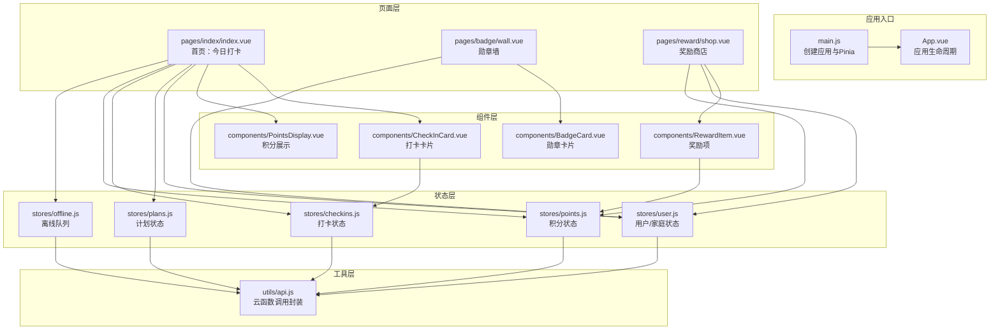
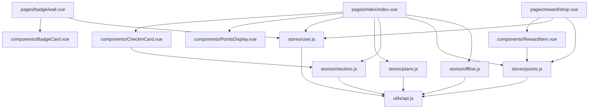
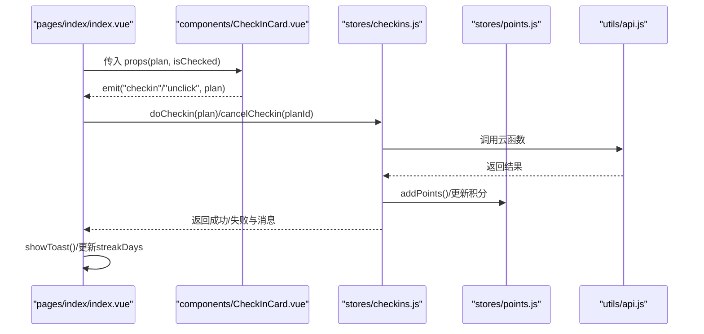
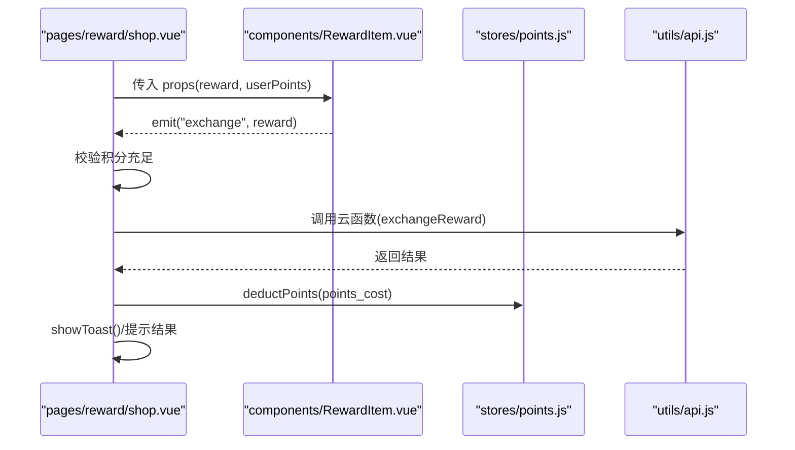
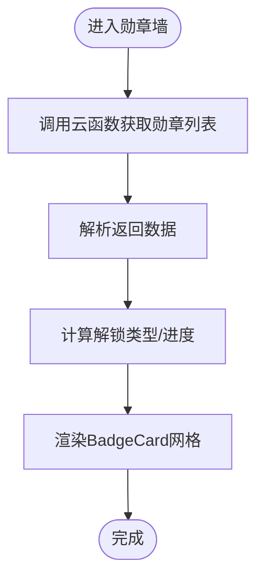
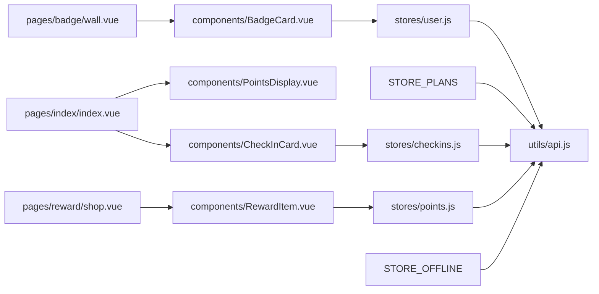

# 组件通信机制

<cite>
**本文引用的文件**
- [src/main.js](file://src/main.js)
- [src/App.vue](file://src/App.vue)
- [src/stores/user.js](file://src/stores/user.js)
- [src/stores/points.js](file://src/stores/points.js)
- [src/stores/plans.js](file://src/stores/plans.js)
- [src/stores/checkins.js](file://src/stores/checkins.js)
- [src/stores/offline.js](file://src/stores/offline.js)
- [src/utils/api.js](file://src/utils/api.js)
- [src/pages/index/index.vue](file://src/pages/index/index.vue)
- [src/pages/badge/wall.vue](file://src/pages/badge/wall.vue)
- [src/pages/reward/shop.vue](file://src/pages/reward/shop.vue)
- [src/components/CheckInCard.vue](file://src/components/CheckInCard.vue)
- [src/components/BadgeCard.vue](file://src/components/BadgeCard.vue)
- [src/components/RewardItem.vue](file://src/components/RewardItem.vue)
- [src/components/PointsDisplay.vue](file://src/components/PointsDisplay.vue)
</cite>

## 目录
1. [简介](#简介)
2. [项目结构](#项目结构)
3. [核心组件](#核心组件)
4. [架构总览](#架构总览)
5. [详细组件分析](#详细组件分析)
6. [依赖关系分析](#依赖关系分析)
7. [性能考量](#性能考量)
8. [故障排查指南](#故障排查指南)
9. [结论](#结论)
10. [附录](#附录)

## 简介
本文件系统性梳理 Star Grow 项目在 Vue 3 + UniApp 环境下的组件通信机制，覆盖以下主题：
- Props 传递与事件发射（父子组件）
- 全局状态共享（Pinia Store）
- provide/inject 的使用现状与替代方案
- 兄弟组件与跨级组件通信（事件总线模式、Pinia 共享）
- 生命周期与状态同步（挂载、更新、销毁）
- 异步组件与动态导入
- 数据验证与错误处理
- 组件复用与抽象（高阶组件与混入模式的适用性建议）

## 项目结构
项目采用“页面 + 组件 + Store + 工具”的分层组织方式：
- 页面层：pages 下按功能模块划分页面，负责业务编排与状态拉取
- 组件层：components 提供可复用 UI 组件
- 状态层：stores 提供 Pinia Store 管理全局状态
- 工具层：utils 封装云函数调用、提醒与同步逻辑

图表来源
- [src/main.js:1-11](file://src/main.js#L1-L11)
- [src/App.vue:1-64](file://src/App.vue#L1-L64)
- [src/pages/index/index.vue:1-204](file://src/pages/index/index.vue#L1-L204)
- [src/pages/badge/wall.vue:1-82](file://src/pages/badge/wall.vue#L1-L82)
- [src/pages/reward/shop.vue:1-135](file://src/pages/reward/shop.vue#L1-L135)
- [src/components/CheckInCard.vue:1-67](file://src/components/CheckInCard.vue#L1-L67)
- [src/components/BadgeCard.vue:1-37](file://src/components/BadgeCard.vue#L1-L37)
- [src/components/RewardItem.vue:1-53](file://src/components/RewardItem.vue#L1-L53)
- [src/components/PointsDisplay.vue:1-32](file://src/components/PointsDisplay.vue#L1-L32)
- [src/stores/user.js:1-119](file://src/stores/user.js#L1-L119)
- [src/stores/plans.js:1-73](file://src/stores/plans.js#L1-L73)
- [src/stores/checkins.js:1-163](file://src/stores/checkins.js#L1-L163)
- [src/stores/points.js:1-44](file://src/stores/points.js#L1-L44)
- [src/stores/offline.js:1-30](file://src/stores/offline.js#L1-L30)
- [src/utils/api.js:1-18](file://src/utils/api.js#L1-L18)

章节来源
- [src/main.js:1-11](file://src/main.js#L1-L11)
- [src/App.vue:1-64](file://src/App.vue#L1-L64)

## 核心组件
本节聚焦于组件通信的关键实现点与最佳实践。

- Props 传递与事件发射
  - 子组件通过 defineProps 接收父组件传入的数据，如 CheckInCard 的 plan、isChecked；RewardItem 的 reward、userPoints；BadgeCard 的 badge、unlocked；PointsDisplay 的 points、animated。
  - 子组件通过 defineEmits 发出事件，如 CheckInCard 在点击时发出 checkin/unclick；RewardItem 在满足条件时发出 exchange。
  - 父组件在模板中绑定 @checkin/@unclick/@exchange，实现从子到父的事件回传。

- 全局状态共享（Pinia Store）
  - 应用在入口处创建并安装 Pinia，页面与组件通过组合式 API 使用各 Store。
  - Store 内部封装数据、计算属性与异步操作，统一对外暴露方法与状态，避免跨层级直接访问。

- provide/inject 的使用现状
  - 当前代码未使用 provide/inject。推荐场景：跨多级组件共享少量上下文信息时可考虑，但本项目更倾向通过 Pinia 层集中管理。

- 兄弟组件与跨级组件通信
  - 本项目主要通过 Pinia Store 实现跨组件共享状态；兄弟组件通过共同父组件协调或通过 Store 读写共享数据。
  - 若需事件总线，可在入口或公共模块引入轻量事件总线，但需注意生命周期清理，避免内存泄漏。

- 生命周期与状态同步
  - 页面 onShow 时触发数据拉取与刷新；App.vue onShow 中处理离线数据同步。
  - Store 内部对异常进行捕获与降级（如本地缓存回退），保证用户体验。

- 异步组件与动态导入
  - 项目未显式使用异步组件与动态导入语法。若后续需要按需加载大型组件或页面，可结合路由与动态导入优化首屏性能。

- 数据验证与错误处理
  - 组件内部对输入参数进行类型约束与默认值设置；Store 对网络请求进行 try/catch 包裹，并提供本地回退策略。
  - 页面层对用户交互进行二次校验（如积分不足时阻止兑换），并在弹窗中反馈结果。

- 组件复用与抽象
  - 通过 Props 与 Events 的标准化接口提升组件复用性；Store 抽象数据访问与变更逻辑，减少重复代码。
  - 高阶组件与混入模式在本项目中未使用。建议：若存在多组件共用的横切关注点，可考虑组合式函数（composables）替代混入，避免作用域污染。

章节来源
- [src/components/CheckInCard.vue:1-67](file://src/components/CheckInCard.vue#L1-L67)
- [src/components/RewardItem.vue:1-53](file://src/components/RewardItem.vue#L1-L53)
- [src/components/BadgeCard.vue:1-37](file://src/components/BadgeCard.vue#L1-L37)
- [src/components/PointsDisplay.vue:1-32](file://src/components/PointsDisplay.vue#L1-L32)
- [src/stores/checkins.js:1-163](file://src/stores/checkins.js#L1-L163)
- [src/stores/points.js:1-44](file://src/stores/points.js#L1-L44)
- [src/stores/plans.js:1-73](file://src/stores/plans.js#L1-L73)
- [src/stores/user.js:1-119](file://src/stores/user.js#L1-L119)
- [src/stores/offline.js:1-30](file://src/stores/offline.js#L1-L30)
- [src/utils/api.js:1-18](file://src/utils/api.js#L1-L18)
- [src/pages/index/index.vue:1-204](file://src/pages/index/index.vue#L1-L204)
- [src/pages/badge/wall.vue:1-82](file://src/pages/badge/wall.vue#L1-L82)
- [src/pages/reward/shop.vue:1-135](file://src/pages/reward/shop.vue#L1-L135)
- [src/App.vue:1-64](file://src/App.vue#L1-L64)
- [src/main.js:1-11](file://src/main.js#L1-L11)

## 架构总览
下图展示页面、组件与 Store 的交互关系，以及数据流向与事件传播路径。

图表来源
- [src/pages/index/index.vue:1-204](file://src/pages/index/index.vue#L1-L204)
- [src/pages/badge/wall.vue:1-82](file://src/pages/badge/wall.vue#L1-L82)
- [src/pages/reward/shop.vue:1-135](file://src/pages/reward/shop.vue#L1-L135)
- [src/components/CheckInCard.vue:1-67](file://src/components/CheckInCard.vue#L1-L67)
- [src/components/BadgeCard.vue:1-37](file://src/components/BadgeCard.vue#L1-L37)
- [src/components/RewardItem.vue:1-53](file://src/components/RewardItem.vue#L1-L53)
- [src/components/PointsDisplay.vue:1-32](file://src/components/PointsDisplay.vue#L1-L32)
- [src/stores/user.js:1-119](file://src/stores/user.js#L1-L119)
- [src/stores/plans.js:1-73](file://src/stores/plans.js#L1-L73)
- [src/stores/checkins.js:1-163](file://src/stores/checkins.js#L1-L163)
- [src/stores/points.js:1-44](file://src/stores/points.js#L1-L44)
- [src/stores/offline.js:1-30](file://src/stores/offline.js#L1-L30)
- [src/utils/api.js:1-18](file://src/utils/api.js#L1-L18)

## 详细组件分析

### 首页：今日打卡（页面与组件通信）
- 父子通信
  - 页面通过 props 向 CheckInCard 传递 plan、isChecked；通过 emits 接收 checkin/unclick 事件。
  - 页面通过 computed 与响应式数据驱动 UI，如进度条宽度、完成数量统计。
- 全局状态
  - 页面在 onShow 时拉取计划、今日打卡、离线计数与积分，完成后渲染 UI 并触发 Toast 提示。
- 错误处理
  - 云函数调用失败时进行本地缓存回退；离线状态下记录离线队列并提示“待同步”。

图表来源
- [src/pages/index/index.vue:101-166](file://src/pages/index/index.vue#L101-L166)
- [src/components/CheckInCard.vue:23-42](file://src/components/CheckInCard.vue#L23-L42)
- [src/stores/checkins.js:26-89](file://src/stores/checkins.js#L26-L89)
- [src/stores/points.js:26-33](file://src/stores/points.js#L26-L33)
- [src/utils/api.js:9-17](file://src/utils/api.js#L9-L17)

章节来源
- [src/pages/index/index.vue:1-204](file://src/pages/index/index.vue#L1-L204)
- [src/components/CheckInCard.vue:1-67](file://src/components/CheckInCard.vue#L1-L67)
- [src/stores/checkins.js:1-163](file://src/stores/checkins.js#L1-L163)
- [src/stores/points.js:1-44](file://src/stores/points.js#L1-L44)
- [src/utils/api.js:1-18](file://src/utils/api.js#L1-L18)

### 奖励商店（兄弟组件与跨级通信）
- 组件间通信
  - 页面通过 props 向 RewardItem 传递 reward 与 userPoints；RewardItem 在满足条件时发出 exchange 事件。
  - 页面在 handleExchange 中进行二次校验（积分是否足够）、发起云函数调用、更新积分状态并反馈结果。
- 全局状态
  - 页面在 onShow 时拉取奖励列表；用户角色与积分状态来自 Pinia Store。

图表来源
- [src/pages/reward/shop.vue:77-104](file://src/pages/reward/shop.vue#L77-L104)
- [src/components/RewardItem.vue:23-34](file://src/components/RewardItem.vue#L23-L34)
- [src/stores/points.js:35-40](file://src/stores/points.js#L35-L40)
- [src/utils/api.js:9-17](file://src/utils/api.js#L9-L17)

章节来源
- [src/pages/reward/shop.vue:1-135](file://src/pages/reward/shop.vue#L1-L135)
- [src/components/RewardItem.vue:1-53](file://src/components/RewardItem.vue#L1-L53)
- [src/stores/points.js:1-44](file://src/stores/points.js#L1-L44)
- [src/utils/api.js:1-18](file://src/utils/api.js#L1-L18)

### 勋章墙（跨级组件与全局状态）
- 组件间通信
  - 页面通过 props 向 BadgeCard 传递 badge 与 unlocked；BadgeCard 仅负责展示。
- 全局状态
  - 页面在 onShow 时调用云函数获取已解锁勋章列表，计算进度与解锁数量。

图表来源
- [src/pages/badge/wall.vue:58-65](file://src/pages/badge/wall.vue#L58-L65)
- [src/components/BadgeCard.vue:12-21](file://src/components/BadgeCard.vue#L12-L21)

章节来源
- [src/pages/badge/wall.vue:1-82](file://src/pages/badge/wall.vue#L1-L82)
- [src/components/BadgeCard.vue:1-37](file://src/components/BadgeCard.vue#L1-L37)

### 积分展示（Props 传递）
- 组件通过 props 接收 points 与 animated，用于展示当前可用积分与动画效果。

章节来源
- [src/components/PointsDisplay.vue:1-32](file://src/components/PointsDisplay.vue#L1-L32)

## 依赖关系分析
- 组件依赖
  - 页面依赖多个组件；组件依赖 Store；Store 依赖工具层 API。
- 状态依赖
  - CheckInCard 依赖 Checkins Store；RewardItem 依赖 Points Store；BadgeCard 仅依赖外部传入数据。
- 外部依赖
  - 云函数调用通过统一封装的工具函数进行，便于集中错误处理与重试策略。

图表来源
- [src/pages/index/index.vue:1-204](file://src/pages/index/index.vue#L1-L204)
- [src/pages/reward/shop.vue:1-135](file://src/pages/reward/shop.vue#L1-L135)
- [src/pages/badge/wall.vue:1-82](file://src/pages/badge/wall.vue#L1-L82)
- [src/components/CheckInCard.vue:1-67](file://src/components/CheckInCard.vue#L1-L67)
- [src/components/RewardItem.vue:1-53](file://src/components/RewardItem.vue#L1-L53)
- [src/components/BadgeCard.vue:1-37](file://src/components/BadgeCard.vue#L1-L37)
- [src/components/PointsDisplay.vue:1-32](file://src/components/PointsDisplay.vue#L1-L32)
- [src/stores/checkins.js:1-163](file://src/stores/checkins.js#L1-L163)
- [src/stores/points.js:1-44](file://src/stores/points.js#L1-L44)
- [src/stores/user.js:1-119](file://src/stores/user.js#L1-L119)
- [src/stores/offline.js:1-30](file://src/stores/offline.js#L1-L30)
- [src/utils/api.js:1-18](file://src/utils/api.js#L1-L18)

章节来源
- [src/stores/user.js:1-119](file://src/stores/user.js#L1-L119)
- [src/stores/plans.js:1-73](file://src/stores/plans.js#L1-L73)
- [src/stores/checkins.js:1-163](file://src/stores/checkins.js#L1-L163)
- [src/stores/points.js:1-44](file://src/stores/points.js#L1-L44)
- [src/stores/offline.js:1-30](file://src/stores/offline.js#L1-L30)
- [src/utils/api.js:1-18](file://src/utils/api.js#L1-L18)

## 性能考量
- 避免不必要的响应式开销：对只读数据尽量使用普通变量而非 ref/computed。
- 合理拆分组件：将复杂页面拆分为多个小组件，减少单个组件的渲染压力。
- 事件节流/防抖：对于频繁触发的事件（如滚动、输入）可增加节流/防抖。
- 缓存策略：Store 中已使用本地缓存回退，建议进一步细化缓存键与过期策略。
- 异步加载：未来可对大型页面或组件使用动态导入，优化首屏加载时间。

## 故障排查指南
- 云函数调用失败
  - 现象：页面提示“云函数调用失败”或返回错误对象。
  - 处理：检查工具层封装的错误返回；查看 Store 中的 try/catch 逻辑与本地回退。
- 离线状态无法同步
  - 现象：离线计数不为 0，点击同步无反应。
  - 处理：检查离线 Store 的 sync 流程与并发标志；确认同步队列是否为空。
- 积分扣减异常
  - 现象：兑换后积分未变化或出现负值。
  - 处理：核对兑换流程中的扣减逻辑与本地存储更新；确保边界条件（如不足时）被正确拦截。
- 勋章未显示解锁
  - 现象：完成任务后未弹出新勋章提示或页面未刷新。
  - 处理：确认 Store 中的回调逻辑与页面重新拉取数据的时机。

章节来源
- [src/utils/api.js:9-17](file://src/utils/api.js#L9-L17)
- [src/stores/checkins.js:77-88](file://src/stores/checkins.js#L77-L88)
- [src/stores/offline.js:14-26](file://src/stores/offline.js#L14-L26)
- [src/stores/points.js:35-40](file://src/stores/points.js#L35-L40)
- [src/pages/badge/wall.vue:58-65](file://src/pages/badge/wall.vue#L58-L65)

## 结论
本项目在 Vue 3 + UniApp 环境下，通过明确的父子组件通信（Props + Emits）、Pinia 全局状态管理与统一的云函数封装，实现了清晰、可维护的组件通信体系。建议在未来引入异步组件与动态导入优化性能，并在需要跨多级共享上下文时谨慎评估 provide/inject 与事件总线的使用场景，保持状态流的可控与可观测。

## 附录
- 最佳实践清单
  - 父子通信：严格定义 Props 类型与默认值；事件命名采用动词短语，参数携带必要上下文。
  - 单向数据流：Store 作为唯一数据源；组件仅消费与派发事件。
  - 错误处理：统一在工具层与 Store 层处理异常；提供本地回退与用户提示。
  - 生命周期：在 onShow/onLoad 中拉取数据；在 onUnload 中清理定时器与订阅。
  - 复用与抽象：通过组合式函数与标准化 Props/Events 提升复用性；避免过度使用混入。