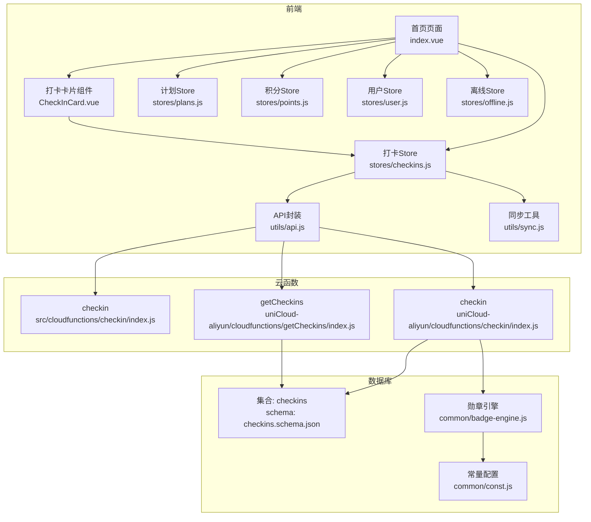
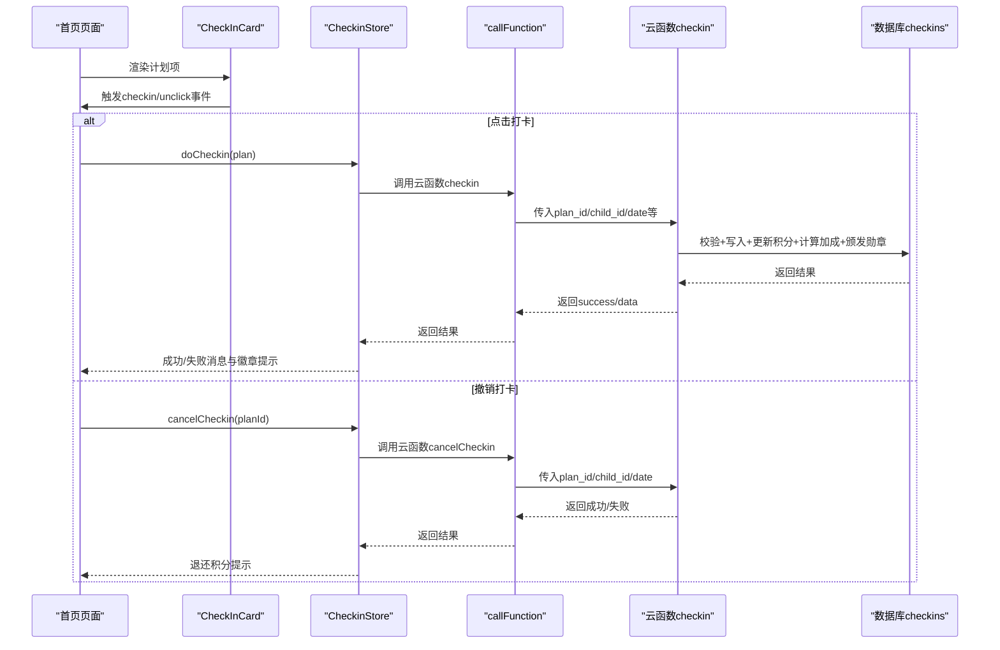
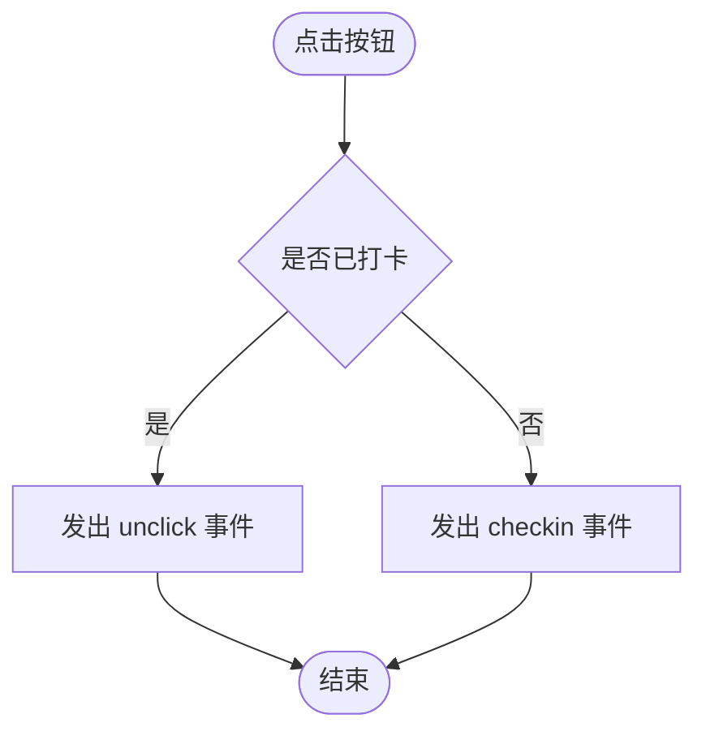
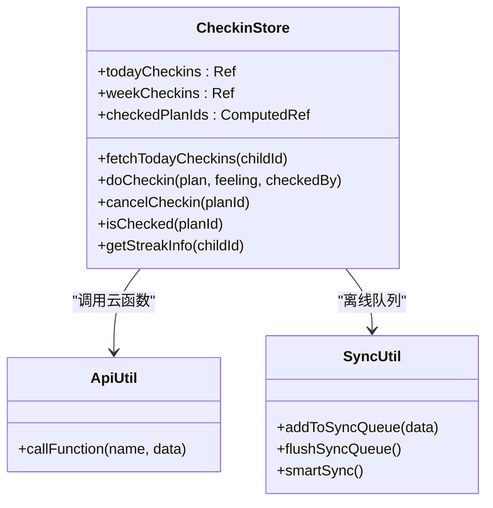
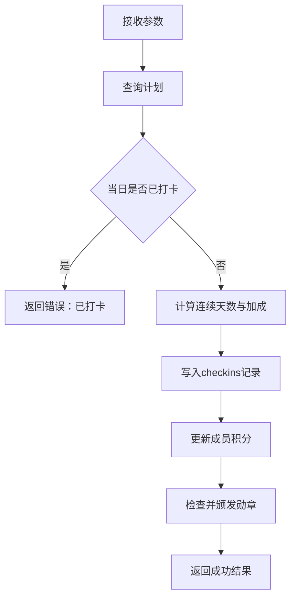
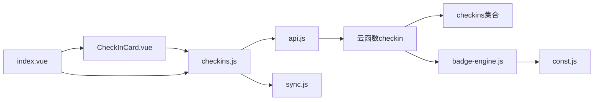

# 打卡管理系统

<cite>
**本文引用的文件**
- [src/components/CheckInCard.vue](file://src/components/CheckInCard.vue)
- [src/stores/checkins.js](file://src/stores/checkins.js)
- [src/pages/index/index.vue](file://src/pages/index/index.vue)
- [src/utils/api.js](file://src/utils/api.js)
- [src/utils/sync.js](file://src/utils/sync.js)
- [src/stores/plans.js](file://src/stores/plans.js)
- [src/stores/points.js](file://src/stores/points.js)
- [src/stores/user.js](file://src/stores/user.js)
- [src/stores/offline.js](file://src/stores/offline.js)
- [src/cloudfunctions/checkin/index.js](file://src/cloudfunctions/checkin/index.js)
- [uniCloud-aliyun/cloudfunctions/checkin/index.js](file://uniCloud-aliyun/cloudfunctions/checkin/index.js)
- [uniCloud-aliyun/cloudfunctions/getCheckins/index.js](file://uniCloud-aliyun/cloudfunctions/getCheckins/index.js)
- [uniCloud-aliyun/common/badge-engine.js](file://uniCloud-aliyun/common/badge-engine.js)
- [uniCloud-aliyun/common/const.js](file://uniCloud-aliyun/common/const.js)
- [uniCloud-aliyun/database/checkins.schema.json](file://uniCloud-aliyun/database/checkins.schema.json)
</cite>

## 目录
1. [简介](#简介)
2. [项目结构](#项目结构)
3. [核心组件](#核心组件)
4. [架构总览](#架构总览)
5. [详细组件分析](#详细组件分析)
6. [依赖关系分析](#依赖关系分析)
7. [性能考虑](#性能考虑)
8. [故障排查指南](#故障排查指南)
9. [结论](#结论)
10. [附录](#附录)

## 简介
本项目是一个面向儿童成长的“打卡管理系统”，围绕“日常打卡”构建，提供以下能力：
- 打卡卡片组件：直观展示计划类别、频率与奖励，支持一键打卡与撤销。
- 打卡状态管理：通过 Pinia Store 维护今日/本周打卡集合、连续天数统计、离线缓存与同步。
- 云函数服务：提供“打卡”“查询历史”等后端能力，包含积分计算、连续加成与勋章颁发。
- 数据模型：统一的 checkins 文档结构，确保前后端一致的数据契约。
- 用户体验：离线优先、静默同步、进度可视化与反馈提示。

## 项目结构
项目采用“前端组件 + Pinia Store + 云函数 + 数据库 Schema”的分层组织方式：
- 前端层：页面、组件、状态管理、工具函数
- 云函数层：checkin、getCheckins、syncOffline 等
- 数据层：MongoDB Collection + JSON Schema 校验

图表来源
- [src/pages/index/index.vue:1-204](file://src/pages/index/index.vue#L1-L204)
- [src/components/CheckInCard.vue:1-67](file://src/components/CheckInCard.vue#L1-L67)
- [src/stores/checkins.js:1-163](file://src/stores/checkins.js#L1-L163)
- [src/stores/plans.js:1-73](file://src/stores/plans.js#L1-L73)
- [src/stores/points.js:1-44](file://src/stores/points.js#L1-L44)
- [src/stores/user.js:1-119](file://src/stores/user.js#L1-L119)
- [src/stores/offline.js:1-30](file://src/stores/offline.js#L1-L30)
- [src/utils/api.js:1-18](file://src/utils/api.js#L1-L18)
- [src/utils/sync.js:1-96](file://src/utils/sync.js#L1-L96)
- [src/cloudfunctions/checkin/index.js:1-142](file://src/cloudfunctions/checkin/index.js#L1-L142)
- [uniCloud-aliyun/cloudfunctions/checkin/index.js:1-83](file://uniCloud-aliyun/cloudfunctions/checkin/index.js#L1-L83)
- [uniCloud-aliyun/cloudfunctions/getCheckins/index.js:1-19](file://uniCloud-aliyun/cloudfunctions/getCheckins/index.js#L1-L19)
- [uniCloud-aliyun/common/badge-engine.js:1-125](file://uniCloud-aliyun/common/badge-engine.js#L1-L125)
- [uniCloud-aliyun/common/const.js:1-27](file://uniCloud-aliyun/common/const.js#L1-L27)
- [uniCloud-aliyun/database/checkins.schema.json:1-52](file://uniCloud-aliyun/database/checkins.schema.json#L1-L52)

章节来源
- [src/pages/index/index.vue:1-204](file://src/pages/index/index.vue#L1-L204)
- [src/components/CheckInCard.vue:1-67](file://src/components/CheckInCard.vue#L1-L67)
- [src/stores/checkins.js:1-163](file://src/stores/checkins.js#L1-L163)

## 核心组件
- 打卡卡片组件：负责渲染计划信息与打卡按钮，触发父组件事件；支持“已打卡”视觉态。
- 打卡 Store：负责今日/本周数据拉取、执行打卡、撤销、连续天数统计、离线缓存与同步。
- 页面集成：首页聚合计划、进度、连续天数与离线提示，统一调度 Store 与云函数。

章节来源
- [src/components/CheckInCard.vue:1-67](file://src/components/CheckInCard.vue#L1-L67)
- [src/stores/checkins.js:1-163](file://src/stores/checkins.js#L1-L163)
- [src/pages/index/index.vue:1-204](file://src/pages/index/index.vue#L1-L204)

## 架构总览
系统采用“前端状态 + 云函数服务 + 数据库存储”的三层架构：
- 前端通过 Pinia Store 管理状态，调用封装好的云函数调用器。
- 云函数负责数据校验、业务计算（积分、加成、勋章）、写入数据库。
- 数据库提供统一的集合与 Schema，保障数据一致性。

图表来源
- [src/pages/index/index.vue:127-154](file://src/pages/index/index.vue#L127-L154)
- [src/stores/checkins.js:26-89](file://src/stores/checkins.js#L26-L89)
- [src/utils/api.js:9-17](file://src/utils/api.js#L9-L17)
- [uniCloud-aliyun/cloudfunctions/checkin/index.js:5-82](file://uniCloud-aliyun/cloudfunctions/checkin/index.js#L5-L82)

## 详细组件分析

### CheckInCard 组件
- 设计理念
  - 单向数据流：接收计划与状态 props，通过事件向上通知父组件。
  - 视觉反馈：根据 is-checked 切换卡片与按钮样式，增强可感知性。
  - 交互简洁：点击切换“打卡/撤销”，避免多余状态。
- 关键行为
  - 点击按钮：若已打卡则发出 unclick，否则发出 checkin。
  - 分类图标：依据计划 category 动态选择图标。
- 样式定制
  - 支持通过外部容器覆盖样式，如尺寸、间距、阴影等。
  - 已打卡态使用绿色主题，未打卡使用渐变红色主题。

图表来源
- [src/components/CheckInCard.vue:36-42](file://src/components/CheckInCard.vue#L36-L42)

章节来源
- [src/components/CheckInCard.vue:1-67](file://src/components/CheckInCard.vue#L1-L67)

### Pinia Store：checkins 状态管理
- 数据结构
  - todayCheckins：当日打卡记录数组
  - weekCheckins：本周打卡记录数组
  - checkedPlanIds：今日已打卡计划ID集合（computed）
- 核心方法
  - fetchTodayCheckins(childId)：按日期查询当日记录，失败时回退本地缓存
  - doCheckin(plan, feeling?, checkedBy?)：执行打卡，云端成功后更新本地缓存与积分，失败时进入离线队列
  - cancelCheckin(planId)：撤销当日打卡，退还积分并更新本地缓存
  - isChecked(planId)：判断某计划今日是否已打卡
  - getStreakInfo(childId)：计算最长连续天数（基于最近7天）
- 错误处理与离线策略
  - 云端异常时写入本地缓存与离线队列，保证用户操作不中断
  - 提供离线提示与一键同步入口

图表来源
- [src/stores/checkins.js:9-161](file://src/stores/checkins.js#L9-L161)
- [src/utils/api.js:9-17](file://src/utils/api.js#L9-L17)
- [src/utils/sync.js:13-95](file://src/utils/sync.js#L13-L95)

章节来源
- [src/stores/checkins.js:1-163](file://src/stores/checkins.js#L1-L163)

### 云函数：checkin 业务逻辑
- 请求参数
  - plan_id：计划ID
  - child_id：成员ID
  - date：日期 YYYY-MM-DD
  - feeling：可选，感受
  - checked_by：可选，打卡人类型（self/parent）
- 业务流程
  - 校验计划存在性
  - 检查当日是否已打卡
  - 计算连续天数并应用加成
  - 写入 checkins 记录，更新成员积分
  - 检查并颁发勋章
  - 返回成功结果与新增徽章列表
- 错误处理
  - 已打卡场景返回明确错误
  - 异常捕获并返回错误信息

图表来源
- [uniCloud-aliyun/cloudfunctions/checkin/index.js:5-82](file://uniCloud-aliyun/cloudfunctions/checkin/index.js#L5-L82)
- [uniCloud-aliyun/common/badge-engine.js:52-122](file://uniCloud-aliyun/common/badge-engine.js#L52-L122)

章节来源
- [uniCloud-aliyun/cloudfunctions/checkin/index.js:1-83](file://uniCloud-aliyun/cloudfunctions/checkin/index.js#L1-L83)
- [uniCloud-aliyun/common/badge-engine.js:1-125](file://uniCloud-aliyun/common/badge-engine.js#L1-L125)

### 云函数：getCheckins 查询逻辑
- 请求参数
  - child_id：成员ID
  - date：可选，按日期过滤
  - week_start：可选，按周起始日期过滤
- 返回
  - 成功标志与查询结果数组

章节来源
- [uniCloud-aliyun/cloudfunctions/getCheckins/index.js:1-19](file://uniCloud-aliyun/cloudfunctions/getCheckins/index.js#L1-L19)

### 数据模型：checkins 集合
- 字段说明
  - plan_id：计划ID
  - child_id：成员ID
  - date：日期字符串
  - checked_by：打卡人类型
  - feeling：感受
  - points_earned：本次获得积分
  - bonus_points：加成积分
  - bonus_type：加成类型
  - created_at：创建时间戳
- 约束
  - 必填字段：plan_id、child_id、date
  - 权限：读取/创建/更新/删除均开放

章节来源
- [uniCloud-aliyun/database/checkins.schema.json:1-52](file://uniCloud-aliyun/database/checkins.schema.json#L1-L52)

### 页面集成：首页 index.vue
- 职责
  - 加载计划与今日打卡数据
  - 展示问候语、日期、积分与连续天数徽章
  - 渲染打卡卡片并绑定事件
  - 处理撤销确认与离线同步
- 关键流程
  - onShow 生命周期中加载数据、刷新离线计数、同步积分
  - handleCheckin 调用 Store 的 doCheckin 并提示结果
  - handleUnclick 弹窗确认后调用 cancelCheckin

章节来源
- [src/pages/index/index.vue:1-204](file://src/pages/index/index.vue#L1-L204)

## 依赖关系分析
- 组件依赖
  - CheckInCard 仅依赖 props 与事件，低耦合，便于复用
- Store 依赖
  - CheckinStore 依赖用户、积分、同步工具与 API 封装
  - 通过 computed 与 ref 维护状态，避免直接修改外部状态
- 云函数依赖
  - 依赖数据库、勋章引擎与常量配置
  - 通过命令进行原子更新，减少并发冲突

图表来源
- [src/components/CheckInCard.vue:29-42](file://src/components/CheckInCard.vue#L29-L42)
- [src/stores/checkins.js:4-7](file://src/stores/checkins.js#L4-L7)
- [src/utils/api.js:9-17](file://src/utils/api.js#L9-L17)
- [src/utils/sync.js:13-53](file://src/utils/sync.js#L13-L53)
- [uniCloud-aliyun/cloudfunctions/checkin/index.js:5-82](file://uniCloud-aliyun/cloudfunctions/checkin/index.js#L5-L82)
- [uniCloud-aliyun/common/badge-engine.js:52-122](file://uniCloud-aliyun/common/badge-engine.js#L52-L122)
- [uniCloud-aliyun/common/const.js:3-17](file://uniCloud-aliyun/common/const.js#L3-L17)

章节来源
- [src/stores/checkins.js:1-163](file://src/stores/checkins.js#L1-L163)
- [src/utils/sync.js:1-96](file://src/utils/sync.js#L1-L96)

## 性能考虑
- 离线优先与静默同步
  - 打卡立即写入本地缓存与队列，避免网络阻塞
  - 应用启动/切前台时智能检测网络并批量同步
- 数据缓存
  - 今日/本周数据与计划列表均做本地缓存，降低重复请求
- 计算优化
  - 连续天数计算限制最近35条记录，避免超大数据集扫描
- UI 体验
  - 进度条与徽章提示即时反馈，提升成就感

[本节为通用指导，无需列出具体文件来源]

## 故障排查指南
- 打卡失败
  - 现象：返回“今天已打卡”
  - 排查：确认当日是否已存在相同 plan_id + child_id + date 的记录
- 云端调用异常
  - 现象：弹出“云函数调用失败”
  - 排查：检查网络状态、云函数部署状态与权限
- 离线未同步
  - 现象：出现“待同步”提示但未上传
  - 排查：确认网络可用后点击同步；查看本地队列内容
- 徽章未解锁
  - 现象：满足条件但未获得徽章
  - 排查：确认勋章类型未重复颁发；检查数据库中 badges 集合是否已有对应类型

章节来源
- [src/stores/checkins.js:77-88](file://src/stores/checkins.js#L77-L88)
- [src/utils/api.js:13-16](file://src/utils/api.js#L13-L16)
- [src/utils/sync.js:84-95](file://src/utils/sync.js#L84-L95)

## 结论
本系统以“离线优先、即时反馈、勋章激励”为核心设计理念，通过清晰的组件与 Store 分层、严谨的云函数业务逻辑与数据库 Schema，实现了稳定可靠的日常打卡体验。开发者可在现有基础上扩展更多计划类别、积分规则与徽章体系，同时保持良好的可维护性与扩展性。

[本节为总结性内容，无需列出具体文件来源]

## 附录

### API 接口文档

- 云函数：checkin
  - 方法：POST
  - 参数
    - plan_id：string，必填
    - child_id：string，必填
    - date：string，必填，格式 YYYY-MM-DD
    - feeling：string，可选
    - checked_by：string，可选，取值 self 或 parent
  - 返回
    - success：boolean
    - data：对象
      - checkin_id：string
      - points_earned：number
      - bonus_points：number
      - bonus_type：string
      - total_today：number
      - new_badges：数组，元素含 badge_type/title/icon/unlocked_at
      - current_streak：number
    - error：string，可选
  - 业务规则
    - 同一天同一计划不可重复打卡
    - 连续天数按自然日倒序累加，最多35天
    - 加成规则：≥3天+5，≥7天+15，≥14天+30
    - 成功后更新成员 current_points/total_points

章节来源
- [uniCloud-aliyun/cloudfunctions/checkin/index.js:5-82](file://uniCloud-aliyun/cloudfunctions/checkin/index.js#L5-L82)
- [uniCloud-aliyun/common/badge-engine.js:36-47](file://uniCloud-aliyun/common/badge-engine.js#L36-L47)
- [uniCloud-aliyun/common/const.js:3-17](file://uniCloud-aliyun/common/const.js#L3-L17)

- 云函数：getCheckins
  - 方法：GET/POST
  - 参数
    - child_id：string，必填
    - date：string，可选，按日期过滤
    - week_start：string，可选，YYYY-MM-DD
  - 返回
    - success：boolean
    - data：checkins 数组，按 created_at 倒序排列

章节来源
- [uniCloud-aliyun/cloudfunctions/getCheckins/index.js:4-18](file://uniCloud-aliyun/cloudfunctions/getCheckins/index.js#L4-L18)

- 云函数：cancelCheckin（由前端调用）
  - 方法：POST
  - 参数
    - plan_id：string，必填
    - child_id：string，必填
    - date：string，必填，格式 YYYY-MM-DD
  - 返回
    - success：boolean
    - data.refunded：number，退还积分
    - error：string，可选

章节来源
- [src/stores/checkins.js:126-159](file://src/stores/checkins.js#L126-L159)

### 使用示例与集成要点
- 在页面中渲染打卡卡片并绑定事件
  - 通过 computed 计算今日完成数与进度百分比
  - 点击事件中调用 Store 的 doCheckin/cancelCheckin
- 离线同步
  - 通过 offlineStore.refreshCount() 获取待同步数量
  - 点击后调用 sync() 完成批量上传并刷新数据

章节来源
- [src/pages/index/index.vue:48-55](file://src/pages/index/index.vue#L48-L55)
- [src/pages/index/index.vue:127-154](file://src/pages/index/index.vue#L127-L154)
- [src/stores/offline.js:10-26](file://src/stores/offline.js#L10-L26)