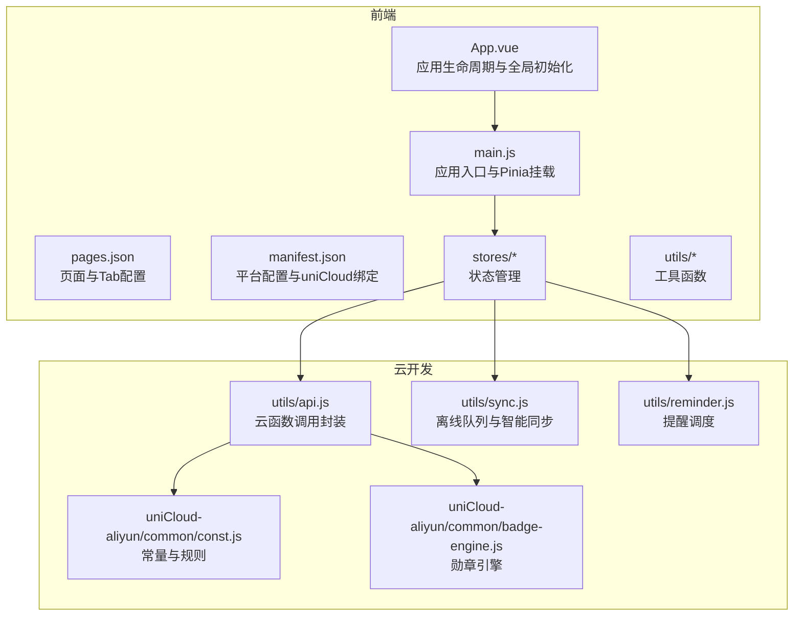
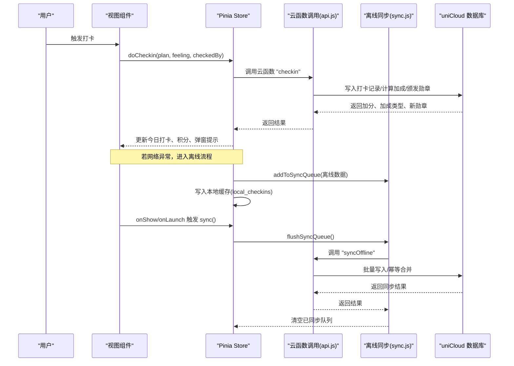
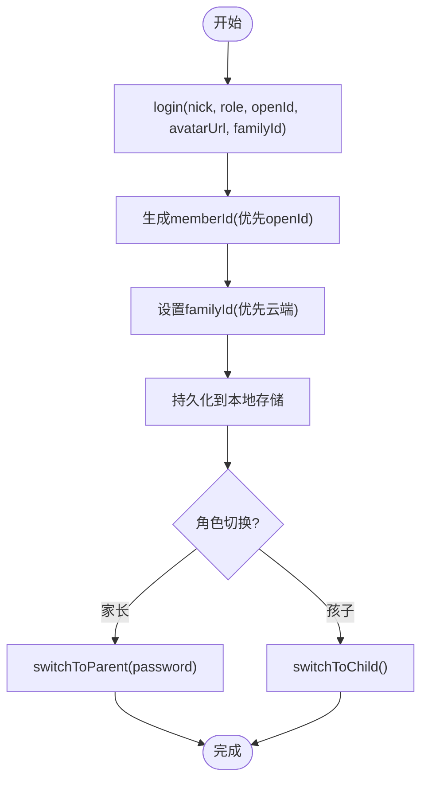
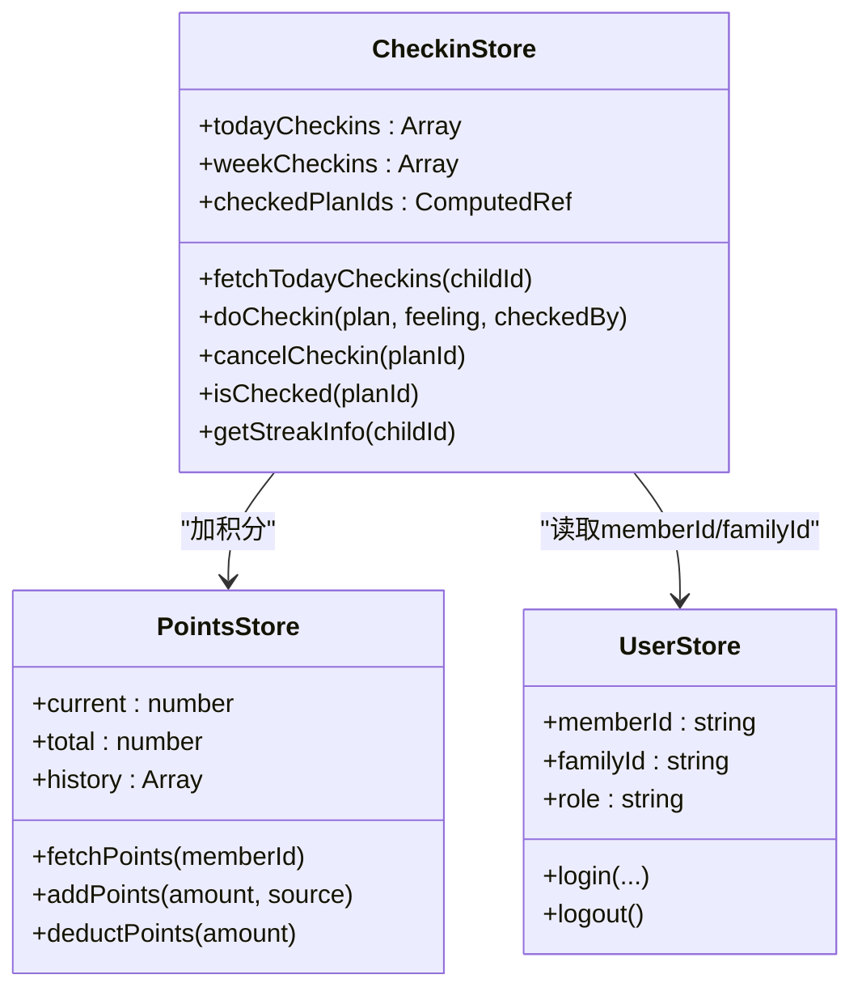
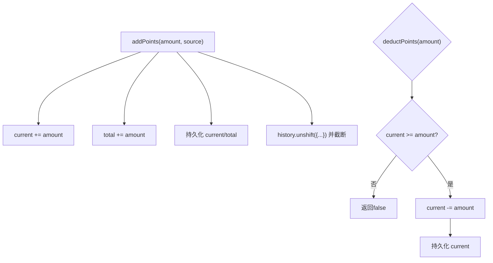
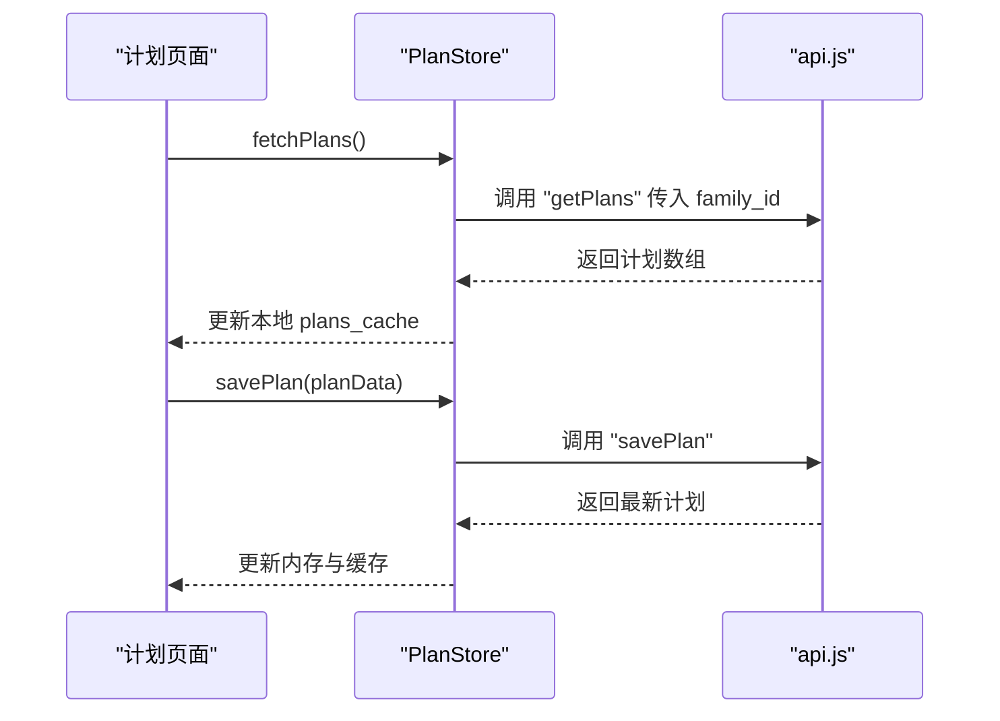
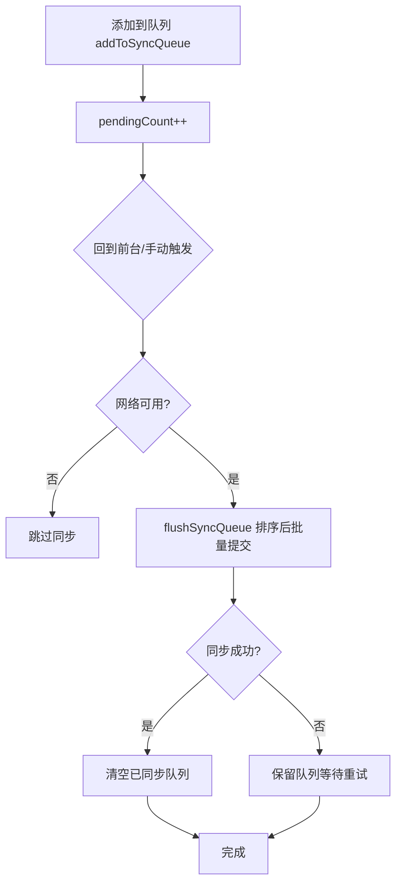
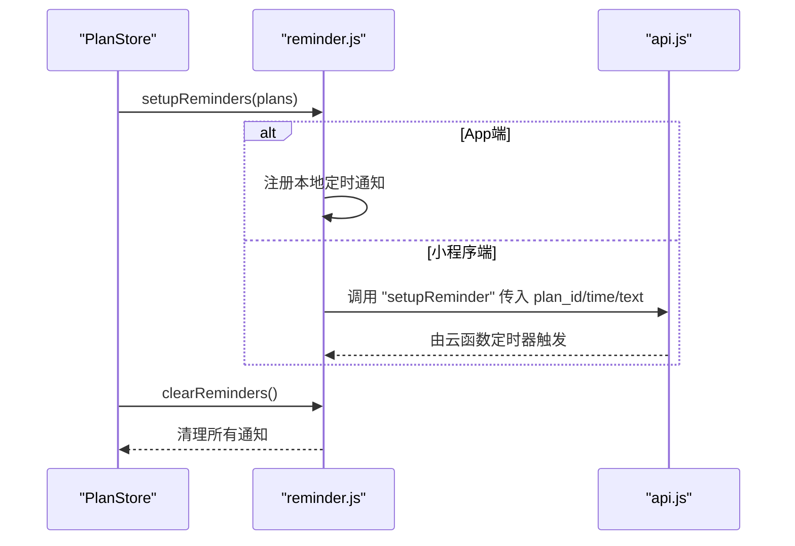
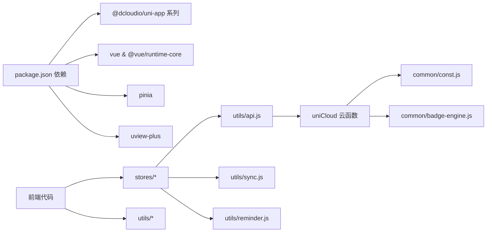

# 核心功能模块

<cite>
**本文引用的文件**
- [src/main.js](file://src/main.js)
- [src/App.vue](file://src/App.vue)
- [src/pages.json](file://src/pages.json)
- [src/manifest.json](file://src/manifest.json)
- [package.json](file://package.json)
- [src/stores/user.js](file://src/stores/user.js)
- [src/stores/checkins.js](file://src/stores/checkins.js)
- [src/stores/points.js](file://src/stores/points.js)
- [src/stores/plans.js](file://src/stores/plans.js)
- [src/stores/offline.js](file://src/stores/offline.js)
- [src/utils/api.js](file://src/utils/api.js)
- [src/utils/sync.js](file://src/utils/sync.js)
- [src/utils/reminder.js](file://src/utils/reminder.js)
- [uniCloud-aliyun/common/const.js](file://uniCloud-aliyun/common/const.js)
- [uniCloud-aliyun/common/badge-engine.js](file://uniCloud-aliyun/common/badge-engine.js)
</cite>

## 目录
1. [简介](#简介)
2. [项目结构](#项目结构)
3. [核心组件](#核心组件)
4. [架构总览](#架构总览)
5. [详细组件分析](#详细组件分析)
6. [依赖分析](#依赖分析)
7. [性能考虑](#性能考虑)
8. [故障排除指南](#故障排除指南)
9. [结论](#结论)
10. [附录](#附录)

## 简介
本文件面向初学者与高级开发者，系统梳理 Star Grow 的核心功能模块，包括用户认证系统、打卡管理、积分奖励、计划管理、离线同步与提醒机制，并解释模块间交互、数据模型、状态管理与持久化策略，提供扩展与定制化建议、故障排除与性能优化指导。

## 项目结构
项目采用 uni-app 多端统一框架，前端通过 Pinia 状态管理，配合 uniCloud 云开发实现数据持久化与云函数编排；后端云函数位于 uniCloud-aliyun/cloudfunctions 与 src/cloudfunctions，数据库模式定义于 uniCloud-aliyun/database。

图表来源
- [src/App.vue:1-64](file://src/App.vue#L1-L64)
- [src/main.js:1-11](file://src/main.js#L1-L11)
- [src/pages.json:1-56](file://src/pages.json#L1-L56)
- [src/manifest.json:1-77](file://src/manifest.json#L1-L77)
- [src/utils/api.js:1-18](file://src/utils/api.js#L1-L18)
- [src/utils/sync.js:1-96](file://src/utils/sync.js#L1-L96)
- [src/utils/reminder.js:1-59](file://src/utils/reminder.js#L1-L59)
- [uniCloud-aliyun/common/const.js:1-27](file://uniCloud-aliyun/common/const.js#L1-L27)
- [uniCloud-aliyun/common/badge-engine.js:1-125](file://uniCloud-aliyun/common/badge-engine.js#L1-L125)

章节来源
- [src/main.js:1-11](file://src/main.js#L1-L11)
- [src/App.vue:1-64](file://src/App.vue#L1-L64)
- [src/pages.json:1-56](file://src/pages.json#L1-L56)
- [src/manifest.json:1-77](file://src/manifest.json#L1-L77)
- [package.json:1-74](file://package.json#L1-L74)

## 核心组件
- 用户认证系统：负责成员身份、角色切换、家长密码校验与登录态持久化。
- 打卡管理系统：负责当日/周打卡查询、执行打卡、取消打卡、连续天数统计与勋章颁发。
- 积分奖励系统：负责积分余额、历史明细、加减积分与云端同步。
- 计划管理功能：负责计划的增删改查、默认模板与本地缓存。
- 离线同步机制：负责离线操作队列、静默同步与冲突幂等处理。
- 提醒机制：负责按计划类别与时间设置本地/订阅消息提醒。

章节来源
- [src/stores/user.js:1-119](file://src/stores/user.js#L1-L119)
- [src/stores/checkins.js:1-163](file://src/stores/checkins.js#L1-L163)
- [src/stores/points.js:1-44](file://src/stores/points.js#L1-L44)
- [src/stores/plans.js:1-73](file://src/stores/plans.js#L1-L73)
- [src/stores/offline.js:1-30](file://src/stores/offline.js#L1-L30)
- [src/utils/reminder.js:1-59](file://src/utils/reminder.js#L1-L59)

## 架构总览
前端通过 Pinia Store 维护状态，使用云函数封装进行数据访问；离线场景下先写本地缓存与队列，再在合适时机批量同步至云端；勋章与加成规则在云侧计算，保证一致性与可扩展性。

图表来源
- [src/stores/checkins.js:26-89](file://src/stores/checkins.js#L26-L89)
- [src/utils/sync.js:13-53](file://src/utils/sync.js#L13-L53)
- [src/utils/api.js:9-17](file://src/utils/api.js#L9-L17)
- [src/App.vue:21-27](file://src/App.vue#L21-L27)

## 详细组件分析

### 用户认证系统
职责
- 维护成员标识、家庭标识、角色（孩子/家长）、昵称、头像与登录态。
- 支持家长密码设置与校验，切换家长/孩子模式。
- 登录时生成稳定 member_id，优先使用 openId，持久化到本地存储。

关键点
- 家长模式开关需密码校验，避免误切换。
- 登录成功后写入本地存储，重启后自动恢复登录态。
- 退出登录时清理全部用户相关键值。

图表来源
- [src/stores/user.js:23-109](file://src/stores/user.js#L23-L109)

章节来源
- [src/stores/user.js:1-119](file://src/stores/user.js#L1-L119)

### 打卡管理系统
职责
- 查询当日/周打卡，执行打卡并计算积分与加成，颁发新勋章。
- 支持取消打卡并退还积分。
- 统计最长连续打卡天数。
- 离线场景下立即反馈并加入同步队列。

数据模型要点
- 打卡记录包含 plan_id、child_id、date、feeling、checked_by、points_earned、bonus_points、bonus_type 等字段。
- 连续天数统计基于日期序列，计算最长连续区间。

图表来源
- [src/stores/checkins.js:1-163](file://src/stores/checkins.js#L1-L163)
- [src/stores/points.js:1-44](file://src/stores/points.js#L1-L44)
- [src/stores/user.js:1-119](file://src/stores/user.js#L1-L119)

章节来源
- [src/stores/checkins.js:1-163](file://src/stores/checkins.js#L1-L163)
- [uniCloud-aliyun/common/badge-engine.js:1-125](file://uniCloud-aliyun/common/badge-engine.js#L1-L125)
- [uniCloud-aliyun/common/const.js:1-27](file://uniCloud-aliyun/common/const.js#L1-L27)

### 积分奖励系统
职责
- 维护当前积分与历史明细，支持加减积分与云端拉取。
- 历史记录限制长度，保证性能与存储安全。

图表来源
- [src/stores/points.js:26-40](file://src/stores/points.js#L26-L40)

章节来源
- [src/stores/points.js:1-44](file://src/stores/points.js#L1-L44)

### 计划管理功能
职责
- 获取家庭计划列表，本地缓存；保存计划（新建/更新）；归档计划。
- 提供默认计划模板，便于快速上手。

图表来源
- [src/stores/plans.js:14-47](file://src/stores/plans.js#L14-L47)
- [src/utils/api.js:9-17](file://src/utils/api.js#L9-L17)

章节来源
- [src/stores/plans.js:1-73](file://src/stores/plans.js#L1-L73)

### 离线同步机制
职责
- 打卡失败时立即写入本地队列与缓存，保证用户体验。
- 应用回到前台或手动触发时，按日期排序批量同步。
- 云端以幂等方式合并，避免重复与丢失。

图表来源
- [src/utils/sync.js:13-53](file://src/utils/sync.js#L13-L53)
- [src/stores/offline.js:14-26](file://src/stores/offline.js#L14-L26)
- [src/App.vue:21-27](file://src/App.vue#L21-L27)

章节来源
- [src/utils/sync.js:1-96](file://src/utils/sync.js#L1-L96)
- [src/stores/offline.js:1-30](file://src/stores/offline.js#L1-L30)

### 提醒机制
职责
- 根据计划类别与设定时间推送友好提醒。
- App 端使用本地通知，小程序端通过云函数定时触发器发送订阅消息。

图表来源
- [src/utils/reminder.js:19-50](file://src/utils/reminder.js#L19-L50)
- [src/utils/api.js:9-17](file://src/utils/api.js#L9-L17)

章节来源
- [src/utils/reminder.js:1-59](file://src/utils/reminder.js#L1-L59)

## 依赖分析
- 前端依赖
  - uni-app 生态与 Pinia 状态管理。
  - uview-plus UI 组件库与 vue-i18n 国际化。
- 云开发依赖
  - 云函数与数据库集合（members、plans、checkins、exchanges、rewards、badges、whitelist）。
  - 白名单校验与规则常量（连续加成、勋章定义）。

图表来源
- [package.json:39-72](file://package.json#L39-L72)
- [src/utils/api.js:1-18](file://src/utils/api.js#L1-L18)
- [uniCloud-aliyun/common/const.js:1-27](file://uniCloud-aliyun/common/const.js#L1-L27)
- [uniCloud-aliyun/common/badge-engine.js:1-125](file://uniCloud-aliyun/common/badge-engine.js#L1-L125)

章节来源
- [package.json:1-74](file://package.json#L1-L74)
- [src/manifest.json:72-76](file://src/manifest.json#L72-L76)

## 性能考虑
- 状态与缓存
  - 打卡与计划列表均使用本地缓存，减少网络请求；积分与历史记录限制长度，避免无限增长。
- 离线优先
  - 打卡立即落本地，避免阻塞用户；批量同步按日期排序，降低冲突概率。
- 网络感知
  - 智能同步仅在网络可用时执行，避免无效请求。
- 计算下沉
  - 连续天数与加成、勋章计算在云侧进行，保证一致性与可扩展性。

[本节为通用性能建议，无需特定文件引用]

## 故障排除指南
- 云函数调用失败
  - 现象：返回 { success: false, error }。
  - 排查：确认云函数部署状态、权限与参数格式；查看控制台日志。
  - 参考路径：[src/utils/api.js:9-17](file://src/utils/api.js#L9-L17)
- 离线数据无法同步
  - 现象：队列存在但无网络或同步失败。
  - 排查：检查网络状态、队列长度、上次同步时间；重试或手动触发同步。
  - 参考路径：[src/utils/sync.js:84-95](file://src/utils/sync.js#L84-L95)
- 勋章未解锁
  - 现象：满足条件但未获得新勋章。
  - 排查：确认云侧 badge-engine 计算逻辑、是否已存在同类勋章；检查数据库集合。
  - 参考路径：[uniCloud-aliyun/common/badge-engine.js:52-122](file://uniCloud-aliyun/common/badge-engine.js#L52-L122)
- 积分不一致
  - 现象：本地与云端积分不符。
  - 排查：优先以云端为准；检查取消打卡退款逻辑与本地缓存。
  - 参考路径：[src/stores/checkins.js:146-153](file://src/stores/checkins.js#L146-L153)
- 提醒未送达
  - 现象：App/小程序端无提醒。
  - 排查：App 端检查本地通知权限；小程序端检查订阅消息与云函数定时触发器。
  - 参考路径：[src/utils/reminder.js:19-50](file://src/utils/reminder.js#L19-L50)

章节来源
- [src/utils/api.js:1-18](file://src/utils/api.js#L1-L18)
- [src/utils/sync.js:1-96](file://src/utils/sync.js#L1-L96)
- [uniCloud-aliyun/common/badge-engine.js:1-125](file://uniCloud-aliyun/common/badge-engine.js#L1-L125)
- [src/stores/checkins.js:146-153](file://src/stores/checkins.js#L146-L153)
- [src/utils/reminder.js:1-59](file://src/utils/reminder.js#L1-L59)

## 结论
本项目通过 Pinia 管理前端状态，结合 uniCloud 实现云端数据与业务逻辑，形成“前端轻快、云端稳重”的架构。离线优先的设计提升了用户体验，云侧规则与计算保障了公平与一致性。模块边界清晰、耦合度低，具备良好的扩展性与定制化空间。

[本节为总结性内容，无需特定文件引用]

## 附录

### 页面与导航
- 页面清单与 Tab 配置集中于 pages.json，包含登录、首页、计划、积分、奖励、勋章、周报、家长指南、设置等。
- App.vue 在启动与回到前台时初始化云开发与触发离线同步。

章节来源
- [src/pages.json:1-56](file://src/pages.json#L1-L56)
- [src/App.vue:1-64](file://src/App.vue#L1-L64)

### 数据模型与规则
- 连续打卡加成与勋章定义位于 uniCloud-aliyun/common/const.js。
- 勋章计算与加成逻辑位于 uniCloud-aliyun/common/badge-engine.js。

章节来源
- [uniCloud-aliyun/common/const.js:1-27](file://uniCloud-aliyun/common/const.js#L1-L27)
- [uniCloud-aliyun/common/badge-engine.js:1-125](file://uniCloud-aliyun/common/badge-engine.js#L1-L125)