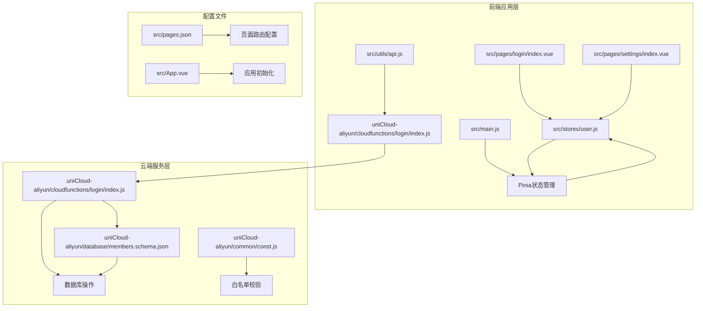
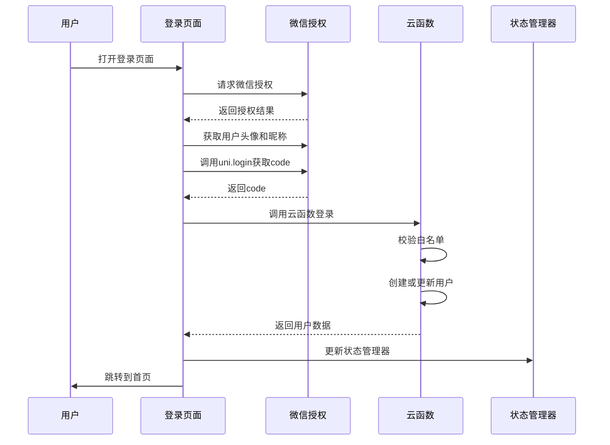
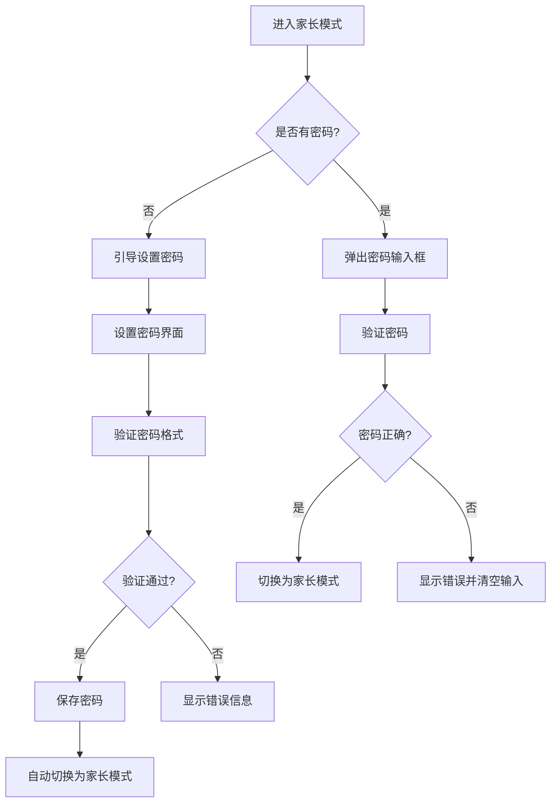
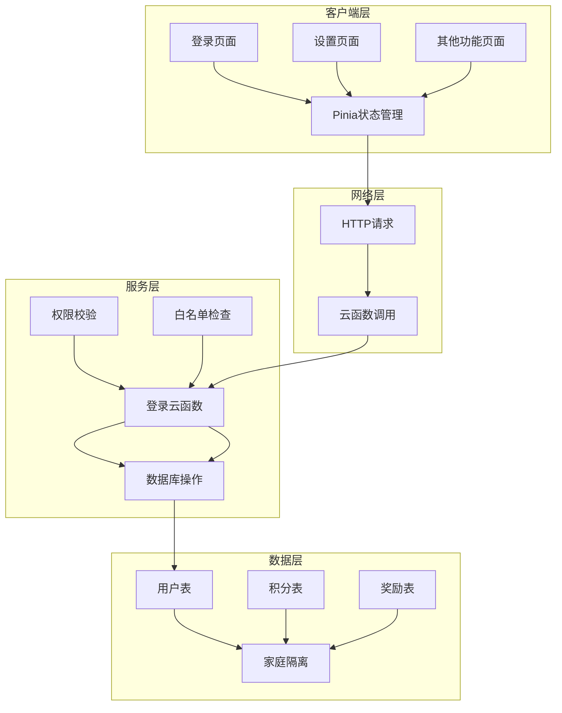
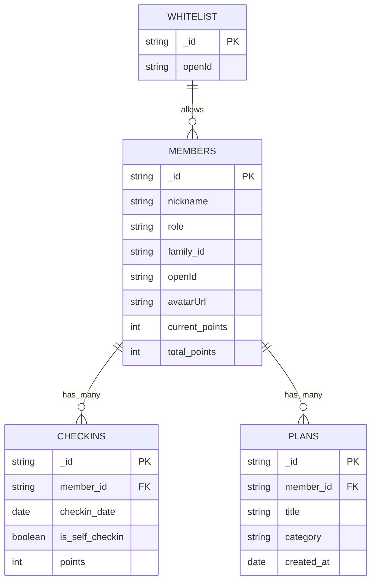
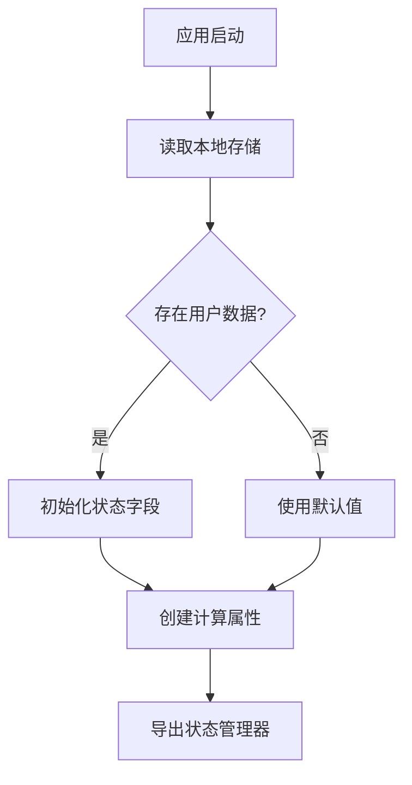
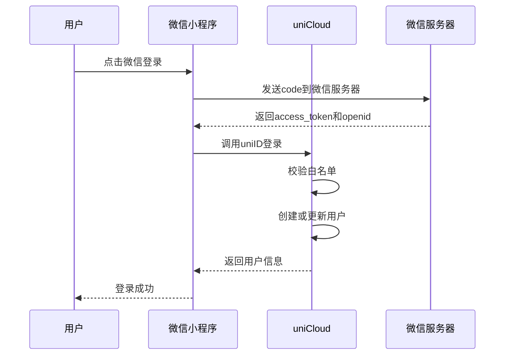
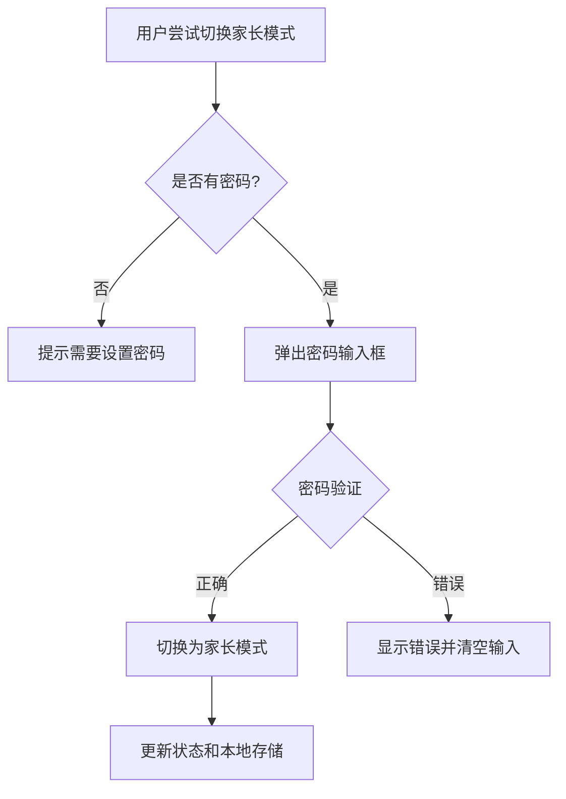
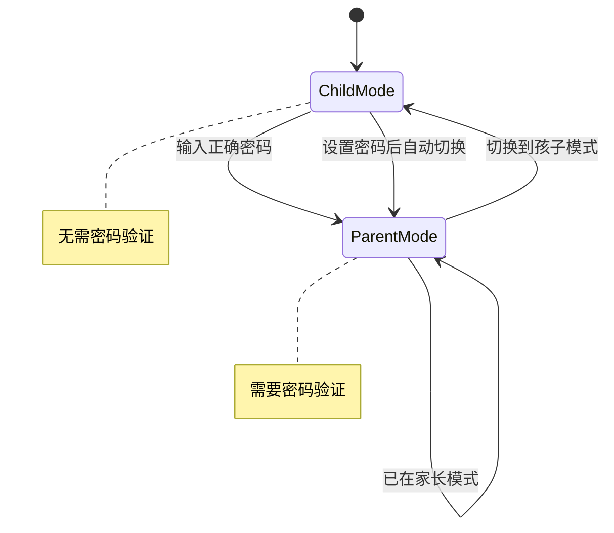
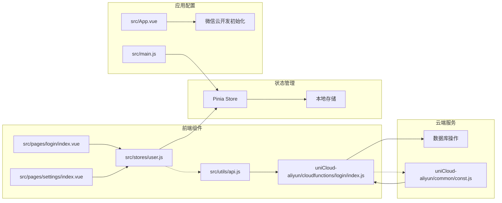

# 用户认证系统

<cite>
**本文档引用的文件**
- [src/stores/user.js](file://src/stores/user.js)
- [src/pages/login/index.vue](file://src/pages/login/index.vue)
- [src/utils/api.js](file://src/utils/api.js)
- [uniCloud-aliyun/cloudfunctions/login/index.js](file://uniCloud-aliyun/cloudfunctions/login/index.js)
- [uniCloud-aliyun/common/const.js](file://uniCloud-aliyun/common/const.js)
- [src/App.vue](file://src/App.vue)
- [src/main.js](file://src/main.js)
- [src/pages/settings/index.vue](file://src/pages/settings/index.vue)
- [src/stores/offline.js](file://src/stores/offline.js)
- [src/pages.json](file://src/pages.json)
- [uniCloud-aliyun/database/members.schema.json](file://uniCloud-aliyun/database/members.schema.json)
</cite>

## 目录
1. [简介](#简介)
2. [项目结构](#项目结构)
3. [核心组件](#核心组件)
4. [架构概览](#架构概览)
5. [详细组件分析](#详细组件分析)
6. [依赖关系分析](#依赖关系分析)
7. [性能考虑](#性能考虑)
8. [故障排除指南](#故障排除指南)
9. [结论](#结论)

## 简介

"星星养成"是一个基于UniApp开发的儿童成长打卡应用，采用Pinia状态管理和UniCloud云数据库实现用户认证系统。该系统支持微信登录和普通登录两种认证方式，提供家长和孩子两种角色模式，并具备完善的会话管理和状态持久化机制。

系统的核心特性包括：
- 双重认证方式：微信OAuth登录和普通用户名密码登录
- 角色切换机制：家长模式与孩子模式的无缝切换
- 数据隔离：基于openId的多用户数据隔离
- 安全保障：家长密码验证机制
- 状态持久化：本地存储与云端同步

## 项目结构

该项目采用模块化架构，主要分为前端应用层和云端服务层：

**图表来源**
- [src/stores/user.js:1-119](file://src/stores/user.js#L1-L119)
- [src/pages/login/index.vue:1-289](file://src/pages/login/index.vue#L1-L289)
- [uniCloud-aliyun/cloudfunctions/login/index.js:1-103](file://uniCloud-aliyun/cloudfunctions/login/index.js#L1-L103)

**章节来源**
- [src/pages.json:1-56](file://src/pages.json#L1-L56)
- [src/main.js:1-11](file://src/main.js#L1-L11)

## 核心组件

### Pinia用户状态管理器

用户状态管理器是整个认证系统的核心，负责管理用户的身份信息、角色状态和会话数据。

#### 核心状态字段

| 状态字段 | 类型 | 描述 | 默认值 |
|---------|------|------|--------|
| memberId | String | 用户唯一标识符 | '' |
| familyId | String | 家庭ID，用于数据隔离 | '' |
| role | String | 用户角色：parent/child | '' |
| nickname | String | 用户昵称 | '' |
| avatar | String | 本地头像路径 | '' |
| openId | String | 微信OpenID | '' |
| avatarUrl | String | 微信头像URL | '' |
| currentPoints | Number | 当前可用积分 | 0 |
| totalPoints | Number | 累计获得积分 | 0 |

#### 计算属性

| 计算属性 | 描述 | 返回值 |
|---------|------|--------|
| isParent | 检查是否为家长角色 | Boolean |
| isLoggedIn | 检查用户是否已登录 | Boolean |
| hasParentPassword | 检查家长密码是否存在 | Boolean |

**章节来源**
- [src/stores/user.js:7-21](file://src/stores/user.js#L7-L21)

### 登录流程组件

登录页面实现了完整的双阶段认证流程，支持微信授权和角色选择。

#### 微信登录流程

**图表来源**
- [src/pages/login/index.vue:136-230](file://src/pages/login/index.vue#L136-L230)
- [uniCloud-aliyun/cloudfunctions/login/index.js:6-102](file://uniCloud-aliyun/cloudfunctions/login/index.js#L6-L102)

**章节来源**
- [src/pages/login/index.vue:102-230](file://src/pages/login/index.vue#L102-L230)

### 家长密码管理系统

系统提供了完整的家长密码设置和验证机制，确保家长模式的安全性。

#### 密码管理流程

**图表来源**
- [src/pages/settings/index.vue:183-245](file://src/pages/settings/index.vue#L183-L245)
- [src/stores/user.js:55-77](file://src/stores/user.js#L55-L77)

**章节来源**
- [src/pages/settings/index.vue:146-245](file://src/pages/settings/index.vue#L146-L245)

## 架构概览

系统采用前后端分离的架构设计，前端使用Vue 3 + Pinia进行状态管理，后端使用UniCloud云数据库和云函数。

**图表来源**
- [src/stores/user.js:1-119](file://src/stores/user.js#L1-L119)
- [uniCloud-aliyun/cloudfunctions/login/index.js:1-103](file://uniCloud-aliyun/cloudfunctions/login/index.js#L1-L103)

### 数据模型设计

系统使用MongoDB作为数据存储，采用集合化的设计模式。

**图表来源**
- [uniCloud-aliyun/database/members.schema.json:1-46](file://uniCloud-aliyun/database/members.schema.json#L1-L46)

**章节来源**
- [uniCloud-aliyun/database/members.schema.json:1-46](file://uniCloud-aliyun/database/members.schema.json#L1-L46)

## 详细组件分析

### 用户状态管理器详解

用户状态管理器实现了完整的用户生命周期管理，包括登录、登出、角色切换等功能。

#### 状态初始化流程

**图表来源**
- [src/stores/user.js:8-19](file://src/stores/user.js#L8-L19)

#### 登录方法实现

登录方法支持两种认证方式，根据是否有openId参数决定登录类型：

**章节来源**
- [src/stores/user.js:22-53](file://src/stores/user.js#L22-L53)

### 微信登录实现

微信登录采用OAuth 2.0授权流程，支持多种降级方案确保登录成功率。

#### 微信登录流程

**图表来源**
- [uniCloud-aliyun/cloudfunctions/login/index.js:12-48](file://uniCloud-aliyun/cloudfunctions/login/index.js#L12-L48)

**章节来源**
- [uniCloud-aliyun/cloudfunctions/login/index.js:1-103](file://uniCloud-aliyun/cloudfunctions/login/index.js#L1-L103)

### 家长密码验证机制

系统实现了双重安全保障：家长密码和白名单机制。

#### 密码验证流程

**图表来源**
- [src/stores/user.js:65-77](file://src/stores/user.js#L65-L77)
- [src/pages/settings/index.vue:203-216](file://src/pages/settings/index.vue#L203-L216)

**章节来源**
- [src/stores/user.js:55-77](file://src/stores/user.js#L55-L77)

### 角色切换机制

系统支持动态的角色切换，家长模式和孩子模式之间可以无缝切换。

#### 角色切换流程

**图表来源**
- [src/stores/user.js:85-95](file://src/stores/user.js#L85-L95)
- [src/pages/settings/index.vue:178-201](file://src/pages/settings/index.vue#L178-L201)

**章节来源**
- [src/stores/user.js:85-95](file://src/stores/user.js#L85-L95)

## 依赖关系分析

系统各组件之间的依赖关系清晰，遵循单一职责原则。

**图表来源**
- [src/stores/user.js:1-119](file://src/stores/user.js#L1-L119)
- [src/pages/login/index.vue:102-105](file://src/pages/login/index.vue#L102-L105)
- [src/utils/api.js:1-18](file://src/utils/api.js#L1-L18)

### 外部依赖

系统主要依赖以下外部服务：

| 依赖项 | 版本 | 用途 |
|-------|------|-----|
| @dcloudio/uni-app | 3.0.0 | 应用框架 |
| @dcloudio/uni-mp-weixin | 3.0.0 | 微信小程序支持 |
| pinia | ^2.3.1 | 状态管理 |
| vue | ^3.4.21 | 前端框架 |

**章节来源**
- [package.json:39-73](file://package.json#L39-L73)

## 性能考虑

### 状态持久化优化

系统采用本地存储与云端同步相结合的方式，确保数据的一致性和性能。

#### 存储策略

1. **本地存储**：使用`uni.setStorageSync`进行快速读写
2. **云端同步**：通过云函数进行数据持久化
3. **缓存机制**：Pinia状态管理器提供响应式状态缓存

### 登录性能优化

1. **异步加载**：登录过程采用异步处理，避免阻塞UI
2. **错误处理**：完善的错误捕获和用户反馈机制
3. **降级方案**：微信登录失败时提供普通登录选项

## 故障排除指南

### 常见登录问题及解决方案

#### 微信登录失败

**问题症状**：点击微信登录无响应或显示"登录失败"

**可能原因**：
1. 微信授权配置问题
2. 网络连接异常
3. 服务器配置错误

**解决步骤**：
1. 检查微信小程序配置
2. 验证网络连接
3. 查看控制台错误日志
4. 重置应用缓存

#### 白名单拒绝登录

**问题症状**：显示"该小程序暂未对你开放"

**解决步骤**：
1. 确认用户openId是否在白名单中
2. 在数据库中添加用户到白名单
3. 重新启动应用

#### 家长密码错误

**问题症状**：输入密码后显示"密码错误"

**解决步骤**：
1. 确认输入的密码长度和格式
2. 检查是否开启了数字键盘
3. 重新设置密码

### 调试技巧

1. **启用调试模式**：在开发环境中查看详细日志
2. **检查状态变化**：使用浏览器开发者工具监控Pinia状态
3. **网络请求追踪**：查看云函数调用的响应时间
4. **本地存储检查**：验证关键数据是否正确存储

**章节来源**
- [src/pages/login/index.vue:155-160](file://src/pages/login/index.vue#L155-L160)
- [uniCloud-aliyun/cloudfunctions/login/index.js:50-56](file://uniCloud-aliyun/cloudfunctions/login/index.js#L50-L56)

## 结论

"星星养成"用户认证系统通过精心设计的状态管理、安全的认证机制和优雅的用户体验，为儿童成长打卡应用提供了可靠的用户管理体系。系统的主要优势包括：

1. **安全性**：双重认证机制（微信授权+家长密码）确保账户安全
2. **易用性**：简洁直观的登录流程和角色切换
3. **可扩展性**：模块化的架构设计便于功能扩展
4. **可靠性**：完善的错误处理和降级方案

未来可以考虑的功能改进：
- 添加多设备登录管理
- 实现更细粒度的权限控制
- 增强数据备份和恢复机制
- 优化离线状态下的用户体验