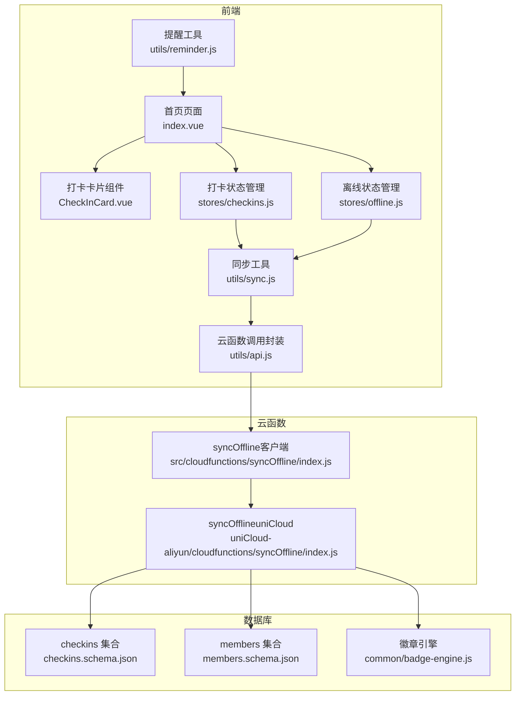
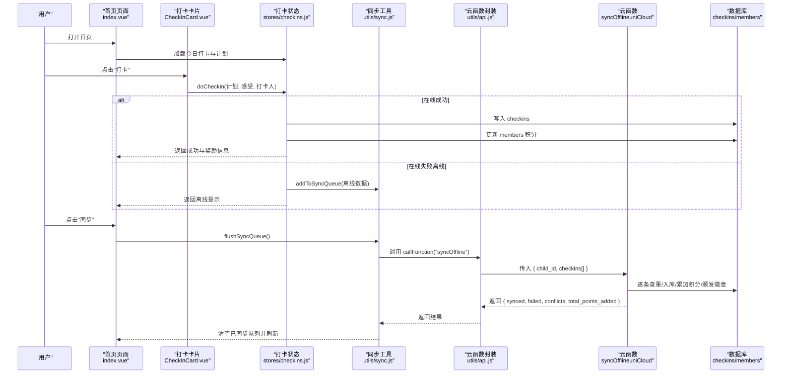
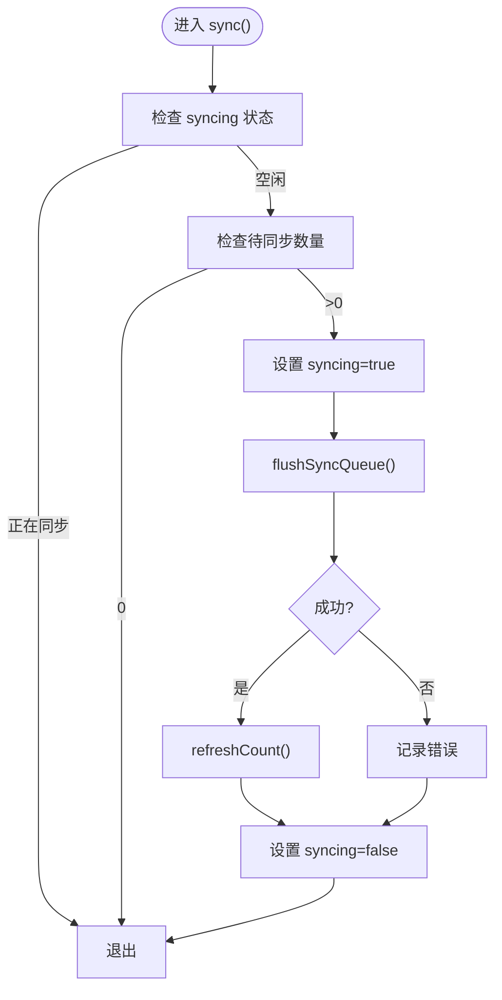
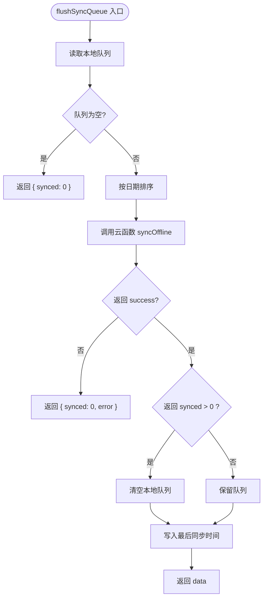
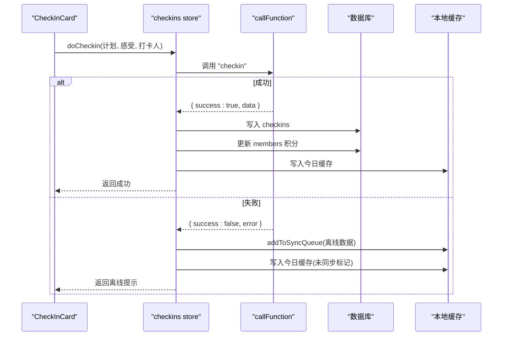
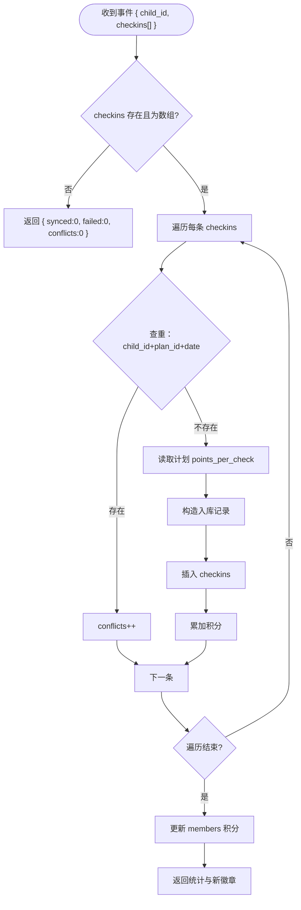
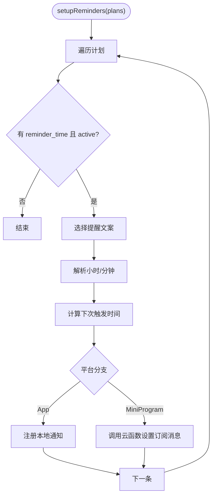
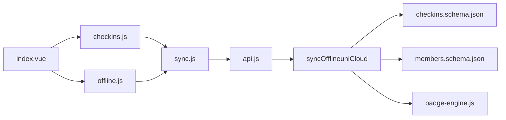

# 离线同步机制

<cite>
**本文引用的文件**
- [offline.js](file://src/stores/offline.js)
- [sync.js](file://src/utils/sync.js)
- [api.js](file://src/utils/api.js)
- [checkins.js](file://src/stores/checkins.js)
- [index.vue](file://src/pages/index/index.vue)
- [CheckInCard.vue](file://src/components/CheckInCard.vue)
- [reminder.js](file://src/utils/reminder.js)
- [syncOffline（客户端）.js](file://src/cloudfunctions/syncOffline/index.js)
- [syncOffline（uniCloud）.js](file://uniCloud-aliyun/cloudfunctions/syncOffline/index.js)
- [checkins.schema.json](file://uniCloud-aliyun/database/checkins.schema.json)
- [members.schema.json](file://uniCloud-aliyun/database/members.schema.json)
- [badge-engine.js](file://uniCloud-aliyun/common/badge-engine.js)
- [const.js](file://uniCloud-aliyun/common/const.js)
</cite>

## 目录
1. [引言](#引言)
2. [项目结构](#项目结构)
3. [核心组件](#核心组件)
4. [架构总览](#架构总览)
5. [详细组件分析](#详细组件分析)
6. [依赖关系分析](#依赖关系分析)
7. [性能考虑](#性能考虑)
8. [故障排除指南](#故障排除指南)
9. [结论](#结论)
10. [附录：API 接口说明](#附录api-接口说明)

## 引言
本技术文档围绕“离线同步机制”展开，系统性阐述离线数据缓存、批量同步与冲突处理的完整实现方案。重点解析 offline store 的设计理念（待同步队列管理、状态标记与优先级排序）、sync 工具函数的实现（数据序列化、批量处理与错误恢复）、syncOffline 云函数的工作原理（数据接收、验证、入库与状态更新），以及离线提醒系统的实现（定时任务、消息推送与用户通知）。文档同时提供 API 接口说明、使用场景与一致性保障策略，并给出性能优化与故障排除建议。

## 项目结构
本项目采用“前端 + 云开发”的混合架构：
- 前端（H5/小程序/App）：通过 Pinia Store 管理状态，使用 uniCloud SDK 调用云函数；离线数据通过本地存储队列暂存。
- 云函数：统一处理离线数据的批量入库、积分与勋章计算等业务逻辑。
- 数据库：通过 JSON Schema 定义集合字段与权限，确保数据一致性与安全。

图表来源
- [index.vue:1-204](file://src/pages/index/index.vue#L1-L204)
- [CheckInCard.vue:1-67](file://src/components/CheckInCard.vue#L1-L67)
- [checkins.js:1-163](file://src/stores/checkins.js#L1-L163)
- [offline.js:1-30](file://src/stores/offline.js#L1-L30)
- [sync.js:1-96](file://src/utils/sync.js#L1-L96)
- [api.js:1-18](file://src/utils/api.js#L1-L18)
- [reminder.js:1-59](file://src/utils/reminder.js#L1-L59)
- [syncOffline（客户端）.js:1-20](file://src/cloudfunctions/syncOffline/index.js#L1-L20)
- [syncOffline（uniCloud）.js:1-90](file://uniCloud-aliyun/cloudfunctions/syncOffline/index.js#L1-L90)
- [checkins.schema.json:1-52](file://uniCloud-aliyun/database/checkins.schema.json#L1-L52)
- [members.schema.json:1-46](file://uniCloud-aliyun/database/members.schema.json#L1-L46)
- [badge-engine.js:1-125](file://uniCloud-aliyun/common/badge-engine.js#L1-L125)

章节来源
- [index.vue:1-204](file://src/pages/index/index.vue#L1-L204)
- [checkins.js:1-163](file://src/stores/checkins.js#L1-L163)
- [offline.js:1-30](file://src/stores/offline.js#L1-L30)
- [sync.js:1-96](file://src/utils/sync.js#L1-L96)
- [api.js:1-18](file://src/utils/api.js#L1-L18)
- [reminder.js:1-59](file://src/utils/reminder.js#L1-L59)
- [syncOffline（客户端）.js:1-20](file://src/cloudfunctions/syncOffline/index.js#L1-L20)
- [syncOffline（uniCloud）.js:1-90](file://uniCloud-aliyun/cloudfunctions/syncOffline/index.js#L1-L90)
- [checkins.schema.json:1-52](file://uniCloud-aliyun/database/checkins.schema.json#L1-L52)
- [members.schema.json:1-46](file://uniCloud-aliyun/database/members.schema.json#L1-L46)
- [badge-engine.js:1-125](file://uniCloud-aliyun/common/badge-engine.js#L1-L125)

## 核心组件
- 离线状态管理（offline store）
  - 维护待同步计数与同步中状态，提供刷新与触发同步的能力。
  - 关键路径：[offline.js:1-30](file://src/stores/offline.js#L1-L30)
- 同步工具（sync 工具）
  - 提供添加到队列、批量同步、获取待同步数量、网络状态检测与智能同步等能力。
  - 关键路径：[sync.js:1-96](file://src/utils/sync.js#L1-L96)
- 云函数调用封装（api 工具）
  - 统一封装 uniCloud.callFunction，返回标准化结果。
  - 关键路径：[api.js:1-18](file://src/utils/api.js#L1-L18)
- 打卡状态管理（checkins store）
  - 在线打卡成功后更新本地缓存；离线时写入本地队列并标记未同步。
  - 关键路径：[checkins.js:1-163](file://src/stores/checkins.js#L1-L163)
- 离线提醒工具（reminder 工具）
  - 支持小程序订阅消息与 App 本地通知，按计划时间生成友好提醒。
  - 关键路径：[reminder.js:1-59](file://src/utils/reminder.js#L1-L59)
- 云函数：批量同步离线打卡（syncOffline）
  - 客户端占位实现与 uniCloud 实际实现分别位于 src 与 uniCloud-aliyun。
  - 关键路径：
    - [syncOffline（客户端）.js:1-20](file://src/cloudfunctions/syncOffline/index.js#L1-L20)
    - [syncOffline（uniCloud）.js:1-90](file://uniCloud-aliyun/cloudfunctions/syncOffline/index.js#L1-L90)
- 数据模型与引擎
  - 数据库 schema 定义集合字段与权限。
  - 徽章引擎负责连续打卡天数计算与勋章颁发。
  - 关键路径：
    - [checkins.schema.json:1-52](file://uniCloud-aliyun/database/checkins.schema.json#L1-L52)
    - [members.schema.json:1-46](file://uniCloud-aliyun/database/members.schema.json#L1-L46)
    - [badge-engine.js:1-125](file://uniCloud-aliyun/common/badge-engine.js#L1-L125)
    - [const.js:1-27](file://uniCloud-aliyun/common/const.js#L1-L27)

章节来源
- [offline.js:1-30](file://src/stores/offline.js#L1-L30)
- [sync.js:1-96](file://src/utils/sync.js#L1-L96)
- [api.js:1-18](file://src/utils/api.js#L1-L18)
- [checkins.js:1-163](file://src/stores/checkins.js#L1-L163)
- [reminder.js:1-59](file://src/utils/reminder.js#L1-L59)
- [syncOffline（客户端）.js:1-20](file://src/cloudfunctions/syncOffline/index.js#L1-L20)
- [syncOffline（uniCloud）.js:1-90](file://uniCloud-aliyun/cloudfunctions/syncOffline/index.js#L1-L90)
- [checkins.schema.json:1-52](file://uniCloud-aliyun/database/checkins.schema.json#L1-L52)
- [members.schema.json:1-46](file://uniCloud-aliyun/database/members.schema.json#L1-L46)
- [badge-engine.js:1-125](file://uniCloud-aliyun/common/badge-engine.js#L1-L125)
- [const.js:1-27](file://uniCloud-aliyun/common/const.js#L1-L27)

## 架构总览
离线同步的整体流程如下：
- 用户在首页点击打卡，触发 checkins store 的 doCheckin。
- 在线成功则直接入库并更新本地缓存；在线失败或异常则将打卡数据加入本地待同步队列。
- 应用进入前台或用户手动点击“同步”，offline store 触发 flushSyncQueue，批量调用云函数 syncOffline。
- 云函数逐条处理，查重、入库、累加积分、颁发徽章，返回统计结果。
- 前端根据返回结果清空已同步队列并刷新界面。

图表来源
- [index.vue:1-204](file://src/pages/index/index.vue#L1-L204)
- [CheckInCard.vue:1-67](file://src/components/CheckInCard.vue#L1-L67)
- [checkins.js:1-163](file://src/stores/checkins.js#L1-L163)
- [sync.js:1-96](file://src/utils/sync.js#L1-L96)
- [api.js:1-18](file://src/utils/api.js#L1-L18)
- [syncOffline（uniCloud）.js:1-90](file://uniCloud-aliyun/cloudfunctions/syncOffline/index.js#L1-L90)
- [checkins.schema.json:1-52](file://uniCloud-aliyun/database/checkins.schema.json#L1-L52)
- [members.schema.json:1-46](file://uniCloud-aliyun/database/members.schema.json#L1-L46)

## 详细组件分析

### offline store 设计与实现
- 待同步队列管理
  - 通过本地存储键值维护队列，支持去重（同计划同日期仅保留一条）。
  - 提供 pendingCount 与 syncing 状态，避免并发同步。
- 状态标记与优先级
  - syncing 防止重复触发；pendingCount 用于 UI 展示与智能同步判断。
- 同步触发
  - sync() 方法在无同步中且队列非空时执行 flushSyncQueue，并在完成后刷新计数。

图表来源
- [offline.js:1-30](file://src/stores/offline.js#L1-L30)
- [sync.js:25-53](file://src/utils/sync.js#L25-L53)

章节来源
- [offline.js:1-30](file://src/stores/offline.js#L1-L30)

### sync 工具函数：序列化、批量与恢复
- 添加到队列
  - addToSyncQueue：去重后追加时间戳，写入本地存储。
- 批量同步
  - flushSyncQueue：按日期排序、调用云函数、清空已同步项、记录最后同步时间。
- 智能同步
  - smartSync：仅在网络可用且有待同步数据时执行。
- 错误恢复
  - try/catch 包裹，失败返回错误信息，保持队列不变。

图表来源
- [sync.js:25-53](file://src/utils/sync.js#L25-L53)

章节来源
- [sync.js:1-96](file://src/utils/sync.js#L1-L96)

### 打卡流程与离线降级
- 在线打卡成功
  - 写入 checkins，更新 members 积分，本地缓存今日记录，展示奖励与徽章。
- 离线降级
  - 捕获异常后将数据加入待同步队列，标记未同步，本地缓存并提示“联网后同步”。

图表来源
- [checkins.js:26-89](file://src/stores/checkins.js#L26-L89)
- [api.js:1-18](file://src/utils/api.js#L1-L18)
- [checkins.schema.json:1-52](file://uniCloud-aliyun/database/checkins.schema.json#L1-L52)
- [members.schema.json:1-46](file://uniCloud-aliyun/database/members.schema.json#L1-L46)

章节来源
- [checkins.js:1-163](file://src/stores/checkins.js#L1-L163)

### syncOffline 云函数工作原理
- 客户端占位实现
  - 作为占位，实际逻辑在 uniCloud 端实现。
- uniCloud 实现要点
  - 输入校验：空数组返回零统计。
  - 去重：按 child_id + plan_id + date 查询，已存在则跳过。
  - 积分：读取计划 points_per_check 或默认值，累加后更新 members。
  - 勋章：调用徽章引擎计算并颁发新徽章。
  - 返回：包含 synced、failed、conflicts、total_points_added、new_badges。

图表来源
- [syncOffline（uniCloud）.js:1-90](file://uniCloud-aliyun/cloudfunctions/syncOffline/index.js#L1-L90)
- [badge-engine.js:1-125](file://uniCloud-aliyun/common/badge-engine.js#L1-L125)
- [const.js:1-27](file://uniCloud-aliyun/common/const.js#L1-L27)

章节来源
- [syncOffline（客户端）.js:1-20](file://src/cloudfunctions/syncOffline/index.js#L1-L20)
- [syncOffline（uniCloud）.js:1-90](file://uniCloud-aliyun/cloudfunctions/syncOffline/index.js#L1-L90)
- [badge-engine.js:1-125](file://uniCloud-aliyun/common/badge-engine.js#L1-L125)
- [const.js:1-27](file://uniCloud-aliyun/common/const.js#L1-L27)

### 离线提醒系统
- 文案池：按计划类别提供多条友好文案，支持自定义。
- 设置提醒：根据计划 reminder_time 与状态 active 注册本地通知或调用云函数设置订阅消息。
- 取消提醒：清理本地通知。
- 触发策略：计算下次触发时间（若已过期则推迟至次日）。

图表来源
- [reminder.js:1-59](file://src/utils/reminder.js#L1-L59)

章节来源
- [reminder.js:1-59](file://src/utils/reminder.js#L1-L59)

### 数据模型与一致性
- checkins 集合
  - 必填字段：plan_id、child_id、date；包含 points_earned、bonus_points、bonus_type、checked_by、feeling、created_at。
- members 集合
  - 字段 current_points、total_points 默认值为 0，支持 upsert 创建。
- 徽章与加成
  - 连续打卡天数计算与加成规则由 badge-engine 与 const 统一管理。

章节来源
- [checkins.schema.json:1-52](file://uniCloud-aliyun/database/checkins.schema.json#L1-L52)
- [members.schema.json:1-46](file://uniCloud-aliyun/database/members.schema.json#L1-L46)
- [badge-engine.js:1-125](file://uniCloud-aliyun/common/badge-engine.js#L1-L125)
- [const.js:1-27](file://uniCloud-aliyun/common/const.js#L1-L27)

## 依赖关系分析
- 组件耦合
  - index.vue 依赖 checkins store 与 offline store，负责触发同步与展示离线提示。
  - checkins store 依赖 sync 工具与 api 封装，实现离线降级与本地缓存。
  - sync 工具依赖 api 封装与本地存储，负责队列管理与批量同步。
  - syncOffline 云函数依赖数据库与徽章引擎，负责幂等入库与奖励发放。
- 外部依赖
  - uniCloud SDK 提供云函数调用与数据库操作。
  - 平台差异：App 使用本地通知，小程序使用订阅消息。

图表来源
- [index.vue:1-204](file://src/pages/index/index.vue#L1-L204)
- [checkins.js:1-163](file://src/stores/checkins.js#L1-L163)
- [offline.js:1-30](file://src/stores/offline.js#L1-L30)
- [sync.js:1-96](file://src/utils/sync.js#L1-L96)
- [api.js:1-18](file://src/utils/api.js#L1-L18)
- [syncOffline（uniCloud）.js:1-90](file://uniCloud-aliyun/cloudfunctions/syncOffline/index.js#L1-L90)
- [checkins.schema.json:1-52](file://uniCloud-aliyun/database/checkins.schema.json#L1-L52)
- [members.schema.json:1-46](file://uniCloud-aliyun/database/members.schema.json#L1-L46)
- [badge-engine.js:1-125](file://uniCloud-aliyun/common/badge-engine.js#L1-L125)

章节来源
- [index.vue:1-204](file://src/pages/index/index.vue#L1-L204)
- [checkins.js:1-163](file://src/stores/checkins.js#L1-L163)
- [offline.js:1-30](file://src/stores/offline.js#L1-L30)
- [sync.js:1-96](file://src/utils/sync.js#L1-L96)
- [api.js:1-18](file://src/utils/api.js#L1-L18)
- [syncOffline（uniCloud）.js:1-90](file://uniCloud-aliyun/cloudfunctions/syncOffline/index.js#L1-L90)
- [checkins.schema.json:1-52](file://uniCloud-aliyun/database/checkins.schema.json#L1-L52)
- [members.schema.json:1-46](file://uniCloud-aliyun/database/members.schema.json#L1-L46)
- [badge-engine.js:1-125](file://uniCloud-aliyun/common/badge-engine.js#L1-L125)

## 性能考虑
- 批量大小控制
  - 当前实现按队列一次性提交；建议根据网络状况与数据量动态分批（如 50 条/批），并在云函数侧增加分页处理。
- 网络状态检测
  - 使用 smartSync 在无网络时跳过同步，减少无效请求；可结合 uni.onNetworkStatusChange 监听网络变化，自动触发同步。
- 本地存储优化
  - 队列与本地缓存采用简单数组存储；建议限制最大长度（如 1000），超出时按时间窗口裁剪。
- 并发与幂等
  - offline store 的 syncing 标记避免重复触发；云函数按 child_id+plan_id+date 去重，保证幂等。
- 用户体验
  - 同步进度与结果反馈：加载提示、成功 Toast、失败错误提示；离线提示显眼位置常驻，支持一键同步。

[本节为通用建议，无需特定文件引用]

## 故障排除指南
- 同步失败
  - 现象：flushSyncQueue 返回 error 或 synced=0。
  - 排查：检查网络状态、云函数返回、数据库连接；查看控制台日志。
  - 处理：重试一次；若仍失败，保留队列等待下次触发。
- 数据丢失
  - 现象：本地队列清空但云端未入库。
  - 排查：确认云函数执行成功；检查去重条件是否正确；核对 child_id 与 plan_id。
  - 处理：重新触发同步；必要时人工补录。
- 网络异常
  - 现象：离线降级频繁发生。
  - 排查：检测设备网络状态；优化 smartSync 触发时机。
  - 处理：引导用户切换网络或稍后重试。
- 勋章未颁发
  - 现象：连续打卡天数满足但未获得徽章。
  - 排查：检查 badge-engine 的 streak 计算与去重逻辑；确认新徽章写入成功。
  - 处理：触发一次强制计算或人工补发。

章节来源
- [sync.js:49-52](file://src/utils/sync.js#L49-L52)
- [syncOffline（uniCloud）.js:15-17](file://uniCloud-aliyun/cloudfunctions/syncOffline/index.js#L15-L17)
- [badge-engine.js:52-122](file://uniCloud-aliyun/common/badge-engine.js#L52-L122)

## 结论
本离线同步机制通过“优先离线、静默同步、冲突幂等”的设计，在弱网环境下保障用户体验与数据一致性。前端以本地队列与状态管理为核心，云函数承担幂等入库与奖励计算，数据库 schema 与徽章引擎提供强约束与激励。配合离线提醒系统，形成从“采集—缓存—同步—反馈”的闭环。

[本节为总结，无需特定文件引用]

## 附录：API 接口说明
- 离线数据提交
  - addToSyncQueue(data)
    - 作用：将一条打卡数据加入本地待同步队列（去重、带时间戳）。
    - 参数：包含 plan_id、child_id、date、feeling、checked_by 等。
    - 返回：无（写入本地存储）。
    - 路径参考：[sync.js:13-20](file://src/utils/sync.js#L13-L20)
- 同步状态查询
  - getPendingCount()
    - 作用：返回本地待同步数量。
    - 返回：数字。
    - 路径参考：[sync.js:58-60](file://src/utils/sync.js#L58-L60)
  - getLastSyncTime()
    - 作用：返回上次同步时间戳。
    - 返回：数字。
    - 路径参考：[sync.js:65-67](file://src/utils/sync.js#L65-L67)
- 冲突解决方法
  - 云端去重：按 child_id + plan_id + date 查询，已存在则跳过。
  - 路径参考：
    - [syncOffline（uniCloud）.js:21-28](file://uniCloud-aliyun/cloudfunctions/syncOffline/index.js#L21-L28)
- 批量同步
  - flushSyncQueue()
    - 作用：读取队列、按日期排序、调用云函数、清空已同步项、记录最后同步时间。
    - 返回：包含 synced、failed、conflicts、total_points_added、new_badges 的对象。
    - 路径参考：[sync.js:25-53](file://src/utils/sync.js#L25-L53)
  - smartSync()
    - 作用：仅在网络可用且有待同步数据时执行 flushSyncQueue。
    - 返回：Promise。
    - 路径参考：[sync.js:84-95](file://src/utils/sync.js#L84-L95)
- 云函数：syncOffline
  - 请求参数：{ child_id, checkins: [ { plan_id, date, feeling, checked_by } ] }
  - 返回：{ success, data: { synced, failed, conflicts, total_points_added, new_badges } }
  - 路径参考：
    - [syncOffline（客户端）.js:2-3](file://src/cloudfunctions/syncOffline/index.js#L2-L3)
    - [syncOffline（uniCloud）.js:5-19](file://uniCloud-aliyun/cloudfunctions/syncOffline/index.js#L5-L19)
- 离线提醒
  - setupReminders(plans)
    - 作用：按计划时间注册本地通知或订阅消息。
    - 路径参考：[reminder.js:19-41](file://src/utils/reminder.js#L19-L41)
  - clearReminders()
    - 作用：清理本地通知。
    - 路径参考：[reminder.js:46-50](file://src/utils/reminder.js#L46-L50)

章节来源
- [sync.js:13-95](file://src/utils/sync.js#L13-L95)
- [syncOffline（客户端）.js:1-20](file://src/cloudfunctions/syncOffline/index.js#L1-L20)
- [syncOffline（uniCloud）.js:1-90](file://uniCloud-aliyun/cloudfunctions/syncOffline/index.js#L1-L90)
- [reminder.js:1-59](file://src/utils/reminder.js#L1-L59)