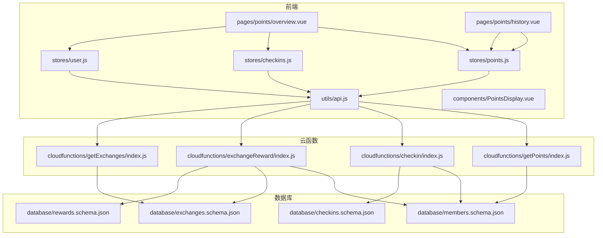
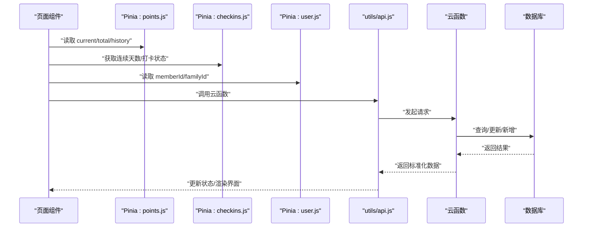
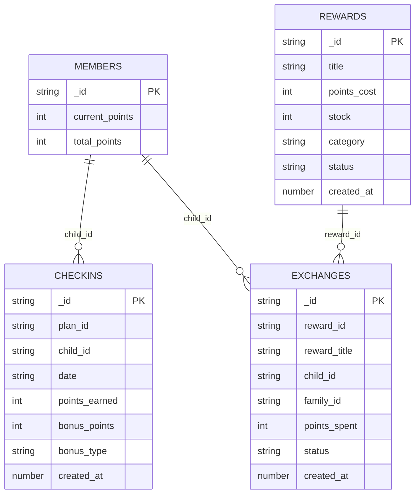
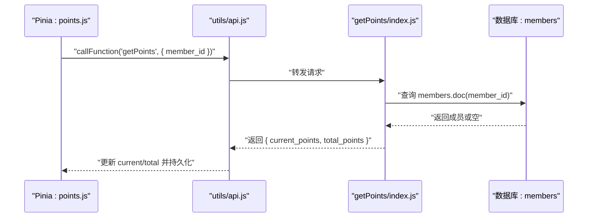
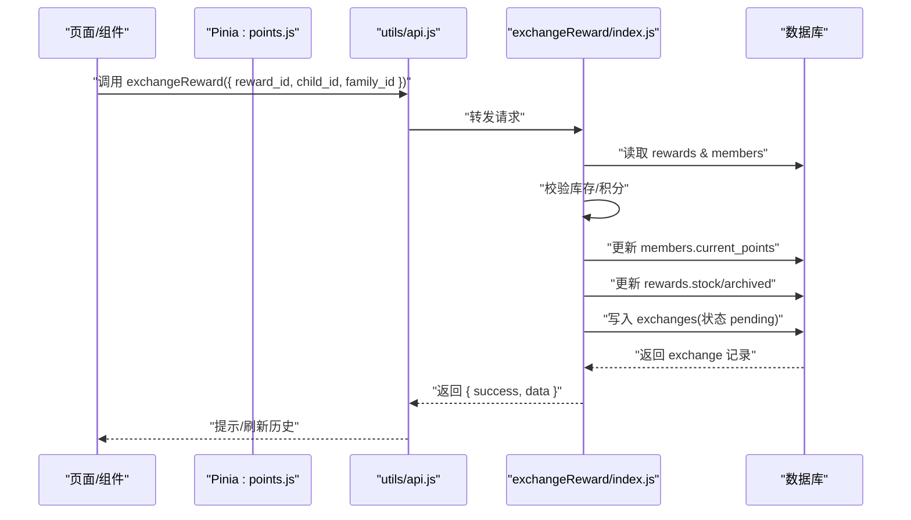
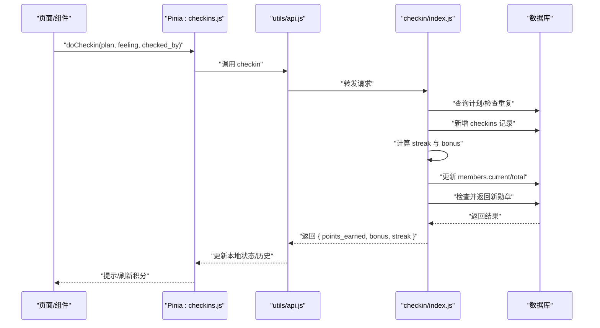
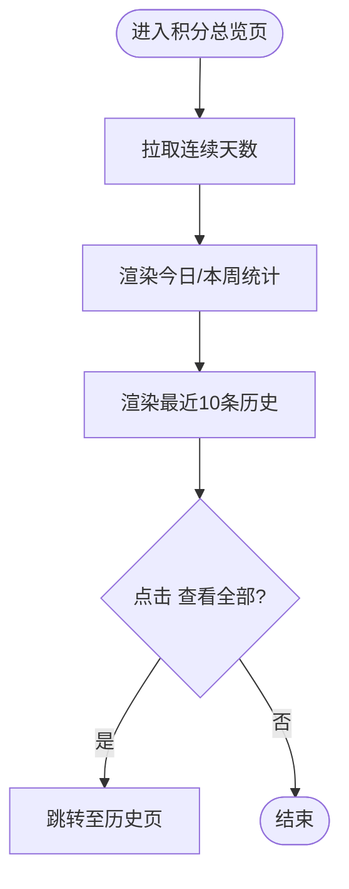
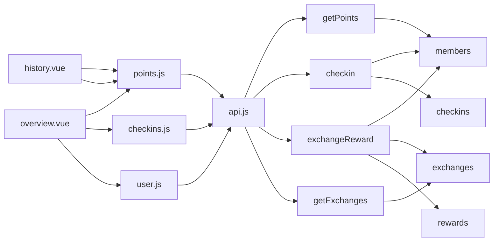

# 积分奖励系统

<cite>
**本文引用的文件**
- [overview.vue](file://src/pages/points/overview.vue)
- [history.vue](file://src/pages/points/history.vue)
- [points.js](file://src/stores/points.js)
- [checkins.js](file://src/stores/checkins.js)
- [user.js](file://src/stores/user.js)
- [api.js](file://src/utils/api.js)
- [PointsDisplay.vue](file://src/components/PointsDisplay.vue)
- [getPoints/index.js](file://uniCloud-aliyun/cloudfunctions/getPoints/index.js)
- [exchangeReward/index.js](file://uniCloud-aliyun/cloudfunctions/exchangeReward/index.js)
- [checkin/index.js](file://uniCloud-aliyun/cloudfunctions/checkin/index.js)
- [getExchanges/index.js](file://uniCloud-aliyun/cloudfunctions/getExchanges/index.js)
- [members.schema.json](file://uniCloud-aliyun/database/members.schema.json)
- [checkins.schema.json](file://uniCloud-aliyun/database/checkins.schema.json)
- [exchanges.schema.json](file://uniCloud-aliyun/database/exchanges.schema.json)
- [rewards.schema.json](file://uniCloud-aliyun/database/rewards.schema.json)
</cite>

## 目录
1. [简介](#简介)
2. [项目结构](#项目结构)
3. [核心组件](#核心组件)
4. [架构总览](#架构总览)
5. [详细组件分析](#详细组件分析)
6. [依赖分析](#依赖分析)
7. [性能考虑](#性能考虑)
8. [故障排除指南](#故障排除指南)
9. [结论](#结论)
10. [附录](#附录)

## 简介
本文件系统性地阐述“积分奖励系统”的业务与技术实现，覆盖积分获取、使用与管理的完整流程；详解数据模型中 currentPoints 与 totalPoints 的区别与用途；文档化积分查询云函数的实现（数据聚合、统计计算与权限控制）；深入分析积分页面组件的设计（overview 与 history 视图的数据展示与交互逻辑）；解释积分使用的业务规则（消耗、记录生成与状态更新）；提供完整的 API 接口说明；给出最佳实践与故障排除建议。

## 项目结构
前端采用 uni-app + Pinia 架构，积分相关页面位于 pages/points 下，状态管理集中在 stores 中，工具层通过 utils/api.js 封装云函数调用；后端云函数位于 uniCloud-aliyun/cloudfunctions，数据库结构定义在 uniCloud-aliyun/database。

图表来源
- [overview.vue:1-115](file://src/pages/points/overview.vue#L1-L115)
- [history.vue:1-27](file://src/pages/points/history.vue#L1-L27)
- [points.js:1-44](file://src/stores/points.js#L1-L44)
- [checkins.js:1-163](file://src/stores/checkins.js#L1-L163)
- [user.js:1-119](file://src/stores/user.js#L1-L119)
- [api.js:1-18](file://src/utils/api.js#L1-L18)
- [PointsDisplay.vue:1-32](file://src/components/PointsDisplay.vue#L1-L32)
- [getPoints/index.js:1-18](file://uniCloud-aliyun/cloudfunctions/getPoints/index.js#L1-L18)
- [checkin/index.js:1-83](file://uniCloud-aliyun/cloudfunctions/checkin/index.js#L1-L83)
- [exchangeReward/index.js:1-53](file://uniCloud-aliyun/cloudfunctions/exchangeReward/index.js#L1-L53)
- [getExchanges/index.js:1-20](file://uniCloud-aliyun/cloudfunctions/getExchanges/index.js#L1-L20)
- [members.schema.json:1-46](file://uniCloud-aliyun/database/members.schema.json#L1-L46)
- [checkins.schema.json:1-52](file://uniCloud-aliyun/database/checkins.schema.json#L1-L52)
- [exchanges.schema.json:1-56](file://uniCloud-aliyun/database/exchanges.schema.json#L1-L56)
- [rewards.schema.json:1-53](file://uniCloud-aliyun/database/rewards.schema.json#L1-L53)

章节来源
- [overview.vue:1-115](file://src/pages/points/overview.vue#L1-L115)
- [history.vue:1-27](file://src/pages/points/history.vue#L1-L27)
- [points.js:1-44](file://src/stores/points.js#L1-L44)
- [checkins.js:1-163](file://src/stores/checkins.js#L1-L163)
- [user.js:1-119](file://src/stores/user.js#L1-L119)
- [api.js:1-18](file://src/utils/api.js#L1-L18)
- [PointsDisplay.vue:1-32](file://src/components/PointsDisplay.vue#L1-L32)
- [getPoints/index.js:1-18](file://uniCloud-aliyun/cloudfunctions/getPoints/index.js#L1-L18)
- [checkin/index.js:1-83](file://uniCloud-aliyun/cloudfunctions/checkin/index.js#L1-L83)
- [exchangeReward/index.js:1-53](file://uniCloud-aliyun/cloudfunctions/exchangeReward/index.js#L1-L53)
- [getExchanges/index.js:1-20](file://uniCloud-aliyun/cloudfunctions/getExchanges/index.js#L1-L20)
- [members.schema.json:1-46](file://uniCloud-aliyun/database/members.schema.json#L1-L46)
- [checkins.schema.json:1-52](file://uniCloud-aliyun/database/checkins.schema.json#L1-L52)
- [exchanges.schema.json:1-56](file://uniCloud-aliyun/database/exchanges.schema.json#L1-L56)
- [rewards.schema.json:1-53](file://uniCloud-aliyun/database/rewards.schema.json#L1-L53)

## 核心组件
- 前端页面
  - 积分总览页：展示当前积分、累计积分、今日/本周获得量、连续打卡天数与最近积分明细入口。
  - 积分明细页：展示完整的积分历史记录。
- 状态管理
  - 积分状态：current（当前可用）、total（累计获得）、history（积分流水）。
  - 打卡状态：今日/本周打卡集合、连续天数计算、离线缓存与同步。
  - 用户状态：成员ID、家庭ID、角色等，支撑权限与数据隔离。
- 工具层
  - 云函数调用封装，统一错误处理与返回格式。
- 组件
  - 积分展示组件：大号数字与星标样式，支持简单动画。

章节来源
- [overview.vue:1-115](file://src/pages/points/overview.vue#L1-L115)
- [history.vue:1-27](file://src/pages/points/history.vue#L1-L27)
- [points.js:1-44](file://src/stores/points.js#L1-L44)
- [checkins.js:1-163](file://src/stores/checkins.js#L1-L163)
- [user.js:1-119](file://src/stores/user.js#L1-L119)
- [PointsDisplay.vue:1-32](file://src/components/PointsDisplay.vue#L1-L32)

## 架构总览
前端通过 Pinia Store 调用 utils/api.js，后者统一调用 uniCloud.callFunction 发起云函数请求；云函数访问数据库集合完成业务处理，并返回标准化结果。

图表来源
- [points.js:1-44](file://src/stores/points.js#L1-L44)
- [checkins.js:1-163](file://src/stores/checkins.js#L1-L163)
- [user.js:1-119](file://src/stores/user.js#L1-L119)
- [api.js:1-18](file://src/utils/api.js#L1-L18)
- [getPoints/index.js:1-18](file://uniCloud-aliyun/cloudfunctions/getPoints/index.js#L1-L18)
- [checkin/index.js:1-83](file://uniCloud-aliyun/cloudfunctions/checkin/index.js#L1-L83)
- [exchangeReward/index.js:1-53](file://uniCloud-aliyun/cloudfunctions/exchangeReward/index.js#L1-L53)
- [getExchanges/index.js:1-20](file://uniCloud-aliyun/cloudfunctions/getExchanges/index.js#L1-L20)

## 详细组件分析

### 数据模型与字段语义
- members 集合
  - current_points：当前可用积分（可消费）。
  - total_points：累计获得积分（只增不减）。
- checkins 集合
  - points_earned：本次打卡获得的总积分（基础+加成）。
  - bonus_points/bonus_type：连续打卡加成及其类型。
- exchanges 集合
  - points_spent：兑换消耗的积分。
  - status：兑换状态（pending/confirmed/cancelled）。
- rewards 集合
  - points_cost：兑换所需积分。
  - stock：库存，-1 表示无限。

图表来源
- [members.schema.json:1-46](file://uniCloud-aliyun/database/members.schema.json#L1-L46)
- [checkins.schema.json:1-52](file://uniCloud-aliyun/database/checkins.schema.json#L1-L52)
- [exchanges.schema.json:1-56](file://uniCloud-aliyun/database/exchanges.schema.json#L1-L56)
- [rewards.schema.json:1-53](file://uniCloud-aliyun/database/rewards.schema.json#L1-L53)

章节来源
- [members.schema.json:1-46](file://uniCloud-aliyun/database/members.schema.json#L1-L46)
- [checkins.schema.json:1-52](file://uniCloud-aliyun/database/checkins.schema.json#L1-L52)
- [exchanges.schema.json:1-56](file://uniCloud-aliyun/database/exchanges.schema.json#L1-L56)
- [rewards.schema.json:1-53](file://uniCloud-aliyun/database/rewards.schema.json#L1-L53)

### currentPoints 与 totalPoints 的区别与用途
- currentPoints：当前可用积分，用于消费与兑换；扣减时需满足余额充足。
- totalPoints：累计获得积分，仅累加不递减，用于统计与展示累计贡献。
- 在前端状态管理中，二者分别持久化存储，保证刷新后不丢失；在云函数查询中按成员文档直接返回。

章节来源
- [points.js:1-44](file://src/stores/points.js#L1-L44)
- [getPoints/index.js:1-18](file://uniCloud-aliyun/cloudfunctions/getPoints/index.js#L1-L18)
- [members.schema.json:1-46](file://uniCloud-aliyun/database/members.schema.json#L1-L46)

### 积分查询云函数实现
- 功能：根据 member_id 查询成员的 current_points 与 total_points。
- 权限控制：members 集合 schema 定义了读权限为 true，确保合法读取。
- 错误兜底：若成员不存在，返回默认 0，避免前端异常。

图表来源
- [points.js:1-44](file://src/stores/points.js#L1-L44)
- [api.js:1-18](file://src/utils/api.js#L1-L18)
- [getPoints/index.js:1-18](file://uniCloud-aliyun/cloudfunctions/getPoints/index.js#L1-L18)
- [members.schema.json:1-46](file://uniCloud-aliyun/database/members.schema.json#L1-L46)

章节来源
- [getPoints/index.js:1-18](file://uniCloud-aliyun/cloudfunctions/getPoints/index.js#L1-L18)
- [members.schema.json:1-46](file://uniCloud-aliyun/database/members.schema.json#L1-L46)

### 积分使用（兑换）业务流程
- 流程概览：校验奖励存在与库存、校验积分余额、原子扣减积分、更新库存与状态、创建兑换记录并返回 pending 状态。
- 关键点：
  - 库存判断：stock=-1 表示无限；>0 时扣减并可能归档。
  - 兑换记录：包含 reward 信息、child_id、family_id、points_spent、status=“pending”。

图表来源
- [exchangeReward/index.js:1-53](file://uniCloud-aliyun/cloudfunctions/exchangeReward/index.js#L1-L53)
- [exchanges.schema.json:1-56](file://uniCloud-aliyun/database/exchanges.schema.json#L1-L56)
- [rewards.schema.json:1-53](file://uniCloud-aliyun/database/rewards.schema.json#L1-L53)
- [members.schema.json:1-46](file://uniCloud-aliyun/database/members.schema.json#L1-L46)

章节来源
- [exchangeReward/index.js:1-53](file://uniCloud-aliyun/cloudfunctions/exchangeReward/index.js#L1-L53)
- [exchanges.schema.json:1-56](file://uniCloud-aliyun/database/exchanges.schema.json#L1-L56)
- [rewards.schema.json:1-53](file://uniCloud-aliyun/database/rewards.schema.json#L1-L53)
- [members.schema.json:1-46](file://uniCloud-aliyun/database/members.schema.json#L1-L46)

### 积分获取（打卡）与加成机制
- 流程概览：检查当日是否已打卡，创建打卡记录，计算连续天数与加成，更新 members 的 current_points 与 total_points，检查解锁新勋章。
- 连续天数与加成：先插入打卡记录，再计算 streak 并回填 bonus 与 total_today。
- 前端联动：doCheckin 成功后将积分加入历史并持久化，同时弹出新勋章提示。

图表来源
- [checkins.js:1-163](file://src/stores/checkins.js#L1-L163)
- [checkin/index.js:1-83](file://uniCloud-aliyun/cloudfunctions/checkin/index.js#L1-L83)
- [members.schema.json:1-46](file://uniCloud-aliyun/database/members.schema.json#L1-L46)
- [checkins.schema.json:1-52](file://uniCloud-aliyun/database/checkins.schema.json#L1-L52)

章节来源
- [checkins.js:1-163](file://src/stores/checkins.js#L1-L163)
- [checkin/index.js:1-83](file://uniCloud-aliyun/cloudfunctions/checkin/index.js#L1-L83)
- [members.schema.json:1-46](file://uniCloud-aliyun/database/members.schema.json#L1-L46)
- [checkins.schema.json:1-52](file://uniCloud-aliyun/database/checkins.schema.json#L1-L52)

### 积分页面组件设计（overview 与 history）
- overview.vue
  - 展示当前积分与累计积分，计算今日/本周获得量，展示最近 10 条历史记录，跳转至完整历史页。
  - 通过 computed 与本地历史数组进行轻量统计，减少网络请求。
- history.vue
  - 展示完整历史列表，格式化时间显示。
- 交互逻辑
  - 页面显示时拉取连续天数信息。
  - 历史项点击跳转详情（此处为明细页，无额外详情页，跳转至历史页）。

图表来源
- [overview.vue:1-115](file://src/pages/points/overview.vue#L1-L115)
- [history.vue:1-27](file://src/pages/points/history.vue#L1-L27)

章节来源
- [overview.vue:1-115](file://src/pages/points/overview.vue#L1-L115)
- [history.vue:1-27](file://src/pages/points/history.vue#L1-L27)

### 积分使用的业务规则与状态更新
- 扣减规则：仅当 current_points ≥ cost 时允许兑换；否则返回失败。
- 记录生成：创建 exchanges 文档，初始状态为 pending。
- 库存与归档：库存 >0 时扣减，<=0 时将奖励状态归档。
- 状态流转：后续由家长或运营人员确认/取消，状态更新为 confirmed/cancelled。

章节来源
- [exchangeReward/index.js:1-53](file://uniCloud-aliyun/cloudfunctions/exchangeReward/index.js#L1-L53)
- [exchanges.schema.json:1-56](file://uniCloud-aliyun/database/exchanges.schema.json#L1-L56)
- [rewards.schema.json:1-53](file://uniCloud-aliyun/database/rewards.schema.json#L1-L53)

### API 接口说明
- 积分查询
  - 云函数：getPoints
  - 请求参数：{ member_id }
  - 返回：{ current_points, total_points }
- 打卡获取积分
  - 云函数：checkin
  - 请求参数：{ plan_id, child_id, date, checked_by, feeling }
  - 返回：{ points_earned, bonus_points, bonus_type, total_today, new_badges, current_streak }
- 取消打卡（退回积分）
  - 云函数：cancelCheckin（在 checkins.js 中调用）
  - 返回：{ success, refunded }
- 兑换奖励
  - 云函数：exchangeReward
  - 请求参数：{ reward_id, child_id, family_id }
  - 返回：{ success, data: exchange }
- 兑换记录查询
  - 云函数：getExchanges
  - 请求参数：{ child_id?, status?, family_id? }
  - 返回：{ success, data: exchanges[] }

章节来源
- [getPoints/index.js:1-18](file://uniCloud-aliyun/cloudfunctions/getPoints/index.js#L1-L18)
- [checkin/index.js:1-83](file://uniCloud-aliyun/cloudfunctions/checkin/index.js#L1-L83)
- [checkins.js:1-163](file://src/stores/checkins.js#L1-L163)
- [exchangeReward/index.js:1-53](file://uniCloud-aliyun/cloudfunctions/exchangeReward/index.js#L1-L53)
- [getExchanges/index.js:1-20](file://uniCloud-aliyun/cloudfunctions/getExchanges/index.js#L1-L20)

## 依赖分析
- 前端耦合
  - pages 依赖 stores；stores 依赖 utils/api.js；utils 依赖 uniCloud.callFunction。
- 后端耦合
  - 云函数依赖数据库集合 schema；部分云函数依赖公共引擎（如徽章计算）。
- 数据一致性
  - 积分增减通过数据库原子操作（inc）保证；兑换流程在单次请求内完成，避免中间态。

图表来源
- [overview.vue:1-115](file://src/pages/points/overview.vue#L1-L115)
- [history.vue:1-27](file://src/pages/points/history.vue#L1-L27)
- [points.js:1-44](file://src/stores/points.js#L1-L44)
- [checkins.js:1-163](file://src/stores/checkins.js#L1-L163)
- [user.js:1-119](file://src/stores/user.js#L1-L119)
- [api.js:1-18](file://src/utils/api.js#L1-L18)
- [getPoints/index.js:1-18](file://uniCloud-aliyun/cloudfunctions/getPoints/index.js#L1-L18)
- [checkin/index.js:1-83](file://uniCloud-aliyun/cloudfunctions/checkin/index.js#L1-L83)
- [exchangeReward/index.js:1-53](file://uniCloud-aliyun/cloudfunctions/exchangeReward/index.js#L1-L53)
- [getExchanges/index.js:1-20](file://uniCloud-aliyun/cloudfunctions/getExchanges/index.js#L1-L20)
- [members.schema.json:1-46](file://uniCloud-aliyun/database/members.schema.json#L1-L46)
- [checkins.schema.json:1-52](file://uniCloud-aliyun/database/checkins.schema.json#L1-L52)
- [exchanges.schema.json:1-56](file://uniCloud-aliyun/database/exchanges.schema.json#L1-L56)
- [rewards.schema.json:1-53](file://uniCloud-aliyun/database/rewards.schema.json#L1-L53)

## 性能考虑
- 前端
  - 本地缓存：积分与打卡历史使用本地存储，降低频繁网络请求；注意在离线场景下及时同步。
  - 轻量统计：overview 侧通过本地 history 数组进行日/周统计，避免重复请求。
- 后端
  - 单次兑换事务：在云函数内完成扣减、库存与记录创建，减少跨请求的并发风险。
  - 查询索引：建议在 members.family_id、checkins.child_id/date、exchanges.child_id/status 上建立索引以提升查询性能。
- 网络
  - 统一错误处理：api.js 对云函数调用失败进行捕获与提示，避免前端崩溃。

## 故障排除指南
- 积分异常（余额不足）
  - 现象：兑换失败，提示积分不足。
  - 排查：确认 members.current_points 是否正确更新；核对兑换时的 cost 与库存。
- 数据不一致
  - 现象：前端显示与后端不一致。
  - 排查：检查本地缓存是否过期；确认离线同步队列是否成功执行；必要时强制刷新积分。
- 权限问题
  - 现象：无法查询/更新积分。
  - 排查：确认 members 集合读写权限；核对 family_id 隔离是否正确传入；检查用户登录状态与 memberId。
- 兑换状态异常
  - 现象：兑换记录状态长期为 pending。
  - 排查：检查后续确认/取消流程是否执行；核对 exchanges.status 字段更新逻辑。

章节来源
- [points.js:1-44](file://src/stores/points.js#L1-L44)
- [checkins.js:1-163](file://src/stores/checkins.js#L1-L163)
- [user.js:1-119](file://src/stores/user.js#L1-L119)
- [exchangeReward/index.js:1-53](file://uniCloud-aliyun/cloudfunctions/exchangeReward/index.js#L1-L53)
- [getExchanges/index.js:1-20](file://uniCloud-aliyun/cloudfunctions/getExchanges/index.js#L1-L20)

## 结论
本系统通过清晰的前后端职责划分与标准的云函数接口，实现了从积分获取、加成计算、历史记录到兑换与状态管理的完整闭环。currentPoints 与 totalPoints 的分离设计既满足消费需求又保留累计统计价值；通过本地缓存与原子操作保障了用户体验与数据一致性。建议在生产环境中进一步完善索引策略、离线同步与状态机治理，持续优化性能与稳定性。

## 附录
- 最佳实践
  - 积分规则配置：在 plans.rewards 中统一维护积分与库存；通过 family_id 实现多家庭隔离。
  - 性能优化：对高频查询字段建立索引；限制历史记录长度，避免内存膨胀。
  - 数据一致性：使用数据库命令 inc 原子更新；对关键路径增加幂等与重试机制。
- 使用场景示例
  - 孩子每日打卡：触发 checkin 云函数，自动更新 current/total 并生成历史。
  - 家长兑换：调用 exchangeReward，创建 pending 记录，后续确认后完成扣减与库存更新。
  - 统计报表：通过 getExchanges 查询指定状态与时间范围的兑换记录，生成周报/月报。