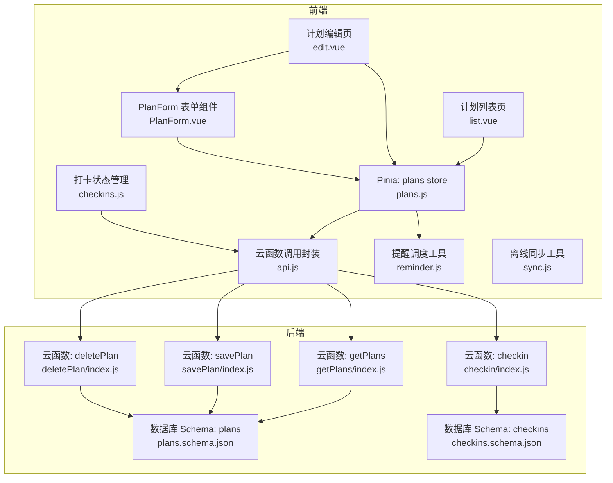
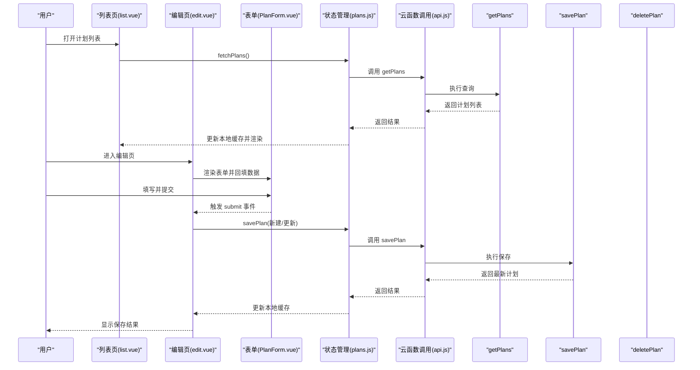
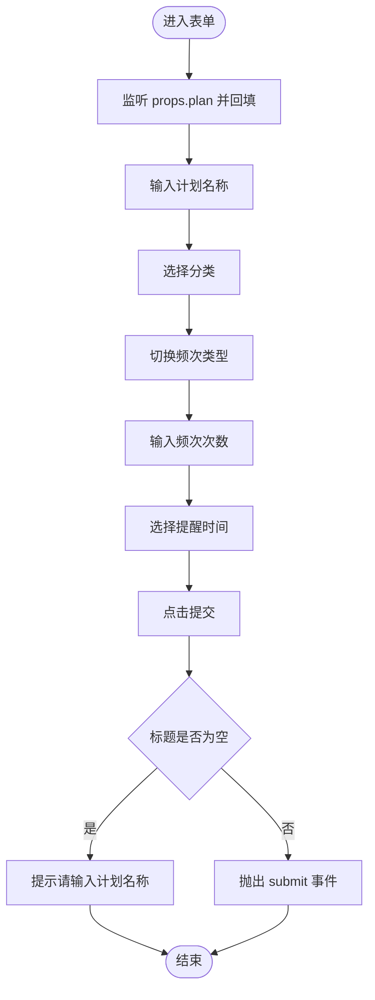
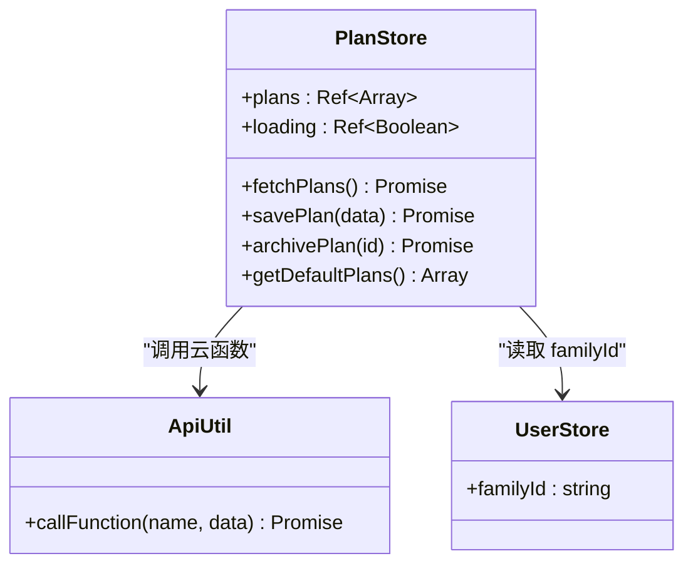
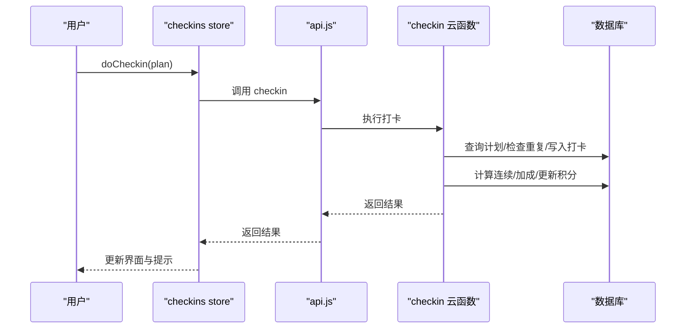
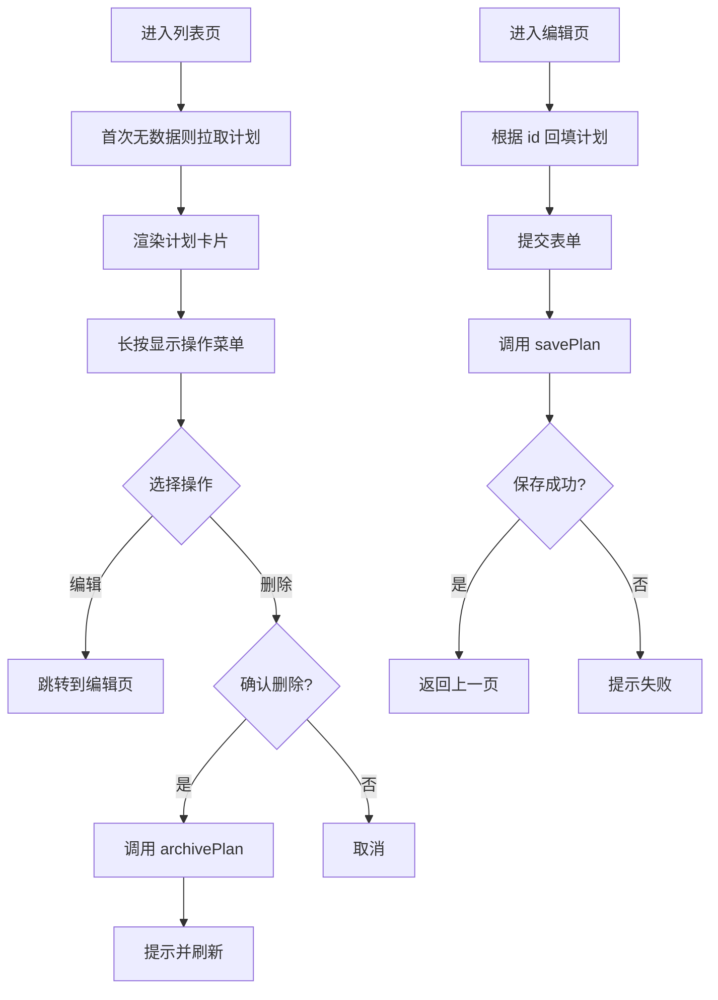
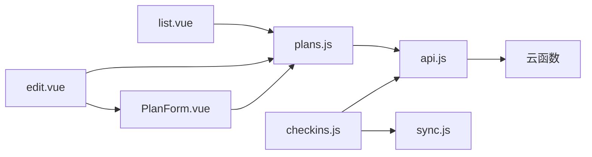

# 计划管理功能

<cite>
**本文引用的文件**
- [PlanForm.vue](file://src/components/PlanForm.vue)
- [plans.js](file://src/stores/plans.js)
- [list.vue](file://src/pages/plan/list.vue)
- [edit.vue](file://src/pages/plan/edit.vue)
- [api.js](file://src/utils/api.js)
- [user.js](file://src/stores/user.js)
- [getPlans/index.js](file://uniCloud-aliyun/cloudfunctions/getPlans/index.js)
- [savePlan/index.js](file://uniCloud-aliyun/cloudfunctions/savePlan/index.js)
- [deletePlan/index.js](file://uniCloud-aliyun/cloudfunctions/deletePlan/index.js)
- [checkin/index.js](file://uniCloud-aliyun/cloudfunctions/checkin/index.js)
- [reminder.js](file://src/utils/reminder.js)
- [checkins.js](file://src/stores/checkins.js)
- [sync.js](file://src/utils/sync.js)
- [plans.schema.json](file://uniCloud-aliyun/database/plans.schema.json)
- [checkins.schema.json](file://uniCloud-aliyun/database/checkins.schema.json)
</cite>

## 目录
1. [简介](#简介)
2. [项目结构](#项目结构)
3. [核心组件](#核心组件)
4. [架构总览](#架构总览)
5. [详细组件分析](#详细组件分析)
6. [依赖分析](#依赖分析)
7. [性能考虑](#性能考虑)
8. [故障排除指南](#故障排除指南)
9. [结论](#结论)
10. [附录](#附录)

## 简介
本文件系统性地文档化“计划管理”功能，覆盖日常任务计划的创建、编辑、删除与查询全流程；深入解析 PlanForm 表单组件的设计与实现（含验证、数据绑定与交互）；阐述 Pinia store 中 plans 的状态管理机制；详解云函数 getPlans、savePlan、deletePlan 的业务逻辑与数据处理；明确计划数据模型与与打卡系统的集成关系；提供完整的 API 接口说明与最佳实践建议，并给出故障排除方案。

## 项目结构
计划管理功能涉及前端页面、表单组件、状态管理、工具库与后端云函数/数据库 Schema 的协同工作：

- 前端页面
  - 计划列表页：展示计划卡片、长按操作菜单、新增入口
  - 计划编辑页：承载 PlanForm 组件，提交保存
- 表单组件：PlanForm，负责计划字段输入、分类选择、频次设置、提醒配置与基础校验
- 状态管理：Pinia store plans，负责计划列表、加载状态、远程拉取与本地缓存
- 工具库：api.js 封装云函数调用；reminder.js 负责提醒设置；sync.js 负责离线同步
- 云函数：getPlans、savePlan、deletePlan；与 checkin 集成
- 数据库 Schema：plans、checkins

图表来源
- [list.vue:1-133](file://src/pages/plan/list.vue#L1-L133)
- [edit.vue:1-35](file://src/pages/plan/edit.vue#L1-L35)
- [PlanForm.vue:1-119](file://src/components/PlanForm.vue#L1-L119)
- [plans.js:1-73](file://src/stores/plans.js#L1-L73)
- [api.js:1-18](file://src/utils/api.js#L1-L18)
- [reminder.js:1-59](file://src/utils/reminder.js#L1-L59)
- [sync.js:1-96](file://src/utils/sync.js#L1-L96)
- [checkins.js:1-163](file://src/stores/checkins.js#L1-L163)
- [getPlans/index.js:1-15](file://uniCloud-aliyun/cloudfunctions/getPlans/index.js#L1-L15)
- [savePlan/index.js:1-31](file://uniCloud-aliyun/cloudfunctions/savePlan/index.js#L1-L31)
- [deletePlan/index.js:1-25](file://uniCloud-aliyun/cloudfunctions/deletePlan/index.js#L1-L25)
- [checkin/index.js:1-83](file://uniCloud-aliyun/cloudfunctions/checkin/index.js#L1-L83)
- [plans.schema.json:1-50](file://uniCloud-aliyun/database/plans.schema.json#L1-L50)
- [checkins.schema.json:1-52](file://uniCloud-aliyun/database/checkins.schema.json#L1-L52)

章节来源
- [list.vue:1-133](file://src/pages/plan/list.vue#L1-L133)
- [edit.vue:1-35](file://src/pages/plan/edit.vue#L1-L35)
- [PlanForm.vue:1-119](file://src/components/PlanForm.vue#L1-L119)
- [plans.js:1-73](file://src/stores/plans.js#L1-L73)
- [api.js:1-18](file://src/utils/api.js#L1-L18)
- [reminder.js:1-59](file://src/utils/reminder.js#L1-L59)
- [sync.js:1-96](file://src/utils/sync.js#L1-L96)
- [checkins.js:1-163](file://src/stores/checkins.js#L1-L163)
- [getPlans/index.js:1-15](file://uniCloud-aliyun/cloudfunctions/getPlans/index.js#L1-L15)
- [savePlan/index.js:1-31](file://uniCloud-aliyun/cloudfunctions/savePlan/index.js#L1-L31)
- [deletePlan/index.js:1-25](file://uniCloud-aliyun/cloudfunctions/deletePlan/index.js#L1-L25)
- [checkin/index.js:1-83](file://uniCloud-aliyun/cloudfunctions/checkin/index.js#L1-L83)
- [plans.schema.json:1-50](file://uniCloud-aliyun/database/plans.schema.json#L1-L50)
- [checkins.schema.json:1-52](file://uniCloud-aliyun/database/checkins.schema.json#L1-L52)

## 核心组件
- PlanForm 表单组件：提供计划名称、分类、频次、每次积分、提醒时间等字段的输入与校验；在编辑模式下通过 watch 将传入的 plan 对象回填至表单；提交时进行基础必填校验并通过事件向外抛出数据。
- Pinia plans store：封装计划列表、加载状态、远程拉取、保存（新建/更新）、归档（删除）与默认计划模板；统一通过 api.js 调用云函数；使用本地缓存提升离线体验。
- 页面层：list.vue 展示计划卡片与操作菜单；edit.vue 承载表单并调用 store 保存。

章节来源
- [PlanForm.vue:52-88](file://src/components/PlanForm.vue#L52-L88)
- [plans.js:9-71](file://src/stores/plans.js#L9-L71)
- [list.vue:46-93](file://src/pages/plan/list.vue#L46-L93)
- [edit.vue:7-30](file://src/pages/plan/edit.vue#L7-L30)

## 架构总览
计划管理采用“前端页面/组件 + Pinia store + 云函数 + 数据库 Schema”的分层架构。用户在列表页浏览计划，在编辑页通过 PlanForm 输入并提交；store 统一发起云函数调用；云函数访问数据库 plans；与打卡系统通过 checkin 云函数联动，实现积分、连续打卡与勋章奖励。

图表来源
- [list.vue:57-59](file://src/pages/plan/list.vue#L57-L59)
- [plans.js:14-28](file://src/stores/plans.js#L14-L28)
- [edit.vue:22-30](file://src/pages/plan/edit.vue#L22-L30)
- [PlanForm.vue:85-88](file://src/components/PlanForm.vue#L85-L88)
- [api.js:9-17](file://src/utils/api.js#L9-L17)
- [getPlans/index.js:4-14](file://uniCloud-aliyun/cloudfunctions/getPlans/index.js#L4-L14)
- [savePlan/index.js:4-30](file://uniCloud-aliyun/cloudfunctions/savePlan/index.js#L4-L30)

## 详细组件分析

### PlanForm 组件分析
- 设计要点
  - 分类网格：支持阅读、学习、运动、生活、自定义五类，点击切换选中态
  - 频次设置：支持每日/每周两种类型与次数输入
  - 提醒时间：使用时间选择器，支持空值（不提醒）
  - 基础校验：标题必填，为空时提示
  - 数据绑定：使用 v-model 实现双向绑定；编辑模式通过 watch 将 props.plan 回填
- 交互逻辑
  - 点击分类项设置 category
  - 切换频次类型与次数
  - 时间选择器变更时更新 reminder_time
  - 点击提交按钮触发校验并抛出 submit 事件

图表来源
- [PlanForm.vue:79-88](file://src/components/PlanForm.vue#L79-L88)

章节来源
- [PlanForm.vue:52-88](file://src/components/PlanForm.vue#L52-L88)

### Pinia store: plans 状态管理
- 状态
  - plans: 计划数组，来自本地缓存或云函数返回
  - loading: 加载状态
- 方法
  - fetchPlans: 调用 getPlans，按创建时间倒序返回，更新缓存
  - savePlan: 调用 savePlan，区分新建/更新，更新本地缓存
  - archivePlan: 调用 deletePlan，过滤掉被删除计划并更新缓存
  - getDefaultPlans: 返回默认计划模板
- 关键点
  - 通过 api.js 统一调用云函数
  - 使用本地缓存提升首屏速度与离线可用性
  - 依赖 user.js 中的 familyId 进行家庭隔离

图表来源
- [plans.js:9-71](file://src/stores/plans.js#L9-L71)
- [api.js:9-17](file://src/utils/api.js#L9-L17)
- [user.js:8-10](file://src/stores/user.js#L8-L10)

章节来源
- [plans.js:9-71](file://src/stores/plans.js#L9-L71)
- [user.js:7-118](file://src/stores/user.js#L7-L118)

### 云函数实现与数据模型

#### getPlans
- 功能：根据 family_id 查询计划列表，按 created_at 倒序返回
- 参数：event.family_id
- 返回：success 与 data（计划数组）

章节来源
- [getPlans/index.js:4-14](file://uniCloud-aliyun/cloudfunctions/getPlans/index.js#L4-L14)

#### savePlan
- 功能：新建或更新计划
  - 更新：接收 _id，更新 title/description/points_per_check/category/icon，并返回最新记录
  - 新建：填充默认字段（category/icon/status/created_at），返回新记录
- 参数：_id、title、description、family_id、points_per_check、category、icon
- 返回：success 与 data（计划对象）

章节来源
- [savePlan/index.js:4-30](file://uniCloud-aliyun/cloudfunctions/savePlan/index.js#L4-L30)

#### deletePlan
- 功能：删除计划并级联删除该计划下的打卡记录
  - 权限校验：若提供 family_id，需确保 plan.family_id 匹配，否则拒绝删除
- 参数：plan_id、family_id
- 返回：success 或错误信息

章节来源
- [deletePlan/index.js:4-24](file://uniCloud-aliyun/cloudfunctions/deletePlan/index.js#L4-L24)

#### 数据模型
- plans 集合
  - 必填字段：title、family_id、points_per_check、category
  - 默认值：status=active、points_per_check=10
  - 其他字段：description、icon、created_at 等
- checkins 集合
  - 必填字段：plan_id、child_id、date
  - 字段：checked_by、feeling、points_earned、bonus_points、bonus_type、created_at

章节来源
- [plans.schema.json:1-50](file://uniCloud-aliyun/database/plans.schema.json#L1-L50)
- [checkins.schema.json:1-52](file://uniCloud-aliyun/database/checkins.schema.json#L1-L52)

### 计划与打卡系统的集成
- 打卡流程
  - 用户在打卡页对某计划执行打卡，调用 checkin 云函数
  - 云函数读取计划 points_per_check，检查当日是否已打卡，插入打卡记录
  - 计算连续打卡并发放加成，更新成员积分，检查并发放勋章
- 离线与同步
  - 打卡异常时，checkins store 将数据加入本地队列并标记未同步
  - sync.js 支持智能同步，按日期排序批量上传，以云端为准进行幂等处理

图表来源
- [checkins.js:26-89](file://src/stores/checkins.js#L26-L89)
- [checkin/index.js:5-82](file://uniCloud-aliyun/cloudfunctions/checkin/index.js#L5-L82)
- [sync.js:25-53](file://src/utils/sync.js#L25-L53)

章节来源
- [checkins.js:1-163](file://src/stores/checkins.js#L1-L163)
- [checkin/index.js:1-83](file://uniCloud-aliyun/cloudfunctions/checkin/index.js#L1-L83)
- [sync.js:1-96](file://src/utils/sync.js#L1-L96)

### 页面与交互流程
- 计划列表页
  - 首次进入自动拉取计划；长按显示操作菜单（编辑/删除）
  - 删除前二次确认，调用 store 的 archivePlan，成功后提示
- 计划编辑页
  - onLoad 读取 query.id 定位编辑计划；提交时合并表单数据并调用 store.savePlan

图表来源
- [list.vue:57-93](file://src/pages/plan/list.vue#L57-L93)
- [edit.vue:16-30](file://src/pages/plan/edit.vue#L16-L30)

章节来源
- [list.vue:1-133](file://src/pages/plan/list.vue#L1-L133)
- [edit.vue:1-35](file://src/pages/plan/edit.vue#L1-L35)

## 依赖分析
- 组件耦合
  - list.vue 依赖 plans store 与本地缓存策略
  - edit.vue 依赖 PlanForm 与 plans store
  - PlanForm 仅依赖 props 与内部状态，低耦合
- 状态管理
  - plans store 依赖 api.js 与 user.store.familyId
  - checkins store 依赖 api.js 与 sync.js
- 云函数依赖
  - getPlans/ savePlan/ deletePlan 依赖数据库 plans
  - checkin 依赖数据库 plans 与 checkins，并联动勋章引擎

图表来源
- [list.vue:49-51](file://src/pages/plan/list.vue#L49-L51)
- [edit.vue:10-11](file://src/pages/plan/edit.vue#L10-L11)
- [PlanForm.vue:55-59](file://src/components/PlanForm.vue#L55-L59)
- [plans.js:6-7](file://src/stores/plans.js#L6-L7)
- [api.js:9-17](file://src/utils/api.js#L9-L17)
- [checkins.js:4-7](file://src/stores/checkins.js#L4-L7)
- [sync.js:30-35](file://src/utils/sync.js#L30-L35)

章节来源
- [list.vue:46-51](file://src/pages/plan/list.vue#L46-L51)
- [edit.vue:7-11](file://src/pages/plan/edit.vue#L7-L11)
- [PlanForm.vue:52-59](file://src/components/PlanForm.vue#L52-L59)
- [plans.js:1-73](file://src/stores/plans.js#L1-L73)
- [api.js:1-18](file://src/utils/api.js#L1-L18)
- [checkins.js:1-163](file://src/stores/checkins.js#L1-L163)
- [sync.js:1-96](file://src/utils/sync.js#L1-L96)

## 性能考虑
- 首屏性能
  - plans.store 使用本地缓存作为后备，减少网络请求等待
  - 列表页 onShow 仅在无数据时拉取，避免重复请求
- 网络健壮性
  - 云函数调用封装统一捕获异常，返回结构化错误
  - 打卡失败时立即落盘本地队列，保证不丢失
- 同步策略
  - sync.js 按日期排序批量上传，减少多次请求开销
  - 智能同步仅在网络可用时触发，降低无效调用

## 故障排除指南
- 无法加载计划
  - 现象：列表空白或加载失败
  - 排查：确认 user.store.familyId 是否正确；检查 getPlans 返回；查看本地缓存是否存在
- 保存失败
  - 现象：编辑页保存提示失败
  - 排查：检查 savePlan 返回；确认必填字段（title/family_id/points_per_check/category）是否齐全
- 删除失败或越权
  - 现象：删除报错或无效果
  - 排查：deletePlan 会校验 family_id，确认传入参数与计划所属家庭一致
- 打卡重复或失败
  - 现象：提示“今天已打卡”或离线提示
  - 排查：checkin 云函数会检查当日重复；离线时 checkins.store 会写入本地队列并提示“待同步”
- 同步未生效
  - 现象：本地数据长时间未上传
  - 排查：确认网络状态；调用 smartSync；检查 pending_sync 队列与 last_sync_at

章节来源
- [plans.js:14-28](file://src/stores/plans.js#L14-L28)
- [api.js:9-17](file://src/utils/api.js#L9-L17)
- [deletePlan/index.js:8-15](file://uniCloud-aliyun/cloudfunctions/deletePlan/index.js#L8-L15)
- [checkin/index.js:14-20](file://uniCloud-aliyun/cloudfunctions/checkin/index.js#L14-L20)
- [checkins.js:77-89](file://src/stores/checkins.js#L77-L89)
- [sync.js:84-95](file://src/utils/sync.js#L84-L95)

## 结论
计划管理功能通过清晰的页面/组件分层、Pinia 状态管理与云函数协作，实现了从创建到删除的完整生命周期；结合提醒与离线同步机制，提升了用户体验与数据可靠性。建议在后续迭代中进一步增强表单校验规则、权限控制与错误可视化提示。

## 附录

### API 接口文档

- 获取计划列表
  - 方法：getPlans
  - 请求参数
    - family_id: 家庭标识（字符串）
  - 成功响应
    - success: true
    - data: 计划数组（按 created_at 倒序）
  - 错误响应
    - success: false
    - error: 错误信息

- 保存计划
  - 方法：savePlan
  - 请求参数
    - _id: 计划标识（可选，用于更新）
    - title: 计划名称（必填）
    - description: 描述（可选）
    - family_id: 家庭标识（必填）
    - points_per_check: 每次打卡积分（可选，默认10）
    - category: 分类（必填）
    - icon: 图标（可选）
  - 成功响应
    - success: true
    - data: 保存后的计划对象
  - 错误响应
    - success: false
    - error: 错误信息

- 删除计划
  - 方法：deletePlan
  - 请求参数
    - plan_id: 计划标识（必填）
    - family_id: 家庭标识（可选，用于权限校验）
  - 成功响应
    - success: true
  - 错误响应
    - success: false
    - error: 无权删除该计划

- 打卡
  - 方法：checkin
  - 请求参数
    - plan_id: 计划标识（必填）
    - child_id: 孩子成员标识（必填）
    - date: 日期（YYYY-MM-DD，必填）
    - checked_by: 打卡人（self/parent，默认self）
    - feeling: 感受（可选）
  - 成功响应
    - success: true
    - data.checkin_id: 打卡记录标识
    - data.points_earned: 获得积分
    - data.bonus_points: 加成积分
    - data.bonus_type: 加成类型
    - data.total_today: 今日总计
    - data.new_badges: 解锁的新勋章列表
    - data.current_streak: 当前连续天数
  - 错误响应
    - success: false
    - error: 已打卡/其他错误

章节来源
- [getPlans/index.js:4-14](file://uniCloud-aliyun/cloudfunctions/getPlans/index.js#L4-L14)
- [savePlan/index.js:6-29](file://uniCloud-aliyun/cloudfunctions/savePlan/index.js#L6-L29)
- [deletePlan/index.js:6-23](file://uniCloud-aliyun/cloudfunctions/deletePlan/index.js#L6-L23)
- [checkin/index.js:7-81](file://uniCloud-aliyun/cloudfunctions/checkin/index.js#L7-L81)

### 最佳实践
- 表单设计
  - 使用分类网格与频次开关提升选择效率
  - 为必填字段添加即时校验与提示
- 数据验证
  - 前端最小校验（必填/数值范围），后端严格约束（Schema）
- 用户体验
  - 本地缓存兜底与智能同步，保证弱网可用
  - 提醒文案按分类动态选择，增强亲和力