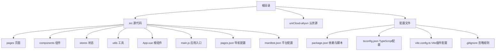
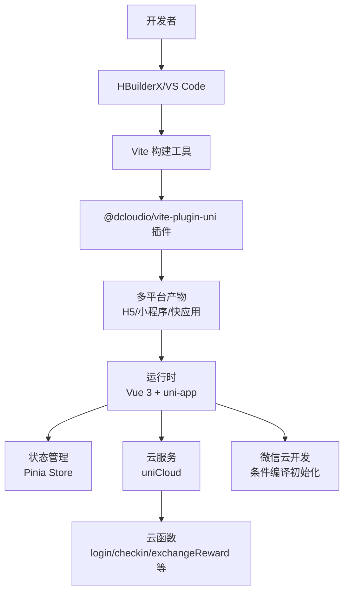
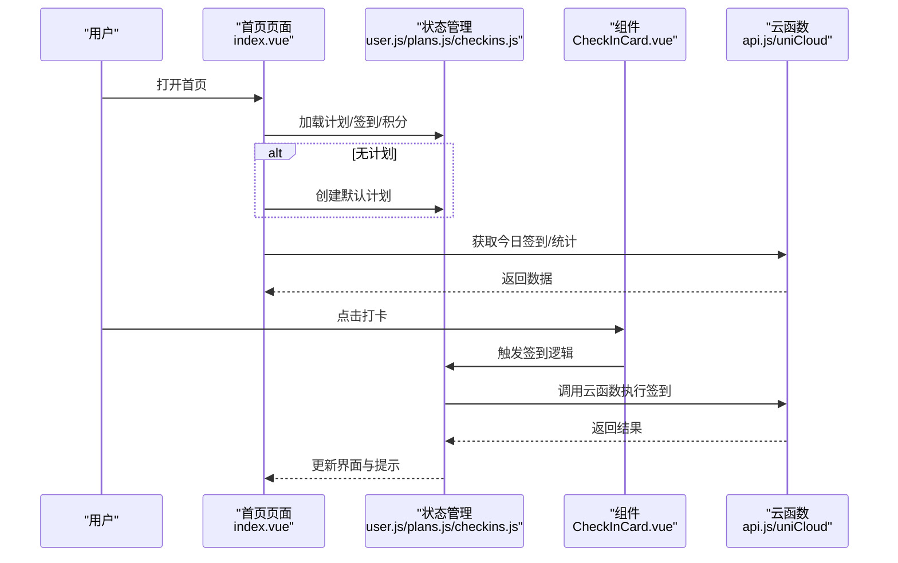
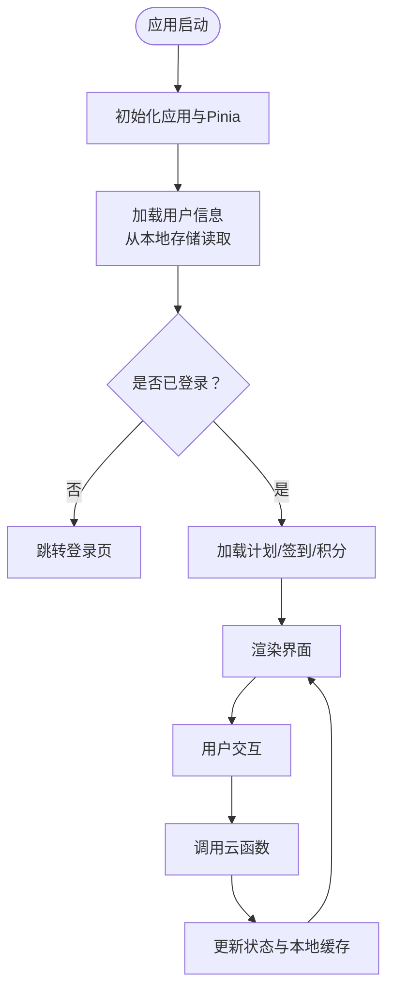
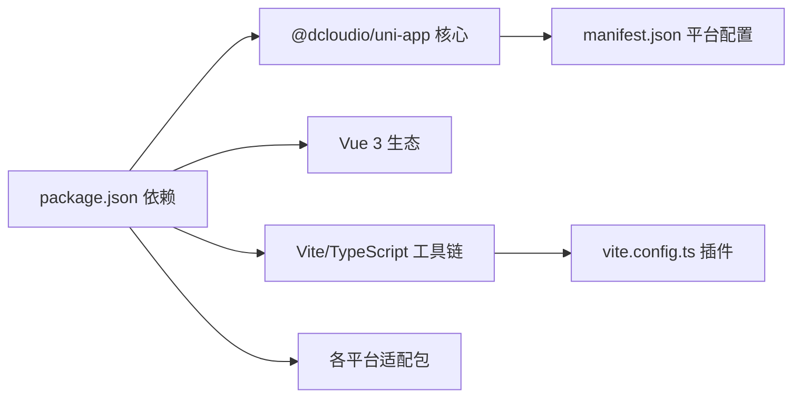

# 开发环境搭建

<cite>
**本文档引用的文件**
- [package.json](file://package.json)
- [tsconfig.json](file://tsconfig.json)
- [vite.config.ts](file://vite.config.ts)
- [src/main.js](file://src/main.js)
- [src/App.vue](file://src/App.vue)
- [src/pages.json](file://src/pages.json)
- [src/manifest.json](file://src/manifest.json)
- [shims-uni.d.ts](file://shims-uni.d.ts)
- [.gitignore](file://.gitignore)
- [src/pages/index/index.vue](file://src/pages/index/index.vue)
- [src/stores/user.js](file://src/stores/user.js)
- [src/utils/api.js](file://src/utils/api.js)
</cite>

## 目录
1. [简介](#简介)
2. [项目结构](#项目结构)
3. [核心组件](#核心组件)
4. [架构总览](#架构总览)
5. [详细组件分析](#详细组件分析)
6. [依赖分析](#依赖分析)
7. [性能考虑](#性能考虑)
8. [故障排除指南](#故障排除指南)
9. [结论](#结论)
10. [附录](#附录)

## 简介
本指南面向Star Grow项目的前端与跨平台开发团队，提供从零开始搭建开发环境的完整流程，涵盖Node.js版本要求、包管理器选择、uni-app开发工具安装与配置、项目依赖安装、环境变量配置、多平台调试（含微信、支付宝等）、热重载与调试模式、常见问题排查以及性能优化建议。文档同时结合仓库中的实际配置文件，确保每一步都可追溯到源码。

## 项目结构
该项目采用uni-app 3.x + Vue 3 + Vite的现代前端技术栈，使用Pinia进行状态管理，并通过uniCloud实现后端云函数与数据库访问。项目目录组织清晰，按功能模块划分，便于扩展与维护。

图表来源
- [package.json:1-74](file://package.json#L1-L74)
- [tsconfig.json:1-14](file://tsconfig.json#L1-L14)
- [vite.config.ts:1-8](file://vite.config.ts#L1-L8)
- [src/main.js:1-11](file://src/main.js#L1-L11)
- [src/App.vue:1-64](file://src/App.vue#L1-L64)
- [src/pages.json:1-56](file://src/pages.json#L1-L56)
- [src/manifest.json:1-77](file://src/manifest.json#L1-L77)
- [.gitignore:1-21](file://.gitignore#L1-L21)

章节来源
- [package.json:1-74](file://package.json#L1-L74)
- [tsconfig.json:1-14](file://tsconfig.json#L1-L14)
- [vite.config.ts:1-8](file://vite.config.ts#L1-L8)
- [src/main.js:1-11](file://src/main.js#L1-L11)
- [src/App.vue:1-64](file://src/App.vue#L1-L64)
- [src/pages.json:1-56](file://src/pages.json#L1-L56)
- [src/manifest.json:1-77](file://src/manifest.json#L1-L77)
- [.gitignore:1-21](file://.gitignore#L1-L21)

## 核心组件
- 应用入口与状态初始化
  - 应用入口位于[src/main.js:1-11](file://src/main.js#L1-L11)，负责创建SSR应用实例并挂载Pinia状态管理。
  - 根组件[src/App.vue:1-64](file://src/App.vue#L1-L64)在启动时初始化微信云开发环境（条件编译仅在小程序微信平台生效）。
- 页面与导航
  - 页面路由与tabBar配置集中在[src/pages.json:1-56](file://src/pages.json#L1-L56)，统一管理导航栏标题、全局样式与底部标签页。
- 平台与云配置
  - 平台特定配置与uniCloud设置位于[src/manifest.json:1-77](file://src/manifest.json#L1-L77)，包含各小程序平台的appid、组件化开关、云服务供应商等。
- 类型与TS配置
  - TypeScript别名与类型声明由[tsconfig.json:1-14](file://tsconfig.json#L1-L14)与[shims-uni.d.ts:1-11](file://shims-uni.d.ts#L1-L11)共同定义，确保IDE智能感知与类型安全。
- 构建与脚本
  - 项目脚本与依赖定义见[package.json:1-74](file://package.json#L1-L74)，提供多平台开发与构建命令；Vite插件通过[vite.config.ts:1-8](file://vite.config.ts#L1-L8)启用uni生态插件。

章节来源
- [src/main.js:1-11](file://src/main.js#L1-L11)
- [src/App.vue:1-64](file://src/App.vue#L1-L64)
- [src/pages.json:1-56](file://src/pages.json#L1-L56)
- [src/manifest.json:1-77](file://src/manifest.json#L1-L77)
- [tsconfig.json:1-14](file://tsconfig.json#L1-L14)
- [shims-uni.d.ts:1-11](file://shims-uni.d.ts#L1-L11)
- [package.json:1-74](file://package.json#L1-L74)
- [vite.config.ts:1-8](file://vite.config.ts#L1-L8)

## 架构总览
下图展示了从开发到多平台运行的整体架构：Vite作为构建工具，配合uni生态插件；应用通过Pinia管理状态，通过uniCloud调用云函数；微信平台在启动时初始化云能力；多平台配置在manifest中集中管理。

图表来源
- [vite.config.ts:1-8](file://vite.config.ts#L1-L8)
- [package.json:39-72](file://package.json#L39-L72)
- [src/App.vue:8-18](file://src/App.vue#L8-L18)
- [src/manifest.json:72-75](file://src/manifest.json#L72-L75)

章节来源
- [vite.config.ts:1-8](file://vite.config.ts#L1-L8)
- [package.json:39-72](file://package.json#L39-L72)
- [src/App.vue:8-18](file://src/App.vue#L8-L18)
- [src/manifest.json:72-75](file://src/manifest.json#L72-L75)

## 详细组件分析

### 开发工具与环境准备
- Node.js版本要求
  - 建议使用Node.js 18或以上长期支持版本，以获得最佳的Vite与TypeScript体验。
- 包管理器选择
  - 推荐使用npm 9+或yarn 1.x/2.x，确保与工程脚本兼容。仓库未使用pnpm，避免混合锁文件导致的不一致。
- uni-app开发工具
  - 安装HBuilderX或VS Code + uni-app插件，确保TypeScript与Vetur/Volar配置正确。
- TypeScript支持
  - 通过[tsconfig.json:1-14](file://tsconfig.json#L1-L14)与[shims-uni.d.ts:1-11](file://shims-uni.d.ts#L1-L11)启用路径别名与uni类型声明。

章节来源
- [tsconfig.json:1-14](file://tsconfig.json#L1-L14)
- [shims-uni.d.ts:1-11](file://shims-uni.d.ts#L1-L11)

### 项目依赖安装与环境变量
- 安装步骤
  - 在项目根目录执行安装命令（推荐使用npm或yarn）。
  - 安装完成后，确认node_modules存在且无冲突。
- 环境变量配置
  - 项目未提供独立的.env文件，云环境ID在根组件中以注释形式给出，需在本地开发时替换为有效ID。
  - 平台appid与云服务供应商在[manifest.json:52-75](file://src/manifest.json#L52-L75)中配置，确保与开发者工具一致。

章节来源
- [src/App.vue:13-17](file://src/App.vue#L13-L17)
- [src/manifest.json:52-75](file://src/manifest.json#L52-L75)

### 多平台开发与调试配置
- 微信开发者工具
  - 在[manifest.json:52-58](file://src/manifest.json#L52-L58)中配置微信appid；启动时在[App.vue:8-18](file://src/App.vue#L8-L18)初始化云开发。
  - 使用脚本运行微信平台：参考[package.json](file://package.json#L16)。
- 支付宝/百度/头条等小程序
  - 对应平台脚本参见[package.json:8-20](file://package.json#L8-L20)，如支付宝、百度、今日头条等。
- H5与快应用
  - H5开发与SSR脚本见[package.json:6-8](file://package.json#L6-L8)与[package.json](file://package.json#L7)。
  - 快应用Webview相关脚本见[package.json:18-20](file://package.json#L18-L20)。

章节来源
- [package.json:6-37](file://package.json#L6-L37)
- [src/App.vue:8-18](file://src/App.vue#L8-L18)
- [src/manifest.json:52-67](file://src/manifest.json#L52-L67)

### 热重载与调试模式
- 热重载机制
  - Vite提供快速热更新，修改页面、组件或store后自动刷新；多平台预览时保持实时反馈。
- 调试模式
  - 在HBuilderX中选择对应平台进行真机调试；在浏览器中使用H5预览时可打开开发者工具进行断点调试。
  - 云函数调试：在uniCloud面板中配置并调试云函数，确保网络与权限设置正确。

章节来源
- [vite.config.ts:1-8](file://vite.config.ts#L1-L8)
- [package.json:6-37](file://package.json#L6-L37)

### 关键业务流程：首页打卡与状态管理

图表来源
- [src/pages/index/index.vue:109-125](file://src/pages/index/index.vue#L109-L125)
- [src/stores/user.js:1-119](file://src/stores/user.js#L1-L119)
- [src/utils/api.js:1-18](file://src/utils/api.js#L1-L18)

章节来源
- [src/pages/index/index.vue:109-166](file://src/pages/index/index.vue#L109-L166)
- [src/stores/user.js:1-119](file://src/stores/user.js#L1-L119)
- [src/utils/api.js:1-18](file://src/utils/api.js#L1-L18)

### 数据流与状态管理

图表来源
- [src/main.js:1-11](file://src/main.js#L1-L11)
- [src/stores/user.js:1-119](file://src/stores/user.js#L1-L119)
- [src/pages/index/index.vue:101-125](file://src/pages/index/index.vue#L101-L125)

章节来源
- [src/main.js:1-11](file://src/main.js#L1-L11)
- [src/stores/user.js:1-119](file://src/stores/user.js#L1-L119)
- [src/pages/index/index.vue:101-125](file://src/pages/index/index.vue#L101-L125)

## 依赖分析
- 运行时依赖
  - Vue 3、Pinia、uView-Plus、vue-i18n等，用于界面与状态管理。
- 开发依赖
  - Vite 5、TypeScript、vue-tsc、@dcloudio/vite-plugin-uni等，支撑构建与类型检查。
- 平台适配
  - 各小程序平台适配包与uni-app核心包，确保多端一致性。

图表来源
- [package.json:39-72](file://package.json#L39-L72)
- [vite.config.ts:1-8](file://vite.config.ts#L1-L8)
- [src/manifest.json:52-75](file://src/manifest.json#L52-L75)

章节来源
- [package.json:39-72](file://package.json#L39-L72)
- [vite.config.ts:1-8](file://vite.config.ts#L1-L8)
- [src/manifest.json:52-75](file://src/manifest.json#L52-L75)

## 性能考虑
- 构建优化
  - 使用Vite的按需加载与Tree Shaking，减少首屏体积。
  - 合理拆分页面与组件，避免单文件过大。
- 运行时优化
  - Pinia状态持久化仅保留必要字段，避免频繁序列化。
  - 云函数调用合并请求，减少网络往返。
- 资源优化
  - 图标与图片使用合适尺寸与格式，避免过度压缩影响清晰度。
  - tabbar图标使用PNG而非SVG，遵循manifest配置。

## 故障排除指南
- 无法启动开发服务器
  - 检查Node.js与npm/yarn版本是否满足要求；清理node_modules后重新安装。
  - 确认端口未被占用，或调整Vite端口配置。
- 微信云开发初始化失败
  - 在[App.vue:13-17](file://src/App.vue#L13-L17)中替换为有效的云环境ID；确保微信开发者工具与manifest中的appid一致。
- 多平台预览空白或报错
  - 检查[manifest.json:52-67](file://src/manifest.json#L52-L67)中平台配置；确认已安装对应平台的开发者工具。
- 云函数调用异常
  - 在[api.js:9-17](file://src/utils/api.js#L9-L17)中查看错误日志；确保云函数名称与参数正确。
- TypeScript类型错误
  - 检查[tsconfig.json:1-14](file://tsconfig.json#L1-L14)与[shims-uni.d.ts:1-11](file://shims-uni.d.ts#L1-L11)配置，确保路径别名与类型声明生效。

章节来源
- [src/App.vue:13-17](file://src/App.vue#L13-L17)
- [src/manifest.json:52-67](file://src/manifest.json#L52-L67)
- [src/utils/api.js:9-17](file://src/utils/api.js#L9-L17)
- [tsconfig.json:1-14](file://tsconfig.json#L1-L14)
- [shims-uni.d.ts:1-11](file://shims-uni.d.ts#L1-L11)

## 结论
通过本指南，您可以在Windows环境下完成Star Grow项目的开发环境搭建，掌握uni-app多平台开发流程、调试技巧与性能优化要点。建议在开发过程中持续关注依赖版本与平台配置的一致性，遇到问题时结合本文档的故障排除清单逐项排查。

## 附录
- 常用命令速查
  - H5开发：参考[package.json:6-8](file://package.json#L6-L8)
  - 微信小程序：参考[package.json](file://package.json#L16)
  - 支付宝小程序：参考[package.json](file://package.json#L8)
  - 构建产物：参考[package.json:21-36](file://package.json#L21-L36)
- 目录忽略规则
  - 参考[.gitignore:1-21](file://.gitignore#L1-L21)，确保node_modules与日志不在版本控制中。

章节来源
- [package.json:6-37](file://package.json#L6-L37)
- [.gitignore:1-21](file://.gitignore#L1-L21)