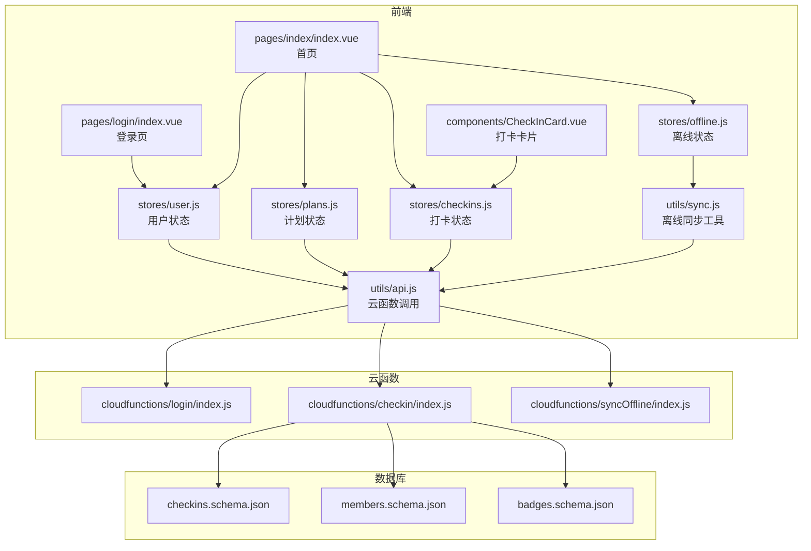
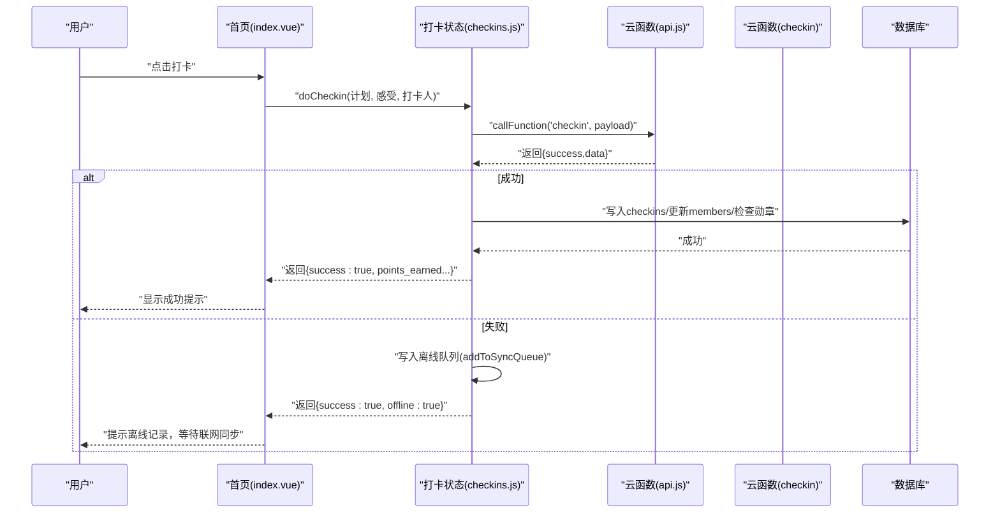
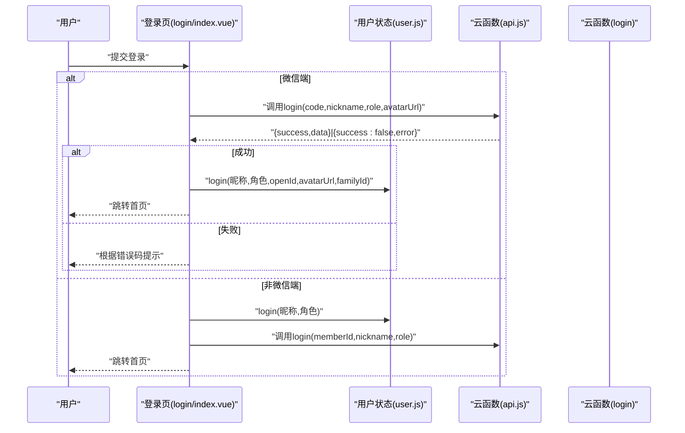
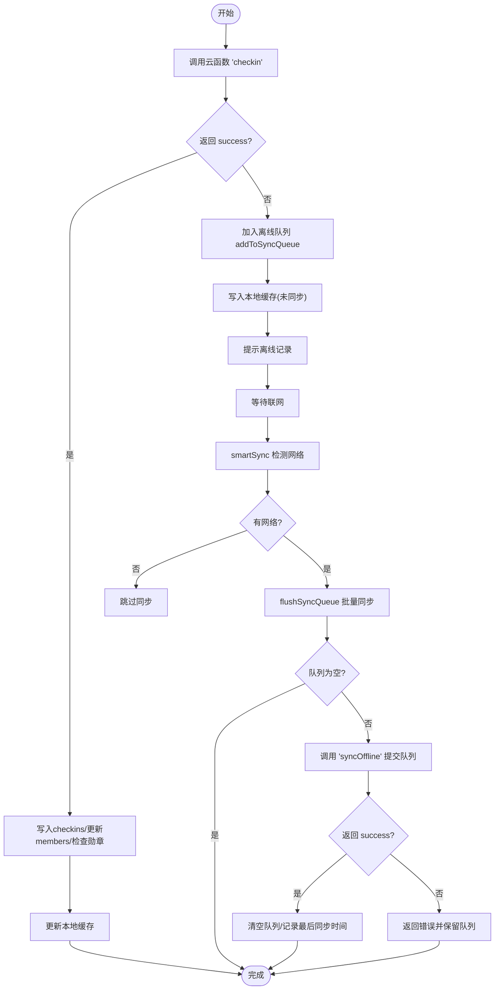
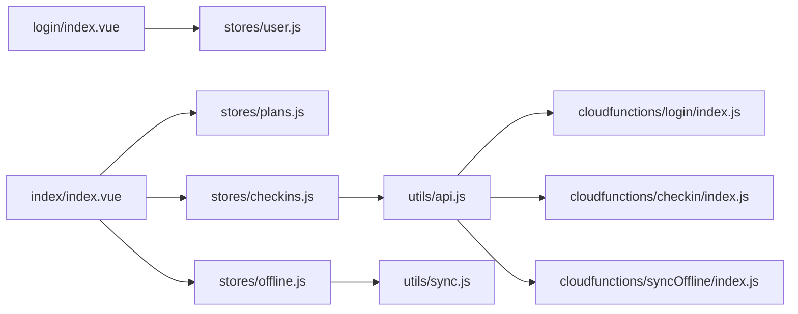

# 常见问题诊断

<cite>
**本文引用的文件**
- [src/utils/api.js](file://src/utils/api.js)
- [src/pages/login/index.vue](file://src/pages/login/index.vue)
- [src/stores/user.js](file://src/stores/user.js)
- [src/stores/checkins.js](file://src/stores/checkins.js)
- [src/stores/offline.js](file://src/stores/offline.js)
- [src/utils/sync.js](file://src/utils/sync.js)
- [src/cloudfunctions/login/index.js](file://src/cloudfunctions/login/index.js)
- [src/cloudfunctions/checkin/index.js](file://src/cloudfunctions/checkin/index.js)
- [src/cloudfunctions/syncOffline/index.js](file://src/cloudfunctions/syncOffline/index.js)
- [src/pages/index/index.vue](file://src/pages/index/index.vue)
- [src/components/CheckInCard.vue](file://src/components/CheckInCard.vue)
- [src/stores/plans.js](file://src/stores/plans.js)
- [uniCloud-aliyun/database/checkins.schema.json](file://uniCloud-aliyun/database/checkins.schema.json)
- [uniCloud-aliyun/database/members.schema.json](file://uniCloud-aliyun/database/members.schema.json)
- [uniCloud-aliyun/database/badges.schema.json](file://uniCloud-aliyun/database/badges.schema.json)
- [src/main.js](file://src/main.js)
- [package.json](file://package.json)
</cite>

## 目录
1. [简介](#简介)
2. [项目结构](#项目结构)
3. [核心组件](#核心组件)
4. [架构总览](#架构总览)
5. [详细组件分析](#详细组件分析)
6. [依赖关系分析](#依赖关系分析)
7. [性能与稳定性考量](#性能与稳定性考量)
8. [故障排查指南](#故障排查指南)
9. [结论](#结论)
10. [附录](#附录)

## 简介
本文件面向Star Grow项目使用者与维护者，提供常见问题的诊断流程与解决方法，覆盖登录失败、数据同步异常、API调用错误等典型场景。内容基于仓库中的前端页面、状态管理、工具函数与云函数实现，结合数据库Schema，帮助通过控制台日志与错误信息快速定位问题根因，并给出可操作的修复建议。

## 项目结构
项目采用“前端UniApp + Pinia状态管理 + 云开发云函数”的分层架构。前端页面负责用户交互与状态展示；Pinia Store负责用户、计划、打卡、离线队列等状态；工具模块封装云函数调用与离线同步；云函数负责业务逻辑与数据库读写；数据库Schema定义核心实体字段与权限。

图表来源
- [src/pages/login/index.vue:1-289](file://src/pages/login/index.vue#L1-L289)
- [src/pages/index/index.vue:1-204](file://src/pages/index/index.vue#L1-L204)
- [src/components/CheckInCard.vue:1-67](file://src/components/CheckInCard.vue#L1-L67)
- [src/stores/user.js:1-119](file://src/stores/user.js#L1-L119)
- [src/stores/plans.js:1-73](file://src/stores/plans.js#L1-L73)
- [src/stores/checkins.js:1-163](file://src/stores/checkins.js#L1-L163)
- [src/stores/offline.js:1-30](file://src/stores/offline.js#L1-L30)
- [src/utils/api.js:1-18](file://src/utils/api.js#L1-L18)
- [src/utils/sync.js:1-96](file://src/utils/sync.js#L1-L96)
- [src/cloudfunctions/login/index.js:1-13](file://src/cloudfunctions/login/index.js#L1-L13)
- [src/cloudfunctions/checkin/index.js:1-142](file://src/cloudfunctions/checkin/index.js#L1-L142)
- [src/cloudfunctions/syncOffline/index.js:1-20](file://src/cloudfunctions/syncOffline/index.js#L1-L20)
- [uniCloud-aliyun/database/checkins.schema.json:1-52](file://uniCloud-aliyun/database/checkins.schema.json#L1-L52)
- [uniCloud-aliyun/database/members.schema.json:1-46](file://uniCloud-aliyun/database/members.schema.json#L1-L46)
- [uniCloud-aliyun/database/badges.schema.json:1-40](file://uniCloud-aliyun/database/badges.schema.json#L1-L40)

章节来源
- [src/main.js:1-11](file://src/main.js#L1-L11)
- [package.json:1-74](file://package.json#L1-L74)

## 核心组件
- 云函数调用封装：统一捕获云函数调用异常，输出控制台错误并返回标准化结果，便于前端判断。
- 登录流程：支持微信登录与普通登录，登录成功后持久化用户信息并切换路由。
- 打卡流程：优先在线调用云函数，失败则写入离线队列，后台静默同步。
- 离线同步：按日期排序批量提交，云端幂等处理，成功后清空队列并记录最后同步时间。
- 数据模型：checkins、members、badges三类核心数据，字段与权限在Schema中明确。

章节来源
- [src/utils/api.js:1-18](file://src/utils/api.js#L1-L18)
- [src/pages/login/index.vue:164-230](file://src/pages/login/index.vue#L164-L230)
- [src/stores/checkins.js:26-89](file://src/stores/checkins.js#L26-L89)
- [src/utils/sync.js:25-53](file://src/utils/sync.js#L25-L53)
- [uniCloud-aliyun/database/checkins.schema.json:1-52](file://uniCloud-aliyun/database/checkins.schema.json#L1-L52)
- [uniCloud-aliyun/database/members.schema.json:1-46](file://uniCloud-aliyun/database/members.schema.json#L1-L46)
- [uniCloud-aliyun/database/badges.schema.json:1-40](file://uniCloud-aliyun/database/badges.schema.json#L1-L40)

## 架构总览
下图展示从用户操作到云端数据库的关键调用链路与错误处理位置。

图表来源
- [src/pages/index/index.vue:127-136](file://src/pages/index/index.vue#L127-L136)
- [src/stores/checkins.js:26-89](file://src/stores/checkins.js#L26-L89)
- [src/utils/api.js:9-17](file://src/utils/api.js#L9-L17)
- [src/cloudfunctions/checkin/index.js:12-83](file://src/cloudfunctions/checkin/index.js#L12-L83)

## 详细组件分析

### 登录流程与常见问题
- 登录入口与参数
  - 登录页支持微信一键登录与普通登录两种路径，最终都会调用云函数进行鉴权与用户初始化。
  - 关键参数包括：code（微信登录凭证）、昵称、角色、头像URL、家庭ID等。
- 错误分支
  - 云函数返回非成功时，前端根据错误码区分白名单拒绝与其它失败，并弹窗提示。
  - 微信登录阶段若未获取到code，会抛出错误并提示重试。
- 常见问题与定位
  - “无法登录/暂未开放”：云函数返回特定错误码时，前端会弹出说明性提示。需检查白名单策略与用户是否在白名单内。
  - “登录失败/请重试”：通用失败提示，通常由网络异常或云函数内部异常导致。建议查看控制台错误堆栈与云函数日志。
  - “未设置昵称”：前端会在必要时阻止提交，确保必填项完整。

图表来源
- [src/pages/login/index.vue:136-230](file://src/pages/login/index.vue#L136-L230)
- [src/stores/user.js:22-53](file://src/stores/user.js#L22-L53)
- [src/utils/api.js:9-17](file://src/utils/api.js#L9-L17)
- [src/cloudfunctions/login/index.js:4-12](file://src/cloudfunctions/login/index.js#L4-L12)

章节来源
- [src/pages/login/index.vue:102-230](file://src/pages/login/index.vue#L102-L230)
- [src/stores/user.js:1-119](file://src/stores/user.js#L1-L119)
- [src/utils/api.js:1-18](file://src/utils/api.js#L1-L18)
- [src/cloudfunctions/login/index.js:1-13](file://src/cloudfunctions/login/index.js#L1-L13)

### 打卡流程与离线容错
- 在线打卡
  - 调用云函数执行校验、写入、积分更新与勋章检查，成功后刷新本地缓存与积分。
- 离线容错
  - 云函数调用异常时，将打卡数据加入本地离线队列，标记为未同步，同时更新本地缓存。
- 同步机制
  - 首页显示待同步计数，点击后触发离线同步；同步前检查网络状态，无网络则跳过。
  - 批量同步时按日期排序，云端幂等处理，成功后清空队列并记录最后同步时间。

图表来源
- [src/stores/checkins.js:26-89](file://src/stores/checkins.js#L26-L89)
- [src/utils/sync.js:25-96](file://src/utils/sync.js#L25-L96)
- [src/stores/offline.js:14-26](file://src/stores/offline.js#L14-L26)
- [src/pages/index/index.vue:156-162](file://src/pages/index/index.vue#L156-L162)

章节来源
- [src/stores/checkins.js:1-163](file://src/stores/checkins.js#L1-L163)
- [src/utils/sync.js:1-96](file://src/utils/sync.js#L1-L96)
- [src/stores/offline.js:1-30](file://src/stores/offline.js#L1-L30)
- [src/pages/index/index.vue:58-62](file://src/pages/index/index.vue#L58-L62)

### 数据模型与字段约束
- checkins表
  - 必填字段：plan_id、child_id、date
  - 常用字段：checked_by、feeling、points_earned、bonus_points、bonus_type、created_at
- members表
  - 必填字段：nickname、role、family_id
  - 常用字段：openId、avatarUrl、current_points、total_points
- badges表
  - 必填字段：child_id、badge_type、title
  - 常用字段：icon、desc、unlocked_at

章节来源
- [uniCloud-aliyun/database/checkins.schema.json:1-52](file://uniCloud-aliyun/database/checkins.schema.json#L1-L52)
- [uniCloud-aliyun/database/members.schema.json:1-46](file://uniCloud-aliyun/database/members.schema.json#L1-L46)
- [uniCloud-aliyun/database/badges.schema.json:1-40](file://uniCloud-aliyun/database/badges.schema.json#L1-L40)

## 依赖关系分析
- 组件耦合
  - 页面与Store：首页与登录页均依赖用户、计划、打卡、离线等Store。
  - Store之间：打卡Store依赖用户与积分Store；离线Store依赖同步工具。
  - 工具与云函数：所有云函数调用通过统一封装，便于集中处理错误与日志。
- 外部依赖
  - uniCloud能力：登录、网络状态、存储等API。
  - 云函数：login、checkin、syncOffline等。
- 潜在风险
  - 云函数返回结构不一致可能导致前端分支错误。
  - 离线队列未清空可能造成数据堆积与显示不一致。

图表来源
- [src/pages/login/index.vue:102-108](file://src/pages/login/index.vue#L102-L108)
- [src/pages/index/index.vue:67-79](file://src/pages/index/index.vue#L67-L79)
- [src/stores/plans.js:1-73](file://src/stores/plans.js#L1-L73)
- [src/stores/checkins.js:1-163](file://src/stores/checkins.js#L1-L163)
- [src/stores/offline.js:1-30](file://src/stores/offline.js#L1-L30)
- [src/utils/api.js:1-18](file://src/utils/api.js#L1-L18)
- [src/utils/sync.js:1-96](file://src/utils/sync.js#L1-L96)
- [src/cloudfunctions/login/index.js:1-13](file://src/cloudfunctions/login/index.js#L1-L13)
- [src/cloudfunctions/checkin/index.js:1-142](file://src/cloudfunctions/checkin/index.js#L1-L142)
- [src/cloudfunctions/syncOffline/index.js:1-20](file://src/cloudfunctions/syncOffline/index.js#L1-L20)

章节来源
- [src/pages/login/index.vue:102-108](file://src/pages/login/index.vue#L102-L108)
- [src/pages/index/index.vue:67-79](file://src/pages/index/index.vue#L67-L79)
- [src/stores/plans.js:1-73](file://src/stores/plans.js#L1-L73)
- [src/stores/checkins.js:1-163](file://src/stores/checkins.js#L1-L163)
- [src/stores/offline.js:1-30](file://src/stores/offline.js#L1-L30)
- [src/utils/api.js:1-18](file://src/utils/api.js#L1-L18)
- [src/utils/sync.js:1-96](file://src/utils/sync.js#L1-L96)
- [src/cloudfunctions/login/index.js:1-13](file://src/cloudfunctions/login/index.js#L1-L13)
- [src/cloudfunctions/checkin/index.js:1-142](file://src/cloudfunctions/checkin/index.js#L1-L142)
- [src/cloudfunctions/syncOffline/index.js:1-20](file://src/cloudfunctions/syncOffline/index.js#L1-L20)

## 性能与稳定性考量
- 离线优先：打卡直接写入本地Storage，避免阻塞用户，提升响应速度。
- 静默同步：应用前后台切换或启动时自动检测并批量上传，减少用户干预。
- 幂等设计：云端对重复打卡进行跳过，避免重复计分与数据冗余。
- 网络感知：智能同步在无网络时跳过，降低无效请求与报错噪音。

章节来源
- [src/utils/sync.js:1-96](file://src/utils/sync.js#L1-L96)
- [src/stores/checkins.js:77-88](file://src/stores/checkins.js#L77-L88)

## 故障排查指南

### 一、登录失败
- 现象
  - 微信一键登录后停留在登录页或弹出“无法登录/暂未开放”提示。
  - 输入昵称与角色后仍提示“登录失败/请重试”。
- 排查步骤
  - 控制台日志
    - 检查登录页与云函数调用处的错误输出，确认是否抛出异常。
  - 云函数返回
    - 若返回特定错误码（如白名单拒绝），需检查白名单策略与用户状态。
  - 微信登录凭证
    - 确认是否成功获取code，若缺失则重新发起登录。
- 解决方案
  - 补充必填信息（昵称、角色）后再提交。
  - 确保网络稳定，重试登录。
  - 如提示白名单限制，联系管理员添加用户至白名单。

章节来源
- [src/pages/login/index.vue:136-161](file://src/pages/login/index.vue#L136-L161)
- [src/pages/login/index.vue:172-193](file://src/pages/login/index.vue#L172-L193)
- [src/utils/api.js:13-15](file://src/utils/api.js#L13-L15)
- [src/cloudfunctions/login/index.js:4-12](file://src/cloudfunctions/login/index.js#L4-L12)

### 二、数据同步异常
- 现象
  - 点击“待同步”提示后无任何变化或持续显示未同步。
  - 同步完成后数据未更新。
- 排查步骤
  - 控制台日志
    - 检查离线Store与同步工具的错误输出，确认是否抛出异常。
  - 网络状态
    - 确认设备网络类型，智能同步在无网络时会跳过。
  - 队列状态
    - 检查本地存储中的待同步队列与最后同步时间。
- 解决方案
  - 确保网络可用后再次点击同步。
  - 清理本地缓存或重启应用后重试。
  - 如问题持续，导出本地队列并联系技术支持。

章节来源
- [src/stores/offline.js:14-26](file://src/stores/offline.js#L14-L26)
- [src/utils/sync.js:84-96](file://src/utils/sync.js#L84-L96)
- [src/pages/index/index.vue:156-162](file://src/pages/index/index.vue#L156-L162)

### 三、API调用错误
- 现象
  - 打卡/取消/计划加载等操作返回“失败”，但未显示具体原因。
- 排查步骤
  - 控制台日志
    - 统一通过云函数封装捕获异常，查看错误消息。
  - 错误分支
    - 前端根据success与error字段分别处理，注意白名单拒绝等特殊分支。
- 解决方案
  - 重试操作；若为网络问题，稍后重试。
  - 若为业务错误（如重复打卡），按提示修正后重试。

章节来源
- [src/utils/api.js:9-17](file://src/utils/api.js#L9-L17)
- [src/stores/checkins.js:74-76](file://src/stores/checkins.js#L74-L76)
- [src/stores/plans.js:44-46](file://src/stores/plans.js#L44-L46)

### 四、网络连接问题
- 现象
  - 应用无响应或长时间加载。
- 排查步骤
  - 检查设备网络状态，确认是否为飞行模式或无网络。
  - 智能同步在无网络时会跳过，属于预期行为。
- 解决方案
  - 连接可用网络后重试。
  - 首次使用建议在WiFi环境下完成初始化操作。

章节来源
- [src/utils/sync.js:72-82](file://src/utils/sync.js#L72-L82)
- [src/utils/sync.js:84-96](file://src/utils/sync.js#L84-L96)

### 五、权限验证失败
- 现象
  - 访问受限或提示未开放。
- 排查步骤
  - 检查登录流程是否成功持久化用户信息。
  - 确认用户角色与家庭ID是否正确。
- 解决方案
  - 重新登录并确保白名单策略允许访问。
  - 联系管理员确认用户权限。

章节来源
- [src/pages/login/index.vue:195-208](file://src/pages/login/index.vue#L195-L208)
- [src/stores/user.js:44-52](file://src/stores/user.js#L44-L52)

### 六、数据格式错误
- 现象
  - 字段缺失导致写入失败或校验报错。
- 排查步骤
  - 对照数据库Schema核对必填字段与类型。
  - 检查前端构造的数据payload是否完整。
- 解决方案
  - 补齐必填字段（如plan_id、child_id、date等）。
  - 修复字段类型（如日期格式YYYY-MM-DD）。

章节来源
- [uniCloud-aliyun/database/checkins.schema.json:10-25](file://uniCloud-aliyun/database/checkins.schema.json#L10-L25)
- [uniCloud-aliyun/database/members.schema.json:14-25](file://uniCloud-aliyun/database/members.schema.json#L14-L25)
- [uniCloud-aliyun/database/badges.schema.json:14-25](file://uniCloud-aliyun/database/badges.schema.json#L14-L25)

### 七、用户反馈收集与问题分类
- 反馈收集
  - 在关键错误点弹窗或Toast提示，引导用户提供截图与操作步骤。
  - 记录设备型号、系统版本、网络类型、错误时间与日志片段。
- 问题分类
  - 登录类：白名单拒绝、凭证失效、网络异常。
  - 同步类：无网络、队列堆积、云端幂等冲突。
  - 业务类：重复打卡、字段缺失、权限不足。
- 工具使用
  - 控制台日志：定位异常发生点与错误消息。
  - 本地存储：检查离线队列、本地缓存与最后同步时间。
  - 云函数日志：查看云端执行状态与异常堆栈。

章节来源
- [src/pages/login/index.vue:183-191](file://src/pages/login/index.vue#L183-L191)
- [src/stores/checkins.js:77-88](file://src/stores/checkins.js#L77-L88)
- [src/utils/sync.js:49-51](file://src/utils/sync.js#L49-L51)

### 八、快速问题定位检查清单
- 登录
  - 是否填写昵称与角色？
  - 是否成功获取微信code？
  - 云函数返回是否成功？是否有白名单提示？
- 打卡
  - 是否重复打卡？
  - 云端是否报错？前端是否写入离线队列？
  - 本地缓存是否更新？
- 同步
  - 设备是否有网络？
  - 待同步计数是否大于0？
  - 云端是否返回成功并清空队列？
- 数据
  - 必填字段是否齐全？
  - 字段类型是否符合Schema要求？

章节来源
- [src/pages/login/index.vue:136-161](file://src/pages/login/index.vue#L136-L161)
- [src/stores/checkins.js:77-88](file://src/stores/checkins.js#L77-L88)
- [src/utils/sync.js:84-96](file://src/utils/sync.js#L84-L96)
- [uniCloud-aliyun/database/checkins.schema.json:10-25](file://uniCloud-aliyun/database/checkins.schema.json#L10-L25)

## 结论
本项目通过“离线优先+静默同步+幂等处理”的设计，在弱网与异常场景下仍能保障用户体验。针对登录失败、数据同步异常与API调用错误，建议优先查看控制台日志与云函数返回，结合Schema核对数据格式，并依据检查清单逐项排除。对于白名单与权限问题，需回到云端策略与用户管理处确认。

## 附录
- 关键文件索引
  - 登录与用户：[src/pages/login/index.vue:1-289](file://src/pages/login/index.vue#L1-L289)、[src/stores/user.js:1-119](file://src/stores/user.js#L1-L119)
  - 打卡与同步：[src/stores/checkins.js:1-163](file://src/stores/checkins.js#L1-L163)、[src/utils/sync.js:1-96](file://src/utils/sync.js#L1-L96)、[src/stores/offline.js:1-30](file://src/stores/offline.js#L1-L30)
  - 云函数：[src/cloudfunctions/login/index.js:1-13](file://src/cloudfunctions/login/index.js#L1-L13)、[src/cloudfunctions/checkin/index.js:1-142](file://src/cloudfunctions/checkin/index.js#L1-L142)、[src/cloudfunctions/syncOffline/index.js:1-20](file://src/cloudfunctions/syncOffline/index.js#L1-L20)
  - 数据模型：[uniCloud-aliyun/database/checkins.schema.json:1-52](file://uniCloud-aliyun/database/checkins.schema.json#L1-L52)、[uniCloud-aliyun/database/members.schema.json:1-46](file://uniCloud-aliyun/database/members.schema.json#L1-L46)、[uniCloud-aliyun/database/badges.schema.json:1-40](file://uniCloud-aliyun/database/badges.schema.json#L1-L40)
  - 应用入口与依赖：[src/main.js:1-11](file://src/main.js#L1-L11)、[package.json:1-74](file://package.json#L1-L74)