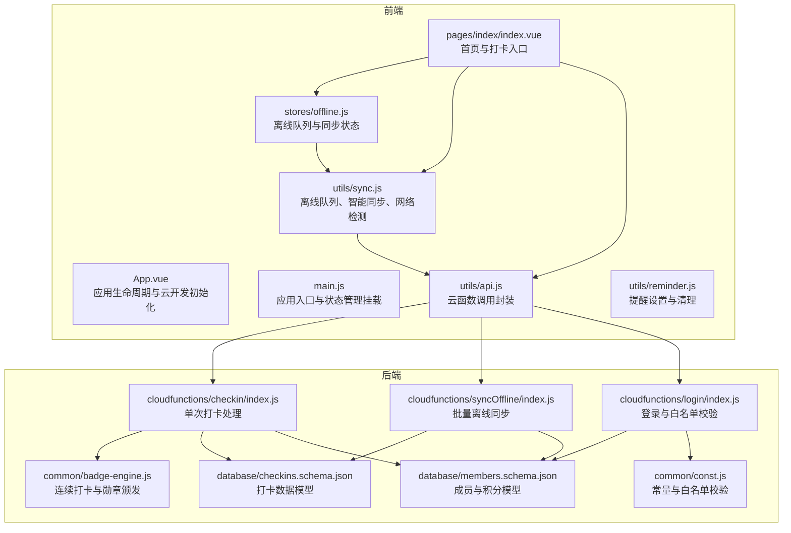
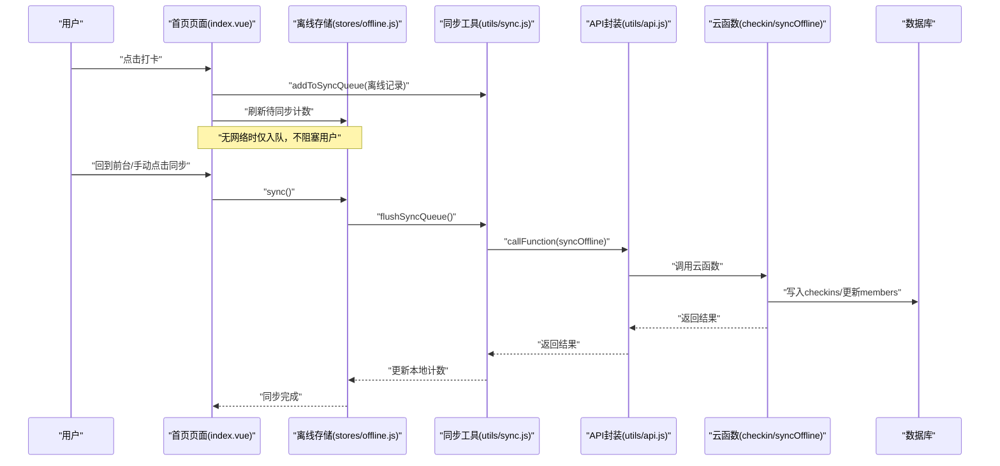
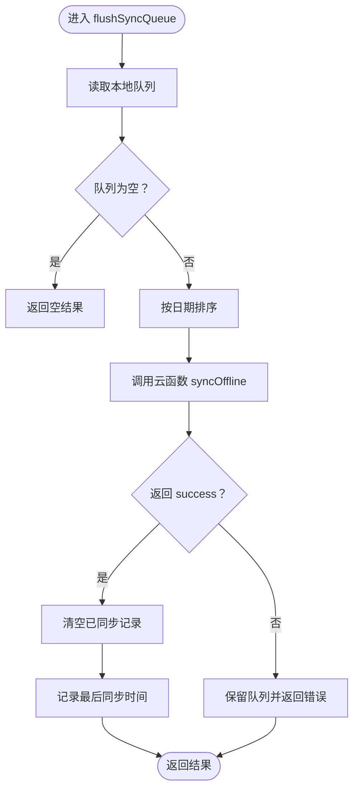
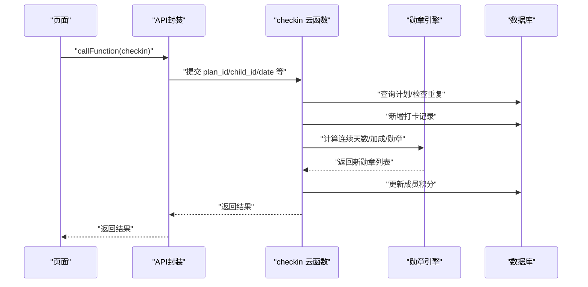
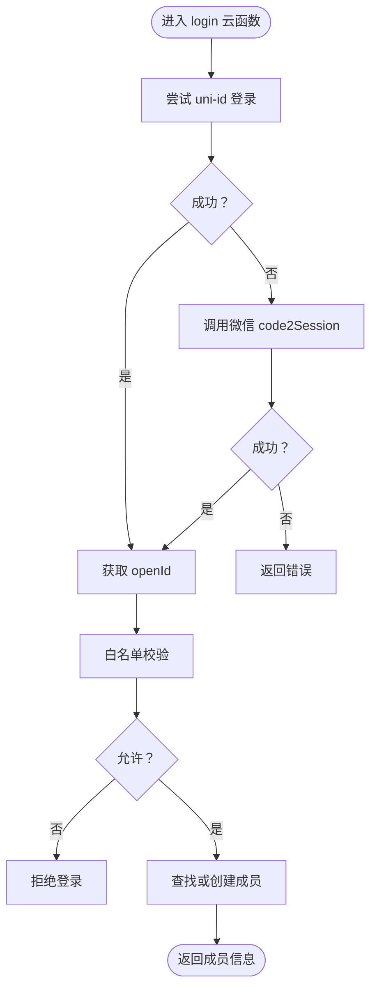
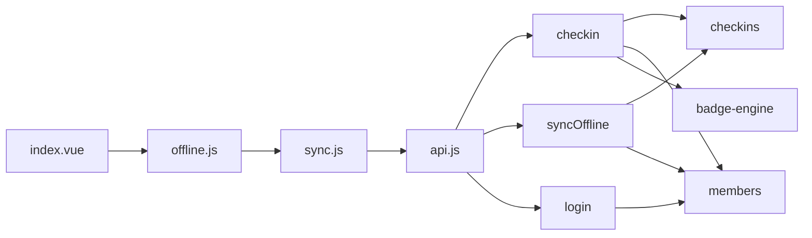

# 应急响应流程

<cite>
**本文引用的文件**
- [src/main.js](file://src/main.js)
- [src/App.vue](file://src/App.vue)
- [src/utils/api.js](file://src/utils/api.js)
- [src/utils/sync.js](file://src/utils/sync.js)
- [src/stores/offline.js](file://src/stores/offline.js)
- [src/pages/index/index.vue](file://src/pages/index/index.vue)
- [uniCloud-aliyun/cloudfunctions/syncOffline/index.js](file://uniCloud-aliyun/cloudfunctions/syncOffline/index.js)
- [uniCloud-aliyun/cloudfunctions/checkin/index.js](file://uniCloud-aliyun/cloudfunctions/checkin/index.js)
- [uniCloud-aliyun/cloudfunctions/login/index.js](file://uniCloud-aliyun/cloudfunctions/login/index.js)
- [uniCloud-aliyun/common/badge-engine.js](file://uniCloud-aliyun/common/badge-engine.js)
- [uniCloud-aliyun/common/const.js](file://uniCloud-aliyun/common/const.js)
- [uniCloud-aliyun/database/checkins.schema.json](file://uniCloud-aliyun/database/checkins.schema.json)
- [uniCloud-aliyun/database/members.schema.json](file://uniCloud-aliyun/database/members.schema.json)
- [src/utils/reminder.js](file://src/utils/reminder.js)
- [package.json](file://package.json)
</cite>

## 目录
1. [简介](#简介)
2. [项目结构](#项目结构)
3. [核心组件](#核心组件)
4. [架构总览](#架构总览)
5. [详细组件分析](#详细组件分析)
6. [依赖关系分析](#依赖关系分析)
7. [性能考量](#性能考量)
8. [故障分级与响应时间](#故障分级与响应时间)
9. [应急响应预案](#应急响应预案)
10. [离线模式下的数据保护与恢复](#离线模式下的数据保护与恢复)
11. [紧急修复与热修复实施步骤](#紧急修复与热修复实施步骤)
12. [用户通知与沟通机制](#用户通知与沟通机制)
13. [故障报告模板与事后分析流程](#故障报告模板与事后分析流程)
14. [备份恢复与灾难恢复操作指南](#备份恢复与灾难恢复操作指南)
15. [结论](#结论)

## 简介
本文件为 Star Grow 项目的应急响应流程文档，面向系统崩溃、数据库连接中断、云函数执行失败等突发情况，提供可操作的处置流程、故障分级与响应时间要求、离线数据保护与恢复策略、紧急修复与热修复步骤、用户通知与沟通机制、故障报告模板与事后分析流程，以及备份恢复与灾难恢复的操作指南。文档同时结合代码实现，给出与实际源码对应的架构图、序列图与流程图，帮助研发与运维团队快速定位问题并高效恢复服务。

## 项目结构
项目采用前端 uni-app + uniCloud 的架构，前端负责界面与交互、离线队列与智能同步；后端通过 uniCloud 云函数提供业务逻辑与数据库访问，并通过 schema 定义数据模型。

**图表来源**
- [src/App.vue:1-64](file://src/App.vue#L1-L64)
- [src/main.js:1-11](file://src/main.js#L1-L11)
- [src/pages/index/index.vue:1-204](file://src/pages/index/index.vue#L1-L204)
- [src/stores/offline.js:1-30](file://src/stores/offline.js#L1-L30)
- [src/utils/sync.js:1-96](file://src/utils/sync.js#L1-L96)
- [src/utils/api.js:1-18](file://src/utils/api.js#L1-L18)
- [src/utils/reminder.js:1-58](file://src/utils/reminder.js#L1-L58)
- [uniCloud-aliyun/cloudfunctions/checkin/index.js:1-83](file://uniCloud-aliyun/cloudfunctions/checkin/index.js#L1-L83)
- [uniCloud-aliyun/cloudfunctions/syncOffline/index.js:1-90](file://uniCloud-aliyun/cloudfunctions/syncOffline/index.js#L1-L90)
- [uniCloud-aliyun/cloudfunctions/login/index.js:1-103](file://uniCloud-aliyun/cloudfunctions/login/index.js#L1-L103)
- [uniCloud-aliyun/common/badge-engine.js:1-125](file://uniCloud-aliyun/common/badge-engine.js#L1-L125)
- [uniCloud-aliyun/common/const.js:1-27](file://uniCloud-aliyun/common/const.js#L1-L27)
- [uniCloud-aliyun/database/checkins.schema.json:1-52](file://uniCloud-aliyun/database/checkins.schema.json#L1-L52)
- [uniCloud-aliyun/database/members.schema.json:1-46](file://uniCloud-aliyun/database/members.schema.json#L1-L46)

**章节来源**
- [src/main.js:1-11](file://src/main.js#L1-L11)
- [src/App.vue:1-64](file://src/App.vue#L1-L64)
- [package.json:1-74](file://package.json#L1-L74)

## 核心组件
- 应用入口与生命周期
  - 应用启动时初始化云开发能力，页面显示时触发离线同步。
- 云函数调用封装
  - 统一封装 uniCloud.callFunction，统一错误返回格式。
- 离线队列与智能同步
  - 本地存储队列、批量上传、幂等处理、冲突检测、网络感知。
- 登录与白名单校验
  - 支持 uni-id 与 code2Session 降级路径，白名单拒绝非授权用户。
- 奖励与勋章引擎
  - 连续打卡、加成、勋章颁发与分类统计。

**章节来源**
- [src/App.vue:1-64](file://src/App.vue#L1-L64)
- [src/utils/api.js:1-18](file://src/utils/api.js#L1-L18)
- [src/utils/sync.js:1-96](file://src/utils/sync.js#L1-L96)
- [src/stores/offline.js:1-30](file://src/stores/offline.js#L1-L30)
- [uniCloud-aliyun/cloudfunctions/login/index.js:1-103](file://uniCloud-aliyun/cloudfunctions/login/index.js#L1-L103)
- [uniCloud-aliyun/common/badge-engine.js:1-125](file://uniCloud-aliyun/common/badge-engine.js#L1-L125)

## 架构总览
下图展示从用户操作到云函数处理与数据库更新的关键链路，以及离线队列在无网络时的保护机制。

**图表来源**
- [src/pages/index/index.vue:127-162](file://src/pages/index/index.vue#L127-L162)
- [src/stores/offline.js:14-26](file://src/stores/offline.js#L14-L26)
- [src/utils/sync.js:25-53](file://src/utils/sync.js#L25-L53)
- [src/utils/api.js:9-17](file://src/utils/api.js#L9-L17)
- [uniCloud-aliyun/cloudfunctions/syncOffline/index.js:5-90](file://uniCloud-aliyun/cloudfunctions/syncOffline/index.js#L5-L90)

## 详细组件分析

### 组件A：离线队列与智能同步
- 设计要点
  - 本地队列键值持久化，避免重复入队。
  - 批量上传前按日期排序，保证幂等与顺序一致性。
  - 智能同步仅在网络可用且有待同步数据时执行。
  - 失败时保留队列，等待下次重试。
- 关键流程

**图表来源**
- [src/utils/sync.js:25-53](file://src/utils/sync.js#L25-L53)
- [uniCloud-aliyun/cloudfunctions/syncOffline/index.js:15-17](file://uniCloud-aliyun/cloudfunctions/syncOffline/index.js#L15-L17)

**章节来源**
- [src/utils/sync.js:1-96](file://src/utils/sync.js#L1-L96)
- [src/stores/offline.js:1-30](file://src/stores/offline.js#L1-L30)

### 组件B：单次打卡与云函数处理
- 设计要点
  - 先检查当日是否已打卡，避免重复。
  - 插入记录后计算连续天数与加成，更新记录。
  - 更新成员积分，颁发勋章。
- 关键流程

**图表来源**
- [src/utils/api.js:9-17](file://src/utils/api.js#L9-L17)
- [uniCloud-aliyun/cloudfunctions/checkin/index.js:5-83](file://uniCloud-aliyun/cloudfunctions/checkin/index.js#L5-L83)
- [uniCloud-aliyun/common/badge-engine.js:7-31](file://uniCloud-aliyun/common/badge-engine.js#L7-L31)

**章节来源**
- [uniCloud-aliyun/cloudfunctions/checkin/index.js:1-83](file://uniCloud-aliyun/cloudfunctions/checkin/index.js#L1-L83)
- [uniCloud-aliyun/common/badge-engine.js:1-125](file://uniCloud-aliyun/common/badge-engine.js#L1-L125)

### 组件C：登录与白名单校验
- 设计要点
  - 优先使用 uni-id 登录，失败时降级到 code2Session。
  - 白名单拒绝未授权 openId。
  - 不存在成员时自动创建并分配 family_id。
- 关键流程

**图表来源**
- [uniCloud-aliyun/cloudfunctions/login/index.js:6-103](file://uniCloud-aliyun/cloudfunctions/login/index.js#L6-L103)
- [uniCloud-aliyun/common/const.js:20-24](file://uniCloud-aliyun/common/const.js#L20-L24)

**章节来源**
- [uniCloud-aliyun/cloudfunctions/login/index.js:1-103](file://uniCloud-aliyun/cloudfunctions/login/index.js#L1-L103)
- [uniCloud-aliyun/common/const.js:1-27](file://uniCloud-aliyun/common/const.js#L1-L27)

### 组件D：数据模型与约束
- 打卡记录模型
  - 必填字段：plan_id、child_id、date。
  - 包含积分、加成、创建时间等。
- 成员模型
  - 必填字段：nickname、role、family_id。
  - 当前可用积分与累计积分字段。

**章节来源**
- [uniCloud-aliyun/database/checkins.schema.json:1-52](file://uniCloud-aliyun/database/checkins.schema.json#L1-L52)
- [uniCloud-aliyun/database/members.schema.json:1-46](file://uniCloud-aliyun/database/members.schema.json#L1-L46)

## 依赖关系分析
- 前端对后端的依赖
  - 页面通过 API 封装调用云函数，云函数依赖数据库与公共模块。
- 数据一致性与冲突处理
  - 离线同步对重复记录进行冲突检测与跳过，保证幂等。
- 网络与状态耦合
  - 离线队列与智能同步受网络状态影响，避免无效请求。

**图表来源**
- [src/pages/index/index.vue:1-204](file://src/pages/index/index.vue#L1-L204)
- [src/stores/offline.js:1-30](file://src/stores/offline.js#L1-L30)
- [src/utils/sync.js:1-96](file://src/utils/sync.js#L1-L96)
- [src/utils/api.js:1-18](file://src/utils/api.js#L1-L18)
- [uniCloud-aliyun/cloudfunctions/checkin/index.js:1-83](file://uniCloud-aliyun/cloudfunctions/checkin/index.js#L1-L83)
- [uniCloud-aliyun/cloudfunctions/syncOffline/index.js:1-90](file://uniCloud-aliyun/cloudfunctions/syncOffline/index.js#L1-L90)
- [uniCloud-aliyun/cloudfunctions/login/index.js:1-103](file://uniCloud-aliyun/cloudfunctions/login/index.js#L1-L103)
- [uniCloud-aliyun/common/badge-engine.js:1-125](file://uniCloud-aliyun/common/badge-engine.js#L1-L125)

**章节来源**
- [src/utils/sync.js:72-79](file://src/utils/sync.js#L72-L79)
- [src/stores/offline.js:14-26](file://src/stores/offline.js#L14-L26)

## 性能考量
- 离线优先与静默同步
  - 打卡直接写入本地队列，避免阻塞用户。
- 批量上传与排序
  - 按日期排序减少并发冲突，提升入库效率。
- 幂等设计
  - 云端重复记录直接跳过，降低无效写入。
- 网络感知
  - 无网络时不发起同步，减少失败重试成本。

[本节为通用性能建议，无需列出具体文件来源]

## 故障分级与响应时间
- 一级故障（系统崩溃/服务不可用）
  - 定义：应用完全无法启动或核心云函数大面积失败。
  - 响应时间：10 分钟内响应，30 分钟内发布降级方案或回滚。
- 二级故障（数据库连接中断/大量超时）
  - 定义：数据库连接异常、读写超时、索引缺失导致性能骤降。
  - 响应时间：30 分钟内响应，2 小时内恢复。
- 三级故障（云函数执行失败/偶发性错误）
  - 定义：个别云函数失败、参数错误、白名单校验异常。
  - 响应时间：1 小时内响应，6 小时内修复。
- 四级故障（界面异常/体验类问题）
  - 定义：UI 展示异常、提示文案错误、离线同步提示不准确。
  - 响应时间：2 小时内响应，12 小时内修复。

[本节为通用分级标准，无需列出具体文件来源]

## 应急响应预案

### 场景一：系统崩溃（前端/云开发初始化失败）
- 表现
  - 应用启动即报错，无法进入首页。
- 诊断
  - 检查云开发初始化与环境 ID 配置。
- 处置
  - 临时关闭相关页面逻辑，优先保障登录与首页加载。
  - 发布热修复版本，修正初始化逻辑。
- 通知
  - 通过公告渠道告知用户维护窗口。

**章节来源**
- [src/App.vue:5-19](file://src/App.vue#L5-L19)

### 场景二：数据库连接中断
- 表现
  - 云函数调用超时或返回连接错误。
- 诊断
  - 检查数据库实例状态、网络连通性与权限。
- 处置
  - 启用本地离线队列，等待恢复后自动同步。
  - 对关键路径增加重试与熔断策略。
- 通知
  - 通过系统弹窗提示“网络不稳定，请稍后再试”。

**章节来源**
- [src/utils/api.js:13-16](file://src/utils/api.js#L13-L16)
- [src/utils/sync.js:49-52](file://src/utils/sync.js#L49-L52)

### 场景三：云函数执行失败（checkin/syncOffline/login）
- 表现
  - 打卡失败、离线同步失败、登录被拒。
- 诊断
  - 查看云函数日志与返回错误，确认输入参数与白名单。
- 处置
  - 对于重复打卡：提示用户勿重复操作。
  - 对于离线同步：保留队列，等待网络恢复后重试。
  - 对于登录：检查 openId 与白名单配置。
- 通知
  - 在页面提示具体错误与建议操作。

**章节来源**
- [uniCloud-aliyun/cloudfunctions/checkin/index.js:18-20](file://uniCloud-aliyun/cloudfunctions/checkin/index.js#L18-L20)
- [uniCloud-aliyun/cloudfunctions/syncOffline/index.js:15-17](file://uniCloud-aliyun/cloudfunctions/syncOffline/index.js#L15-L17)
- [uniCloud-aliyun/cloudfunctions/login/index.js:50-56](file://uniCloud-aliyun/cloudfunctions/login/index.js#L50-L56)

## 离线模式下的数据保护与恢复

### 数据保护策略
- 本地持久化
  - 离线队列以键值形式存储，避免重复入队。
- 幂等与冲突检测
  - 云端检查重复记录并跳过，保证最终一致性。
- 网络感知
  - 无网络时不发起同步，减少失败重试。

### 恢复策略
- 自动恢复
  - 应用回到前台或用户手动点击同步时，自动尝试批量上传。
- 手动干预
  - 用户可在首页点击“待同步”提示进行强制同步。
- 失败处理
  - 失败时保留队列，等待下次重试；必要时引导用户检查网络。

**章节来源**
- [src/utils/sync.js:13-20](file://src/utils/sync.js#L13-L20)
- [src/utils/sync.js:25-53](file://src/utils/sync.js#L25-L53)
- [src/pages/index/index.vue:58-61](file://src/pages/index/index.vue#L58-L61)
- [src/stores/offline.js:14-26](file://src/stores/offline.js#L14-L26)

## 紧急修复与热修复实施步骤

### 步骤一：快速评估与隔离
- 评估影响范围与严重程度。
- 对高风险路径进行功能开关或降级。

### 步骤二：定位与修复
- 前端：修正 API 调用、错误提示与离线逻辑。
- 后端：修复云函数参数校验、数据库写入与白名单逻辑。

### 步骤三：灰度发布与验证
- 通过小范围用户验证修复效果。
- 监控关键指标（成功率、延迟、错误率）。

### 步骤四：全量发布与回滚
- 全量发布后持续观察。
- 如出现副作用，立即回滚至上一稳定版本。

[本节为通用流程，无需列出具体文件来源]

## 用户通知与沟通机制
- 页面提示
  - 打卡失败、离线同步失败时，使用 Toast/Modal 提示具体原因与建议。
- 弹窗与公告
  - 系统级维护或重大故障时，通过弹窗与公告渠道告知用户。
- 提醒机制
  - 订阅消息与本地通知用于日常提醒，避免干扰用户体验。

**章节来源**
- [src/pages/index/index.vue:127-154](file://src/pages/index/index.vue#L127-L154)
- [src/utils/reminder.js:19-40](file://src/utils/reminder.js#L19-L40)

## 故障报告模板与事后分析流程

### 故障报告模板
- 基本信息
  - 时间、地点、影响范围、严重等级。
- 现象与影响
  - 用户可见现象、业务影响面。
- 诊断与处理
  - 诊断过程、采取措施、恢复时间。
- 根因分析
  - 直接原因、深层原因、设计缺陷。
- 改进措施
  - 代码修复、流程优化、监控增强。
- 复盘总结
  - 经验教训、责任分工、后续跟踪。

### 事后分析流程
- 收集日志与指标，定位根因。
- 评审修复方案，验证有效性。
- 输出复盘报告，落实改进措施。
- 更新应急预案与演练计划。

[本节为通用流程，无需列出具体文件来源]

## 备份恢复与灾难恢复操作指南

### 数据备份
- 数据库备份
  - 定期导出集合（members、checkins、badges 等），保留历史版本。
- 配置备份
  - 云函数环境变量、白名单、Schema 定义等配置文件化管理。

### 恢复流程
- 快速恢复
  - 使用最近可用备份恢复数据库，重启相关服务。
- 一致性校验
  - 对照离线队列与云端数据，确保无重复或丢失。
- 验证与监控
  - 全面功能测试与指标监控，确认系统稳定。

### 灾难恢复
- 多地容灾
  - 跨可用区部署，建立异地备份与切换机制。
- RTO/RPO 指标
  - 明确恢复时间与数据丢失容忍度，定期演练。

[本节为通用流程，无需列出具体文件来源]

## 结论
本应急响应流程文档基于 Star Grow 项目的实际代码实现，明确了前端离线保护、云函数调用与数据库交互的关键路径，并针对系统崩溃、数据库中断、云函数失败等场景制定了分级响应、处置步骤、用户沟通与事后分析机制。建议团队结合本文档完善监控告警、演练与培训，持续提升系统的稳定性与可恢复性。